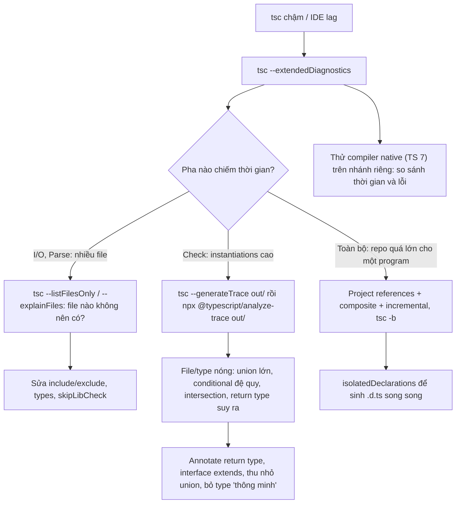
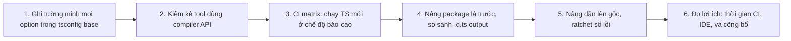

## Bối cảnh & vấn đề

Monorepo có 40 package, 300.000 dòng TypeScript. `tsc -b` trong CI mất 4 phút, IDE mất 20 giây để hiện lỗi sau khi sửa một file, và dev bắt đầu tắt type-check trong editor. Một nhóm đề xuất chuyển hết sang swc để "nhanh hơn", quên rằng swc không type-check. Nhóm khác đề xuất nâng lên TypeScript 7 (compiler native viết lại bằng Go) mà chưa kiểm tra ts-jest, typescript-eslint và một transformer tự viết có chạy với TS 7 không.

Cùng lúc, codebase có 1.200 chỗ `any` và 300 `@ts-ignore`, phần lớn từ giai đoạn migrate từ JavaScript, và số lượng tăng đều mỗi sprint, một phần do code sinh bởi AI assistant: khi gặp lỗi type khó, AI có xu hướng "cho qua" bằng `as any` hoặc `as unknown as T` thay vì sửa logic.

Đây là những vấn đề của **quy mô** và **con người**, không phải của cú pháp. Bài này trình bày cách đo tốc độ type-check và các đòn bẩy thật sự có tác dụng, lộ trình nâng version cho nhiều package, chính sách escape hatch mà team có thể duy trì, và cách dùng type như một công cụ review code (kể cả code do AI sinh).

**Interview angle:** câu scenario "tsc 4 phút" chấm điểm ở chỗ bạn **đo trước** (`--extendedDiagnostics`, `--generateTrace`) hay đoán; câu "nâng version cho dozens of packages" chấm ở chỗ bạn nghĩ tới tool phụ thuộc compiler API và rollout từng bước.

## Khái niệm

### Các pha của tsc và chỗ thời gian đi

`tsc` làm năm việc: đọc file (**I/O**), **parse** thành AST, **bind** (tạo symbol, scope), **check** (suy ra và so sánh type, phần đắt nhất), và **emit** (JavaScript, `.d.ts`, source map). `--extendedDiagnostics` in thời gian từng pha cùng số file, số dòng, số **type** và **instantiation** (số lần một generic được khởi tạo với type cụ thể). Check time cao kèm instantiation cao thường chỉ ra type phức tạp (conditional đệ quy, union lớn, intersection lồng nhau); I/O hay parse cao chỉ ra program quá lớn (quét cả `dist`, `node_modules` có `.ts`, `include` quá rộng).

### Thủ phạm hay gặp

Theo TypeScript Performance wiki và kinh nghiệm thực tế: **union rất lớn** (mỗi phép so sánh với union N member là O(N), và với hai union là O(N×M)); **template literal type** sinh tích Descartes (bài [conditional & mapped](/tracks/typescript/learn/conditional-mapped-types)); **conditional type đệ quy** sâu; **intersection lớn** thay vì `interface extends` (interface được cache quan hệ, intersection phải tính lại); **return type không annotate** của function export lớn (compiler phải suy ra và in lại type đó vào `.d.ts`, đôi khi thành hàng nghìn ký tự); và cấu hình: `include` quét thư mục không cần, thiếu `skipLibCheck`, `types` tự include mọi `@types`.

### Project references, composite, incremental

**Project references** chia monorepo thành nhiều project tsc, mỗi project có `tsconfig.json` với `composite: true` và khai báo `references` tới project nó phụ thuộc. `tsc -b` build theo thứ tự dependency, và một project phụ thuộc chỉ đọc **`.d.ts`** của project khác thay vì type-check lại source của nó. Kết hợp **`incremental`** (lưu trạng thái vào `.tsbuildinfo`), sửa một package lá chỉ phải check lại package đó và những gì phụ thuộc vào nó. Đổi lại: cấu hình phức tạp hơn, phải giữ `references` đồng bộ với dependency trong `package.json`, và circular dependency giữa package bị cấm.

### isolatedDeclarations (TS 5.5)

Để sinh `.d.ts` cho một file, tsc bình thường phải type-check nó (để biết return type suy ra). **`isolatedDeclarations`** yêu cầu mọi export có type **đủ tường minh** để một công cụ khác (oxc, swc, hoặc tsc) sinh `.d.ts` **chỉ từ cú pháp của file đó**, song song và không cần type-check. Trade-off rơi vào developer: function export phải annotate return type, và export const phức tạp phải có annotation (literal đơn giản như `{ retries: 3 }` thì không cần). Lợi ích lớn nhất ở monorepo có project references, nơi `.d.ts` là "hợp đồng" giữa các package.

### TS 7: compiler native

Microsoft viết lại compiler bằng Go (dự án "Corsa", phát hành thành TypeScript 7); bài công bố nói nhanh khoảng **10 lần** nhờ code native và chạy song song. TS 6.0 là bản cầu nối: đổi default và deprecate các option mà TS 7 xoá hẳn (bài [tsconfig](/tracks/typescript/learn/tsconfig-modules)). Điểm cần kiểm tra trước khi nâng: tool dùng **compiler API** kiểu JavaScript cũ (ts-jest, ts-morph, ts-patch/transformer tự viết, một số plugin của typescript-eslint, NestJS CLI plugin) có thể chưa tương thích, vì API của compiler native khác (verify tình trạng hỗ trợ của từng tool tại thời điểm nâng).

### Escape hatch: any, as, !, @ts-ignore, @ts-expect-error

Escape hatch là mọi cơ chế bảo compiler "đừng kiểm tra chỗ này". Chúng có chỗ đứng hợp lý: adapter cho thư viện không có type, test cố ý truyền dữ liệu sai, giai đoạn migrate. Vấn đề là chúng **lây** và **ẩn**: `any` lan sang biểu thức khác, `@ts-ignore` tiếp tục che lỗi sau khi lỗi gốc đã được sửa (và che luôn lỗi **mới** trên cùng dòng). `@ts-expect-error` tốt hơn `@ts-ignore` vì nó **báo lỗi khi không còn lỗi nào để che**, nên tự dọn dẹp. Rule `@typescript-eslint/ban-ts-comment` cho phép `@ts-expect-error` kèm mô tả tối thiểu và cấm `@ts-ignore`.

### Đo và ratchet

Chính sách chỉ có tác dụng khi **đo được**. `type-coverage` đếm tỉ lệ identifier có type khác `any`; lint `no-explicit-any` và `no-unsafe-*` ở mức `warn` cho biết số lượng theo thư mục. **Ratchet** nghĩa là CI lưu con số hiện tại và fail nếu con số **tăng**; nó không bắt sửa hết ngay, chỉ bắt không tệ hơn. Kết hợp với "khoanh vùng": escape hatch được phép trong thư mục `adapters/` hay `*.test.ts`, bị cấm trong `domain/`.

### Type như công cụ review, kể cả code AI

Type là **hợp đồng** đọc được: review một PR bắt đầu từ diff của signature public (tham số, return type, `.d.ts`) cho biết nhanh thay đổi ảnh hưởng tới đâu. Với code do AI assistant sinh, các lỗi type-level lặp lại có tính quy luật: `as any` hoặc `as unknown as T` để vượt lỗi compile; `!` rải rác; type guard chỉ kiểm tra một field; sửa **type** cho khớp code sai (đổi `User` thành `User | undefined` ở chỗ không nên) thay vì sửa logic; bỏ qua tham số tenant/permission vì "cho gọn"; `// @ts-ignore` trên dòng khó. Các lỗi này đều bị bắt tự động nếu CI có strict + lint `no-unsafe-*`/`ban-ts-comment`/`no-non-null-assertion`, và review tập trung vào diff type.

**Interview angle:** câu behavioral "bạn bắt được lỗi TypeScript gì trong code AI" cần một ví dụ cụ thể có thật của bạn, cơ chế kiểm soát (CI, lint, review checklist), và một reflection: type khớp không có nghĩa logic đúng.

## Cơ chế hoạt động

Quy trình chẩn đoán tsc chậm:



Thứ tự quan trọng: **đo trước**, rồi sửa đúng pha. Nếu phần lớn thời gian nằm ở I/O và parse, không có tối ưu type nào giúp; nếu nằm ở check với instantiation tăng vọt, project references chỉ chia nhỏ vấn đề mà không loại bỏ nó. TS 7 là đòn bẩy lớn nhất về hằng số, nhưng không sửa type có độ phức tạp bùng nổ.

Lộ trình nâng version cho nhiều package:



## Ví dụ thực tế

### Đo: TS 5.9 so với TS 7 trên chính repo DevRecall

Chạy `tsc -p . --noEmit --incremental false --extendedDiagnostics` trên repo Next.js của app này (1.035 file trong program, phần lớn là `.d.ts` của Next.js, React và Node), máy macOS, Node 24, lần chạy thứ hai (cache hệ điều hành đã ấm):

```text
--- TS 5.9.3
Files:                        1035
Types:                       16778
Instantiations:              32228
Memory used:               326607K
Program time:                0.80s
Check time:                  0.79s
Total time:                  1.75s
real 1.86

--- TS 7.0.2
Files:                   1035
Lines:                 232501
Types:                  31332
Instantiations:         53719
Memory used:          182099K
Parse time:            0.101s
Check time:            0.076s
Total time:            0.206s
real 0.32
```

Trên project nhỏ này, TS 7 nhanh khoảng **8 lần** theo "Total time" và gần **6 lần** theo wall clock (kể cả thời gian khởi động process), dùng ít bộ nhớ hơn. Số `Types`/`Instantiations` khác nhau vì hai compiler đếm khác nhau, đừng so sánh chúng giữa version. Với `incremental: true` (mặc định trong tsconfig của Next.js), lần chạy đầu của TS 5.9 mất 8,5 giây vì phải ghi `.tsbuildinfo`; đó là lý do phải đo nhiều lần và ghi rõ điều kiện. Con số của bạn sẽ khác; đây là cách đo, không phải benchmark.

### Tool phụ thuộc compiler API gãy với TS 7

Trong lúc chuẩn bị bài này, `type-coverage` được cài vào một project có `typescript@7.0.2` ở root. Nó từ chối chạy:

```text
$ npx type-coverage -p tsconfig.cov.json --detail
type-coverage needs the TypeScript compiler API (ts.createProgram), which typescript@7.0.2 does not export.
Keep typescript@7.0.2 for your project and give type-coverage TypeScript 6. With npm, add this to package.json:
  "overrides": { "type-coverage-core": { "typescript": "npm:@typescript/typescript6@^6" } }
TypeScript 7 support: https://github.com/plantain-00/type-coverage/issues/147
```

Cài lại `typescript@5.9.3` thì tool chạy bình thường. Đây đúng là rủi ro của câu hỏi "upgrade dozens of packages": package `typescript` 7 không còn export API JavaScript `ts.createProgram` mà các tool thế hệ cũ dựa vào, nên mọi thứ gọi compiler API (type-coverage, ts-morph, ts-jest, transformer tự viết, một số rule typed lint) phải được kiểm kê. Lối thoát tạm thời như thông báo gợi ý: giữ một bản TypeScript 6 riêng cho tool qua `overrides`, còn project type-check bằng TS 7 (tên package và cách làm ghi theo thông báo của tool tại thời điểm viết; verify).

### isolatedDeclarations: cái giá cho developer

```ts
export function total(items: { price: number }[]) { return items.reduce((s, i) => s + i.price, 0); }
export const config = { retries: 3 };
export function total2(items: { price: number }[]): number { return items.reduce((s, i) => s + i.price, 0); }
```

```text
$ tsc --noEmit --declaration --isolatedDeclarations iso.ts
iso.ts(1,17): error TS9007: Function must have an explicit return type annotation with --isolatedDeclarations.
```

`total` bị từ chối vì return type phải được suy ra; `total2` có annotation nên qua. `config` là object literal đơn giản, suy ra được từ cú pháp nên không cần annotation. Với code ứng dụng (không publish `.d.ts`), flag này thường không đáng; với package trong monorepo có project references, nó cho phép sinh `.d.ts` song song và giữ API public tường minh.

### Chạm trần union trong một permission type

```ts
type D = 0|1|2|3|4|5|6|7|8|9;
type Resource = `res${D}${D}`;                                     // 100
type Action = "read" | "write" | "delete" | "export" | "approve" | `custom${D}`; // 15
type Permission = `${Resource}:${Action}`;                          // 1.500
export type PermissionPairs = `${Permission}|${Resource}`;          // 150.000
```

```text
slow.ts(9,31): error TS2590: Expression produces a union type that is too complex to represent.
Check time: 1.00s     (bỏ dòng PermissionPairs: 0.71s, bằng file rỗng có @types/node)
```

1.500 permission không tốn gì đáng kể; ghép thêm một tầng thì compiler dừng lại. Khi trace chỉ ra một type như thế, sửa là **đổi thiết kế** (brand + validate runtime) chứ không phải tối ưu cú pháp.

### Chính sách escape hatch trong ESLint

```js
// eslint.config.mjs (trích)
export default [
  {
    files: ["src/**/*.ts"],
    rules: {
      "@typescript-eslint/no-explicit-any": "error",
      "@typescript-eslint/no-unsafe-assignment": "error",
      "@typescript-eslint/no-unsafe-member-access": "error",
      "@typescript-eslint/no-non-null-assertion": "error",
      "@typescript-eslint/ban-ts-comment": ["error", { "ts-ignore": true, "ts-expect-error": "allow-with-description", minimumDescriptionLength: 10 }],
    },
  },
  { files: ["src/adapters/**/*.ts", "**/*.test.ts"], rules: { "@typescript-eslint/no-explicit-any": "warn", "@typescript-eslint/no-unsafe-assignment": "warn" } },
];
```

(Cấu hình minh hoạ, không phải output chạy thật.) Domain layer không có ngoại lệ; adapter và test được nới thành warning để vẫn hiện trong báo cáo. Một bước CI chạy `npx type-coverage --at-least 97` (con số lấy từ hiện trạng) làm ratchet: coverage chỉ được tăng.

### Checklist review cho PR (kể cả do AI sinh)

- Diff có thêm `as any`, `as unknown as`, `!`, `@ts-ignore`? Mỗi cái cần một lý do cụ thể trong PR.
- Signature public đổi (tham số, return type, `.d.ts` output)? Ai gọi nó, và caller cũ có vỡ không?
- Type guard/`x is T` mới: có test với payload xấu không?
- Type bị **nới** (`User` thành `User | undefined`, `string` thành `string | any`) để hết lỗi thay vì sửa logic?
- Query/repository mới có nhận tenant context và permission check như các chỗ khác không?
- Dữ liệu từ ngoài (HTTP, queue, file) có đi qua schema, hay được cast?

Đây là những câu một reviewer hỏi được trong vài phút, và chúng bắt đúng loại lỗi mà AI assistant hay tạo ra: code compile, type khớp, logic sai. Trả lời câu behavioral bằng một ví dụ thật của bạn theo khung STAR (loại task, lỗi cụ thể bắt được, cơ chế đã thêm vào CI, kết quả đo được).

## Trade-offs & lựa chọn thay thế

| Đòn bẩy | Tác dụng | Chi phí | Khi nào |
|---|---|---|---|
| Sửa `include`/`types`/`skipLibCheck` | Bớt file, bớt check `.d.ts` | Gần như không | Luôn kiểm tra đầu tiên |
| Annotate return type export, `interface extends` | Giảm công suy ra và in type | Viết thêm annotation | Khi trace chỉ ra type nóng |
| Project references + incremental | Chỉ check lại phần thay đổi | Cấu hình, cấm circular | Monorepo nhiều package |
| `isolatedDeclarations` | Sinh `.d.ts` song song | Annotation bắt buộc cho export | Package publish/tham chiếu nhau |
| Transpile bằng swc/esbuild | Build/test nhanh | Không type-check: vẫn cần `tsc --noEmit` | Dev loop, test runner |
| TS 7 native | Nhanh ~chục lần | Tool dùng compiler API cũ có thể vỡ | Sau khi kiểm kê tool |
| Strict tuyệt đối, cấm mọi escape hatch | An toàn tối đa | Chặn migrate, dev tìm cách lách | Hiếm khi thực tế |
| Khoanh vùng + ratchet | Không tệ đi, cải thiện dần | Phải đo và duy trì CI | Codebase có lịch sử |

Chọn thế nào: bắt đầu từ cấu hình (rẻ nhất), đo bằng trace trước khi viết lại type, và dùng project references khi repo thật sự có ranh giới package. Nâng TS 7 khi tool chain sẵn sàng, bắt đầu bằng chạy song song trong CI (type-check bằng TS 7, build vẫn như cũ). Về con người: một chính sách escape hatch có đo lường và ratchet bền vững hơn một lệnh cấm tuyệt đối; và ưu tiên type **dễ đọc** hơn type "thông minh", vì chi phí onboarding và error message khó hiểu cũng là chi phí thật.

## Edge cases & failure modes

- **Đo sai điều kiện**: lần chạy đầu với cache lạnh hoặc `.tsbuildinfo` cũ cho số liệu gấp nhiều lần; so sánh luôn cùng máy, cùng cờ, nhiều lần.
- **IDE chậm nhưng CLI nhanh**: tsserver type-check theo file đang mở và có thể load nhiều project; kiểm tra plugin editor, `tsserver.maxTsServerMemory`, và file `.d.ts` rất lớn được sinh tự động (Prisma client, GraphQL codegen).
- **Project references lệch với package.json**: package A import B nhưng `references` thiếu B; `tsc -b` build sai thứ tự hoặc đọc `.d.ts` cũ. Có tool đồng bộ tự động (ví dụ trong Nx, Turborepo plugin, hoặc script).
- **Nâng TS vỡ ngầm vì flag strict mới**: nhóm `strict` thêm flag ở version mới (như `strictBuiltinIteratorReturn` ở 5.6) sinh lỗi mới; đọc release notes và chạy CI matrix trước.
- **`@ts-expect-error` trên dòng có nhiều lỗi**: nó che **tất cả**; khi lỗi dự kiến đã sửa nhưng lỗi khác xuất hiện, directive vẫn "hợp lệ". Giữ mỗi directive trên một biểu thức nhỏ.
- **Ratchet bị lách**: dev chuyển `any` thành `unknown as T` hoặc `Function`; đo cả `no-unsafe-*` lẫn số `as`, không chỉ `any`.
- **AI sửa test thay vì sửa code**: test type (`expectTypeOf`) bị đổi cho khớp type sai; review diff của test cũng quan trọng như diff của code.

## Pitfalls

- ❌ "tsc chậm, chuyển hết sang swc" → ✅ swc chỉ transpile; đo bằng `--extendedDiagnostics`/`--generateTrace`, sửa nguyên nhân, và giữ `tsc --noEmit` trong CI.
- ❌ Tối ưu type trước khi đo → ✅ xác định pha tốn thời gian; I/O/parse cao thì sửa cấu hình, check cao thì tìm type nóng qua trace.
- ❌ Nâng TypeScript major cho cả monorepo trong một PR → ✅ ghi option tường minh, kiểm kê tool, CI matrix, nâng từ package lá, so sánh `.d.ts`.
- ❌ Dùng `@ts-ignore` → ✅ `@ts-expect-error` kèm mô tả (tự báo khi không còn cần), lint cấm `@ts-ignore`.
- ❌ Cấm tuyệt đối `any` trong mọi file → ✅ khoanh vùng (adapter, test), đo bằng type-coverage và ratchet trong CI.
- ❌ Type "thông minh" nhiều tầng conditional mà team không đọc được lỗi → ✅ type đơn giản hơn, ít chính xác hơn một chút nhưng dễ bảo trì; đặt type phức tạp trong thư viện có test type.
- ❌ Tin code AI vì "type đã khớp" → ✅ review diff type, cấm escape hatch trong CI, yêu cầu test; type khớp không có nghĩa logic đúng.

## Tóm tắt

- tsc có các pha I/O, parse, bind, check, emit; `--extendedDiagnostics` cho biết pha nào tốn, `--generateTrace` + `@typescript/analyze-trace` chỉ ra file/type nóng.
- Thủ phạm hay gặp: union lớn, template literal bùng nổ, conditional đệ quy, intersection lớn, return type suy ra ở export lớn, `include` quá rộng.
- Project references + `composite` + `incremental` chỉ check lại phần thay đổi; `isolatedDeclarations` cho `.d.ts` song song, đổi lại annotation bắt buộc.
- TS 7 (native, Go) nhanh cỡ chục lần; TS 6.0 là bản cầu nối đổi default. Kiểm kê tool dùng compiler API trước khi nâng, rollout từ package lá.
- Escape hatch có chỗ đứng nhưng phải khoanh vùng, đo (type-coverage, lint) và ratchet; `@ts-expect-error` thay `@ts-ignore`.
- Type là hợp đồng giúp review nhanh; code AI hay "cho qua" bằng `as any`, `!`, nới type. CI strict + lint + review diff type bắt được phần lớn.
