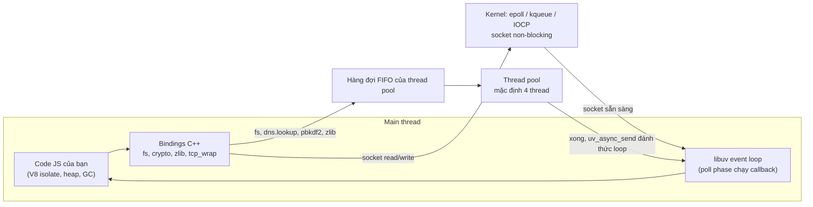
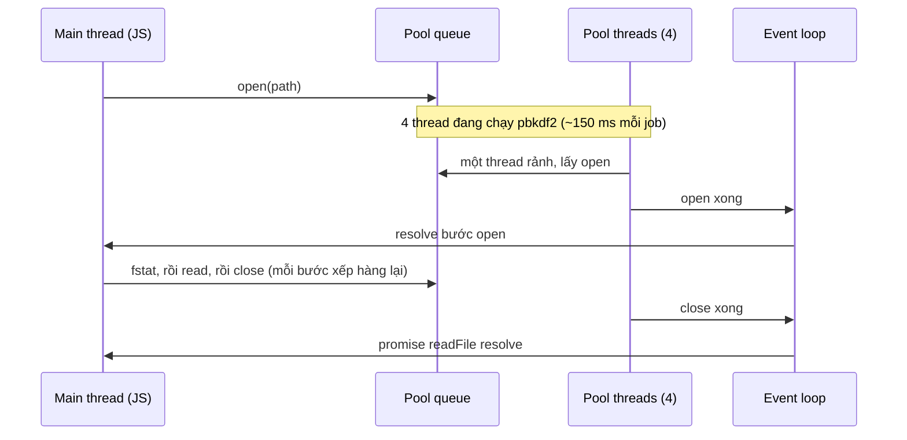

## Bối cảnh & vấn đề

Một buổi phỏng vấn thường mở đầu bằng câu "Node.js là single-threaded đúng không?". Ứng viên trả lời "đúng" thì bị hỏi tiếp "vậy `fs.readFile` chạy ở đâu?". Trả lời "sai, Node có thread pool" thì bị hỏi "vậy sao hai request không chạy JavaScript song song được?". Cả hai câu trả lời một chữ đều hụt, vì Node là **hai thứ lồng nhau**: JavaScript của bạn chạy trên **một** thread, còn process Node thì có **nhiều** thread làm việc hộ.

Hiểu sai điểm này gây sự cố thật. Một team thêm `crypto.pbkdf2` bản async vào login, đúng như sách dạy "đừng dùng bản Sync". Giờ cao điểm, login chậm là điều dễ đoán; điều khó đoán là endpoint đọc template từ đĩa và endpoint gọi API nội bộ bằng hostname cũng chậm theo, trong khi event loop lag vẫn thấp. Lý do: bốn thread của libuv đều đang băm mật khẩu, còn `fs.readFile` và `dns.lookup` phải xếp hàng sau chúng. Không ai "chặn event loop", nhưng một tài nguyên dùng chung khác đã cạn.

Bài này vẽ lại bản đồ runtime: V8 làm gì, libuv làm gì, lớp binding C++ nối hai thứ ra sao, việc gì đi qua OS và việc gì đi qua thread pool. Mô hình I/O ở tầng OS (blocking, non-blocking, epoll/kqueue) đã có trong bài [I/O models & libuv](/tracks/os-concurrency/learn/io-models-libuv), và mô hình event loop chung của JavaScript ở bài [event loop](/tracks/javascript/learn/event-loop). Ở đây ta đi vào phía Node: một lời gọi API cụ thể đi đường nào, tốn thread nào, và nghẽn ở đâu.

**Interview angle:** câu hỏi "single-threaded?" là cửa vào. Điều interviewer muốn nghe là bạn phân biệt được **thread chạy JS** với **thread của process**, và biết thread pool là tài nguyên có hạn dùng chung cho fs, DNS, crypto, zlib.

## Khái niệm

### V8: engine chạy JavaScript và quản lý heap

**V8** là JavaScript engine của Chrome, được Node nhúng vào. V8 parse code, biên dịch JIT (Ignition interpreter, rồi các tầng tối ưu như Maglev/TurboFan), giữ **heap** chứa object JavaScript và chạy **garbage collector**. V8 không biết gì về file, socket hay timer: đặc tả ECMAScript không có I/O. Một `setTimeout` hay `fs.readFile` đều là thứ **host** (browser hoặc Node) cung cấp.

Mỗi lần bạn có một **isolate** V8 là có một heap riêng và một call stack JS riêng. Process Node bình thường có đúng một isolate chạy code của bạn (main thread). Mỗi `worker_threads` tạo thêm một isolate khác, với heap và event loop riêng. V8 tự dùng vài thread nền cho GC song song/concurrent và biên dịch nền, nhưng những thread đó không chạy code JS của bạn.

### libuv: event loop, async I/O và thread pool

**libuv** là thư viện C cung cấp cho Node ba thứ: **event loop** (vòng lặp lấy sự kiện và gọi callback), lớp trừu tượng **async I/O** đa nền tảng (epoll trên Linux, kqueue trên macOS/BSD, IOCP trên Windows), và một **thread pool** cho những việc mà OS không có API non-blocking phù hợp. Ngoài ra libuv lo timer, signal, child process, pipe, TTY.

libuv phân biệt hai loại đối tượng. **Handle** là thứ sống lâu và có thể phát sự kiện nhiều lần: TCP server, socket, timer, signal watcher. **Request** là một thao tác ngắn hạn, hoàn thành một lần: một lần ghi socket, một lần `fs.open`, một lần `getaddrinfo`. Event loop còn sống chừng nào còn handle đang active (được "ref") hoặc request đang chờ; hết cả hai thì process thoát. Đây là lý do một `setInterval` quên `unref()` giữ cho script CLI không bao giờ kết thúc.

### Bindings: nơi API Node gặp C/C++

Khi bạn gọi `fs.readFile`, code JS trong `lib/fs.js` của Node gọi xuống một **binding** C++ (`internalBinding('fs')`). Binding tạo một request libuv (ví dụ `uv_fs_t`), gắn callback JS vào nó rồi giao cho libuv. Tương tự, `crypto` nối tới OpenSSL, `zlib` tới zlib, `http` dùng parser `llhttp`, còn `fetch` dùng undici (viết bằng JS trên `net`). Lớp binding là lý do vì sao "Node" không chỉ là V8 + libuv: còn OpenSSL, c-ares, llhttp, ICU, zlib, simdjson, v.v.

Hệ quả thực tế: mỗi API có một **đường thực thi** khác nhau. Có API xong ngay trên main thread (`Buffer.from`, `JSON.parse`), có API giao cho OS và chờ sự kiện (`socket.write`), có API chạy trên thread pool (`fs.readFile`, `crypto.pbkdf2`). Muốn chẩn đoán nghẽn, bạn phải biết API mình dùng thuộc đường nào.

### "Single-threaded" đúng ở đâu, sai ở đâu

Câu đúng là: **code JavaScript của bạn** (trên main thread) chạy trên một thread, một call stack, theo nguyên tắc run-to-completion. Hai HTTP handler không bao giờ chạy JS cùng lúc trong cùng isolate, nên bạn không cần mutex cho biến JS thông thường, nhưng một handler tính toán 200 ms làm mọi handler khác chờ 200 ms.

Câu sai là: "process Node chỉ có một thread". Đếm thật trên macOS với Node 24: process vừa khởi động có **7 thread** (main, các thread nền của V8 platform, thread cho inspector/signal). Sau lần dùng `fs` đầu tiên, libuv khởi tạo pool và con số lên **11** (thêm 4 thread pool). Chạy với `UV_THREADPOOL_SIZE=16` thì thành **23**. Thread pool được khởi tạo **lười**, ở lần đầu tiên có việc cho nó, và kích thước cố định từ đó.

### Network I/O không dùng thread pool

Socket (TCP, UDP, HTTP, WebSocket) được đặt ở chế độ **non-blocking** và đăng ký với cơ chế multiplexing của OS. Ở **poll phase**, libuv hỏi kernel "trong hàng nghìn socket này, cái nào có dữ liệu hoặc ghi được?" bằng một lời gọi `epoll_wait`/`kevent`, rồi chạy callback tương ứng. Không có thread nào ngồi chờ một socket cụ thể. Mỗi connection chỉ tốn bộ nhớ: một file descriptor, buffer của kernel, và vài object JS (socket, parser, request/response).

Vì vậy một process Node phục vụ được 10.000 connection đồng thời (bài toán **C10k**) mà không cần 10.000 thread. Giới hạn thực tế đến từ chỗ khác: `ulimit -n` (số file descriptor), memory mỗi connection, CPU cho TLS và JSON, và quan trọng nhất là **thời gian mỗi callback**: 10.000 connection chia nhau một thread JS, nên callback nào chậm là tất cả chậm.

### Thread pool: ai dùng, ai không

libuv dùng thread pool cho việc mà OS không có async API tốt, hoặc việc CPU nặng mà Node chủ động đẩy khỏi main thread:

| Đi qua thread pool | Không đi qua thread pool |
|---|---|
| Hầu hết `fs.*` async (open, read, stat, readFile là **nhiều** request liên tiếp) | TCP/UDP/HTTP/TLS socket I/O (epoll/kqueue/IOCP) |
| `dns.lookup` (gọi `getaddrinfo` của OS, là mặc định của `http`, `net`, `fetch`) | `dns.resolve*`, `dns.Resolver` (c-ares, non-blocking) |
| `crypto.pbkdf2`, `scrypt`, `randomBytes`/`randomFill` (async), `generateKeyPair` | Timer, signal, `setImmediate` |
| `zlib` async (`gzip`, `deflate`, stream zlib) | Code JS thuần, `JSON.parse`, regex (chạy trên main thread) |
| Native addon dùng async work (`bcrypt`, `sharp`, một số driver) | `fs.watch` trên nền dùng inotify/FSEvents |

Pool mặc định **4 thread**, tối đa 1024, cấu hình bằng biến môi trường `UV_THREADPOOL_SIZE`. Pool là **toàn cục cho cả process**: mọi `worker_threads` trong cùng process dùng chung một pool dù mỗi worker có event loop riêng (đo trên Node 24: một worker chạy 4 job `pbkdf2` làm `readFile` của main thread mất 146 ms thay vì vài ms). Một việc chiếm một thread pool từ đầu tới cuối, không bị chia nhỏ; `pbkdf2` 600.000 vòng chiếm thread đó hàng trăm ms.

**Interview angle:** "Network requests run on the thread pool" là red flag kinh điển. Nhưng cũng đừng nói "HTTP không liên quan gì tới pool": outbound HTTP tới **hostname** gọi `dns.lookup`, và bước đó đi qua pool.

## Cơ chế hoạt động

Sơ đồ dưới đây cho thấy ba đường thực thi chính trong một process Node.



Đọc sơ đồ từ trái qua: code JS gọi một API; binding quyết định đường đi. Với socket, binding đăng ký file descriptor với kernel rồi **return ngay**; khi kernel báo socket sẵn sàng, poll phase của event loop chạy callback. Với fs/DNS/crypto, binding đẩy một **work request** vào hàng đợi FIFO của pool; một thread rảnh lấy việc ra, chạy lời gọi blocking (ví dụ `read(2)` hay `getaddrinfo`), xong thì báo về loop qua một async handle. Callback JS **luôn** chạy trên main thread, không bao giờ chạy trên thread pool.

Hai hệ quả rút ra từ sơ đồ. Thứ nhất, cả hai đường đều đổ về **một** event loop: nếu JS chạy lâu, callback của cả socket lẫn pool đều phải chờ. Thứ hai, đường pool có một **hàng đợi chung**: một loại việc chậm (hash mật khẩu, DNS resolver chậm, disk NFS chậm) làm mọi loại việc khác cùng đi pool bị trễ, dù event loop vẫn rảnh.

Trình tự chi tiết của một `fs.promises.readFile` khi pool đang bận:



`readFile` không phải một request mà là chuỗi `open → fstat → read (có thể nhiều lần) → close`, mỗi bước là một work request riêng. Khi hàng đợi có sẵn các job pbkdf2, **mỗi bước** phải chờ tới lượt. Đó là lý do trong ví dụ bên dưới, đọc một file 1 KB mất gần bằng thời gian của cả loạt hash.

## Ví dụ thực tế

### Đếm thread của một process Node

```js
// threads.cjs (macOS: ps -M; Linux: ls /proc/<pid>/task | wc -l)
const { execFileSync } = require('node:child_process');
const count = () => execFileSync('ps', ['-M', '-p', String(process.pid)]).toString().trim().split('\n').length - 1;
console.log('at startup:', count(), 'threads');
require('node:fs').readFile(__filename, () => {
  console.log('after first fs.readFile (libuv pool started):', count(), 'threads');
});
```

```text
$ node threads.cjs
at startup: 7 threads
after first fs.readFile (libuv pool started): 11 threads
$ UV_THREADPOOL_SIZE=16 node threads.cjs
at startup: 7 threads
after first fs.readFile (libuv pool started): 23 threads
```

Node 24.21 trên macOS (8 core). Con số khởi động phụ thuộc platform và version, nhưng mô hình thì không đổi: pool được tạo lười ở lần dùng đầu, đúng bằng `UV_THREADPOOL_SIZE` thread.

### 5.000 connection, số thread không đổi

```js
// c10k.mjs: một server echo + 5.000 client trong cùng process
import net from 'node:net';
import { execSync } from 'node:child_process';
const N = Number(process.argv[2] ?? 5000);
const threads = () => execSync(`ps -M -p ${process.pid} | tail -n +2 | wc -l`).toString().trim();
const mb = (b) => (b / 1048576).toFixed(0) + ' MB';
let open = 0;
const server = net.createServer((s) => { open++; s.on('data', (d) => s.write(d)); s.on('error', () => {}); });
server.listen(0, async () => {
  const { port } = server.address();
  console.log(`before: threads=${threads()} rss=${mb(process.memoryUsage().rss)}`);
  const clients = [];
  for (let i = 0; i < N; i++) {
    const c = net.connect(port); c.on('error', () => {}); clients.push(c);
    if (i % 500 === 0) await new Promise((r) => setImmediate(r));
  }
  while (open < N) await new Promise((r) => setTimeout(r, 20));
  console.log(`after ${N} server-side sockets (+${N} client sockets in same process): threads=${threads()} rss=${mb(process.memoryUsage().rss)}`);
  let echoed = 0; const t = performance.now();
  for (const c of clients) { c.once('data', () => { if (++echoed === N) { console.log(`echo round-trip on all ${N}: ${(performance.now() - t).toFixed(0)} ms`); process.exit(0); } }); c.write('ping'); }
});
```

```text
$ ulimit -n 30000 && node c10k.mjs 5000
before: threads=7 rss=47 MB
after 5000 server-side sockets (+5000 client sockets in same process): threads=12 rss=93 MB
echo round-trip on all 5000: 168 ms
$ node c10k.mjs 1000
after 1000 server-side sockets (+1000 client sockets in same process): threads=12 rss=69 MB
```

10.000 socket (hai đầu của 5.000 connection) chỉ thêm khoảng 46 MB RSS, tức vài KB mỗi socket. Số thread là 12 cho cả 1.000 lẫn 5.000 connection: 5 thread tăng thêm so với lúc khởi động chủ yếu là **thread pool** (4 thread): `net.connect(port)` mặc định host `localhost`, tức gọi `dns.lookup`, và lần lookup đầu tiên khởi tạo pool. Không có thread nào theo connection. Mô hình thread-per-connection với stack 1–8 MB mỗi thread sẽ cần hàng GB chỉ cho stack. Lưu ý dòng `ulimit -n`: trong container, giới hạn file descriptor thường là thứ chạm trần đầu tiên (xem [EMFILE](/tracks/os-concurrency/learn/io-models-libuv)).

### Thread pool bão hoà: pbkdf2 làm chậm readFile

```js
// pool.mjs
import crypto from 'node:crypto';
import { readFile } from 'node:fs/promises';
const t0 = performance.now();
const ms = () => (performance.now() - t0).toFixed(0).padStart(4);
for (let i = 0; i < 8; i++) {
  crypto.pbkdf2('pw', 'salt', 300_000, 64, 'sha512', () => console.log(`${ms()}ms pbkdf2 #${i} done`));
}
readFile(import.meta.filename).then(() => console.log(`${ms()}ms readFile done  <-- a 1 KB file`));
setTimeout(() => console.log(`${ms()}ms setTimeout(10) fired (event loop is free)`), 10);
```

```text
$ node pool.mjs
  15ms setTimeout(10) fired (event loop is free)
 153ms pbkdf2 #2 done
 160ms pbkdf2 #0 done
 167ms pbkdf2 #1 done
 173ms pbkdf2 #3 done
 262ms pbkdf2 #5 done
 267ms readFile done  <-- a 1 KB file
 270ms pbkdf2 #6 done
 273ms pbkdf2 #4 done
 300ms pbkdf2 #7 done
$ UV_THREADPOOL_SIZE=16 node pool.mjs
   5ms readFile done  <-- a 1 KB file
  15ms setTimeout(10) fired (event loop is free)
 143ms pbkdf2 #2 done
 ...
 187ms pbkdf2 #6 done
```

Với pool 4 thread, 8 job hash chạy thành **hai đợt** (xong ở ~160 ms và ~270 ms), và đọc một file 1 KB mất **267 ms** vì các bước open/stat/read/close của nó xếp hàng sau hash. Timer 10 ms vẫn chạy đúng giờ ở 15 ms: event loop không bị chặn, chính **pool** bị chặn. Tăng pool lên 16 thì readFile xong trong 5 ms và 8 hash chạy song song một đợt (máy 8 core).

Đây chính là tình huống của câu hỏi login: `pbkdf2` async làm chậm các endpoint chỉ dùng `fs` và `fetch` tới hostname (qua `dns.lookup`). Dấu hiệu chẩn đoán: latency tăng ở endpoint "không liên quan", CPU cao, nhưng event loop delay thấp. Cách sửa theo thứ tự: tăng `UV_THREADPOOL_SIZE` phù hợp số core **thực** của container; tách hash sang worker pool riêng hoặc service auth riêng; giảm số lần `dns.lookup` bằng keep-alive và cache DNS; rate limit endpoint login. Nếu dùng `bcrypt` (native) thì nó cũng chạy trên pool; `bcryptjs` thì chạy trên main thread và chặn event loop thay vì chặn pool.

### Chứng minh pool bão hoà chứ không phải disk chậm

Trên production bạn không chèn `console.log` vào pool được, nhưng có vài cách tách hai giả thuyết:

- So latency của `fs.stat` trên một file nhỏ nằm trên tmpfs (không phụ thuộc disk) với latency của `fs.promises.readFile` bình thường. Cả hai cùng chậm → hàng đợi pool; chỉ file trên volume chậm → disk.
- Chạy thử với `UV_THREADPOOL_SIZE` gấp đôi trên một pod canary. Latency fs giảm rõ → pool là nút thắt.
- Đo latency `dns.lookup` của một hostname có trong `/etc/hosts` (không cần mạng). Nó cũng chậm → pool.
- Công cụ: `clinic doctor` gợi ý "I/O issue", còn perf/eBPF (`offcputime`) cho thấy thread pool đều bận.

## Trade-offs & lựa chọn thay thế

| Mô hình | Concurrency cho I/O | CPU song song | Chi phí mỗi connection | Rủi ro chính |
|---|---|---|---|---|
| Node: 1 thread JS + event loop + pool | Rất tốt (C10k+) | Không, trừ khi dùng worker/process | Vài KB | Một callback chậm làm chậm tất cả; pool 4 thread dễ cạn |
| Thread-per-request (Java/Spring MVC cổ điển) | Giới hạn bởi số thread | Có | Stack 0,5–1 MB mỗi thread | Context switch, cạn thread pool khi downstream chậm |
| Virtual threads (Java 21) / goroutine (Go) | Rất tốt | Có (scheduler M:N dùng mọi core) | Vài KB | Cần lock cho shared state; data race thật |
| Async + nhiều core (Rust tokio, .NET async) | Rất tốt | Có | Nhỏ | Độ phức tạp ngôn ngữ; lỗi `Send`/lock |

Chọn thế nào: Node hợp với service **I/O-bound** (API, BFF, gateway, realtime), nơi phần lớn thời gian là chờ DB/HTTP, và với team full-stack TypeScript muốn chung type và công cụ với frontend. Go/Java/Rust hợp hơn khi workload **CPU-bound chủ đạo** (xử lý video, tính toán số lớn, ML inference nặng), khi cần tận dụng mọi core trong một process với shared memory, hoặc khi yêu cầu latency cực thấp và ổn định (GC pause, event loop jitter khó kiểm soát). Một kiến trúc thực tế thường kết hợp: Node cho API và orchestration, service chuyên biệt (hoặc hàng đợi + worker) cho phần nặng.

Về sizing pool: tăng `UV_THREADPOOL_SIZE` là rẻ và hiệu quả khi pool là nút thắt, nhưng nhiều thread hơn số core thực chỉ tăng context switch cho việc CPU-bound như hash. Với disk hay DNS chậm (việc blocking chờ I/O), thread nhiều hơn core vẫn có ích vì thread đang chờ không tốn CPU. Không có con số vàng; đo với tải thật.

**Interview angle:** "Khi nào Node là lựa chọn sai?" đo độ chín chắn. Câu trả lời tốt nêu cả lý do kỹ thuật (CPU-bound, cần multi-core shared memory, latency tail) lẫn lý do tổ chức (kỹ năng team, hệ sinh thái, vận hành sẵn có), và kể một lần bạn đã tách phần việc ra khỏi Node hoặc quyết định không tách.

## Edge cases & failure modes

- **Đặt `UV_THREADPOOL_SIZE` quá muộn**: pool khởi tạo ở lần dùng đầu. Gán `process.env.UV_THREADPOOL_SIZE` trong code sau khi đã có một `fs` call (kể cả do một thư viện import sớm) thì không có tác dụng. Đặt bằng biến môi trường khi start process (Dockerfile `ENV`, manifest K8s).
- **Container CPU limit nhỏ hơn số core máy**: `os.cpus().length` trả về số core của node vật lý (ví dụ 64) trong khi pod chỉ có 2 CPU. Size pool hay worker theo `os.availableParallelism()` (Node 22/24 tôn trọng cgroup quota, xem [container resources](/tracks/os-concurrency/learn/container-resources)) hoặc theo cấu hình rõ ràng.
- **DNS resolver chậm hoặc timeout**: `getaddrinfo` có thể block 5 giây mỗi lần thử khi DNS server không phản hồi. Bốn lookup treo là đủ khoá cả pool, kéo theo mọi `fs` call. Xem bài [HTTP server & client](/tracks/nodejs/learn/http-server-client) cho DNS trong outbound HTTP.
- **Native addon giữ pool lâu**: `sharp`, `bcrypt`, một số driver DB/Kafka dùng pool cho việc dài. Tổng hợp mọi nguồn dùng pool trước khi size.
- **Worker threads dùng chung pool**: tách việc sang `worker_threads` không cho bạn thêm thread pool; nếu worker gọi `fs` hay `zlib` async, chúng tranh cùng 4 thread.
- **Callback chậm ở 10.000 connection**: một handler 50 ms × 200 request/s là 10 giây CPU mỗi giây, không thể đáp ứng. C10k chỉ đúng khi mỗi callback ngắn.
- **Hết file descriptor**: mỗi socket và file mở là một fd. `EMFILE` xuất hiện trước khi RAM hay CPU cạn nếu `ulimit -n` thấp hoặc có leak stream (xem bài [stream pipelines](/tracks/nodejs/learn/stream-pipelines)).

## Pitfalls

- ❌ "Node single-threaded nên chỉ làm được một I/O mỗi lúc" → ✅ chỉ code JS chạy trên một thread; hàng nghìn I/O chờ đồng thời trong kernel hoặc thread pool.
- ❌ "Mỗi request lấy một thread từ pool" → ✅ request HTTP đi qua epoll/kqueue; pool chỉ dành cho fs, `dns.lookup`, crypto, zlib và addon.
- ❌ Dùng bản async của `pbkdf2`/`bcrypt` rồi nghĩ đã hết nghẽn → ✅ việc chuyển từ event loop sang pool 4 thread; đo và size pool, hoặc tách ra worker/service.
- ❌ Gán `process.env.UV_THREADPOOL_SIZE` ở giữa code → ✅ đặt biến môi trường trước khi process start.
- ❌ Size pool theo `os.cpus().length` trong container → ✅ dùng `os.availableParallelism()` hoặc giá trị cấu hình khớp CPU limit.
- ❌ Coi `fs.readFile` là "một thao tác" → ✅ đó là chuỗi open/stat/read/close, mỗi bước xếp hàng lại khi pool bận.
- ❌ Chọn Node cho service mã hoá video "vì team quen JS" mà không tính tới CPU-bound → ✅ tách phần nặng ra service/hàng đợi phù hợp.

## Tóm tắt

- Node = V8 (JS, heap, GC) + libuv (event loop, async I/O, thread pool) + bindings C++ (fs, crypto/OpenSSL, zlib, llhttp, c-ares).
- JavaScript của bạn chạy trên một thread; process có nhiều thread (7 lúc khởi động, +4 khi pool khởi tạo trên Node 24 macOS).
- Socket đi qua epoll/kqueue/IOCP, không dùng thread; 5.000 connection chỉ tốn thêm vài chục MB, không thêm thread.
- Thread pool (mặc định 4, max 1024, `UV_THREADPOOL_SIZE` đặt trước khi start) phục vụ fs, `dns.lookup`, pbkdf2/scrypt/randomBytes, zlib, addon; pool toàn cục cho process.
- Pool bão hoà có dấu hiệu riêng: endpoint dùng fs/DNS chậm, event loop delay vẫn thấp.
- Callback luôn chạy trên main thread; một callback chậm làm chậm mọi connection.
- Node hợp với I/O-bound và full-stack TS; sai lựa chọn khi CPU-bound chủ đạo hoặc cần latency tail cực thấp.
