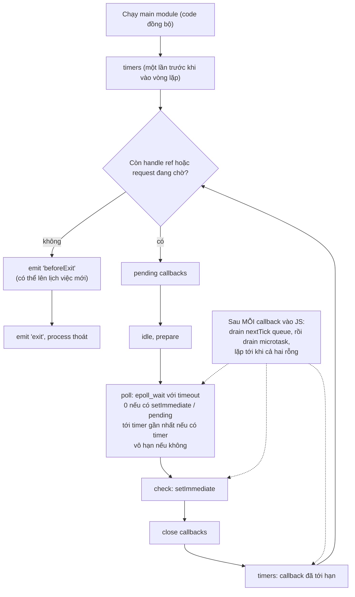
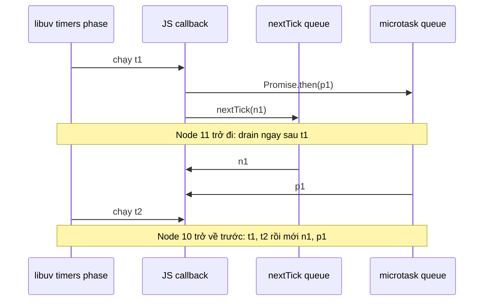

## Bối cảnh & vấn đề

Một job định kỳ dùng `setInterval(syncPrices, 100)`. `syncPrices` là `async function` gọi một API mất khoảng 250 ms. Trên staging mọi thứ ổn; trên production, provider chậm hơn một chút, và log cho thấy **ba** lần sync chạy chồng lên nhau, ghi đè dữ liệu của nhau. Một service khác dùng `process.nextTick` đệ quy để "xử lý nhanh" một hàng đợi nội bộ, và thỉnh thoảng cả process ngừng nhận request suốt vài trăm ms dù CPU không cao bất thường. Một CLI migration chạy xong nhưng **không chịu thoát** vì còn một `setInterval` gửi heartbeat.

Cả ba đều là hiểu nhầm về **event loop của Node**: cụ thể là các **phase** của libuv, vị trí của nextTick queue và microtask queue, và cách timer giữ process sống. Bài [event loop](/tracks/javascript/learn/event-loop) của track JavaScript đã trình bày mô hình chung (task, microtask, run-to-completion) và khác biệt ESM/CJS của nextTick. Bài này đi sâu vào phía libuv: một vòng `uv_run` thật sự làm gì theo thứ tự nào, vì sao poll phase được phép "ngủ", và những hệ quả trong production.

**Interview angle:** interviewer hỏi tên các phase để kiểm tra bạn có từng đọc tài liệu; câu hỏi phân loại người thật sự hiểu là "vì sao poll phase block, và cái gì làm nó thôi chờ?" và "đệ quy nextTick khác đệ quy setImmediate thế nào?".

## Khái niệm

### Vòng lặp uv_run và sáu phase

Event loop là hàm `uv_run` của libuv, chạy trên main thread sau khi module chính chạy xong code đồng bộ. Mỗi vòng (iteration, hay "tick" của loop) đi qua các phase, mỗi phase có **hàng đợi callback riêng**:

1. **timers**: callback của `setTimeout`/`setInterval` đã tới hạn.
2. **pending callbacks**: một số callback I/O bị hoãn từ vòng trước, ví dụ vài loại lỗi TCP như `ECONNREFUSED` trên một số hệ thống.
3. **idle, prepare**: nội bộ; Node dùng một idle handle để báo "đang có setImmediate chờ, đừng ngủ ở poll".
4. **poll**: hỏi kernel sự kiện I/O mới (epoll/kqueue/IOCP) và chạy callback I/O; nếu không có việc gì khác, **block chờ** ở đây.
5. **check**: callback của `setImmediate`.
6. **close callbacks**: callback `'close'` của handle bị đóng đột ngột, ví dụ `socket.destroy()`.

Microtask và nextTick **không phải phase**. Chúng là hai hàng đợi được drain **sau mỗi callback** mà Node gọi vào JavaScript, ở bất kỳ phase nào.

### Poll phase: nơi loop được phép ngủ

Poll phase là lý do Node tốn gần 0% CPU khi rảnh. Trước khi gọi `epoll_wait`, libuv tính một **timeout**: bằng 0 nếu có callback đang chờ ở phase khác (có `setImmediate` pending, có pending callback, loop đang dừng); bằng khoảng thời gian tới **timer gần nhất** nếu có timer; bằng **vô hạn** nếu không có timer nào. Kernel đánh thức loop khi có sự kiện I/O hoặc hết timeout.

Vì vậy "poll block" không phải lỗi, mà là thiết kế: không có việc thì ngủ, có việc thì thức ngay. Điều kiện để nó thôi chờ là: một file descriptor sẵn sàng, một thread pool báo xong (qua async handle, cũng là một fd), timer gần nhất tới hạn, hoặc có `setImmediate` được lên lịch (timeout lúc đó là 0).

### Thứ tự thật trong libuv hiện đại

Tài liệu Node vẽ vòng lặp bắt đầu từ timers. Từ **libuv 1.45** (Node 20), mã nguồn `uv_run` chạy timers **một lần trước khi vào vòng lặp**, rồi mỗi vòng theo thứ tự pending → idle/prepare → poll → check → close → **timers**. Nói cách khác, timers giờ chạy **sau** poll trong cùng iteration. Vì vòng lặp là tuần hoàn nên thứ tự tương đối giữa các phase không đổi; khác biệt chỉ lộ ra ở ranh giới đầu tiên và ở số lần gọi `uv_now` (verify với version bạn dùng, Node 24 đi kèm libuv 1.52).

### process.nextTick queue

`process.nextTick(fn)` đưa `fn` vào một hàng đợi **của Node**, không phải của V8. Sau mỗi callback C++ → JS (callback I/O, timer, immediate), Node gọi `processTicksAndRejections`: chạy **hết** nextTick queue, rồi chạy **hết** microtask queue của V8, lặp lại cho tới khi cả hai rỗng, rồi xử lý các unhandled rejection. Chỉ sau đó libuv mới được đi tiếp.

Tên gọi gây nhầm: `nextTick` chạy **ngay sau operation hiện tại**, trước cả promise, còn `setImmediate` chạy ở check phase, tức "một lúc sau". Node docs khuyên dùng `setImmediate` (hoặc `queueMicrotask`) cho hầu hết trường hợp, và giữ `nextTick` cho việc như emit event sau khi constructor return.

### Microtask queue

Promise reaction (`.then`, phần sau `await`) và `queueMicrotask` vào microtask queue của V8. Trong Node, queue này được drain sau nextTick queue ở mỗi lần `processTicksAndRejections`. Một ngoại lệ đã giải thích ở [bài event loop](/tracks/javascript/learn/event-loop): trong ESM entry, code top-level chạy bên trong một promise job, nên promise microtask từ top-level chạy **trước** nextTick.

### setImmediate vs setTimeout(fn, 0)

`setTimeout(fn, 0)` thực chất là `setTimeout(fn, 1)`: Node ép delay tối thiểu 1 ms. Callback chạy ở timers phase khi `now ≥ start + 1ms`. `setImmediate(fn)` chạy ở check phase của iteration hiện tại (nếu đang ở trước check) hoặc iteration sau (nếu gọi từ trong check phase).

Ở main module, thứ tự hai cái **không xác định**: nó phụ thuộc lúc loop bắt đầu thì 1 ms đã trôi qua chưa. Bên trong một **I/O callback** (poll phase), `setImmediate` **luôn** chạy trước, vì phase kế tiếp là check, còn timers phải đợi.

### Timer: ref, unref và các giới hạn

Mỗi timer active là một nguồn giữ event loop sống (ref). `timer.unref()` nói "đừng giữ process sống chỉ vì timer này" (dùng cho metrics flush, heartbeat nền); `timer.ref()` làm ngược lại; `timer.hasRef()` kiểm tra; `timer.refresh()` đặt lại thời điểm bắt đầu mà không cấp phát timer mới. Node gom các timer cùng duration vào một danh sách và dùng **một** uv timer handle cho tất cả, nên tạo hàng trăm nghìn timer vẫn rẻ.

Delay chỉ là **tối thiểu**: loop bận thì timer trễ (chính là cách đo event loop delay). Delay lớn hơn `2^31 - 1` ms (~24,8 ngày) bị đặt thành 1 ms kèm `TimeoutOverflowWarning`, như đã đo ở [bài event loop](/tracks/javascript/learn/event-loop). `setInterval` không chờ callback async kết thúc, nên callback chậm hơn interval sẽ chạy chồng.

## Cơ chế hoạt động

Sơ đồ dưới đây theo đúng thứ tự trong mã nguồn `uv_run` của libuv 1.45+:



Diễn giải: sau khi module chính chạy xong, libuv chạy timers một lần (tương thích ngược), rồi vào vòng lặp. Mỗi vòng, poll phase là điểm duy nhất loop có thể ngủ, và thời gian ngủ được tính từ các hàng đợi khác. Mũi tên chấm cho thấy nextTick và microtask không có "chỗ" riêng trong vòng: chúng chen vào **giữa mọi callback**. Khi không còn handle ref nào (không server listen, không socket, không timer ref) và không còn request, Node emit `beforeExit`; nếu handler của nó không lên lịch thêm việc, process thoát.

Hai tình huống quan trọng rút ra từ sơ đồ:

**Vì sao đệ quy nextTick bỏ đói I/O, còn setImmediate thì không.** nextTick queue được drain "cho tới khi rỗng". Callback nào cũng thêm một tick mới thì queue không bao giờ rỗng, loop không bao giờ quay về poll, không socket nào được đọc, không timer nào chạy. Promise đệ quy cũng vậy. Ngược lại, `setImmediate` được gọi **trong** check phase sẽ vào hàng đợi của **vòng sau**; libuv chạy hết danh sách immediate đã có từ đầu phase rồi đi tiếp, nên poll phase vẫn được chạy mỗi vòng.

**Vì sao Node 11 đổi output.** Trước Node 11, trong timers phase, libuv chạy **mọi** timer đã hết hạn rồi Node mới drain nextTick/microtask. Từ Node 11, Node drain hai hàng đợi đó **sau từng timer callback** (và từng immediate), giống browser. Đây là thay đổi cho câu đố `t1 n1 p1 t2`.



## Ví dụ thực tế

### setTimeout vs setImmediate: đo 30 lần

```js
// a.cjs (main module)
setTimeout(() => console.log("timeout"), 0);
setImmediate(() => console.log("immediate"));

// a2.cjs: giống hệt, thêm 5 ms busy-wait sau khi lên lịch
const end = Date.now() + 5; while (Date.now() < end) {}

// b.mjs: bên trong một I/O callback
import { readFile } from "node:fs";
readFile(import.meta.filename, () => {
  setTimeout(() => console.log("timeout"), 0);
  setImmediate(() => console.log("immediate"));
});
```

```text
$ for i in $(seq 1 30); do node a.mjs | head -1; done | sort | uniq -c
  29 immediate
   1 timeout
$ for i in $(seq 1 30); do node a2.cjs | head -1; done | sort | uniq -c
  30 timeout
$ for i in $(seq 1 30); do node b.mjs | head -1; done | sort | uniq -c
  30 immediate
```

Node 24.21 trên máy 8 core. Ở main module, kết quả phụ thuộc máy: máy nhanh thường tới timers-trước-vòng-lặp khi 1 ms **chưa** trôi qua, nên immediate thắng 29/30. Chỉ cần module chính chạy lâu hơn 1 ms (busy-wait 5 ms, hay import nhiều module), timer đã hết hạn khi libuv chạy timers lần đầu, và timeout thắng 30/30. Đây là lý do câu trả lời đúng cho snippet A là "không xác định", còn snippet B luôn là `immediate` rồi `timeout`. Muốn "chạy sau I/O hiện tại" một cách deterministic, dùng `setImmediate`.

### Node 11: microtask sau từng timer

```js
// q14.cjs
setTimeout(() => {
  console.log("t1");
  Promise.resolve().then(() => console.log("p1"));
  process.nextTick(() => console.log("n1"));
}, 0);
setTimeout(() => {
  console.log("t2");
}, 0);
```

```text
$ node q14.cjs
t1 n1 p1 t2
```

Hai timer cùng hết hạn trong một timers phase. Sau `t1`, Node drain nextTick (`n1`) rồi microtask (`p1`) trước khi chạy `t2`. Trên Node ≤ 10 output là `t1 t2 n1 p1`. Bài học không phải thuộc lòng version, mà là đừng viết code phụ thuộc vào ranh giới giữa các callback cùng phase.

### Ai bỏ đói I/O?

```js
// starve.mjs: đếm số lần tự lên lịch lại trước khi callback readFile (1 KB) được chạy
import { readFile } from 'node:fs';
const mode = process.argv[2];
let n = 0, done = false;
const t0 = performance.now();
readFile(import.meta.filename, () => { done = true; console.log(`${mode}: readFile callback after ${n} re-schedules, ${(performance.now() - t0).toFixed(1)} ms`); });
function again() {
  if (done) return;
  n++;
  if (n > 5_000_000) { console.log(`${mode}: gave up after ${n} re-schedules, readFile never ran, ${(performance.now()-t0).toFixed(0)} ms`); process.exit(0); }
  if (mode === 'nextTick') process.nextTick(again);
  else if (mode === 'promise') Promise.resolve().then(again);
  else setImmediate(again);
}
again();
```

```text
$ node starve.mjs setImmediate
setImmediate: readFile callback after 5 re-schedules, 0.6 ms
$ node starve.mjs nextTick
nextTick: gave up after 5000001 re-schedules, readFile never ran, 291 ms
$ node starve.mjs promise
promise: gave up after 5000001 re-schedules, readFile never ran, 137 ms
```

Với `setImmediate`, loop đi qua poll phase sau mỗi lượt, nên callback `readFile` chạy sau 5 vòng (0,6 ms). Với `nextTick` hay promise, 5 triệu lượt không nhường lần nào: nếu không có điều kiện dừng, process đứng yên mãi mà không có lỗi nào, chỉ có 100% CPU. Pattern đúng để chia nhỏ việc CPU là xử lý một batch rồi `await setImmediate()` từ `node:timers/promises`. `await Promise.resolve()` giữa các batch **không** có tác dụng tương tự, vì nó chỉ nhường cho microtask khác.

### setInterval chồng chéo và vòng lặp await

```js
// interval.mjs
import { setTimeout as sleep } from 'node:timers/promises';
let running = 0, maxConcurrent = 0, runs = 0;
const job = async () => { running++; maxConcurrent = Math.max(maxConcurrent, running); runs++; await sleep(250); running--; }; // job 250 ms
const iv = setInterval(job, 100);                     // nhưng interval 100 ms
await sleep(1000); clearInterval(iv); await sleep(300);
console.log(`setInterval: ${runs} runs, max ${maxConcurrent} overlapping`);
runs = 0; maxConcurrent = 0;
const ac = new AbortController(); setTimeout(() => ac.abort(), 1000);
async function loop() { try { while (true) { await job(); await sleep(100, undefined, { signal: ac.signal }); } } catch {} }
await loop();
console.log(`await-loop: ${runs} runs, max ${maxConcurrent} overlapping`);
```

```text
setInterval: 9 runs, max 3 overlapping
await-loop: 3 runs, max 1 overlapping
```

`setInterval` gọi `job` mỗi 100 ms bất kể lần trước xong chưa, nên có tới 3 lần chạy chồng: chính là bug "ba lần sync ghi đè nhau". Vòng lặp `while` + `await sleep()` đảm bảo tối đa một lần chạy, khoảng nghỉ tính từ lúc job **xong**, và dừng sạch bằng `AbortSignal`. Với việc phải chạy đúng lịch qua nhiều pod và qua deploy (ví dụ "gửi email nhắc sau 3 ngày"), timer in-memory là sai công cụ: lưu thời điểm vào DB và dùng scheduler bền (cron với lock, delayed job trong BullMQ/SQS), handler idempotent.

### Timer giữ process sống

```js
// alive.cjs
const t0 = Date.now();
setInterval(() => {}, 60_000).unref();        // metrics flush: không giữ process sống
const hb = setInterval(() => {}, 60_000);     // quên unref
setTimeout(() => { console.log('work done at', Date.now() - t0, 'ms; hasRef =', hb.hasRef()); hb.unref(); }, 50);
process.on('beforeExit', () => console.log('beforeExit: loop is empty'));
process.on('exit', (c) => console.log('exit', c, 'after', Date.now() - t0, 'ms'));
```

```text
work done at 52 ms; hasRef = true
beforeExit: loop is empty
exit 0 after 55 ms
```

Nếu bỏ dòng `hb.unref()`, script chạy mãi vì heartbeat vẫn ref. Đây là nguyên nhân của CLI "không chịu thoát". Trong server thật, `server.listen` là handle ref nên process sống; khi shutdown bạn phải đóng hết handle (server, pool DB, interval) hoặc gọi `process.exit` sau khi dọn dẹp.

## Trade-offs & lựa chọn thay thế

| API | Hàng đợi | Chạy khi nào | Nhường cho I/O? | Dùng khi |
|---|---|---|---|---|
| `process.nextTick(fn)` | nextTick queue (Node) | Ngay sau callback hiện tại, trước promise | Không | Emit event/lỗi async sau khi constructor return; hiếm khi cần trong code mới |
| `queueMicrotask(fn)`, `Promise.then` | Microtask (V8) | Sau nextTick queue, trước khi loop đi tiếp | Không | Hoãn nhỏ để giữ trạng thái nhất quán |
| `setImmediate(fn)` | Check phase | Sau poll của vòng hiện tại/vòng sau | Có | Nhường trong vòng lặp dài, "chạy sau I/O hiện tại" |
| `setTimeout(fn, 0)` | Timers phase | Sau ít nhất 1 ms | Có | Hoãn theo thời gian; thứ tự với immediate không đảm bảo |
| `await setTimeout(ms)` (`timers/promises`) | Timers phase | Sau `ms`, nhận `signal` | Có | Vòng lặp định kỳ không chồng chéo, retry backoff |
| Scheduler bền (cron + lock, delayed job) | Ngoài process | Theo lịch, sống qua restart | N/A | Việc có hạn dài, cần chạy đúng một lần trên nhiều pod |

Chọn thế nào: cần "ngay sau đoạn code này, trước mọi thứ khác" thì dùng microtask (hoặc nextTick khi viết API kiểu EventEmitter). Cần **nhường** để I/O và timer có cơ hội chạy thì dùng `setImmediate`. Cần lịch định kỳ trong process thì dùng vòng lặp `await setTimeout` thay vì `setInterval` khi job là async. Cần độ tin cậy qua deploy thì đưa ra ngoài process.

## Edge cases & failure modes

- **Starvation không có triệu chứng lỗi**: đệ quy nextTick/promise không throw, không stack overflow (mỗi callback chạy trên stack rỗng). Dấu hiệu duy nhất là event loop delay tăng vọt và health check timeout.
- **Unhandled rejection được xử lý sau khi drain**: Node kiểm tra rejection chưa có handler sau khi microtask queue rỗng. Gắn `.catch` "muộn" trong một `setImmediate` là quá muộn, process đã crash với chế độ mặc định `throw` (xem bài [events & errors](/tracks/nodejs/learn/events-errors)).
- **Timer trễ do GC hoặc callback dài**: một major GC 300 ms làm mọi timer trễ 300 ms. Đừng dùng số lần tick để đo thời gian; dùng `performance.now()`.
- **`setInterval` với callback async chậm**: chồng chéo, tăng tải cho downstream đang chậm, dễ thành vòng xoáy. Dùng vòng lặp await hoặc cờ "đang chạy".
- **Delay quá lớn**: `setTimeout(fn, 30 * 86400_000)` chạy sau 1 ms. Nếu callback tự lên lịch lại cùng delay, nó thành vòng lặp nóng.
- **Process không thoát**: interval, connection Redis/WebSocket còn mở, pool DB chưa `end()` đều là handle ref (socket rảnh của HTTP agent thì được agent `unref()` sẵn). Tìm bằng `process.getActiveResourcesInfo()` (Node 17+): với một interval đang chạy nó trả về `[ 'Timeout' ]`.
- **`beforeExit` không chạy khi `process.exit()` hoặc khi crash**: đừng đặt logic flush quan trọng ở đó; dùng trình tự shutdown tường minh.
- **Phụ thuộc thứ tự timer/immediate ở main module**: test pass trên laptop, fail trên CI chậm hơn. Nếu thứ tự quan trọng, đặt code trong callback I/O hoặc tổ chức lại bằng promise.

## Pitfalls

- ❌ "Microtask là một phase của event loop" → ✅ nextTick và microtask được drain sau **mỗi** callback, ở mọi phase.
- ❌ "`nextTick` chạy ở vòng loop sau" → ✅ nó chạy ngay sau callback hiện tại, trước promise; `setImmediate` mới là "sau".
- ❌ Chia nhỏ việc CPU bằng `await Promise.resolve()` → ✅ dùng `await setImmediate()` từ `node:timers/promises` để thật sự nhường cho I/O.
- ❌ Viết test dựa vào `setTimeout(0)` chạy trước `setImmediate` → ✅ thứ tự ở main module không xác định; trong I/O callback thì immediate luôn trước.
- ❌ `setInterval(asyncJob, n)` cho job có thể chậm hơn `n` → ✅ vòng lặp `while` + `await sleep(n, undefined, { signal })`.
- ❌ Quên `unref()` cho timer nền trong CLI/script → ✅ `unref()` timer không thiết yếu, hoặc `clearInterval` khi xong.
- ❌ Dùng `setTimeout` cho việc hẹn nhiều ngày → ✅ lưu thời điểm trong DB, dùng scheduler bền và handler idempotent.

## Tóm tắt

- Một vòng `uv_run` (libuv 1.45+): pending → idle/prepare → poll → check → close → timers; timers còn chạy một lần trước khi vào vòng lặp.
- Poll là nơi loop ngủ; timeout = 0 nếu có immediate/pending, = tới timer gần nhất, hoặc vô hạn.
- Sau mỗi callback vào JS: drain nextTick queue rồi microtask, lặp tới khi rỗng (từ Node 11, kể cả giữa hai timer cùng phase).
- `setTimeout(0)` vs `setImmediate`: không xác định ở main module (đo được 29/30 và 0/30 tuỳ tải), luôn immediate trước trong I/O callback.
- Đệ quy nextTick/promise bỏ đói I/O; đệ quy setImmediate thì không, vì immediate mới vào vòng sau.
- Timer: delay là tối thiểu, max ~24,8 ngày, `unref()` cho timer nền, `setInterval` không chờ callback async.
- Process thoát khi không còn handle ref và request; `beforeExit` chạy lúc loop rỗng, không chạy khi `process.exit()`.
