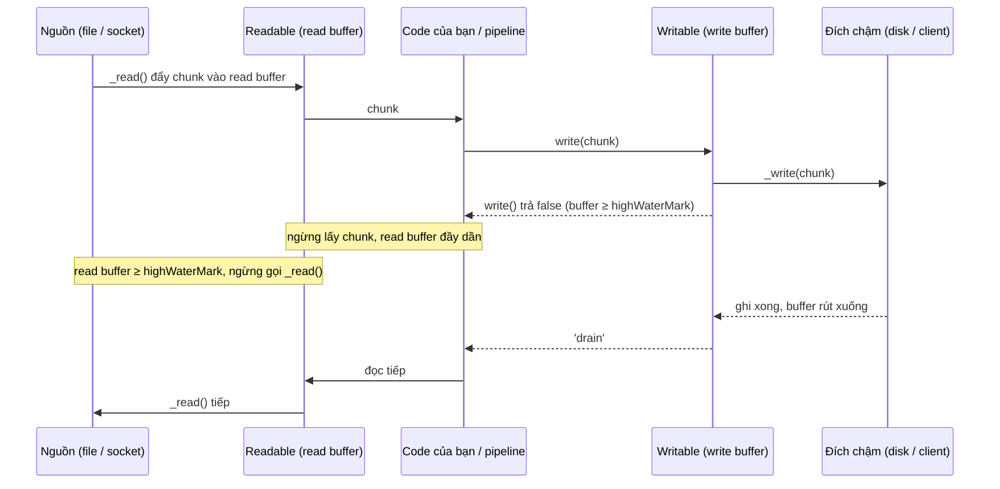
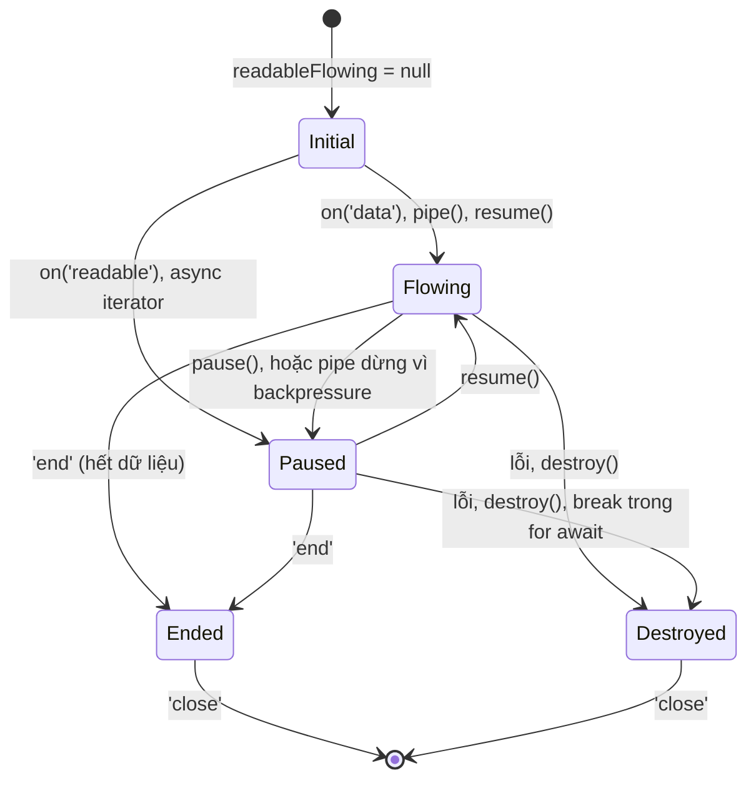

## Bối cảnh & vấn đề

Một service nhận file upload và chuyển tiếp sang S3. Dashboard cho thấy `heapUsed` phẳng ở 60 MB, nhưng pod bị OOMKilled ở giới hạn 1 GB mỗi khi có vài upload lớn cùng lúc. Một service khác đọc log UTF-8 theo chunk, và thỉnh thoảng tên khách hàng tiếng Việt bị biến thành `Vi���t` trong báo cáo. Một job export đọc từ DB cursor bằng `on('data')`, gọi `await db.save(row)` bên trong, và thấy **200** câu insert chạy đồng thời thay vì từng cái một.

Ba sự cố có chung một gốc: không hiểu **Buffer** (dữ liệu nhị phân nằm ngoài heap V8) và **stream** (xử lý dữ liệu theo từng mảnh, có buffer nội bộ và cơ chế báo chậm lại gọi là **backpressure**). Đây là nền tảng cho mọi thao tác file, network, nén, mã hoá trong Node. Bài này dạy các khái niệm và hành vi cơ bản; bài tiếp theo, [stream pipelines](/tracks/nodejs/learn/stream-pipelines), dùng chúng để xây import/export chịu được file hàng GB.

**Interview angle:** câu "Buffer là gì" và "bốn loại stream" là câu easy, nhưng interviewer sẽ đẩy ngay sang "RSS tăng mà heap phẳng thì nghi gì?" và "write() trả false nghĩa là gì, bỏ qua thì sao?".

## Khái niệm

### Buffer: mảng byte cố định, nằm ngoài heap V8

**Buffer** là một mảng byte có kích thước cố định, là subclass của `Uint8Array`. Nó dùng cho mọi dữ liệu nhị phân: nội dung file, dữ liệu socket, output của crypto và zlib. Phần dữ liệu của Buffer nằm trong một **ArrayBuffer backing store** do C++ cấp phát, **ngoài** V8 heap; trên heap chỉ có một object JS nhỏ trỏ tới vùng nhớ đó.

Vì vậy trong `process.memoryUsage()`, dữ liệu Buffer không nằm trong `heapUsed` mà nằm trong `external` và `arrayBuffers`, và dĩ nhiên trong `rss`. Một service giữ 200 MB Buffer có thể có `heapUsed` chỉ 4 MB. GC vẫn quản lý vòng đời của chúng: khi object Buffer trên heap không còn reachable, backing store được giải phóng.

### alloc, allocUnsafe và pool nội bộ

`Buffer.alloc(n)` cấp phát và **ghi 0** toàn bộ n byte. `Buffer.allocUnsafe(n)` cấp phát nhưng **không** ghi 0, nên nhanh hơn, và nội dung ban đầu là **bất cứ thứ gì** từng nằm ở vùng nhớ đó: dữ liệu của request trước, token, thậm chí mã nguồn. Với kích thước nhỏ (dưới một nửa `Buffer.poolSize`), `allocUnsafe` và `Buffer.from` cắt từ một **pool** dùng chung để giảm số lần cấp phát. Node 24 in ra `Buffer.poolSize = 65536` (các tài liệu cũ ghi 8192, verify theo version).

Quy tắc: chỉ dùng `allocUnsafe` khi bạn **chắc chắn ghi đè toàn bộ** trước khi đọc hoặc gửi đi. Lộ dữ liệu cũ ra response là một lỗ hổng thật (các bản Node cũ từng có `new Buffer(n)` không zero-fill và gây ra đúng loại lỗi này).

### subarray chia sẻ bộ nhớ

`buf.subarray(start, end)` (và `buf.slice` cũ) trả về một **view** trỏ vào cùng vùng nhớ, không copy. Sửa view là sửa bản gốc. Hệ quả ít người để ý: giữ một view 16 byte của Buffer 4 MB là giữ **cả 4 MB** sống. Nếu chỉ cần vài byte lâu dài (header, id), copy chúng ra bằng `Buffer.from(view)`.

### Encoding và ký tự multi-byte

UTF-8 mã hoá mỗi ký tự bằng 1–4 byte; chữ `ệ` là 3 byte. Stream cắt dữ liệu theo số byte, không theo ký tự, nên một chunk có thể kết thúc ở giữa một ký tự. Gọi `chunk.toString('utf8')` trên từng chunk riêng lẻ sẽ biến phần ký tự bị cắt thành ký tự thay thế `�`. Giải pháp là **StringDecoder** (giữ lại byte dở dang cho tới chunk sau), hoặc `readable.setEncoding('utf8')` (dùng StringDecoder bên trong), hoặc `TextDecoder` với `{ stream: true }`.

### Stream và bốn loại

**Stream** là một abstraction cho dữ liệu đến hoặc đi **theo từng mảnh** (chunk), thay vì một cục. Lợi ích: RAM tỉ lệ với **kích thước chunk và buffer**, không với kích thước dữ liệu; và bạn bắt đầu xử lý hoặc trả byte đầu tiên sớm hơn (time-to-first-byte). Mọi stream là EventEmitter.

- **Readable**: nguồn dữ liệu. `fs.createReadStream`, `req` trong HTTP server (request body), response của HTTP client, DB cursor stream.
- **Writable**: đích. `res` trong HTTP server, `fs.createWriteStream`, upload multipart lên S3.
- **Duplex**: đọc và ghi **độc lập** trên cùng một object. TCP socket là ví dụ điển hình: dữ liệu bạn ghi đi không liên quan tới dữ liệu đọc về.
- **Transform**: Duplex mà output **được tính từ** input. `zlib.createGzip()`, CSV parser, `crypto.createCipheriv`, transform JSON Lines.

### objectMode

Mặc định stream chứa Buffer hoặc string, và kích thước được đo bằng **byte**. Với `objectMode: true`, mỗi chunk là một giá trị JS bất kỳ (một row, một object) và kích thước đo bằng **số object**. Transform thường có hai mặt khác nhau: `writableObjectMode` và `readableObjectMode` cho phép ví dụ nhận byte và đẩy ra object (parser), hoặc ngược lại (serializer).

### Buffer nội bộ và highWaterMark

Mỗi Writable có một **write buffer** (hàng đợi chunk chưa ghi xong xuống đích), mỗi Readable có một **read buffer** (chunk đã đọc từ nguồn nhưng consumer chưa lấy). `highWaterMark` là **ngưỡng** cho các buffer đó: mặc định 64 KiB cho byte stream từ Node 22 (trước đó 16 KiB), và 16 object cho objectMode. `fs.createReadStream` cũng đọc chunk 64 KiB trên Node 24.

Điểm quan trọng: highWaterMark **không phải giới hạn cứng**. Writable vẫn nhận chunk khi buffer đã vượt ngưỡng; nó chỉ **báo** cho bạn biết bằng giá trị trả về của `write()`. Readable dừng gọi `_read()` của nguồn khi buffer đầy, cho tới khi consumer lấy bớt.

### Backpressure: write() trả false và 'drain'

**Backpressure** là cơ chế để consumer chậm báo producer nhanh "chậm lại". Với Writable: `write(chunk)` trả `true` nếu buffer còn dưới highWaterMark, trả `false` nếu đã chạm hoặc vượt. `false` nghĩa là "chunk này đã được nhận, nhưng **đừng ghi thêm** cho tới khi tôi emit `'drain'`". Producer tôn trọng tín hiệu thì RAM chỉ dùng khoảng highWaterMark; bỏ qua tín hiệu thì mọi chunk dồn vào buffer trong RAM, tới khi OOM.

`pipe`, `pipeline` và `for await` tự xử lý backpressure. Chỉ khi tự gọi `write()` trong vòng lặp, bạn mới phải tự kiểm tra giá trị trả về.

### Readable: paused, flowing và async iteration

Một Readable ở một trong hai chế độ. **Paused**: dữ liệu chờ trong buffer, bạn chủ động lấy bằng `read()` khi có sự kiện `'readable'`. **Flowing**: stream tự đẩy từng chunk qua sự kiện `'data'` ngay khi có. Stream mới tạo có `readableFlowing === null` (chưa ai consume); gắn listener `'data'`, gọi `pipe()` hoặc `resume()` chuyển nó sang flowing.

Flowing mode có một cái bẫy: listener `'data'` được gọi **đồng bộ** và giá trị trả về bị bỏ qua. Nếu listener là `async` và ghi DB chậm, stream không biết điều đó và cứ đẩy chunk tiếp, nên số thao tác đồng thời tăng không giới hạn. **Async iteration** (`for await (const chunk of readable)`) là cách consume dựa trên **pull**: vòng lặp chỉ lấy chunk tiếp theo khi thân vòng lặp chạy xong, nên backpressure tự nhiên. Lỗi của stream thành exception trong vòng lặp; `break` hoặc `throw` sẽ **destroy** stream (đóng file descriptor). Đó là lý do async iteration là cách đọc được khuyên dùng hiện nay. Đừng trộn nhiều cách consume (`on('data')` cùng `for await`) trên một stream.

## Cơ chế hoạt động

Luồng dữ liệu và tín hiệu backpressure giữa một Readable nhanh và một Writable chậm:



Diễn giải: tín hiệu chậm lại đi **ngược** từ đích về nguồn qua hai buffer. Writable báo bằng `false`; code (hoặc `pipeline`) ngừng lấy chunk từ Readable; read buffer đầy tới highWaterMark thì Readable ngừng đọc từ nguồn. Với socket, "ngừng đọc" nghĩa là kernel buffer đầy và TCP window thu lại, nên phía gửi (client upload) cũng chậm lại. Nhờ vậy RAM mỗi stage bị chặn ở khoảng highWaterMark, bất kể dữ liệu dài bao nhiêu.

Vòng đời trạng thái của một Readable:



## Ví dụ thực tế

### Buffer, memoryUsage, pool, encoding và highWaterMark

```js
// buf.mjs
import { StringDecoder } from 'node:string_decoder';
import { getDefaultHighWaterMark } from 'node:stream';
const mb = (b) => (b / 1048576).toFixed(1).padStart(6) + ' MB';
const show = (label) => { const m = process.memoryUsage(); console.log(`${label.padEnd(26)} rss=${mb(m.rss)} heapUsed=${mb(m.heapUsed)} external=${mb(m.external)} arrayBuffers=${mb(m.arrayBuffers)}`); };
show('start');
const bufs = []; for (let i = 0; i < 20; i++) bufs.push(Buffer.alloc(10 * 1024 * 1024, 1));
show('after 20 x 10 MB Buffer');
console.log('Buffer.poolSize =', Buffer.poolSize);
const a = Buffer.allocUnsafe(8), b = Buffer.allocUnsafe(8);
console.log('allocUnsafe small shares pool:', a.buffer === b.buffer, ' alloc(8) own:', Buffer.alloc(8).buffer === a.buffer);
const bytes = Buffer.from('Việt', 'utf8');             // ệ = 3 byte
const c1 = bytes.subarray(0, 3), c2 = bytes.subarray(3); // chunk boundary inside ệ
console.log('naive toString per chunk:', JSON.stringify(c1.toString() + c2.toString()));
const d = new StringDecoder('utf8'); console.log('StringDecoder:', JSON.stringify(d.write(c1) + d.write(c2) + d.end()));
console.log('default highWaterMark bytes =', getDefaultHighWaterMark(false), ' objectMode =', getDefaultHighWaterMark(true));
```

```text
start                      rss=  45.1 MB heapUsed=   4.0 MB external=   1.7 MB arrayBuffers=   0.1 MB
after 20 x 10 MB Buffer    rss= 246.6 MB heapUsed=   3.7 MB external= 201.7 MB arrayBuffers= 200.1 MB
Buffer.poolSize = 65536
allocUnsafe small shares pool: true  alloc(8) own: false
naive toString per chunk: "Vi���t"
StringDecoder: "Việt"
default highWaterMark bytes = 65536  objectMode = 16
```

200 MB Buffer hiện ở `external`/`arrayBuffers` và `rss`, còn `heapUsed` **giảm nhẹ**. Đây là câu trả lời cho "RSS tăng mà heap phẳng": nghi Buffer bị giữ lại (upload buffer vào RAM bằng `multer.memoryStorage()`, cache ảnh, chunk dồn vì bỏ qua backpressure), native addon, hoặc fragmentation của allocator. Hai `allocUnsafe(8)` dùng chung một ArrayBuffer (pool), `alloc` thì không. Và cắt chuỗi UTF-8 giữa ký tự tạo ra đúng bug `Vi���t` ở phần bối cảnh.

### allocUnsafe trả về dữ liệu cũ

```js
// unsafe2.mjs: allocUnsafe trả vùng nhớ tái sử dụng, có thể chứa dữ liệu cũ của process
for (let round = 0; round < 200; round++) {
  let secret = Buffer.alloc(4096, `SECRET-token-${round};`); secret = null;
  const u = Buffer.allocUnsafe(4096);
  const s = u.toString('latin1');
  const i = s.indexOf('SECRET');
  if (i >= 0) { console.log(`round ${round}: allocUnsafe(4096) contains ${JSON.stringify(s.slice(i, i + 40))}`); break; }
}
```

```text
round 175: allocUnsafe(4096) contains "SECRET-token-${round};`); secret = null;"
```

Buffer "mới" chứa một đoạn **mã nguồn** của chính script (vùng nhớ từng giữ source text). Không đoán trước được nó chứa gì, nhưng chắc chắn không phải số 0. Gửi `allocUnsafe` chưa ghi đè ra network là rò rỉ bộ nhớ process ra ngoài.

### subarray giữ cả buffer cha

```js
// node --expose-gc
let keep = []; for (let i = 0; i < 50; i++) { const big = Buffer.alloc(4 * 2 ** 20, 1); keep.push(big.subarray(0, 16)); }
gc(); console.log('50 x 16-byte subarray of 4 MB buffers kept -> arrayBuffers', mb(process.memoryUsage().arrayBuffers));
const copies = keep.map((b) => Buffer.from(b)); keep = null;
// ... gc() sau đó
```

```text
50 x 16-byte subarray of 4 MB buffers kept -> arrayBuffers 200 MB
kept 16-byte COPIES instead -> arrayBuffers 0 MB 50
```

800 byte dữ liệu hữu ích giữ 200 MB. Copy ra thì 200 MB được trả lại.

### Bỏ qua write() so với tôn trọng backpressure

```js
// bp.mjs: đích chậm ~1 ms mỗi chunk 16 KiB, như disk chậm hoặc client mạng yếu
import { Writable } from 'node:stream';
import { once } from 'node:events';
const mb = (b) => b >= 1048576 ? (b / 1048576).toFixed(0) + " MB" : (b / 1024).toFixed(0) + " KiB";
const slowSink = () => new Writable({ highWaterMark: 64 * 1024, write(chunk, _enc, cb) { setTimeout(cb, 1); } });
const chunk = Buffer.alloc(16 * 1024, 'x');
async function run(respect) {
  const out = slowSink(); let peak = 0, falses = 0;
  const t0 = performance.now();
  for (let i = 0; i < 16000; i++) {            // 16000 x 16 KiB = 250 MB
    const ok = out.write(chunk);
    peak = Math.max(peak, out.writableLength);
    if (!ok) { falses++; if (respect) await once(out, 'drain'); }
  }
  out.end(); await once(out, 'finish');
  console.log(`${respect ? 'respect write()' : 'ignore write() '}: peak writableLength=${mb(peak)}, write() returned false ${falses} times, ${(performance.now() - t0).toFixed(0)} ms`);
}
await run(false);
await run(true);
```

```text
ignore write() : peak writableLength=250 MB, write() returned false 15997 times, 18469 ms
respect write(): peak writableLength=64 KiB, write() returned false 4000 times, 18707 ms
```

Cùng tổng thời gian (đích là nút thắt, không có cách nào nhanh hơn), nhưng bỏ qua `write()` làm **toàn bộ 250 MB** nằm trong buffer của Writable, còn chờ `'drain'` giữ đúng 64 KiB = highWaterMark. Với file 5 GB, bản đầu là OOM. Để ý `write()` trả `false` ngay ở chunk thứ tư (4 × 16 KiB = 64 KiB): đó là ngưỡng, không phải giới hạn, vì chunk thứ tư vẫn được nhận.

### on('data') với handler async so với for await

```js
// modes.mjs
import { Readable } from 'node:stream';
import { setTimeout as sleep } from 'node:timers/promises';
const source = () => Readable.from((function* () { for (let i = 0; i < 200; i++) yield { id: i }; })());
const saveToDb = async () => sleep(10); // 10 ms mỗi row
let inFlight = 0, peak = 0;
const r1 = source();
console.log('initial readableFlowing =', r1.readableFlowing);
await new Promise((done) => {
  r1.on('data', async (row) => { inFlight++; peak = Math.max(peak, inFlight); await saveToDb(row); inFlight--; });
  console.log("after on('data') readableFlowing =", r1.readableFlowing);
  r1.on('end', done);
});
console.log(`on('data') + async handler: peak in-flight saves = ${peak}`);
inFlight = 0; peak = 0; const t0 = performance.now();
for await (const row of source()) { inFlight++; peak = Math.max(peak, inFlight); await saveToDb(row); inFlight--; }
console.log(`for await: peak in-flight saves = ${peak}, took ${(performance.now() - t0).toFixed(0)} ms`);
const r3 = source();
for await (const row of r3) { if (row.id === 5) break; }
console.log('after break: destroyed =', r3.destroyed);
```

```text
initial readableFlowing = null
after on('data') readableFlowing = true
on('data') + async handler: peak in-flight saves = 200
for await: peak in-flight saves = 1, took 2211 ms
after break: destroyed = true
```

`on('data')` với handler async bắn **cả 200** lệnh save cùng lúc: với một triệu row thì cạn connection pool và làm DB quá tải. `for await` xử lý đúng một row mỗi lúc. Nếu muốn song song có giới hạn (ví dụ 10 insert cùng lúc), gom batch hoặc dùng `readable.map(fn, { concurrency: 10 })` (API stream của Node, verify mức ổn định theo version). `break` destroy stream nên file descriptor được đóng.

## Trade-offs & lựa chọn thay thế

| Cách đọc/ghi | RAM | Backpressure | Xử lý lỗi | Khi nào dùng |
|---|---|---|---|---|
| `readFile` / `writeFile` một cục | O(kích thước dữ liệu), string UTF-16 còn gấp đôi | Không cần | Đơn giản | File nhỏ, đã biết giới hạn (config, template) |
| `on('data')` + `write()` thủ công | O(highWaterMark) nếu làm đúng | Tự làm: kiểm tra `write()`, `pause/resume` | Tự gắn `'error'` cho từng stream | Hiếm khi; code cũ |
| `pipe()` | O(highWaterMark × số stage) | Tự động | **Không** propagate lỗi, không destroy | Tránh trong code mới |
| `for await` | O(highWaterMark) | Tự nhiên (pull) | Exception trong vòng lặp | Consume Readable, logic từng chunk dễ đọc |
| `stream.pipeline()` | O(highWaterMark × số stage) | Tự động | Propagate lỗi, destroy mọi stage | Mặc định cho production |

Chọn thế nào: dữ liệu có kích thước bị chặn và nhỏ thì đọc một cục cho đơn giản. Dữ liệu không biết trước kích thước (upload, export, file người dùng) thì luôn stream. Khi stream, dùng `for await` cho phần xử lý và `pipeline` để nối các stage; chỉ tự viết `write()` + `'drain'` khi thật sự cần kiểm soát từng chunk, như ví dụ trên. Về Buffer: `alloc` là mặc định; `allocUnsafe` chỉ khi đo thấy khác biệt và chắc chắn ghi đè hết.

## Edge cases & failure modes

- **Chunk không trùng ranh giới dòng hoặc ký tự**: parser theo dòng phải giữ phần dư giữa các chunk; decode UTF-8 phải dùng StringDecoder/`setEncoding`. Bug chỉ xuất hiện với dữ liệu thật đủ lớn, không xuất hiện trong unit test với chuỗi ngắn.
- **Readable không có consumer**: tạo stream mà không đọc (ví dụ quên consume body của response HTTP client) giữ buffer và connection. Với `fetch`/undici, body lớn không được đọc hoặc `cancel()` có thể giữ socket khỏi pool cho tới khi GC dọn (undici khuyên luôn consume hoặc cancel body).
- **highWaterMark quá lớn hoặc quá nhỏ**: 64 KiB là cân bằng tốt cho file. objectMode với object lớn (row 1 MB) × 16 = 16 MB mỗi stage; chỉnh highWaterMark theo kích thước object.
- **Slow client**: `res.write()` cho một client mạng yếu trả `false` liên tục. Nếu không chờ `'drain'`, mỗi client chậm giữ hàng chục MB. Với hàng nghìn kết nối SSE/WebSocket, phải có chính sách drop hoặc ngắt client quá chậm (xem bài [graceful shutdown & long-lived connections](/tracks/nodejs/learn/graceful-shutdown)).
- **Trộn cách consume**: vừa `on('data')` vừa `for await` hoặc `pipe` cùng lúc cho kết quả khó đoán (chunk bị chia cho hai consumer).
- **Giữ view nhỏ của Buffer lớn**: cache một `subarray` header của file 50 MB giữ cả 50 MB.
- **String quá dài**: V8 giới hạn độ dài string khoảng 2^29 ký tự (`buffer.constants.MAX_STRING_LENGTH = 536870888` trên Node 24). `readFile(path, 'utf8')` với file 600 MB ném `RangeError: Invalid string length`, trước cả khi nói tới RAM.

## Pitfalls

- ❌ Nhìn `heapUsed` để kết luận "không leak" → ✅ theo dõi cả `rss`, `external`, `arrayBuffers`; Buffer nằm ngoài heap.
- ❌ `Buffer.allocUnsafe` cho buffer sẽ gửi ra ngoài mà không ghi đè hết → ✅ `Buffer.alloc`, hoặc chỉ dùng `allocUnsafe` khi ghi đè toàn bộ ngay.
- ❌ `chunk.toString()` trên từng chunk UTF-8 → ✅ `setEncoding('utf8')`, StringDecoder hoặc `TextDecoder` với `stream: true`.
- ❌ Bỏ qua giá trị trả về của `write()` → ✅ `if (!out.write(x)) await once(out, 'drain')`, hoặc để `pipeline` lo.
- ❌ `on('data', async (row) => await save(row))` → ✅ `for await (const row of stream)` hoặc batch với concurrency có giới hạn.
- ❌ Coi highWaterMark là giới hạn cứng → ✅ nó là ngưỡng để báo hiệu; chỉ producer tôn trọng tín hiệu mới giữ được RAM.
- ❌ Cache `subarray` của buffer lớn → ✅ `Buffer.from(view)` để copy phần cần giữ.

## Tóm tắt

- Buffer = mảng byte cố định (subclass `Uint8Array`), dữ liệu nằm ngoài V8 heap: thấy ở `external`/`arrayBuffers` và `rss`, không ở `heapUsed`.
- `alloc` ghi 0; `allocUnsafe` nhanh hơn nhưng chứa dữ liệu cũ (đo được cả mã nguồn); buffer nhỏ lấy từ pool.
- `subarray` là view chia sẻ bộ nhớ; view nhỏ giữ cả buffer lớn sống.
- Bốn loại stream: Readable, Writable, Duplex (hai chiều độc lập), Transform (output tính từ input); objectMode đo bằng số object.
- highWaterMark (64 KiB byte từ Node 22, 16 object) là ngưỡng; `write()` trả `false` → chờ `'drain'`, bỏ qua thì chunk dồn trong RAM (250 MB so với 64 KiB).
- Readable: null → flowing (`'data'`, `pipe`) hoặc paused; `'data'` + handler async không có backpressure.
- `for await` là cách đọc nên dùng: pull-based, lỗi thành exception, `break` destroy stream.
