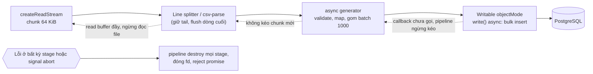
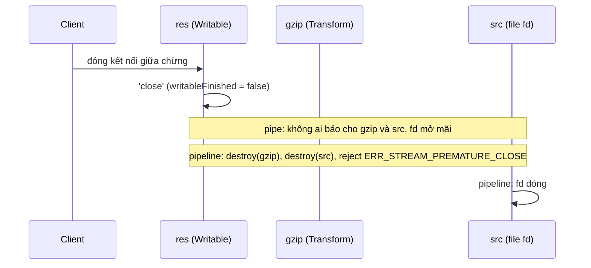

## Bối cảnh & vấn đề

Endpoint import sản phẩm chạy tốt trên staging với file 5 MB. Trên production, khách hàng lớn upload file CSV 2 GB và pod bị **OOMKilled** trong vài giây. Code dùng `readFile` rồi `split('\n')`, rồi `Promise.all` một triệu lệnh insert. Cùng tuần đó, job export 5 triệu đơn hàng "dùng stream" nhưng memory vẫn vọt lên vài GB, và endpoint tải file dùng `src.pipe(gzip).pipe(res)` làm process chạm `EMFILE: too many open files` sau vài ngày, vì mỗi lần người dùng huỷ tải là một file descriptor bị bỏ lại.

Ba lỗi này đều là lỗi lắp ráp stream: đúng nguyên liệu (Readable, Transform, Writable) nhưng nối sai, nên mất **backpressure**, mất **error propagation**, hoặc mất **cleanup**. Bài [Buffer và stream](/tracks/nodejs/learn/buffers-streams) đã giải thích từng thành phần; bài này là cách nối chúng thành pipeline chạy được với dữ liệu hàng GB, từ file tới database và Elasticsearch. Phần generator và `for await` ở mức ngôn ngữ nằm ở bài [iterators & generators](/tracks/javascript/learn/iterators-generators); các kịch bản upload/download end-to-end có ở track [files & streaming](/tracks/scenario-files).

**Interview angle:** câu debug "review đoạn code import này" gần như chắc chắn xuất hiện ở vòng senior Node. Interviewer muốn nghe bạn chỉ ra từng điểm tốn RAM (readFile, split, Promise.all), từng điểm mất backpressure, và đề xuất pipeline có batch, concurrency giới hạn, xử lý lỗi dòng, và chạy như background job.

## Khái niệm

### pipe(): có backpressure, không có cleanup

`readable.pipe(writable)` nối hai stream và xử lý backpressure: khi `writable.write()` trả `false`, nó pause readable và resume khi `'drain'`. Nhưng `pipe` **không propagate lỗi** và **không destroy** stream còn lại khi một stream lỗi hoặc đóng sớm. Nếu `res` đóng vì client huỷ tải, `src` (một file descriptor) vẫn mở, bị pause mãi, không ai đóng. Nếu `src` lỗi (file không tồn tại) mà không có listener `'error'`, process crash; có listener thì `res` treo vì không ai kết thúc nó.

### stream.pipeline(): cách nối mặc định

`pipeline(source, ...transforms, destination)` (bản promise ở `node:stream/promises`) nối nhiều stream, xử lý backpressure, và quan trọng nhất: khi **bất kỳ** stage nào lỗi hoặc đóng sớm, nó **destroy tất cả** các stage và reject promise với lỗi đó (client huỷ giữa chừng cho ra `ERR_STREAM_PREMATURE_CLOSE`). Nó nhận `{ signal }` để huỷ từ bên ngoài (timeout, request bị huỷ), và nhận **async generator function** làm transform hoặc destination, nên bạn viết logic bằng `for await` thay vì class Transform.

### Async generator làm stage

Một stage có dạng `async function* (source) { for await (const chunk of source) yield f(chunk) }`. Nó đọc từ stage trước theo kiểu pull và `yield` cho stage sau; `yield` chỉ trả lại quyền khi stage sau sẵn sàng nhận, nên backpressure được giữ tự nhiên. Stage cuối có thể là một async function không yield (consume hết và ghi đi). Đây là cách viết transform dễ đọc và dễ test nhất hiện nay.

### Transform tự viết: phần dư và flush

Khi tự viết parser theo dòng, nhớ rằng chunk (64 KiB) không trùng ranh giới dòng. Transform phải giữ **phần dư** (`tail`) của chunk trước, ghép với chunk sau, và đẩy dòng cuối trong `flush()` (được gọi khi input kết thúc). CSV còn khó hơn: field có dấu phẩy hoặc xuống dòng nằm trong ngoặc kép, dấu `""` escape, BOM ở đầu file, encoding không phải UTF-8. Vì vậy production nên dùng parser có sẵn như `csv-parse`, còn tự viết chỉ để hiểu cơ chế.

### Batch và concurrency có giới hạn

Insert từng row một là N round-trip tới DB; insert một triệu row cùng lúc là cạn pool và làm DB quá tải. Mẫu đúng là **batch** (gom 500–5.000 row thành một `INSERT ... VALUES (...), (...)` hoặc `COPY`) và **concurrency có giới hạn** (1–4 batch đang chạy cùng lúc). Một Writable objectMode có `write()` async chỉ gọi callback khi insert xong là cách tự nhiên để pipeline chậm lại theo tốc độ DB.

### Backpressure tới tận database

Backpressure trong Node chỉ chặn được RAM **trong process**. Muốn nó lan tới database, nguồn phải là một cursor thật: `pg-query-stream`/`pg-cursor` dùng cursor của Postgres và chỉ `FETCH` batch tiếp theo khi stream cần thêm dữ liệu. Một driver "stream" mà thực chất đọc hết result set vào RAM rồi mới emit từng row thì không có backpressure thật. Với SQL Server, driver `mssql`/`tedious` có chế độ stream với `request.pause()`/`resume()` (verify theo driver version). Phía ghi cũng vậy: backpressure chỉ có ý nghĩa khi Writable chờ DB xác nhận xong mới nhận batch mới.

### Import như một background job

Một file 2 GB mất vài phút. Giữ HTTP request mở suốt thời gian đó gặp timeout của load balancer (ALB mặc định 60 giây), mất việc khi pod bị deploy, và không retry được. Mẫu tốt hơn: upload file lên object storage (S3) hoặc volume, trả `202 Accepted` kèm job id, một worker xử lý pipeline, client poll trạng thái hoặc nhận webhook. Job ghi **checkpoint** (dòng hoặc byte offset đã commit) để chạy lại từ giữa, và mỗi dòng có khoá idempotent để chạy lại không nhân đôi dữ liệu.

## Cơ chế hoạt động

Một pipeline import CSV chuẩn, với tín hiệu backpressure và lỗi:



Luồng dữ liệu đi từ trái sang phải; tín hiệu "chậm lại" (nét đứt) đi từ phải sang trái. Writable chỉ gọi callback khi DB trả về, nên khi DB chậm thì generator không được kéo thêm, parser không được kéo thêm, và file ngừng được đọc. RAM tối đa là khoảng highWaterMark của mỗi stage cộng một batch đang insert, không phụ thuộc kích thước file. Khi có lỗi (dòng không hợp lệ ném exception, DB mất kết nối, client huỷ), `pipeline` destroy mọi stage theo thứ tự và promise reject, nên `try/catch` quanh `await pipeline(...)` là nơi duy nhất cần xử lý lỗi.

So sánh điều xảy ra khi client huỷ tải giữa chừng:



## Ví dụ thực tế

### pipe rò file descriptor, pipeline thì không

```js
// fdleak.mjs: 20 lần tải file 50 MB bị client huỷ sau chunk đầu tiên
import http from 'node:http';
import fs from 'node:fs';
import { createGzip } from 'node:zlib';
import { pipeline } from 'node:stream/promises';
import { execSync } from 'node:child_process';
const mode = process.argv[2];
let opened = 0, closed = 0;
const server = http.createServer(async (req, res) => {
  const src = fs.createReadStream('big.bin'); opened++;
  src.on('close', () => closed++);
  if (mode === 'pipe') src.pipe(createGzip()).pipe(res);
  else { try { await pipeline(src, createGzip(), res); } catch (e) { /* ERR_STREAM_PREMATURE_CLOSE khi client huỷ */ } }
});
server.listen(0, async () => {
  const { port } = server.address();
  for (let i = 0; i < 20; i++) {
    await new Promise((ok) => {
      const req = http.get({ port, path: '/' }, (res) => res.once('data', () => { req.destroy(); ok(); }));
      req.on('error', () => {});
    });
  }
  await new Promise((r) => setTimeout(r, 500));
  const fds = execSync(`lsof -p ${process.pid} | grep -c big.bin || true`).toString().trim();
  console.log(`${mode}: 20 aborted downloads -> read streams opened=${opened} closed=${closed}, open fds on big.bin=${fds}`);
  process.exit(0);
});
```

```text
$ node fdleak.mjs pipe
pipe: 20 aborted downloads -> read streams opened=20 closed=0, open fds on big.bin=20
$ node fdleak.mjs pipeline
pipeline: 20 aborted downloads -> read streams opened=20 closed=20, open fds on big.bin=0
```

Với `pipe`, mỗi lần huỷ để lại một fd (và một gzip context, vài chục KB buffer). Ở production, `lsof -p <pid> | wc -l` tăng dần theo số lần huỷ tải, cho tới `EMFILE`. Tăng `ulimit -n` chỉ trì hoãn. Bản sửa đầy đủ cho endpoint download còn cần: kiểm tra file tồn tại và trả 404 **trước** khi bắt đầu stream (sau khi header đã gửi thì không đổi status được nữa), và chống path traversal cho `id` (resolve đường dẫn rồi kiểm tra nó nằm trong thư mục cho phép).

### Review endpoint import bị OOMKilled

```ts
// Code gốc
app.post("/import", upload.single("file"), async (req, res) => {
  const text = await fs.promises.readFile(req.file!.path, "utf8");       // (1)
  const rows = text.split("\n").map((l) => l.split(","));               // (2) (3)
  await Promise.all(rows.map((r) => db.insert("products", toProduct(r)))); // (4)
  res.json({ imported: rows.length });                                  // (5)
});
```

Các vấn đề theo thứ tự: (1) `readFile` load cả file; string trong V8 lưu Latin-1 hoặc UTF-16, nên file UTF-8 có ký tự Việt có thể thành string lớn gấp đôi, và string vượt ~512 triệu ký tự thì ném `RangeError: Invalid string length`. (2) `split` tạo thêm một mảng string cùng cỡ, `map(split)` tạo thêm hàng triệu mảng nhỏ: tổng cộng nhiều lần kích thước file, và các lệnh đồng bộ này chặn event loop hàng giây. (3) `split(",")` sai với field có dấu phẩy trong ngoặc kép. (4) `Promise.all` tạo một triệu promise và một triệu query **đồng thời**: pool cạn, hàng đợi của driver phình trong RAM, DB quá tải, và một lỗi làm reject cả cục trong khi các insert khác vẫn chạy. (5) Request HTTP giữ mở suốt quá trình.

So sánh đo được với file 81 MB, 2 triệu dòng (bulk insert giả lập 2 ms mỗi batch):

```js
// import.mjs (rút gọn phần stream)
const lines = () => { let tail = ''; return new Transform({ readableObjectMode: true,
  transform(chunk, _e, cb) { const parts = (tail + chunk).split('\n'); tail = parts.pop(); for (const p of parts) if (p) this.push(p); cb(); },
  flush(cb) { if (tail) this.push(tail); cb(); } }); };
// Parser field có ngoặc kép tối giản, đủ cho file này (production: csv-parse)
const parseLine = (l) => l.match(/("([^"]|"")*"|[^,]*)(,|$)/g).slice(0, -1).map((f) => f.replace(/,$/, '').replace(/^"|"$/g, '').replace(/""/g, '"'));
let n = 0, header = true, inFlight = 0, maxInFlight = 0;
await pipeline(
  fs.createReadStream(file, { encoding: 'utf8' }),
  lines(),
  async function* batches(src) {
    let batch = [];
    for await (const line of src) {
      if (header) { header = false; continue; }
      batch.push(parseLine(line));
      if (batch.length === 1000) { yield batch; batch = []; }
    }
    if (batch.length) yield batch;
  },
  new Writable({ objectMode: true, highWaterMark: 2, async write(batch, _e, cb) {
    inFlight++; maxInFlight = Math.max(maxInFlight, inFlight);
    try { n += await bulkInsert(batch); inFlight--; cb(); } catch (e) { inFlight--; cb(e); }
  } }),
);
```

```text
$ node import.mjs readFile
naive split, first row: [ 'SKU-0', '"Product 0', ' size M"', '0' ]
readFile+split: 2000000 rows, peak rss 749 MB, 5780 ms
$ node import.mjs stream
stream pipeline: 2000000 rows, peak rss 172 MB, max concurrent inserts 1, 5392 ms
```

Bản naive (đã bỏ `Promise.all` để chạy được) tốn **749 MB** cho file 81 MB, tức hơn 9 lần, và cắt sai field `"Product 0, size M"` thành hai cột. Bản pipeline tốn 172 MB (phần lớn là baseline của process và GC chưa thu), không tăng theo kích thước file, và chỉ có một batch insert chạy mỗi lúc. File 2 GB với bản naive cần khoảng 18 GB, với bản pipeline vẫn khoảng 170 MB. `setEncoding`/`encoding: 'utf8'` trên read stream đảm bảo ký tự multi-byte không bị cắt giữa chunk.

Nếu import phải **all-or-nothing**: stream vào một bảng staging (hoặc dùng `COPY` vào staging) trong cùng transaction, validate, rồi `INSERT ... SELECT` sang bảng thật và commit; lỗi ở bất kỳ đâu thì rollback. Transaction dài có chi phí (giữ lock, chặn VACUUM, xem [MVCC & VACUUM](/tracks/sql-postgres/learn/mvcc-vacuum)), nên với file rất lớn thường chọn partial import có báo cáo lỗi từng dòng cộng khả năng chạy lại idempotent.

### Export "dùng stream" vẫn tốn vài GB

```js
// export.mjs: 2 triệu row từ một object-mode Readable (thay cho db.query(...).stream())
if (mode === 'naive') {
  const c = cursor();
  c.on('data', (row) => { out.write(toCsvLine(row)); });   // giá trị trả về bị bỏ qua
  await new Promise((r) => c.on('end', () => { out.end(); out.on('finish', r); }));
} else {
  await pipeline(cursor(), new Transform({ writableObjectMode: true, transform(row, _e, cb) { cb(null, toCsvLine(row)); } }), out);
}
```

```text
$ node export.mjs naive
naive   : 2000000 rows in 1960 ms, peak rss 855 MB
$ node export.mjs pipeline
pipeline: 2000000 rows in 1950 ms, peak rss 186 MB
```

Cùng thời gian, nhưng bản naive giữ gần toàn bộ file output trong buffer của write stream (855 MB cho 2 triệu row; 5 triệu row sẽ là vài GB). Cursor ở flowing mode đẩy row nhanh hơn disk ghi, `write()` trả `false` mà không ai nghe. `pipeline` truyền backpressure ngược về cursor; với `pg-query-stream` điều đó nghĩa là Postgres chỉ được `FETCH` batch tiếp khi file đã ghi kịp. Bản naive còn thiếu xử lý lỗi: lỗi DB hay disk làm stream treo và rò fd. Nếu viết thủ công, dạng đúng là `for await (const row of cursor) { if (!out.write(line)) await once(out, 'drain'); }` cộng `try/finally` để destroy.

### Đẩy dữ liệu vào Elasticsearch có kiểm soát

Indexer đọc thay đổi (từ Kafka hoặc polling DB) và ghi bằng Bulk API. Các quyết định quan trọng:

```ts
// Batch theo cả số document lẫn byte, tối đa 2 bulk request đang bay, retry item 429
async function* bulkBatches(docs: AsyncIterable<Product>, maxDocs = 1000, maxBytes = 5 * 1024 * 1024) {
  let lines: string[] = [], bytes = 0;
  for await (const d of docs) {
    const action = JSON.stringify({ index: { _index: "products_v7", _id: d.id, version: d.version, version_type: "external" } });
    const src = JSON.stringify(toEsDoc(d));
    lines.push(action, src); bytes += action.length + src.length + 2;
    if (lines.length / 2 >= maxDocs || bytes >= maxBytes) { yield lines; lines = []; bytes = 0; }
  }
  if (lines.length) yield lines;
}
// consumer: for await (const batch of bulkBatches(source)) await limit(() => sendBulk(batch))
// sendBulk: đọc từng item trong response; item 429 (es_rejected_execution_exception) -> retry với backoff;
// item 409 version_conflict với external version -> bản cũ tới muộn, bỏ qua; lỗi mapping -> DLQ.
```

(Code minh hoạ, không kèm output.) Bulk response trả `errors: true` kèm trạng thái **từng item**; coi cả request là thành công khi HTTP 200 là bug phổ biến nhất. `_id` ổn định và `version_type: external` (version lấy từ DB) làm việc ghi idempotent và bỏ qua update cũ đến muộn. Backpressure: không đọc batch mới khi đã có 2 bulk request đang chờ; với Kafka thì `pause()` partition. Full reindex: tạo index mới, tăng `refresh_interval` (hoặc `-1`) và giảm replica trong lúc nạp, rồi **alias swap** sang index mới. Chi tiết phía Elasticsearch có ở track [NoSQL & search](/tracks/nosql-search).

### Kể câu chuyện CSV bottleneck (câu CV)

Một câu trả lời mạnh cho "bạn đã sửa bottleneck xử lý CSV thế nào" có năm phần, mỗi phần có số liệu thật của bạn:

1. **Triệu chứng đo được**: thời gian xử lý file X MB, memory peak, event loop delay p99 trong lúc import, số request timeout.
2. **Bằng chứng nguyên nhân**: heap/RSS tăng theo kích thước file (load cả file), CPU profile thấy `split`/`JSON.parse` chiếm N%, số connection DB đang chờ, slow query log.
3. **Thiết kế sửa**: `pipeline(readStream, csv-parse, validate/transform, batch 1000, bulk insert)`; vì sao chọn batch size đó (đo 500/1000/5000), concurrency bao nhiêu; dòng lỗi được ghi kèm số dòng.
4. **Chứng minh**: load test với file thật cỡ production; trước/sau về thời gian, RAM, lag.
5. **Trade-off**: partial vs all-or-nothing, và chống import trùng khi cùng file upload hai lần (hash nội dung file làm idempotency key, unique constraint trên khoá nghiệp vụ).

## Trade-offs & lựa chọn thay thế

| Cách xử lý dữ liệu lớn | RAM | Độ phức tạp | Lỗi & cleanup | Dùng khi |
|---|---|---|---|---|
| `readFile` + `split` + `Promise.all` | Nhiều lần kích thước file | Thấp | Không | Không bao giờ với input người dùng |
| `pipe()` chuỗi | O(highWaterMark × stage) | Thấp | Rò fd khi lỗi/huỷ | Tránh |
| `pipeline()` + async generator | O(highWaterMark × stage + batch) | Vừa | Destroy mọi stage, một chỗ catch | Mặc định trong process |
| `COPY FROM STDIN` (Postgres) qua stream | Thấp | Vừa | Transaction của COPY | Nạp lượng lớn nhanh nhất, ít validate từng dòng |
| Background job + queue + checkpoint | Thấp | Cao | Retry, resume, quan sát được | File lớn, việc > vài giây, cần sống qua deploy |

Chọn thế nào: việc dưới vài giây và dữ liệu vừa phải thì pipeline ngay trong request. Việc dài, file người dùng tải lên, hay cần chạy lại khi lỗi thì tách thành job: request chỉ nhận file và trả job id. Nạp thô rất lớn vào Postgres thì `COPY` vào staging nhanh hơn nhiều so với INSERT batch, đổi lại ít kiểm soát lỗi từng dòng.

## Edge cases & failure modes

- **Header đã gửi rồi mới lỗi**: khi stream download lỗi giữa chừng, không đổi được status 200 thành 500; client nhận file cụt. Kiểm tra trước (file tồn tại, quyền), và với dữ liệu quan trọng thì gửi checksum hoặc `Content-Length` để client phát hiện file cụt.
- **Dòng cuối không có `\n`**: quên `flush()` là mất dòng cuối. Test với file không có newline cuối.
- **BOM và encoding**: file Excel xuất thường có BOM `` ở đầu, làm tên cột đầu tiên thành `sku`. `csv-parse` có option `bom: true`.
- **Một dòng hỏng**: ném exception trong generator làm cả pipeline dừng. Quyết định nghiệp vụ: skip và ghi lỗi kèm số dòng, hoặc fail cả file.
- **Crash ở dòng 700.000**: không có checkpoint thì chạy lại từ đầu và nhân đôi dữ liệu. Commit checkpoint (offset byte hoặc số dòng) cùng transaction với batch; mỗi row có khoá tự nhiên để upsert.
- **Concurrency quá cao ở stage cuối**: 20 bulk insert song song làm DB lock contention và chính DB thành nút thắt; tăng concurrency có điểm bão hoà, đo để chọn.
- **Elasticsearch 429**: cluster từ chối bulk khi write thread pool đầy. Retry toàn bộ request (kể cả item đã thành công) là lãng phí; chỉ retry item lỗi, với backoff.
- **Update tới trước create** (Kafka nhiều partition hoặc retry): dùng external version và upsert để thứ tự đến không quan trọng.

## Pitfalls

- ❌ `src.pipe(gzip).pipe(res)` → ✅ `await pipeline(src, gzip, res)` trong `try/catch`; mọi stage được destroy khi lỗi hoặc client huỷ.
- ❌ `readFile` + `split('\n')` cho file người dùng → ✅ `createReadStream` + parser stream; RAM không phụ thuộc kích thước file.
- ❌ `split(',')` để parse CSV → ✅ `csv-parse` (quoted field, xuống dòng trong field, BOM).
- ❌ `Promise.all(rows.map(insert))` → ✅ batch + concurrency giới hạn; Writable async gọi callback khi insert xong.
- ❌ `cursor.on('data', row => out.write(...))` → ✅ `pipeline(cursor, transform, out)` để backpressure về tới DB cursor.
- ❌ Giữ HTTP request mở trong lúc import vài phút → ✅ 202 + job id, worker, checkpoint, idempotent.
- ❌ Coi bulk response HTTP 200 là thành công → ✅ đọc `errors` và trạng thái từng item; retry item 429, DLQ item lỗi mapping.

## Tóm tắt

- `pipe()` có backpressure nhưng không propagate lỗi và không destroy: đo được 20/20 fd bị rò khi client huỷ; `pipeline()` đóng cả 20.
- `pipeline()` + async generator là cách nối mặc định: backpressure, một chỗ catch, nhận `signal`.
- Parser tự viết giữ `tail` giữa chunk và đẩy dòng cuối trong `flush()`; CSV thật dùng `csv-parse`.
- Import 2 triệu dòng: readFile+split 749 MB và sai field; pipeline 172 MB, một batch insert mỗi lúc.
- Export bỏ qua `write()` tốn 855 MB; `pipeline` tốn 186 MB và truyền backpressure về tới cursor Postgres.
- Việc dài chạy như job: 202 + job id, checkpoint, idempotency key.
- Bulk Elasticsearch: batch theo số doc và byte, concurrency giới hạn, xử lý lỗi từng item, external version, alias swap khi reindex.
