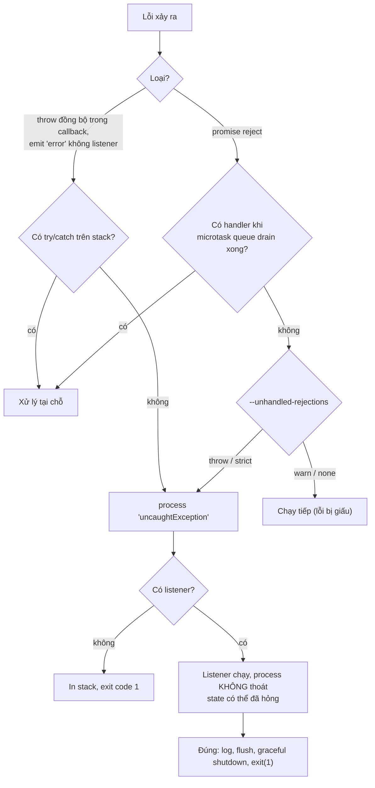
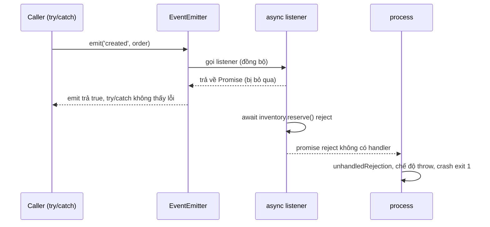

## Bối cảnh & vấn đề

Service thanh toán restart vài lần mỗi ngày. Log chỉ có một dòng trước mỗi lần chết: `Error: audit service timeout`, từ một lời gọi `audit.write(evt)` mà ai đó cố ý không `await` "cho nhanh". Mỗi lần process chết, mọi request đang chạy trên pod đó chết theo. Một team khác "sửa" bằng `process.on('uncaughtException', console.error)`: không còn restart, nhưng vài giờ sau mọi request bắt đầu treo, vì một connection của pool đã bị giữ lại trong lúc lỗi xảy ra và không bao giờ được trả.

Hai sự cố này nằm ở ranh giới giữa code của bạn và **process**: lỗi không ai bắt đi đâu, Node làm gì với nó, và "xử lý" nó thế nào cho đúng. Cùng họ với nó là **EventEmitter**, xương sống của stream, socket, HTTP server, và **cancellation**, thứ quyết định việc tốn kém có dừng lại khi không còn ai chờ kết quả hay không.

Bài [error handling & cancellation](/tracks/javascript/learn/errors-cancellation) của track JavaScript đã trình bày try/catch bắt được gì, error class có `cause`, và pattern timeout/retry của `fetch`. Bài này tập trung vào phía runtime Node: cơ chế của EventEmitter, các sự kiện cấp process và cờ CLI, trạng thái process sau lỗi, và những API core nhận `AbortSignal`.

**Interview angle:** red flag lớn nhất ở phần này là câu "thêm `process.on('uncaughtException')` để server không bao giờ crash". Interviewer muốn nghe: log, flush, graceful shutdown, exit khác 0, để orchestrator restart một process sạch.

## Khái niệm

### EventEmitter gọi listener đồng bộ

`emitter.emit(name, ...args)` gọi **lần lượt, đồng bộ** mọi listener đã đăng ký cho `name`, theo thứ tự đăng ký, rồi trả `true` nếu có listener. Không có hàng đợi, không có microtask: `emit` return khi listener cuối cùng return. Giá trị trả về của listener bị **bỏ qua**. Hệ quả: một listener chậm làm `emit` chậm; một listener throw đồng bộ làm `emit` throw (và các listener sau không chạy); còn một listener `async` trả về promise mà không ai `await`.

Các API phụ đáng nhớ: `once` (tự gỡ sau lần đầu), `prependListener` (chèn lên đầu), `off`/`removeListener`, `listenerCount`, và hai helper dạng promise trong `node:events`: `once(emitter, name, { signal })` chờ một sự kiện, `on(emitter, name, { signal })` trả async iterator của sự kiện, tự gỡ listener khi vòng lặp kết thúc hoặc signal abort.

### Sự kiện 'error' là đặc biệt

`'error'` là tên sự kiện duy nhất có hành vi riêng: nếu emit `'error'` mà **không có listener nào**, EventEmitter **throw** chính lỗi đó (kèm thông báo `Unhandled 'error' event`). Throw ra khỏi callback mà không ai bắt thì thành `uncaughtException`, và mặc định process crash với exit code 1. Stream, socket, `http.ClientRequest`, child process đều là EventEmitter, nên "quên gắn `on('error')` cho một socket" là một cách crash kinh điển. `events.errorMonitor` là symbol cho phép quan sát lỗi (log, metric) mà **không** được tính là "đã xử lý".

### MaxListenersExceededWarning

Mặc định mỗi emitter cho phép 10 listener cho **cùng một** sự kiện (`EventEmitter.defaultMaxListeners = 10`). Vượt quá, Node in `MaxListenersExceededWarning: Possible EventEmitter memory leak detected`. Đó chỉ là **cảnh báo**, không phải giới hạn: listener thứ 11 vẫn được thêm. Ý nghĩa thực tế: bạn đang đăng ký listener theo **từng request** lên một emitter **sống lâu** (bus toàn cục, socket dùng chung, `process`) và không gỡ. Mỗi listener giữ closure của nó (thường gồm `req`, `res`, buffer), nên đây vừa là leak vừa là bug logic. "Sửa" bằng `setMaxListeners(0)` là tắt chuông báo cháy; chỉ nâng giới hạn khi bạn biết chắc số listener hợp lệ lớn hơn 10 và có trần.

### Listener async và captureRejections

Khi listener là `async function` và nó reject, `emit` không thấy gì vì nó bỏ qua promise trả về. `try/catch` bao quanh `emit` chỉ bắt lỗi đồng bộ. Promise reject không có handler thành **unhandled rejection**, và từ Node 15 điều đó làm process crash. Có hai cách sửa: `try/catch` **bên trong** listener, hoặc tạo emitter với `new EventEmitter({ captureRejections: true })` (hoặc bật toàn cục `EventEmitter.captureRejections = true`): Node gắn handler cho promise trả về và chuyển rejection thành sự kiện `'error'` trên emitter. Nếu emitter đó không có listener `'error'`, ta quay lại quy tắc trên: throw, crash.

Ở tầng thiết kế: EventEmitter là cơ chế **in-process, không bền**. Nó phù hợp cho thông báo nội bộ (stream, lifecycle), không phù hợp cho sự kiện nghiệp vụ phải xảy ra (trừ kho, gửi email). Những thứ đó thuộc về outbox hoặc message queue.

### uncaughtException

`'uncaughtException'` được emit trên `process` khi một exception đi ngược tới tận event loop mà không ai bắt: throw đồng bộ trong callback timer hoặc I/O, emit `'error'` không có listener, lỗi trong listener đồng bộ. Không có listener nào thì Node in stack và thoát với **exit code 1**. Có listener thì Node **không** thoát: đó là cái bẫy. Lỗi đã cắt ngang một đoạn code ở điểm bất kỳ; mọi `finally`, `release()`, `unlock()` phía sau trong callback đó không chạy. Process còn sống nhưng state có thể hỏng: connection bị giữ, lock không nhả, counter lệch, transaction dang dở. Node docs nói rõ: dùng handler này để dọn dẹp **đồng bộ** rồi thoát, không phải để tiếp tục.

`process.on('uncaughtExceptionMonitor', fn)` cho phép quan sát (gửi log/metric) mà không thay đổi hành vi crash mặc định.

### unhandledRejection và các chế độ

`'unhandledRejection'` được emit khi một promise bị reject và **chưa có handler** vào lúc Node xử lý microtask queue xong (sau khi drain nextTick và microtask của lượt đó). Gắn `.catch` muộn hơn, ví dụ trong một `setImmediate`, là quá muộn. Hành vi mặc định do cờ `--unhandled-rejections` quyết định; từ Node 15 mặc định là `throw`:

| Chế độ | Có listener `unhandledRejection` | Không có listener | Đo trên Node 24 (không listener) |
|---|---|---|---|
| `throw` (mặc định) | Gọi listener, không crash | Ném như uncaught exception | exit 1, dừng ngay |
| `strict` | Ném như uncaught exception, rồi emit | Ném | exit 1 |
| `warn` | Gọi listener | In warning, chạy tiếp | exit 0, chạy tiếp |
| `warn-with-error-code` | Gọi listener | In warning, chạy tiếp, đặt exit code 1 | chạy tiếp, exit 1 lúc thoát |
| `none` | Gọi listener | Im lặng | exit 0, chạy tiếp |

Đổi sang `warn` để "hết crash" là sai ngay cả tạm thời: lỗi thật (một await quên catch trong luồng thanh toán) bị giấu đi, promise chain bị đứt giữa chừng mà không ai biết, và state không nhất quán tích tụ.

### Handler cấp process nên làm gì

Một handler đúng cho cả hai sự kiện: log đầy đủ (stack, `cause`, context như requestId), tăng một metric, flush log/trace, bắt đầu **graceful shutdown** có timeout, rồi `process.exit(1)`. Orchestrator (Kubernetes, systemd, PM2) khởi động lại một process sạch. Bài [graceful shutdown](/tracks/nodejs/learn/graceful-shutdown) trình bày trình tự dừng.

### Cancellation bằng AbortSignal

Promise không có cơ chế huỷ. Node (và web platform) dùng **AbortController/AbortSignal**: bạn tạo controller, truyền `controller.signal` xuống mọi API hỗ trợ, gọi `controller.abort(reason)` khi không còn cần kết quả. API core nhận `signal`: `fetch`, `fs.promises.readFile`/`writeFile`, `stream.pipeline`, `events.once`/`events.on`, `timers/promises` (`setTimeout`, `setInterval`), `child_process.spawn`/`exec`, `http.request`, `readline`. Nhiều thư viện (undici, `pg` qua query timeout, các SDK AWS v3) cũng nhận.

Helper quan trọng: `AbortSignal.timeout(ms)` tạo signal tự abort với `TimeoutError`; `AbortSignal.any([a, b])` gộp nhiều signal (abort khi một trong số đó abort); `signal.throwIfAborted()` để code CPU dài tự kiểm tra; `signal.reason` chứa lý do. Với HTTP server, phát hiện client bỏ đi bằng `res.on('close')` khi `!res.writableFinished`.

Huỷ ở Node chỉ dừng **phía Node**: abort `fetch` đóng connection, nhưng query mà downstream service đang chạy trong database vẫn chạy, trừ khi downstream cũng lắng nghe việc connection đóng và huỷ tiếp (`pg_cancel_backend`, `statement_timeout`). Cancellation phải được truyền qua từng tầng, giống deadline.

## Cơ chế hoạt động

Đường đi của một lỗi, từ lúc throw tới lúc process thoát hoặc sống tiếp:



Diễn giải: mọi lỗi không bắt đều hội tụ về `uncaughtException` (trừ khi bạn hạ chế độ rejection xuống `warn`/`none`). Điểm quyết định là có listener hay không: không có thì Node chết sạch sẽ; có thì trách nhiệm chuyển sang bạn, và việc đúng duy nhất là dọn dẹp rồi thoát.

Emit đồng bộ và listener async, theo thời gian:



## Ví dụ thực tế

### 'error' không có listener, và listener async

```js
// ev1.cjs
const { EventEmitter } = require('node:events');
const e = new EventEmitter();
e.emit('error', new Error('disk full'));
console.log('never printed');
```

```text
$ node ev1.cjs; echo "exit=$?"
node:events:505
    throw er; // Unhandled 'error' event
    ^

Error: disk full
    at Object.<anonymous> (.../ev1.cjs:3:17)
exit=1
```

```js
// ev2.mjs: listener async "trông như đã được bắt"
import { EventEmitter } from 'node:events';
const orders = new EventEmitter();
orders.on('created', async () => { throw new Error('out of stock'); });
try { orders.emit('created', { id: 1 }); console.log('emit returned normally'); }
catch (e) { console.log('caught', e.message); }
setTimeout(() => console.log('still alive?'), 10);

// ev3.mjs: captureRejections
const orders = new EventEmitter({ captureRejections: true });
orders.on('created', async () => { throw new Error('out of stock'); });
orders.on('error', (err) => console.log('error listener got:', err.message));
orders.emit('created', { id: 1 });
const e2 = new EventEmitter({ captureRejections: true });
e2.on('x', async () => { throw new Error('no error listener'); });
e2.emit('x');
```

```text
$ node ev2.mjs
emit returned normally
file:///.../ev2.mjs:3
orders.on('created', async () => { throw new Error('out of stock'); });
                                         ^
Error: out of stock
(exit 1, "still alive?" không bao giờ in)

$ node ev3.mjs
error listener got: out of stock
node:events:505
    throw er; // Unhandled 'error' event
Error: no error listener
Emitted 'error' event at: ...
(exit 1)
```

`emit` trả về bình thường, `catch` không chạy, rồi process chết vì unhandled rejection. Với `captureRejections`, rejection đi vào listener `'error'`; nhưng trên emitter không có listener `'error'` (`e2`), rejection thành `'error'` không ai nghe, và vẫn crash. `captureRejections` chỉ đổi **đường** của lỗi, không thay bạn xử lý nó.

### MaxListenersExceededWarning

```js
import { EventEmitter } from 'node:events';
const bus = new EventEmitter();
for (let i = 0; i < 11; i++) bus.on('price', () => {});
console.log('listeners:', bus.listenerCount('price'), 'default max:', EventEmitter.defaultMaxListeners);
```

```text
listeners: 11 default max: 10
(node:51174) MaxListenersExceededWarning: Possible EventEmitter memory leak detected. 11 price listeners added to [EventEmitter]. MaxListeners is 10. Use emitter.setMaxListeners() to increase limit
```

Listener thứ 11 vẫn được thêm. Bài [memory & leaks](/tracks/nodejs/learn/memory-gc-leaks) chứng minh bằng heap snapshot rằng pattern "`on` mỗi request, không `off`" giữ lại 1.000 `ServerResponse` sau 1.000 client.

### "Log rồi chạy tiếp" sau uncaughtException

```js
// uncaught.mjs
process.on('uncaughtException', (err) => console.log('uncaughtException logged:', err.message, '(process keeps running)'));
const pool = { free: 2, waiters: [],
  acquire() { return this.free > 0 ? (this.free--, Promise.resolve()) : new Promise((r) => this.waiters.push(r)); },
  release() { const w = this.waiters.shift(); w ? w() : this.free++; } };
function handle(id, bad) {
  pool.acquire().then(() => {
    setTimeout(() => {                       // code kiểu callback của driver
      if (bad) throw new Error(`bad row in request ${id}`);  // throw trước release()
      pool.release(); console.log(`request ${id} ok`);
    }, 10);
  });
}
handle(1, true); handle(2, true);
setTimeout(() => { handle(3); handle(4); }, 50);
setTimeout(() => console.log(`after 1 s: pool.free=${pool.free}, waiting requests=${pool.waiters.length} -> service is up but every request hangs`), 1000);
```

```text
uncaughtException logged: bad row in request 1 (process keeps running)
uncaughtException logged: bad row in request 2 (process keeps running)
after 1 s: pool.free=0, waiting requests=2 -> service is up but every request hangs
```

Process "không crash", health check vẫn trả 200 (nếu nó không dùng pool), nhưng request 3 và 4 treo mãi vì hai connection đã bị giữ vĩnh viễn. Đây là vì sao trạng thái sau `uncaughtException` là **không xác định**: bạn không biết lỗi đã cắt ngang giữa những bước nào. Crash và restart rẻ hơn nhiều so với một process sống dở.

### Fire-and-forget không crash và không mất audit event

```js
// rej.mjs
const audit = { write: async () => { await new Promise((r) => setTimeout(r, 20)); throw new Error('audit service timeout'); } };
process.on('exit', (c) => console.log('exit code', c));
let served = 0; setInterval(() => served++, 5).unref();
audit.write({ action: 'login' });          // không await, không .catch
setTimeout(() => console.log('served', served, 'ticks; process survived'), 100);
```

```text
$ node rej.mjs
exit code 1
Error: audit service timeout
$ node rej2.mjs     # thay dòng gọi bằng: void audit.write(...).catch((e) => console.log("audit failed, counted:", e.message))
audit failed, counted: audit service timeout
served 17 ticks; process survived
exit code 0
```

Bản sửa ngắn hạn là `void audit.write(evt).catch(logAndCount)` cộng rule lint `@typescript-eslint/no-floating-promises` để mọi promise "thả nổi" phải được đánh dấu có chủ đích. Nhưng `.catch` chỉ ngăn crash, event vẫn **mất**. Để không mất audit event:

```ts
// Outbox: ghi event trong CÙNG transaction với thay đổi nghiệp vụ (minh hoạ)
await db.transaction(async (tx) => {
  await tx.query("UPDATE accounts SET balance = balance - $1 WHERE id = $2", [amount, accountId]);
  await tx.query("INSERT INTO outbox (id, type, payload) VALUES ($1, 'audit.transfer', $2)", [randomUUID(), payload]);
});
// Một worker riêng đọc outbox theo thứ tự, gửi sang audit service/Kafka với retry + backoff,
// đánh dấu đã gửi; event id làm idempotency key phía nhận. Lỗi dai dẳng -> DLQ + alert.
```

Event được lưu bền cùng lúc với dữ liệu, nên audit service chết hay pod bị kill giữa chừng đều không mất; gửi at-least-once, bên nhận dedupe theo id. Chi tiết outbox và DLQ ở track [messaging & Kafka](/tracks/messaging-kafka).

### Huỷ downstream khi deadline tới hoặc client bỏ đi

```js
// abort.mjs (rút gọn): API gọi downstream mất 3 s, với deadline 1 s
const api = http.createServer(async (req, res) => {
  const ac = new AbortController();
  res.on('close', () => { if (!res.writableFinished) ac.abort(new Error('client disconnected')); });
  const signal = AbortSignal.any([ac.signal, AbortSignal.timeout(1000)]);
  const t0 = Date.now();
  try { const r = await fetch(url, { signal }); res.end(await r.text()); }
  catch (e) { console.log(`api: fetch aborted after ${Date.now() - t0} ms -> ${e.name}: ${e.message}`); if (!res.headersSent) { res.statusCode = 504; res.end(); } }
}).listen(0);
```

```text
api: fetch aborted after 1008 ms -> TimeoutError: The operation was aborted due to timeout
client got status 504
downstream: caller went away after 1023 ms
```

Sau 1 giây, `fetch` bị huỷ với `TimeoutError`, client nhận 504, và downstream thấy connection đóng ở 1.023 ms. Downstream **chỉ biết** nhờ nó tự lắng nghe `close`; nếu nó không làm vậy, query của nó vẫn chạy đủ 3 giây. Cùng một `signal` nên được truyền xuống mọi thao tác trong request (DB query có timeout, `pipeline`, `timers/promises`), để khi client bỏ đi, cả chuỗi dừng lại thay vì lãng phí tài nguyên cho một request đã chết, nhất là khi bị retry storm.

## Trade-offs & lựa chọn thay thế

| Cơ chế thông báo | Bền qua crash | Thứ tự | Lỗi của consumer | Dùng khi |
|---|---|---|---|---|
| EventEmitter in-process | Không | Đồng bộ, theo thứ tự đăng ký | Có thể crash emitter/process | Lifecycle nội bộ, stream, thông báo không quan trọng |
| `queueMicrotask`/promise tự quản | Không | Theo microtask | Unhandled rejection nếu quên catch | Hoãn nhỏ trong cùng request |
| Outbox + worker | Có (DB) | Theo thứ tự ghi | Retry, DLQ | Sự kiện nghiệp vụ phải xảy ra (audit, email, sync) |
| Message broker (Kafka, SQS) | Có | Theo partition/queue | Retry, DLQ, consumer độc lập | Nhiều consumer, scale riêng, microservices |

| Phản ứng với lỗi không bắt | Ưu điểm | Nhược điểm |
|---|---|---|
| Crash ngay (mặc định) | State sạch, orchestrator restart | Request đang chạy trên pod chết theo |
| Handler: log + graceful shutdown + exit(1) | Request khác có cơ hội xong, log đầy đủ | Cần code shutdown đúng, có hard timeout |
| Handler: log rồi chạy tiếp | Không restart | State hỏng âm thầm, lỗi khó tái hiện |

Chọn thế nào: mặc định để crash và có graceful shutdown tốt. Với sự kiện nghiệp vụ, đừng dựa vào EventEmitter hay fire-and-forget; dùng outbox hoặc broker. Với cancellation, tạo một `AbortSignal` cho mỗi request (gộp client-disconnect và deadline) và truyền nó xuống như một tham số bắt buộc của các hàm I/O.

## Edge cases & failure modes

- **Socket không có listener 'error'**: một `ECONNRESET` từ Redis hay một client TCP làm crash process. Mọi stream và socket tự tạo phải có `on('error')`, hoặc nằm trong `pipeline`.
- **Listener throw đồng bộ**: các listener sau nó không chạy, và lỗi lan ra caller của `emit`. Nếu caller là code của Node (ví dụ callback của socket), đó là uncaught exception.
- **`captureRejections` không có listener 'error'**: vẫn crash; bật nó mà quên listener chỉ đổi thông báo lỗi.
- **Catch muộn**: gắn `.catch` sau một tick (trong `setImmediate`, sau một `await` khác) vẫn bị coi là unhandled và crash ở chế độ `throw`. Khi tạo promise trước để `await` sau (chạy song song), dùng `Promise.all`/`allSettled` ngay.
- **Crash giữa graceful shutdown**: handler shutdown tự throw; luôn có hard timeout và cờ chống chạy hai lần.
- **Abort không lan xuống**: abort `fetch` đóng socket nhưng service phía sau vẫn chạy query; cần deadline propagation (header như `x-request-deadline`, `statement_timeout`).
- **`AbortSignal.timeout` và event loop bị chặn**: timer của nó cũng chỉ chạy khi loop rảnh; code CPU dài phải tự `signal.throwIfAborted()` giữa các batch.
- **Listener leak trên `process` hoặc socket dùng chung**: mỗi request `process.on('SIGTERM', ...)` hay `socket.on('data', ...)` tích tụ listener; thấy `MaxListenersExceededWarning` trên `process` là dấu hiệu.

## Pitfalls

- ❌ `process.on('uncaughtException', console.error)` để "không bao giờ crash" → ✅ log, flush, graceful shutdown, `exit(1)`; để orchestrator restart.
- ❌ `--unhandled-rejections=warn` cho hết crash → ✅ tìm và sửa promise thả nổi; lint `no-floating-promises`.
- ❌ `try { emitter.emit(...) } catch` với listener async → ✅ try/catch trong listener, hoặc `captureRejections` **kèm** listener `'error'`.
- ❌ `setMaxListeners(0)` khi thấy warning → ✅ tìm chỗ `on` theo request mà không `off`; dùng `events.on(emitter, name, { signal })` để tự gỡ.
- ❌ `audit.write(evt)` không await, không catch → ✅ `void audit.write(evt).catch(...)` tối thiểu; outbox/queue nếu không được mất event.
- ❌ Timeout bằng `Promise.race` với `setTimeout` reject string → ✅ `AbortSignal.timeout(ms)` truyền vào API, để việc thật sự bị huỷ.
- ❌ Dùng EventEmitter cho sự kiện nghiệp vụ quan trọng → ✅ outbox hoặc message broker, handler idempotent.

## Tóm tắt

- `emit` gọi listener đồng bộ theo thứ tự và bỏ qua giá trị trả về; listener async reject thành unhandled rejection.
- `'error'` không listener thì throw (đo: exit 1); stream/socket nào cũng cần listener `'error'` hoặc nằm trong `pipeline`.
- `MaxListenersExceededWarning` (mặc định 10) là dấu hiệu leak listener, không phải giới hạn cứng.
- `captureRejections: true` chuyển rejection của listener thành `'error'`, vẫn cần listener `'error'`.
- Mặc định `--unhandled-rejections=throw` (Node 15+): rejection không handler làm crash; `warn`/`none` chỉ giấu lỗi.
- Sau `uncaughtException` state không xác định (đo: pool mất connection, request treo); handler phải shutdown và `exit(1)`.
- Fire-and-forget: tối thiểu `.catch`, không mất dữ liệu thì outbox; cancellation bằng `AbortSignal.any([clientGone, AbortSignal.timeout(ms)])` truyền xuống mọi tầng.
