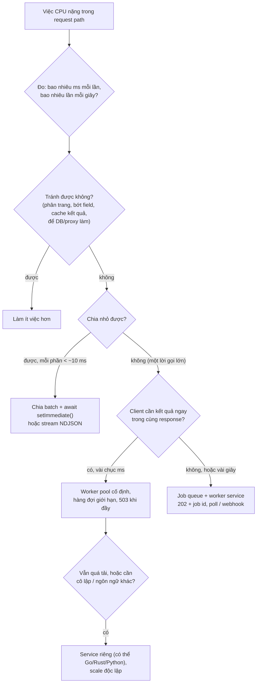
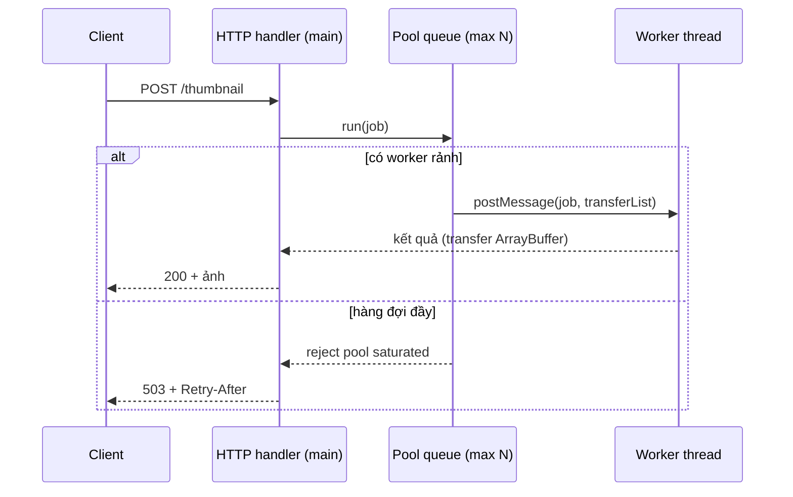

## Bối cảnh & vấn đề

Endpoint báo cáo trả về một JSON 30 MB. Mỗi lần có người mở báo cáo, p99 của **toàn service** nhảy lên gần 1 giây, health check lỡ nhịp, và thỉnh thoảng Kubernetes restart pod vì liveness probe timeout. Profile cho thấy `JSON.stringify` chiếm một khối liền 800 ms trên main thread. Team chuyển phần resize ảnh sang `worker_threads` để "không chặn loop", tạo một worker mới mỗi request, và throughput **giảm** thay vì tăng. Một team khác bật `cluster` với 8 worker trong một pod 2 CPU, và bắt đầu thấy OOMKilled.

Tất cả đều xoay quanh cùng một câu hỏi: **việc tốn CPU nên chạy ở đâu** trong một hệ thống dùng Node. Main thread là tài nguyên duy nhất chạy JavaScript của mọi request, nên việc CPU trên đó là việc **mọi người cùng chờ**. Bài này đi từ nhận diện (chặn trông như thế nào, ai hay gây ra), qua các cách giảm nhẹ trong process (chia nhỏ, stream, worker pool), tới các quyết định kiến trúc (cluster hay replica, job queue hay service riêng).

Phần nền về scheduling cooperative và đo lag nằm ở bài [concurrency & event loop](/tracks/os-concurrency/learn/concurrency-event-loop); cơ chế phân phối connection của `cluster`, chi phí structured clone và `SharedArrayBuffer`/`Atomics` nằm ở bài [multicore Node](/tracks/os-concurrency/learn/multicore-node). Ở đây ta tập trung vào quyết định thực tế và các lỗi hay gặp.

**Interview angle:** "`async` có làm code CPU-bound thành non-blocking không?" là câu lọc cơ bản. Câu phân loại senior là "worker_threads chậm hơn thì vì sao?" và "thiết kế xử lý PDF on-demand", nơi không có đáp án duy nhất mà là chuỗi trade-off.

## Khái niệm

### Chặn event loop nghĩa là gì

Event loop chỉ gọi callback tiếp theo khi callback hiện tại return. **Chặn event loop** là khi một callback (hoặc một chuỗi microtask) chạy lâu, ví dụ 200 ms: trong 200 ms đó không request nào được parse, không response nào được gửi, không timer nào chạy, không health check nào được trả lời. Latency của **mọi** request đang chờ cộng thêm 200 ms. Với 50 request/s, chỉ cần mỗi request có 20 ms CPU là main thread đã bận 100%.

Bọc code CPU trong `async` hay `new Promise` không thay đổi gì: executor của promise chạy đồng bộ, và phần sau `await` là microtask, vẫn trên cùng thread. Chỉ có ba cách thật sự giải phóng main thread: làm **ít** việc hơn, **chia nhỏ** và nhường giữa các phần, hoặc **chuyển** việc sang thread/process khác.

### Những cách vô tình chặn trong production

- `JSON.parse`/`JSON.stringify` payload hàng chục MB (report, export, cache blob lớn trong Redis).
- API `*Sync` trong request path: `fs.readFileSync`, `crypto.pbkdf2Sync`, `zlib.gzipSync`, `execSync`.
- Regex backtracking thảm hoạ với input xấu (ReDoS, xem bài [security](/tracks/nodejs/learn/security)).
- Thuật toán O(n²) trên dữ liệu lớn: join hai mảng bằng `find` lồng nhau, `array.includes` trong vòng lặp, sort/format hàng trăm nghìn dòng.
- Render template lớn, sinh PDF/Excel bằng thư viện JS thuần, resize ảnh bằng thư viện JS thuần.
- Vòng lặp chỉ toàn `await` trên dữ liệu đã có sẵn, không nhường cho I/O (xem [event loop phases](/tracks/nodejs/learn/event-loop-phases)).
- Logging đồng bộ ra stdout khi stdout là pipe chậm hoặc file (một số logger ghi sync theo mặc định).

### Chia nhỏ và nhường

Nếu việc chia được thành nhiều phần độc lập, xử lý một phần rồi `await setImmediate()` (từ `node:timers/promises`) để I/O và timer chen vào. Tổng thời gian không giảm (thường tăng nhẹ), nhưng **độ trễ tối đa** mà việc này gây cho request khác giảm từ toàn bộ thời gian xuống thời gian một phần. `JSON.stringify` không chia nhỏ được: một lời gọi là một khối đồng bộ. Muốn chia, phải đổi định dạng: **NDJSON** (một object mỗi dòng) hoặc stream một mảng JSON từng phần tử.

### worker_threads

`new Worker(file)` tạo một **thread** mới trong cùng process, với V8 isolate riêng (heap riêng, GC riêng) và event loop riêng. Giao tiếp qua `postMessage` (dữ liệu được **structured clone**, tức copy sâu), qua **transfer** `ArrayBuffer` (chuyển quyền sở hữu, không copy, bên gửi mất quyền truy cập), hoặc qua `SharedArrayBuffer` + `Atomics` (bộ nhớ dùng chung thật). Worker hợp với việc **CPU-bound** trong service: parse, nén, hash, xử lý ảnh bằng JS.

Worker tốn: khởi tạo một isolate và nạp lại module (vài ms tới vài chục ms, vài MB heap), copy dữ liệu qua lại, và một thread OS. Vì vậy dùng **pool cố định** (Piscina, hoặc tự viết) chứ không tạo worker mỗi request. Worker cũng không miễn phí về bộ nhớ: nó nằm trong cùng process, nên heap của mọi worker cộng lại vào RSS và vào memory limit của container. `resourceLimits: { maxOldGenerationSizeMb }` giới hạn heap từng worker.

### cluster

`cluster.fork()` tạo nhiều **process** Node chạy cùng code, chia chung một listening port. Primary nhận connection và phân phối (round-robin trên Linux theo mặc định), hoặc để OS phân phối. Mỗi worker là một process riêng với memory riêng, nên cache in-memory, rate limit counter, session trong RAM **không** chia sẻ giữa chúng. `cluster` hợp khi chạy trên **VM** không có orchestrator và muốn dùng nhiều core cho HTTP I/O-bound. PM2 cluster mode làm điều tương tự.

### child_process

`spawn`, `execFile`, `fork` chạy một **chương trình khác**: ffmpeg, LibreOffice, ImageMagick, một script Python. Đây là cách dùng công cụ không viết bằng JS, và cô lập mạnh nhất (process chết không kéo theo API). `exec` chạy qua shell, nguy hiểm với input người dùng (command injection, xem bài [security](/tracks/nodejs/learn/security)) và buffer toàn bộ stdout.

### Nhiều replica thay vì nhiều process trong một pod

Trên Kubernetes, đơn vị scale là **pod**. Mô hình phổ biến: một process Node mỗi pod, CPU request khoảng 1 core, HPA scale theo CPU, ELU hoặc RPS. Orchestrator đã lo restart, rolling update, health check theo từng pod; nhét `cluster` vào trong pod làm những việc đó phức tạp thêm mà không thêm gì.

## Cơ chế hoạt động

Cây quyết định khi gặp một việc CPU nặng trong request path:



Diễn giải: bước đầu tiên luôn là **đo**, vì cảm giác về "nặng" thường sai (JSON 26 MB trên Node 24 chỉ mất khoảng 76 ms, nhưng 20 request cùng lúc là 1,5 giây). Sau đó ưu tiên theo chi phí: tránh việc rẻ nhất, chia nhỏ rẻ thứ hai, worker pool thêm độ phức tạp vừa phải, job queue và service riêng đắt nhất nhưng cô lập tốt nhất.

Một job đi qua worker pool có hàng đợi giới hạn:



Hàng đợi giới hạn là **backpressure từ pool về client**: thay vì nhận vô hạn job, giữ chúng trong RAM và trả lời sau 30 giây (khi client đã timeout và retry, làm tải tăng gấp đôi), pool từ chối sớm với 503 để load balancer hoặc client chuyển sang instance khác hoặc thử lại sau.

## Ví dụ thực tế

### JSON 26 MB: một cục so với NDJSON chia nhỏ

```js
// json.mjs
import { monitorEventLoopDelay } from 'node:perf_hooks';
import { setImmediate as yieldToLoop, setTimeout as sleep } from 'node:timers/promises';
const rows = Array.from({ length: 200_000 }, (_, i) => ({ id: i, sku: `SKU-${i}`, name: `Product number ${i}`, price: i / 100, tags: ['a', 'b', 'c'], updatedAt: new Date(0).toISOString() }));
async function measure(label, work) {
  const h = monitorEventLoopDelay({ resolution: 10 }); h.enable(); await sleep(50);
  const t = performance.now(); const info = await work(); const ms = performance.now() - t;
  await sleep(50); h.disable();
  console.log(`${label.padEnd(22)} ${info} in ${ms.toFixed(0).padStart(3)} ms, max loop delay ${(h.max / 1e6).toFixed(0)} ms`);
}
let s;
await measure('one JSON.stringify:', () => { s = JSON.stringify(rows); return `${(s.length / 1048576).toFixed(0)} MB`; });
await measure('one JSON.parse:', () => { JSON.parse(s); return `${(s.length / 1048576).toFixed(0)} MB`; });
await measure('NDJSON, yield/2000 rows:', async () => {
  let bytes = 0;
  for (let i = 0; i < rows.length; i += 2000) {
    let chunk = ''; for (let j = i; j < Math.min(i + 2000, rows.length); j++) chunk += JSON.stringify(rows[j]) + '\n';
    bytes += chunk.length; await yieldToLoop();       // trong server thật: if (!res.write(chunk)) await once(res, 'drain')
  }
  return `${(bytes / 1048576).toFixed(0)} MB`;
});
```

```text
one JSON.stringify:    26 MB in  76 ms, max loop delay 83 ms
one JSON.parse:        26 MB in  96 ms, max loop delay 105 ms
NDJSON, yield/2000 rows: 26 MB in  84 ms, max loop delay 12 ms
```

Node 24 (V8 13.6) stringify nhanh hơn nhiều so với các version cũ, nhưng một lời gọi vẫn là một khối chặn: 83 ms loop delay cho mỗi báo cáo, và object thật (lồng sâu, nhiều string) thường chậm hơn nhiều. Bản NDJSON tốn tổng thời gian tương đương nhưng delay tối đa chỉ 12 ms (bằng resolution của histogram). Các lựa chọn cho endpoint 30 MB, từ nhanh tới thiết kế lại:

1. **Làm ít hơn**: phân trang hoặc filter phía server, chỉ trả field cần, tổng hợp trong DB (`GROUP BY`) thay vì trong JS.
2. **Stream**: đọc từ DB cursor, ghi NDJSON hoặc mảng JSON từng phần ra `res` với backpressure; client xử lý dần. Không cần giữ cả 30 MB trong RAM.
3. **Offload**: sinh báo cáo trong background job, lưu file lên S3, trả link (pre-signed URL). Lần xem thứ hai là tải file tĩnh, không tốn CPU của API.
4. **Nén đúng chỗ**: gzip 30 MB cũng tốn CPU; middleware `compression` trong Node làm việc đó trên main thread (zlib stream đẩy sang thread pool nhưng vẫn tranh pool). Để proxy/CDN nén, hoặc lưu sẵn bản nén.
5. **Worker**: stringify trong worker giải phóng main thread, nhưng kết quả là một string 30 MB phải **copy** về main thread (string không transfer được). Thường không đáng, trừ khi worker ghi thẳng ra file hoặc trả về Buffer để transfer.

Đo trước và sau bằng event loop delay p99 và CPU profile (`node --cpu-prof`), không đoán.

### Worker mới mỗi task, pool, clone và transfer

```js
// wpool.mjs (rút gọn): 200 task "resize" ~5 ms CPU trên 4 MB dữ liệu mỗi task
// A) new Worker per task (8 cái song song mỗi đợt)
const w = new Worker(self); w.once('message', () => { w.terminate(); ok(); }); w.postMessage({ id, buf: new ArrayBuffer(size) });
// B) pool cố định availableParallelism() worker, clone rồi transfer
w.postMessage({ id: next++, buf }, transfer ? [buf] : []);
```

```text
new Worker per task : 1249 ms for 200 tasks
pool of 8, clone   : 219 ms for 200 tasks
pool of 8, transfer: 225 ms for 200 tasks
```

```js
// xfer.mjs: round-trip một ArrayBuffer tới worker và về
for (const mb of [4, 256]) {
  const a = new ArrayBuffer(mb * 1048576); new Uint8Array(a).fill(1);
  const clone = await rt(a, []);
  const tr = await rt(a, [a]);
  console.log(`${String(mb).padStart(3)} MB: clone ${clone.toFixed(1)} ms, transfer ${tr.toFixed(1)} ms, byteLength after transfer = ${a.byteLength}`);
}
```

```text
  4 MB: clone 0.9 ms, transfer 0.0 ms, byteLength after transfer = 0
256 MB: clone 54.3 ms, transfer 0.3 ms, byteLength after transfer = 0
```

Tạo worker mỗi task chậm hơn pool **gần 6 lần** vì mỗi lần là một isolate mới, nạp lại module, khởi động JIT từ đầu. Với 4 MB, clone chỉ tốn khoảng 1 ms nên transfer không tạo khác biệt; với 256 MB, clone tốn 54 ms (và gấp đôi bộ nhớ trong lúc copy) còn transfer gần như miễn phí. Sau khi transfer, `byteLength` bên gửi thành 0: buffer đã thuộc về worker.

Các lý do khiến "chuyển sang worker mà chậm hơn", theo thứ tự hay gặp: worker mỗi request; copy dữ liệu lớn (hoặc copy string, vốn không transfer được) thay vì transfer hay truyền đường dẫn file; pool lớn hơn số core **thực** của container (cộng thêm thread pool libuv, GC threads) nên context switch và CFS throttling; thư viện vốn đã chạy native trên thread pool (`sharp` dùng libvips trên pool libuv) nên worker chỉ thêm một tầng; và không có hàng đợi giới hạn nên task dồn trong RAM.

### Worker pool có hàng đợi giới hạn và 503

```js
// pool2.mjs (phần chính)
class WorkerPool {
  #idle = []; #queue = []; #cb = new Map(); #seq = 0;
  constructor(file, size, maxQueue) { this.maxQueue = maxQueue; for (let i = 0; i < size; i++) this.#spawn(file); }
  #spawn(file) {
    const w = new Worker(file);
    w.on('message', ({ id, result }) => { this.#cb.get(id).resolve(result); this.#cb.delete(id); this.#next(w); });
    w.on('error', (err) => { for (const [id, c] of this.#cb) if (c.worker === w) { c.reject(err); this.#cb.delete(id); } this.#spawn(file); }); // thay worker chết
    this.#idle.push(w);
  }
  #next(w) { const job = this.#queue.shift(); if (job) this.#run(w, job); else this.#idle.push(w); }
  #run(w, job) { this.#cb.set(job.id, { ...job, worker: w }); w.postMessage({ id: job.id, n: job.n }); }
  run(n) {
    return new Promise((resolve, reject) => {
      const job = { id: ++this.#seq, n, resolve, reject };
      const w = this.#idle.pop();
      if (w) return this.#run(w, job);
      if (this.#queue.length >= this.maxQueue) return reject(Object.assign(new Error('pool saturated'), { status: 503 }));
      this.#queue.push(job);
    });
  }
}
const pool = new WorkerPool(new URL(import.meta.url), availableParallelism() - 1, 20);
// 60 job fib(30) cùng lúc, đếm tick của một setInterval 10 ms trên main thread
```

```text
pool size=7, maxQueue=20: 60 jobs at once -> 27 done, 33 rejected with 503, 95 ms, main-thread 10 ms ticks: 8
```

7 job chạy ngay, 20 job xếp hàng, 33 job bị từ chối ngay lập tức, và main thread vẫn tick đều (8 lần trong 95 ms). Trong production, dùng Piscina (có sẵn `maxQueue`, `idleTimeout`, abort bằng signal, `resourceLimits`) thay vì tự viết; phần tự viết ở đây chỉ để thấy ba thành phần bắt buộc: pool cố định, hàng đợi có trần, và thay worker khi nó chết.

### cluster trên Kubernetes, và Socket.IO

Câu hỏi "có nên dùng `cluster` khi deploy trên Kubernetes?" thường có câu trả lời **không**, vì năm lý do cụ thể: memory limit của pod bị chia cho N process (mỗi process một heap, một baseline ~40–50 MB) nên dễ OOMKilled; liveness/readiness probe chỉ thấy primary, worker treo mà primary sống thì pod vẫn "healthy"; SIGTERM tới primary phải được forward và chờ từng worker drain; metrics Prometheus mỗi worker một registry, scrape vào một port chỉ thấy một worker; và CPU limit 2 core với 8 worker chỉ tạo throttling. Scale bằng replica cho mọi thứ đó "miễn phí". Dùng `cluster`/PM2 khi chạy trên VM hoặc bare metal không có orchestrator.

Socket.IO nhiều instance (dù là cluster hay nhiều pod) cần hai thứ. **Sticky session** nếu còn bật HTTP long-polling: handshake và các request polling của một client phải về cùng một node, vì session nằm trong RAM node đó (WebSocket thuần là một connection nên không cần). **Adapter** (Redis, Redis Streams, Postgres) để `io.to(room).emit()` trên node A tới được client đang nối vào node B. Chi tiết scale kết nối realtime ở bài [realtime](/tracks/networking/learn/realtime) và bài [graceful shutdown & long-lived connections](/tracks/nodejs/learn/graceful-shutdown).

### Thiết kế cho PDF và resize ảnh on-demand

Không có một đáp án; đây là cách trình bày theo yêu cầu:

| Yêu cầu | Thiết kế | Ghi chú |
|---|---|---|
| Nhỏ, vài chục ms, tải thấp, client cần ngay | Worker pool trong API, `maxQueue`, 503 khi đầy | Rẻ nhất; một PDF lỗi có thể làm worker chết, pool phải thay worker |
| Nặng hoặc bursty (vài giây), client chờ được | API ghi job vào queue (SQS, BullMQ, Kafka), worker service scale theo queue depth, client poll/webhook/SSE | Job id idempotent, retry có giới hạn, DLQ; API không bị ảnh hưởng |
| Kết quả lặp lại nhiều | Cache theo hash của input (ảnh + kích thước), lưu S3, CDN phía trước | Lần thứ hai gần như miễn phí |
| Rất nặng, không đều | Serverless (Lambda) hoặc batch, hoặc service viết bằng ngôn ngữ phù hợp | Cô lập hoàn toàn, trả tiền theo dùng |
| Client cũ bắt buộc nhận PDF trong cùng response | Worker pool/service riêng nhưng API chờ có deadline, circuit breaker, 503 khi quá tải | Giữ timeout của LB trong đầu (60 s trên ALB) |

Quan sát cần có: độ sâu hàng đợi, thời gian chờ và thời gian xử lý (p50/p99), tỉ lệ retry và DLQ, và ELU của API để chứng minh việc nặng đã rời main thread.

## Trade-offs & lựa chọn thay thế

| Cách chạy song song | Isolation | Chia sẻ dữ liệu | Chi phí khởi tạo | Dùng khi |
|---|---|---|---|---|
| Chia nhỏ + `setImmediate` | Không (cùng thread) | Trực tiếp | 0 | Việc chia được, mỗi phần ngắn |
| `worker_threads` pool | Isolate riêng, cùng process (chung RSS, chung thread pool libuv) | Clone, transfer, `SharedArrayBuffer` | Vài ms mỗi worker, một lần | CPU-bound JS trong service, cần kết quả nhanh |
| `child_process` | Process riêng | stdio, IPC, file | Cao (process mới, có thể binary khác) | Gọi ffmpeg/LibreOffice/Python, cô lập crash |
| `cluster` / PM2 | Process riêng | IPC, không chia sẻ RAM | Cao | Nhiều core trên VM không orchestrator |
| N replica (pod) | Hoàn toàn | Qua Redis/DB | Cao nhất | Mặc định trên Kubernetes |
| Job queue + worker service | Hoàn toàn, scale riêng | Qua queue/storage | Cao | Việc dài, bursty, cần retry và sống qua deploy |

Chọn thế nào: bắt đầu từ rẻ nhất có thể đáp ứng yêu cầu latency. Worker thread khi cần kết quả trong vài chục ms và dữ liệu transfer được. Job queue khi việc dài hơn vài giây hoặc tải không đều, vì nó biến "quá tải" thành "hàng đợi dài hơn" thay vì "timeout toàn service". Service riêng khi việc nặng có vòng đời, ngôn ngữ hoặc yêu cầu scale khác hẳn API.

## Edge cases & failure modes

- **Một request độc hại chặn cả service**: một payload JSON 100 MB, một regex xấu, một ảnh 20.000 × 20.000 pixel. Giới hạn kích thước body (`express.json({ limit })`), kích thước ảnh, độ dài input **trước** khi xử lý.
- **Worker crash**: exception không bắt trong worker emit `'error'` trên object Worker và worker thoát; nếu pool không thay worker, pool co lại dần tới 0. Worker bị OOM (vượt `resourceLimits`) cũng vậy.
- **Worker treo**: vòng lặp vô hạn trong worker không bị timeout tự động; cần `worker.terminate()` theo deadline (Piscina hỗ trợ abort bằng signal).
- **Container CPU limit**: `os.cpus().length` trả về số core của máy chủ; dùng `os.availableParallelism()` (tôn trọng cgroup quota trên Node 22/24, verify) hoặc cấu hình tường minh. Pool 16 worker trên 2 CPU chỉ gây throttling.
- **Memory cộng dồn**: mỗi worker một heap; 8 worker × 200 MB heap cộng main thread dễ vượt limit 1 GB. Đặt `resourceLimits.maxOldGenerationSizeMb` và tính tổng.
- **Kết quả lớn không transfer được**: string và object thường luôn bị clone; trả Buffer/ArrayBuffer hoặc ghi ra file và trả đường dẫn.
- **Hàng đợi không giới hạn**: dưới tải cao, job dồn trong RAM, latency tăng vô hạn, client timeout rồi retry làm tải tăng thêm (retry storm).
- **cluster primary chết**: worker của nó bị kill theo; primary nên làm càng ít việc càng tốt.

## Pitfalls

- ❌ "Bọc trong Promise là non-blocking" → ✅ executor và phần sau `await` vẫn chạy trên main thread; chỉ chia nhỏ hoặc chuyển thread mới giải phóng loop.
- ❌ `new Worker()` mỗi request → ✅ pool cố định (Piscina), khởi tạo lúc start.
- ❌ `postMessage` Buffer 200 MB mỗi task → ✅ `transferList`, hoặc truyền đường dẫn/URL thay vì byte.
- ❌ Pool size = `os.cpus().length` trong container → ✅ `availableParallelism()` trừ một core cho event loop, khớp CPU limit.
- ❌ Hàng đợi worker không giới hạn → ✅ `maxQueue` + 503/429 kèm `Retry-After`.
- ❌ `cluster` trong pod Kubernetes → ✅ một process mỗi pod, scale bằng replica, HPA theo CPU/ELU.
- ❌ Gzip response 30 MB trong Node → ✅ giảm payload, stream, hoặc để proxy/CDN nén, lưu sẵn bản nén.

## Tóm tắt

- Chặn event loop = một callback dài làm mọi request chờ; `async` không giải quyết việc CPU-bound.
- Nguồn chặn phổ biến: JSON lớn, API `*Sync`, regex backtracking, O(n²), render/sinh file bằng JS thuần.
- JSON 26 MB: stringify một cục 83 ms delay, NDJSON chia batch 12 ms; `JSON.stringify` không chia nhỏ được.
- `worker_threads` cho CPU-bound trong service: pool cố định (worker mỗi task chậm ~6 lần), transfer cho buffer lớn (256 MB: 54 ms clone vs 0,3 ms transfer).
- Pool phải có hàng đợi giới hạn và trả 503 khi đầy; thay worker khi nó chết.
- `cluster` cho VM; Kubernetes thì một process mỗi pod. Socket.IO nhiều node cần adapter, và sticky session nếu có long-polling.
- Việc nặng on-demand: worker pool khi nhỏ, job queue + worker service khi dài hoặc bursty, cache theo hash input, service riêng khi cần cô lập.
