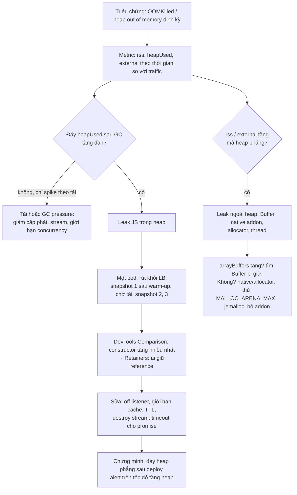
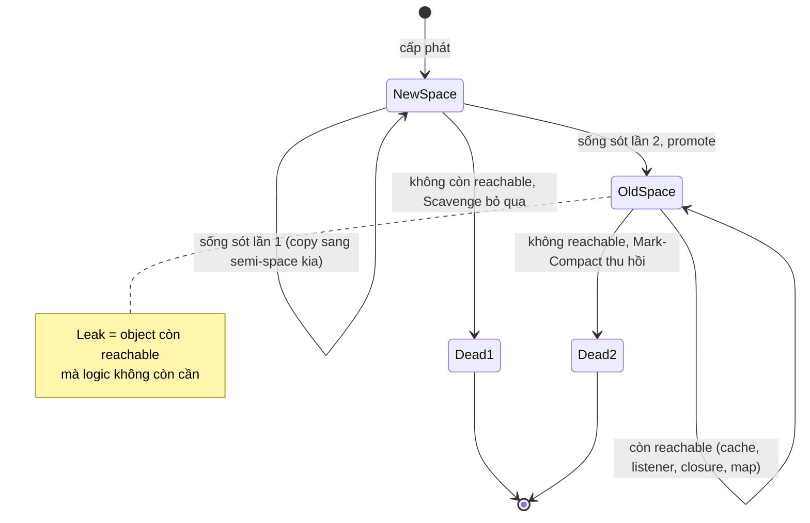

## Bối cảnh & vấn đề

Một service Node trên Kubernetes bị **OOMKilled** khoảng hai ngày một lần. Team đã tăng memory limit từ 512 MB lên 1 GB, và kết quả là pod chết bốn ngày một lần thay vì hai. Đề xuất tiếp theo là "restart hằng đêm bằng cron". Không ai biết memory tăng ở đâu: heap JS, Buffer, hay native. Không ai có bằng chứng đối tượng nào đang bị giữ lại, bởi ai.

Kịch bản này phổ biến tới mức nó là câu hỏi phỏng vấn kinh điển, và câu trả lời "tăng RAM và restart hằng đêm" là red flag. Bài [memory, GC & leak](/tracks/javascript/learn/memory-gc-v8) của track JavaScript đã dạy reachability, các nguồn leak kinh điển (cache, closure, timer), Map vs WeakMap, và cách đọc heap snapshot trong DevTools. Bài [container resources](/tracks/os-concurrency/learn/container-resources) đã dạy cgroup, OOM killer và cách đặt `--max-old-space-size` theo limit của container. Bài này nối hai phần đó thành **quy trình chẩn đoán trong Node production**: GC của V8 ở mức đủ để đọc số liệu, ý nghĩa của từng con số trong `process.memoryUsage()`, cách phân biệt leak với tải, và cách lấy bằng chứng mà không làm sập pod.

**Interview angle:** interviewer không muốn nghe danh sách "nguyên nhân leak thường gặp". Họ muốn nghe **quy trình**: xác nhận là leak (không phải tải hay GC pressure), khoanh vùng trong hay ngoài heap, lấy snapshot an toàn, so sánh, đọc retainers, sửa, và chứng minh bằng metric sau deploy.

## Khái niệm

### Heap của V8 chia theo thế hệ

V8 dựa trên **giả thuyết thế hệ**: hầu hết object chết trẻ (object tạm của một request), số ít sống lâu (cache, module, connection). Heap chia thành **young generation** (new space, vài MB tới vài chục MB) và **old generation** (old space và các space phụ: code, large object, map). Object mới được cấp phát ở new space. Object sống sót qua hai lần dọn new space được **promote** (chuyển) lên old space.

Hai thuật toán tương ứng. **Scavenge** (minor GC) dọn new space bằng cách copy object còn sống sang nửa bên kia (semi-space), rồi bỏ cả nửa cũ: nhanh (thường dưới vài ms), chạy thường xuyên, chi phí tỉ lệ với số object **sống**, không phải số rác. **Mark-Compact** (major GC) dọn old space: đánh dấu mọi object reachable từ root, quét bỏ phần còn lại, và nén lại để giảm phân mảnh. V8 (Orinoco) làm phần lớn việc mark **concurrent** trên thread nền và **incremental** xen giữa JS, nên pause chính thường ngắn, nhưng khi heap lớn và đầy, một major GC vẫn có thể dừng main thread hàng trăm ms.

### heap_size_limit và --max-old-space-size

`--max-old-space-size=<MiB>` giới hạn **old generation**. `v8.getHeapStatistics().heap_size_limit` là tổng giới hạn heap, gồm old space cộng young generation: đo trên Node 24, `--max-old-space-size=512` cho `heap_size_limit` = 704 MB. Không đặt cờ, V8 tự chọn: trên laptop 16 GB đo được 4.288 MB; trong container, Node gần đây đọc giới hạn cgroup và chọn khoảng một nửa limit, với sàn khoảng 259 MB (xem [container resources](/tracks/os-concurrency/learn/container-resources), verify theo version).

Khi old space chạm giới hạn và GC không thu hồi đủ, V8 in `FATAL ERROR: Reached heap limit Allocation failed - JavaScript heap out of memory` kèm vài dòng log GC cuối, rồi **abort** (exit code 134, SIGABRT). Điều này khác hẳn **OOMKilled** (exit 137, SIGKILL từ kernel khi cả container vượt `memory.max`), vốn không để lại dòng log nào. Tăng heap **không sửa leak**, chỉ đổi thời điểm chết. Đặt heap tường minh (khoảng 70–75% limit container, thấp hơn nếu dùng nhiều Buffer/worker) để V8 chạm giới hạn của nó trước kernel, và có log để chẩn đoán.

### Năm con số của process.memoryUsage()

- **`rss`** (resident set size): bộ nhớ vật lý process đang chiếm: heap V8, code JIT, stack các thread, Buffer, bộ nhớ của native addon, allocator. Gần nhất với con số Kubernetes dùng để quyết định OOMKilled (chính xác hơn là working set của cgroup).
- **`heapTotal`**: phần heap V8 đã xin từ OS. **`heapUsed`**: phần đang chứa object (sống hoặc chưa được dọn).
- **`external`**: bộ nhớ C++ gắn với object JS, chủ yếu là backing store của Buffer/ArrayBuffer. **`arrayBuffers`**: phần ArrayBuffer/Buffer trong `external`.

Đọc pattern: `heapUsed` sau GC tăng dần → leak JS (object bị giữ reference). `rss` và `external` tăng mà heap phẳng → Buffer bị giữ (upload trong RAM, chunk dồn vì bỏ qua backpressure, view nhỏ giữ buffer lớn), native addon leak, hoặc phân mảnh allocator (glibc malloc với nhiều thread; thử `MALLOC_ARENA_MAX=2` hoặc jemalloc, verify). `rss` tăng mà cả heap và external phẳng → thread stack, code, hoặc native.

### Đáy răng cưa: leak hay tải?

Đồ thị `heapUsed` luôn có dạng **răng cưa**: tăng khi cấp phát, rơi khi GC. Chiều cao của răng phản ánh tốc độ cấp phát (tải). Thứ phân biệt leak là **đáy** của răng, tức heap ngay sau mỗi lần major GC: đáy phẳng là bình thường dù đỉnh cao; đáy **tăng dần** theo thời gian với traffic ổn định là leak. Một spike memory theo traffic rồi về lại mức cũ là tải, không phải leak.

### GC pressure khác leak

**GC pressure** là khi process cấp phát quá nhanh (tạo nhiều object tạm, string lớn, JSON lớn), nên GC chạy liên tục và chiếm nhiều CPU. Heap có thể không tăng, nhưng latency tăng và CPU cao. Dấu hiệu trong metric: tổng thời gian GC mỗi phút cao (từ `PerformanceObserver` entry `gc` hoặc `--trace-gc`), nhiều Mark-Compact, event loop delay có spike trùng với major GC, trong khi đáy heap phẳng. Sửa bằng cách **giảm cấp phát** (stream thay vì buffer cả cục, tái sử dụng object, bớt `JSON.parse`/`stringify`), không phải bằng cách tìm leak.

### Heap snapshot và retainers

**Heap snapshot** là ảnh chụp toàn bộ đồ thị object của V8 heap: mọi object, kích thước, và cạnh tham chiếu giữa chúng. **Shallow size** là kích thước bản thân object; **retained size** là bộ nhớ sẽ được giải phóng nếu object đó biến mất (nó cộng mọi thứ chỉ reachable qua nó). **Retainers** là chuỗi tham chiếu từ root tới object, câu trả lời cho "ai đang giữ nó?". Phương pháp chuẩn là chụp 2–3 snapshot cách nhau (sau warm-up, dưới tải), mở chế độ **Comparison** trong Chrome DevTools, sắp theo `# Delta` hoặc retained size, chọn constructor tăng nhiều nhất và đọc retainers.

Cách lấy snapshot trong Node: `v8.writeHeapSnapshot()` (qua endpoint admin có bảo vệ), khởi động với `--heapsnapshot-signal=SIGUSR2` rồi `kill -USR2 <pid>`, hoặc `--heapsnapshot-near-heap-limit=N` để V8 tự chụp tối đa N lần khi heap gần chạm giới hạn. Chụp snapshot **dừng main thread** (vài giây tới vài chục giây với heap lớn) và tốn thêm bộ nhớ cỡ heap; file snapshot cũng cỡ heap. Làm trên **một** pod đã rút khỏi load balancer.

### Những thứ giữ object sống trong server Node

Ngoài các nguồn chung (cache không giới hạn, closure, timer), server Node có vài nguồn riêng: listener đăng ký theo request lên emitter sống lâu (bus toàn cục, socket dùng chung, `process`); `Map` theo `requestId`/`socketId` không xoá khi connection đóng; **promise pending bị giữ** trong một danh sách (hàng đợi waiter của pool, map các request đang chờ phản hồi qua message queue không có timeout); stream bị pause mãi không ai destroy (kèm buffer của nó); `AsyncLocalStorage` store chứa object lớn, sống theo mọi callback con. Một promise pending **không** tự leak: nếu không có gì tham chiếu tới nó, GC thu hồi được. Nó leak khi có cấu trúc nào đó giữ nó (hoặc giữ resolve function của nó) mà không bao giờ settle.

## Cơ chế hoạt động

Quy trình từ "OOMKilled mỗi hai ngày" tới bằng chứng và bản sửa:



Diễn giải: bước quan trọng nhất là hai câu hỏi ở giữa. Đáy heap tăng thì snapshot sẽ tìm ra thủ phạm. Heap phẳng mà RSS tăng thì snapshot **không** giúp được, vì nó chỉ nhìn thấy V8 heap; khi đó phải nhìn `arrayBuffers` (Buffer bị giữ vẫn có object JS nhỏ trỏ tới, nên snapshot vẫn thấy chúng dưới dạng `ArrayBuffer`/`Buffer` với retained size lớn), hoặc đi sang công cụ native.

Vòng đời của một object và nơi GC có thể bỏ sót:



## Ví dụ thực tế

### Hai cách chết khác nhau

```js
// oom.cjs
const leak = [];
setInterval(() => { for (let i = 0; i < 20000; i++) leak.push({ id: i, payload: 'x'.repeat(100) + i }); }, 1);
```

```text
$ node -p "(require('v8').getHeapStatistics().heap_size_limit/2**20).toFixed(0)+' MB'"
4288 MB                                  # laptop 16 GB, không cờ
$ node --max-old-space-size=512 -p "(require('v8').getHeapStatistics().heap_size_limit/2**20).toFixed(0)+' MB'"
704 MB                                   # old space 512 + young generation
$ node --max-old-space-size=64 oom.cjs; echo "exit=$?"
<--- Last few GCs --->
[51913:0x96680c000]       69 ms: Mark-Compact 58.4 (77.2) -> 54.6 (123.4) MB, pooled: 0 MB, 18.50 / 0.00 ms ...
[51913:0x96680c000]      150 ms: Mark-Compact (reduce) 93.9 (130.6) -> 89.7 (94.5) MB, pooled: 0 MB, 51.08 / 0.00 ms ...
FATAL ERROR: Reached heap limit Allocation failed - JavaScript heap out of memory
----- Native stack trace -----
 1: 0x104b7ff44 node::(anonymous namespace)::DefaultAbortHandler(char const*, char const*)
 ...
exit=134
```

Log GC cuối cùng kể câu chuyện: Mark-Compact liên tiếp chỉ thu hồi được vài MB (58,4 → 54,6, 93,9 → 89,7), tức gần như mọi thứ đều còn reachable. Đó là chữ ký của leak. Exit 134 cho biết V8 tự abort; nếu bạn thấy exit 137 và không có dòng log nào, thủ phạm là kernel (container vượt limit trước khi V8 chạm heap limit), và heap limit đang đặt quá cao so với container.

### Đọc log --trace-gc và đếm GC trong process

```text
$ node --trace-gc app.js
[52041:0xb8a80c000]       14 ms: Scavenge 4.5 (6.3) -> 4.2 (7.3) MB, pooled: 0 MB, 0.46 / 0.00 ms  (average mu = 1.000, current mu = 1.000) allocation failure;
[52041:0xb8a80c000]       20 ms: Scavenge 6.6 (10.3) -> 6.1 (10.3) MB, pooled: 0 MB, 1.67 / 0.00 ms  (average mu = 1.000, current mu = 1.000) allocation failure;
```

Mỗi dòng: loại GC, heap đã dùng trước → sau (trong ngoặc là heap đã cấp), và thời gian pause. `mu` (mutator utilization) là tỉ lệ thời gian JS được chạy; giảm dần về 0 nghĩa là process dành phần lớn thời gian cho GC. Trong production, `--trace-gc` quá ồn; dùng `PerformanceObserver` với `entryTypes: ['gc']` để xuất metric (số lần và tổng thời gian theo loại). Đo trong một vòng cấp phát 3 triệu object ngắn hạn trên Node 24: `minor: 7 (max 5.6 ms), incremental: 2 (max 8.6 ms)`.

### Đáy heap: leak so với cache có giới hạn

```js
// node --expose-gc floor.mjs leak|bounded
const cache = new Map();
function handleRequest(i) {
  const user = { id: i, profile: 'x'.repeat(500), roles: ['a', 'b'] };
  const garbage = Array.from({ length: 200 }, (_, k) => ({ k }));       // việc tạm của request
  if (mode === 'leak') cache.set(`req:${i}`, user);                    // key theo request, không bao giờ xoá
  else { cache.set(`user:${i % 1000}`, user); }                        // key space có giới hạn
  return garbage.length;
}
for (let round = 1; round <= 6; round++) {
  for (let r = 0; r < 50_000; r++) handleRequest(i++);
  globalThis.gc(); floors.push(mb(process.memoryUsage().heapUsed));
}
```

```text
bounded heapUsed after GC per round (MB): 4.0 -> 4.0 -> 4.0 -> 4.0 -> 4.0 -> 4.0  cache.size=1000
leak    heapUsed after GC per round (MB): 28.0 -> 52.7 -> 79.1 -> 102.0 -> 124.9 -> 154.8  cache.size=300000
```

Cùng lượng việc và cùng lượng rác mỗi round, nhưng đáy của bản leak tăng khoảng 25 MB mỗi 50.000 request. Ở 200 request/s, đó là khoảng 8,6 GB mỗi ngày trước khi tính các object khác: đủ để giải thích "OOMKilled mỗi hai ngày" với limit 1 GB và cache nhỏ hơn. Metric cần alert là **tốc độ tăng của đáy heap** (ví dụ `heapUsed` p10 theo cửa sổ 1 giờ, tăng liên tục 6 giờ), không phải một ngưỡng tuyệt đối.

### Leak listener SSE, chứng minh bằng snapshot

```js
// sseleak.mjs
const priceBus = new EventEmitter();
priceBus.setMaxListeners(0); // ai đó đã "sửa" warning, và che luôn leak
const server = http.createServer((req, res) => {
  res.setHeader('Content-Type', 'text/event-stream'); res.flushHeaders();
  const handler = (p) => res.write(`data: ${JSON.stringify(p)}\n\n`);
  priceBus.on('price', handler);
  if (fixed) res.on('close', () => priceBus.off('price', handler));
});
// Đếm object theo constructor trong heap snapshot (việc DevTools Summary làm)
function countInSnapshot(names) {
  const file = v8.writeHeapSnapshot();
  const snap = JSON.parse(fs.readFileSync(file, 'utf8')); fs.unlinkSync(file);
  const f = snap.snapshot.meta.node_fields, nameIdx = f.indexOf('name'), step = f.length;
  const counts = Object.fromEntries(names.map((n) => [n, 0]));
  for (let i = 0; i < snap.nodes.length; i += step) { const n = snap.strings[snap.nodes[i + nameIdx]]; if (Object.hasOwn(counts, n)) counts[n]++; }
  return counts;
}
// 1000 client SSE lần lượt kết nối rồi rời đi
```

```text
$ node sseleak.mjs
leaky: 1000 SSE clients came and went -> price listeners = 1000, heap objects: { ServerResponse: 1003, Socket: 1007 }
$ node sseleak.mjs fixed
fixed: 1000 SSE clients came and went -> price listeners = 0, heap objects: { ServerResponse: 3, Socket: 7 }
```

1.000 client đã ngắt kết nối, nhưng 1.000 `ServerResponse` và socket tương ứng vẫn sống: mỗi listener là một closure giữ `res`, và `priceBus` sống suốt đời process giữ mọi listener. Trong DevTools, Retainers của một `ServerResponse` sẽ đi qua `handler` (closure) → mảng `_events.price` → `priceBus` → biến module. Bản sửa gỡ listener khi `res` đóng; cách viết gọn hơn là `for await (const [p] of on(priceBus, 'price', { signal }))` với signal abort khi `close`, vì `events.on` tự gỡ listener khi vòng lặp kết thúc. Thêm hai lớp bảo vệ: kiểm tra `res.write()` trả `false` (client chậm) để bỏ message hoặc ngắt client, và giới hạn số kết nối mỗi instance. Chi tiết ở bài [graceful shutdown & long-lived connections](/tracks/nodejs/learn/graceful-shutdown).

Một chi tiết vui trong script này: phiên bản đầu dùng `if (n in counts)` và đếm ra cả `toString`, `constructor`, `hasOwnProperty` (tên trong snapshot trùng với property kế thừa từ `Object.prototype`). `Object.hasOwn` sửa được. Đó là cùng loại lỗi dẫn tới prototype pollution (xem bài [security](/tracks/nodejs/learn/security)).

### Lấy snapshot tự động khi gần chạm giới hạn

```text
$ node --max-old-space-size=64 --heapsnapshot-near-heap-limit=1 oom.cjs
Wrote snapshot to .../Heap.20260930.000742.57907.0.001.heapsnapshot
<--- Last few GCs --->
[57907:0xc4c80c000]     4595 ms: Mark-Compact (reduce) 300.2 (374.2) -> 293.8 (305.4) MB, ... 790.75 / 0.00 ms ...
FATAL ERROR: Reached heap limit Allocation failed - JavaScript heap out of memory
$ ls -la *.heapsnapshot
176306826 Heap.20260930.000742.57907.0.001.heapsnapshot
```

Snapshot được ghi ngay trước khi process chết, nên bạn có bằng chứng từ đúng thời điểm leak lớn nhất. Hai điều cần biết từ output này: để có chỗ chụp, V8 tạm **nâng** giới hạn heap (heap lên tới 300 MB dù cờ là 64), và file nặng 176 MB. Trong container, RSS vọt lên có thể khiến kernel OOMKill trước khi snapshot ghi xong; cho container thêm headroom khi bật cờ này, và ghi file vào volume đủ lớn (không phải `/tmp` nhỏ trong memory).

### Quy trình trên Kubernetes

1. **Xác nhận**: dashboard `heapUsed`, `rss`, `external` theo pod, 7 ngày. Đáy heap tăng đều → leak JS.
2. **Khoanh vùng thời điểm**: đáy tăng theo số request, theo một endpoint, hay theo một cron? So với deploy gần nhất.
3. **Chọn một pod**, đánh dấu not-ready để LB rút traffic (hoặc dùng pod canary nhận ít traffic), đảm bảo memory headroom.
4. **Snapshot 1** sau warm-up; để chạy thêm (hoặc bắn tải tái hiện endpoint nghi ngờ) 10–30 phút; **snapshot 2, 3**. Lấy file ra bằng `kubectl cp`.
5. **Comparison** trong DevTools: constructor có delta dương lớn nhất và retained size lớn nhất; đọc **Retainers** tới khi gặp tên biến hoặc module của bạn.
6. **Sửa và chứng minh**: deploy, xem đáy heap phẳng trong vài ngày, thêm alert trên tốc độ tăng heap để lần sau phát hiện sớm.

Nếu snapshot quá tốn kém, `--heap-prof` (sampling heap profiler) ghi lại **nơi cấp phát** object còn sống với chi phí thấp hơn nhiều, đủ để chỉ ra dòng code tạo ra object bị giữ.

## Trade-offs & lựa chọn thay thế

| Công cụ | Trả lời câu hỏi | Chi phí | Dùng khi |
|---|---|---|---|
| Metric `memoryUsage()`, `getHeapStatistics()` | Leak hay tải? Trong hay ngoài heap? | Gần 0 | Luôn bật, mọi service |
| `PerformanceObserver` gc, `--trace-gc` | GC pressure? Pause dài? | Thấp / ồn | GC chiếm CPU, latency spike |
| Heap snapshot (`writeHeapSnapshot`, signal) | Object nào bị giữ, ai giữ? | Dừng loop vài giây, thêm RAM cỡ heap | Đã xác nhận leak JS |
| `--heapsnapshot-near-heap-limit` | Trạng thái heap ngay trước khi chết | Chỉ tốn khi gần chết | Leak hiếm, khó tái hiện |
| `--heap-prof` (sampling) | Code nào cấp phát object còn sống | Thấp–vừa | Cần dấu vết theo dòng code, snapshot quá đắt |
| Tăng memory limit / restart định kỳ | Không trả lời gì | Tiền, và leak vẫn còn | Chỉ là mitigation tạm thời trong lúc điều tra |

Chọn thế nào: metric trước, luôn luôn; chúng rẻ và trả lời hai câu hỏi đầu. Snapshot khi đã chắc leak nằm trong heap. Near-heap-limit cho leak chỉ xuất hiện sau nhiều ngày. Tăng limit hay restart định kỳ có thể mua thời gian, nhưng phải đi kèm việc điều tra, không thay nó.

## Edge cases & failure modes

- **Snapshot làm sập pod**: chụp trên pod gần limit cần thêm bộ nhớ cỡ heap, kernel OOMKill giữa chừng; đồng thời main thread dừng nên liveness probe fail và kubelet restart pod. Rút pod khỏi LB, tạm nới liveness, đảm bảo headroom.
- **Snapshot chứa dữ liệu nhạy cảm**: token, PII, secret trong string của heap. Xử lý file như dữ liệu production: không gửi qua chat, xoá sau khi phân tích.
- **Heap phẳng nhưng OOMKilled**: leak ngoài heap (Buffer, native, allocator) hoặc heap limit mặc định lớn hơn limit container. Snapshot không giúp; nhìn `arrayBuffers`, `rss - heapTotal`.
- **Leak chỉ xảy ra với một tenant hoặc một endpoint hiếm**: snapshot dưới tải tổng hợp không tái hiện. Dùng near-heap-limit trên production, hoặc tách traffic theo route.
- **Worker threads**: mỗi worker có heap riêng; `process.memoryUsage()` trên main thread không phản ánh heap của worker. Đo trong worker (`resourceLimits`, `worker.getHeapSnapshot()`).
- **Tăng heap làm pause dài hơn**: heap 4 GB đầy có major GC dài hơn heap 512 MB. Heap lớn không miễn phí về latency.
- **Promise "leak" do thiếu timeout**: map `pendingReplies.set(correlationId, { resolve })` chờ phản hồi qua queue; phản hồi không bao giờ tới thì entry sống mãi. Mọi thứ chờ bên ngoài cần timeout và dọn entry.

## Pitfalls

- ❌ "Tăng memory limit và restart hằng đêm" là bản sửa → ✅ đó là mitigation; quy trình là xác nhận, khoanh vùng, snapshot, so sánh, sửa, chứng minh.
- ❌ Nhìn đỉnh `heapUsed` để kết luận leak → ✅ nhìn **đáy sau GC** theo thời gian với traffic ổn định.
- ❌ Dùng heap snapshot để tìm leak khi RSS tăng mà heap phẳng → ✅ nhìn `external`/`arrayBuffers` và công cụ native.
- ❌ `--max-old-space-size` bằng đúng memory limit của container → ✅ khoảng 70–75%, chừa chỗ cho young gen, Buffer, stack, native.
- ❌ Chụp snapshot trên pod đang nhận traffic → ✅ một pod đã rút khỏi LB, có headroom, liveness được nới tạm thời.
- ❌ `setMaxListeners(0)` để tắt warning → ✅ gỡ listener khi connection đóng, hoặc `events.on(..., { signal })`.
- ❌ Coi mọi promise pending là leak → ✅ chỉ leak khi có cấu trúc giữ nó (hoặc resolve của nó) mà không settle; thêm timeout.

## Tóm tắt

- V8 heap theo thế hệ: Scavenge dọn new space nhanh và thường xuyên; Mark-Compact (concurrent/incremental) dọn old space, có thể pause dài khi heap lớn và đầy.
- `--max-old-space-size` giới hạn old space; `heap_size_limit` gồm cả young gen (512 → 704 MB). Chạm giới hạn: `heap out of memory`, exit 134; kernel kill: OOMKilled, exit 137, không log.
- `rss` là con số Kubernetes quan tâm; `heapUsed` tăng → leak JS; `external`/`arrayBuffers` tăng → Buffer; RSS tăng một mình → native/allocator.
- Leak = **đáy** răng cưa sau GC tăng dần (đo: 28 → 155 MB qua 6 round); GC pressure = GC chiếm nhiều thời gian mà đáy phẳng.
- Snapshot 2–3 lần trên một pod rút khỏi LB, Comparison + Retainers; `--heapsnapshot-near-heap-limit` cho leak hiếm (V8 tạm nâng limit, file cỡ heap).
- Listener theo request trên emitter sống lâu giữ `ServerResponse` (đo: 1.003 so với 3 sau khi sửa).
- Chứng minh bản sửa bằng đáy heap phẳng sau deploy và alert trên tốc độ tăng heap.
