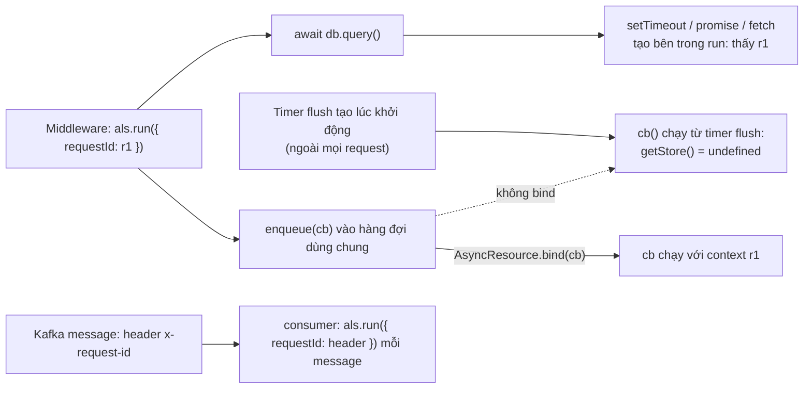
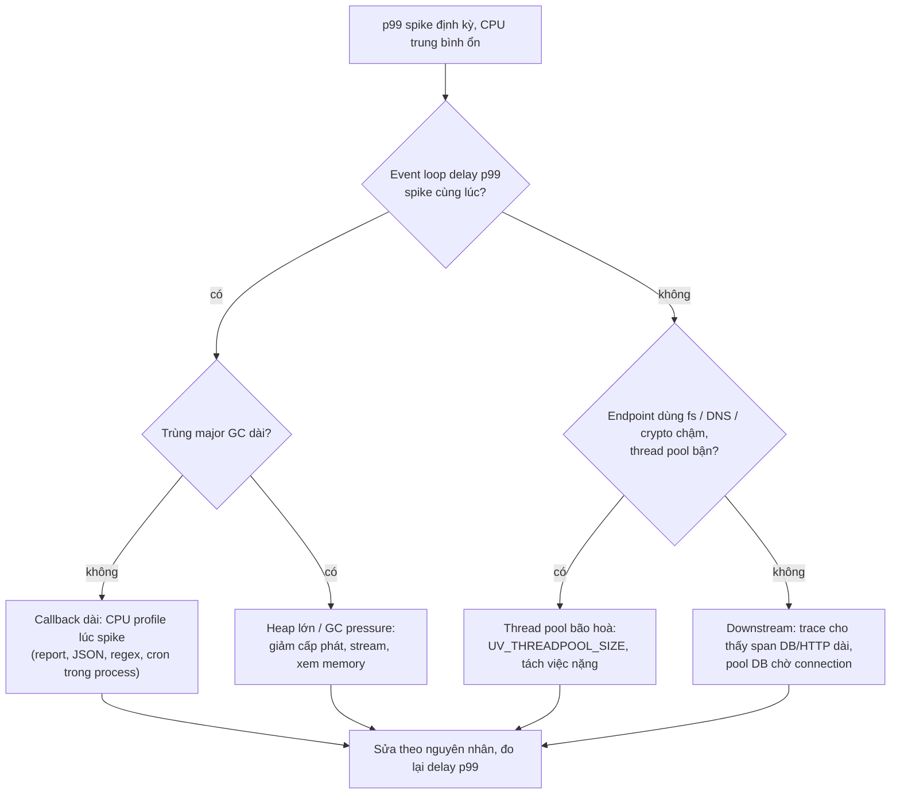

## Bối cảnh & vấn đề

Dashboard của một API cho thấy CPU trung bình 25%, error rate thấp, nhưng p99 latency cứ vài phút lại vọt lên 2 giây rồi tụt về 80 ms. Log có hàng nghìn dòng mỗi giây, nhưng không dòng nào cho biết request nào thuộc tenant nào, và các dòng log của cùng một request không nối được với nhau. Trace thì chưa có. Team mất hai ngày đoán: "chắc database chậm", "chắc do GC", "chắc do load balancer".

Thiếu observability làm mọi sự cố trở thành trò đoán. Với Node, có ba lớp tín hiệu mà ngôn ngữ khác không cần đo riêng: **context đi theo chuỗi async** (vì không có thread-per-request để gắn thread-local), **sức khoẻ của event loop** (vì một callback chậm làm chậm mọi request), và **GC/heap** (vì pause của V8 chặn chính thread đó). Bài này dạy cách gắn context, đo event loop đúng cách, đọc CPU profile, và quy trình điều tra p99. Phần thiết kế observability toàn hệ thống (SLO, alert, tracing đa service) nằm ở track [observability](/tracks/observability).

**Interview angle:** "p99 spike mà CPU trung bình ổn" là câu scenario hay gặp. Interviewer muốn thấy bạn liệt kê giả thuyết cụ thể của Node (callback dài, GC pause, thread pool, cron trong process), biết metric nào xác nhận từng giả thuyết, và dùng profiler thay vì đoán.

## Khái niệm

### AsyncLocalStorage: context đi theo chuỗi async

Trong Java, request context thường nằm trong thread-local vì mỗi request có một thread. Node xử lý hàng nghìn request trên một thread, xen kẽ ở mỗi `await`, nên thread-local vô nghĩa. **AsyncLocalStorage** (ALS, trong `node:async_hooks`) lưu một giá trị ("store") gắn với **chuỗi async** hiện tại: mọi promise, timer, callback được tạo bên trong `als.run(store, fn)` đều nhìn thấy cùng store qua `als.getStore()`, dù chạy ở tick nào.

Cách dùng điển hình: middleware đầu tiên gọi `als.run({ requestId, tenantId }, () => next())`, logger đọc `als.getStore()` và thêm vào mọi dòng log. Đây cũng là nền tảng của OpenTelemetry context propagation trong Node và của `nestjs-cls`. Từ Node 24, ALS mặc định dựa trên **AsyncContextFrame** (context được lưu cùng mỗi async frame thay vì dựa vào async_hooks), nên chi phí thấp hơn đáng kể so với các version cũ (verify theo version).

### Context bị mất ở đâu

Context được bắt lúc một tác vụ async **được tạo**. Nó mất khi callback được lưu lại và gọi sau từ một chỗ **không** thuộc chuỗi async của request: một hàng đợi batch tự viết, một connection pool tự quản callback, một thư viện dùng EventEmitter dùng chung. Khi đó `getStore()` trả về store của ai đã tạo timer flush hàng đợi, thường là `undefined`. Sửa bằng `AsyncResource.bind(fn)` (hoặc `AsyncLocalStorage.bind(fn)`) lúc **nhận** callback, để callback mang theo context của nơi gọi.

Hai cái bẫy khác: `als.enterWith(store)` gán store cho phần còn lại của chuỗi đồng bộ hiện tại mà không có phạm vi rõ ràng, dễ rò context sang request khác; và ALS **không** tự đi qua ranh giới process. Một Kafka consumer không có HTTP middleware, nên phải tự `als.run()` cho từng message, lấy `requestId`/`traceparent` từ **header** của message mà producer đã gắn vào.

### Event loop delay

**Event loop delay** đo độ trễ giữa lúc một timer "nên" chạy và lúc nó thật sự chạy. `perf_hooks.monitorEventLoopDelay({ resolution })` tạo một histogram (nanosecond) lấy mẫu liên tục; bạn đọc `percentile(99)`, `max`, `mean`. p99 cao nghĩa là có callback dài chặn loop. Hai chi tiết đo được trên Node 24: giá trị gồm cả `resolution` (resolution 10 ms thì loop rảnh vẫn cho p50 ≈ 10 ms, nên đọc phần **vượt quá** resolution), và mẫu đầu tiên sau `h.reset()` bị bỏ (một khối chặn xảy ra ngay sau reset không được ghi). Cả hai là chi tiết implementation, verify với version của bạn.

### Event loop utilization (ELU)

**ELU** (`performance.eventLoopUtilization()`) là tỉ lệ thời gian loop **bận** (chạy callback) so với **rảnh** (ngủ trong poll phase) trong một khoảng. Gọi hai lần và truyền giá trị cũ vào để có ELU của khoảng giữa. ELU gần 1 nghĩa là main thread bão hoà: request mới phải xếp hàng. ELU là tín hiệu autoscale tốt hơn CPU% cho Node, vì CPU% cộng cả thread GC và thread pool, còn ELU đo đúng tài nguyên khan hiếm nhất.

Delay và ELU trả lời hai câu hỏi khác nhau. ELU cao, delay thấp: nhiều callback ngắn, loop bận đều, cần scale hoặc giảm việc. ELU thấp, delay p99 cao: loop phần lớn rảnh nhưng thỉnh thoảng có **một** callback rất dài (report, JSON lớn, regex, major GC); scale thêm pod không giúp, phải tìm callback đó.

### GC metrics

`PerformanceObserver` với `entryTypes: ['gc']` nhận một entry cho mỗi lần GC, có `duration` và `detail.kind` (minor, major, incremental, weakcb). Xuất tổng thời gian GC và pause lớn nhất theo loại. Spike latency trùng với major GC dài là dấu hiệu heap lớn hoặc GC pressure (xem [memory & leaks](/tracks/nodejs/learn/memory-gc-leaks)).

### CPU profile

Một **CPU profile** lấy mẫu stack của main thread vài trăm lần mỗi giây và cho biết thời gian nằm ở function nào. `node --cpu-prof` ghi file `.cpuprofile` khi process thoát; `inspector` (qua `--inspect` hoặc module `node:inspector`) cho phép bật/tắt profile trên process đang chạy. Mở file trong Chrome DevTools (Performance hoặc tab JavaScript Profiler): **Bottom-Up** sắp theo **self time** (thời gian chính function đó chạy), **flame chart** cho thấy chuỗi gọi theo thời gian. Built-in như `JSON.stringify` thường được tính vào self time của function gọi nó, và `(garbage collector)` là một dòng riêng.

Công cụ bậc cao: Clinic.js (`clinic doctor` chẩn đoán loại vấn đề, `clinic flame` vẽ flame graph), `0x`. Chúng tiện cho phân tích dưới tải tái hiện; trong production, bật profile ngắn (30–60 giây) trên một pod qua inspector được bảo vệ.

### Diagnostic report

`--report-on-fatalerror`, `--report-uncaught-exception`, `--report-on-signal` ghi một file JSON chụp trạng thái process lúc chết hoặc khi nhận signal: stack JS và native, heap statistics, libuv handles đang mở, biến môi trường, resource usage. Rẻ, nên bật sẵn trong production để lần crash đầu tiên đã có dữ liệu.

## Cơ chế hoạt động

Context của ALS đi theo chuỗi async, và bị mất khi callback nhảy sang một chuỗi khác:



Diễn giải: mọi thứ **tạo** trong `run` kế thừa context. Hàng đợi dùng chung phá chuỗi đó vì callback được gọi từ timer flush, thứ được tạo ngoài mọi request. `bind` chụp context tại lúc enqueue. Consumer của message queue là một điểm vào mới, giống như HTTP middleware, nên phải tự `run`.

Quy trình điều tra p99 spike khi CPU trung bình thấp:



Đọc sơ đồ theo metric có sẵn: event loop delay là phép thử phân nhánh đầu tiên. Nếu nó spike, vấn đề nằm **trên main thread** (callback hoặc GC). Nếu không, vấn đề nằm **ngoài** main thread (thread pool, downstream). Trace của một request chậm bổ sung góc nhìn còn lại: thời gian nằm trong một span (DB, HTTP) hay trong **khoảng trống giữa các span**, tức lúc request đứng chờ loop.

## Ví dụ thực tế

### requestId và tenantId trên mọi dòng log, và chỗ context bị mất

```js
// als.mjs
import { AsyncLocalStorage, AsyncResource } from 'node:async_hooks';
import { setTimeout as sleep } from 'node:timers/promises';
const ctx = new AsyncLocalStorage();
const log = (msg) => console.log(JSON.stringify({ ...ctx.getStore(), msg }));
// Hàng đợi batch tự viết (giống một số driver/pool): callback được lưu và chạy sau từ một timer tạo NGOÀI mọi request
const queue = [];
const flusher = setInterval(() => { while (queue.length) queue.shift()(); }, 5);
const enqueue = (cb) => queue.push(cb);
const enqueueBound = (cb) => queue.push(AsyncResource.bind(cb));
async function handle(requestId, tenantId) {
  await ctx.run({ requestId, tenantId }, async () => {
    log('start');
    await sleep(Math.random() * 10);
    log('after await');
    await new Promise((ok) => enqueue(() => { log('in raw queue callback'); ok(); }));
    await new Promise((ok) => enqueueBound(() => { log('in bound queue callback'); ok(); }));
  });
}
await Promise.all([handle('req-1', 'acme'), handle('req-2', 'globex')]);
log("outside any request"); clearInterval(flusher);
```

```text
{"requestId":"req-1","tenantId":"acme","msg":"start"}
{"requestId":"req-2","tenantId":"globex","msg":"start"}
{"requestId":"req-1","tenantId":"acme","msg":"after await"}
{"requestId":"req-2","tenantId":"globex","msg":"after await"}
{"msg":"in raw queue callback"}
{"msg":"in raw queue callback"}
{"requestId":"req-1","tenantId":"acme","msg":"in bound queue callback"}
{"requestId":"req-2","tenantId":"globex","msg":"in bound queue callback"}
{"msg":"outside any request"}
```

Hai request xen kẽ nhau nhưng mỗi dòng log mang đúng context của nó qua `await` và timer. Callback trong hàng đợi thô mất context (không có `requestId`); bản `bind` giữ được. Trong Express, middleware đầu tiên là `app.use((req, _res, next) => ctx.run({ requestId: req.get('x-request-id') ?? randomUUID(), tenantId: req.tenant?.id }, next))`. Logger như pino có option `mixin` để thêm `ctx.getStore()` vào mọi dòng. Một chi tiết từ lần chạy đầu của script này: nếu flusher được `unref()`, process thoát giữa chừng với `Warning: Detected unsettled top-level await` (exit 13), vì promise đang chờ không giữ event loop sống, chỉ handle mới giữ.

### ELU cao so với delay p99 cao

```js
// elu.mjs
const busy = (ms) => { const e = performance.now() + ms; while (performance.now() < e); };
async function scenario(label, fn) {
  const h = monitorEventLoopDelay({ resolution: 10 }); h.enable();
  const start = performance.eventLoopUtilization();
  await fn();
  const u = performance.eventLoopUtilization(start); h.disable();
  console.log(`${label.padEnd(34)} ELU=${u.utilization.toFixed(2)}  delay p50=${(h.percentile(50) / 1e6).toFixed(0)}ms p99=${(h.percentile(99) / 1e6).toFixed(0)}ms max=${(h.max / 1e6).toFixed(0)}ms`);
}
await scenario('A: many small 2 ms callbacks (80%)', async () => { const end = Date.now() + 2000; while (Date.now() < end) { busy(2); await sleep(0.5); } });
await scenario('B: idle, one 600 ms block', async () => { await sleep(700); busy(600); await sleep(700); });
```

```text
A: many small 2 ms callbacks (80%) ELU=0.62  delay p50=10ms p99=12ms max=12ms
B: idle, one 600 ms block          ELU=0.30  delay p50=12ms p99=12ms max=606ms
GC entries: minor: 7 (max 5.6 ms), weakcb: 2 (max 0.3 ms), incremental: 2 (max 8.6 ms)
```

Kịch bản A là service bận đều: ELU 0,62, delay không đáng kể (p99 12 ms với resolution 10 ms). Kịch bản B là câu follow-up "ELU 0,3 nhưng delay p99 800 ms": loop rảnh phần lớn thời gian, nhưng một khối 600 ms làm **max** delay vọt lên 606 ms. Để ý p99 của B vẫn 12 ms vì trong 2 giây chỉ có một mẫu xấu; trong production với cửa sổ 10 giây và vài khối chặn mỗi phút, p99 sẽ bắt được. Xuất cả `max` lẫn `p99`, và ELU:

```ts
// runtime metrics xuất mỗi 10 s (prom-client cũng có sẵn default metrics tương tự)
const h = monitorEventLoopDelay({ resolution: 20 }); h.enable();
let last = performance.eventLoopUtilization();
setInterval(() => {
  const now = performance.eventLoopUtilization(last); last = performance.eventLoopUtilization();
  metrics.gauge("nodejs_elu", now.utilization);
  metrics.gauge("nodejs_loop_delay_p99_ms", h.percentile(99) / 1e6);
  metrics.gauge("nodejs_loop_delay_max_ms", h.max / 1e6);
  h.reset();
}, 10_000).unref();
```

### Đọc CPU profile

```js
// app.mjs: handler có hot spot ẩn
const rows = Array.from({ length: 50_000 }, (_, i) => ({ id: i, email: `user${i}@example.com`, note: 'lorem ipsum '.repeat(5) }));
function validateEmail(e) { return /^[\w.+-]+@[\w-]+\.[\w.]+$/.test(e); }
function buildReport() { return JSON.stringify(rows.filter((r) => validateEmail(r.email))); }
function formatRow(r) { return `${r.id};${r.email};${r.note.trim()}`; }
function csv() { return rows.map(formatRow).join('\n'); }
for (let i = 0; i < 20; i++) { buildReport(); csv(); }
```

```text
$ node --cpu-prof --cpu-prof-dir=. app.mjs
20 requests took 375 ms
$ node top.mjs     # cộng self time theo function từ file .cpuprofile, như view Bottom-Up
 45.9%    185 ms  buildReport app.mjs:4
 24.7%    100 ms  csv app.mjs:6
 13.4%     54 ms  (garbage collector) :0
  5.8%     23 ms  RegExp: ^[\w.+-]+@[\w-]+\.[\w.]+$ :0
  2.9%     12 ms  (program) :0
  1.7%      7 ms  formatRow app.mjs:5
```

`buildReport` chiếm 46% self time, phần lớn là `JSON.stringify` (built-in được tính vào function gọi nó). GC chiếm 13%, tức cấp phát nhiều. Regex chỉ 6%, nên sửa regex không phải ưu tiên. Với câu follow-up "flame graph cho thấy 40% thời gian trong `JSON.stringify`": giảm payload (field, phân trang), cache kết quả đã serialize khi dữ liệu ít đổi, stream NDJSON, serializer theo schema (như `fast-json-stringify` mà Fastify dùng), hoặc đẩy báo cáo ra background job (xem [việc CPU-bound](/tracks/nodejs/learn/cpu-work-workers)).

### Điều tra p99 spike: một câu trả lời mẫu

1. **Giả thuyết** cụ thể của Node: callback dài (report, JSON, regex), major GC trên heap lớn, thread pool bão hoà (fs/DNS/crypto), downstream chậm hoặc pool DB chờ connection, cron/job chạy chung process, CFS throttling do CPU limit.
2. **Tương quan theo thời gian**: spike có khớp với event loop delay max? Với GC pause (metric gc)? Với một cron (`*/5 * * * *`)? Với throttled periods của cgroup (`container_cpu_cfs_throttled_periods_total`)?
3. **Trace** của vài request chậm (OpenTelemetry): thời gian nằm trong span nào, hay trong khoảng trống giữa span.
4. **Profile** đúng lúc spike: bật CPU profile 60 giây qua inspector trên một pod, hoặc tái hiện dưới tải với `clinic doctor`/`clinic flame`.
5. **Sửa theo nguyên nhân**: tách job CPU khỏi process API, giảm cấp phát, stream thay vì buffer, size thread pool, đặt CPU limit hợp lý. Đo lại delay p99 và p99 latency để chứng minh.

"CPU trung bình ổn" là manh mối: một khối chặn 1,5 giây mỗi 5 phút chỉ tăng CPU trung bình 0,5%, nhưng làm mọi request trong 1,5 giây đó chậm.

### Bộ observability mặc định cho mọi service

- **Metrics**: RED theo route (rate, errors, duration histogram); runtime: ELU, loop delay p99/max, heap used/total, GC pause theo loại, RSS, active handles; pool DB (in-use, waiting, timeout); outbound HTTP latency và error theo downstream.
- **Tracing**: OpenTelemetry auto-instrumentation (http, undici, pg, redis, kafkajs), propagate `traceparent` qua HTTP và qua header của message, context qua ALS.
- **Logging**: JSON có cấu trúc (pino, ghi qua transport chạy trong worker thread để không chặn loop), `requestId`/`traceId`/`tenantId` trên mọi dòng, không log PII/secret, sampling cho log ồn.
- **Diagnostics sẵn sàng**: `--heapsnapshot-signal`, `--report-on-fatalerror`, endpoint profiling có xác thực, `--enable-source-maps` cho stack TypeScript.
- **Alert theo SLO**, không theo mọi metric. Ba alert đầu tiên cho một checkout API: tỉ lệ lỗi 5xx vượt ngân sách SLO (burn rate), p99 latency checkout vượt ngưỡng, và saturation (ELU > 0,8 hoặc pool DB có request chờ kéo dài).

### Kể chuyện load test và incident (câu CV)

Hai câu behavioral trong track này dùng cùng một khung STAR, và điểm cộng lớn nhất là **số liệu thật của bạn** cùng **cơ chế** giải thích vì sao.

- **Load test đổi quyết định thiết kế.** Situation: flow nào, mục tiêu tải lấy từ đâu (traffic đỉnh × hệ số). Task: SLO (p95/p99, error rate). Action: công cụ (k6, Artillery), kịch bản giống thật (dữ liệu đa dạng, think time, không chỉ một endpoint), theo dõi phía server (ELU, loop delay, heap, pool DB wait, slow query). Result: nút thắt tìm ra (ví dụ pool DB 10 connection cho 200 RPS, hay `JSON.stringify` payload lớn) và thay đổi thiết kế cụ thể, kèm số trước/sau. Reflection: môi trường test khác production ở đâu. Để không đo nhầm giới hạn của chính load generator, theo dõi CPU/network của máy chạy k6 và tăng tải từ từ để thấy điểm gãy phía server.
- **Incident xuyên backend, database, frontend.** Situation: triệu chứng user thấy, phạm vi (tenant, số request). Action: giả thuyết → dữ liệu kiểm chứng: log theo `requestId`, trace, metric event loop/pool DB, slow query log và execution plan, network tab phía frontend (request lặp? payload sai?). Tách lớp: lỗi ở FE (gửi request trùng), BE (timeout, pool, logic), hay DB (lock, plan đổi, thiếu index). Mitigate trước, fix gốc sau, postmortem có hành động phòng ngừa. Reflection: telemetry nào sẽ cắt đôi thời gian chẩn đoán (thường là correlation id xuyên suốt FE → BE → DB, hoặc trace).

## Trade-offs & lựa chọn thay thế

| Tín hiệu | Trả lời | Chi phí | Hạn chế |
|---|---|---|---|
| Event loop delay (p99, max) | Có callback dài chặn loop không | Rất thấp | Không nói callback nào |
| ELU | Main thread bão hoà tới đâu | Rất thấp | Không phân biệt nhiều việc nhỏ với một việc lớn |
| CPU% của container | Tổng CPU (JS + GC + pool) | Có sẵn | Che mất việc main thread bão hoà khi có nhiều thread |
| GC metrics | Pause và áp lực GC | Thấp | Cần kết hợp với heap |
| Trace (OTel) | Thời gian nằm ở đâu trong một request | Vừa (sampling) | Khoảng trống giữa span cần tự diễn giải |
| CPU profile | Function nào tốn thời gian | Vừa, trong thời gian bật | Cần tái hiện hoặc bật đúng lúc |
| ALS context trong log | Nối các dòng log của một request/tenant | Thấp trên Node 24 | Mất ở hàng đợi tự quản, không qua process |

Chọn thế nào: metric runtime (delay, ELU, GC, heap) và RED là mặc định, rẻ và luôn bật. Trace và log có context là hạ tầng bắt buộc cho mọi service nói chuyện với service khác. Profiler là công cụ điều tra, bật khi cần. Autoscale theo ELU (hoặc RPS) thường phản ứng đúng hơn CPU% cho Node.

## Edge cases & failure modes

- **Logger đồng bộ chặn loop**: `console.log` ra pipe/file có thể đồng bộ; khối lượng log lớn làm tăng delay. Dùng pino với transport chạy ở worker thread, và sampling.
- **Context rò giữa request** do `enterWith` hoặc do cache một object context rồi dùng lại. Chỉ dùng `run` với phạm vi rõ ràng.
- **Metric cardinality**: gắn `tenantId` hay `userId` làm label Prometheus cho mọi metric làm nổ số time series. Để các định danh chi tiết trong log/trace, không trong label metric.
- **Profile trong production**: bật inspector mở cổng debug; chỉ bật qua kênh có xác thực, thời gian ngắn, trên một pod. Profile cũng làm chậm process vài phần trăm.
- **Histogram delay hiểu sai**: đọc p50 = 10 ms với resolution 10 ms như "loop trễ 10 ms". Trừ baseline, hoặc so với lúc rảnh.
- **Health check đi chung loop**: liveness probe fail vì loop bị chặn làm kubelet restart pod đang làm việc nặng, biến một lần chậm thành mất capacity. Timeout của probe phải lớn hơn khối chặn hợp lệ dài nhất, hoặc tách việc nặng ra.
- **Sampling trace bỏ sót request chậm**: head sampling 1% có thể không có request chậm nào; cân nhắc tail sampling ở collector cho request lỗi/chậm.

## Pitfalls

- ❌ Truyền `requestId` qua mọi tham số hàm hoặc dùng biến global → ✅ AsyncLocalStorage `run` ở middleware, logger đọc `getStore()`.
- ❌ Nghĩ ALS "tự chạy" cho Kafka consumer → ✅ `als.run` cho từng message, lấy id từ header message.
- ❌ Chỉ nhìn CPU% trung bình → ✅ event loop delay max/p99, ELU, và GC pause theo thời gian.
- ❌ Scale thêm pod khi ELU thấp mà delay p99 cao → ✅ tìm callback dài bằng profile; scale không sửa được khối chặn.
- ❌ Đoán nguyên nhân p99 → ✅ tương quan theo thời gian (GC, cron, throttling), trace, rồi profile đúng lúc.
- ❌ `tenantId` làm label cho mọi metric → ✅ label có cardinality thấp (route, status), chi tiết để trong log/trace.
- ❌ Kể chuyện load test không có số → ✅ mục tiêu, SLO, nút thắt, thay đổi thiết kế, số trước/sau.

## Tóm tắt

- AsyncLocalStorage giữ context theo chuỗi async; mất ở hàng đợi/pool tự quản (sửa bằng `AsyncResource.bind`) và ở ranh giới process (consumer tự `run`).
- Event loop delay đo callback dài (giá trị gồm resolution; đọc max và p99); ELU đo mức bão hoà main thread.
- ELU cao + delay thấp: bận đều, scale. ELU thấp + delay max cao: một khối chặn, profile.
- CPU profile (`--cpu-prof`, inspector, Clinic) cho self time theo function; built-in như `JSON.stringify` tính vào function gọi.
- p99 spike: kiểm tra loop delay, GC, thread pool, downstream, cron, CFS throttling theo thứ tự; trace chỉ ra khoảng trống giữa span.
- Mặc định mọi service: RED + runtime metrics, OTel tracing, log JSON có context qua transport worker, diagnostic flags, alert theo SLO.
- Câu behavioral: STAR với số liệu thật và cơ chế, không chỉ kết quả.
