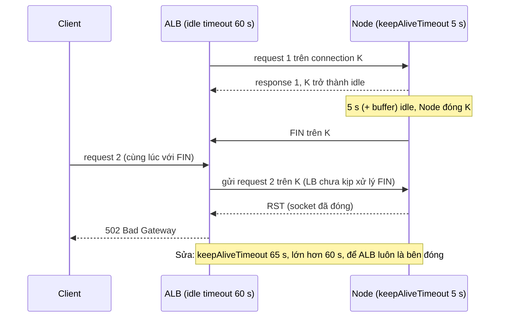
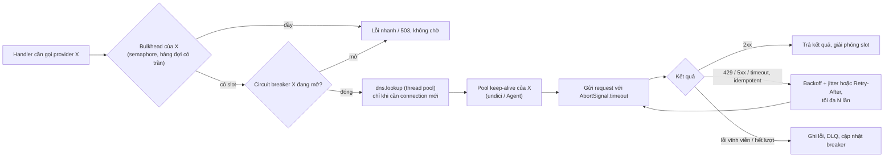

## Bối cảnh & vấn đề

Một API Node chạy sau AWS ALB. Không có deploy, không có lỗi trong log của Node, nhưng dashboard của ALB cứ vài phút lại có vài lỗi **502**, tăng lên khi traffic thấp vào ban đêm. Cùng lúc, service đồng bộ dữ liệu sản phẩm từ các provider bên ngoài có memory tăng dần mỗi khi một provider chậm, và cuối cùng làm chậm cả các provider khác. Sau một lần nâng Node, service không kết nối được `localhost:5432` nữa, dù `127.0.0.1:5432` vẫn chạy.

Cả ba đều là chuyện của lớp HTTP/DNS trong Node, nơi nhiều giá trị mặc định âm thầm quyết định hành vi. Track Networking đã giải thích phía mạng: TCP keep-alive và ECONNRESET ở bài [TCP connections](/tracks/networking/learn/tcp-connections), chuỗi timeout và 502/504 sau proxy ở bài [timeouts & production debugging](/tracks/networking/learn/timeouts-production-debugging), DNS và `dns.lookup` vs `dns.resolve` ở bài [DNS](/tracks/networking/learn/dns). Bài này tập trung vào **phía Node**: các nút vặn của `http.Server`, cách client của Node giữ và dùng lại connection, và cách viết outbound call không làm sập chính mình.

**Interview angle:** câu keep-alive 502 là một gotcha kinh điển: interviewer muốn nghe "keepAliveTimeout của Node phải **lớn hơn** idle timeout của LB" kèm giải thích race. Với outbound, họ muốn nghe bốn chữ: reuse, timeout, retry có điều kiện, giới hạn concurrency.

## Khái niệm

### Các timeout của http.Server

Server HTTP của Node có một nhóm timeout, mỗi cái bảo vệ một giai đoạn khác nhau. Giá trị mặc định đo trên Node 24.21:

| Thuộc tính | Mặc định | Bảo vệ gì |
|---|---|---|
| `keepAliveTimeout` | 5.000 ms | Socket idle giữa hai request trên cùng connection keep-alive bị đóng sau thời gian này |
| `keepAliveTimeoutBuffer` | 1.000 ms | Cộng thêm vào timeout thật của socket, trong khi header `Keep-Alive: timeout=` vẫn quảng cáo `keepAliveTimeout` (verify, thuộc tính mới) |
| `headersTimeout` | 60.000 ms | Thời gian tối đa để nhận xong header của request (chống slowloris) |
| `requestTimeout` | 300.000 ms | Thời gian tối đa nhận xong cả request (header + body) |
| `timeout` (`server.setTimeout`) | 0 (tắt) | Socket không hoạt động quá lâu thì emit `'timeout'` |
| `maxRequestsPerSocket` | 0 (không giới hạn) | Đóng connection sau N request, giúp cân bằng lại tải khi scale |

Không có timeout nào ở đây giới hạn thời gian **handler** của bạn chạy. Một handler chờ DB 10 phút vẫn giữ request 10 phút; deadline cho handler phải do bạn đặt (AbortSignal, timeout của driver).

### Keep-alive giữa load balancer và Node

Load balancer (ALB, Nginx, Envoy) giữ một pool connection keep-alive tới từng backend và dùng lại chúng cho request của nhiều client khác nhau. ALB đóng connection idle sau **idle timeout** của nó (mặc định 60 giây). Node đóng connection idle sau `keepAliveTimeout` (5 giây, cộng buffer). Khi Node đóng trước, có một **race**: đúng lúc Node gửi FIN để đóng socket idle, ALB chọn chính socket đó để gửi request mới. Request đến một socket đang đóng, kernel trả RST, ALB không có response nào để chuyển tiếp nên trả **502** cho client. Node không log gì, vì với nó không có request nào cả.

Quy tắc: timeout idle phía **backend phải lớn hơn** phía proxy đứng trước nó, để proxy luôn là bên đóng connection. Với ALB 60 giây: `server.keepAliveTimeout = 65_000`, và `headersTimeout` lớn hơn `keepAliveTimeout` (các version cũ dùng `headersTimeout` để đếm cả thời gian chờ request tiếp theo trên socket keep-alive, nên để nó nhỏ hơn thì socket bị đóng sớm, verify với version của bạn). Race này xảy ra thường hơn khi traffic thấp, vì connection ngồi idle lâu hơn: đúng triệu chứng "502 tăng vào ban đêm".

### Client: http.Agent và connection reuse

Client `http`/`https` của Node dùng một **Agent** để quản lý socket tới từng `host:port`. Từ Node 19, `http.globalAgent` bật `keepAlive: true` (đo trên Node 24: `keepAlive: true`, `maxSockets: Infinity`, socket rảnh bị đóng sau 5 giây). Không reuse nghĩa là mỗi request một TCP handshake (và một TLS handshake với HTTPS, thêm 1–2 round-trip và CPU), tốn ephemeral port, và để lại socket ở `TIME_WAIT`. Axios và nhiều SDK dùng Agent của Node; truyền `agent: false` hoặc tạo Agent mới cho mỗi request là tự tắt reuse.

`maxSockets: Infinity` là con dao hai lưỡi: dưới tải, client mở bao nhiêu connection cũng được tới một downstream đang chậm. Đặt `maxSockets` (hoặc giới hạn concurrency ở tầng trên) để có trần.

### Client: fetch và undici

`fetch` built-in của Node chạy trên **undici**, một HTTP client viết bằng JS trên `net`, với pool connection riêng theo origin (không dùng `http.Agent`). Pool mặc định keep-alive và không giới hạn số connection; tuỳ chỉnh bằng `new undici.Agent({ connections, keepAliveTimeout, headersTimeout, bodyTimeout })` rồi `setGlobalDispatcher` hoặc truyền `dispatcher` cho từng request. Hai điểm hay gặp: undici có `headersTimeout` và `bodyTimeout` mặc định 300 giây (verify), không có "total timeout", nên luôn truyền `signal: AbortSignal.timeout(ms)`; và response body phải được đọc hết hoặc `cancel()` để connection quay về pool.

### Timeout, retry và concurrency cho outbound call

Một lời gọi ra ngoài cần bốn thứ. **Timeout luôn luôn**: connect timeout và deadline tổng, vì không có timeout thì một downstream treo giữ request, socket và memory của bạn vô hạn. **Retry có điều kiện**: chỉ lỗi tạm thời (network, 5xx, 429) và chỉ request **idempotent** (GET, PUT, hoặc POST có idempotency key), với exponential backoff + **jitter** và số lần có trần; tôn trọng header `Retry-After`. **Giới hạn concurrency** theo từng downstream (semaphore như `p-limit`), để không tự DDoS provider và không vượt rate limit của họ. **Circuit breaker** khi downstream chết hẳn: mở mạch, trả lỗi nhanh, thử lại sau.

### Bulkhead theo provider

Nếu mọi provider dùng chung một pool concurrency, một provider chậm chiếm hết slot và các provider khác đứng chờ. **Bulkhead** là tách tài nguyên theo downstream: mỗi provider một semaphore, một pool connection, một hàng đợi. Provider A chậm chỉ làm đầy hàng đợi của A. Đây là câu trả lời cho câu follow-up "một provider rất chậm, làm sao không kéo các provider khác chậm theo?".

### DNS trong outbound HTTP

`http`, `net` và `fetch` mặc định phân giải hostname bằng **`dns.lookup`**, tức hàm `getaddrinfo` của OS, chạy trên **thread pool** của libuv. Node không cache kết quả DNS; mỗi connection **mới** tới một hostname là một lookup. Hệ quả: DNS chậm (resolver quá tải, timeout 5 giây mỗi lần thử) chiếm thread pool và làm chậm cả `fs` và `crypto`; và không có keep-alive thì số lookup bằng số request. Trong Kubernetes, `ndots:5` trong `/etc/resolv.conf` khiến một tên ngắn như `inventory` được thử lần lượt với từng search domain trước khi thử tên gốc, nhân số query DNS lên nhiều lần; dùng FQDN có dấu chấm cuối (`inventory.default.svc.cluster.local.`) hoặc chỉnh `dnsConfig`.

Thứ tự địa chỉ: từ Node 17, `dns.lookup` trả địa chỉ theo thứ tự OS (`verbatim`), nên `localhost` thường ra `::1` trước `127.0.0.1`. Một Postgres chỉ listen trên IPv4 làm `connect localhost:5432` thất bại với `ECONNREFUSED ::1:5432` trên các version trước khi có Happy Eyeballs. Từ Node 20, `autoSelectFamily` (Happy Eyeballs) bật mặc định: `net.connect` thử song song các family với attempt timeout 250 ms (verify). Các client tự resolve rồi connect vào một IP cụ thể vẫn có thể gặp lỗi này.

## Cơ chế hoạt động

Race giữa ALB và Node khi Node đóng connection idle trước:



Diễn giải: ALB nghĩ connection K còn dùng được tới giây thứ 60. Node đóng nó ở giây thứ 6. Trong khoảng mili giây giữa lúc Node gửi FIN và lúc ALB xử lý FIN, bất kỳ request nào ALB chọn K đều nhận RST. Không có bên nào "sai" theo giao thức; hai timeout chỉ đơn giản không được phối hợp. Khi backend giữ connection lâu hơn proxy, proxy là bên đóng và nó không bao giờ gửi request lên connection mà chính nó đang đóng.

Đường đi của một outbound call có đủ lớp bảo vệ:



## Ví dụ thực tế

### Tái hiện race: socket thật sự đóng khi nào

```js
// ka.mjs: giả làm load balancer giữ connection upstream và bỏ qua gợi ý Keep-Alive
const server = http.createServer((req, res) => res.end('ok'));
server.keepAliveTimeout = Number(process.argv[2] ?? 1000);
// ... mở một socket thô, gửi request 1, đợi gapMs, gửi request 2 trên CÙNG socket
for (const gap of [500, 900, 1500, 1900, 2100, 3000]) { const r = await reuseAfter(gap); console.log(`reuse after ${String(gap).padStart(4)} ms idle (header "Keep-Alive: ${r.hint}"): ${r.outcome}`); }
```

```text
$ node ka.mjs 1000
server.keepAliveTimeout=1000 keepAliveTimeoutBuffer=1000
reuse after  500 ms idle (header "Keep-Alive: timeout=1"): 200
reuse after  900 ms idle (header "Keep-Alive: timeout=1"): 200
reuse after 1500 ms idle (header "Keep-Alive: timeout=1"): 200
reuse after 1900 ms idle (header "Keep-Alive: timeout=1"): 200
reuse after 2100 ms idle (header "Keep-Alive: timeout=1"): already closed -> LB returns 502
reuse after 3000 ms idle (header "Keep-Alive: timeout=1"): already closed -> LB returns 502
```

Header quảng cáo `timeout=1` (giây), nhưng socket thật sự đóng sau khoảng **2 giây** = `keepAliveTimeout` + `keepAliveTimeoutBuffer`. Client tôn trọng header (như Agent của Node) sẽ ngừng dùng socket trước khi server đóng; load balancer bỏ qua header và dùng idle timeout 60 giây của nó sẽ gửi request vào socket đã đóng. Với mặc định 5 giây, bất kỳ connection nào ALB để idle từ 6 tới 60 giây đều có nguy cơ 502. Để xác nhận ở production: log ALB có `elb_status_code=502` với `target_status_code=-` (backend không trả gì) và `target_processing_time=-1`, không có log tương ứng ở Node; metric `HTTPCode_ELB_502_Count` tăng khi traffic thấp. Sửa:

```ts
const server = app.listen(3000);
server.keepAliveTimeout = 65_000; // > ALB idle timeout (60 s)
server.headersTimeout = 66_000;   // > keepAliveTimeout
```

### Connection reuse: đếm TCP connection

```js
// reuse.mjs: 500 request tới một server local, 50 song song mỗi đợt
await run('http.get, agent: false', () => get(false));
await run('http.get, globalAgent (keepAlive)', () => get(undefined));
await run('fetch (undici pool)', async () => { const r = await fetch(url); await r.text(); });
```

```text
http.get, agent: false             500 requests -> 500 TCP connections, 122 ms
http.get, globalAgent (keepAlive)  500 requests ->  50 TCP connections, 55 ms
fetch (undici pool)                500 requests ->  61 TCP connections, 107 ms
```

Không reuse: 500 connection cho 500 request, chậm hơn gấp đôi ngay cả trên localhost (không TLS, RTT gần 0). Qua mạng thật với TLS, mỗi connection mới thêm 1–3 round-trip. Global agent của Node 24 đã keep-alive sẵn: 50 connection, đúng bằng số request song song. Pool undici cũng reuse. Nếu thấy connection count của service bằng request count, tìm chỗ tạo Agent mới hoặc `agent: false`, hoặc body không được đọc hết.

### Bulkhead, timeout, retry và Retry-After (câu CV Data Enrichment)

```js
// enrich.mjs: provider "fast" đôi khi trả 429 + Retry-After, provider "slow" đôi khi treo 5 s
const limiter = (max) => { let active = 0; const q = []; const next = () => { if (active < max && q.length) { active++; q.shift()(); } };
  return (fn) => new Promise((ok, ko) => { q.push(() => fn().then(ok, ko).finally(() => { active--; next(); })); next(); }); };
const limits = { fast: limiter(5), slow: limiter(5) };          // bulkhead: mỗi provider 5 slot riêng
const retryable = (s) => s === 429 || s >= 500;
async function call(provider, sku, { attempts = 4, timeoutMs = 1000 } = {}) {
  for (let a = 1; ; a++) {
    try {
      const r = await fetch(`${base}/${provider}/${sku}`, { signal: AbortSignal.timeout(timeoutMs) });
      if (r.ok) return await r.json();
      await r.body?.cancel();                                          // trả connection về pool
      if (!retryable(r.status) || a === attempts) throw new Error(`HTTP ${r.status}`);
      const ra = Number(r.headers.get('retry-after'));                 // tôn trọng Retry-After (giây)
      await sleep(ra ? ra * 1000 : Math.random() * 100 * 2 ** a);      // nếu không: full-jitter backoff
    } catch (e) {
      if (e.name !== 'TimeoutError' || a === attempts) throw e;
      await sleep(Math.random() * 100 * 2 ** a);
    }
  }
}
// 100 SKU cho mỗi provider, chạy song song hai provider
```

```text
fast provider: 100 ok / 0 failed, peak concurrency 4, 429s received 30
slow provider: 98 ok / 2 failed, peak concurrency 39
total 6981 ms
```

Provider fast trả 30 lần 429 nhưng cả 100 SKU thành công nhờ retry theo `Retry-After`, và không bao giờ nhận quá 5 request cùng lúc. Provider slow không kéo provider fast chậm theo, vì hai bên có slot riêng. Con số đáng chú ý nhất là **peak concurrency 39** ở phía provider slow, dù client chỉ cho phép 5: mỗi lần client timeout sau 500 ms và retry, request cũ **vẫn đang chạy** ở server của provider (nó ngủ 5 giây). Huỷ phía client không dừng việc phía server. Đây là cách một client "lịch sự" vẫn làm quá tải một provider đang chậm; và nếu client không có timeout, chính các request treo đó tích tụ trong memory của client, câu trả lời cho "provider bắt đầu timeout và memory của service tăng". Thêm circuit breaker (mở mạch khi tỉ lệ timeout vượt ngưỡng) để ngừng gửi hẳn trong lúc provider có vấn đề.

Phần còn lại của thiết kế Data Enrichment Service: rate limit theo quota của provider bằng token bucket (dùng chung giữa các instance qua Redis nếu quota là toàn cục); upsert idempotent theo `(tenant, provider, externalId)` cộng hash nội dung để bỏ qua bản ghi không đổi; lỗi dai dẳng vào DLQ/bảng lỗi kèm alert; metric theo provider (success rate, latency, lag của lần sync). Khi kể trong phỏng vấn, điền kiến trúc thật (cron, queue hay Kafka), số provider và volume của bạn.

### DNS lookup xếp hàng sau thread pool

```js
// dnspool.mjs
const lookup = () => new Promise((ok) => { const t = performance.now(); dns.lookup('localhost', () => ok(performance.now() - t)); });
console.log(`dns.lookup('localhost') idle pool : ${(await lookup()).toFixed(1)} ms`);
for (let i = 0; i < 4; i++) crypto.pbkdf2('pw', 'salt', 400_000, 64, 'sha512', () => {});
console.log(`dns.lookup('localhost') busy pool : ${(await lookup()).toFixed(1)} ms   <- waited behind 4 pbkdf2 jobs`);
```

```text
dns.lookup('localhost') idle pool : 5.9 ms
dns.lookup('localhost') busy pool : 112.7 ms   <- waited behind 4 pbkdf2 jobs
```

Một lookup cho `localhost` (không cần mạng) mất 113 ms chỉ vì phải chờ thread pool. Mọi `fetch` tới một hostname cần connection mới đều trả khoản phí này. Các giá trị mặc định liên quan trên Node 24:

```text
$ node -e "..."
dns default order verbatim autoSelectFamily true attemptTimeout 250
lookup localhost [ { address: '::1', family: 6 }, { address: '127.0.0.1', family: 4 } ]
```

Biện pháp: keep-alive để ít connection mới (ít lookup); cache DNS (`cacheable-lookup`, hoặc option `lookup` tuỳ chỉnh cho Agent/undici) với TTL ngắn; `dns.setDefaultResultOrder('ipv4first')` hoặc dùng `127.0.0.1` tường minh khi dịch vụ chỉ listen IPv4; tăng `UV_THREADPOOL_SIZE` nếu DNS và fs cùng tranh pool; FQDN có dấu chấm cuối trong Kubernetes.

## Trade-offs & lựa chọn thay thế

| Lựa chọn | Ưu | Nhược | Khi nào |
|---|---|---|---|
| `fetch` (undici) | Built-in, chuẩn web, pool riêng, nhanh | Không có total timeout mặc định, cấu hình qua dispatcher | Mặc định cho code mới |
| `http.request` + Agent | Kiểm soát chi tiết socket, tương thích lib cũ | API callback dài dòng | Thư viện cũ, cần hook vào socket |
| axios / got | Interceptor, retry plugin, tiện | Thêm dependency, mặc định timeout 0 ở axios | Codebase đã dùng, cần interceptor |
| Retry ở client | Đơn giản | Nhân tải khi downstream quá tải, cần jitter và trần | Lỗi tạm thời, request idempotent |
| Retry qua queue (DLQ, retry topic) | Bền, không giữ request | Không có kết quả đồng bộ | Job đồng bộ dữ liệu, webhook |
| Service mesh / proxy làm retry và timeout | Chính sách tập trung | Retry hai tầng (app + mesh) nhân tải | Nhiều service, đội platform quản lý |

Chọn thế nào: `fetch` với `AbortSignal.timeout` là mặc định; cần pool tuỳ chỉnh thì tạo undici Agent. Retry chỉ ở **một** tầng (app hoặc mesh), không phải cả hai. Việc không cần kết quả ngay (sync provider) thì đưa qua queue để retry bền và không giữ request. Luôn có bulkhead khi gọi nhiều downstream độc lập.

## Edge cases & failure modes

- **Retry storm**: downstream chậm, mọi client timeout và retry cùng lúc, tải nhân 3–4 lần đúng lúc downstream yếu nhất. Jitter, trần số lần, retry budget (ví dụ tối đa 10% request là retry), circuit breaker.
- **Retry request không idempotent**: POST thanh toán bị timeout ở client nhưng đã thành công ở server; retry tạo giao dịch thứ hai. Idempotency key bắt buộc.
- **Timeout ở client nhỏ hơn ở downstream**: như đo ở trên, việc phía downstream vẫn chạy; timeout nên giảm dần theo chuỗi (deadline propagation), và downstream nên huỷ việc khi connection đóng.
- **Body không đọc**: response lỗi 500 có body lớn không được đọc hoặc cancel giữ connection; pool cạn dần.
- **DNS thay đổi mà connection cũ vẫn giữ**: keep-alive lâu vẫn nói chuyện với IP cũ sau khi DNS đổi (blue/green bằng DNS). Giới hạn tuổi connection (`maxRequestsPerSocket` phía server, hoặc keepAliveMaxTimeout phía client).
- **`maxSockets: Infinity` tới downstream chậm**: hàng nghìn connection mở, cạn file descriptor hoặc ephemeral port. Đặt trần.
- **Slowloris và body chậm**: client gửi header/body rất chậm giữ socket. `headersTimeout` và `requestTimeout` là lớp phòng thủ; proxy phía trước cũng nên buffer request.
- **Nâng Node đổi hành vi mặc định**: global agent keep-alive (19), `verbatim` DNS (17), `autoSelectFamily` (20), `keepAliveTimeoutBuffer` (mới). Đọc changelog khi upgrade (xem bài [modules, packages & versions](/tracks/nodejs/learn/modules-packages-config)).

## Pitfalls

- ❌ Để `keepAliveTimeout` mặc định 5 s sau ALB 60 s → ✅ `keepAliveTimeout` > idle timeout của LB, `headersTimeout` > `keepAliveTimeout`.
- ❌ Tạo `new http.Agent()` hoặc `agent: false` mỗi request → ✅ một Agent/dispatcher dùng chung cho mỗi downstream.
- ❌ `fetch` không có `signal` → ✅ `AbortSignal.timeout(ms)` cho mọi outbound call, kết hợp signal của request cha.
- ❌ Retry mọi lỗi, không jitter, không trần → ✅ chỉ lỗi tạm thời + idempotent, backoff có jitter, tôn trọng `Retry-After`, tối đa N lần.
- ❌ `Promise.all(skus.map(fetchProvider))` → ✅ semaphore theo provider (bulkhead), rate limit theo quota.
- ❌ Nghĩ "HTTP không dùng thread pool nên DNS không liên quan" → ✅ `dns.lookup` chạy trên pool; keep-alive và cache DNS giảm lookup.
- ❌ Dùng `localhost` cho service chỉ listen IPv4 → ✅ `127.0.0.1` tường minh hoặc `ipv4first`, và biết `autoSelectFamily`.

## Tóm tắt

- `http.Server` trên Node 24: `keepAliveTimeout` 5 s (+ buffer 1 s, socket đo được đóng ở ~2 s khi đặt 1 s), `headersTimeout` 60 s, `requestTimeout` 300 s; không timeout nào giới hạn handler.
- 502 lẻ tẻ sau ALB: Node đóng connection idle trước LB; đặt `keepAliveTimeout` > idle timeout của LB (65 s cho 60 s).
- Global agent keep-alive từ Node 19; `agent: false` tạo 500 connection cho 500 request, reuse chỉ 50. `fetch` dùng pool undici riêng.
- Outbound call: timeout luôn luôn, retry có điều kiện với jitter và `Retry-After`, concurrency có trần theo downstream (bulkhead), circuit breaker.
- Huỷ ở client không dừng việc ở server (đo: 39 request chồng ở provider dù client giới hạn 5).
- `dns.lookup` chạy trên thread pool, không cache (đo: 6 ms thành 113 ms khi pool bận); keep-alive, cache DNS, FQDN trong K8s.
- `localhost` ra `::1` trước (verbatim); `autoSelectFamily` (Happy Eyeballs) mặc định bật từ Node 20.
