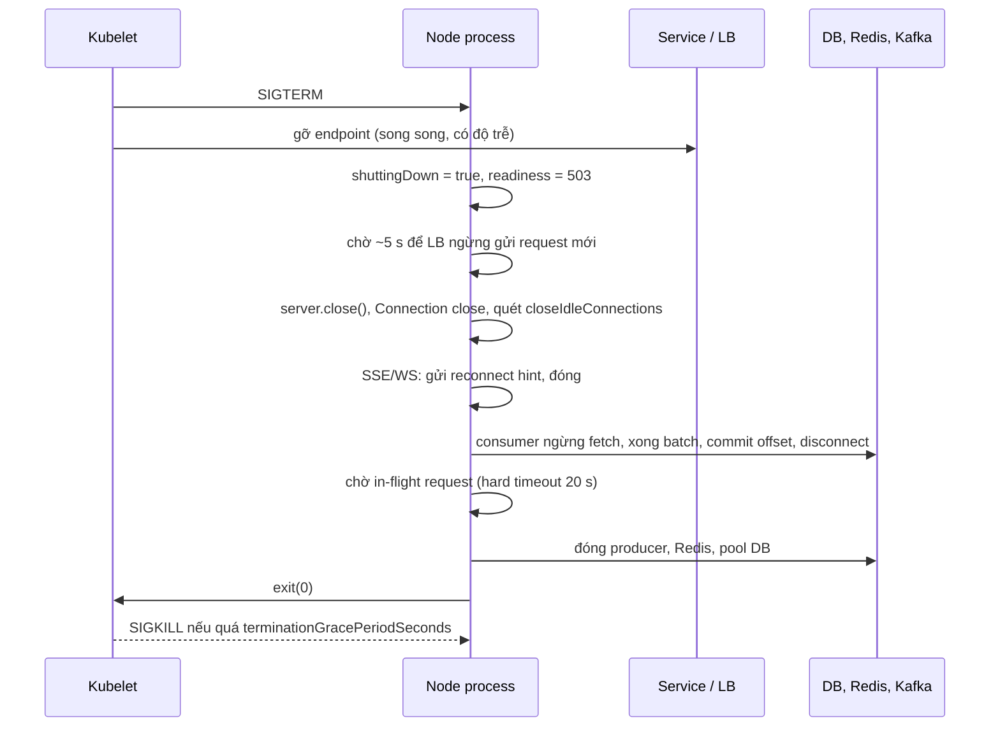
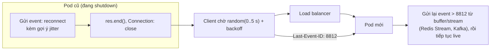

## Bối cảnh & vấn đề

Mỗi lần deploy, client thấy một đợt lỗi 5xx và `ECONNRESET` kéo dài vài giây. Đoạn shutdown của service chỉ có ba dòng: `server.close(); db.end(); process.exit(0)`. Ở một service khác, shutdown "đúng sách" với `await server.close()` nhưng pod luôn bị SIGKILL sau 30 giây vì có vài trăm kết nối SSE không bao giờ kết thúc. Một Kafka consumer, sau khi thêm một lời gọi HTTP chậm vào handler, rơi vào vòng **rebalance** liên tục: consumer group không bao giờ ổn định, lag tăng vô hạn.

Deploy và scale-in xảy ra hằng ngày, nên mỗi lỗi shutdown là một lượng lỗi đều đặn mà user nhìn thấy. Bài [signals & graceful shutdown](/tracks/os-concurrency/learn/signals-graceful-shutdown) của track OS đã trình bày phần hệ thống: SIGTERM/SIGKILL, PID 1 trong container, vòng đời pod khi bị xoá, readiness và `preStop`. Bài này đi vào phía Node và phía ứng dụng: `http.Server` đóng như thế nào, những loại kết nối và công việc nào không tự dừng (SSE, WebSocket, consumer, job dài), và thiết kế để chúng dừng mà không mất dữ liệu.

**Interview angle:** "implement graceful shutdown cho HTTP API trên Kubernetes" là câu design có checklist rõ ràng: một lần duy nhất, readiness fail, chờ LB, ngừng nhận, drain, đóng tài nguyên, hard timeout. Câu phân loại senior là các kết nối sống lâu và consumer.

## Khái niệm

### server.close() làm gì, và không làm gì

`server.close(cb)` ngừng **nhận connection mới** (đóng listening socket) và, từ Node 19, đóng các connection keep-alive đang **idle** tại thời điểm gọi. Nó **không** đóng connection đang có request dở, và callback `cb` chỉ chạy khi **mọi** connection đã đóng. Có một khe hở đo được: connection đang xử lý request lúc gọi `close()`, sau khi trả response xong, trở thành idle keep-alive, và Node **không** đóng nó ngay mà chờ tới `keepAliveTimeout`. Kết quả là callback của `close()` có thể đến muộn thêm khoảng 5 giây sau khi request cuối cùng xong.

Có ba công cụ bổ sung: `server.closeIdleConnections()` đóng mọi connection đang idle ngay lúc gọi (gọi lặp lại trong lúc drain để bắt connection vừa idle); `server.closeAllConnections()` đóng **tất cả**, kể cả đang có request (dùng cho hard timeout); và header `Connection: close` trên response trong lúc shutdown để client biết không dùng lại connection đó, và Node đóng nó ngay sau response.

### Trình tự graceful shutdown

1. Bắt `SIGTERM` (và `SIGINT`), chạy shutdown **một lần** (cờ `shuttingDown`), SIGTERM thứ hai không khởi động lại quy trình.
2. Đánh dấu readiness fail. Trên Kubernetes, việc gỡ pod khỏi endpoint của Service xảy ra **song song** với SIGTERM và có độ trễ, nên chờ vài giây (hoặc dùng `preStop: sleep 5`) trước khi ngừng nhận connection.
3. `server.close()`, set `Connection: close` cho response còn lại, và quét `closeIdleConnections()` định kỳ.
4. Dừng các nguồn việc khác: consumer ngừng fetch, job ngừng nhận batch mới, interval dừng.
5. Chờ việc đang chạy xong: request in-flight, batch đang xử lý, commit offset, flush log/trace.
6. Đóng tài nguyên theo thứ tự ngược: producer, Redis, pool DB.
7. `process.exit(0)`. Toàn bộ quy trình có **hard timeout** nhỏ hơn `terminationGracePeriodSeconds` (mặc định 30 giây): hết giờ thì `closeAllConnections()` và `exit(1)`.

Node phải là process nhận signal: `CMD ["node", "dist/main.js"]` hoặc qua `tini`, không bọc trong `npm start` hay shell không forward signal (chi tiết ở [bài signals](/tracks/os-concurrency/learn/signals-graceful-shutdown)).

### Kết nối sống lâu: SSE và WebSocket

Server-Sent Events và WebSocket là request **không bao giờ xong** theo nghĩa của `server.close()`: kết nối đang active, nên `close()` chờ mãi, và pod bị SIGKILL ở cuối grace period, cắt mọi client cùng lúc. Cách đóng đúng là chủ động: gửi cho client một tín hiệu "hãy kết nối lại" (một event SSE, hoặc WebSocket close frame với code 1001 "going away"), rồi đóng. Client phải kết nối lại với **jitter** (độ trễ ngẫu nhiên) và backoff, nếu không 100.000 client sẽ kết nối lại cùng một giây vào các pod còn lại: **reconnect storm**.

Sau khi kết nối lại, client cần **bù phần bị lỡ**. SSE có sẵn cơ chế: server gửi `id:` cho mỗi event, trình duyệt gửi lại `Last-Event-ID` khi reconnect. Socket.IO không đảm bảo giao message bị lỡ trong lúc mất kết nối; Socket.IO v4 có connection state recovery giới hạn thời gian (verify), còn cách chắc chắn là client gửi sequence id cuối cùng hoặc fetch lại snapshot qua API.

### Consumer của message queue

Một Kafka consumer trong Node (KafkaJS, hoặc `@confluentinc/kafka-javascript`/`node-rdkafka`) có vòng lặp fetch → xử lý → commit offset. Shutdown đúng: ngừng fetch, xử lý xong batch hiện tại (hoặc bỏ phần chưa xử lý mà **không commit** nó), commit offset của phần đã xong, rồi `disconnect()` để rời group sạch sẽ (group rebalance ngay thay vì chờ session timeout). Commit offset **sau** khi xử lý xong cho ngữ nghĩa at-least-once, nên handler phải **idempotent** (dedupe theo event id).

Vòng rebalance liên tục thường do handler chậm: nếu thời gian giữa hai lần poll vượt `max.poll.interval.ms` (với client dựa trên librdkafka), hoặc consumer không kịp gửi heartbeat trong `session.timeout.ms` (với KafkaJS, heartbeat gửi trong lúc xử lý nếu bạn gọi `heartbeat()` trong `eachBatch`), broker coi consumer đã chết và rebalance. Consumer quay lại, lại chậm, lại bị đá. Sửa: giảm lượng việc mỗi poll (batch nhỏ hơn), gọi heartbeat trong batch dài, timeout cho lời gọi ngoài, đẩy việc chậm ra khỏi handler (retry topic, hàng đợi riêng), hoặc tăng timeout một cách có chủ đích.

### Job dài sống qua restart

Job xử lý 50 triệu bản ghi không thể "chạy xong trước khi pod bị kill". Nó phải **tiếp tục được**: đọc theo **keyset pagination** (`WHERE id > $last ORDER BY id LIMIT 1000`, không `OFFSET`), xử lý theo batch với concurrency và rate limit giới hạn, lưu **checkpoint** (khoá cuối cùng đã xong) bền vững sau mỗi batch, và ghi phía đích **idempotent** (upsert, idempotency key) vì at-least-once. Shutdown cho job: ngừng lấy batch mới, chờ batch đang chạy xong, lưu checkpoint, thoát.

## Cơ chế hoạt động

Trình tự trong process từ SIGTERM tới exit:



Diễn giải: điểm then chốt là **thứ tự**. Ngừng nhận trước khi LB ngừng gửi thì request mới bị từ chối (connection refused); đóng DB trước khi request in-flight xong thì chúng lỗi "pool is closed"; exit trước khi drain thì request đang chạy bị cắt (ECONNRESET). Hard timeout là lưới an toàn: một request treo không được phép biến shutdown thành SIGKILL không kiểm soát.

Một kết nối SSE qua lần deploy, và vì sao cần jitter và `Last-Event-ID`:



## Ví dụ thực tế

### Review đoạn shutdown gây 5xx mỗi lần deploy

```ts
process.on("SIGTERM", () => {
  server.close();
  db.end();
  process.exit(0);
});
```

Năm vấn đề: `server.close()` là async và chỉ ngừng nhận connection mới, còn `process.exit(0)` ngay sau đó **giết** mọi request đang chạy; `db.end()` không được await, nên request đang query nhận lỗi "pool is closed" trong mili giây trước khi exit; không chờ LB gỡ pod, nên request mới vẫn tới trong vài giây đầu và bị từ chối; không xử lý keep-alive idle, không có hard timeout; và không chống SIGTERM gọi hai lần. Đo trên Node 24 với hai request 1,5 giây đang chạy lúc SIGTERM:

```js
// shut.mjs (phần server): mode naive / graceful / graceful+close / graceful+sweep
let shuttingDown = false;
const server = http.createServer(async (req, res) => { await sleep(1500); if (shuttingDown && mode === 'graceful+close') res.setHeader('Connection', 'close'); res.end('done'); });
if (mode === 'naive') {
  process.on('SIGTERM', () => { server.close(); process.exit(0); });
} else {
  process.on('SIGTERM', async () => {
    if (shuttingDown) return; shuttingDown = true;
    const t0 = Date.now();
    const force = setTimeout(() => { server.closeAllConnections(); process.exit(1); }, 10_000).unref();
    const closed = new Promise((r) => server.close(r));
    const sweep = mode === 'graceful+sweep' ? setInterval(() => server.closeIdleConnections(), 250) : null;
    await closed; clearInterval(sweep);
    console.log(`  [server] all connections drained after ${Date.now() - t0} ms, exit 0`);
    clearTimeout(force); process.exit(0);
  });
}
// client: một connection keep-alive idle + hai request đang chạy, rồi SIGTERM sau 200 ms
```

```text
naive: exit 0, in-flight results: ECONNRESET, ECONNRESET
  [server] all connections drained after 5308 ms, exit 0
graceful: exit 0, in-flight results: 200 done, 200 done
  [server] all connections drained after 1302 ms, exit 0
graceful+close: exit 0, in-flight results: 200 done, 200 done
  [server] all connections drained after 1512 ms, exit 0
graceful+sweep: exit 0, in-flight results: 200 done, 200 done
```

Bản naive cắt cả hai request (`ECONNRESET`). Bản graceful giữ được cả hai, nhưng `close()` chỉ xong sau **5,3 giây**: hai request xong ở ~1,3 giây, connection của chúng thành idle keep-alive và chờ `keepAliveTimeout`. Đây là câu trả lời cho "vì sao `server.close()` một mình đôi khi rất lâu mới gọi callback" (và **không bao giờ** gọi nếu có SSE/WebSocket). Thêm `Connection: close` hoặc quét `closeIdleConnections()` đưa thời gian drain về khoảng 1,3–1,5 giây, đúng bằng request dài nhất. Bản đầy đủ cho production:

```ts
let shuttingDown = false;
app.use((req, res, next) => { if (shuttingDown) res.setHeader("Connection", "close"); next(); });
app.get("/ready", (_req, res) => res.status(shuttingDown ? 503 : 200).end());

async function shutdown(signal: string) {
  if (shuttingDown) return; shuttingDown = true;
  logger.info({ signal }, "shutting down");
  await sleep(5_000);                                            // LB/endpoint removal is async
  const force = setTimeout(() => { server.closeAllConnections(); process.exit(1); }, 20_000);
  force.unref();
  const closed = new Promise<void>((r) => server.close(() => r()));
  const sweep = setInterval(() => server.closeIdleConnections(), 500);
  closeRealtimeClients();                                        // SSE/WS: reconnect hint + end
  await Promise.allSettled([consumer.stop(), jobRunner.stop()]); // stop fetching, finish batch, commit
  await closed; clearInterval(sweep);
  await Promise.allSettled([consumer.disconnect(), producer.disconnect(), redis.quit(), db.end()]);
  clearTimeout(force);
  process.exit(0);
}
process.on("SIGTERM", shutdown).on("SIGINT", shutdown);
```

Để test trong CI thay vì phát hiện ở production: một test khởi động server thật, bắn vài request dài, gửi SIGTERM vào child process, và khẳng định mọi request nhận 200, process exit 0 trong thời gian giới hạn. Script `shut.mjs` ở trên chính là dạng test đó.

### server.close() chờ mãi với SSE

```js
// sseclose.mjs: 3 client SSE đang mở
server.close(() => { closed = true; console.log(`server.close callback after ${Date.now() - t0} ms`); });
await new Promise((r) => setTimeout(r, 2000));
console.log(`after 2 s: close finished? ${closed}, open SSE clients = ${clients.size}`);
for (const res of clients) { res.write(`event: reconnect\ndata: {"jitterMs":${Math.floor(Math.random() * 5000)}}\n\n`); res.end(); }
```

```text
after 2 s: close finished? false, open SSE clients = 3
clients told to reconnect: 3
server.close callback after 6014 ms
```

Sau 2 giây, `close()` vẫn chưa xong vì ba stream SSE còn mở; không làm gì thì nó chờ tới SIGKILL. Sau khi gửi `reconnect` và `end()`, callback vẫn tới muộn thêm 4 giây: các socket vừa kết thúc response trở thành idle keep-alive. Cần cả `Connection: close` (hoặc `closeIdleConnections()`) ngay sau khi đóng stream.

### Kafka consumer: concurrency, commit, retry và shutdown

```ts
// KafkaJS (minh hoạ): tuần tự trong partition, song song giữa partition, commit sau khi xử lý
await consumer.subscribe({ topic: "orders", fromBeginning: false });
await consumer.run({
  partitionsConsumedConcurrently: 4,              // các partition khác nhau chạy song song
  eachBatchAutoResolve: false,
  eachBatch: async ({ batch, resolveOffset, heartbeat, isRunning, isStale, commitOffsetsIfNecessary }) => {
    for (const msg of batch.messages) {
      if (!isRunning() || isStale()) break;         // đang shutdown hoặc bị rebalance: dừng, không commit phần còn lại
      const ctxId = msg.headers?.["x-request-id"]?.toString();
      await als.run({ requestId: ctxId }, () => handleIdempotent(msg)); // dedupe theo event id
      resolveOffset(msg.offset);
      await heartbeat();                            // batch dài vẫn giữ membership
    }
    await commitOffsetsIfNecessary();
  },
});
// handleIdempotent: retry tại chỗ 2-3 lần cho lỗi tạm thời; vẫn lỗi -> publish sang orders.retry.5m
// (retry topic có delay) -> cuối cùng orders.dlq; không bao giờ block partition vô hạn vì một poison message.
// shutdown: await consumer.stop() (xong message hiện tại, commit), rồi consumer.disconnect().
```

(Code minh hoạ, không kèm output.) Partition key (ví dụ `orderId`) đảm bảo thứ tự theo entity: mọi event của một đơn hàng vào cùng partition và được xử lý tuần tự. Metric bắt buộc: **consumer lag theo partition**, số message vào retry/DLQ, thời gian xử lý mỗi batch so với `max.poll.interval.ms`/`session.timeout.ms`. Khi kể câu CV về tách monolith sang microservices với Kafka, điền tên thư viện thật, số partition, và một sự cố rebalance thật. Delivery semantics, outbox và DLQ chi tiết ở track [messaging & Kafka](/tracks/messaging-kafka).

### Job 50 triệu bản ghi, 1 GB memory, sống qua restart

```ts
// Minh hoạ cấu trúc; số liệu phụ thuộc hệ thống đích
async function runJob(signal: AbortSignal) {
  let last = await checkpoints.get("export-products") ?? 0;       // khoá cuối cùng đã commit
  const limit = pLimit(8);                                        // concurrency tới hệ thống đích
  const bucket = tokenBucket({ ratePerSec: 100, shared: redis }); // quota 100 req/s cho MỌI worker
  while (!signal.aborted) {
    const rows = await db.query(
      "SELECT * FROM products WHERE id > $1 AND id <= $2 ORDER BY id LIMIT 1000", [last, partitionEnd]);
    if (rows.length === 0) break;
    await Promise.all(rows.map((r) => limit(async () => {
      await bucket.take();
      try { await target.upsert(r.id, toPayload(r), { idempotencyKey: `${r.id}:${r.version}` }); }
      catch (e) { if (isPermanent(e)) await deadLetters.add(r.id, e); else throw e; } // lỗi tạm thời: retry cả batch
    })));
    last = rows.at(-1).id;
    await checkpoints.set("export-products", last);               // chỉ sau khi batch xong
    metrics.gauge("job_last_id", last);
  }
}
// SIGTERM -> controller.abort(): vòng while dừng ở ranh giới batch, checkpoint đã lưu, exit.
```

(Code minh hoạ.) Memory bị chặn bởi một batch (1.000 row) cộng số request đang bay (8), không phụ thuộc 50 triệu. Keyset pagination giữ mỗi query nhanh như nhau dù ở trang đầu hay trang cuối (OFFSET 40 triệu thì Postgres phải đọc và bỏ 40 triệu row). Để chạy song song nhiều worker, chia theo **khoảng khoá** (`partitionEnd`), mỗi khoảng một checkpoint. Rate limit 100 req/s phải là **toàn cục** (token bucket trong Redis bằng Lua), không phải 100 mỗi worker. Theo dõi throughput, số lỗi, và ETA từ `job_last_id`.

### Push realtime cho 100k client, và câu CV Socket.IO

Transport: WebSocket (`ws` hoặc Socket.IO) nếu cần hai chiều; SSE nếu chỉ server → client (đơn giản hơn, chạy qua HTTP/2, có `Last-Event-ID`). Scale ngang: nhiều node, mỗi node giữ vài chục nghìn kết nối, fan-out qua pub/sub (Redis adapter, NATS, hoặc Kafka → mỗi node subscribe). Những thứ vỡ đầu tiên, theo thứ tự hay gặp:

1. **Slow consumer**: một client mạng yếu không đọc kịp; `res.write()`/`ws.send()` dồn dữ liệu trong buffer của socket đó. Theo dõi `res.writableLength` hoặc `ws.bufferedAmount`, vượt ngưỡng thì bỏ message (giá realtime chỉ cần bản mới nhất) hoặc ngắt client.
2. **Reconnect storm** sau deploy hoặc sau khi một node chết: jitter + exponential backoff phía client, rolling deploy từng phần nhỏ, và server trả `retry:`/gợi ý delay.
3. **File descriptor và memory mỗi kết nối**: `ulimit -n`, buffer kernel, object JS; đo memory mỗi kết nối và đặt trần kết nối mỗi pod.
4. **Idle timeout của LB/proxy**: kết nối im lặng quá 60 giây bị cắt; heartbeat (ping/pong, comment SSE `:\n\n`) nhỏ hơn idle timeout.
5. **Fan-out**: một event cho 100k client là 100k lần `write`; serialize một lần, gửi cùng buffer.

Ngữ nghĩa: giá realtime là at-most-once (mất một tick giá không sao, bản sau thay thế); thông báo quan trọng cần resume bằng sequence/offset. Với dữ liệu tài chính, push chỉ là **thông báo**, nguồn sự thật vẫn là API/DB: client nhận "số dư đã đổi" thì fetch lại, không tự cộng trừ từ event. Auth ở handshake (token), kiểm tra quyền khi join room, và xử lý token hết hạn trên kết nối dài (re-validate định kỳ hoặc ngắt khi hết hạn). Khi kể câu CV Socket.IO, trả lời được: bao nhiêu instance, adapter gì, sticky session có không (chỉ cần khi có long-polling), client đồng bộ lại state thế nào sau reconnect, và bạn load test lớp WebSocket ra sao (k6 có WebSocket, Artillery có engine Socket.IO) cùng nút thắt đầu tiên tìm thấy. Phần transport và proxy xem bài [realtime](/tracks/networking/learn/realtime).

## Trade-offs & lựa chọn thay thế

| Cách dừng | Request in-flight | Kết nối dài | Thời gian dừng | Rủi ro |
|---|---|---|---|---|
| `process.exit()` ngay | Bị cắt | Bị cắt | Tức thì | 5xx mỗi deploy |
| `server.close()` rồi chờ callback | Xong | Chờ mãi | Tới SIGKILL nếu có SSE/WS | Bị SIGKILL, mất cleanup |
| `close()` + `Connection: close` + quét idle | Xong | Vẫn phải xử lý riêng | ≈ request dài nhất | Tốt cho HTTP ngắn |
| Đầy đủ: readiness, chờ LB, close, reconnect hint, drain consumer, hard timeout | Xong | Client reconnect có jitter | Vài giây tới vài chục giây | Cần code và test |

| Consumer commit | Ngữ nghĩa | Yêu cầu |
|---|---|---|
| Commit trước khi xử lý | At-most-once (có thể mất message) | Chấp nhận mất |
| Commit sau khi xử lý | At-least-once (có thể xử lý lặp) | Handler idempotent |
| Transaction Kafka / outbox | Gần exactly-once trong phạm vi hệ thống | Phức tạp, giới hạn phạm vi |

Chọn thế nào: HTTP API ngắn thì bản đầy đủ nhưng đơn giản (readiness, chờ LB, close + Connection: close, hard timeout). Service có kết nối dài thì bắt buộc có reconnect hint, jitter phía client, và khả năng resume. Consumer thì at-least-once + idempotent là mặc định thực tế.

## Edge cases & failure modes

- **Grace period quá ngắn** cho request dài nhất (upload lớn, export): `terminationGracePeriodSeconds` phải lớn hơn chờ LB + request dài nhất + đóng tài nguyên; request dài hơn nữa nên là job.
- **Health check sai**: readiness vẫn 200 trong lúc shutdown, LB tiếp tục gửi request.
- **Liveness probe khi đang drain**: loop bận drain làm liveness fail, kubelet kill sớm. Liveness nên đơn giản và timeout rộng.
- **SIGTERM tới nhiều process**: trong pod có sidecar (Envoy, Istio), sidecar có thể tắt trước app, cắt connection outbound của app. Cấu hình thứ tự tắt (`holdApplicationUntilProxyStarts`, drain duration) theo mesh.
- **Consumer rebalance giữa batch**: `isStale()` trả true, phần chưa commit sẽ được consumer khác xử lý lại; không commit sau khi mất partition.
- **Poison message**: một message luôn lỗi làm partition đứng yên nếu retry vô hạn; đẩy sang retry topic/DLQ sau N lần.
- **Checkpoint trước khi ghi xong**: lưu checkpoint rồi mới ghi batch thì crash giữa hai bước làm mất batch; luôn ghi xong rồi mới checkpoint, và ghi idempotent để lặp an toàn.
- **Reconnect storm tự gây**: rolling update thay 50% pod cùng lúc đẩy nửa số client sang nửa còn lại; `maxUnavailable` nhỏ, pre-scale trước deploy.

## Pitfalls

- ❌ `server.close(); process.exit(0)` → ✅ await `close()`, drain, rồi exit; có hard timeout.
- ❌ Không chờ LB gỡ pod → ✅ readiness 503 + chờ vài giây (hoặc `preStop` sleep) trước khi ngừng nhận.
- ❌ Chỉ `server.close()` và chờ → ✅ thêm `Connection: close` và quét `closeIdleConnections()`; SSE/WS phải đóng chủ động.
- ❌ `db.end()` không await, hoặc đóng DB trước khi request xong → ✅ đóng tài nguyên sau khi drain, theo thứ tự ngược.
- ❌ Consumer commit trước khi xử lý, hoặc retry vô hạn trong handler → ✅ commit sau khi xử lý, idempotent, retry topic + DLQ.
- ❌ Job dài dùng `OFFSET` và không checkpoint → ✅ keyset pagination, checkpoint sau mỗi batch, ghi idempotent.
- ❌ Client realtime reconnect ngay lập tức → ✅ jitter + backoff, resume bằng `Last-Event-ID`/sequence.

## Tóm tắt

- `server.close()` ngừng nhận và đóng idle lúc gọi, nhưng connection vừa idle sau đó chờ `keepAliveTimeout` (đo: drain 5,3 s so với 1,3 s khi có `Connection: close`/quét idle).
- Bản naive `close(); exit()` cắt request đang chạy (đo: 2/2 ECONNRESET); bản đúng giữ được cả hai.
- Trình tự: một lần, readiness fail, chờ LB, close, dừng consumer/job, drain, đóng tài nguyên, exit; hard timeout < grace period.
- SSE/WebSocket không tự xong: gửi reconnect hint, đóng, client reconnect với jitter và resume bằng `Last-Event-ID`/sequence.
- Kafka consumer: tuần tự trong partition, commit sau khi xử lý, idempotent, retry topic + DLQ, heartbeat trong batch dài; handler chậm gây rebalance loop.
- Job dài: keyset pagination, checkpoint sau mỗi batch, ghi idempotent, rate limit toàn cục, dừng ở ranh giới batch.
- Realtime 100k client: slow consumer, reconnect storm, fd/memory mỗi kết nối, idle timeout và fan-out là những thứ vỡ đầu tiên.
