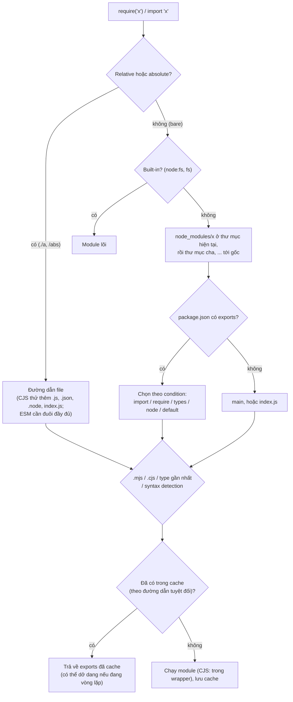
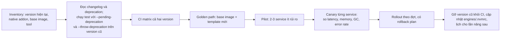

## Bối cảnh & vấn đề

Test của một service tạo **hai** instance DB client, và một nửa số test thấy pool rỗng. Một plugin báo lỗi `instanceof Money` sai dù rõ ràng object là `Money`. Một feature flag `FEATURE_X=false` trong môi trường staging vẫn **bật** tính năng. Một lần nâng Node từ 18 lên 20 làm service không kết nối được `localhost:5432`, và một native addon không build được trên image mới.

Những lỗi này không nằm trong logic nghiệp vụ mà ở **lớp nạp code và cấu hình**: module được tìm và cache ra sao, package nào được cài bản nào, biến môi trường được đọc thế nào, và runtime đang chạy version nào. Bài [modules ESM/CJS](/tracks/javascript/learn/modules-esm-cjs) của track JavaScript đã dạy phần ngôn ngữ: load/link/evaluate của ESM, live binding so với copy, circular import, dual package hazard ở mức khái niệm, migrate monorepo. Bài này đi vào phía **Node**: thuật toán resolution, module wrapper, cache, `exports`, cùng npm, config và vòng đời version, những thứ quyết định service có chạy giống nhau ở laptop, CI và production hay không.

**Interview angle:** các câu ở đây là easy/medium nhưng dễ lộ kinh nghiệm thật: người từng debug "hai instance singleton" sẽ nói ngay "module cache theo đường dẫn resolve"; người từng vận hành sẽ nói "`npm ci`, validate env lúc boot, chỉ chạy LTS".

## Khái niệm

### CommonJS hay ESM: Node quyết định thế nào

Với mỗi file, Node chọn loader theo thứ tự: đuôi `.mjs` luôn là ESM, `.cjs` luôn là CommonJS. Với `.js`, Node tìm `package.json` **gần nhất** đi ngược lên thư mục cha: `"type": "module"` thì ESM, `"type": "commonjs"` hoặc không có field thì CommonJS. Từ Node 22.7 (và 20.19), **syntax detection** bật mặc định: một file `.js` mơ hồ (không có `type`) mà chứa cú pháp chỉ ESM mới có (`import`/`export` top-level) được chạy như ESM (verify). Khai báo `"type"` tường minh vẫn là cách đúng, vì detection tốn thêm một lần parse và dễ gây bất ngờ.

ESM không có `require`, `module`, `exports`, `__filename`, `__dirname`. Thay vào đó dùng `import.meta.filename`, `import.meta.dirname` (Node 20.11+), và `createRequire(import.meta.url)` khi thật sự cần `require` (ví dụ nạp JSON hoặc package chỉ có CJS).

### Module wrapper: __dirname không phải global

Node chạy mỗi file CommonJS bên trong một function wrapper: `(function (exports, require, module, __filename, __dirname) { ... })`. Năm biến này là **tham số** của wrapper, tức biến cục bộ của từng module, không phải thuộc tính của `globalThis`. Global thật của Node là `globalThis` (tên cũ `global`), chứa `process`, `Buffer`, `console`, timer, `fetch`, `URL`, `structuredClone`. Wrapper cũng là lý do biến top-level của một file CJS không rò sang file khác. Gán thứ gì đó vào `globalThis` (ví dụ `global.apiKey = ...`) thì mọi module nhìn thấy nó: tiện cho polyfill, nhưng là nguồn xung đột và khó test trong code ứng dụng.

### Thuật toán resolution

`require('x')` và `import 'x'` với **bare specifier** (không bắt đầu bằng `./`, `/`) đi tìm package `x` trong `node_modules` của thư mục hiện tại, rồi của thư mục cha, lần lượt lên tới gốc filesystem. Tìm thấy thư mục package thì đọc `package.json` của nó. Nếu có field **`exports`**, chỉ những đường dẫn được liệt kê trong `exports` mới import được (package tự định nghĩa public API; `import 'x/internal/y'` bị chặn với `ERR_PACKAGE_PATH_NOT_EXPORTED`). `exports` hỗ trợ **conditions**: `"import"` cho ESM, `"require"` cho CJS, `"types"` cho TypeScript, `"node"`/`"default"`, và điều kiện tuỳ chỉnh (`--conditions=development`). Không có `exports` thì dùng `main` (và với CJS, thử thêm `index.js`). Field `imports` với tiền tố `#` định nghĩa alias nội bộ (`import db from '#db'`).

### Module cache: singleton theo đường dẫn

Lần đầu `require` một file, Node chạy nó và lưu `module.exports` vào `require.cache` theo **đường dẫn tuyệt đối đã resolve**. Mọi `require` sau đó tới cùng file trả về **cùng object**, không chạy lại. Đó là lý do module hay được dùng như singleton (một pool DB, một logger). Nhưng singleton này gắn với **đường dẫn**, không gắn với tên package: nếu `node_modules` có hai bản copy của cùng package (một ở gốc, một lồng trong `node_modules` của một dependency khác vì yêu cầu version không tương thích), đó là hai file khác nhau, hai lần chạy, hai instance, và `instanceof` giữa chúng sai. Test runner reset module registry giữa các file test (Jest làm vậy) cũng tạo instance mới cho mỗi file. ESM có cache riêng (module map) theo URL, cũng theo đường dẫn.

### Circular require

Khi A `require` B, và B (trong lúc đang chạy) `require` A, Node không chạy lại A (sẽ lặp vô hạn) mà trả về `module.exports` **hiện tại** của A, tức object mới được điền một phần (chỉ những gì A đã gán trước dòng `require('./b')`). B giữ tham chiếu tới object dở dang đó; nếu B gọi một hàm A chưa kịp gán, lỗi là `TypeError: a.hello is not a function` hoặc `undefined`. Node 24 còn in cảnh báo `Accessing non-existent property 'hello' of module exports inside circular dependency`. ESM xử lý vòng lặp bằng live binding, nhưng truy cập binding trước khi nó được khởi tạo vẫn là `ReferenceError` (TDZ). Sửa: tách phần dùng chung ra module thứ ba, `require` lười bên trong function, hoặc dependency injection.

### require(esm)

Từ Node 22.12 và 20.19, CommonJS `require()` được một ES module **đồng bộ** (không có top-level `await`) theo mặc định, và nhận về module namespace object. ES module có top-level `await` thì `require` ném `ERR_REQUIRE_ASYNC_MODULE`; lúc đó phải dùng `await import()`. Điều này làm việc chuyển thư viện sang ESM-only bớt đau cho người dùng CJS, nhưng chưa xoá hẳn **dual package hazard**: package vừa có bản ESM vừa có bản CJS (qua conditions `import`/`require`) nạp **hai** bản code khác nhau trong cùng process nếu app dùng cả `import` lẫn `require`.

### dependencies, devDependencies, peerDependencies và lockfile

`dependencies` là package cần lúc **runtime**; `devDependencies` chỉ cần khi build/test (không được cài với `npm ci --omit=dev`, nên thư viện runtime đặt nhầm vào đây sẽ vỡ trên production image). `peerDependencies` là cách một thư viện nói "tôi cần host app cài package này, bản tương thích với range này", dùng cho plugin và thư viện UI để chỉ có **một** bản React, một bản NestJS core trong app; npm 7+ tự cài peer và báo xung đột. `optionalDependencies` được phép cài lỗi (native addon theo platform).

Range semver `^1.2.3` cho phép mọi bản `1.x.y ≥ 1.2.3`, nên không có lockfile thì "build hôm nay khác build hôm qua". **Lockfile** (`package-lock.json`) ghi cây dependency chính xác: version, URL tải và **integrity hash** của từng package, kể cả transitive. **`npm ci`** cài đúng theo lockfile, xoá `node_modules` trước, và **fail** nếu lockfile lệch `package.json`: deterministic và nhanh, đúng thứ CI và Dockerfile cần. `npm install` có thể cập nhật lockfile, nên không dùng trong CI.

### Config và secret

Theo 12-factor, config khác nhau giữa các môi trường nằm trong **biến môi trường**, không nằm trong code. Hai quy tắc thực hành: đọc và **validate một lần lúc khởi động** (zod, envalid) để thiếu biến thì crash ngay khi deploy thay vì lúc 3 giờ sáng; và nhớ `process.env.X` luôn là `string | undefined`, nên `"false"` là **truthy** và `"0"` cũng truthy. Parse boolean và số tường minh.

Node có sẵn `--env-file=.env` (Node 20.6+) và `process.loadEnvFile()` (Node 21.7+) cho local dev, thay được `dotenv` trong nhiều trường hợp. Secret (mật khẩu DB, API key) đến từ secret manager (AWS Secrets Manager/SSM Parameter Store, Vault, Kubernetes Secret), được inject vào env hoặc mount thành file. Không commit `.env`, không log object config nguyên cục, và mask secret trong error message. Xoay vòng secret không cần restart đồng loạt: hỗ trợ hai credential hợp lệ song song trong thời gian chuyển, đọc lại secret từ file mount hoặc secret manager định kỳ và tạo pool mới, rồi rút credential cũ.

### Lịch release và LTS

Mô hình hiện tại (tới Node 26): mỗi năm hai major, tháng 4 và tháng 10. Major **chẵn** sau khoảng 6 tháng ở trạng thái Current thì thành **LTS**: Active LTS khoảng 12 tháng, rồi Maintenance, tổng khoảng 30 tháng. Major lẻ chỉ sống ngắn, không lên LTS. Tại thời điểm cuối tháng 9/2026: Node 24 (Krypton) là **Active LTS**, Node 22 ở Maintenance, Node 20 đã **EOL** (4/2026), Node 26 là Current và lên LTS tháng 10/2026. Từ Node 27, dự án chuyển sang **một major mỗi năm** (release tháng 4, lên LTS tháng 10, mọi major đều thành LTS, thêm kênh alpha), cửa sổ hỗ trợ vẫn khoảng 30 tháng (verify trên trang release). Production chạy **Active LTS** hoặc Maintenance LTS còn hạn, không bao giờ chạy version EOL (không còn bản vá bảo mật).

## Cơ chế hoạt động

Node tìm và nạp một specifier như thế nào:



Diễn giải: hai điểm quyết định hành vi hay gây bug nằm ở cuối sơ đồ. Cache khoá theo **đường dẫn**, nên hai bản copy ở hai thư mục là hai module; và cache được ghi **trước** khi module chạy xong, nên vòng lặp nhận object dở dang. Phần `exports` + condition quyết định `import` và `require` cùng một tên có thể nhận hai file khác nhau.

Nâng major version cho một fleet 30 service:



## Ví dụ thực tế

### Circular require, cache và require(esm)

```js
// a.js
console.log('a: start');
exports.name = 'A';
const b = require('./b');
console.log('a: b.greet() =', b.greet());
exports.hello = () => 'hello from A';
console.log('a: done');
// b.js
console.log('b: start');
const a = require('./a');
console.log('b: got a =', a);          // exports dở dang của A
exports.greet = () => `b sees a.name=${a.name}, a.hello=${typeof a.hello}`;
console.log('b: done');
// main.js
require('./a');
const db1 = require('./db'), db2 = require('./db.js'), db3 = require(require('path').resolve(__dirname, 'db.js'));
console.log('same instance via 3 specifiers:', db1 === db2 && db2 === db3, '| created', require('./db').created, 'time(s)');
delete require.cache[require.resolve('./db')];
console.log('after deleting require.cache entry: new instance?', require('./db') !== db1);
const esm = require('./util.mjs');                       // export const add = (a, b) => a + b;
console.log('require(esm):', esm.add(2, 3), '| module namespace:', Object.prototype.toString.call(esm));
try { require('./tla.mjs'); } catch (e) { console.log('require(esm with top-level await):', e.code); }
```

```text
a: start
b: start
b: got a = { name: 'A' }
b: done
a: b.greet() = b sees a.name=A, a.hello=undefined
a: done
same instance via 3 specifiers: true | created 1 time(s)
after deleting require.cache entry: new instance? true
require(esm): 5 | module namespace: [object Module]
require(esm with top-level await): ERR_REQUIRE_ASYNC_MODULE
(node:53846) Warning: Accessing non-existent property 'hello' of module exports inside circular dependency
```

B nhận `{ name: 'A' }`, đúng những gì A đã gán trước khi `require('./b')`; `a.hello` là `undefined` ngay cả khi B gọi nó sau, vì B đọc property ở thời điểm A chưa chạy tới dòng gán. Ba cách viết đường dẫn khác nhau cùng resolve về một file nên chỉ chạy `db.js` một lần; xoá khỏi `require.cache` là cách Jest và hot-reload tạo instance mới, và cũng là cách test vô tình tạo hai DB client. `require` một ES module đồng bộ chạy được trên Node 24, còn module có top-level await thì không.

### Hai bản copy của một package và dual package hazard

```js
// node_modules/dual-lib (2.0.0): exports { import: ./index.mjs, require: ./index.cjs }
// node_modules/plugin/node_modules/dual-lib (1.4.0): bản copy lồng vì plugin cần ^1.4
import { createRequire } from 'node:module';
import { Money, format } from 'dual-lib';
const require = createRequire(import.meta.url);
const cjs = require('dual-lib');
console.log('import resolves to', format, '| require resolves to', cjs.format);
console.log('dual package hazard: ESM Money === CJS Money ?', Money === cjs.Money);
const { makeMoney } = require('plugin');
console.log('plugin has its own nested copy -> instanceof across copies:', makeMoney() instanceof cjs.Money);
```

```text
import resolves to esm | require resolves to cjs
dual package hazard: ESM Money === CJS Money ? false
plugin has its own nested copy -> instanceof across copies: false
resolved paths: node_modules/dual-lib/index.cjs | node_modules/plugin/node_modules/dual-lib/index.cjs
```

Hai nguồn "hai instance" khác nhau: conditions `import`/`require` trỏ tới hai file (dual package), và version không tương thích buộc npm cài bản copy lồng. Cả hai đều phá singleton và `instanceof`. Kiểm tra bằng `npm ls dual-lib`; sửa bằng cách thống nhất version (`overrides` trong package.json), dùng `peerDependencies` cho plugin, hoặc so sánh bằng duck typing/brand symbol (`Symbol.for`) thay vì `instanceof`.

### Module type detection, __dirname và env

```text
$ node x.js          # không có package.json, chứa `import os from "node:os"`
ran as ESM
$ node y.js          # không có import/export
ran as CJS
$ node t/y.js        # t/package.json có "type": "module"
ran as ESM
$ node g.cjs         # console.log(typeof globalThis.__dirname, typeof globalThis.require, typeof __dirname)
globalThis.__dirname: undefined | globalThis.require: undefined | module-scope __dirname: string
$ node e.mjs         # typeof __dirname, import.meta.dirname, typeof require
undefined mods e.mjs
undefined
$ printf 'PORT=8080\nFEATURE_X=false\n' > .env.test
$ node --env-file=.env.test -e 'console.log(process.env.PORT, typeof process.env.PORT, Boolean(process.env.FEATURE_X) ? "FEATURE_X is ON (bug!)" : "off")'
8080 string FEATURE_X is ON (bug!)
```

`__dirname` và `require` là biến của module wrapper CJS, không nằm trên `globalThis`, và không tồn tại trong ESM. `PORT` là string `"8080"`, và `Boolean("false")` là `true`: đúng bug feature flag ở phần bối cảnh. Schema validate lúc khởi động:

```ts
import { z } from "zod";
const Env = z.object({
  NODE_ENV: z.enum(["development", "test", "production"]),
  PORT: z.coerce.number().int().default(3000),
  DATABASE_URL: z.string().url(),
  FEATURE_X: z.enum(["true", "false"]).default("false").transform((v) => v === "true"),
});
export const env = Env.parse(process.env); // crash lúc boot, liệt kê mọi biến sai
```

### Cài đặt deterministic trong Docker

```dockerfile
FROM node:24-bookworm-slim@sha256:<digest> AS deps     # pin theo digest, không chỉ tag
WORKDIR /app
COPY package.json package-lock.json ./
RUN npm ci --omit=dev --ignore-scripts                 # đúng lockfile, không devDeps, chặn install script
FROM node:24-bookworm-slim@sha256:<digest>
WORKDIR /app
COPY --from=deps /app/node_modules ./node_modules
COPY dist ./dist
USER node
CMD ["node", "dist/main.js"]                           # node là PID nhận SIGTERM
```

(Minh hoạ.) `--ignore-scripts` chặn `postinstall` (kênh phát tán malware phổ biến, xem bài [security](/tracks/nodejs/learn/security)); native addon cần build thì bật lại có chọn lọc. `engines: { "node": ">=24 <25" }` và `.nvmrc` giữ version đồng bộ giữa laptop và CI.

### Kế hoạch nâng Node 20 → 24 cho 30 service

1. **Inventory**: mỗi service đang ở version nào, base image nào, native addon nào (`bcrypt`, `sharp`, driver Kafka dựa trên librdkafka, `canvas`), công cụ build/test nào phụ thuộc version.
2. **Đọc changelog của từng major nhảy qua** (21–24): những thay đổi hành vi mặc định hay gây vỡ: stream `highWaterMark` 16 → 64 KiB (Node 22), `require(esm)` và syntax detection, thứ tự DNS `verbatim` và `autoSelectFamily` (lỗi `localhost` ↔ `::1`), OpenSSL 3 từ chối thuật toán cũ, `url.parse` và API đã deprecated bị gỡ, V8 mới đổi profile memory, `fetch`/undici thay đổi theo version.
3. Chạy test trên version cũ với `--pending-deprecation` và `--throw-deprecation` để lộ API sắp bị gỡ. Thêm **CI matrix** chạy cả hai version.
4. **Golden path**: một base image và template mới đã kiểm chứng, để mỗi service chỉ đổi một dòng.
5. **Pilot** trên vài service ít rủi ro, rồi **canary** cho từng service: so latency p99, RSS/heap, GC pause, error rate giữa pod cũ và pod mới trong cùng traffic.
6. Rollout theo đợt; gắn lịch nâng cấp với lịch LTS để lần sau là việc định kỳ, không phải dự án.

Câu follow-up "memory tăng 15% sau upgrade mà không đổi code, có rollback không?": trước hết xem đó là heap hay ngoài heap, là **đáy** tăng dần (leak mới) hay mức ổn định cao hơn (V8 mới chọn heap/semi-space khác, buffer mặc định 64 KiB lớn hơn). Nếu ổn định và còn headroom so với limit, chỉnh `--max-old-space-size`/limit và tiếp tục; nếu đáy tăng dần hoặc chạm limit, rollback và điều tra bằng heap snapshot so sánh giữa hai version (xem [memory & leaks](/tracks/nodejs/learn/memory-gc-leaks)).

## Trade-offs & lựa chọn thay thế

| Lựa chọn module | Ưu | Nhược | Khi nào |
|---|---|---|---|
| CommonJS | Tương thích mọi tool cũ, `require` đồng bộ | Không có top-level await, tree-shaking kém, xu hướng hệ sinh thái rời xa | Codebase cũ, tool chưa hỗ trợ ESM |
| ESM (`"type": "module"`) | Chuẩn, top-level await, static analysis | Interop với CJS cần hiểu rõ; đuôi file bắt buộc trong import | Code mới |
| Thư viện dual (ESM + CJS) | Dùng được mọi nơi | Dual package hazard, build phức tạp | Thư viện public cần hỗ trợ người dùng CJS |
| Thư viện ESM-only | Một bản code | Người dùng CJS cần Node có `require(esm)` | Khi mọi bản Node còn hỗ trợ đều có `require(esm)` |

| Nguồn config/secret | Ưu | Nhược |
|---|---|---|
| Env var (inject lúc deploy) | Đơn giản, 12-factor | Lộ qua `/proc/<pid>/environ`, crash dump, log vô ý; đổi phải restart |
| File mount (K8s Secret volume) | Cập nhật không cần restart nếu app đọc lại | App phải tự reload |
| Gọi secret manager lúc runtime | Xoay vòng, audit, quyền chi tiết | Phụ thuộc mạng lúc boot, cần cache |

Chọn thế nào: code mới dùng ESM với `"type"` tường minh; thư viện nội bộ nên chọn một định dạng thay vì dual. Config thường qua env, validate lúc boot; secret quan trọng đi qua secret manager, lý tưởng là đọc lại được để xoay vòng không cần restart đồng loạt.

## Edge cases & failure modes

- **Singleton bị nhân đôi**: hai bản copy package, dual package, test runner reset registry, hoặc symlink (`npm link`, monorepo) resolve ra hai đường dẫn thật khác nhau. `npm ls`, `require.resolve` để kiểm tra.
- **Circular dependency ẩn qua barrel file** (`index.ts` re-export mọi thứ): một import từ barrel kéo theo vòng lặp; triệu chứng là `undefined` ngẫu nhiên phụ thuộc thứ tự import.
- **`devDependencies` bị dùng lúc runtime**: chạy được ở local (vì đã cài đủ), vỡ trên image `--omit=dev`.
- **Lockfile lệch**: dev chạy `npm install` với npm version khác, lockfile đổi định dạng; `npm ci` trong CI fail. Pin version npm (`packageManager` field với Corepack).
- **`"false"` và `"0"` truthy**, và `process.env.PORT` là string: so sánh `===` với số luôn sai.
- **Secret lộ qua log**: `logger.info({ config })` khi boot, hoặc error của driver in connection string có mật khẩu. Redact theo key.
- **Chạy version EOL**: không còn bản vá cho lỗ hổng mới; nhiều scanner và compliance đánh dấu đỏ. Node 20 đã EOL từ 4/2026.
- **Nâng major đổi mặc định âm thầm**: highWaterMark, DNS order, keep-alive của agent; test tích hợp nên chạy trên đúng version production.

## Pitfalls

- ❌ Coi `__dirname`, `require` là global → ✅ đó là tham số của module wrapper CJS; ESM dùng `import.meta.dirname`, `createRequire`.
- ❌ Dựa vào syntax detection → ✅ khai báo `"type"` trong package.json hoặc dùng `.mjs`/`.cjs`.
- ❌ Singleton qua module mà không để ý có hai bản copy → ✅ `npm ls`, `overrides`, peerDependencies cho plugin.
- ❌ `npm install` trong CI/Docker → ✅ `npm ci` (đúng lockfile, fail khi lệch), `--omit=dev` cho image production.
- ❌ `if (process.env.FEATURE_X)` → ✅ parse và validate env một lần lúc boot bằng schema.
- ❌ Commit `.env` hoặc log config nguyên cục → ✅ secret manager, redact, `.env` chỉ cho local.
- ❌ Chạy production trên major lẻ hoặc EOL → ✅ Active/Maintenance LTS, lịch nâng cấp gắn với lịch LTS.

## Tóm tắt

- `.mjs` ESM, `.cjs` CJS, `.js` theo `"type"` gần nhất; syntax detection cho file mơ hồ (Node 22.7+, verify).
- `__dirname`, `require`, `module`, `exports` là tham số của wrapper CJS, không phải global; ESM dùng `import.meta.dirname`.
- Resolution: `node_modules` đi ngược lên cha, `exports` + conditions quyết định file nào; `imports` với `#` cho alias nội bộ.
- Module cache là singleton theo **đường dẫn resolve**: hai bản copy hoặc dual package là hai instance (đo: `instanceof` sai).
- Circular require trả exports dở dang (đo: `a.hello` undefined, kèm warning trên Node 24); `require(esm)` chạy được trừ khi có top-level await.
- `npm ci` + lockfile cho build lặp lại được; `peerDependencies` cho plugin; `--omit=dev` cho production.
- Env validate lúc boot (`"false"` là truthy); secret từ secret manager. Production chạy LTS; từ Node 27 mỗi năm một major, mọi major lên LTS.
