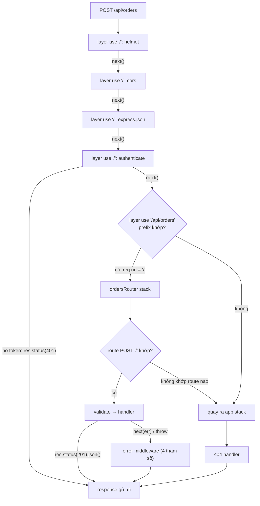

## Bối cảnh & vấn đề

Một team thêm route `/api/orders` vào một Express app đang chạy ổn. Trên staging mọi thứ bình thường vì tester dùng Postman. Lên production, frontend báo lỗi CORS ở mọi request tới orders, `req.body` trong handler tạo đơn luôn là `undefined`, và tuần sau một pentester phát hiện `GET /api/orders` trả dữ liệu mà **không cần token**. Code của từng middleware đều đúng. Cái sai duy nhất là **thứ tự** của chúng trong file `app.ts`:

```ts
const app = express();
app.use("/api/orders", ordersRouter);   // đăng ký trước mọi thứ
app.use(express.json());
app.use(cors({ origin: "https://shop.example.com", credentials: true }));
app.use(authenticate);
app.use("/api/admin", adminRouter);
app.use(errorHandler);
```

Để hiểu vì sao một dòng đặt sai chỗ lại gây ra ba lỗi khác nhau, bạn cần một mô hình tư duy chính xác về Express: nó không phải "framework có routing và middleware" theo nghĩa mơ hồ, mà là **một danh sách tuyến tính các layer**, được duyệt từ trên xuống cho mỗi request. Middleware, route handler, router con, error handler: tất cả đều là layer trong danh sách đó. Bài này dựng mô hình ấy từ đầu, rồi dùng nó để giải thích `app.use` vs `app.get`, các biến thể của `next`, Router và `mergeParams`, nguồn gốc của `req.params`/`req.query`/`req.body`, và lỗi kinh điển `ERR_HTTP_HEADERS_SENT`.

Bài viết theo **Express 5** (bản `latest` trên npm hiện nay, dùng package `router` 2.x và `path-to-regexp` 8.x), và ghi chú chỗ nào Express 4 khác. Chi tiết về các thay đổi của Express 5 ở bài [Express 5 migration](/tracks/express/learn/express-5-migration).

**Interview angle:** câu mở đầu hầu như luôn là "middleware là gì". Interviewer không cần định nghĩa sách vở; họ muốn thấy bạn biết thứ tự đăng ký quyết định mọi thứ, và biết ba việc một middleware có thể làm.

## Khái niệm

### Middleware là một function trong stack

**Middleware** là một function có chữ ký `(req, res, next)`. Express giữ một **stack** (mảng) các layer; mỗi layer gồm một path pattern, (tuỳ loại) một HTTP method, và function xử lý. Khi request tới, Express bắt đầu ở layer đầu tiên, kiểm tra layer có **khớp** request không (path, method), nếu khớp thì gọi function. Function nhận `next` là callback "đi tiếp tới layer khớp kế tiếp".

Một middleware có đúng **ba lựa chọn** với request:

1. **Đọc hoặc biến đổi** `req`/`res`: gắn `res.locals.user`, set header, bắt đầu một timer, đăng ký listener `res.on("finish")`.
2. **Kết thúc** request bằng cách gửi response (`res.status(401).json(...)`, `res.send`, `res.end`). Khi đó nó **không** gọi `next`.
3. **Chuyển tiếp** bằng `next()`, hoặc **báo lỗi** bằng `next(err)`.

Lựa chọn (1) luôn đi kèm (2) hoặc (3). Nếu middleware không gửi response và cũng không gọi `next`, request **treo**: không có gì xảy ra cho tới khi client, load balancer hoặc `server.requestTimeout` của Node cắt kết nối.

Có một hiểu lầm phổ biến rằng middleware "chỉ chạy trước handler". Thực ra route handler cũng là middleware (nó chỉ không gọi `next`), và middleware có thể làm việc **sau** handler thông qua event của response. Ví dụ logger đo thời gian đăng ký `res.on("finish")` rồi gọi `next()` ngay: callback `finish` chạy khi byte cuối của response đã được giao cho OS, tức là sau khi handler xong. Nếu log ngay sau `next()`, bạn chỉ đo được thời gian chạy đồng bộ của các layer phía sau, không phải thời gian của handler async.

### app.use và app.METHOD khác nhau ở cách khớp

`app.use(path?, fn)` đăng ký layer khớp **mọi method** và khớp path theo **prefix** theo ranh giới segment: `app.use("/api", mw)` khớp `/api`, `/api/orders`, `/api/orders/7`, nhưng không khớp `/apiary`. Không truyền path thì mặc định là `/`, tức khớp mọi request. Bên trong layer `use`, Express **cắt prefix** khỏi `req.url`: middleware thấy `req.url === "/orders"`, còn `req.baseUrl === "/api"` và `req.originalUrl` giữ nguyên URL gốc. Đây là cơ chế cho phép một router con viết route tương đối (`/:id`) mà không biết mình được mount ở đâu.

`app.get(path, ...fns)` (và `post`, `put`, `delete`, `patch`, `all`) đăng ký một **route**: khớp method cụ thể (`all` là mọi method) và khớp **toàn bộ path** theo pattern. `app.get` còn tự khớp `HEAD` (Express trả header như GET nhưng bỏ body). Một route có thể nhận nhiều function: `app.get("/orders", auth, validate, handler)`; các function này tạo thành một chuỗi nhỏ bên trong route.

Vì Express duyệt stack theo thứ tự, layer nào gửi response trước thì các layer sau **không bao giờ chạy**. Middleware bảo vệ (auth, rate limit) đặt sau router thì không bảo vệ router đó; body parser đặt sau router thì router không có body.

### next() và các biến thể

- `next()`: đi tới layer khớp kế tiếp.
- `next(err)` (bất kỳ giá trị nào khác `"route"`/`"router"`, kể cả string): chuyển sang **chế độ lỗi**. Express bỏ qua mọi middleware thường và chỉ gọi các **error middleware** (4 tham số) phía sau. Chi tiết ở bài [error handling](/tracks/express/learn/error-handling).
- `next("route")`: bỏ qua các function **còn lại của route hiện tại** và đi sang layer kế tiếp. Chỉ có tác dụng trong function đăng ký qua `app.METHOD`/`router.METHOD`, không có tác dụng trong `app.use`. Use case: feature flag chọn giữa handler cũ và handler mới cùng path.
- `next("router")`: thoát khỏi **router hiện tại**, quay về stack của router cha và đi tiếp từ sau chỗ mount. Use case: một router admin tự "nhường" request cho route public nếu request không có quyền admin.

Gọi `next()` **hai lần** trong cùng middleware không làm chạy lại handler từ đầu. Chỉ số "layer hiện tại" của router là trạng thái chung của request, nên lần gọi thứ hai tiếp tục đi **từ vị trí mà lần gọi đầu đã tới**: nó nhảy qua các layer còn lại, thường rơi xuống 404 handler hoặc error handler, lúc response đã được gửi. Kết quả tuỳ vào layer nào nhận được lần gọi thừa: im lặng, log lỗi khó hiểu, hoặc `ERR_HTTP_HEADERS_SENT`.

### Router và mergeParams

`express.Router()` tạo một **mini app**: có stack riêng, `use`/`get`/`param` riêng, nhưng không có `listen` hay settings. Bạn mount nó bằng `app.use("/orders", ordersRouter)`. Router giúp tổ chức code theo feature và gắn middleware cục bộ (ví dụ `adminRouter.use(requireAdmin)` chỉ áp cho `/admin`). Router có thể lồng nhiều cấp.

Mặc định, router con **không thấy** `req.params` của path dùng để mount nó. Mount `app.use("/tenants/:tenantId/orders", orders)` thì trong `orders.get("/:orderId")`, `req.params` chỉ có `orderId`. Tạo router với `express.Router({ mergeParams: true })` để gộp params của cha vào (nếu trùng tên, params của con thắng). Lưu ý: lấy được `tenantId` từ URL **không có nghĩa** user được phép truy cập tenant đó. URL là input của client; quyền phải được đối chiếu với danh tính đã xác thực (xem bài [auth & multi-tenant](/tracks/express/learn/auth-multi-tenant)).

### req.params, req.query, req.body

- **`req.params`**: giá trị trích từ path pattern (`/orders/:id` → `{ id: "7" }`). Luôn là **string** (wildcard của Express 5 là mảng string). Trong Express 5 object này có null prototype và tham số không khớp (optional) bị **bỏ hẳn**, không phải `undefined`.
- **`req.query`**: parse từ query string bởi "query parser". Express 5 mặc định parser **simple** (`node:querystring`): `?status=paid&status=shipped` thành `{ status: ["paid", "shipped"] }`, còn `?user[role]=admin` thành key phẳng `"user[role]"`. Express 4 mặc định **extended** (`qs`), nên cùng query đó thành object lồng `{ user: { role: "admin" } }`. Trong Express 5, `req.query` là **getter** không có setter, và mỗi lần đọc nó parse lại, nên gán hay sửa thuộc tính của nó không có tác dụng.
- **`req.body`**: không tồn tại cho tới khi một **body parser** (`express.json()`, `express.urlencoded()`, `express.text()`, `express.raw()`) đọc stream request. Không có parser thì `req.body` là `undefined` ở cả Express 4 và 5. Khác biệt của Express 5 là khi parser **có** chạy nhưng không parse (request không có body, hoặc `Content-Type` không khớp), `req.body` vẫn là `undefined`, trong khi Express 4 đặt nó thành `{}`.

Cả ba đều là **input không tin cậy**: kiểu có thể là string, mảng hay object tuỳ client gửi gì. Luôn validate và ép kiểu ở ranh giới (xem bài [validation & request context](/tracks/express/learn/validation-request-context)).

### ERR_HTTP_HEADERS_SENT

HTTP/1.1 gửi status line và header **trước**, body sau. Khi bạn gọi `res.json()`, Express set header, ghi body và kết thúc response. Mọi lời gọi tiếp theo cố set header (`res.status().json()`, `res.set`, `res.redirect`) đụng vào `ServerResponse.setHeader` của Node, và Node ném `Error [ERR_HTTP_HEADERS_SENT]: Cannot set headers after they are sent to the client`. Nguyên nhân luôn là **một request, hai đường gửi response**: thiếu `return` sau nhánh lỗi, gọi `next()` sau khi đã gửi, một timeout middleware đã trả 503 trong khi handler vẫn chạy và gửi kết quả muộn, hoặc error handler cố ghi response khi `res.headersSent` đã là `true`.

## Cơ chế hoạt động

Sơ đồ dưới đây là stack của app trong phần "Bối cảnh" sau khi sửa thứ tự, và đường đi của một request `POST /api/orders`:



Từng bước: Express tạo một hàm `next` cho request và bắt đầu ở layer 0. Với mỗi layer, nó hỏi hai câu: path có khớp không (prefix cho `use`, toàn bộ cho route), method có khớp không (chỉ với route). Không khớp thì bỏ qua mà không gọi function. Khớp thì gọi function và **dừng**, chờ function đó gọi `next`. Đây là lý do toàn bộ pipeline là "cooperative": Express không bao giờ tự đi tiếp, và không bao giờ tự dừng một middleware đang chạy.

Khi vào một router, Express cắt prefix mount khỏi `req.url` và bắt đầu duyệt stack **của router**. Nếu router duyệt hết mà không ai gửi response, hoặc có ai gọi `next("router")`, Express khôi phục `req.url` và quay về app stack ngay sau layer mount. Đó là cách 404 handler ở cuối app bắt được cả request đã vào router mà không khớp route nào.

Khi có ai gọi `next(err)` (hoặc throw, hoặc promise reject trong Express 5), Express chuyển sang **chế độ lỗi**: vẫn duyệt tiếp stack từ vị trí hiện tại, nhưng chỉ gọi layer có function 4 tham số. Error handler đặt **trước** layer ném lỗi thì không bao giờ được gọi, vì duyệt stack chỉ đi xuống.

## Ví dụ thực tế

### Thứ tự, prefix và các biến thể của next

Chạy trên Express 5.2.1, Node 24 (output thật):

```js
import express from 'express';
const app = express();
const log = [];
app.use((req, res, next) => { log.length = 0; log.push('global'); next(); });
app.use('/api', (req, res, next) => {
  log.push(`use /api: url=${req.url} baseUrl=${req.baseUrl} originalUrl=${req.originalUrl}`);
  next();
});
app.get('/api', (req, res) => res.json({ exact: true, log }));
app.get('/api/orders', (req, res) => res.json({ log, query: req.query, body: req.body }));
app.post('/api/orders', (req, res) => res.json({ bodyBeforeParser: req.body === undefined ? 'undefined' : req.body }));

const flags = { newCheckout: (req) => req.get('x-beta') === '1' };
app.get('/checkout', (req, res, next) => (flags.newCheckout(req) ? next('route') : next()), (req, res) => res.send('legacy'));
app.get('/checkout', (req, res) => res.send('new'));

const admin = express.Router();
admin.use((req, res, next) => (req.get('x-admin') ? next() : next('router')));
admin.get('/stats', (req, res) => res.send('admin stats'));
app.use('/panel', admin);
app.get('/panel/stats', (req, res) => res.send('public stats (router skipped)'));

const orders = express.Router({ mergeParams: true });
orders.get('/:orderId', (req, res) => res.json(req.params));
const ordersNoMerge = express.Router();
ordersNoMerge.get('/:orderId', (req, res) => res.json(req.params));
app.use('/tenants/:tenantId/orders', orders);
app.use('/t/:tenantId/orders', ordersNoMerge);
app.listen(3101);
```

```text
$ curl -s localhost:3101/api
{"exact":true,"log":["global","use /api: url=/ baseUrl=/api originalUrl=/api"]}
$ curl -s 'localhost:3101/api/orders?status=paid&status=shipped&page=2'
{"log":["global","use /api: url=/orders?status=paid&status=shipped&page=2 baseUrl=/api originalUrl=/api/orders?status=paid&status=shipped&page=2"],"query":{"status":["paid","shipped"],"page":"2"}}
$ curl -s -XPOST -H 'content-type: application/json' -d '{"a":1}' localhost:3101/api/orders
{"bodyBeforeParser":"undefined"}
$ curl -s localhost:3101/checkout ; curl -s -H 'x-beta: 1' localhost:3101/checkout
legacy new
$ curl -s localhost:3101/panel/stats ; curl -s -H 'x-admin: 1' localhost:3101/panel/stats
public stats (router skipped) admin stats
$ curl -s localhost:3101/tenants/42/orders/7 ; curl -s localhost:3101/t/42/orders/7
{"tenantId":"42","orderId":"7"} {"orderId":"7"}
$ curl -sI localhost:3101/api | head -1
HTTP/1.1 200 OK
```

Đọc output: layer `use('/api')` chạy cho cả `/api` và `/api/orders`, và bên trong nó `req.url` đã bị cắt prefix. `?status=` lặp lại thành mảng, `page` là string `"2"`, không phải number. Không có `express.json()` nên JSON gửi lên không được đọc. `next('route')` chuyển sang route `/checkout` thứ hai, `next('router')` bỏ cả router admin để rơi xuống route public. `mergeParams` quyết định router con có thấy `tenantId` hay không. `HEAD /api` được route `GET` phục vụ.

### Query parser và body: Express 4 so với 5

Cùng một app, chạy song song trên hai version (output thật, `curl -g` để curl không hiểu `[]` là glob):

```text
$ curl -sg 'localhost:3101/api/orders?user[role]=admin&a[b][c]=1'     # express 5.2.1
..."query":{"user[role]":"admin","a[b][c]":"1"}}
$ curl -sg 'localhost:3102/api/orders?user[role]=admin&a[b][c]=1'     # express 4.22.3
..."query":{"user":{"role":"admin"},"a":{"b":{"c":"1"}}}}
```

Và `req.body` khi có hoặc không có parser:

```js
app.get('/raw', (req, res) => res.json({ noParser: req.body === undefined ? 'undefined' : req.body }));
app.use(express.json());
app.all('/p', (req, res) => res.json({ withParser: req.body === undefined ? 'undefined' : req.body }));
```

```text
4.22.3
 GET /raw {"noParser":"undefined"}
 GET /p (no body) {"withParser":{}}
 POST /p text/plain {"withParser":{}}
5.2.1
 GET /raw {"noParser":"undefined"}
 GET /p (no body) {"withParser":"undefined"}
 POST /p text/plain {"withParser":"undefined"}
```

Hệ quả thực tế: code Express 4 kiểu `const { note } = req.body` chạy được với request không có body (vì `req.body` là `{}`), nhưng lên Express 5 nó ném `TypeError: Cannot destructure property 'note' of 'req.body' as it is undefined`. Validate bằng schema với `req.body ?? {}` hoặc bắt buộc `Content-Type` đúng.

### Hai lần gửi response và hai lần next

```js
app.get('/twice/:id', async (req, res) => {
  const found = req.params.id === '1';
  if (!found) res.status(404).json({ error: 'not found' }); // thiếu return
  res.json({ id: req.params.id });
});
app.get('/next-twice', (req, res, next) => { next(); next(); });
app.get('/next-twice', (req, res) => { n++; res.send('handler ran'); });
app.use((req, res, next) => { console.log('  404 layer reached, headersSent =', res.headersSent); next(); });
```

```text
$ curl -s -w ' [%{http_code}]' localhost:3101/twice/2
{"error":"not found"} [404]
# server log (Express 5 chuyển throw thành next(err), error handler thấy headersSent):
error handler: ERR_HTTP_HEADERS_SENT Cannot set headers after they are sent to the client

GET /nt handler ran
  404 layer reached, headersSent = true
  handler count = 1
```

Client nhận 404 đúng, nên bug này thường **không ai thấy** cho tới khi đọc log. Với `next()` hai lần, handler chỉ chạy một lần; lần gọi thứ hai đi tiếp từ vị trí hiện tại và rơi xuống layer 404 khi response đã gửi xong. Fix chung: `return res.status(404).json(...)`, mỗi nhánh có đúng một lối ra, và trong middleware viết `return next()` khi còn code phía sau.

### Sửa app trong phần Bối cảnh

```ts
const app = express();
app.use(helmet());
app.use(cors({ origin: ["https://shop.example.com"], credentials: true }));
app.use(express.json({ limit: "100kb" }));
app.use(requestContext);                 // requestId, logger
app.use("/api", authenticate);           // mọi thứ dưới /api cần token
app.use("/api/orders", ordersRouter);
app.use("/api/admin", requireRole("admin"), adminRouter);
app.use(notFound);
app.use(errorHandler);
```

Để "mặc định cần auth" không phụ thuộc trí nhớ của người thêm route, viết một test tích hợp duyệt danh sách route và khẳng định mọi route không nằm trong allowlist public trả 401 khi thiếu token (xem bài [kiến trúc & testing](/tracks/express/learn/architecture-testing)).

## Trade-offs & lựa chọn thay thế

| Cách gắn middleware | Ưu | Nhược | Dùng khi |
|---|---|---|---|
| `app.use(mw)` toàn cục | Không thể quên, một chỗ duy nhất | Chạy cả cho route không cần (health check, static) | helmet, requestId, logger, body parser |
| `app.use("/api", mw)` theo prefix | Tách nhóm public/private rõ | Route mới ngoài prefix không được bảo vệ | auth cho cả API |
| `router.use(mw)` trong router | Gắn với feature, dễ đọc cạnh route | Người đọc app.ts không thấy | quyền riêng của module admin |
| Per-route `app.get(p, mw, h)` | Rõ ràng nhất cho từng endpoint | Dễ quên ở endpoint mới | validate(schema), requirePermission cụ thể |

| Cách truyền dữ liệu giữa layer | Ưu | Nhược |
|---|---|---|
| `res.locals.x` | Chuẩn Express, sống đúng một request, không đụng type của `Request` | Kiểu `any` nếu không khai báo generic |
| `req.user` (declaration merging) | Quen thuộc, nhiều lib (passport) dùng | Khai báo global, route public cũng "có" `user?` |
| Biến module-level | (không có) | Bị trộn giữa các request đồng thời, lỗi bảo mật |

Chọn thế nào: middleware nền tảng (bảo mật header, CORS, parser, context) đăng ký toàn cục ở đầu; auth theo prefix để "mặc định bảo vệ"; quyền cụ thể và validate gắn per-route. Dữ liệu per-request đi qua `res.locals` hoặc một field được type hoá, không bao giờ qua biến module.

## Edge cases & failure modes

- **Middleware async không gọi next và không gửi response** khi một nhánh `if` bị quên: request treo, client thấy timeout 504 từ load balancer, log app không có gì. Đặt timeout ở server (`requestTimeout`) và log request chưa hoàn thành khi `res.on("close")` mà `!res.writableFinished`.
- **Router không khớp route nào** vẫn "đi ra" app stack: một router mount ở `/api` với middleware ghi log sẽ ghi log cho cả request 404.
- **`next("route")` trong `app.use`** không có tác dụng như mong đợi (nó chỉ hoạt động trong route), dễ tạo bug khi refactor từ `use` sang `get`.
- **`req.params` là string**: `req.params.id === 7` luôn `false`. Một handler so sánh `order.ownerId === req.params.userId` với `ownerId` là number sẽ luôn từ chối (hoặc với `!=` lỏng thì luôn chấp nhận).
- **Query lặp lại** (`?status=a&status=b`) biến string thành mảng: `req.query.status.toUpperCase()` ném TypeError, và một số code "sanitize" chỉ xử lý string bị bypass bằng mảng.
- **Thứ tự CORS và preflight**: nếu `authenticate` đứng trước `cors`, request `OPTIONS` preflight (không mang token) bị trả 401 không có header CORS, browser báo lỗi CORS thay vì lỗi auth. CORS phải trả lời preflight trước auth.

## Pitfalls

- ❌ Đăng ký router trước `express.json()`/`cors`/`authenticate` → ✅ thứ tự helmet → cors → parser → context → auth → routers → 404 → error handler, vì Express duyệt stack từ trên xuống và dừng ở layer gửi response.
- ❌ `if (!order) res.status(404).json(...)` rồi code chạy tiếp → ✅ `return res.status(404).json(...)`, một lối ra cho mỗi nhánh.
- ❌ Gọi `next()` rồi vẫn chạy tiếp code có thể gửi response → ✅ `return next()`.
- ❌ Log thời gian ngay sau `next()` → ✅ đo trong `res.on("finish")` (hoàn tất) và `res.on("close")` (client ngắt sớm).
- ❌ Tin `req.params.tenantId` để phân quyền → ✅ lấy tenant từ token đã xác thực, URL chỉ để chọn tài nguyên.
- ❌ Coi `req.query.page` là number → ✅ validate và coerce (`z.coerce.number().int().min(1)`).
- ❌ Destructure `req.body` không kiểm tra (Express 5 để `undefined`) → ✅ schema validate với mặc định rõ ràng.

## Tóm tắt

- Express là một stack layer duyệt từ trên xuống; mỗi layer khớp path (prefix với `use`, toàn bộ với route) và method (với route), rồi chờ function gọi `next`.
- Middleware có ba lựa chọn: biến đổi `req`/`res`, kết thúc response, hoặc `next()`/`next(err)`. Không làm gì thì request treo.
- `app.use` khớp mọi method theo prefix và cắt prefix khỏi `req.url` (`req.baseUrl` giữ phần mount); `app.get` khớp method + toàn bộ path, tự phục vụ `HEAD`.
- `next(err)` sang chế độ lỗi, `next("route")` bỏ phần còn lại của route, `next("router")` thoát router. Gọi `next` hai lần làm request chạy tiếp từ vị trí hiện tại.
- Router là mini app; `mergeParams: true` để thấy params của cha. Params từ URL không phải bằng chứng phân quyền.
- `req.params` luôn string, `req.query` Express 5 dùng parser simple và là getter, `req.body` chỉ có khi parser chạy (Express 5 để `undefined` cả khi parser không parse).
- `ERR_HTTP_HEADERS_SENT` nghĩa là một request có hai đường gửi response: thiếu `return`, `next` sau khi gửi, timeout middleware, hoặc error handler không check `res.headersSent`.
