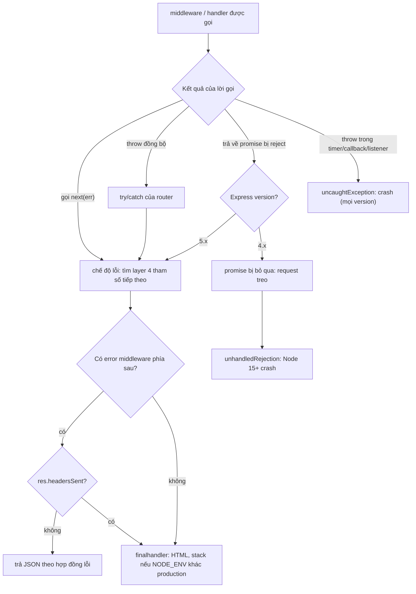
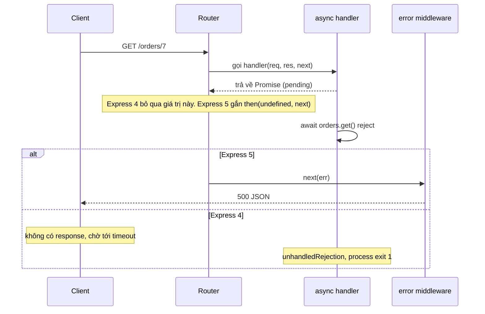

## Bối cảnh & vấn đề

Một API Express 4 chạy ổn nhiều tháng. Một tối, database bị chậm, vài query timeout. Dashboard cho thấy một chuỗi sự kiện kỳ lạ: đầu tiên các request tới `GET /orders/:id` **không trả gì**, load balancer đợi 60 giây rồi trả 504. Vài giây sau, pod restart với log `Error: DB timeout for order 7`, và **mọi request khác** đang chạy trên pod đó (thanh toán, đăng nhập) cũng chết theo. Team đã có error middleware trả JSON 500 chuẩn chỉnh. Vậy tại sao nó không được gọi?

```ts
// express@4
app.get("/orders/:id", async (req, res) => {
  const order = await orders.get(req.params.id); // throws khi DB timeout
  res.json(order);
});
app.use((err, req, res, next) => res.status(500).json({ error: "internal" }));
```

Câu trả lời nằm ở chỗ Express 4 được thiết kế trước thời `async/await`: nó gọi handler, **bỏ qua giá trị trả về**, và chỉ biết hai cách một handler báo lỗi: `throw` đồng bộ, hoặc gọi `next(err)`. Một async function không throw đồng bộ; nó trả về một promise bị reject, và không ai lắng nghe promise đó. Express 5 sửa đúng điểm này, nhưng chỉ điểm này: lỗi trong callback, timer, event listener vẫn thoát ra ngoài.

Bài này giải thích error middleware hoạt động thế nào, đường đi của lỗi trong Express 4 và 5, những lỗi cấu hình khiến error handler "không chạy", và cách thiết kế error handling tập trung cho một API thật: error type, mapping HTTP, log, và những gì client được thấy. Nền tảng về unhandled rejection và error class ở bài [JavaScript: errors & cancellation](/tracks/javascript/learn/errors-cancellation).

**Interview angle:** câu "async handler throw thì sao" là câu phân loại ứng viên Express rõ nhất. Câu trả lời mạnh nói được cả ba ý: Express 4 bỏ qua promise, Node 15+ crash vì unhandled rejection, và Express 5 chỉ bắt promise được **trả về**.

## Khái niệm

### Error middleware nhận diện bằng số tham số

**Error middleware** (error handler) là middleware có **đúng 4 tham số** `(err, req, res, next)`. Express không có API riêng kiểu `app.onError`; nó phân biệt bằng `fn.length`, tức số tham số khai báo của function. Layer có `fn.length === 4` chỉ được gọi khi request đang ở **chế độ lỗi**; layer khác chỉ được gọi khi không có lỗi.

Thiết kế này đơn giản nhưng mong manh. Viết `(err, req, res) => ...` (thiếu `next` vì "không dùng tới") thì `length` là 3, Express coi đó là middleware **thường** và gọi nó với `(req, res, next)`: biến `err` thực chất là `req`, biến `res` là `next`, và `res.status(...)` ném `TypeError: res.status is not a function` ngay trên **mọi** request đi qua. Bọc error handler trong một wrapper generic `(...args) => fn(...args)` (tracing, metrics) cũng làm `length` thành 0 và error handler biến mất lặng lẽ. Parameter có giá trị mặc định (`next = noop`) hoặc rest parameter cũng không được tính vào `length`.

### Lỗi tới error middleware bằng đường nào

Có ba đường, tuỳ version:

1. **`next(err)`**: cách tường minh, hoạt động ở mọi version và từ mọi ngữ cảnh (kể cả callback).
2. **`throw` đồng bộ** bên trong middleware/handler: Express bọc lời gọi function trong `try/catch`, bắt được và gọi `next(err)` thay bạn. Chỉ áp dụng cho code chạy đồng bộ trong lời gọi đó.
3. **Promise bị reject** mà middleware/handler **trả về** (async function throw, hoặc `return somePromise`): chỉ **Express 5** xử lý. Router gọi function, thấy giá trị trả về là promise, gắn `.catch(next)`-tương đương. Express 4 bỏ qua giá trị trả về.

Những gì **không** thuộc ba đường trên thì không bao giờ tới error middleware, ở cả hai version: throw bên trong `setTimeout`/`setImmediate`, bên trong callback của thư viện kiểu callback (`fs.readFile(p, cb)`), bên trong listener của EventEmitter hoặc stream, hay một promise không được `await` (floating promise). Chúng thoát lên cấp process thành `uncaughtException` hoặc `unhandledRejection`. Từ Node 15, mặc định `--unhandled-rejections=throw` biến unhandled rejection thành crash với exit code 1.

### Express 4: vì sao request treo rồi process chết

Với Express 4 và async handler bị reject, hai việc xảy ra. **Thứ nhất**, không ai gửi response và không ai gọi `next`, nên request treo cho tới khi client hoặc load balancer bỏ cuộc (ALB mặc định 60 giây idle, trả 504). **Thứ hai**, promise bị reject không có handler, Node phát `unhandledRejection`; nếu không có listener, process crash, và **mọi request đang chạy** trên process đó bị cắt ngang. Nếu có listener chỉ log (nhiều codebase cũ làm vậy để "không crash"), process sống nhưng mỗi lỗi DB để lại một request treo và một socket bị giữ.

Workaround chuẩn trên Express 4 là **wrapper** chuyển rejection thành `next(err)`:

```ts
const asyncHandler = <Req extends Request, Res extends Response>(
  fn: (req: Req, res: Res, next: NextFunction) => unknown,
) => (req: Req, res: Res, next: NextFunction) => {
  Promise.resolve(fn(req, res, next)).catch(next);
};
```

Lựa chọn khác là package `express-async-errors`, monkey-patch `Layer` của Express 4 để làm việc này tự động. Nó tiện nhưng phụ thuộc vào nội bộ Express 4 và không cần thiết trên Express 5.

### Express 5: sửa được gì, chưa sửa gì

Express 5 (router 2.x) kiểm tra giá trị trả về của mọi middleware và handler: nếu là promise bị reject, nó gọi `next(err)` với lý do reject (nếu reject với giá trị falsy, Express tạo một `Error` thay thế). Vì vậy một async handler bình thường là đủ; `asyncHandler` và `express-async-errors` có thể xoá khi nâng cấp.

Nhưng cơ chế này chỉ nhìn thấy **promise được trả về**. Một handler Express 5 làm `setTimeout(() => { throw new Error("x") })` vẫn crash process, vì throw xảy ra trong một task sau, khi lời gọi handler đã kết thúc từ lâu. Một middleware gọi `permissions.forUser(id).then(...)` mà không `return` hay `await` promise đó cũng vậy: promise trôi nổi, Express không biết nó tồn tại. Quy tắc thực hành: trong Express 5, viết mọi middleware bất đồng bộ là `async` và `await` mọi thứ; code callback thì chuyển sang API promise (`fs/promises`, `timers/promises`, `events.once`).

### Default error handler và NODE_ENV

Nếu không error middleware nào gửi response (không có, hoặc có nhưng gọi `next(err)`), lỗi rơi xuống **default error handler** của Express (package `finalhandler`). Nó dùng `err.status` hoặc `err.statusCode` (4xx/5xx) làm status, mặc định 500, và trả một trang **HTML**. Nội dung trang phụ thuộc `NODE_ENV`: khác `"production"` thì in **stack trace** đầy đủ; bằng `"production"` thì chỉ in tên status (`Internal Server Error`). Stack trace vẫn được in ra stderr khi env khác `"test"`.

Điều này có nghĩa là quên set `NODE_ENV=production` trên server thật khiến mọi lỗi không được xử lý **lộ stack trace**, đường dẫn file, đôi khi cả nội dung message chứa SQL hay dữ liệu, ra client. Ngoài ra nếu headers đã gửi (`res.headersSent`), default handler không thể ghi response mới; nó huỷ socket, và client thấy response bị cắt ngang. Đó là lý do error handler của bạn phải check `res.headersSent` và `return next(err)` trong trường hợp đó.

### Error handling tập trung

Một API nghiêm túc cần một **hợp đồng lỗi**: client nhận một mã máy đọc được, ổn định; support tra được log từ response; và không bao giờ lộ nội bộ. Mẫu phổ biến:

- Một lớp `AppError extends Error` với `code` (`ORDER_NOT_FOUND`), `status` (404), `expose` (message có an toàn để hiện không), `details` (ví dụ danh sách field lỗi), và `cause` (lỗi gốc, xem [error class có cause](/tracks/javascript/learn/errors-cancellation)).
- Subclass hoặc factory cho các loại thường gặp: `ValidationError` (400), `UnauthorizedError` (401), `ForbiddenError` (403), `NotFoundError` (404), `ConflictError` (409).
- Một hàm `toAppError(err)` ở **một chỗ duy nhất** map lỗi của thư viện: `ZodError` thành 400, lỗi unique violation của Postgres (`code === "23505"`) thành 409, `entity.too.large` của body-parser thành 413, còn lại thành 500 với message chung.
- Một error middleware cuối cùng: log (5xx ở mức error kèm stack và context, 4xx ở mức thấp hơn), rồi trả format thống nhất, ví dụ **RFC 9457 Problem Details** (`type`, `title`, `status`, `detail`, cộng extension như `code`, `requestId`).

Điểm then chốt: code nghiệp vụ **throw** lỗi có nghĩa (`throw new NotFoundError("order")`), không tự viết `res.status(404).json(...)` rải rác. Khi đó format lỗi được đảm bảo bởi một chỗ, và một developer mới không thể vô tình trả message lỗi DB thô cho client.

## Cơ chế hoạt động



Diễn giải: chỉ ba nhánh trên cùng dẫn tới error middleware, và nhánh promise phụ thuộc version. Hai nhánh dẫn tới crash (floating promise trên Express 4, throw bất đồng bộ ngoài promise ở mọi version) là nơi bug production sinh ra. Khi đã vào chế độ lỗi, Express duyệt **tiếp xuống** stack để tìm layer 4 tham số, nên error middleware đặt trước router không bao giờ thấy lỗi của router đó. Nếu response đã bắt đầu gửi, chỉ còn cách để finalhandler huỷ kết nối.



## Ví dụ thực tế

### Express 4 vs 5 với cùng một async handler

```js
const express = require(process.argv[2] + '/node_modules/express');
const app = express();
const orders = { get: async (id) => { await new Promise(r => setTimeout(r, 10)); throw new Error('DB timeout for order ' + id); } };
app.get('/orders/:id', async (req, res) => { res.json(await orders.get(req.params.id)); });
app.get('/timer', (req, res) => { setTimeout(() => { throw new Error('thrown inside setTimeout'); }, 5); });
app.use((err, req, res, next) => res.status(500).json({ error: 'internal', message: err.message }));
process.on('exit', (c) => console.log(`  [process exit code ${c}]`));
// client: fetch(b + '/orders/7'), timeout 1 s
```

```text
$ node async.cjs ./v4
express 4.22.3
  [process exit code 1]
Error: DB timeout for order 7
Node.js v24.21.0

$ node async.cjs ./v5
express 5.2.1
  status 500 {"error":"internal","message":"DB timeout for order 7"} (54 ms)
  [process exit code 0]

$ node async.cjs ./v5 timer
express 5.2.1
  [process exit code 1]
Error: thrown inside setTimeout
```

Express 4 crash trước cả khi client kịp timeout. Express 5 trả 500 đúng. Nhưng lỗi trong `setTimeout` vẫn crash Express 5.

Nếu codebase Express 4 có listener `unhandledRejection` chỉ log, triệu chứng đổi thành request treo; wrapper sửa được:

```js
process.on('unhandledRejection', (e) => console.log('  unhandledRejection:', e.message));
const asyncHandler = (fn) => (req, res, next) => { Promise.resolve(fn(req, res, next)).catch(next); };
app.get('/raw/:id', async (req, res) => { res.json(await orders.get(req.params.id)); });
app.get('/wrapped/:id', asyncHandler(async (req, res) => { res.json(await orders.get(req.params.id)); }));
```

```text
  unhandledRejection: DB timeout for order 7
/raw/7 client gave up: TimeoutError 2007 ms
/wrapped/7 500 {"error":"internal"} 13 ms
```

### Error handler "không chạy": số tham số, vị trí, wrapper

```js
const threeArgs = (err, req, res) => res.status(err.status ?? 500).json({ code: err.code });
const fourArgs = (err, req, res, _next) => res.status(err.status ?? 500).json({ code: err.code });
const traced = (fn) => (...args) => fn(...args); // generic wrapper: length = 0
api.get('/boom', () => { throw Object.assign(new Error('order 7 missing'), { status: 404, code: 'ORDER_NOT_FOUND' }); });
// mỗi biến thể: đăng ký handler trước/sau app.use('/api', api)
```

```text
NODE_ENV = (unset)
three-args-before  -> 500 text/html | <pre>TypeError: res.status is not a function
four-args-before   -> 404 text/html | <pre>Error: order 7 missing<br> &nbsp; &nbsp;at ...
four-args-after    -> 404 application/json | {"code":"ORDER_NOT_FOUND"}
wrapped-after      -> 404 text/html | <pre>Error: order 7 missing ...
none               -> 404 text/html | <pre>Error: order 7 missing ...

NODE_ENV=production
wrapped-after      -> 404 text/html | <pre>Not Found</pre>
none               -> 404 text/html | <pre>Not Found</pre>
```

Chỉ biến thể "4 tham số, đặt sau router" trả JSON. Handler 3 tham số còn tệ hơn "không chạy": nó chạy như middleware thường cho **mọi** request và làm hỏng cả request không lỗi. Default handler tôn trọng `err.status` (404) và chỉ ẩn stack khi `NODE_ENV=production`:

```text
$ node -e "...app.get('/x',()=>{throw new Error('password=hunter2 in SQL')})..."
500 Error: password=hunter2 in SQL          # NODE_ENV chưa set: message và stack ra client
$ NODE_ENV=production node -e "..."
500 Internal Server Error                   # response an toàn, stack vẫn ra stderr
```

### Permission middleware: bypass quyền và crash

Đoạn middleware trong câu hỏi debug, chạy thật trên Express 5 với user `mallory` không có quyền `order:delete`:

```js
const buggy = (perm) => (req, res, next) => {
  permissions.forUser(req.user.id).then((perms) => {
    if (!perms.includes(perm)) { res.status(403).json({ error: 'forbidden' }); }
    next();
  });
  next();
};
const fixed = (perm) => async (req, res, next) => {
  const perms = await permissions.forUser(req.user.id);
  if (!perms.includes(perm)) throw new ForbiddenError(`missing ${perm}`);
  next();
};
app.delete('/buggy/orders/:id', buggy('order:delete'), (req, res) => { audit.push(`buggy: ${req.user.id} deleted ${req.params.id}`); res.sendStatus(204); });
app.delete('/fixed/orders/:id', fixed('order:delete'), (req, res) => { audit.push(`fixed: ${req.user.id} deleted ${req.params.id}`); res.sendStatus(204); });
```

```text
mallory DELETE /buggy/orders/9 -> 204
  unhandledRejection: ERR_HTTP_HEADERS_SENT
mallory DELETE /fixed/orders/9 -> 403 {"code":"FORBIDDEN"}
audit log: [ 'buggy: mallory deleted 9' ]
```

Ba bug chồng lên nhau. `next()` cuối chạy **đồng bộ**, trước khi kiểm tra quyền xong, nên handler xoá đơn và trả 204: **lỗ hổng phân quyền**. 20 ms sau, `.then` chạy, cố trả 403 trên response đã gửi, ném `ERR_HTTP_HEADERS_SENT` bên trong `.then`; promise không có `.catch` nên đó là unhandled rejection. Không có listener (mặc định), process **crash**. Bản sửa chỉ có một đường đi và `await`, Express 5 tự chuyển `ForbiddenError` tới error handler. Test bắt được bug này rất đơn giản: gọi route với user không có quyền và khẳng định **cả** status 403 **và** side effect không xảy ra (audit log rỗng, record vẫn còn).

### Error handler tập trung

```ts
export class AppError extends Error {
  constructor(
    readonly code: string, readonly status: number, message?: string,
    readonly opts: { expose?: boolean; details?: unknown; cause?: unknown } = {},
  ) { super(message ?? code, { cause: opts.cause }); this.name = new.target.name; }
  get expose() { return this.opts.expose ?? this.status < 500; }
}

function toAppError(err: unknown): AppError {
  if (err instanceof AppError) return err;
  if (err instanceof ZodError) return new AppError("VALIDATION_FAILED", 400, "Invalid request", { details: err.issues, cause: err });
  if (isPgError(err) && err.code === "23505") return new AppError("CONFLICT", 409, "Resource already exists", { cause: err });
  if (isHttpError(err) && err.type === "entity.too.large") return new AppError("PAYLOAD_TOO_LARGE", 413, undefined, { cause: err });
  return new AppError("INTERNAL", 500, "Internal error", { expose: false, cause: err });
}

export const errorHandler: ErrorRequestHandler = (err, req, res, next) => {
  if (res.headersSent) return next(err);                 // để finalhandler đóng socket
  const e = toAppError(err);
  const requestId = res.locals.requestId;
  const ctx = { requestId, route: req.route?.path, tenantId: res.locals.auth?.tenantId, code: e.code };
  if (e.status >= 500) logger.error({ ...ctx, err: e.cause ?? e }, "request failed");
  else logger.info(ctx, "request rejected");
  res.status(e.status).type("application/problem+json").json({
    type: `https://errors.example.com/${e.code}`, title: e.expose ? e.message : "Internal error",
    status: e.status, code: e.code, requestId, ...(e.expose && e.opts.details ? { errors: e.opts.details } : {}),
  });
};
```

Để developer mới không trả lỗi DB thô: lint cấm `res.status(5xx)` trong controller, code review checklist, và một test gửi request gây lỗi DB thật rồi khẳng định response không chứa chuỗi như `relation`, `duplicate key`, `at /`.

## Trade-offs & lựa chọn thay thế

| Cách xử lý async error | Ưu | Nhược | Khi nào |
|---|---|---|---|
| Nâng Express 5 | Không cần wrapper, đúng chuẩn | Phải migrate route pattern và API bị xoá | Mặc định cho code mới và khi có thời gian migrate |
| `asyncHandler` wrapper (v4) | Tường minh, không phụ thuộc nội bộ | Dễ quên ở route mới; lint giúp được | Express 4 chưa thể nâng |
| `express-async-errors` (v4) | Một dòng import, áp cho mọi route | Monkey-patch nội bộ, ẩn phép màu | Codebase v4 lớn, tạm thời |
| `.catch(next)` thủ công | Không cần gì thêm | Lặp lại, dễ sót | Code callback/promise cũ |

| Format lỗi | Ưu | Nhược |
|---|---|---|
| RFC 9457 Problem Details | Chuẩn, có `type`/`title`/`status`, extension được | Cần thống nhất `type` URI |
| `{ code, message, requestId }` tự định nghĩa | Đơn giản | Mỗi team một kiểu nếu không có chuẩn nội bộ |
| Trả `err.message` trực tiếp | Nhanh | Lộ nội bộ, không ổn định cho client |

Chọn thế nào: code mới dùng Express 5 và một error middleware duy nhất theo Problem Details (hoặc format nội bộ đã chuẩn hoá). Code Express 4 chưa nâng được thì dùng `asyncHandler` kèm lint `@typescript-eslint/no-misused-promises` (nó báo lỗi khi truyền async function vào chỗ mong đợi callback trả `void`, đúng tình huống `app.get(path, async ...)` trên v4).

## Edge cases & failure modes

- **Lỗi sau khi stream đã bắt đầu**: response file hoặc CSV lớn đã gửi header 200 rồi DB lỗi giữa chừng. Không thể đổi status nữa; error handler phải `next(err)` để huỷ socket, và client phải phát hiện response bị cắt (thiếu chunk cuối, `Content-Length` không khớp).
- **Reject với giá trị không phải Error** (`Promise.reject("x")`, `throw { code: 1 }`): không có stack, `err.status` undefined; `toAppError` phải xử lý `unknown`.
- **Error handler tự ném lỗi** (ví dụ logger lỗi serialize vòng tròn): Express chuyển sang error handler kế tiếp hoặc finalhandler. Giữ error handler đơn giản, bọc phần log trong `try/catch`.
- **Lỗi ngoài request**: consumer Kafka, cron job, listener event chạy trong cùng process không đi qua Express. Chúng cần xử lý lỗi riêng; một lỗi ở đó vẫn crash cả API.
- **Timeout ở LB che lỗi**: request treo trên Express 4 hiện ra dưới dạng 504 ở LB mà app không log gì. Nếu thấy 504 kèm log app sạch, nghi floating promise trước.
- **`next(err)` với `err.status` từ thư viện** (body-parser đặt `status: 400`/`413`): default handler và code của bạn sẽ dùng nó; kiểm tra `toAppError` không biến chúng thành 500.

## Pitfalls

- ❌ Error handler `(err, req, res) => ...` → ✅ luôn 4 tham số, đặt `_next` nếu lint phàn nàn, vì Express nhận diện bằng `fn.length`.
- ❌ Đăng ký error handler trước router → ✅ đặt cuối cùng, sau mọi router và 404 handler.
- ❌ Bọc error handler bằng wrapper `(...args) => fn(...args)` → ✅ wrapper giữ đúng arity, hoặc không bọc error handler.
- ❌ Express 4 + `async` handler trần → ✅ `asyncHandler`/`express-async-errors`, hoặc nâng Express 5.
- ❌ Tin Express 5 bắt mọi lỗi → ✅ nó chỉ bắt promise được trả về; `await` mọi thứ, không để floating promise, không throw trong callback.
- ❌ `res.status(500).json({ error: err.message })` → ✅ message chung cho 5xx, log chi tiết kèm `requestId` ở server.
- ❌ Quên `NODE_ENV=production` → ✅ set trong image/manifest và có check lúc boot, vì default handler lộ stack trace khi thiếu.
- ❌ Error handler ghi response khi `res.headersSent` → ✅ `if (res.headersSent) return next(err)`.

## Tóm tắt

- Error middleware là middleware có đúng 4 tham số; Express nhận diện bằng `fn.length`, nên thiếu tham số, default param hay wrapper làm nó biến mất.
- Lỗi tới error middleware qua `next(err)`, throw đồng bộ, hoặc (chỉ Express 5) promise bị reject được trả về. Throw trong timer, callback, listener, floating promise thoát lên process ở mọi version.
- Express 4 + async handler reject: request treo tới timeout của LB, rồi Node 15+ crash vì unhandled rejection, kéo theo mọi request khác trên process. Sửa bằng `asyncHandler` hoặc nâng Express 5.
- Default error handler trả HTML, dùng `err.status`, lộ stack khi `NODE_ENV` khác `production`.
- Error handling tập trung: `AppError` có `code`/`status`/`expose`/`cause`, `toAppError` map lỗi thư viện ở một chỗ, error middleware cuối cùng log theo mức và trả Problem Details kèm `requestId`.
- Trong error handler, `res.headersSent` thì `return next(err)`.
- Test lỗi bằng cả status và side effect: một middleware trả 403 nhưng vẫn gọi handler là lỗ hổng, không chỉ là bug hiển thị.
