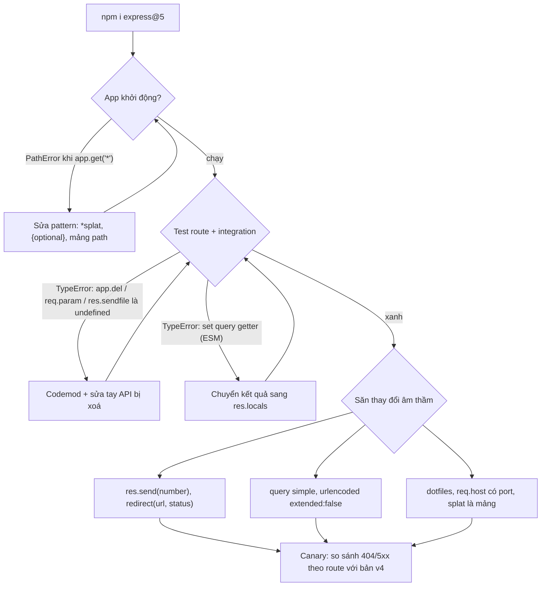
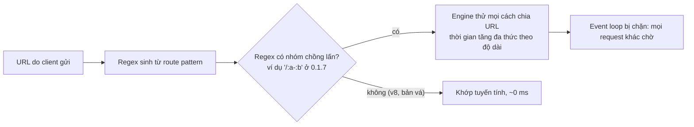

## Bối cảnh & vấn đề

Express 4 ra đời năm 2014 và là phiên bản chính suốt mười năm. **Express 5.0.0** lên npm ngày 2024-09-10 (bài blog công bố ngày 2024-10-15), và từ **5.1.0** (2025-03-31) nó thành tag `latest` trên npm, tức `npm i express` hôm nay cài v5. Nhiều team nâng version trong một PR "bump dependencies", chạy test unit (không đụng router), deploy, rồi phát hiện hai kiểu lỗi rất khác nhau:

```text
PathError [TypeError]: Missing parameter name at index 1: *; visit https://git.new/pathToRegexpError for info
    at name (node_modules/path-to-regexp/dist/index.js:...)
```

Kiểu thứ nhất **ồn ào**: app không khởi động được vì một route như `app.get("*", spaFallback)`. Kiểu thứ hai **im lặng**: app chạy, test xanh, nhưng `res.send(201)` giờ trả status 200 với body `"201"`, form HTML gửi `address[city]=Hanoi` giờ ra key phẳng thay vì object, `GET /` của SPA trả 404, và một middleware sanitize cũ gán `req.query` thì ném `TypeError` trong ESM nhưng lặng lẽ không làm gì trong CommonJS.

Bài này liệt kê các thay đổi của Express 5 theo tiêu chí hữu ích nhất cho migration: **cái gì vỡ lúc khởi động, cái gì vỡ lúc chạy, cái gì đổi hành vi âm thầm**, giải thích vì sao cú pháp route bị thu hẹp (câu trả lời là bảo mật: ReDoS), và đưa ra một kế hoạch migrate cho codebase lớn. Mọi output trong bài chạy thật trên Express 5.2.1 và 4.22.3, Node 24.

**Interview angle:** interviewer thường hỏi "Express 5 khác gì 4". Câu trả lời trung bình kể danh sách; câu trả lời tốt phân loại theo rủi ro (startup vs runtime vs silent) và biết lý do của thay đổi route syntax.

## Khái niệm

### Tổng quan thay đổi

Express 5 là một bản "dọn dẹp" hơn là viết lại: phần lớn API giữ nguyên, nhưng nó bỏ các API đã deprecated từ lâu, nâng các dependency lõi (`router` 2.x, `path-to-regexp` 8.x, `body-parser` 2.x, `qs` chỉ còn dùng khi bạn chọn extended parser), và yêu cầu **Node 18+**. Những thay đổi quan trọng nhất:

- **Promise bị reject** trong middleware/handler được chuyển tới error handler (xem bài [error handling](/tracks/express/learn/error-handling)).
- **Cú pháp path** theo path-to-regexp v8.
- **API bị xoá**: `app.del` (dùng `app.delete`), `req.param(name)`, `res.sendfile` (dùng `res.sendFile`), `res.send(status)`, `res.send(body, status)`, `res.json(obj, status)`, `res.jsonp(obj, status)`, `res.redirect(url, status)` (đảo thành `res.redirect(status, url)`), chuỗi magic `"back"` trong `res.redirect`/`res.location`, `app.param(fn)`, các method số ít `req.acceptsCharset/Encoding/Language`, `express.static.mime`.
- **Default đổi**: `express.urlencoded` có `extended: false`; query parser mặc định là `"simple"`; `express.static` mặc định `dotfiles: "ignore"` cho cả thư mục dấu chấm.
- **Hành vi đổi**: `req.query` là getter; `req.body` là `undefined` khi parser không parse; `req.host` giữ port; `req.params` null prototype, wildcard là mảng, param không khớp bị bỏ; `res.status()` chỉ nhận số nguyên 100–999; `res.vary()` thiếu tham số thì throw; `res.clearCookie` bỏ qua `maxAge`/`expires`; `app.listen` truyền lỗi (ví dụ `EADDRINUSE`) vào callback thay vì throw.
- **Cải tiến**: body parser giải nén cả Brotli, `res.render` luôn bất đồng bộ.

### Cú pháp path-to-regexp v8

Express 4 dùng path-to-regexp **0.1.x**, một phiên bản rất cũ cho phép path string chứa gần như cú pháp regex: `*` trần, `?` sau param, nhóm `(en|vi)`, ký tự `[]`, `+`. Express 5 dùng **v8**, nơi path string là một ngôn ngữ nhỏ, được định nghĩa chặt:

- **Param**: `:name`, tên là identifier JavaScript hợp lệ (hoặc được quote: `:"my-param"`). Khớp một segment (không chứa `/`).
- **Wildcard**: `*name`, **bắt buộc có tên**, khớp một hoặc nhiều segment, và giá trị là **mảng** segment: `/files/*splat` với `/files/a/b/c.txt` cho `splat: ["a", "b", "c.txt"]`.
- **Optional**: dùng **ngoặc nhọn** `{...}` bao quanh phần tuỳ chọn: `/export/:id{.:format}` khớp `/export/42` và `/export/42.csv`. Wildcard tuỳ chọn: `/{*splat}` (khớp cả `/`), `/files{/*splat}` (khớp cả `/files`).
- **Ký tự dành riêng** `()[]?+!` (và `{}*:` theo ngữ nghĩa trên) phải escape bằng `\` nếu muốn dùng như ký tự thường.
- **Không còn regex inline** trong string. Muốn nhiều biến thể thì truyền **mảng path** (`["/en/products", "/vi/products"]`), hoặc dùng một param rồi validate giá trị. `app.get(/regex/)` với RegExp object thật vẫn được hỗ trợ.

Một chi tiết hay bị bỏ qua: `/spa/{*splat}` **không** khớp `/spa`, vì dấu `/` sau `spa` nằm ngoài ngoặc nên là bắt buộc. Muốn khớp cả `/spa` thì viết `/spa{/*splat}`.

### Vì sao cú pháp bị thu hẹp: ReDoS trong route

Router biên dịch mỗi path string thành một **regular expression** và chạy nó trên URL của **mọi request**. URL là input hoàn toàn do client kiểm soát. Nếu regex được sinh ra có **backtracking thảm hoạ** (catastrophic backtracking), một URL được craft khiến engine regex thử một số lượng khả năng tăng theo cấp đa thức hoặc hàm mũ, và vì regex chạy đồng bộ trên event loop, **một request chặn cả process**. Đó là **ReDoS** (Regular expression Denial of Service).

**CVE-2024-45296** (09/2024) mô tả đúng trường hợp này trong path-to-regexp: route có **hai param trong cùng một segment**, phân tách bằng ký tự không phải dấu chấm, ví dụ `/:a-:b`. Bản 0.1.7 sinh `/^\/(?:([^\/]+?))-(?:([^\/]+?))\/?$/i`: hai nhóm lazy cùng có thể nuốt ký tự `-`, nên với URL dạng `/a-a-a-...-a/a` engine phải thử mọi cách chia. Bản vá cho nhánh 0.1.x là **0.1.10**, được Express **4.20.0** (2024-09-10) dùng; nhánh 0.1.x còn có thêm một bản vá ReDoS khác sau đó (CVE-2024-52798, path-to-regexp 0.1.12, được Express **4.21.2** dùng). Path-to-regexp **8.0.0** trở lên không bị ảnh hưởng, vì cú pháp mới buộc param thứ hai không được chứa ký tự phân tách.

Bài học chung vượt khỏi Express: **mọi regex chạy trên input không tin cậy là bề mặt tấn công**: route pattern, regex validate email/URL, parse header `User-Agent`. Phòng thủ nhiều lớp: dùng thư viện đã vá, giới hạn độ dài URL và header ở reverse proxy (Node mặc định giới hạn tổng header 16 KB), tránh viết regex có quantifier lồng nhau, và theo dõi dependency bắc cầu (transitive) bằng `npm audit`/SCA trong CI.

### req.query là getter

Trong Express 4, `req.query` là một **thuộc tính dữ liệu** được middleware `query` gán sẵn. Trong Express 5, nó là **getter** định nghĩa trên prototype của request, **không có setter**, và mỗi lần truy cập nó **parse lại** query string (hai lần đọc `req.query` trả hai object khác nhau). Hệ quả:

- `req.query = sanitize(req.query)` trong **strict mode** (mọi file ESM, output TypeScript với `"use strict"` hoặc module ES) ném `TypeError: Cannot set property query of #<IncomingMessage> which has only a getter`. Trong CommonJS **sloppy mode**, phép gán thất bại **im lặng**: không lỗi, nhưng giá trị không đổi.
- `req.query.page = "1"` không ném lỗi, nhưng lần đọc sau vẫn thấy giá trị gốc vì getter parse lại. Code "chuẩn hoá query" bằng cách sửa tại chỗ bị vô hiệu hoá mà không ai hay.

Cách đúng: đặt kết quả đã validate vào chỗ khác (`res.locals.query`), hoặc cấu hình `app.set("query parser", fn)` để tự parse ngay từ đầu. `req.body` vẫn là thuộc tính thường và gán được.

### Thay đổi âm thầm cần săn

Các thay đổi không ném lỗi là nguy hiểm nhất, vì test không đụng tới thì không ai thấy:

- `res.send(201)`: Express 4 hiểu là status (trả 201 `Created`, kèm cảnh báo deprecated). Express 5 hiểu là **body JSON**: status **200**, body `201`.
- Query extended → simple: `?filter[status]=paid` từ object lồng thành key phẳng `"filter[status]"`. Form `urlencoded` với `extended: false` cũng không còn object lồng.
- `express.static` bỏ qua thư mục dấu chấm: `/.well-known/acme-challenge/...` (Let's Encrypt, Apple Pay domain verification) trả 404.
- `req.host` có port (`localhost:3000`): code so sánh host với allowlist không có port sẽ fail.
- Wildcard là mảng: `req.params[0]` (Express 4) không còn; `req.params.splat` là mảng, `path.join(root, req.params.splat)` sai kiểu.

## Cơ chế hoạt động



Luồng này phản ánh thứ tự phát hiện lỗi thực tế. Lỗi pattern xảy ra **lúc đăng ký route** (khi module chạy `app.get(...)`), nên chỉ cần import app là thấy; đây là loại dễ nhất. API bị xoá thường là `TypeError: x is not a function` khi route được gọi, nên cần test tích hợp chạm vào route đó. Thay đổi âm thầm chỉ lộ ra qua test khẳng định đúng status và đúng shape, hoặc qua so sánh metric trên canary.



## Ví dụ thực tế

### Route pattern của Express 4 trên Express 5

```js
for (const p of ['*', '/files/*', '/export/:id.:format?', '/:lang(en|vi)/products', '/[discussion|page]/:slug']) {
  try { express().get(p, (req, res) => res.json(req.params)); console.log(`  ok      ${p}`); }
  catch (e) { console.log(`  THROWS  ${p} -> ${e.constructor.name}: ${e.message.split('; visit')[0]}`); }
}
```

```text
express 4.22.3
  ok      *
  ok      /files/*
  ok      /export/:id.:format?
  ok      /:lang(en|vi)/products
  ok      /[discussion|page]/:slug
express 5.2.1
  THROWS  * -> PathError: Missing parameter name at index 1: *
  THROWS  /files/* -> PathError: Missing parameter name at index 8: /files/*
  THROWS  /export/:id.:format? -> PathError: Unexpected ? at index 19: /export/:id.:format?
  THROWS  /:lang(en|vi)/products -> PathError: Unexpected ( at index 6: /:lang(en|vi)/products
  THROWS  /[discussion|page]/:slug -> PathError: Unexpected [ at index 1: /[discussion|page]/:slug
```

Cả năm pattern của câu hỏi debug đều **throw lúc đăng ký**. Phần "một số route 404" trong đề bài đến từ bản sửa **sai**, chẳng hạn đổi `*` thành `/*splat` cho SPA fallback, thứ không khớp `/`.

### Cú pháp mới và API đã đổi

```js
app.get('/export/:id{.:format}', show('/export/:id{.:format}'));
app.get(['/en/products', '/vi/products'], show("['/en/products','/vi/products']"));
app.get('/files/*splat', show('/files/*splat'));
app.get('/spa/{*splat}', show('/spa/{*splat}'));
app.get('/sub{/*splat}', show('/sub{/*splat}'));
app.get('/{*splat}', show('/{*splat}'));
```

```text
/export/42         -> {"route":"/export/:id{.:format}","params":{"id":"42"}}
/export/42.csv     -> {"route":"/export/:id{.:format}","params":{"id":"42","format":"csv"}}
/vi/products       -> {"route":"['/en/products','/vi/products']","params":{}}
/fr/products       -> {"route":"404","url":"/fr/products"}
/files/a/b/c.txt   -> {"route":"/files/*splat","params":{"splat":["a","b","c.txt"]}}
/files             -> {"route":"404","url":"/files"}
/spa               -> {"route":"404","url":"/spa"}
/spa/x/y           -> {"route":"/spa/{*splat}","params":{"splat":["x","y"]}}
/sub               -> {"r":"/sub{/*splat}","params":{}}
/sub/a/b           -> {"r":"/sub{/*splat}","params":{"splat":["a","b"]}}
/                  -> {"r":"/{*splat}","params":{}}
/anything/else     -> {"r":"/{*splat}","params":{"splat":["anything","else"]}}
```

Để ý `format` bị **bỏ hẳn** khỏi `params` khi không khớp, và `splat` luôn là mảng. Các API khác, đo trên cùng app:

```text
req.query === req.query           -> false            (parse lại mỗi lần đọc)
req.query = {...} trong ESM       -> TypeError: Cannot set property query of #<IncomingMessage> which has only a getter
req.query = {...} trong CJS       -> không lỗi, không có tác dụng
req.query.page = '99'; đọc lại    -> "2"               (giá trị gốc)
req.host                          -> "localhost:3105"  (v4: "localhost")
res.status(99)                    -> RangeError: Invalid status code: 99. Status code must be greater than 99 and less than 1000.
typeof app.del, typeof req.param  -> "undefined", "undefined"
res.send(201)                     -> v5: 200 application/json "201"   | v4: 201 "Created"
```

### Đo ReDoS của path-to-regexp

```js
const old = require('p017'), patched = require('p013'), { pathToRegexp } = require('p8'); // 0.1.7, 0.1.13, 8.x
const re7 = old('/:a-:b'), re13 = patched('/:a-:b'), re8 = pathToRegexp('/:a-:b').regexp;
for (const n of [2000, 4000, 8000]) {
  const url = '/a' + '-a'.repeat(n) + '/a';
  const t = (re) => { const t0 = process.hrtime.bigint(); re.exec(url); return (Number(process.hrtime.bigint() - t0) / 1e6).toFixed(1) + ' ms'; };
  console.log(`len=${url.length}: 0.1.7 ${t(re7)} | 0.1.13 ${t(re13)} | 8.x ${t(re8)}`);
}
```

```text
0.1.7  regex: /^\/(?:([^\/]+?))-(?:([^\/]+?))\/?$/i
0.1.13 regex: /^(?:\/([^/]+?))-(?:((?:(?!\/|-).)+?))\/?$/i
8.x    regex: /^(?:\/([^\/]+)-([^\/-]+|-))(?:\/$)?$/i
len=4004: 0.1.7 3.9 ms | 0.1.13 0.0 ms | 8.x 0.0 ms
len=8004: 0.1.7 19.0 ms | 0.1.13 0.0 ms | 8.x 0.0 ms
len=16004: 0.1.7 63.5 ms | 0.1.13 0.0 ms | 8.x 0.1 ms
```

Nhân đôi độ dài URL, thời gian tăng khoảng 4 lần (bậc hai). 63 ms cho một request nghe nhỏ, nhưng đó là 63 ms event loop **không phục vụ ai**; 20 request như vậy mỗi giây chiếm trọn một core. Bản vá thêm lookahead `(?!\/|-)` để param thứ hai không nuốt dấu `-`, và v8 sinh regex không có nhóm chồng lấn.

### Sửa middleware sanitize (câu debug)

```ts
// ❌ Express 4 style
app.use((req, _res, next) => { req.query = sanitize(req.query); req.body = sanitize(req.body); next(); });

// ✅ Express 5: parse một lần, đặt kết quả ở chỗ riêng; validate bằng schema thay vì "sanitize" chung
app.set("query parser", (qs: string) => Object.fromEntries(new URLSearchParams(qs))); // nếu cần parser riêng
app.use((req, res, next) => { res.locals.query = sanitize(req.query); next(); });
```

"Sanitize mọi thứ" là phòng thủ yếu: nó không biết field nào là số, field nào được phép chứa HTML, và dễ bị bypass bằng mảng hoặc encoding. Schema validation ở từng route (xem bài [validation](/tracks/express/learn/validation-request-context)) vừa ép kiểu vừa từ chối field lạ.

### Kế hoạch migrate hàng trăm route

1. **Inventory tự động.** Dựng app trong test, duyệt `app.router.stack` (Express 5 trả lại `app.router`) hoặc grep AST để liệt kê mọi path string. Tìm pattern chứa `*`, `?`, `(`, `[`, `+`; tìm API bị xoá (`app.del`, `req.param(`, `res.sendfile`, `res.send(` với số, `res.json(` hai tham số, `res.redirect('back'`).
2. **Codemod.** `npx codemod@latest @expressjs/v5-migration-recipe` xử lý phần cơ học (đổi tên API, đảo thứ tự tham số). Review diff như code thường.
3. **Snapshot route matching.** Viết một bảng "URL mẫu → route mong đợi" cho mọi route (sinh từ inventory), chạy trên cả v4 và v5, so sánh. Đây là cách bắt route "lặng lẽ không khớp".
4. **Middleware bên thứ ba.** Kiểm tra từng package có gán `req.query`, dựa vào `req.body` là `{}`, hay dùng `req.param`. Nâng version hoặc thay.
5. **Default đổi.** Quyết định tường minh: `express.urlencoded({ extended })`, `app.set("query parser", "extended")` nếu client cũ phụ thuộc object lồng, `dotfiles: "allow"` cho `/.well-known`.
6. **Dọn async wrapper** (không bắt buộc), và kiểm tra error handler chịu được các lỗi giờ mới tới được nó.
7. **Rollout.** Canary từng service, dashboard 404 và 5xx **theo route** trước/sau; rollback bằng image cũ.

## Trade-offs & lựa chọn thay thế

| Loại thay đổi | Vỡ khi nào | Cách phát hiện | Ví dụ |
|---|---|---|---|
| Route pattern | Lúc khởi động | Import app trong test | `*`, `?`, `(a\|b)` |
| API bị xoá | Lúc gọi route | Test tích hợp chạm route | `req.param`, `app.del`, `res.sendfile` |
| `req.query` gán lại | Lúc gọi (ESM) / không bao giờ (CJS) | Test + grep `req.query =` | middleware sanitize cũ |
| Hành vi âm thầm | Không vỡ, trả sai | Test khẳng định status/shape, canary | `res.send(201)`, query simple, dotfiles |

| Chiến lược | Ưu | Nhược |
|---|---|---|
| Big bang cả monorepo | Một lần, đồng bộ version | Rủi ro dồn, khó rollback từng phần |
| Từng service, canary | Rủi ro nhỏ, đo được | Kéo dài, hai version song song |
| Ở lại Express 4 (bản vá mới nhất) | Không tốn công ngay | Express 4 vào chế độ bảo trì, chỉ nhận bản vá bảo mật trong thời hạn có giới hạn (verify lịch EOL) |

Chọn thế nào: với codebase lớn, migrate **từng service** theo quy trình trên, ưu tiên service public (hưởng lợi bảo mật và async error nhiều nhất). Nếu chưa thể nâng, ít nhất đảm bảo Express 4 ở bản mới nhất (path-to-regexp 0.1.12+) và có `asyncHandler` ở mọi route async.

## Edge cases & failure modes

- **Route động sinh từ config/DB** (CMS, multi-tenant path) không được grep thấy; chỉ lộ ra khi config được nạp lúc chạy, có thể làm crash lúc khởi động trên production. Validate config route bằng path-to-regexp v8 trong CI.
- **Thư viện đăng ký route hộ bạn** (swagger-ui, admin panel, health check package) có thể dùng pattern cũ và làm app không khởi động.
- **Trailing slash và case**: mặc định v5 vẫn không strict và không phân biệt hoa thường, nhưng regex sinh ra khác; bảng snapshot route nên có case `/orders/`.
- **Tên param có ký tự đặc biệt** (`:user-id`) giờ phải quote `:"user-id"`.
- **Client cũ gửi query lồng** (`?filter[status]=paid`) bị hiểu khác. Nếu không kiểm soát được client, bật lại `"extended"` và **validate chặt** (object lồng là nguồn prototype pollution, xem bài [security](/tracks/express/learn/security-cors-proxy)).
- **Transitive version**: một service "đã nâng Express" nhưng lockfile vẫn kéo path-to-regexp cũ qua package khác. Kiểm tra `npm ls path-to-regexp` trong image thật, và dùng SBOM để biết production chạy gì.

## Pitfalls

- ❌ Đổi `*` thành `/*splat` cho SPA fallback → ✅ `/{*splat}` nếu phải khớp cả `/`, vì wildcard có tên cần ít nhất một segment.
- ❌ Viết `/spa/{*splat}` để khớp `/spa` → ✅ `/spa{/*splat}`: phần tuỳ chọn phải bao cả dấu `/`.
- ❌ Dùng `req.params[0]` hoặc coi `splat` là string → ✅ `req.params.splat.join("/")` rồi kiểm tra traversal.
- ❌ `req.query = cleaned` → ✅ `res.locals.query = cleaned`, hoặc custom `query parser`.
- ❌ `res.send(204)` → ✅ `res.sendStatus(204)`; Express 5 gửi số như body JSON với status 200.
- ❌ Tin rằng "test xanh là migrate xong" → ✅ snapshot route matching và canary so sánh 404/5xx theo route.
- ❌ Bỏ qua ReDoS vì "route do mình viết" → ✅ URL là input của attacker; nâng bản vá, giới hạn độ dài URL ở proxy, theo dõi transitive dependency.

## Tóm tắt

- Express 5 yêu cầu Node 18+, dùng router 2.x và path-to-regexp 8.x; bắt promise bị reject; xoá các API deprecated (`app.del`, `req.param`, `res.sendfile`, `res.send(status)`, các chữ ký `(obj, status)`, `redirect("back")`).
- Cú pháp path v8: wildcard phải có tên (`/*splat`, giá trị là mảng), optional dùng `{}`, không regex inline (dùng mảng path), ký tự `()[]?+!` phải escape. Pattern cũ throw `PathError` lúc đăng ký.
- `/{*splat}` khớp cả root; `/x{/*splat}` khớp cả `/x`.
- Cú pháp bị thu hẹp vì ReDoS: CVE-2024-45296 (`/:a-:b` backtracking bậc hai), vá ở 0.1.10 và không ảnh hưởng 8.x.
- `req.query` là getter parse lại mỗi lần đọc: gán lại throw trong ESM, im lặng trong CJS; lưu kết quả vào `res.locals`.
- Thay đổi âm thầm nguy hiểm nhất: `res.send(number)`, query parser simple, `urlencoded` `extended: false`, dotfiles, `req.host` có port.
- Migrate lớn: inventory, codemod, snapshot route matching, kiểm tra middleware bên thứ ba, quyết định default tường minh, canary theo route.
