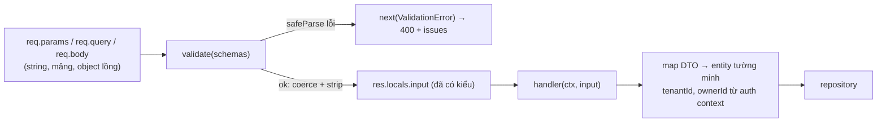
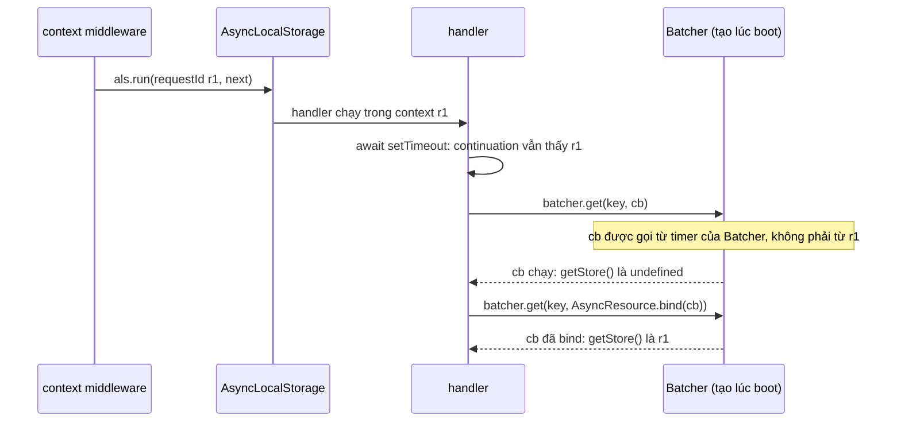

## Bối cảnh & vấn đề

Ba incident từ cùng một codebase Express, cùng một gốc rễ: **handler tin input thô**.

Thứ nhất, endpoint `PATCH /me` cho user sửa hồ sơ bằng `db.user.update({ where: { id }, data: req.body })`. Một user tò mò gửi `{"role":"admin"}` và trở thành admin. Đây là **mass assignment**: client gán được field mà nó không bao giờ được phép chạm tới. Thứ hai, một endpoint lưu preferences gộp body vào object mặc định bằng hàm deep merge tự viết. Sau một request chứa `"__proto__"`, **mọi object** trong process đột nhiên có `isAdmin === true`. Đây là **prototype pollution**. Thứ ba, log lỗi của một request thanh toán thiếu `requestId`, nên support không nối được log với ticket của khách; một số dòng log khác lại mang `requestId` **của request khác**.

Bài này dựng bốn thứ mà một Express API cần ở ranh giới: middleware **validate** bằng schema (zod) cho body, query, params; cách truyền dữ liệu đã xác thực tới handler **type-safe**; phòng chống mass assignment và prototype pollution; và **request context** qua `AsyncLocalStorage` cho requestId/tenantId, cùng những chỗ context bị mất. Ví dụ dùng Express 5.2.1, zod 4.x, Node 24.

**Interview angle:** interviewer muốn nghe "validate ở ranh giới, whitelist field, không truyền input thô xuống ORM", và với ALS thì muốn biết bạn hiểu context đi theo **async resource**, không theo request.

## Khái niệm

### Validate ở ranh giới bằng schema

**Schema validation** là mô tả hình dạng hợp lệ của input bằng code (một schema), rồi kiểm tra input với schema đó trước khi bất kỳ logic nào chạy. Thư viện phổ biến trong Node: **zod** (TypeScript-first, suy ra type từ schema), **joi**, **yup**, **ajv** (JSON Schema, cũng là thứ Fastify dùng), **class-validator** (NestJS). Với TypeScript, zod có lợi thế lớn: `z.infer<typeof Schema>` cho type tĩnh khớp chính xác với kiểm tra lúc chạy, nên không có chuyện type nói một đằng, dữ liệu thật một nẻo.

Validation tốt làm ba việc cùng lúc. **Kiểm tra** (từ chối input sai với 400 và danh sách lỗi theo field). **Ép kiểu** (coerce): `req.query.page` luôn là string, schema biến nó thành number, và biến `status` lúc là string lúc là mảng thành luôn là mảng. **Lọc** (strip): `z.object` mặc định bỏ key không khai báo, nên field lạ như `role` không bao giờ tới handler. Muốn từ chối hẳn thay vì lặng lẽ bỏ, dùng `z.strictObject` (zod 4) hoặc `.strict()`.

Trong Express 5, kết quả đã parse **không thể gán lại** vào `req.query` (getter, xem bài [Express 5 migration](/tracks/express/learn/express-5-migration)). Chỗ hợp lý để đặt là `res.locals` (ví dụ `res.locals.input`), hoặc một field riêng được type hoá.

### Truyền dữ liệu tới handler type-safe

Có ba cách phổ biến để handler biết "user hiện tại" hay "input đã validate":

- **Declaration merging** lên `Express.Request`: `declare global { namespace Express { interface Request { user?: AuthUser } } }`. Tiện và quen thuộc (passport dùng cách này), nhưng khai báo là **toàn cục**: mọi handler, kể cả route public, đều thấy `req.user?`; handler phải check `undefined` hoặc dùng `!` (và `!` là lời nói dối nếu ai đó quên gắn middleware auth).
- **`res.locals`**: nơi Express khuyến nghị cho dữ liệu sống trong một request. Có thể type qua generic thứ hai của `Response<ResBody, Locals>`. Không làm bẩn type của `Request`.
- **Wrapper tạo handler có kiểu mạnh**: một hàm `authed(handler)` chỉ dùng được sau middleware auth, bên trong nó đọc `res.locals.auth`, ném 401 nếu thiếu, và gọi `handler` với tham số `ctx: { user: AuthUser }` bắt buộc. Kết hợp với `validated(schema, handler)` để handler nhận `input: z.infer<typeof schema>`. Handler không bao giờ đụng `req.body` thô.

Một điều **tuyệt đối không**: lưu user hiện tại vào **biến module-level** trong middleware (`let currentUser; app.use((req, res, next) => { currentUser = ...; next(); })`). Node phục vụ nhiều request xen kẽ trên cùng một thread; request B ghi đè biến trong lúc request A đang `await` DB, và A đọc ra user của B. Dưới tải, đây là lỗi **rò dữ liệu giữa các user**, không chỉ là bug.

### Mass assignment

**Mass assignment** (còn gọi overposting, autobinding) xảy ra khi code chuyển nguyên object input vào thao tác ghi: `repo.update(id, req.body)`, `Object.assign(user, req.body)`, `new Model(req.body).save()`. Client chỉ cần đoán tên field (`role`, `isAdmin`, `tenantId`, `price`, `emailVerified`) là ghi được. OWASP API Security Top 10 xếp nó vào nhóm "Broken Object Property Level Authorization".

Phòng chống bằng **whitelist**, không phải blacklist: schema chỉ khai báo field client được sửa, và code map **tường minh** từ DTO (input đã validate) sang entity. Field nhạy cảm (`tenantId`, `ownerId`) luôn lấy từ context đã xác thực, không bao giờ từ body. Để phát hiện trong review: grep `req.body` xuất hiện ngoài lớp validation; trong test: gửi field lạ và khẳng định nó không được lưu.

### Prototype pollution

Trong JavaScript, object thường kế thừa từ `Object.prototype`. **Prototype pollution** là khi attacker ghi được thuộc tính vào chính `Object.prototype` (hoặc prototype khác), khiến **mọi object** trong process "có" thuộc tính đó. `JSON.parse('{"__proto__": {"isAdmin": true}}')` tự nó an toàn: nó tạo một **own property** tên `__proto__` (không đổi prototype). Nguy hiểm đến khi code **deep merge** object đó vào object khác: đọc `target["__proto__"]` trả về `Object.prototype` (qua accessor kế thừa), và merge đệ quy ghi `isAdmin` vào đó.

Nguồn input: body JSON; query string nested với parser **extended** (`qs`), dù `qs` có chặn `__proto__` ở bước parse, code merge phía sau vẫn có thể bị lợi dụng qua `constructor.prototype`; form urlencoded extended. Express 5 giảm bề mặt bằng mặc định query parser **simple** và `urlencoded` `extended: false` (không sinh object lồng). Phòng chống: schema whitelist (field lạ bị strip trước khi tới merge), không deep merge input thô, dùng thư viện merge đã vá (lodash ≥ 4.17.21 cho `merge`/`set`/`zipObjectDeep`), `Object.create(null)` hoặc `Map` cho object làm dictionary, và (nếu phù hợp) chạy Node với `--disable-proto=delete`.

### Request context với AsyncLocalStorage

**AsyncLocalStorage** (ALS, trong `node:async_hooks`) cho phép lưu một giá trị ("store") gắn với **chuỗi thao tác bất đồng bộ** bắt nguồn từ một lời gọi `als.run(store, fn)`. Mọi callback, promise continuation, timer được tạo **bên trong** `fn` (trực tiếp hoặc gián tiếp) sẽ thấy `als.getStore()` trả về store đó. Nhờ vậy logger lấy được `requestId`, tenant, trace id mà không phải truyền tham số qua mọi hàm.

Cơ chế: Node theo dõi **async resource** (promise, timer, socket request...) và lúc resource được **tạo**, nó chụp lại context hiện tại; khi callback của resource chạy, context đó được khôi phục. Hệ quả quan trọng: context đi theo **nơi tạo resource**, không theo "request" theo nghĩa nghiệp vụ. Có ba cách làm mất hoặc lẫn context:

1. **Gọi `next()` ngoài `als.run`**: middleware chạy `als.run(store, () => {})` rồi gọi `next()` bên ngoài; handler không có context. Đúng là `als.run(store, next)`.
2. **Resource tạo ngoài request**: connection pool, client batching (DataLoader), queue in-process được tạo lúc khởi động và tự chạy callback từ timer/socket của chính nó. Callback thấy context của nơi tạo resource (thường là rỗng), hoặc của request khác nếu resource được tạo trong request đó. Sửa bằng `AsyncResource.bind(fn)` (hoặc `als.bind`) để gói callback với context hiện tại trước khi đưa cho thư viện, hoặc dùng thư viện đã hỗ trợ ALS/OpenTelemetry.
3. **`als.enterWith(store)`** trong middleware: gán context cho phần còn lại của **đồng bộ execution hiện tại**, có thể rò sang request khác xử lý trên cùng tick. Tránh trong server code.

EventEmitter là trường hợp tinh tế: `emit` gọi listener **đồng bộ** trong context của nơi **gọi emit**. Emit từ trong handler thì listener thấy context của request đó. Emitter do socket, pool hay timer của thư viện emit thì listener thấy context của thư viện.

**Interview angle:** câu follow-up "dùng ALS cho tenantId để scope query có an toàn không" nhắm vào rủi ro: nếu context mất, `getStore()` trả `undefined`, và code viết ẩu có thể query **không có filter tenant**. Dùng ALS cho log/trace; tenant cho data access nên được truyền **tường minh** (tham số bắt buộc của repository), hoặc ít nhất fail-closed khi store thiếu.

## Cơ chế hoạt động



Input đi qua một cổng duy nhất. Sau cổng, dữ liệu có **kiểu thật** (number là number, mảng là mảng) và **chỉ có** field được khai báo, nên cả mass assignment lẫn prototype pollution qua field lạ bị chặn từ đầu. Field quyết định quyền sở hữu không đến từ input mà từ context xác thực.



## Ví dụ thực tế

### Middleware validate dùng zod

```js
import express from 'express';
import { z } from 'zod';
class ValidationError extends Error {
  constructor(issues) { super('Invalid request'); this.status = 400; this.code = 'VALIDATION_FAILED'; this.issues = issues; }
}
const validate = (schemas) => (req, res, next) => {
  const out = {}, issues = [];
  for (const where of ['params', 'query', 'body']) {
    if (!schemas[where]) continue;
    const r = schemas[where].safeParse(req[where] ?? {});
    if (r.success) out[where] = r.data;
    else issues.push(...r.error.issues.map((i) => ({ in: where, path: i.path.join('.'), message: i.message })));
  }
  if (issues.length) return next(new ValidationError(issues));
  res.locals.input = out; // Express 5: req.query is a getter, keep parsed input here
  next();
};
const ListOrders = {
  params: z.object({ tenantId: z.string().uuid() }),
  query: z.object({
    status: z.union([z.enum(['paid', 'shipped']), z.array(z.enum(['paid', 'shipped']))]).transform((v) => (Array.isArray(v) ? v : [v])).optional(),
    page: z.coerce.number().int().min(1).default(1),
  }),
};
const CreateOrder = { body: z.object({ sku: z.string().min(1), qty: z.number().int().positive() }) }; // unknown keys stripped
app.use(express.json({ limit: '10kb' }));
app.get('/tenants/:tenantId/orders', validate(ListOrders), (req, res) => res.json(res.locals.input));
app.post('/orders', validate(CreateOrder), (req, res) => res.json(res.locals.input.body));
app.use((err, req, res, next) => res.status(err.status ?? 500).json({ code: err.code ?? err.type ?? 'INTERNAL', issues: err.issues }));
```

```text
single status            200 {"params":{"tenantId":"6f1c1a8e-..."},"query":{"status":["paid"],"page":1}}
repeated status          200 {"params":{"tenantId":"6f1c1a8e-..."},"query":{"status":["paid","shipped"],"page":3}}
bad input                400 {"code":"VALIDATION_FAILED","issues":[{"in":"params","path":"tenantId","message":"Invalid UUID"},{"in":"query","path":"status","message":"Invalid input"},{"in":"query","path":"page","message":"Too small: expected number to be >=1"}]}
mass assignment attempt  200 {"sku":"A1","qty":2}
body too large           413 {"code":"entity.too.large"}
```

(zod 4.6.5, Express 5.2.1, output thật.) `?status=paid` và `?status=paid&status=shipped` đều ra mảng; `page` thành number. Body gửi `{"sku":"A1","qty":2,"role":"admin","price":0}` bị strip còn hai field. Body 20 KB bị `express.json({ limit })` chặn với 413 trước cả khi validate chạy.

Có nên trả nguyên danh sách issue cho client? Với API public, trả `path` và message chung là đủ; tránh để lộ tên field nội bộ không có trong contract, và không echo lại giá trị input (có thể chứa dữ liệu nhạy cảm hoặc payload XSS nếu client render).

### Handler có kiểu mạnh (TypeScript)

```ts
type AuthUser = { id: string; tenantId: string; role: "viewer" | "manager" };
type Ctx = { user: AuthUser; requestId: string };

function route<S extends z.ZodType>(schema: S, fn: (ctx: Ctx, input: z.infer<S>) => Promise<unknown>): RequestHandler {
  return async (req, res) => {
    const user = res.locals.auth as AuthUser | undefined;
    if (!user) throw new AppError("UNAUTHENTICATED", 401);         // fail-closed nếu quên middleware
    const input = schema.parse({ params: req.params, query: req.query, body: req.body ?? {} });
    const result = await fn({ user, requestId: res.locals.requestId }, input);
    res.json(result);
  };
}

const UpdateMe = z.object({ body: z.strictObject({ displayName: z.string().max(80), locale: z.enum(["en", "vi"]) }) });
router.patch("/me", route(UpdateMe, async ({ user }, { body }) =>
  users.update({ id: user.id, tenantId: user.tenantId }, { displayName: body.displayName, locale: body.locale })));
```

Handler không có cách nào đọc `req.body` thô; `strictObject` từ chối `{"role":"admin"}` với 400 thay vì lặng lẽ bỏ, và `update` nhận object được dựng tường minh.

### Prototype pollution qua deep merge

```js
function naiveMerge(target, src) {
  for (const k of Object.keys(src)) {
    if (src[k] && typeof src[k] === 'object') { target[k] ??= {}; naiveMerge(target[k], src[k]); }
    else target[k] = src[k];
  }
  return target;
}
app.use(express.json());
app.post('/prefs', (req, res) => { res.json({ saved: naiveMerge({}, req.body) }); });
app.get('/admin', (req, res) => { const user = {}; res.json({ isAdmin: user.isAdmin === true }); });
// POST /prefs body: {"theme":"dark","__proto__":{"isAdmin":true}}
```

```text
before: {"isAdmin":false}
  own keys of body: [ 'theme', '__proto__' ] | body.__proto__ === Object.prototype? true
after : {"isAdmin":true} | ({}).isAdmin = true
```

`JSON.parse` giữ `__proto__` là own key, prototype của body vẫn bình thường. `Object.keys` liệt kê nó, `target["__proto__"]` trả `Object.prototype`, và merge ghi thẳng vào đó. Từ request này trở đi, **mọi** `{}` trong process có `isAdmin === true`, cho tới khi restart. Schema whitelist chặn được từ đầu vì `__proto__` không phải field khai báo.

### AsyncLocalStorage: context có và mất

```js
const als = new AsyncLocalStorage();
const log = (msg) => console.log(`  [req=${als.getStore()?.requestId ?? '-'}] ${msg}`);
class Batcher {           // created at startup; flushes queued callbacks from its own timer
  queue = []; constructor(bind) { this.bind = bind; setInterval(() => this.flush(), 20).unref(); }
  get(key, cb) { this.queue.push(this.bind ? AsyncResource.bind(cb) : cb); }
  flush() { const q = this.queue; this.queue = []; for (const cb of q) cb('value'); }
}
const naive = new Batcher(false), bound = new Batcher(true);
const bus = new EventEmitter(); bus.on('order.created', () => log('listener on singleton emitter'));
app.use((req, res, next) => { als.run({ requestId: `r${++seq}` }, next); });
app.get('/ok', async (req, res) => {
  log('handler start');
  await new Promise((r) => setTimeout(r, 5));
  log('after await');
  bus.emit('order.created');
  await new Promise((r) => naive.get('k', () => { log('naive batcher callback'); r(); }));
  await new Promise((r) => bound.get('k', () => { log('AsyncResource.bind callback'); r(); }));
  res.send('ok');
});
wrong.use((req, res, next) => { als.run({ requestId: 'never-seen' }, () => {}); next(); });
```

```text
GET /ok
  [req=r1] handler start
  [req=r1] after await
  [req=r1] listener on singleton emitter
  [req=-] naive batcher callback
  [req=r1] AsyncResource.bind callback
GET /bad
  [req=-] handler with next() outside run
```

Context sống qua `await` và timer tạo trong request; listener của emitter singleton vẫn thấy `r1` **vì `emit` được gọi từ trong request**. Callback đi qua batcher tạo lúc boot mất context; `AsyncResource.bind` khôi phục nó. Middleware gọi `next()` ngoài `run` làm mất context cho cả request.

## Trade-offs & lựa chọn thay thế

| Thư viện validate | Ưu | Nhược | Hợp khi |
|---|---|---|---|
| zod | Type suy ra từ schema, API gọn, transform/coerce mạnh | Chậm hơn ajv ở throughput rất cao | Express + TypeScript |
| ajv (JSON Schema) | Rất nhanh (compile), chuẩn, dùng lại cho OpenAPI | Schema dài, type cần công cụ sinh | Fastify, API contract-first |
| joi | Trưởng thành, message tốt | Type TypeScript yếu | Codebase JS cũ |
| class-validator | Decorator trên DTO class | Phụ thuộc reflect-metadata, transform lỏng | NestJS |

| Cách truyền context | Ưu | Nhược |
|---|---|---|
| `res.locals` + wrapper có kiểu | Rõ ràng, test dễ, không global | Phải truyền `ctx` xuống service |
| `req.user` declaration merging | Quen thuộc, lib hỗ trợ | Type global, `user?` ở mọi nơi |
| AsyncLocalStorage | Không phải truyền qua mọi hàm, hợp cho log/trace | Mất context qua pool/batch, khó thấy; chi phí nhỏ mỗi async hop |
| Tham số tường minh | Không thể mất, compiler kiểm tra | Dài dòng |

Chọn thế nào: validate bằng zod (hoặc ajv nếu contract-first) trong một middleware/wrapper duy nhất; truyền user và input qua `ctx` tường minh tới service. Dùng ALS cho thứ "nice to have" như `requestId`, trace id, log field; với tenant scoping, tham số tường minh ở repository là lớp bảo vệ chính, ALS chỉ là lớp phụ và phải fail-closed.

## Edge cases & failure modes

- **Coerce quá tay**: `z.coerce.boolean()` biến chuỗi `"false"` thành `true` (vì chuỗi khác rỗng là truthy). Với query boolean dùng `z.enum(["true","false"]).transform(v => v === "true")` hoặc `z.stringbool()` của zod 4 (đo trên zod 4.6.5: `z.coerce.boolean().parse("false")` ra `true`, `z.stringbool().parse("false")` ra `false`).
- **Mảng vs string trong query**: attacker gửi `?email=a&email=b` để bypass kiểm tra chỉ viết cho string. Schema cần khai báo rõ string hay mảng.
- **Body rất sâu hoặc rất nhiều key**: `limit` của `express.json` giới hạn byte, không giới hạn độ sâu; JSON sâu hàng nghìn tầng làm validator đệ quy tốn CPU. Giới hạn kích thước nhỏ theo route.
- **Strip lặng lẽ che bug client**: client gửi `quantity` thay vì `qty`, schema strip `quantity` và báo `qty` thiếu; tốt. Nhưng nếu `qty` optional, request "thành công" với giá trị mặc định. Dùng `strictObject` cho endpoint ghi quan trọng.
- **ALS dưới tải**: mỗi async hop có chi phí nhỏ; hàng triệu promise mỗi giây có thể thấy vài phần trăm CPU. Đo trước khi lo.
- **Context sai thay vì mất**: pool tạo connection **lần đầu** trong request A, các callback sau của connection đó (cho request B) thấy context A. Log mang `requestId` sai tệ hơn log thiếu `requestId`.

## Pitfalls

- ❌ `repo.update(id, req.body)` → ✅ schema whitelist + map DTO → entity tường minh, `tenantId`/`ownerId` từ auth context.
- ❌ Deep merge input thô vào config/default → ✅ validate trước, merge bằng thư viện đã vá, dictionary dùng `Map`/`Object.create(null)`.
- ❌ `req.query = parsed` trên Express 5 → ✅ `res.locals.input.query = parsed`.
- ❌ Lưu user hiện tại vào biến module → ✅ `res.locals`, `ctx` tường minh, hoặc ALS.
- ❌ `als.run(store, () => {}); next()` → ✅ `als.run(store, next)`.
- ❌ Dùng `als.enterWith` trong middleware → ✅ `als.run`.
- ❌ Để repository đọc tenant từ ALS và query không filter khi thiếu → ✅ tenant là tham số bắt buộc, hoặc throw khi store thiếu.
- ❌ Trả nguyên `issues` kèm giá trị input cho client → ✅ path + message chung, log chi tiết ở server.

## Tóm tắt

- Validate body, query, params ở một cổng duy nhất bằng schema; schema vừa kiểm tra, vừa coerce (string thành number, string/mảng thành mảng), vừa strip field lạ.
- Express 5: kết quả đã parse đặt vào `res.locals`, không gán lại `req.query`.
- Type-safe: wrapper nhận schema và trả `ctx`/`input` có kiểu cho handler; declaration merging tiện nhưng global; không bao giờ dùng biến module cho dữ liệu per-request.
- Mass assignment: không truyền input thô vào thao tác ghi; whitelist và map tường minh.
- Prototype pollution: `JSON.parse` giữ `__proto__` là own key, deep merge biến nó thành ghi vào `Object.prototype`; chặn bằng whitelist, merge an toàn, Express 5 mặc định parser simple/`extended: false`.
- ALS giữ context theo async resource: mất khi `next()` ngoài `run`, khi callback đi qua resource tạo ngoài request (pool, batcher); sửa bằng `AsyncResource.bind`. Dùng ALS cho log/trace, tenant scoping cần tham số tường minh hoặc fail-closed.
