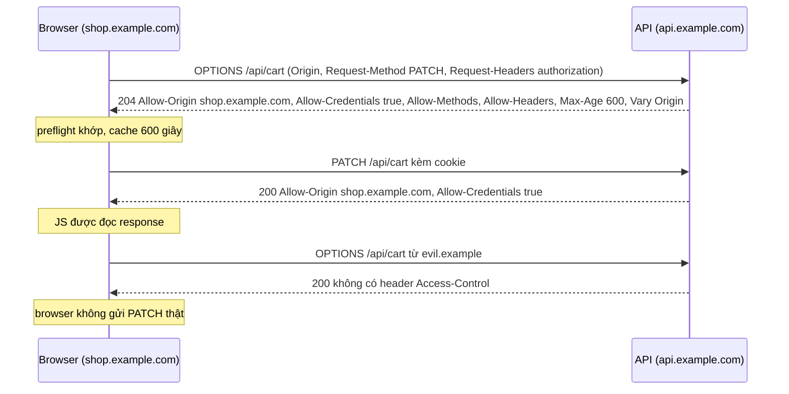
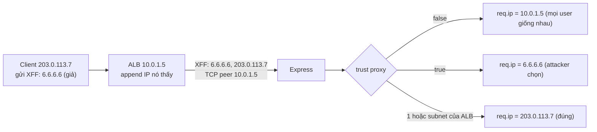

## Bối cảnh & vấn đề

Một API Express chạy sau AWS ALB. Team thêm `express-rate-limit` với giới hạn 100 request mỗi phút mỗi IP để chống brute force đăng nhập. Mười phút sau khi deploy, **toàn bộ** user nhận `429 Too Many Requests`. Nguyên nhân: không set `trust proxy`, nên `req.ip` của mọi request là IP nội bộ của ALB, và rate limiter đếm cả nghìn user như **một client**. Một kỹ sư "sửa nhanh" bằng `app.set("trust proxy", true)`. 429 biến mất. Hai tuần sau, log cho thấy một bot thử hàng trăm nghìn mật khẩu mà không bị chặn lần nào: bot chỉ việc gửi header `X-Forwarded-For` với một IP ngẫu nhiên khác nhau ở mỗi request.

Cùng codebase đó, frontend báo "CORS error" khi gọi `PATCH /api/cart` với cookie, dù server đã có `app.use(cors())`. Và một buổi pentest chỉ ra response lộ header `X-Powered-By: Express`, API chấp nhận body JSON 50 MB, và server không có timeout cho client gửi header chậm.

Bài này đi qua những thứ nên có trên mọi Express API public: security header (helmet), giới hạn kích thước và thời gian, CORS đúng cách (preflight, credentials, những lỗi cấu hình phổ biến), `trust proxy` quyết định `req.ip`/`req.protocol` ra sao, và rate limiting chạy đúng sau proxy và trên nhiều instance. Phần mạng nền tảng (same-origin policy, reverse proxy, `X-Forwarded-For`) có ở bài [CORS & same-origin](/tracks/networking/learn/cors-same-origin) và [proxy & load balancer](/tracks/networking/learn/proxy-load-balancer).

**Interview angle:** interviewer hay hỏi "bạn đặt những middleware bảo mật nào" rồi đào vào một cái. Ghi điểm khi bạn giải thích được mỗi cái chặn **loại tấn công nào**, và không chặn cái gì (CORS không phải auth, helmet không chống slowloris).

## Khái niệm

### Security header với helmet

**helmet** là một middleware gom khoảng mười lăm middleware nhỏ, mỗi cái set một response header bảo mật với giá trị mặc định hợp lý. Quan trọng nhất cho API và app:

- **`Strict-Transport-Security`** (HSTS): bảo browser chỉ dùng HTTPS với domain này trong `max-age` giây (helmet mặc định 1 năm, `includeSubDomains`). Chặn tấn công hạ cấp xuống HTTP.
- **`X-Content-Type-Options: nosniff`**: cấm browser đoán content type. Không có nó, một file upload là text nhưng chứa HTML có thể được render như trang web.
- **`Content-Security-Policy`**: danh sách nguồn script/style/ảnh được phép; lớp phòng thủ chính chống XSS cho trang HTML. Với API chỉ trả JSON, CSP ít tác dụng nhưng không hại.
- **`X-Frame-Options`** / `frame-ancestors`: chống clickjacking (trang của bạn bị nhúng trong iframe).
- **`Referrer-Policy`**, **`Cross-Origin-Opener-Policy`**, **`Cross-Origin-Resource-Policy`**: hạn chế rò URL và cô lập ngữ cảnh.
- Gỡ **`X-Powered-By`**: header Express tự thêm, chỉ giúp attacker biết stack. Không dùng helmet thì `app.disable("x-powered-by")`.

helmet không làm gì với request đến; nó không chống brute force, không chống body quá lớn, không chống slowloris. Nó chỉ bảo **browser** tự bảo vệ người dùng.

### Giới hạn kích thước và thời gian

Mọi byte một client gửi tới đều tốn bộ nhớ hoặc CPU của bạn. Các giới hạn cần đặt tường minh:

- **Body**: `express.json({ limit })` mặc định **100 kb**; đặt nhỏ hơn cho endpoint không cần (ví dụ `10kb`), lớn hơn chỉ ở route cụ thể. Vượt giới hạn, body-parser trả **413** với `err.type === "entity.too.large"` mà không đọc hết body vào RAM. Upload file đi đường riêng với giới hạn riêng (xem bài [static & uploads](/tracks/express/learn/static-files-uploads-caching)).
- **Header**: Node giới hạn tổng kích thước header (mặc định 16 KB, `--max-http-header-size`), và số header (`server.maxHeadersCount`).
- **Thời gian**: `server.headersTimeout` (mặc định 60 s) giới hạn thời gian nhận xong header; `server.requestTimeout` (mặc định 300 s) giới hạn thời gian nhận xong toàn request. Đây là hai thứ chống **slowloris** (client mở nhiều kết nối và gửi header từng byte một để giữ socket). helmet, CORS hay rate limit theo request **không** chống được slowloris, vì request chưa bao giờ "hoàn thành" để bị đếm. Tốt nhất là để reverse proxy (Nginx, ALB) chịu phần này, vì chúng buffer request trước khi chuyển cho Node.

Các giá trị mặc định của timeout trên đo trực tiếp trên Node 24; chi tiết về timeout và keep-alive ở bài [timeouts & shutdown](/tracks/express/learn/timeouts-shutdown-performance).

### CORS: cơ chế của browser

**Same-origin policy** (SOP) là quy tắc của browser: JavaScript trên origin A (scheme + host + port) không được **đọc** response từ origin B. **CORS** (Cross-Origin Resource Sharing) là cách server B nói với browser "cho phép origin A đọc response của tôi", bằng các response header `Access-Control-Allow-*`. Điểm cốt lõi: CORS là **cơ chế của browser**, do browser thực thi. Nó không phải authentication, không chặn `curl`, Postman hay server-to-server, và **không ngăn request tới server**: với request "đơn giản", server vẫn nhận và xử lý request, browser chỉ không cho JavaScript đọc kết quả.

Request **đơn giản** (simple request) là GET/HEAD/POST với chỉ các header "an toàn" và `Content-Type` thuộc `application/x-www-form-urlencoded`, `multipart/form-data`, `text/plain`. Mọi request khác, ví dụ `PATCH`, `DELETE`, header `Authorization`, hay `Content-Type: application/json`, cần **preflight**: trước request thật, browser tự gửi `OPTIONS` với `Origin`, `Access-Control-Request-Method`, `Access-Control-Request-Headers`. Server phải trả 2xx kèm `Access-Control-Allow-Origin`, `-Methods`, `-Headers` khớp; nếu không, browser **không gửi** request thật. `Access-Control-Max-Age` cho phép browser cache kết quả preflight (Chrome giới hạn tối đa 2 giờ, verify).

### CORS với credentials

Khi frontend gửi cookie (`fetch(url, { credentials: "include" })`), luật chặt hơn: server phải trả `Access-Control-Allow-Credentials: true` và `Access-Control-Allow-Origin` là **đúng origin** của request, **không được** là `*`. Browser từ chối `*` kèm credentials. Vì origin trả về thay đổi theo request, response phải có **`Vary: Origin`** để CDN hoặc cache không trả nhầm header của origin này cho origin khác.

Các lỗi cấu hình phổ biến, xếp theo mức nguy hiểm:

1. **Phản chiếu mọi `Origin` kèm credentials** (`origin: true` trong package `cors`, hoặc tự viết `res.set("Access-Control-Allow-Origin", req.get("origin"))`): bất kỳ website nào cũng đọc được dữ liệu của user đang đăng nhập. Tương đương tắt SOP cho API của bạn.
2. **Whitelist bằng regex lỏng**: `/example\.com$/` khớp `evilexample.com`; `/^https:\/\/.*\.example\.com/` khớp `https://x.example.com.evil.io` nếu thiếu `$`. Dùng `Set` các origin chính xác, hoặc parse URL và so sánh hostname.
3. **Cho phép origin `null`**: iframe sandbox và file `file://` gửi `Origin: null`; attacker tạo được origin này dễ dàng.
4. **Thiếu `Vary: Origin`** khi response được cache: CDN lưu response có `Access-Control-Allow-Origin: https://tenant-a.com` và trả cho tenant B, browser của B báo lỗi CORS.
5. **Auth chặn preflight**: middleware auth đứng trước `cors` trả 401 cho `OPTIONS` (không mang token), browser báo lỗi CORS thay vì lỗi auth.

Với API dùng cookie, CORS đúng vẫn chưa đủ: request "đơn giản" (form POST) cross-site vẫn tới server kèm cookie, nên cần `SameSite` cho cookie và/hoặc CSRF token.

### trust proxy

Khi Express đứng sau reverse proxy hoặc load balancer, **TCP peer** mà Node thấy là proxy, không phải client. Proxy thêm thông tin client vào header: `X-Forwarded-For` (danh sách IP, proxy nào cũng **append** IP nó nhận được vào cuối), `X-Forwarded-Proto` (`https` nếu client dùng TLS tới proxy), `X-Forwarded-Host`. Setting **`trust proxy`** bảo Express có tin những header này không, và tin tới đâu. Nó ảnh hưởng `req.ip`, `req.ips`, `req.protocol`, `req.secure`, `req.hostname`.

Giá trị của setting:

- **Không set** (`false`, mặc định): `req.ip` là địa chỉ TCP peer (IP của proxy), `req.protocol` là `http` kể cả khi client dùng HTTPS tới ALB. Hệ quả: rate limiter đếm mọi user là một client; redirect "lên HTTPS" lặp vô hạn; `express-session` với cookie `secure` không set cookie.
- **`true`**: tin mọi hop; `req.ip` là IP **ngoài cùng bên trái** của `X-Forwarded-For`, tức giá trị **client tự gửi**. Nếu attacker gửi `X-Forwarded-For: 6.6.6.6`, proxy append IP thật vào sau, và Express chọn `6.6.6.6`. Chỉ an toàn khi mọi hop trước app đều do bạn kiểm soát và proxy đầu tiên **ghi đè** (không append) header.
- **Số nguyên `n`**: tin đúng `n` hop gần nhất. Express bỏ `n` địa chỉ cuối của chuỗi (tính cả TCP peer) và lấy địa chỉ tiếp theo. Với một ALB phía trước, `1` là đúng: `req.ip` là IP ALB đã thấy, attacker không giả được.
- **Danh sách IP/subnet** (hoặc `"loopback"`, `"linklocal"`, `"uniquelocal"`): tin những proxy có địa chỉ thuộc danh sách. Chính xác nhất khi biết dải IP của proxy.
- **Function** `(ip, hopIndex) => boolean` cho logic tuỳ chỉnh.

Với CloudFront → ALB → app, có hai hop thêm IP: CloudFront append IP client, ALB append IP của CloudFront edge. `trust proxy` nên là `2` (verify bằng cách log `req.ips` và `X-Forwarded-For` thật trên môi trường đó), với điều kiện app **chỉ** nhận traffic từ ALB và ALB chỉ nhận từ CloudFront (security group, managed prefix list). Nếu app reachable trực tiếp, mọi cấu hình tin header đều giả mạo được.

### Rate limiting

**Rate limiting** giới hạn số request một "key" được phép trong một khoảng thời gian. Key thường là IP (cho request chưa đăng nhập), user id, API key, hoặc tenant (theo gói dịch vụ). Thuật toán (fixed window, sliding window, token bucket) được phân tích ở bài [sliding window & rate limiting](/tracks/dsa/learn/sliding-window-rate-limiting). Về vận hành với Express, ba điểm quan trọng:

- Key theo IP chỉ đúng khi `req.ip` đúng, tức `trust proxy` đúng. `express-rate-limit` bản mới có kiểm tra cấu hình (`validate`) và log cảnh báo (không throw) cho cả hai lỗi. Đo trên 8.7.0: `ERR_ERL_PERMISSIVE_TRUST_PROXY` ("The Express 'trust proxy' setting is true, which allows anyone to trivially bypass IP-based rate limiting") và `ERR_ERL_UNEXPECTED_X_FORWARDED_FOR` ("The 'X-Forwarded-For' header is set but the Express 'trust proxy' setting is false"). Đừng tắt `validate` ở production để im cảnh báo.
- Store mặc định là **bộ nhớ trong process**. Chạy 10 pod thì mỗi pod đếm riêng, giới hạn thực tế thành 10 lần. Dùng store chung (Redis: `rate-limit-redis`) cho giới hạn chính xác.
- Rate limit ở app là lớp **sau cùng**. Lớp đầu tiên nên ở edge (WAF, API Gateway, CDN) để request tấn công không chạm tới Node. App-level limit hợp cho quy tắc cần ngữ cảnh ứng dụng (theo user, theo tenant, theo endpoint đăng nhập).

## Cơ chế hoạt động



Preflight là một "câu hỏi xin phép" do **browser** tự gửi; server chỉ trả lời. Với origin không được phép, `cors` không set header, và browser chặn request thật. Nhưng chú ý: một request đơn giản (form POST) từ origin lạ vẫn tới server, chỉ là JS của trang lạ không đọc được response.



Express đọc chuỗi `X-Forwarded-For` **từ phải sang trái** (gần app nhất trước), bỏ qua những địa chỉ được tin, và dừng ở địa chỉ đầu tiên không được tin. Phần bên trái của chuỗi là do client viết, nên chỉ phần bên phải (do proxy của bạn viết) là đáng tin.

## Ví dụ thực tế

### helmet và CORS có credentials

```js
import express from 'express';
import helmet from 'helmet';
import cors from 'cors';
const allow = new Set(['https://shop.example.com']);
const app = express();
app.use(helmet());
app.use(cors({ origin: (origin, cb) => cb(null, allow.has(origin) ? origin : false), credentials: true, maxAge: 600 }));
app.use(express.json({ limit: '100kb' }));
app.patch('/api/cart', (req, res) => res.json({ ok: true }));
app.get('/plain', (req, res) => res.json({ ok: true }));
app.listen(3110);
```

```text
$ curl -si localhost:3110/plain       # helmet 8.3.0, cors 2.8.6, express 5.2.1
HTTP/1.1 200 OK
Content-Security-Policy: default-src 'self';base-uri 'self';font-src 'self' https: data:;form-action 'self';frame-ancestors 'self';img-src 'self' data:;object-src 'none';script-src 'self';script-src-attr 'none';style-src 'self' https: 'unsafe-inline';upgrade-insecure-requests
Cross-Origin-Opener-Policy: same-origin
Cross-Origin-Resource-Policy: same-origin
Origin-Agent-Cluster: ?1
Referrer-Policy: no-referrer
Strict-Transport-Security: max-age=31536000; includeSubDomains
X-Content-Type-Options: nosniff
X-DNS-Prefetch-Control: off
X-Download-Options: noopen
X-Frame-Options: SAMEORIGIN
X-Permitted-Cross-Domain-Policies: none
X-XSS-Protection: 0
Content-Type: application/json; charset=utf-8

$ curl -si -X OPTIONS localhost:3110/api/cart -H 'Origin: https://shop.example.com' \
    -H 'Access-Control-Request-Method: PATCH' -H 'Access-Control-Request-Headers: authorization,content-type'
HTTP/1.1 204 No Content
Access-Control-Allow-Origin: https://shop.example.com
Vary: Origin, Access-Control-Request-Headers
Access-Control-Allow-Credentials: true
Access-Control-Allow-Methods: GET,HEAD,PUT,PATCH,POST,DELETE
Access-Control-Allow-Headers: authorization,content-type
Access-Control-Max-Age: 600

$ curl -si -X OPTIONS localhost:3110/api/cart -H 'Origin: https://evil.example' -H 'Access-Control-Request-Method: PATCH'
HTTP/1.1 200 OK                        # không có header Access-Control-*: browser sẽ chặn

$ curl -si -X PATCH localhost:3110/api/cart -H 'Origin: https://evil.example' -H 'content-type: application/json' -d '{}'
HTTP/1.1 200 OK
{"ok":true}                            # server vẫn xử lý: CORS không phải authorization
```

Không có `X-Powered-By` (helmet gỡ). Preflight của origin được phép nhận đủ header và `Vary: Origin`. Với `evil.example`, `cors` không set header nên browser chặn; nhưng dòng cuối nhắc lại điều quan trọng nhất: gọi thẳng bằng curl, server **vẫn chạy handler**. Bảo vệ thật là auth và CSRF, không phải CORS. (Lưu ý `cors` mặc định phản chiếu `Access-Control-Request-Headers`; đặt `allowedHeaders` tường minh nếu muốn chặt hơn.)

### trust proxy và rate limit

Mô phỏng: client thật `203.0.113.7`, attacker chèn `6.6.6.6` ở đầu `X-Forwarded-For`, rate limit 3 request/phút (express-rate-limit 8.7.0):

```js
const mk = (trust) => {
  const app = express();
  if (trust !== undefined) app.set('trust proxy', trust);
  app.use(rateLimit({ windowMs: 60_000, limit: 3, standardHeaders: 'draft-8', legacyHeaders: false, validate: false }));
  app.get('/whoami', (req, res) => res.json({ ip: req.ip, ips: req.ips, protocol: req.protocol, secure: req.secure }));
  return app;
};
// headers: { 'x-forwarded-for': '6.6.6.6, 203.0.113.7', 'x-forwarded-proto': 'https' }
```

```text
trust proxy not set  -> ip=::ffff:127.0.0.1 ips=[] protocol=http
   4 more requests, four different real users: 200 200 429 429
trust proxy true     -> ip=6.6.6.6 ips=["6.6.6.6","203.0.113.7"] protocol=https
   4 more requests, same attacker, forged XFF rotated: 200 200 200 200
trust proxy 1        -> ip=203.0.113.7 ips=["203.0.113.7"] protocol=https
trust proxy loopback -> ip=203.0.113.7 ips=["203.0.113.7"] protocol=https
```

Không set: bốn user khác nhau (phân biệt bằng XFF) bị coi là một, user thứ ba đã nhận 429, và `protocol` sai. `true`: `req.ip` là giá trị attacker chọn, và đổi XFF mỗi request là thoát rate limit hoàn toàn. `1` hoặc subnet của proxy (ở đây proxy là loopback): đúng IP client, attacker không giả được. (Demo tắt `validate` để thấy hành vi thô; ở production để mặc định, thư viện sẽ cảnh báo cấu hình `true`.)

Kiểm chứng trên môi trường thật: tạm log `req.get("x-forwarded-for")`, `req.socket.remoteAddress` và `req.ip` cho vài request, so với IP public của bạn (ví dụ từ `curl ifconfig.me`). Nếu `req.ip` khớp IP của bạn và không đổi khi bạn tự thêm XFF giả, cấu hình đúng.

### Bộ middleware cho API public

```ts
const app = express();
app.set("trust proxy", Number(process.env.TRUSTED_PROXY_HOPS ?? 1));  // khớp hạ tầng thật
app.use(helmet());
app.use(cors({ origin: allowOrigin, credentials: true, allowedHeaders: ["authorization", "content-type", "idempotency-key"], maxAge: 600 }));
app.use(express.json({ limit: "32kb" }));
app.use(requestContext);
app.use("/auth/login", rateLimit({ windowMs: 15 * 60_000, limit: 10, store: redisStore("login"), keyGenerator: (req) => `${ipKeyGenerator(req.ip!)}:${String(req.body?.email ?? "").toLowerCase()}` }));
app.use("/api", authenticate, rateLimit({ windowMs: 60_000, limit: planLimit, store: redisStore("api"), keyGenerator: (req, res) => res.locals.auth.tenantId }));
app.use("/api", routes);

const server = app.listen(port);
server.headersTimeout = 20_000;      // chống slowloris (proxy vẫn là lớp chính)
server.requestTimeout = 30_000;
```

Các lựa chọn đáng nói: login giới hạn theo **IP + email** để vừa chặn một IP thử nhiều tài khoản, vừa chặn nhiều IP thử một tài khoản (`ipKeyGenerator` của express-rate-limit gom IPv6 theo subnet để attacker không xoay địa chỉ trong một /64, verify API theo version); API giới hạn theo **tenant** sau auth, với số lượng theo gói; cookie (nếu dùng) phải `httpOnly`, `secure`, `sameSite`.

## Trade-offs & lựa chọn thay thế

| Lớp bảo vệ | Chặn được | Không chặn được | Nên đặt ở |
|---|---|---|---|
| helmet | Clickjacking, MIME sniffing, hạ cấp HTTP, một phần XSS | Brute force, DoS, lỗi auth | App (hoặc proxy/CDN) |
| CORS | Website lạ đọc dữ liệu qua browser của user | curl/bot, CSRF qua form, request server-to-server | App |
| Body limit | Body khổng lồ làm tốn RAM/CPU | Nhiều request nhỏ | App + proxy |
| headers/requestTimeout | Slowloris, client treo | Tải hợp lệ lớn | Proxy trước, app sau |
| Rate limit app | Brute force theo user/tenant | DDoS băng thông | App (Redis store) |
| WAF / edge rate limit | Bot, DDoS L7, IP xấu đã biết | Logic nghiệp vụ theo user | CDN/API Gateway |

| `trust proxy` | Dùng khi | Rủi ro |
|---|---|---|
| `false` | App nhận trực tiếp từ client | Sai hết IP/protocol nếu thực ra có proxy |
| `n` (số hop) | Biết chính xác số proxy phía trước | Sai khi hạ tầng đổi (thêm CDN) mà quên cập nhật |
| subnet/`"loopback"` | Biết dải IP của proxy | Phải cập nhật khi dải đổi |
| `true` | Hầu như không bao giờ | Client giả IP bằng XFF |

Chọn thế nào: helmet, body limit, CORS whitelist chính xác và `trust proxy` đúng số hop là baseline cho mọi service. Rate limit đặt ở edge cho volume, ở app cho quy tắc nghiệp vụ với store Redis. Cấu hình `trust proxy` từ biến môi trường khớp từng môi trường (local không proxy, staging một hop, production hai hop).

## Edge cases & failure modes

- **Thêm CDN phía trước** mà giữ `trust proxy: 1`: `req.ip` giờ là IP của CDN edge; rate limit theo IP chặn nhầm cả vùng địa lý dùng chung edge. Mỗi thay đổi hạ tầng mạng phải xem lại setting này.
- **Health check và probe nội bộ** đi thẳng vào pod (không qua LB): không có XFF, `req.ip` là IP node; nếu chúng chạy qua rate limiter, có thể tự làm pod "unhealthy". Đặt health route trước rate limiter.
- **IPv6**: một user có cả dải /64; rate limit theo từng địa chỉ IPv6 bị xoay dễ dàng. Gom theo prefix.
- **Redis store sập**: rate limiter nên fail-open (cho qua, cảnh báo) hay fail-closed (chặn)? Với login, fail-closed có thể khoá mọi người; thường chọn fail-open kèm alert và giới hạn ở edge làm lưới an toàn.
- **Preflight bị cache sai**: đổi danh sách header cho phép nhưng browser còn cache preflight cũ trong `Max-Age`; lỗi CORS chỉ ở một số user.
- **CORS lỗi che lỗi thật**: server trả 500 mà error handler không đi qua `cors` (ví dụ lỗi ném trước middleware CORS), browser báo "CORS error" và dev tìm sai chỗ. Đặt `cors` sớm để cả response lỗi có header.

## Pitfalls

- ❌ `app.set("trust proxy", true)` cho nhanh → ✅ số hop hoặc subnet của proxy thật, kiểm chứng bằng log `req.ips`.
- ❌ Rate limit memory store với nhiều pod → ✅ Redis store (hoặc edge limit), vì mỗi pod đếm riêng.
- ❌ `cors({ origin: true, credentials: true })` → ✅ `Set` origin chính xác; origin trả về kèm `Vary: Origin`.
- ❌ Regex whitelist `/example\.com$/` → ✅ so khớp chính xác origin hoặc hostname đã parse.
- ❌ Auth đứng trước `cors` → ✅ `cors` trước auth để preflight và response lỗi có header CORS.
- ❌ Coi CORS là bảo vệ API → ✅ CORS chỉ ràng buộc browser; auth, CSRF, rate limit mới bảo vệ server.
- ❌ Tăng `express.json({ limit: "50mb" })` toàn cục cho một endpoint import → ✅ limit lớn chỉ ở route đó, hoặc upload trực tiếp lên storage.
- ❌ Nghĩ helmet chống DoS → ✅ timeout ở proxy/server chống slowloris, rate limit và WAF chống flood.

## Tóm tắt

- helmet set security header (HSTS, nosniff, CSP, frame, referrer) và gỡ `X-Powered-By`; nó bảo browser tự vệ, không chặn request.
- Đặt giới hạn tường minh: body (`limit`, mặc định 100 kb), header (16 KB), `headersTimeout`/`requestTimeout`; slowloris chỉ bị chặn bởi timeout, tốt nhất ở proxy.
- CORS là cơ chế của browser: preflight `OPTIONS` cho request không đơn giản; credentials cần origin chính xác (không `*`), `Allow-Credentials: true`, `Vary: Origin`. Không phải auth.
- Lỗi CORS phổ biến: phản chiếu mọi origin, regex lỏng, origin `null`, thiếu `Vary`, auth chặn preflight.
- `trust proxy` quyết định `req.ip`/`req.protocol`: không set thì mọi user là IP của LB; `true` thì client giả IP qua XFF; đúng là số hop hoặc subnet proxy.
- Rate limit cần `req.ip` đúng, store chung (Redis) khi nhiều instance, key theo IP + user/email cho login và theo tenant cho API; edge/WAF là lớp đầu.
