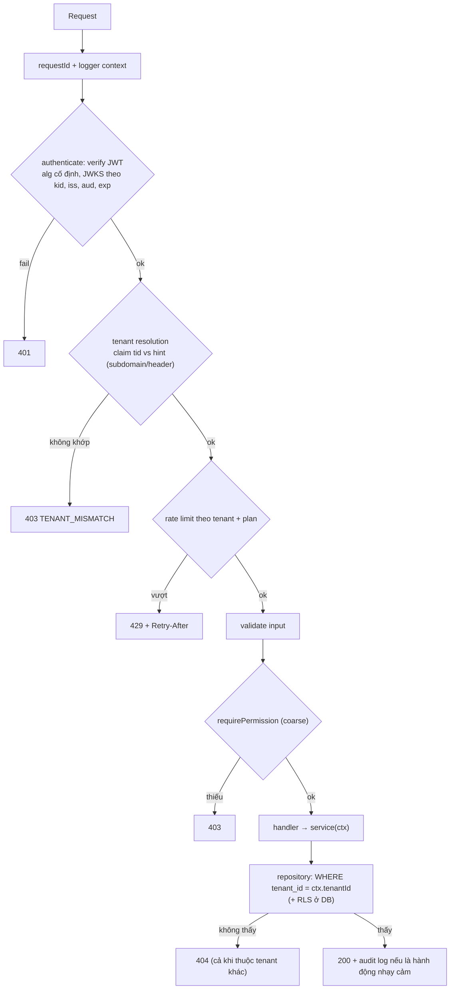
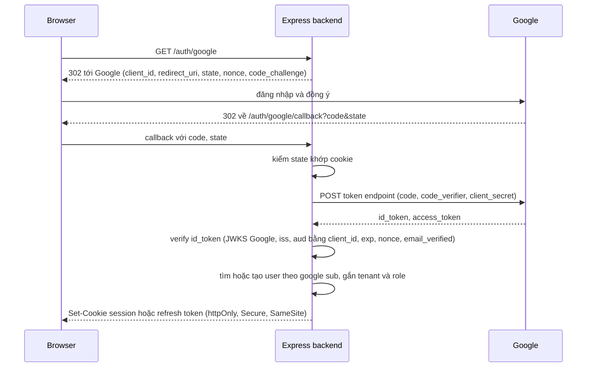

## Bối cảnh & vấn đề

Một nền tảng SaaS B2B phục vụ vài trăm doanh nghiệp (tenant) trên cùng một Express API và một database. Mỗi request mang JWT; route kiểm tra quyền bằng middleware `requirePermission("order:read")`. Một ngày, khách hàng A mở ticket: họ thấy đơn hàng có tên khách của **công ty B**. Điều tra cho thấy route `GET /api/orders/:id` kiểm tra đúng "user có quyền đọc đơn hàng", rồi chạy `SELECT * FROM orders WHERE id = $1`. User của A có quyền đọc đơn hàng, chỉ là **không phải đơn hàng đó**. Id là số tăng dần, đoán được. Đây là lỗ hổng số một trong OWASP API Security Top 10: **BOLA** (Broken Object Level Authorization).

Cùng tuần, một route admin tin header `X-Tenant-Id` do frontend gửi để chọn tenant; ai cũng sửa được header này. Và một thư viện JWT cũ cấu hình mặc định chấp nhận cả `HS256` lẫn `RS256`, mở ra tấn công **algorithm confusion**.

Bài này dựng pipeline của một request trong API multi-tenant theo thứ tự: xác thực token, xác định tenant từ nguồn tin cậy, phân quyền hai tầng (coarse-grained ở route, resource-level ở dữ liệu), rate limit theo tenant, và data access luôn có tenant. Kèm theo là luồng Google sign-in qua OIDC và cách verify ID token. Đây là chủ đề CV hay bị đào sâu, nên phần cuối gợi ý cách kể dự án thật. Các khái niệm OAuth/OIDC đầy đủ ở track [auth & identity](/tracks/auth-identity), còn mô hình dữ liệu multi-tenant ở track [multi-tenancy](/tracks/multi-tenancy).

**Interview angle:** câu thiết kế "pipeline cho multi-tenant API" đo xem bạn có tách được **authentication** (bạn là ai), **tenant resolution** (bạn thuộc đâu), **authorization** (bạn được làm gì với **tài nguyên này**) hay không. Câu CV "check quyền nằm ở đâu" gần như luôn dẫn tới BOLA.

## Khái niệm

### Access token, JWT và cách verify

**JWT** (JSON Web Token) là chuỗi `header.payload.signature` mã hoá base64url. Payload chứa **claims**: `sub` (subject, id user), `iss` (issuer, ai phát hành), `aud` (audience, token dành cho service nào), `exp` (hết hạn), `iat`, và claim tuỳ biến như `tid` (tenant id), `roles`. Chữ ký chứng minh payload do issuer tạo và không bị sửa. JWT **không mã hoá** payload; ai cầm token cũng đọc được.

Verify đúng nghĩa là kiểm tra **tất cả** những thứ sau, không chỉ chữ ký:

- **Thuật toán cố định** theo cấu hình phía server (`algorithms: ["RS256"]` hoặc `["ES256"]`). Không bao giờ để header `alg` của token quyết định. Tấn công kinh điển: server dùng public key RSA để verify; attacker ký token bằng `HS256` với chính public key đó làm secret; thư viện ngây thơ đọc `alg: HS256` và verify thành công. Và luôn từ chối `alg: none`.
- **Khoá đúng**: lấy public key theo `kid` từ **JWKS** (JSON Web Key Set) của issuer, **cache** có TTL, refetch khi gặp `kid` lạ (để hỗ trợ xoay khoá) nhưng có giới hạn tần suất.
- **`iss`** khớp issuer mong đợi, **`aud`** chứa id của service này, **`exp`**/`nbf` còn hiệu lực với **clock skew** nhỏ (30–60 giây).
- Claim nghiệp vụ tồn tại và đúng định dạng (`tid`, `sub`).

**HS256** (khoá đối xứng) nghĩa là mọi service verify đều giữ secret ký được token; hợp với một service duy nhất. **RS256/ES256** (khoá bất đối xứng) cho phép chỉ auth server ký, các service chỉ cần public key; mặc định cho kiến trúc nhiều service. ES256 có chữ ký ngắn hơn RS256.

### Access token ngắn hạn, refresh token và revoke

JWT được verify **không cần gọi DB**, nên nhanh, nhưng cũng nghĩa là **không thu hồi được** trước `exp`. Thực hành chuẩn: access token sống ngắn (5–15 phút), **refresh token** sống lâu hơn, lưu ở cookie `httpOnly; Secure; SameSite` (web) và được **xoay vòng** (rotation): mỗi lần dùng để lấy access token mới thì refresh token cũ bị vô hiệu; nếu một refresh token đã dùng rồi lại xuất hiện, đó là dấu hiệu bị đánh cắp, huỷ cả họ token (reuse detection).

Khi quyền của user thay đổi (bị gỡ role, bị khoá), có vài lựa chọn: chấp nhận độ trễ bằng thời gian sống của access token; lưu `tokenVersion`/`permVersion` của user trong cache và so khớp mỗi request (thêm một lookup Redis); hoặc đẩy danh sách `jti` bị thu hồi. Không có lựa chọn nào miễn phí; câu trả lời tốt nói rõ trade-off đã chọn.

### Đăng nhập Google: OAuth 2.0 + OIDC

"Sign in with Google" dùng **OpenID Connect** (OIDC), lớp danh tính trên **OAuth 2.0**. Luồng khuyến nghị là **Authorization Code** (kèm **PKCE** với client public như SPA/mobile):

1. Backend (hoặc SPA) chuyển user tới Google với `client_id`, `redirect_uri`, `scope=openid email profile`, `state` (chống CSRF của luồng login), `nonce` (chống replay ID token), và `code_challenge` (PKCE).
2. Google xác thực user, redirect về `redirect_uri` kèm `code`.
3. Backend đổi `code` lấy token tại token endpoint (kèm `client_secret` hoặc `code_verifier`), nhận **ID token** (JWT về danh tính) và access token của Google.
4. Backend **verify ID token**: chữ ký qua JWKS của Google, `iss` là `https://accounts.google.com` hoặc `accounts.google.com`, **`aud` bằng client id của bạn**, `exp`, và `nonce` khớp. Kiểm tra `email_verified` trước khi tin email.
5. Map danh tính Google (`sub` là id ổn định, không dùng email làm khoá chính) sang user nội bộ, rồi phát hành **session hoặc token của hệ thống bạn**. Không dùng access token của Google làm token cho API của bạn.

Vì sao `aud` quan trọng: ID token của Google do Google ký cho **mọi** app. Nếu không kiểm `aud`, một app độc hại mà user từng đăng nhập bằng Google có thể lấy ID token của user và gửi tới API của bạn; chữ ký hợp lệ, và bạn cho attacker đăng nhập như user đó. Đây là tấn công **token substitution** (dùng token cấp cho client khác).

### Tenant resolution: nguồn tin cậy

**Tenant resolution** là bước xác định request thuộc tenant nào. Nguồn có thể là subdomain (`acme.app.com`), header, path (`/tenants/:id`), hoặc **claim trong token**. Chỉ token (hoặc session) là **nguồn tin cậy**, vì nó do auth server ký sau khi xác thực. Subdomain, header, path là **gợi ý** do client kiểm soát: chúng hữu ích để chọn tenant khi user thuộc nhiều tenant, nhưng phải được **đối chiếu** với danh sách tenant mà token cho phép, và từ chối nếu không khớp. `tenantId` trong body hay query thì không bao giờ được dùng để quyết định phạm vi dữ liệu.

Sau khi xác định, tenant được đặt vào context của request (`res.locals.auth.tenantId`, và ALS cho log, xem bài [request context](/tracks/express/learn/validation-request-context)), rồi truyền **tường minh** xuống service và repository.

### RBAC hai tầng

**RBAC** (Role-Based Access Control): user có role (có thể theo tenant: user X là `manager` ở tenant A nhưng `viewer` ở tenant B), role ánh xạ tới tập **permission** (`order:read`, `order:write`). Kiểm tra quyền có hai tầng khác bản chất:

- **Coarse-grained, ở middleware route**: "user có permission `order:write` không?". Không cần biết tài nguyên cụ thể, nên đặt được ở middleware `requirePermission`.
- **Resource-level, ở service/query**: "order #123 có thuộc tenant của user không, user có phải owner/được giao không?". Cần tải tài nguyên, nên middleware route không làm được một cách tự nhiên. Cách an toàn nhất là đưa điều kiện vào **chính câu query** (`WHERE id = $1 AND tenant_id = $2`), để không tồn tại đường code nào đọc được tài nguyên của tenant khác. Row-Level Security của Postgres là lớp phòng thủ thêm ở DB.

Trả **404** (không phải 403) khi tài nguyên thuộc tenant khác, để không xác nhận sự tồn tại của nó. Permission được load theo user + tenant, cache ngắn hạn (in-memory vài giây hoặc Redis), và invalidate khi đổi role (tăng `permVersion`).

### Rate limit, quota và noisy neighbor

Trong hệ multi-tenant, một tenant lớn chạy import hay một tenant bị tấn công có thể làm chậm tất cả: **noisy neighbor**. Các lớp giảm thiểu: rate limit theo tenant với hạn mức theo gói (key là `tenantId`, store Redis, xem bài [security middleware](/tracks/express/learn/security-cors-proxy)); timeout và giới hạn kích thước theo route; **bulkhead** (tách pool connection, worker, hoặc cả deployment) cho tenant lớn; và quota cho tác vụ nặng (export, report) chạy qua job queue thay vì request đồng bộ.

## Cơ chế hoạt động



Thứ tự có lý do. Xác thực trước mọi thứ tốn tài nguyên. Tenant được chốt ngay sau khi biết danh tính, vì mọi bước sau (rate limit theo tenant, permission theo tenant, query) cần nó. Rate limit đứng trước validate và DB để request quá hạn mức tốn ít CPU nhất. Permission coarse ở route, còn quyền trên tài nguyên cụ thể nằm trong query, là tầng cuối không thể bỏ qua.



## Ví dụ thực tế

### Pipeline chạy được với jose

Dùng `jose` 6.2.12, khoá ES256 tạo tại chỗ (thay cho JWKS từ auth server), Express 5.2.1:

```js
const { publicKey, privateKey } = await generateKeyPair('ES256');
const jwks = createLocalJWKSet({ keys: [{ ...(await exportJWK(publicKey)), kid: 'k1', alg: 'ES256' }] });
const ISS = 'https://auth.example.com', AUD = 'orders-api';
const ROLE_PERMS = { viewer: ['order:read'], manager: ['order:read', 'order:write'] };
const db = { orders: [{ id: 'o1', tenantId: 't-acme', total: 120 }, { id: 'o2', tenantId: 't-globex', total: 999 }] };

const authenticate = async (req, res, next) => {
  const token = req.get('authorization')?.replace(/^Bearer /, '');
  if (!token) throw new HttpError(401, 'MISSING_TOKEN');
  try {
    const { payload } = await jwtVerify(token, jwks, { issuer: ISS, audience: AUD, algorithms: ['ES256'], clockTolerance: 30 });
    res.locals.auth = { userId: payload.sub, tenantId: payload.tid, role: payload.role };
  } catch (e) { throw new HttpError(401, `INVALID_TOKEN:${e.code}`); } // demo only: production logs e.code, returns INVALID_TOKEN
  next();
};
const tenantContext = (req, res, next) => {
  const hinted = req.get('x-tenant-id');                         // from subdomain / header: only a hint
  if (hinted && hinted !== res.locals.auth.tenantId) throw new HttpError(403, 'TENANT_MISMATCH');
  ctx.run({ tenantId: res.locals.auth.tenantId }, next);
};
const requirePermission = (perm) => (req, res, next) => {
  if (!(ROLE_PERMS[res.locals.auth.role] ?? []).includes(perm)) throw new HttpError(403, 'FORBIDDEN');
  next();
};
const ordersRepo = { findById: (tenantId, id) => db.orders.find((o) => o.id === id && o.tenantId === tenantId) }; // tenant is a required arg
app.use('/api', authenticate, tenantContext);
app.get('/api/orders/:id', requirePermission('order:read'), (req, res) => {
  const order = ordersRepo.findById(res.locals.auth.tenantId, req.params.id);
  if (!order) throw new HttpError(404, 'ORDER_NOT_FOUND'); // other tenant's order looks like "not found"
  res.json(order);
});
app.post('/api/orders', requirePermission('order:write'), (req, res) => res.status(201).json({ created: true }));
```

```text
no token                    401 {"code":"MISSING_TOKEN"}
viewer reads own order      200 {"id":"o1","tenantId":"t-acme","total":120}
viewer reads other tenant   404 {"code":"ORDER_NOT_FOUND"}
viewer + forged tenant hdr  403 {"code":"TENANT_MISMATCH"}
viewer creates order        403 {"code":"FORBIDDEN"}
wrong audience              401 {"code":"INVALID_TOKEN:ERR_JWT_CLAIM_VALIDATION_FAILED"}
expired token               401 {"code":"INVALID_TOKEN:ERR_JWT_EXPIRED"}
HS256 forged token          401 {"code":"INVALID_TOKEN:ERR_JOSE_ALG_NOT_ALLOWED"}
```

Mỗi dòng ứng với một lớp của pipeline. Đơn `o2` của tenant khác trả 404 vì repository **không thể** tìm thấy nó khi thiếu tenant đúng; header `X-Tenant-Id` giả bị so với claim và từ chối; token cấp cho `billing-api` (sai `aud`), token hết hạn, và token giả ký `HS256` đều bị từ chối trước khi chạm business logic. Trong production, `createRemoteJWKSet(new URL(jwksUri))` của `jose` lo cache JWKS và refetch khi gặp `kid` lạ, và response nên chỉ trả `INVALID_TOKEN` (chi tiết để log).

### Test chứng minh cô lập tenant

```ts
test("user of tenant A cannot read, update or list tenant B data", async () => {
  const tokenA = await signToken({ sub: "u1", tid: "t-acme", role: "manager" });
  const orderOfB = await seed.order({ tenantId: "t-globex" });
  const auth = { Authorization: `Bearer ${tokenA}` };
  expect((await request(app).get(`/api/orders/${orderOfB.id}`).set(auth)).status).toBe(404);
  expect((await request(app).patch(`/api/orders/${orderOfB.id}`).set(auth).send({ note: "x" })).status).toBe(404);
  const list = await request(app).get("/api/orders?limit=100").set(auth);
  expect(list.body.items.every((o: { tenantId: string }) => o.tenantId === "t-acme")).toBe(true);
  expect(await db.order.findUnique({ where: { id: orderOfB.id } })).toMatchObject({ note: null }); // side effect didn't happen
});
```

Một test như vậy cho **mỗi** resource là cách rẻ nhất để BOLA không quay lại. Có thể sinh tự động từ danh sách route: với mỗi route có `:id`, tạo tài nguyên ở tenant B và gọi bằng token tenant A.

### Kể dự án thật (CV)

Với câu "bạn làm RBAC/permission thế nào" hoặc "flow Google sign-in của bạn", khung trả lời mạnh:

- **Mô hình**: role → permission là tĩnh trong code hay cấu hình theo tenant trong DB; role gán theo tenant hay toàn cục; ai quản trị role.
- **Nơi check**: `requirePermission` ở route cho coarse; điều kiện tenant/owner ở repository; RLS nếu có. Nêu một lỗ hổng từng gặp hoặc suýt gặp (ví dụ endpoint export quên filter tenant) và cách bạn chặn tái diễn (test tự động theo route, lint rule cấm query không có tenant).
- **Hiệu năng**: permission cache ở đâu, TTL bao lâu, invalidate khi đổi role bằng cách nào; số liệu thật nếu có.
- **Token**: thuật toán, thời hạn access/refresh, nơi lưu refresh token, xử lý revoke khi quyền bị gỡ giữa chừng (15 phút còn lại của access token thì sao).
- **Google**: dùng Authorization Code + PKCE hay Google Identity Services (ID token trực tiếp ở client, backend verify); verify `aud`, `nonce`; map `sub` sang user nội bộ; xử lý trùng email giữa đăng nhập mật khẩu và Google.

Thay các chi tiết trên bằng chi tiết thật của bạn; interviewer sẽ đào vào con số và quyết định, không vào định nghĩa.

## Trade-offs & lựa chọn thay thế

| Quyết định | Lựa chọn A | Lựa chọn B | Chọn khi |
|---|---|---|---|
| Ký token | HS256: đơn giản, một secret | RS256/ES256: chỉ auth server ký, service chỉ verify | B khi có hơn một service verify |
| Session vs JWT | Session server-side: revoke tức thì, cần store | JWT: stateless, revoke khó | Web app một domain thường ổn với session; API nhiều service dùng JWT ngắn hạn |
| Quyền trong token | Nhúng role/permission vào claim: không lookup | Chỉ `sub`+`tid`, load permission mỗi request (cache) | Nhúng khi quyền ít đổi và token ngắn hạn |
| Tenant scoping | Tham số repository tường minh | Postgres RLS với `SET app.tenant_id` | Cả hai: tham số là tầng chính, RLS là lưới an toàn |
| Cô lập tenant lớn | Chung hạ tầng + quota | Bulkhead: pool/deployment riêng | Riêng khi SLA hoặc tải của tenant đó khác biệt |

Không có mô hình nào đúng cho mọi hệ thống. Nguyên tắc chọn: nguồn sự thật cho danh tính và tenant phải là thứ đã ký; kiểm tra quyền trên tài nguyên phải nằm ở nơi không thể bị bỏ qua (query, DB); và mọi lựa chọn "nhanh hơn" (nhúng quyền vào token, cache permission) phải có câu trả lời rõ cho "quyền bị gỡ thì bao lâu mới có hiệu lực".

## Edge cases & failure modes

- **Xoay khoá ký**: auth server đổi khoá, token mới có `kid` lạ; service chỉ fetch JWKS lúc khởi động sẽ từ chối mọi token mới. Cần refetch khi gặp `kid` lạ, có rate limit để attacker không làm service spam JWKS endpoint.
- **JWKS endpoint sập**: cache JWKS cũ đủ lâu (hàng giờ) để service vẫn verify được token ký bằng khoá đã biết.
- **Clock skew**: pod có đồng hồ lệch vài phút từ chối token "chưa hiệu lực"; `clockTolerance` nhỏ và NTP trên node.
- **User thuộc nhiều tenant**: token chỉ nên mang **một** tenant đang hoạt động (chọn khi login hoặc đổi qua endpoint riêng phát token mới), không phải danh sách để client chọn qua header.
- **Impersonation của support**: cần token riêng có claim `act` (actor) ghi rõ ai đang đóng vai ai, thời hạn ngắn, phạm vi hạn chế, và audit log mọi hành động; không chia sẻ mật khẩu hay tạo token giả danh user.
- **Background job và consumer** không đi qua pipeline HTTP: chúng phải tự thiết lập tenant context từ message (và message phải mang tenant đáng tin), nếu không một job có thể chạy không filter tenant.
- **Cache key thiếu tenant**: cache `order:123` thay vì `t-acme:order:123` là BOLA ở tầng cache (xem bài [static, uploads & caching](/tracks/express/learn/static-files-uploads-caching)).

## Pitfalls

- ❌ `jwt.verify(token, key)` không chỉ định thuật toán → ✅ `algorithms: ["ES256"]` cố định, kiểm `iss`, `aud`, `exp`.
- ❌ Tin `X-Tenant-Id`, subdomain hoặc `tenantId` trong body → ✅ tenant từ claim đã ký; hint chỉ để đối chiếu.
- ❌ `requirePermission` rồi `SELECT ... WHERE id = $1` → ✅ `WHERE id = $1 AND tenant_id = $2` (và owner nếu cần), trả 404 khi không thấy.
- ❌ Bỏ qua `aud` của Google ID token → ✅ `aud` phải là client id của bạn, kèm `nonce` và `email_verified`.
- ❌ Dùng email làm khoá liên kết tài khoản Google → ✅ dùng `sub`; email có thể đổi hoặc bị tái sử dụng.
- ❌ Access token sống 24 giờ, không có cách revoke → ✅ 5–15 phút + refresh token rotation + `permVersion` nếu cần thu hồi nhanh.
- ❌ Lưu refresh token trong `localStorage` → ✅ cookie `httpOnly; Secure; SameSite`, kèm chống CSRF cho endpoint refresh.
- ❌ Chỉ test "user có quyền thì 200" → ✅ test chéo tenant cho mọi route có id, kiểm cả side effect.

## Tóm tắt

- Pipeline: requestId → authenticate → tenant resolution → rate limit theo tenant → validate → permission coarse → handler → repository có tenant.
- Verify JWT: thuật toán cố định phía server, khoá từ JWKS theo `kid` có cache, `iss`, `aud`, `exp` với clock skew nhỏ. Access token ngắn, refresh token rotation, có chiến lược revoke rõ ràng.
- Google sign-in: Authorization Code + PKCE, `state` và `nonce`, verify ID token với `aud` bằng client id (chống token substitution), map theo `sub`, phát hành token của chính hệ thống.
- Tenant lấy từ claim đã ký; subdomain/header chỉ là gợi ý phải đối chiếu.
- RBAC hai tầng: permission ở middleware route; quyền trên tài nguyên nằm trong query (và RLS), trả 404 cho tài nguyên của tenant khác. BOLA là lỗ hổng API số một.
- Noisy neighbor: rate limit/quota theo tenant, timeout, bulkhead, job queue cho tác vụ nặng.
- Chứng minh cô lập bằng test chéo tenant cho mọi route có id.
