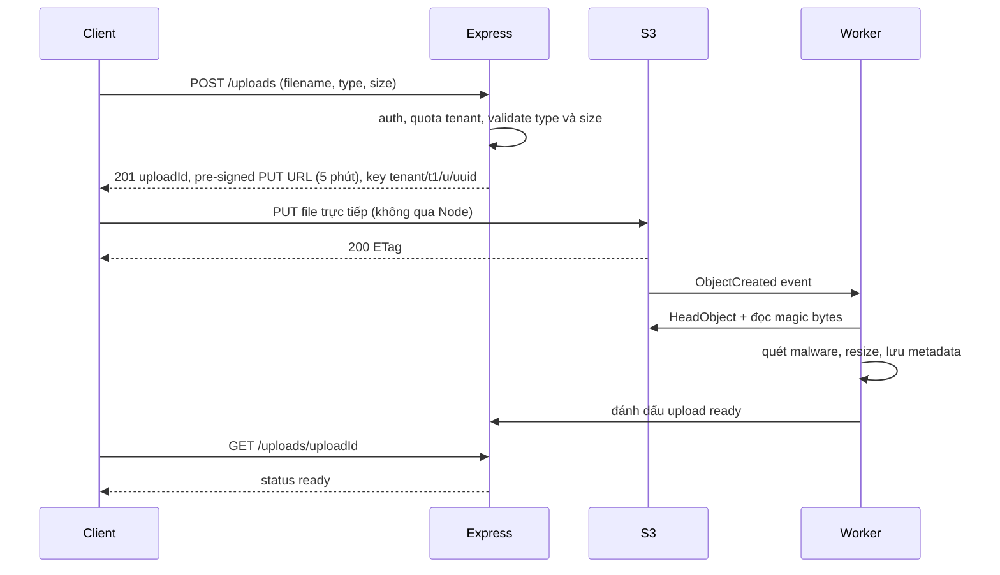
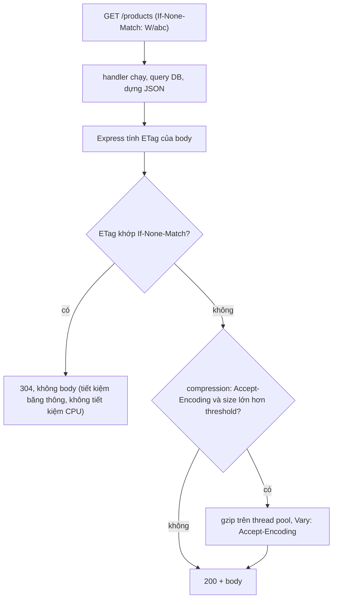

## Bối cảnh & vấn đề

Một sàn thương mại cho phép seller upload ảnh sản phẩm hàng loạt qua endpoint Express dùng `multer` với `memoryStorage()`. Container giới hạn 512 MB, heap Node được đặt `--max-old-space-size=384`. Mỗi buổi sáng khi seller lớn upload catalogue, pod bị Kubernetes giết với lý do `OOMKilled`, dù dashboard heap chỉ ở mức 60 MB. Cùng thời gian đó, một endpoint tải hoá đơn viết `res.sendFile(path.join(dir, req.query.name))` bị pentester đọc được `../../app/.env`. Và khách hàng của tenant B thấy **giá của tenant A** vì CDN phía trước API cache response `/products` mà không phân biệt tenant.

Ba sự cố là ba mặt của cùng một chủ đề: **byte đi qua Express**. File tĩnh, file tải xuống, file tải lên, và response có thể cache đều là những chỗ mà Node, vốn mạnh ở I/O bất đồng bộ, dễ bị dùng sai: giữ quá nhiều dữ liệu trong RAM, tin đường dẫn do client gửi, hay cache nhầm dữ liệu. Bài này đi qua `express.static` và `res.sendFile` an toàn, upload bằng stream và pre-signed URL, ETag và `Cache-Control`, `compression`, và thiết kế cache Redis cho API nóng. Nền về CDN và cache HTTP ở bài [CDN & caching](/tracks/networking/learn/cdn-caching); caching chuyên sâu ở track [caching](/tracks/caching).

**Interview angle:** câu OOMKilled là câu scenario yêu thích: interviewer muốn nghe "Buffer nằm ngoài V8 heap nên `--max-old-space-size` không cứu được", và giải pháp kiến trúc (pre-signed URL) chứ không chỉ "tăng RAM".

## Khái niệm

### express.static

`express.static(root, options)` (package `serve-static`) là middleware phục vụ file từ một thư mục. Nó map `req.path` vào file dưới `root`, chặn `..` thoát khỏi root, tự set `Content-Type` theo đuôi file, `ETag` và `Last-Modified`, hỗ trợ `Range` (tải tiếp, video seek) và conditional request (304). Các option quan trọng:

- **`maxAge`** và **`immutable`**: với asset có hash trong tên (`app.3f9a1c.css`), đặt `maxAge: "1y", immutable: true` để browser không bao giờ hỏi lại; khi nội dung đổi, tên file đổi. Với `index.html` (không có hash), đặt `no-cache` để browser luôn revalidate.
- **`dotfiles`**: `"ignore"` (404 như không tồn tại), `"deny"` (403), `"allow"`. Ở Express 4, mặc định chỉ bỏ qua **file** bắt đầu bằng dấu chấm (`.env`), nhưng vẫn serve file **bên trong thư mục** dấu chấm (`.git/config`, `.well-known/...`). Express 5 bỏ qua cả hai. Đó là lý do nâng cấp làm hỏng `/.well-known/acme-challenge` và cũng là lý do Express 4 serve nhầm project root từng lộ `.git`.
- **`index: false`** nếu không muốn tự trả `index.html` cho thư mục; **`fallthrough`** (mặc định `true`) để request không tìm thấy file đi tiếp tới route sau.

Nguyên tắc an toàn: chỉ serve một **thư mục chuyên dụng** (`public/`, output build), không bao giờ project root. Nguyên tắc hiệu năng: ở production, file tĩnh nên do **CDN/object storage** (S3 + CloudFront) hoặc Nginx phục vụ; mỗi byte Node gửi là thời gian event loop và băng thông của pod, trong khi CDN làm việc đó gần user hơn và rẻ hơn.

### res.sendFile, download và path traversal

**Path traversal** là khi input của client điều khiển đường dẫn file: `name=../../app/.env`. `res.sendFile(path, { root })` có bảo vệ tích hợp: khi dùng option `root`, `path` được coi là tương đối với root, và mọi đường dẫn cố thoát ra ngoài (kể cả `..%2F` đã decode) bị từ chối với **403**. Không có `root`, `sendFile` bắt buộc path tuyệt đối và **không** kiểm tra gì: `path.join(dir, userInput)` đi thẳng ra ngoài `dir`.

Nhưng chặn `..` chỉ là lớp thấp. Thiết kế đúng là **không bao giờ nhận tên file từ client**: client gửi id tài nguyên (`/invoices/:id/pdf`), server kiểm tra quyền (tài nguyên thuộc tenant/user này), rồi tra ra đường dẫn hoặc storage key đã lưu trong DB. Thêm `Content-Disposition: attachment; filename*=UTF-8''...` để browser tải xuống thay vì render, `Content-Type` đúng, và `X-Content-Type-Options: nosniff`.

File do user upload tuyệt đối không nên serve từ **cùng origin** với app: một file SVG hoặc HTML chứa script, nếu được render trên `app.example.com`, chạy JavaScript với cookie và quyền của app, tức **stored XSS**. Serve từ domain riêng (`usercontent.example-cdn.com`), ép `attachment`, hoặc chuyển đổi/sanitize SVG.

Với file lớn, đừng để Node proxy byte: trả **pre-signed GET URL** của S3 (hết hạn sau vài phút) hoặc redirect tới CDN có signed cookie. Node chỉ kiểm tra quyền và ký URL.

### Upload: memory, disk, stream, pre-signed

`multer` parse `multipart/form-data`. Hai storage có sẵn:

- **`memoryStorage()`**: toàn bộ file thành một `Buffer` trong `req.file.buffer`. Tiện cho file nhỏ cần xử lý ngay, nhưng bộ nhớ dùng = kích thước file × số upload đồng thời, cộng thêm bản sao khi bạn resize hay upload tiếp.
- **`diskStorage()`**: stream ra file tạm, RAM gần như không đổi; nhưng cần dọn file và disk của pod có giới hạn (ephemeral storage cũng bị evict).

Điểm mấu chốt về bộ nhớ: **`Buffer` nằm ngoài V8 heap**. `process.memoryUsage()` báo nó ở `arrayBuffers`/`external`, không ở `heapUsed`. Flag `--max-old-space-size` chỉ giới hạn heap, nên nó **không** ngăn process vượt memory limit của container. Kernel (cgroup) thấy RSS vượt limit và giết process: `OOMKilled`, exit code 137, không có stack trace, không có log "heap out of memory". Dashboard chỉ theo dõi heap sẽ không bao giờ thấy.

Giải pháp theo mức độ:

1. **Luôn đặt `limits`**: `fileSize`, `files`, `fields`, `fieldSize`. Vượt giới hạn, multer dừng đọc và báo `LIMIT_FILE_SIZE` (map thành 413).
2. **Stream thẳng tới đích**: dùng storage engine stream lên S3 (multipart upload của `@aws-sdk/lib-storage`) hoặc `busboy` trực tiếp, để mỗi upload chỉ giữ vài MB buffer.
3. **Pre-signed upload** (tốt nhất cho file lớn): API cấp một **pre-signed PUT URL** (hoặc POST policy) cho key đã định sẵn (`tenant/{tid}/uploads/{uuid}`), với `Content-Type` và giới hạn kích thước (POST policy có `content-length-range`); client upload **thẳng lên S3**; S3 event (hoặc client gọi `complete`) báo API, API kiểm tra object (`HeadObject`: size, type), quét malware, xử lý ảnh bằng job async, rồi mới đánh dấu "sẵn sàng". Node không chạm vào byte của file.
4. **Giới hạn concurrency** upload mỗi pod, và validate **magic bytes** thay vì tin `Content-Type` hay đuôi file do client khai.

### ETag, 304 và Cache-Control

**ETag** là "phiên bản" của một response. Express tự tính **weak ETag** (`W/"<size>-<hash>"`) cho `res.send`/`res.json` (điều khiển bằng `app.set("etag", ...)`). Client lưu ETag, lần sau gửi `If-None-Match`; nếu ETag khớp, Express trả **304 Not Modified** không có body. Tiết kiệm **băng thông**, nhưng lưu ý: server **vẫn chạy handler và dựng toàn bộ response** để tính ETag. Nếu cần tiết kiệm CPU/DB, phải tự kiểm tra version (ví dụ `updated_at`) trước khi query nặng.

**`Cache-Control`** quyết định ai được cache và bao lâu, và đây là header phải set **tường minh** theo loại dữ liệu:

- Dữ liệu của user hoặc tenant: `private, no-store` (hoặc `private, no-cache` nếu muốn browser revalidate bằng ETag). `private` cấm CDN/proxy dùng chung lưu lại.
- Dữ liệu công khai giống nhau cho mọi người: `public, max-age=60, stale-while-revalidate=30`.
- Response thay đổi theo header (ngôn ngữ, origin CORS, tenant qua header): phải có **`Vary`** tương ứng, nếu không cache dùng chung trả nhầm biến thể.

Sự cố "tenant B thấy giá của tenant A" xảy ra khi response theo tenant không có `private` (hoặc có `public`, `s-maxage`) và tenant được xác định bằng header/cookie mà CDN không đưa vào cache key.

### compression

Middleware `compression` nén response bằng gzip/deflate/brotli theo `Accept-Encoding`, và thêm `Vary: Accept-Encoding`. zlib của Node chạy nén trên **thread pool** của libuv, nên không chặn event loop hoàn toàn, nhưng vẫn tiêu **CPU của pod** và chiếm thread pool (vốn chỉ 4 thread mặc định, dùng chung với `fs`, `crypto`, `dns.lookup`). Ở traffic cao, nén ở **reverse proxy hoặc CDN** (Nginx, CloudFront, ALB không nén, verify) rẻ hơn và cache được bản nén.

Không dùng hoặc cẩn thận với `compression` khi: response là stream realtime (SSE) cần gửi ngay, vì nén buffer dữ liệu (phải gọi `res.flush()`); đã nén sẵn (ảnh, video, zip); rất nhỏ (dưới `threshold`, mặc định 1 KB). Và về bảo mật, nén một response HTTPS chứa cả **secret** (CSRF token) lẫn **input do attacker kiểm soát** mở ra lớp tấn công kiểu **BREACH**, vì độ dài bản nén rò rỉ thông tin về secret.

### Redis cache: middleware hay service layer

Hai vị trí đặt cache cho API nóng:

- **Middleware cache theo URL**: key là `req.originalUrl`, lưu nguyên response. Làm nhanh, nhưng dễ sai: quên đưa tenant/user/permission vào key (BOLA ở tầng cache), cache cả response lỗi, bỏ qua `Vary`, và không biết khi nào dữ liệu đổi.
- **Service layer, cache-aside**: service đọc cache theo key có nghĩa nghiệp vụ (`t:{tenant}:product:{id}:v{version}`), miss thì đọc DB và ghi cache với TTL. Invalidation gắn với nơi ghi dữ liệu: xoá hoặc tăng version **sau khi transaction commit** (hoặc qua event/outbox). Thêm TTL có jitter và chống **stampede** (lock, request coalescing, stale-while-revalidate) cho key nóng.

Service layer thắng về độ đúng; middleware chỉ hợp cho endpoint công khai, không phụ thuộc user, chấp nhận dữ liệu cũ trong TTL. Không cache dữ liệu nhạy cảm theo user (thông tin thanh toán), và cẩn thận với dữ liệu có hiệu lực theo thời gian (giá khuyến mãi bắt đầu lúc 0h) nếu invalidation không bám theo thời điểm đó.

## Cơ chế hoạt động



Node chỉ làm hai việc nhỏ: cấp quyền upload (ký URL cho một key cụ thể, trong phạm vi tenant) và nhận kết quả. Byte của file đi thẳng từ client tới S3, nên số upload đồng thời không còn ảnh hưởng RAM của pod. Việc nặng (resize, quét) chạy ở worker, có hàng đợi và retry riêng. Phía API phải xác minh object thật sau khi upload (size, type, key thuộc tenant), vì client có thể upload thứ khác với thứ đã khai.



## Ví dụ thực tế

### Static và sendFile: Express 4 so với 5

```js
app.use('/static', express.static(path.join(__dirname, 'pub'), { maxAge: '1y', immutable: true, index: false }));
app.get('/dl/:name', (req, res, next) => res.sendFile(req.params.name, { root: path.join(__dirname, 'data/invoices') }, (err) => err && next(err)));
app.get('/dl-unsafe', (req, res) => res.sendFile(path.join(__dirname, 'data/invoices', req.query.name)));
// pub/: assets/app.3f9a1c.css, .env, .well-known/token
```

```text
express 4.22.3
  /static/assets/app.3f9a1c.css    200 "body{}" | public, max-age=31536000, immutable
  /static/.env                     404
  /static/.well-known/token        200 "acme"
  /dl/inv-7.pdf                    200 "INV-7 PDF"
  /dl/..%2F..%2Fpub%2F.env         403
express 5.2.1
  /static/assets/app.3f9a1c.css    200 "body{}" | public, max-age=31536000, immutable
  /static/.env                     404
  /static/.well-known/token        404
  /dl/inv-7.pdf                    200 "INV-7 PDF"
  /dl/..%2F..%2Fpub%2F.env         403
  /dl-unsafe?name=../../static.cjs 200 "const path = require('node:pa...
  /dl/..%2F..%2Fstatic.cjs         403
```

Cả hai version đều giấu `.env`, nhưng Express 4 serve file trong thư mục `.well-known` (và tương tự `.git/`). `sendFile` với `root` trả 403 cho mọi cố gắng thoát root; bản `path.join` không có `root` trả luôn mã nguồn của server.

### Upload vào memory: đo RSS thật

Server riêng (Express 5.2.1, multer 2.4.0), 10 client `curl` upload đồng thời mỗi client một file 20 MB; handler giữ buffer 5 giây như khi đang chờ upload tiếp lên S3 hay resize:

```js
const upload = mode === 'memory' ? multer({ storage: multer.memoryStorage() })
  : multer({ storage: multer.diskStorage({ destination: os.tmpdir() }), limits: { fileSize: 25 * 1024 * 1024, files: 1 } });
app.get('/mem', (req, res) => { const m = process.memoryUsage(); res.send(`rss=${mb(m.rss)} heapUsed=${mb(m.heapUsed)} arrayBuffers=${mb(m.arrayBuffers)}`); });
app.post('/images', upload.single('image'), (req, res) => {
  if (req.file.buffer) { held.push(req.file.buffer); setTimeout(() => held.shift(), 5000); }
  res.json({ size: req.file.size, where: req.file.buffer ? 'memory' : 'disk' });
});
```

```text
== memory, before: rss=64 MB heapUsed=9 MB arrayBuffers=0 MB
   after 10 concurrent 20 MB uploads: rss=428 MB heapUsed=8 MB arrayBuffers=240 MB
== disk, before: rss=64 MB heapUsed=9 MB arrayBuffers=0 MB
   after 10 concurrent 20 MB uploads: rss=114 MB heapUsed=8 MB arrayBuffers=1 MB
```

`heapUsed` gần như không đổi (8–9 MB) trong khi RSS tăng lên 428 MB: đúng triệu chứng "dashboard heap bình thường mà pod bị OOMKilled". Với memory limit 512 MB, chỉ cần thêm vài upload nữa. Disk storage giữ RSS thấp. Khi upload vượt `limits.fileSize`, multer trả `LIMIT_FILE_SIZE` và handler map thành 413.

### ETag, 304 và compression

```js
app.use(compression({ threshold: 1024 }));
app.get('/products', (req, res) => {
  computed++;
  const items = Array.from({ length: 500 }, (_, i) => ({ id: i, name: `Product ${i}`, price: 10 + (i % 7) }));
  res.set('Cache-Control', 'public, max-age=60').json(items);
});
```

```text
$ curl -s -D - -o /dev/null localhost:3130/products -H 'accept-encoding: identity'
HTTP/1.1 200 OK
Cache-Control: public, max-age=60
Content-Length: 21281
ETag: W/"5321-5TNYz4BysforyKTxHqoNPbrtcxc"
$ curl -s -D - -o /dev/null localhost:3130/products -H 'If-None-Match: W/"5321-5TNYz4BysforyKTxHqoNPbrtcxc"'
HTTP/1.1 304 Not Modified
$ curl -s -D - -o /dev/null localhost:3130/products -H 'accept-encoding: gzip'
ETag: W/"5321-5TNYz4BysforyKTxHqoNPbrtcxc"
Vary: Accept-Encoding
Content-Encoding: gzip
Transfer-Encoding: chunked
$ curl -s localhost:3130/count
{"computed":3}
```

Ba request, handler chạy **ba lần**, kể cả lần trả 304. ETag là của body **chưa nén** (0x5321 = 21281 byte), bản gzip không có `Content-Length` vì được stream. `public, max-age=60` ở đây chỉ đúng vì danh sách sản phẩm giống nhau cho mọi người; nếu giá theo tenant, header phải là `private` (hoặc key cache phải có tenant và response có `Vary` phù hợp).

### Download an toàn theo id

```ts
router.get("/invoices/:id/pdf", async (req, res) => {
  const inv = await invoices.findForTenant(res.locals.auth.tenantId, req.params.id); // quyền + tenant trong query
  if (!inv) throw new AppError("INVOICE_NOT_FOUND", 404);
  if (inv.sizeBytes > 5 * 1024 * 1024) {
    return res.redirect(303, await s3.presignGet(inv.storageKey, { expiresIn: 300, filename: inv.downloadName }));
  }
  res.set("X-Content-Type-Options", "nosniff");
  res.attachment(inv.downloadName);                    // Content-Disposition: attachment; filename*=...
  res.sendFile(inv.storageKey, { root: "/data/invoices", dotfiles: "deny" });
});
```

Tên file đến từ DB, không từ request; file lớn đi qua pre-signed URL; lỗi giữa chừng (headers đã gửi) chỉ còn cách huỷ kết nối, nên callback lỗi của `sendFile` phải đi qua error handler có kiểm `res.headersSent`.

## Trade-offs & lựa chọn thay thế

| Upload | RAM pod | Độ phức tạp | Hợp khi |
|---|---|---|---|
| multer memory | Kích thước × đồng thời | Thấp | File nhỏ (avatar dưới 1–2 MB) có `limits` |
| multer disk | Thấp | Dọn file tạm, disk pod | File vừa, xử lý ngay trên pod |
| Stream thẳng lên S3 | Thấp (buffer vài MB) | Trung bình | Cần kiểm tra/biến đổi khi upload |
| Pre-signed URL | Gần 0 | Cao hơn (2 bước, event, xác minh) | File lớn, số lượng lớn, mobile |

| Cache | Ưu | Nhược |
|---|---|---|
| ETag/304 | Tự động, tiết kiệm băng thông | Không tiết kiệm CPU/DB |
| `Cache-Control` + CDN | Giảm tải mạnh nhất cho dữ liệu công khai | Sai header là rò dữ liệu giữa user/tenant |
| Redis middleware theo URL | Làm nhanh | Dễ quên tenant/user trong key, khó invalidate |
| Redis cache-aside ở service | Key có nghĩa, invalidate theo ghi | Viết nhiều code hơn, phải chống stampede |

Chọn thế nào: static và file user tải lên đi qua CDN/S3, Node chỉ kiểm tra quyền và ký URL. Response API mặc định `private, no-store` và chỉ mở `public` cho endpoint thực sự công khai. Cache nghiệp vụ đặt ở service layer với key có tenant và version; đo hit ratio, p95 và tải DB trước/sau để chứng minh hiệu quả.

## Edge cases & failure modes

- **OOMKilled không có log**: exit 137, `lastState.terminated.reason: OOMKilled` trong `kubectl describe pod`. Theo dõi RSS/container memory, không chỉ heap.
- **Client khai sai**: `Content-Type: image/png` nhưng nội dung là HTML hoặc ZIP bomb. Kiểm magic bytes, giới hạn kích thước sau giải nén, xử lý ảnh trong sandbox (worker, container riêng).
- **Upload bị bỏ dở**: pre-signed URL đã cấp nhưng client không upload, hoặc upload xong không gọi complete. Lifecycle rule xoá object "pending" sau N giờ, và job dọn record treo.
- **ETag khác nhau giữa instance** nếu response có trường thay đổi theo instance (timestamp, hostname); 304 hiếm khi xảy ra. Dựng body tất định.
- **Range request vào file đang ghi**: `sendFile` đọc file đang được ghi dở, trả dữ liệu không nhất quán. Ghi file tạm rồi rename nguyên tử.
- **Cache response lỗi**: middleware cache lưu 500 hoặc response rỗng khi DB chập chờn, và phục vụ lỗi đó suốt TTL. Chỉ cache 200.
- **Stampede khi key nóng hết hạn**: hàng trăm request cùng miss và cùng query DB. Lock/coalescing, TTL jitter, hoặc làm mới trước khi hết hạn.

## Pitfalls

- ❌ `express.static(".")` hoặc serve project root → ✅ thư mục `public/` chuyên dụng; ở production dùng CDN.
- ❌ `res.sendFile(path.join(dir, req.query.name))` → ✅ id → tra DB sau khi kiểm quyền; nếu buộc dùng tên, `sendFile(name, { root })`.
- ❌ Serve SVG/HTML user upload trên domain của app → ✅ domain riêng, `attachment`, `nosniff`.
- ❌ `multer.memoryStorage()` không `limits` cho file lớn → ✅ `limits`, stream, hoặc pre-signed upload.
- ❌ Tin `--max-old-space-size` sẽ chặn OOM → ✅ Buffer ở ngoài heap; giới hạn concurrency và kích thước, theo dõi RSS.
- ❌ Nghĩ 304 tiết kiệm DB → ✅ handler vẫn chạy; tự kiểm version trước khi query nếu cần.
- ❌ Response theo tenant/user không có `private` → ✅ `private, no-store` mặc định, `Vary` đúng khi phụ thuộc header.
- ❌ Middleware cache key chỉ là URL → ✅ key có tenant (và user/permission nếu response phụ thuộc), chỉ cache 200.
- ❌ `compression` trước route SSE → ✅ loại SSE khỏi compression hoặc `res.flush()`, và ưu tiên nén ở proxy/CDN.

## Tóm tắt

- `express.static`: thư mục chuyên dụng, `maxAge`/`immutable` cho asset có hash, `no-cache` cho HTML; Express 5 bỏ qua cả thư mục dấu chấm (Express 4 chỉ bỏ file dấu chấm). Production: CDN.
- `res.sendFile` với `root` chặn traversal (403); không có `root` thì không kiểm tra gì. Tốt nhất: id → quyền → key từ DB; file lớn dùng pre-signed URL; file user trên domain riêng.
- Upload vào memory: Buffer nằm ngoài V8 heap, RSS tăng theo kích thước × đồng thời, `--max-old-space-size` không chặn, pod bị OOMKilled. Dùng `limits`, stream, hoặc pre-signed upload với xác minh sau upload.
- ETag weak tự động cho `res.json`, 304 tiết kiệm băng thông nhưng handler vẫn chạy.
- `Cache-Control` tường minh: `private, no-store` cho dữ liệu user/tenant, `public` chỉ cho dữ liệu chung, `Vary` khi phụ thuộc header.
- `compression` tốn CPU và thread pool của pod; ưu tiên nén ở proxy/CDN, cẩn thận với SSE và BREACH.
- Redis cache nên ở service layer (cache-aside) với key có tenant và version, invalidate sau commit, chống stampede.
