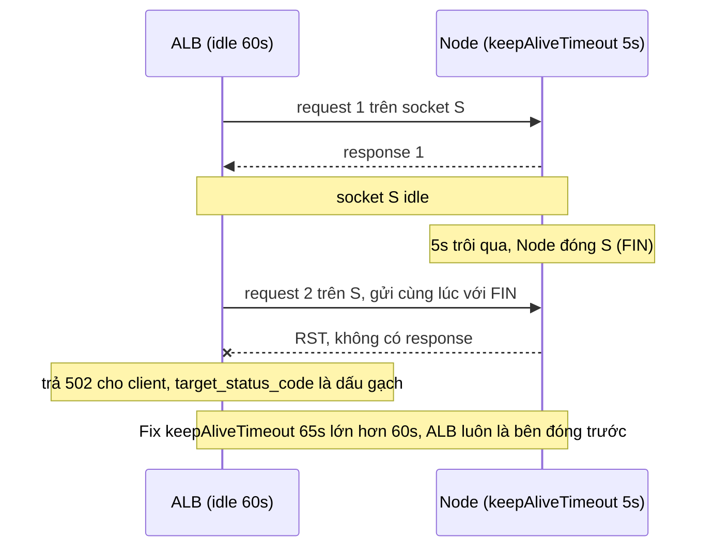
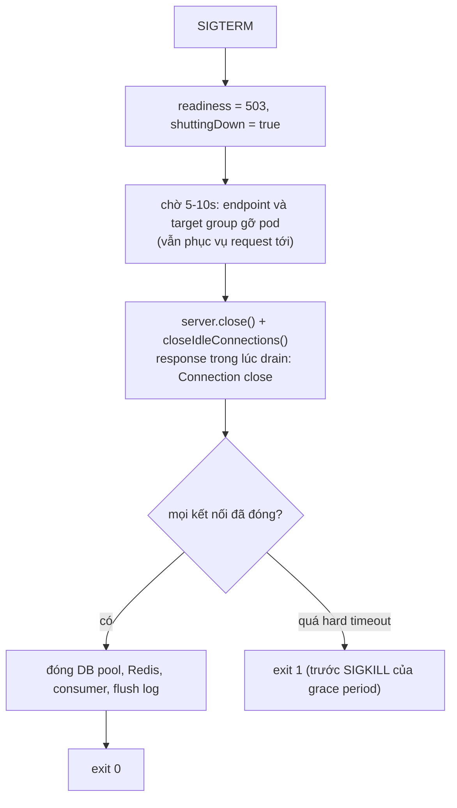

## Bối cảnh & vấn đề

Ba sự cố vận hành, cùng một service Express trên Kubernetes sau AWS ALB:

1. Khoảng 0,1% request nhận **502 Bad Gateway**, rải rác suốt ngày, không có dòng log lỗi nào trong app. Tỉ lệ tăng vọt vào **mỗi lần deploy**.
2. Khi database chậm, dashboard cho thấy connection pool cạn, CPU DB 100%, và số query đang chạy lớn hơn nhiều số request người dùng đang chờ: server vẫn làm việc cho những client đã bỏ đi từ lâu.
3. Mỗi khi một admin mở trang "báo cáo doanh thu tháng", p99 latency của **toàn bộ API**, kể cả endpoint đăng nhập, nhảy từ 80 ms lên gần 2 giây.

Cả ba đều nằm ở vùng giữa code Express và runtime: **thời gian**. Bao lâu thì bỏ một kết nối idle, bao lâu thì bỏ một request, ai huỷ công việc khi client bỏ đi, làm sao tắt process mà không cắt request đang chạy, và điều gì xảy ra khi một handler giữ event loop quá lâu. Bài này giải thích các lớp timeout của Node HTTP server, deadline propagation, keep-alive race sau load balancer, health check và graceful shutdown, và cách tìm, sửa endpoint chặn event loop. Nền tảng ở bài [timeouts & production debugging](/tracks/networking/learn/timeouts-production-debugging), [signals & graceful shutdown](/tracks/os-concurrency/learn/signals-graceful-shutdown) và [event loop](/tracks/javascript/learn/event-loop).

**Interview angle:** 502 sau ALB và graceful shutdown là hai câu scenario rất thường gặp. Interviewer muốn nghe **cơ chế** (ai đóng socket trước, thứ tự readiness và `server.close`), không phải "tăng timeout lên".

## Khái niệm

### Các timeout của Node HTTP server

Express chỉ là handler gắn vào `http.Server` của Node, nên các timeout ở tầng kết nối là của Node. Đo trên Node 24:

| Setting | Mặc định | Ý nghĩa |
|---|---|---|
| `keepAliveTimeout` | 5000 ms | Sau khi gửi xong response, giữ socket idle bao lâu để chờ request tiếp theo trên cùng kết nối |
| `keepAliveTimeoutBuffer` | 1000 ms | Từ Node 24.7 / 22.20: cộng thêm vào timeout thật của socket, trong khi header vẫn quảng bá `timeout=5`, để client đóng trước. Đo: `keepAliveTimeout = 1000` thì socket idle bị đóng sau ~2005 ms |
| `headersTimeout` | 60000 ms | Thời gian tối đa để nhận xong toàn bộ header của request |
| `requestTimeout` | 300000 ms | Thời gian tối đa để nhận xong toàn bộ request (header + body) |
| `timeout` | 0 (tắt) | Timeout idle của socket (kiểu cũ) |

Điểm quan trọng: `requestTimeout` và `headersTimeout` giới hạn thời gian **nhận** request, không phải thời gian handler chạy. Một handler chờ DB 10 phút không bị Node cắt. Timeout "cho một route" là việc của bạn.

### Timeout theo route và deadline propagation

Mỗi request nên có một **deadline**: thời điểm mà sau đó kết quả không còn giá trị với client (client đã timeout, LB đã trả 504). Mọi công việc phía sau (query DB, gọi service khác) phải dừng trước deadline đó. Một **timeout middleware** kiểu `setTimeout(() => res.status(503).json(...), ms)` chỉ giải quyết nửa vấn đề: client nhận 503 đúng hạn, nhưng handler **vẫn chạy tiếp**, vẫn giữ connection DB, và khi xong thì cố gửi response lần hai (`ERR_HTTP_HEADERS_SENT`).

Cách đúng là một `AbortSignal` cho mỗi request, gộp hai nguồn huỷ bằng `AbortSignal.any`: **deadline** của route (`AbortSignal.timeout(ms)`) và **client disconnect**. Signal được truyền xuống mọi lời gọi hỗ trợ nó (`fetch`, driver DB có cancel, `timers/promises`), và mỗi lời gọi outbound có timeout **nhỏ hơn** thời gian còn lại của deadline. Nếu route timeout là 10 giây mà query timeout là 30 giây, dưới tải, query chạy thêm 20 giây cho những request không ai chờ, giữ connection pool, và làm pool cạn nhanh hơn: một vòng xoáy quá tải. Chi tiết về `AbortController` ở bài [errors & cancellation](/tracks/javascript/learn/errors-cancellation).

### Phát hiện client đã bỏ đi

Khi client đóng kết nối trước khi response xong (đóng tab, timeout phía client, LB cắt), Node phát event **`close`** trên `res` (và `req`). Phân biệt với kết thúc bình thường bằng `res.writableFinished`: `close` mà `writableFinished === false` nghĩa là response chưa gửi xong, tức client đã bỏ đi. Middleware tạo `AbortController` cho request, gọi `abort()` trong trường hợp đó, và đặt signal vào `res.locals.signal`. Lỗi `AbortError` do client huỷ không phải lỗi hệ thống: không log ở mức error, không tính vào tỉ lệ 5xx.

### Keep-alive race sau load balancer

Load balancer như ALB giữ **pool kết nối keep-alive** tới target và tái sử dụng chúng. ALB có **idle timeout** (mặc định 60 giây) cho kết nối phía nó. Node có `keepAliveTimeout` mặc định **5 giây**. Nếu Node đóng kết nối idle sau 5 giây trong khi ALB nghĩ kết nối còn dùng được thêm 55 giây, sẽ có lúc ALB gửi request mới trên socket **đúng lúc** Node đóng nó. ALB nhận TCP RST hoặc FIN, không có response, và trả **502** cho client. Request chưa bao giờ tới Express, nên log app **sạch**. Trong ALB access log, dòng đó có `elb_status_code = 502` và `target_status_code = -`.

Quy tắc: **bên nhận** (upstream, ở đây là Node) phải giữ kết nối idle **lâu hơn** bên gửi (downstream, ALB), để bên gửi luôn là bên đóng trước. Với ALB 60 giây: `server.keepAliveTimeout = 65_000` và `server.headersTimeout` lớn hơn nó (ví dụ `66_000`, quan trọng ở các bản Node cũ nơi `headersTimeout` còn áp lên socket keep-alive). Cùng nguyên tắc áp dụng cho Nginx (`keepalive_timeout` của upstream) và các proxy khác.

502 **trùng với deploy** là một nguyên nhân khác: pod cũ nhận SIGTERM và đóng kết nối (hoặc exit) trong khi ALB vẫn định tuyến tới nó, vì việc gỡ target khỏi target group và endpoint khỏi Service mất vài giây. Sửa bằng graceful shutdown đúng thứ tự và deregistration delay của target group.

### Health check: liveness và readiness

Kubernetes dùng probe để quyết định hai việc khác nhau:

- **Liveness** (`/livez`): process có còn "sống" không. Fail liên tục thì kubelet **restart container**. Chỉ nên kiểm tra thứ mà restart **sửa được**: event loop còn phản hồi. Không kiểm tra DB: khi DB chậm, mọi pod cùng fail liveness, cùng restart, và restart không làm DB nhanh hơn; ngược lại, cơn bão reconnect lúc khởi động làm DB tệ hơn. Đây là **cascading failure** kinh điển.
- **Readiness** (`/readyz`): pod có nên **nhận traffic** không. Fail thì pod bị gỡ khỏi Service endpoints (và target group), nhưng không bị restart. Kiểm tra được khả năng phục vụ: đã warm-up xong, pool DB lấy được connection, và **trả false khi đang shutdown**.
- **Startup probe**: cho app khởi động chậm, chặn liveness cho tới khi khởi động xong.

### Graceful shutdown

Khi pod bị xoá (deploy, scale down, node drain), Kubernetes đồng thời: gửi **SIGTERM** tới process, và bắt đầu gỡ pod khỏi endpoints. Hai việc này **không đồng bộ**: vài giây đầu sau SIGTERM, traffic mới vẫn có thể tới. Sau `terminationGracePeriodSeconds` (mặc định 30 giây), process còn sống sẽ nhận **SIGKILL**. Trình tự đúng trong app:

1. Nhận SIGTERM: chuyển readiness sang **503** (và đánh dấu "đang shutdown").
2. **Chờ** vài giây (thường 5–10) để endpoint được gỡ và LB ngừng gửi request mới. Trong lúc đó vẫn phục vụ bình thường. (Có thể dùng `preStop` hook `sleep` thay cho việc chờ trong app.)
3. `server.close()`: ngừng nhận kết nối mới; callback chạy khi mọi kết nối đã đóng. Gọi `server.closeIdleConnections()` để đóng ngay các socket keep-alive đang idle, và set `Connection: close` cho response trong lúc drain để client không tái sử dụng socket.
4. Chờ request đang chạy hoàn thành, rồi đóng tài nguyên: pool DB, Redis, consumer Kafka, flush log/trace.
5. `process.exit(0)`. Có một **hard timeout** nhỏ hơn grace period (`setTimeout(() => process.exit(1), ...).unref()`), phòng trường hợp một kết nối treo không bao giờ đóng.

Để Node nhận được SIGTERM, container phải chạy `node` trực tiếp (`CMD ["node", "server.js"]`) hoặc qua init nhỏ (`tini`, `--init`); `npm start` hay shell làm PID 1 thường nuốt signal (xem bài [signals](/tracks/os-concurrency/learn/signals-graceful-shutdown)).

### Event loop blocking

Node chạy JavaScript của mọi request trên **một thread**. Một handler làm việc CPU đồng bộ trong 1,5 giây (dựng CSV lớn, `JSON.stringify` object khổng lồ, sort vài triệu phần tử, regex backtracking, `bcrypt.hashSync`, `fs.readFileSync`, `zlib.gzipSync`) thì trong 1,5 giây đó **không request nào khác** được xử lý: không đăng nhập, không health check. Đó là lý do p99 của cả API nhảy lên khi một endpoint admin chạy.

Chứng minh bằng số liệu: **event loop delay** (`perf_hooks.monitorEventLoopDelay`, hoặc metric `nodejs_eventloop_lag` của prom-client) tăng đúng lúc; CPU profile (`node --cpu-prof`, Clinic Flame, `--inspect`) khi gọi endpoint cho thấy một hàm chiếm trọn; trace phân tán có "khoảng trống" không có span nào. Sửa theo thứ tự ưu tiên: không làm việc đó trong request (chuyển thành **background job**: queue + worker, trả link tải khi xong); stream và phân trang từ DB thay vì dựng tất cả trong RAM; đẩy phần CPU sang **worker thread** (Piscina); hoặc tách traffic admin/reporting sang deployment riêng, replica DB riêng. Tạm thời: rate limit endpoint đó, giới hạn khoảng dữ liệu.

## Cơ chế hoạt động



Race chỉ xảy ra trong một cửa sổ rất hẹp, nên tỉ lệ nhỏ và ngẫu nhiên, và càng nhiều traffic thì càng hay gặp. Khi Node giữ socket lâu hơn ALB, ALB tự đóng socket idle trước khi Node kịp đóng, và không bao giờ gửi request lên một socket sắp chết.



## Ví dụ thực tế

### Defaults của Node 24

```text
$ node -e "const s=require('express')().listen(0,()=>{console.log({keepAliveTimeout:s.keepAliveTimeout,headersTimeout:s.headersTimeout,requestTimeout:s.requestTimeout,timeout:s.timeout,keepAliveTimeoutBuffer:s.keepAliveTimeoutBuffer});s.close()})"
{ keepAliveTimeout: 5000, headersTimeout: 60000, requestTimeout: 300000, timeout: 0, keepAliveTimeoutBuffer: 1000 }
$ curl -si localhost:3140/ | grep -i 'keep-alive\|connection'
Connection: keep-alive
Keep-Alive: timeout=5
```

Node quảng bá `Keep-Alive: timeout=5` cho client. Sửa cho ALB:

```ts
const server = app.listen(port);
server.keepAliveTimeout = 65_000;   // > ALB idle timeout (60 s mặc định)
server.headersTimeout = 66_000;     // > keepAliveTimeout
server.requestTimeout = 30_000;     // thời gian tối đa để nhận xong request
```

Output access log của ALB khi có race (minh hoạ, rút gọn theo định dạng log của ALB): `... elb_status_code=502 target_status_code=- target_processing_time=-1 ...`. Kiểm metric `HTTPCode_ELB_502_Count` so với `HTTPCode_Target_5XX_Count`: 502 do ELB mà target không có 5xx là dấu hiệu của keep-alive race hoặc target chết.

### Timeout middleware ngây thơ và bản dùng AbortSignal

Downstream "inventory" mất 2 giây; route deadline 1,5 giây (Express 5.2.1, output thật):

```js
app.use((req, res, next) => {                   // one AbortController per request
  const ac = new AbortController();
  res.on('close', () => { if (!res.writableFinished) ac.abort(new Error('client disconnected')); });
  res.locals.signal = AbortSignal.any([ac.signal, AbortSignal.timeout(1500)]); // route deadline 1.5 s
  next();
});
const timeoutMw = (ms) => (req, res, next) => { const t = setTimeout(() => res.status(503).json({ error: 'timeout' }), ms); res.on('finish', () => clearTimeout(t)); next(); };
app.get('/naive', timeoutMw(500), async (req, res) => {
  const r = await fetch('http://localhost:3151/'); // no signal: keeps going after the 503
  res.json(await r.json());                       // -> ERR_HTTP_HEADERS_SENT
});
app.get('/good', async (req, res) => {
  const r = await fetch('http://localhost:3151/', { signal: res.locals.signal });
  res.json(await r.json());
});
app.use((err, req, res, next) => {
  if (res.headersSent) { console.log('  error after response was sent:', err.code); return; }
  if (err.name === 'TimeoutError') return res.status(504).json({ error: 'upstream timeout' });
  if (res.locals.signal?.aborted) { console.log('  request aborted by client, not logged as 5xx'); return; }
  res.status(500).json({ error: 'internal' });
});
```

```text
naive -> 503 {"error":"timeout"} (540 ms)
  error after response was sent: ERR_HTTP_HEADERS_SENT
good (deadline 1.5s) -> 504 {"error":"upstream timeout"} (1512 ms)
  downstream: caller aborted, work stopped
client gives up after 300 ms:
  client: TimeoutError
  request aborted by client, not logged as 5xx
  downstream: caller aborted, work stopped
```

Bản ngây thơ trả 503 đúng hạn, nhưng downstream vẫn chạy đủ 2 giây, và handler sau đó cố gửi response lần hai. Bản dùng signal dừng downstream đúng deadline, và khi client bỏ đi sau 300 ms, downstream cũng dừng ngay. Nhân lên hàng nghìn request dưới tải, đó là khác biệt giữa pool DB còn thở và pool cạn.

### Graceful shutdown chạy thật

```js
let ready = true, shuttingDown = false;
app.get('/livez', (req, res) => res.sendStatus(200));
app.get('/readyz', (req, res) => res.sendStatus(ready ? 200 : 503));
app.use((req, res, next) => { if (shuttingDown) res.set('Connection', 'close'); next(); });
app.get('/slow', async (req, res) => { await sleep(1500); res.json({ done: true }); });
const server = app.listen(3160, () => log('listening'));
process.once('SIGTERM', async () => {
  log('SIGTERM: readiness -> 503');
  ready = false; shuttingDown = true;
  await sleep(700);                                  // in k8s: ~5-10 s so endpoints/LB stop routing here
  log('stop accepting new connections: server.close()');
  const hard = setTimeout(() => { log('hard timeout, forcing exit 1'); process.exit(1); }, 5000); hard.unref();
  server.close(async (err) => { log(`all connections closed${err ? ' ' + err.message : ''}`); await db.end(); log('exit 0'); process.exit(0); });
  server.closeIdleConnections();
});
```

Gửi `/slow`, 200 ms sau `kill -TERM`, rồi thử `/readyz` và một request mới sau khi đóng:

```text
[   3 ms] listening
[ 596 ms] SIGTERM: readiness -> 503
  /readyz during drain -> 503
[1297 ms] stop accepting new connections: server.close()
[1919 ms] all connections closed
  in-flight /slow -> {"done":true}
[1970 ms] db pool closed
[1970 ms] exit 0
  new request after close -> 000
```

Request đang chạy hoàn thành (`{"done":true}`), readiness báo 503 trong lúc drain để LB rút traffic, pool DB đóng **sau** khi request cuối xong, và process thoát 0. Request mới sau `close` bị từ chối kết nối (`000`), đúng lúc lẽ ra LB đã không còn gửi tới pod này.

Manifest tương ứng (minh hoạ):

```yaml
spec:
  terminationGracePeriodSeconds: 40
  containers:
    - name: api
      command: ["node", "dist/server.js"]
      readinessProbe: { httpGet: { path: /readyz, port: 3000 }, periodSeconds: 5, failureThreshold: 1 }
      livenessProbe:  { httpGet: { path: /livez,  port: 3000 }, periodSeconds: 10, failureThreshold: 3 }
```

### Endpoint báo cáo chặn event loop

Server riêng; client đo bằng `curl` từ shell (không cùng process, để phép đo không bị chính event loop bị chặn làm sai):

```js
const buildReport = (rows) => { const data = Array.from({ length: rows }, (_, i) => ({ id: i, total: (i * 7919) % 1000, note: 'x'.repeat(20) })); data.sort((a, b) => a.total - b.total || a.id - b.id); return data.map((r) => `${r.id},${r.total},${r.note}`).join('\n'); };
app.get('/admin/report', (req, res) => { const csv = buildReport(1_500_000); res.type('text/csv').send(`${csv.length} bytes`); });
app.get('/admin/report-worker', (req, res, next) => {
  const w = new Worker(`...same buildReport in a worker thread...`, { eval: true });
  w.once('message', (len) => res.type('text/csv').send(`${len} bytes`)).once('error', next);
});
```

```text
/admin/report: /health time_total(s): 1.722338 0.001179 0.001557 0.001072 0.001365 | event loop delay p99 1783 ms, max 1783 ms
/admin/report-worker: /health time_total(s): 0.001221 0.001818 0.001439 0.005255 0.001476 | event loop delay p99 12 ms, max 13 ms
```

Request `/health` đầu tiên gửi trong lúc báo cáo đang chạy phải chờ **1,72 giây**, dù bản thân nó chỉ mất 1 ms; event loop delay p99 1,78 giây. Chuyển sang worker thread, `/health` giữ 1–5 ms. Worker chỉ là bước đầu: với báo cáo thật, background job (queue + worker service, kết quả lưu S3, gửi link) còn tốt hơn vì không tốn RAM và CPU của pod API.

## Trade-offs & lựa chọn thay thế

| Cơ chế | Chặn được | Không chặn được | Ghi chú |
|---|---|---|---|
| `headersTimeout`/`requestTimeout` | Client gửi chậm (slowloris) | Handler chạy lâu | Tầng Node |
| Timeout middleware trả 503/504 | Client chờ quá lâu | Công việc phía sau vẫn chạy | Phải kết hợp signal |
| `AbortSignal` theo request | Việc thừa sau deadline/disconnect | API không hỗ trợ signal | Truyền xuống mọi lời gọi |
| Timeout outbound nhỏ hơn deadline | Treo vì downstream | Downstream đã nhận và đang làm | Deadline propagation qua header |

| Xử lý việc CPU nặng | Ưu | Nhược |
|---|---|---|
| Tối ưu thuật toán, stream, phân trang | Rẻ nhất, không thêm hạ tầng | Không phải lúc nào cũng đủ |
| Worker thread (Piscina) | Giải phóng event loop ngay | Vẫn tốn CPU/RAM pod, chi phí copy dữ liệu |
| Background job (queue + worker) | Cô lập hoàn toàn, retry, không giới hạn thời gian request | Thêm hạ tầng, UX bất đồng bộ |
| Deployment riêng cho admin/report | Cô lập tài nguyên, scale riêng | Vận hành thêm một service |

Chọn thế nào: mọi service có timeout server hợp lý, `keepAliveTimeout` lớn hơn idle timeout của LB phía trước, một signal theo request được truyền xuống mọi outbound call, và graceful shutdown đúng thứ tự. Việc CPU nặng trong request là **thiết kế sai**, không phải vấn đề cấu hình: đưa ra background job; worker thread là giải pháp tạm hoặc cho việc CPU ngắn mà cần kết quả đồng bộ.

## Edge cases & failure modes

- **Liveness check DB**: DB chậm 30 giây, mọi pod fail liveness, cùng restart, cùng reconnect, DB tệ hơn. Liveness chỉ kiểm tra process.
- **Readiness fail quá nhạy**: một lần timeout DB làm pod rút khỏi LB, tải dồn sang pod khác, chúng cũng fail: toàn cụm "not ready". Readiness nên dựa trên trạng thái bền (shutdown, warm-up), không trên một lần gọi phụ thuộc lỗi thoáng qua.
- **Kết nối dài (SSE, WebSocket, long polling)** không bao giờ tự đóng khi `server.close()`; cần gửi tín hiệu đóng cho client và đóng chủ động trước hard timeout.
- **`server.close()` không đóng socket keep-alive idle** trên Node cũ (trước 19); cần `closeIdleConnections()` hoặc theo dõi socket thủ công.
- **Consumer queue trong cùng process**: nhận SIGTERM giữa lúc xử lý message; phải ngừng nhận message mới, xử lý xong message hiện tại, commit offset, rồi mới thoát.
- **Event loop bị chặn trong lúc shutdown**: một báo cáo đang chạy đồng bộ làm process không phản hồi SIGTERM handler cho tới khi xong, có thể vượt grace period và bị SIGKILL.
- **GC pause và heap gần giới hạn** cũng làm event loop delay tăng; phân biệt bằng metric GC (`--trace-gc`, `perf_hooks` GC entries) trước khi kết luận là code chặn.

## Pitfalls

- ❌ Để `keepAliveTimeout` mặc định 5 s sau ALB 60 s → ✅ `keepAliveTimeout` 65 s, `headersTimeout` 66 s.
- ❌ Timeout middleware không huỷ công việc → ✅ `AbortSignal.any([deadline, clientDisconnect])` truyền xuống mọi outbound call, và kiểm `res.headersSent`.
- ❌ Timeout outbound lớn hơn route timeout → ✅ outbound dùng thời gian còn lại của deadline.
- ❌ Log `AbortError` do client huỷ như lỗi 5xx → ✅ phân loại riêng, không tính vào error rate.
- ❌ Liveness probe kiểm tra DB → ✅ liveness kiểm process; readiness kiểm khả năng phục vụ và trả 503 khi shutdown.
- ❌ SIGTERM → `process.exit()` ngay → ✅ readiness 503, chờ gỡ endpoint, `server.close()`, drain, đóng tài nguyên, exit, có hard timeout.
- ❌ `CMD npm start` làm PID 1 → ✅ `CMD ["node", "server.js"]` hoặc `tini`.
- ❌ Dựng báo cáo lớn đồng bộ trong handler → ✅ background job, stream, worker thread; đo event loop delay để chứng minh.

## Tóm tắt

- Node HTTP server có `keepAliveTimeout` 5 s, `headersTimeout` 60 s, `requestTimeout` 300 s (Node 24); chúng giới hạn kết nối và thời gian nhận request, không giới hạn handler.
- Mỗi request cần một deadline: `AbortSignal.any` gộp timeout của route và client disconnect (`res.on("close")` khi `!res.writableFinished`), truyền xuống mọi outbound call với timeout nhỏ hơn thời gian còn lại.
- 502 lẻ tẻ sau ALB mà log app sạch: keep-alive race vì Node đóng socket idle trước ALB. Đặt `keepAliveTimeout` lớn hơn idle timeout của LB. 502 trùng deploy: graceful shutdown sai thứ tự.
- Liveness chỉ kiểm process, readiness kiểm khả năng phục vụ và trả 503 khi shutdown. Liveness kiểm DB gây cascading restart.
- Graceful shutdown: readiness 503 → chờ gỡ endpoint → `server.close()` + `closeIdleConnections()` → drain → đóng DB/Redis → exit, có hard timeout nhỏ hơn grace period; Node phải là PID 1 hoặc chạy sau `tini`.
- Một handler CPU đồng bộ chặn mọi request trên process; chứng minh bằng event loop delay và CPU profile, sửa bằng background job, stream, worker thread hoặc tách deployment.
