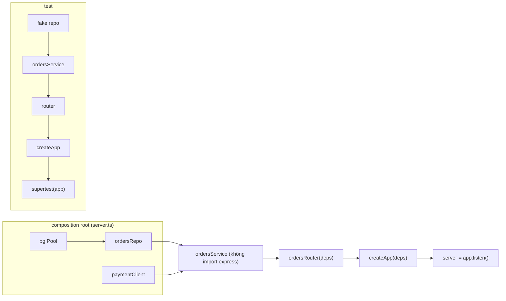
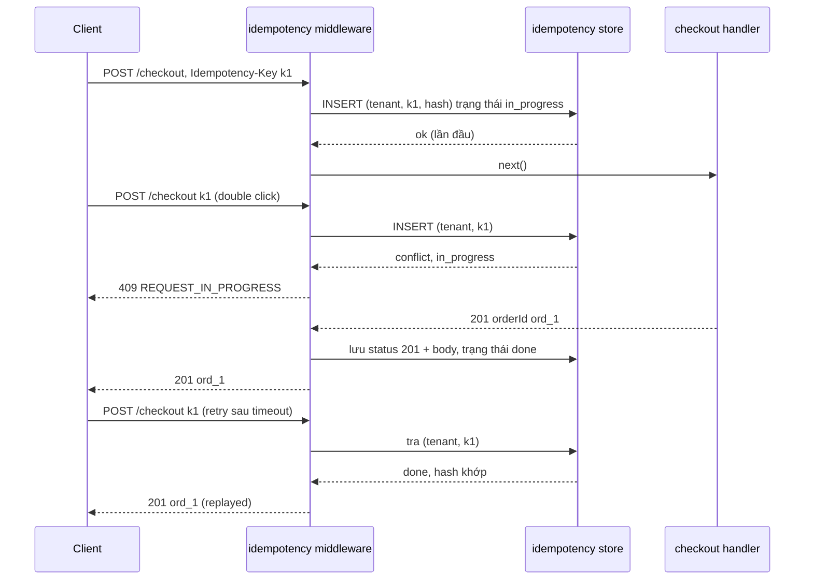

## Bối cảnh & vấn đề

Một Express app bắt đầu với năm route trong `app.js`. Hai năm sau nó có 80 endpoint, bốn team cùng sửa, và các triệu chứng quen thuộc xuất hiện: route handler 300 dòng trộn parse input, SQL, gọi payment provider và format response; mỗi file `import db from "../db"` nên không test được mà không có database thật; mỗi team trả lỗi theo một format khác nhau; thêm một endpoint phải sửa năm file ở năm thư mục (`routes/`, `controllers/`, `services/`, `models/`, `validators/`). Và khi một dev muốn chuyển callback sang async/await, không ai dám, vì không có test nào nói "hành vi hiện tại là gì".

Cùng lúc, endpoint checkout nhận một ticket: khách bấm "Đặt hàng" hai lần khi mạng chậm và bị trừ tiền hai lần. Mobile client retry khi timeout làm tạo hai đơn.

Express không có ý kiến về cấu trúc, nên cấu trúc là trách nhiệm của team. Bài này trình bày một convention thực tế cho codebase lớn (module theo feature, controller mỏng, service không biết HTTP, composition root), cách test ở tầng HTTP với supertest và vì sao phải tách `app` khỏi `server.listen()`, một ví dụ hoàn chỉnh về **idempotency** cho checkout, và cách refactor legacy an toàn bằng characterization test. Phần so sánh với NestJS (framework có sẵn convention) ở bài [frameworks & migration](/tracks/express/learn/frameworks-migration).

**Interview angle:** câu "bạn cấu trúc codebase Express lớn thế nào" không có đáp án đúng duy nhất. Interviewer đánh giá bạn có **lý do** cho từng ranh giới (dependency đi theo hướng nào, cái gì test được độc lập) hay chỉ đọc tên thư mục.

## Khái niệm

### Module theo feature thay vì theo layer

Cấu trúc **theo layer** (`routes/`, `controllers/`, `services/`) nhóm code theo loại kỹ thuật. Nó ổn khi app nhỏ, nhưng khi lớn, một feature bị rải ra mọi thư mục, và không có ranh giới nào ngăn service của `orders` gọi thẳng repository của `billing`. Cấu trúc **theo feature/module** nhóm theo nghiệp vụ: `modules/orders/`, `modules/checkout/`, `modules/catalog/`, mỗi module chứa đủ các tầng của nó. Một thay đổi nghiệp vụ thường nằm trong một thư mục, và ranh giới module là chỗ tự nhiên để sau này tách service.

Trong mỗi module, các tầng có trách nhiệm rõ:

- **Router/controller** (HTTP mapping): khai báo route, gắn middleware (validate, permission), đọc input đã validate từ `res.locals`, gọi service, map kết quả thành status/response. Mỏng: không có logic nghiệp vụ.
- **Service** (nghiệp vụ): nhận input có kiểu và `ctx` (user, tenant), thực hiện use case, throw `AppError` có nghĩa. **Không import Express**, không biết `req`/`res`. Nhờ vậy service chạy được từ HTTP, từ consumer Kafka, từ CLI, và test không cần HTTP.
- **Repository** (truy cập dữ liệu): query DB, luôn nhận `tenantId` tường minh, trả domain object.

Dependency chỉ đi một chiều: router → service → repository. Module khác chỉ được gọi qua **public API** của module (file `index.ts` export service), không import file nội bộ; enforce bằng lint rule (`eslint-plugin-boundaries`, `import/no-restricted-paths`) hoặc công cụ như dependency-cruiser.

### Composition root và dependency injection nhẹ

**Composition root** là **một chỗ duy nhất** (thường `server.ts` hoặc `container.ts`) tạo mọi dependency thật: pool DB, Redis client, HTTP client tới payment, logger. Mọi thứ khác nhận dependency qua tham số: `createApp({ ordersRepo, paymentClient })`, `makeOrdersService({ ordersRepo })`, `ordersRouter({ ordersService })`. Đó là **dependency injection** bằng hàm factory, không cần framework. Với app rất lớn, container như **awilix** tự động hoá việc nối dây.

Lợi ích cụ thể: test thay repository bằng fake trong một dòng; không có module nào ngầm mở kết nối DB khi bị import; thứ tự khởi tạo và đóng tài nguyên (graceful shutdown) nằm ở một chỗ. Cái giá: phải truyền dependency qua nhiều lớp, và convention phải được giữ bằng review.

### Tách app khỏi server

`app` (instance Express, đã gắn middleware và route) và `server` (kết quả của `app.listen(port)`) là hai thứ khác nhau. Export `createApp(deps)` từ `app.ts`, và chỉ `server.ts` mới gọi `listen`, đặt timeout, đăng ký SIGTERM. Test import `createApp` với dependency giả và không mở port; `supertest(app)` tự mở một server tạm trên port ngẫu nhiên cho mỗi request (hoặc dùng server bạn đưa vào), nên test chạy song song không đụng nhau và không để lại process treo.

### Chiến lược test cho Express API

- **Unit test service**: không HTTP, không DB thật; repository và client giả. Nhanh, bao phủ nhánh nghiệp vụ.
- **Integration test HTTP** với **supertest**: gửi request thật qua toàn bộ pipeline (middleware, validation, auth, error handler) với dependency giả hoặc DB thật. Đây là nơi bắt các lỗi mà unit test không thấy: thứ tự middleware, route thiếu auth, format lỗi, status code, header.
- **Repository test** với **DB thật** trong container (Testcontainers, hoặc Postgres trong docker-compose của CI): SQL, transaction, constraint chỉ đúng khi chạy trên DB thật.
- **Contract test** giữa service (Pact) hoặc với OpenAPI schema khi có client bên ngoài.

Những thứ **nên có test riêng** vì hay vỡ: mọi route không trong allowlist public đều trả 401 khi thiếu token; tenant A không đọc/sửa/liệt kê được dữ liệu tenant B; lỗi nội bộ không lộ chi tiết; validation từ chối field lạ; idempotency. Node có `node:test` và `node:assert` built-in; Jest và Vitest phổ biến hơn trong dự án TypeScript.

### Idempotency cho endpoint ghi

Một thao tác là **idempotent** nếu thực hiện nhiều lần cho cùng kết quả như một lần. `GET`, `PUT`, `DELETE` được HTTP định nghĩa là idempotent; `POST /checkout` thì không. Nhưng network không đáng tin: client có thể không nhận được response dù server đã xử lý xong, rồi retry; user bấm hai lần; LB retry. Giải pháp là **idempotency key**: client sinh một UUID cho mỗi **ý định** (một lần bấm "Đặt hàng"), gửi trong header `Idempotency-Key`, và giữ nguyên key khi retry.

Server lưu `(tenant, key)` cùng **hash của request** và **kết quả**. Lần đầu: ghi bản ghi trạng thái `in_progress` (một INSERT với unique constraint, để hai request đồng thời không cùng thắng), xử lý, lưu response. Lần sau cùng key: nếu đã xong, trả lại **đúng response cũ**; nếu đang xử lý, trả 409 (client thử lại sau); nếu cùng key nhưng body khác, trả 422 (client dùng sai key). Bản ghi hết hạn sau một khoảng (24 giờ).

Các phần còn lại của một checkout an toàn: tính giá **ở server** tại thời điểm checkout (không tin giá từ client), báo `PRICE_CHANGED` nếu khác với giá client đã hiển thị; tạo order + order items + giữ hàng trong **một transaction DB**; gọi payment provider **ngoài** transaction (không giữ transaction mở trong lúc chờ mạng), điều phối bằng **state machine** (`pending_payment → paid → confirmed`, hoặc `→ payment_failed → released`); webhook của provider cũng xử lý idempotent (theo event id); và một job **reconcile** định kỳ đối chiếu với provider cho những đơn kẹt ở `pending_payment`. Khi provider timeout nhưng thực ra đã trừ tiền, chính webhook hoặc job reconcile đưa đơn về trạng thái đúng.

### Refactor legacy bằng characterization test

**Characterization test** (Michael Feathers) là test ghi lại **hành vi hiện tại** của code, kể cả hành vi kỳ quặc, trước khi sửa. Với Express, đó là loạt test supertest gọi các route quan trọng với input đa dạng và khẳng định status, body, header đang có. Chúng không nói code "đúng"; chúng nói code **không đổi**. Khi có lưới an toàn này, refactor theo bước nhỏ: tách service khỏi route, chuyển callback sang async/await, đưa error handling về một middleware, mỗi bước chạy lại toàn bộ test. Thay đổi hành vi có chủ đích (sửa bug) làm trong commit riêng, cập nhật test tường minh.

Kết hợp thêm: feature flag hoặc canary khi deploy phần đã refactor; so sánh metric (latency, tỉ lệ lỗi theo route) trước/sau; review kỹ code do AI sinh ra, vì nó hay "sửa luôn" hành vi kỳ quặc mà client đang phụ thuộc.

## Cơ chế hoạt động



Cùng một `createApp` được dựng hai lần với dependency khác nhau: bản thật trong `server.ts`, bản giả trong test. Không có `import db` ẩn nào, nên test không bao giờ vô tình chạm DB thật, và thay payment provider thật bằng giả chỉ là truyền một object khác.



## Ví dụ thực tế

### createApp, router factory và test với supertest

```js
// app.mjs
export function ordersRouter({ ordersService }) {
  const r = express.Router();
  r.get('/:id', async (req, res) => res.json(await ordersService.get(res.locals.auth, req.params.id)));
  return r;
}
export function makeOrdersService({ ordersRepo }) {
  return {
    async get(auth, id) {
      const order = await ordersRepo.findById(auth.tenantId, id);
      if (!order) throw new AppError('ORDER_NOT_FOUND', 404);
      return order;
    },
  };
}
export function createApp({ ordersRepo, verifyToken }) {
  const app = express();
  app.disable('x-powered-by');
  app.use(express.json({ limit: '100kb' }));
  app.get('/livez', (req, res) => res.sendStatus(200));
  app.use('/api', async (req, res, next) => {
    const auth = await verifyToken(req.get('authorization'));
    if (!auth) throw new AppError('UNAUTHENTICATED', 401);
    res.locals.auth = auth; next();
  });
  app.use('/api/orders', ordersRouter({ ordersService: makeOrdersService({ ordersRepo }) }));
  app.use((req, res) => res.status(404).json({ code: 'ROUTE_NOT_FOUND' }));
  app.use((err, req, res, _next) => {
    const status = err instanceof AppError ? err.status : 500;
    res.status(status).json({ code: err instanceof AppError ? err.code : 'INTERNAL' });
  });
  return app;
}
// server.mjs: the only place that creates real deps and calls listen()
```

```js
// orders.test.mjs
import { test } from 'node:test';
import assert from 'node:assert/strict';
import request from 'supertest';
import { createApp } from './app.mjs';
const rows = [{ id: 'o1', tenantId: 'acme', total: 120 }, { id: 'o2', tenantId: 'globex', total: 999 }];
const fakeRepo = { findById: async (tenantId, id) => rows.find((o) => o.id === id && o.tenantId === tenantId) ?? null };
const tokens = { 'Bearer acme-user': { userId: 'u1', tenantId: 'acme' } };
const app = createApp({ ordersRepo: fakeRepo, verifyToken: async (h) => tokens[h] ?? null });

test('requires auth on every /api route', async () => {
  const res = await request(app).get('/api/orders/o1');
  assert.equal(res.status, 401);
  assert.deepEqual(res.body, { code: 'UNAUTHENTICATED' });
});
test('reads own tenant order', async () => {
  const res = await request(app).get('/api/orders/o1').set('Authorization', 'Bearer acme-user');
  assert.equal(res.status, 200);
  assert.equal(res.body.total, 120);
});
test('tenant A cannot read tenant B order (404, not 403)', async () => {
  const res = await request(app).get('/api/orders/o2').set('Authorization', 'Bearer acme-user');
  assert.equal(res.status, 404);
  assert.deepEqual(res.body, { code: 'ORDER_NOT_FOUND' });
});
test('repo errors become a generic 500 without internals', async () => {
  const broken = createApp({ ordersRepo: { findById: async () => { throw new Error('relation "orders" does not exist'); } }, verifyToken: async () => ({ tenantId: 'acme' }) });
  const res = await request(broken).get('/api/orders/o1').set('Authorization', 'x');
  assert.equal(res.status, 500);
  assert.doesNotMatch(res.text, /relation/);
});
```

```text
$ node --test orders.test.mjs            # supertest 7.3.0, Express 5.2.1, Node 24
✔ requires auth on every /api route (16.090958ms)
✔ reads own tenant order (3.47625ms)
✔ tenant A cannot read tenant B order (404, not 403) (2.623875ms)
✔ repo errors become a generic 500 without internals (2.301333ms)
ℹ tests 4
ℹ pass 4
ℹ fail 0
```

Bốn test chạy trong vài ms mỗi cái, không port cố định, không DB. Test thứ tư dựng app thứ hai với repository lỗi: chỉ làm được vì dependency được truyền vào. Test tenant isolation ở đây dùng fake repo; bản đầy đủ nên chạy trên DB thật để chứng minh chính câu SQL có filter tenant.

### Checkout với idempotency key

```js
const store = new Map(); // production: idempotency_keys(tenant_id, key, request_hash, status, response, created_at), PK(tenant_id, key)
const idempotent = (req, res, next) => {
  const key = req.get('idempotency-key');
  if (!key) return res.status(400).json({ code: 'IDEMPOTENCY_KEY_REQUIRED' });
  const id = `${res.locals.tenantId}:${key}`;
  const hash = createHash('sha256').update(JSON.stringify(req.body)).digest('hex');
  const seen = store.get(id);
  if (seen?.state === 'in_progress') return res.status(409).json({ code: 'REQUEST_IN_PROGRESS' });
  if (seen && seen.hash !== hash) return res.status(422).json({ code: 'IDEMPOTENCY_KEY_REUSED' });
  if (seen) return res.status(seen.status).set('idempotent-replayed', 'true').json(seen.body);
  store.set(id, { state: 'in_progress', hash });                   // INSERT ... ON CONFLICT DO NOTHING
  const json = res.json.bind(res);
  res.json = (body) => { store.set(id, { state: 'done', hash, status: res.statusCode, body }); return json(body); };
  res.on('close', () => { if (store.get(id)?.state === 'in_progress') store.delete(id); }); // failed before responding: allow retry
  next();
};
app.post('/checkout', idempotent, async (req, res) => {
  await new Promise((r) => setTimeout(r, 100));                  // reserve stock + create order in one DB transaction
  const total = req.body.items.reduce((s, i) => s + priceOf[i.sku] * i.qty, 0); // server-side price, ignore client price
  if (req.body.expectedTotal !== total) return res.status(409).json({ code: 'PRICE_CHANGED', total });
  ordersCreated++;
  res.status(201).json({ orderId: `ord_${ordersCreated}`, total, state: 'pending_payment' });
});
```

```text
double click (parallel): [
  '201 {"orderId":"ord_1","total":450,"state":"pending_payment"}',
  '409 {"code":"REQUEST_IN_PROGRESS"}'
]
retry after timeout    : 201 (replayed) {"orderId":"ord_1","total":450,"state":"pending_payment"}
same key, other cart   : 422 {"code":"IDEMPOTENCY_KEY_REUSED"}
stale price in client  : 409 {"code":"PRICE_CHANGED","total":450}
orders created         : 1
```

Hai click đồng thời tạo đúng một đơn; retry nhận lại đúng response cũ với header `idempotent-replayed`; tái sử dụng key cho giỏ hàng khác bị từ chối; giá được tính lại ở server. `Map` ở đây chỉ để demo trong một process: production dùng bảng DB với primary key `(tenant_id, key)` (hoặc Redis `SET NX` với TTL), vì nhiều pod phải thấy cùng một trạng thái, và việc "chiếm key" phải nguyên tử. Lưu response lỗi 4xx nghiệp vụ (như `PRICE_CHANGED`) là chủ ý: cùng ý định thì cùng kết quả; lỗi 5xx hay lỗi trước khi xử lý thì xoá bản ghi để client retry được.

### Cấu trúc thư mục gợi ý

```text
src/
  server.ts                 # composition root: config, pool, clients, listen, SIGTERM
  app.ts                    # createApp(deps): middleware chung, mount module, 404, error handler
  platform/                 # dùng chung: AppError, errorHandler, validate, auth, requestContext, logger
  modules/
    orders/
      index.ts              # public API của module: export { makeOrdersService, ordersRouter }
      orders.router.ts      # HTTP mapping + validate + requirePermission
      orders.service.ts     # nghiệp vụ, không import express
      orders.repo.ts        # SQL, luôn nhận tenantId
      orders.schemas.ts     # zod schemas (input/output)
      orders.test.ts        # supertest + unit
    checkout/ ...
```

## Trade-offs & lựa chọn thay thế

| Cách tổ chức | Ưu | Nhược | Hợp khi |
|---|---|---|---|
| Theo layer | Quen thuộc, đơn giản lúc đầu | Feature rải rác, không có ranh giới module | App nhỏ, một team |
| Theo feature/module | Thay đổi tập trung, dễ tách service sau này | Cần convention và lint giữ ranh giới | Nhiều endpoint, nhiều team |
| NestJS | Convention và DI có sẵn, onboarding nhanh | Abstraction, decorator, learning curve | Team lớn muốn chuẩn hoá mạnh |

| DI | Ưu | Nhược |
|---|---|---|
| Factory function thủ công | Tường minh, không phép màu, type tốt | Nối dây dài khi app lớn |
| Container (awilix) | Tự nối, scope theo request | Thêm khái niệm, lỗi lúc chạy nếu đăng ký sai |
| `import` singleton trực tiếp | Ít code nhất | Không test được, khởi tạo ngầm khi import |

Chọn thế nào: bắt đầu với module theo feature + factory function; khi số module và dependency vượt mức quản lý thủ công, cân nhắc awilix. Khi convention tự xây bắt đầu tốn nhiều công giữ hơn là viết feature, hoặc team tăng nhanh, đó là tín hiệu để xem xét NestJS (xem bài [frameworks & migration](/tracks/express/learn/frameworks-migration)).

## Edge cases & failure modes

- **Test dùng chung state**: fake repo là module-level mutable, test chạy song song ghi đè nhau. Mỗi test tạo app và fake riêng.
- **Supertest và server treo**: tạo server thủ công (`app.listen`) trong test mà quên đóng làm test runner không thoát. Truyền `app` cho supertest thay vì server.
- **Idempotency key hết hạn** trước khi client retry xong (ví dụ app mobile offline 2 ngày): hai đơn. Chọn TTL theo hành vi client, và thêm kiểm tra nghiệp vụ (đơn trùng nội dung trong N phút).
- **Hash body không ổn định**: `JSON.stringify` phụ thuộc thứ tự key; client serialize khác thứ tự giữa lần gửi và retry sẽ bị 422. Hash trên dữ liệu đã validate và chuẩn hoá (sort key).
- **Crash giữa lúc xử lý**: bản ghi `in_progress` còn mãi, client retry nhận 409 vĩnh viễn. Bản ghi có `locked_until`; quá hạn thì cho phép lấy lại, và thao tác nghiệp vụ phải an toàn khi chạy lại (transaction).
- **Characterization test khoá cả bug**: test ghi lại hành vi sai, rồi fix bug làm test đỏ. Đúng ý: đổi test tường minh trong commit sửa bug, kèm lý do.
- **Module "public API" bị lách** bằng import đường dẫn sâu; chỉ lint rule mới giữ được lâu dài.

## Pitfalls

- ❌ Handler 300 dòng trộn HTTP, SQL, gọi ngoài → ✅ router mỏng, service không biết Express, repository nhận tenant.
- ❌ `import db from "../db"` khắp nơi → ✅ composition root tạo dependency, truyền qua factory.
- ❌ `app.listen()` trong file export app → ✅ `createApp(deps)` và `server.ts` riêng.
- ❌ Chỉ unit test service, không test HTTP → ✅ supertest cho auth bắt buộc, format lỗi, validation, tenant isolation.
- ❌ Mock cả DB cho test repository → ✅ DB thật trong container.
- ❌ Chống double submit bằng disable nút ở frontend → ✅ idempotency key ở server, lưu nguyên tử theo `(tenant, key)`.
- ❌ Gọi payment provider bên trong transaction DB → ✅ state machine, provider gọi ngoài transaction, webhook và reconcile idempotent.
- ❌ Refactor lớn không có test → ✅ characterization test trước, bước nhỏ, canary, so sánh metric.

## Tóm tắt

- Codebase lớn: module theo feature; router mỏng → service không import Express → repository nhận tenant tường minh; module khác chỉ dùng public API, giữ bằng lint.
- Composition root tạo dependency thật ở một chỗ; mọi thứ khác nhận qua factory (hoặc awilix). Test thay dependency trong một dòng.
- Tách `createApp(deps)` khỏi `server.listen()`; supertest chạy toàn pipeline không cần port cố định.
- Test những thứ hay vỡ: auth bắt buộc, tenant isolation, format lỗi không lộ nội bộ, validation; repository test trên DB thật.
- Idempotency key: chiếm `(tenant, key)` nguyên tử, lưu hash request và response, replay khi trùng, 409 khi đang xử lý, 422 khi body khác.
- Checkout an toàn: giá tính ở server, transaction cho order + stock, payment ngoài transaction qua state machine, webhook và reconcile idempotent.
- Refactor legacy: characterization test trước, bước nhỏ, sửa bug trong commit riêng, canary và so sánh metric.
