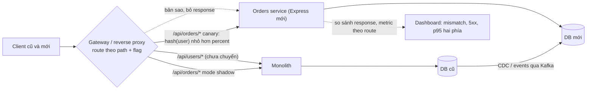
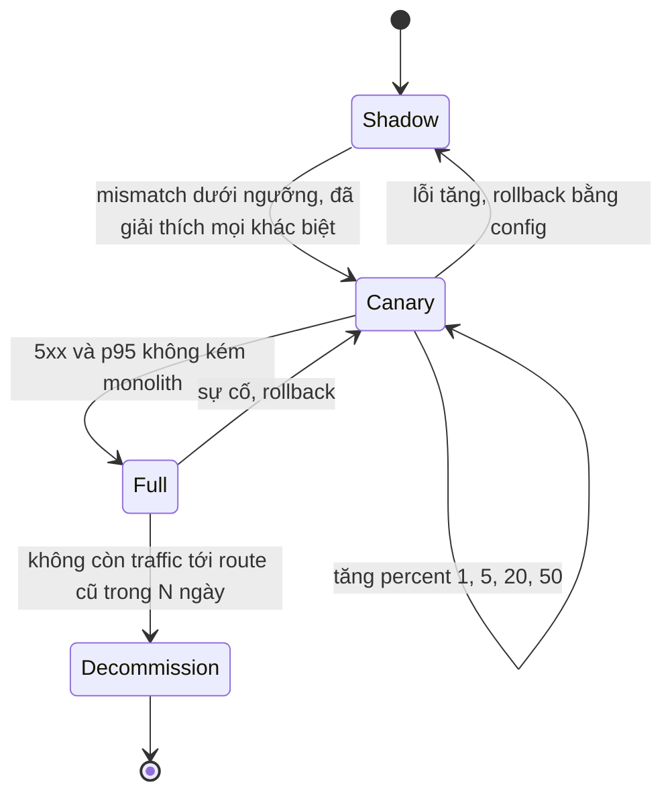

## Bối cảnh & vấn đề

Hai cuộc họp kiến trúc điển hình. Ở cuộc họp thứ nhất, một kỹ sư đề xuất viết lại service Express sang Fastify vì "Fastify nhanh gấp đôi". Service đó có p95 là 85 ms, trong đó 80 ms là chờ Postgres. Ở cuộc họp thứ hai, một tech lead muốn chuyển cả monolith PHP/Java cũ sang các service Node/Express mới, "tắt monolith trong một quý". Cả hai đề xuất đều bắt nguồn từ một vấn đề có thật, và cả hai đều có thể trở thành dự án tốn nhiều tháng mà không cải thiện được gì cho người dùng.

Bài này cho bạn công cụ để trả lời hai câu hỏi đó bằng số và bằng quy trình. Phần một so sánh Express, Fastify và NestJS: mỗi cái thật sự khác nhau ở đâu, overhead framework đo được là bao nhiêu so với thời gian chờ I/O, và tiêu chí chọn. Phần hai là **strangler fig**: chuyển từng endpoint từ monolith sang service mới sau một gateway, với shadow traffic, canary và contract test, để client cũ không bao giờ thấy sự khác biệt. Đây cũng là chủ đề CV quen thuộc ("bạn đã migrate monolith sang microservices thế nào"), nên phần cuối gợi ý cách kể. Track [NestJS](/tracks/nestjs) đi sâu vào framework đó; kiến trúc microservices ở track [microservices](/tracks/microservices).

**Interview angle:** câu "Express, Fastify hay NestJS" là câu mở; câu follow-up gần như chắc chắn là "framework chiếm 5 ms, DB chiếm 80 ms, đổi có đáng không". Trả lời bằng phép tính, không bằng benchmark trên blog.

## Khái niệm

### Express

**Express** là lớp mỏng trên `http` của Node: router + chuỗi middleware + vài helper cho `req`/`res`. Nó không có ý kiến về cấu trúc, validation, DI hay logging. Ưu điểm: ai cũng biết, tài liệu và câu trả lời có sẵn cho mọi vấn đề, hệ sinh thái middleware lớn nhất, và Express 5 đã xử lý async error. Nhược điểm: mọi convention (cấu trúc module, format lỗi, validation, DI, logging có cấu trúc) phải tự xây và tự giữ; overhead mỗi request cao hơn Fastify vì chuỗi middleware tuyến tính và `res.json` dùng `JSON.stringify` thường.

### Fastify

**Fastify** được thiết kế cho throughput và overhead thấp. Những điểm khác biệt chính: router dựa trên radix tree (`find-my-way`); **JSON Schema** cho cả input (validate bằng ajv) và **output** (serialize bằng `fast-json-stringify`, sinh code serialize riêng cho từng schema, nhanh hơn `JSON.stringify` và tự loại field không khai báo, vốn cũng là một lớp chống rò dữ liệu); **hook** theo vòng đời (`onRequest`, `preHandler`, `onSend`...) thay cho chuỗi middleware phẳng; **plugin encapsulation** (decorator và hook đăng ký trong một plugin chỉ có hiệu lực trong phạm vi plugin đó); và logger **pino** tích hợp. Có thể chạy middleware Express qua `@fastify/express`, nhưng mất phần lợi thế hiệu năng ở các route đó.

### NestJS

**NestJS** là framework đầy đủ, opinionated, lấy cảm hứng từ Angular: **module**, **provider** với **dependency injection** container, **decorator** cho controller/route, và các khái niệm pipeline riêng (guard cho authorization, pipe cho validation/transform, interceptor cho cross-cutting, exception filter cho mapping lỗi). Nest không thay thế HTTP server: nó chạy trên **adapter** Express (mặc định) hoặc Fastify. Vì vậy câu hỏi "Nest nhanh hay chậm" thực chất là "adapter bên dưới cộng tầng DI/decorator của Nest". Nest đổi lấy convention và onboarding nhanh cho team lớn bằng abstraction, learning curve và "phép màu" (reflect-metadata, decorator) khó debug hơn.

### Overhead framework so với thời gian I/O

Benchmark "hello world" đo **overhead cố định mỗi request** của framework. Với một API thật, latency mỗi request ≈ overhead framework + thời gian chờ DB/network + thời gian CPU của logic. Nếu overhead framework là 0,05 ms và DB là 20 ms, giảm overhead một nửa gần như không đổi latency. Nơi overhead framework quan trọng: service **throughput rất cao** với việc mỗi request nhỏ (gateway, proxy, API cache-hit), nơi CPU của pod là giới hạn và tiết kiệm 30% CPU nghĩa là ít pod hơn.

Quy trình ra quyết định: đo phân bổ thời gian thật (APM/tracing: bao nhiêu % trong framework, trong serialize, trong DB), đo CPU của pod ở tải thật, rồi tính: nếu đổi framework giảm X% CPU, tiết kiệm được bao nhiêu pod, so với bao nhiêu tuần công và rủi ro regression. Thường thì tối ưu query, thêm index, cache, hay bỏ một lời gọi mạng thừa đem lại nhiều hơn rất nhiều.

### Khi nào đổi framework là quyết định tốt

Lý do **tốt**: nhiều team cùng sửa một codebase Express không có convention và chi phí giữ convention tự chế đã vượt chi phí học Nest; tổ chức muốn chuẩn hoá một stack cho hàng chục service; framework overhead đã được **đo** là bottleneck CPU (Fastify); cần tính năng mà framework mới có sẵn và tự xây rất tốn (schema-driven serialization, DI với scope, microservice transport).

Lý do **tệ**: "framework mới đang hot"; bottleneck thật ở DB hoặc network; service sắp bị thay thế hoặc ít thay đổi; không có test đủ để chứng minh hành vi không đổi; team không có người hiểu framework mới. Và cân nhắc **di chuyển dần** thay vì viết lại: Nest có thể chạy trên Express adapter và mount router Express cũ; Fastify có `@fastify/express`; hoặc chỉ viết module **mới** bằng framework mới sau gateway.

### Strangler fig

**Strangler fig** (Martin Fowler) là mẫu thay thế hệ thống cũ **từng phần**: đặt một lớp định tuyến (gateway, reverse proxy, hoặc chính monolith) trước hệ thống cũ, chuyển từng endpoint hoặc từng feature sang service mới, và cấu hình định tuyến quyết định request đi đâu. Hệ thống cũ bị "bóp nghẹt" dần cho tới khi không còn route nào, rồi mới tắt. Ưu điểm cốt lõi: **rollback bằng config** (đổi định tuyến về hệ thống cũ) thay vì rollback code, và mỗi bước đủ nhỏ để đo được.

Các giai đoạn cho một endpoint:

1. **Shadow**: gateway gửi request tới hệ thống cũ (trả response cho user) và **sao chép** tới service mới (bỏ response), rồi so sánh hai kết quả. Chỉ an toàn cho request **đọc** hoặc request ghi mà service mới chạy ở chế độ dry-run; shadow một `POST /payments` thật là trừ tiền hai lần.
2. **Canary**: một phần trăm nhỏ user (1%, 5%, 20%) đi sang service mới. Chia theo **hash ổn định của user id** để mỗi user luôn gặp cùng một phía (không nhảy qua lại giữa hai hệ thống trong một phiên).
3. **Full**: 100% sang service mới; hệ thống cũ vẫn chạy trong một thời gian để rollback.
4. **Dọn**: gỡ code cũ, gỡ route khỏi gateway.

### Giữ backward compatibility

Client cũ (mobile app đã cài, đối tác tích hợp) không cập nhật theo lịch của bạn. Service mới phải giữ **contract**: cùng URL, cùng method, cùng **shape** response (tên field, kiểu: `"120.00"` string khác `120` number), cùng status code, cùng **format lỗi**, cùng header quan trọng (cache, pagination). Công cụ: **contract test** (consumer-driven với Pact, hoặc kiểm tra theo OpenAPI của hệ thống cũ) chạy với **cả hai** implementation; **so sánh response** trong shadow; một **adapter layer** trong service mới map model mới sang shape cũ; và chỉ đổi contract qua **versioning** (`/v2`) khi thật sự cần.

Dữ liệu là phần khó nhất. Trong giai đoạn song song, phải rõ **nguồn sự thật** của từng entity. Các cách: service mới đọc DB cũ (đơn giản, nhưng khoá schema); **CDC** (Change Data Capture, ví dụ Debezium) đẩy thay đổi từ DB cũ sang DB mới qua Kafka; hoặc **dual-write** (rủi ro không nhất quán khi một bên fail, nên thường đi kèm outbox). Consumer phải **idempotent** vì event có thể tới hai lần. Auth và session phải dùng chung giữa hai hệ thống (cùng token format, cùng permission) để user không phải đăng nhập lại khi request đi qua phía khác.

## Cơ chế hoạt động



Gateway là nơi duy nhất quyết định request đi đâu, và quyết định đó là **config** (mode, percent) có thể đổi không cần deploy. Dữ liệu chảy một chiều từ nguồn sự thật hiện tại sang hệ thống mới; khi service mới thành nguồn sự thật cho orders, chiều chảy đảo lại (hoặc monolith gọi service mới cho orders). Dashboard so sánh hai phía theo route là thứ cho phép ra quyết định cutover bằng số.



## Ví dụ thực tế

### Đo overhead: node:http, Express 5, Fastify 5

Mỗi server chạy trong process riêng, cùng payload JSON khoảng 600 byte, `autocannon -c 50 -d 8` trên cùng máy (MacBook, Node 24; số tuyệt đối phụ thuộc máy, hãy nhìn tỉ lệ):

```js
// express 5.2.1
e.get('/fast', (req, res) => res.json(payload));
// fastify 5.12.5
f.get('/fast', async () => payload);
f.get('/schema', { schema: { response: { 200: { type: 'object', properties: { id: { type: 'integer' }, items: { type: 'array', items: { type: 'object', properties: { sku: { type: 'string' }, qty: { type: 'integer' } } } } } } } } }, async () => payload);
// node:http baseline
http.createServer((req, res) => { res.setHeader('content-type', 'application/json'); res.end(JSON.stringify(payload)); });
```

```text
node:http raw          req/s 35733 | p50 1 ms | p99 3 ms
express 5              req/s 25318 | p50 1 ms | p99 4 ms
fastify (no schema)    req/s 31872 | p50 1 ms | p99 5 ms
fastify (resp schema)  req/s 35700 | p50 1 ms | p99 3 ms
```

Trên cùng máy nhưng thêm `await sleep(20)` giả lập một query DB 20 ms:

```text
3181/db (express)  req/s 2295 | p50 21 ms | p99 24 ms
3182/db (fastify)  req/s 2301 | p50 21 ms | p99 24 ms
```

Khi handler rỗng, Fastify với response schema phục vụ nhiều hơn Express khoảng 40% và ngang `node:http` trần. Khi mỗi request chờ 20 ms, hai framework **như nhau**: throughput bị giới hạn bởi concurrency và thời gian chờ (50 kết nối / 21 ms ≈ 2.400 req/s), không bởi framework. Overhead của Express ở đây là khoảng 1/25318 − 1/35733 ≈ 0,012 ms CPU mỗi request so với `node:http`; với request 85 ms thì đó là 0,01%. Chỉ khi CPU của pod là giới hạn (throughput rất cao, handler rất nhẹ), khác biệt đó mới quy ra tiền.

### Gateway strangler với shadow và canary

```js
const cfg = { orders: { mode: 'shadow', percent: 0 } }; // shadow -> canary(percent) -> full
const bucket = (userId) => parseInt(createHash('sha1').update(userId).digest('hex').slice(0, 8), 16) % 100;
gw.use('/api/orders', async (req, res) => {
  const c = cfg.orders, toNew = c.mode === 'full' || (c.mode === 'canary' && bucket(req.get('x-user-id') ?? '') < c.percent);
  const primary = await forward(toNew ? NEW : LEGACY, req);
  stats[toNew ? 'next' : 'legacy']++;
  res.status(primary.status).json(primary.body);
  if (c.mode === 'shadow') {           // fire-and-forget copy to the new service, compare, never affect the user
    forward(NEW, req).then((s) => {
      if (JSON.stringify(s.body) !== JSON.stringify(primary.body)) stats.shadowMismatch.push({ url: req.originalUrl, legacy: primary.body.total, next: s.body.total });
    }).catch(() => {});
  }
});
gw.use('/api', async (req, res) => { const p = await forward(LEGACY, req); res.status(p.status).json(p.body); }); // everything else: monolith
```

```text
shadow  : { legacy: 3, next: 0, mismatches: [ { url: '/api/orders/42', legacy: '120.00', next: 120 } ] }
canary20: { legacy: 811, next: 189 }
sticky  : user-17 always hits the same side -> true
users   : { id: '1', name: 'Alice' } (still served by the monolith)
```

Shadow bắt được đúng loại khác biệt gây vỡ client âm thầm: service mới trả `total` là number, monolith trả string. User không bị ảnh hưởng (họ nhận response của monolith). Canary 20% chia ~19% theo hash ổn định, và cùng một user luôn đi cùng một phía. Route chưa chuyển (`/api/users`) vẫn do monolith phục vụ. Trong production, gateway thường là Nginx/Envoy/API Gateway với cấu hình tương đương; logic ở đây chỉ để thấy cơ chế.

Khi shadow cho thấy 0,5% response khác nhau, câu hỏi không phải "0,5% có nhỏ không" mà "**mỗi loại** khác biệt là gì": khác biệt do thời điểm (dữ liệu vừa đổi giữa hai lần đọc, timestamp) có thể chấp nhận và nên được chuẩn hoá khi so sánh; khác biệt về shape hay logic nghiệp vụ (làm tròn, thứ tự, field thiếu) phải được sửa hoặc được client xác nhận là vô hại trước khi cutover.

### Kể dự án migrate thật (CV)

- **Định tuyến**: gateway/proxy nào, chuyển theo đơn vị gì (endpoint, feature, tenant), cơ chế rollback (flag, phần trăm).
- **Tương thích**: giữ URL/shape/format lỗi thế nào; adapter layer map model cũ và mới; chỗ nào buộc phải version API.
- **Dữ liệu**: nguồn sự thật từng entity trong giai đoạn song song; đồng bộ qua Kafka/CDC; consumer idempotent; cách xử lý khi hai bên lệch.
- **Tải trong lúc chuyển**: cache (ví dụ Memcached/Redis) với TTL và cơ chế làm mới để giảm tải DB cũ; nói rõ vì sao TTL đó và dữ liệu cũ tối đa bao lâu.
- **Chứng minh không vỡ**: contract test, shadow compare, metric lỗi theo client/version app.
- **Endpoint khó nhất** và vì sao (thường là endpoint ghi có side effect, hoặc endpoint mà client phụ thuộc vào một hành vi không có trong tài liệu).

Thay bằng chi tiết thật của bạn; interviewer hỏi tiếp vào con số (bao nhiêu endpoint, bao lâu, tỉ lệ lỗi) và các quyết định đánh đổi.

## Trade-offs & lựa chọn thay thế

| | Express | Fastify | NestJS |
|---|---|---|---|
| Triết lý | Tối giản, không ý kiến | Hiệu năng, schema-first, plugin encapsulation | Framework đầy đủ: module, DI, decorator |
| Overhead (đo trên, handler rỗng) | ~25K req/s | ~32K (không schema), ~36K (response schema) | Adapter + tầng DI (không đo ở đây) |
| Validation | Tự chọn (zod, joi) | JSON Schema (ajv) built-in | Pipe + class-validator hoặc schema |
| Async error | Express 5 tự xử lý | Built-in | Exception filter |
| Cấu trúc codebase | Tự xây convention | Plugin giúp tách | Có sẵn convention |
| Hệ sinh thái | Lớn nhất | Tốt, có lớp tương thích Express | Dùng lại middleware Express/Fastify |
| Hợp khi | Service nhỏ-vừa, team kỷ luật | Throughput cao, CPU-bound ở tầng HTTP | Team lớn, domain phức tạp, cần chuẩn hoá |

| Cách chuyển monolith | Ưu | Nhược |
|---|---|---|
| Big-bang rewrite | Thiết kế sạch từ đầu | Rủi ro cực cao, không giao giá trị cho tới cuối, khó rollback |
| Strangler theo endpoint | Rollback bằng config, đo được từng bước | Hai hệ thống song song lâu, đồng bộ dữ liệu phức tạp |
| Strangler theo tenant | Rủi ro giới hạn trong một nhóm khách | Cần định tuyến theo tenant, dữ liệu theo tenant phải tách được |
| Branch by abstraction (trong monolith) | Không cần gateway | Chỉ hợp khi code cũ sửa được |

Chọn thế nào: framework cho service mới chọn theo **kỹ năng team và nhu cầu chuẩn hoá** trước, hiệu năng sau (trừ khi đã đo được CPU tầng HTTP là giới hạn). Đổi framework của service đang chạy cần một lý do đo được và một tiêu chí dừng. Migrate monolith thì gần như luôn là strangler, đơn vị chuyển nhỏ nhất có thể, và cutover dựa trên số liệu hai phía.

## Edge cases & failure modes

- **Shadow request có side effect**: gửi bản sao của `POST` tới service mới làm ghi dữ liệu hai lần, gửi email hai lần. Shadow chỉ cho đọc, hoặc service mới chạy dry-run với side effect bị chặn.
- **Shadow làm tăng tải** lên downstream chung (DB cũ nếu service mới đọc DB cũ, API bên thứ ba): giới hạn tỉ lệ shadow và dùng timeout ngắn.
- **Session không dùng chung**: user bị đăng xuất khi canary chuyển họ sang phía mới. Thống nhất token/permission trước khi chuyển bất kỳ route nào có auth.
- **Canary không ổn định** (random mỗi request): một user thấy dữ liệu nhảy qua lại giữa hai hệ thống có độ trễ đồng bộ khác nhau. Hash theo user/tenant.
- **Đồng bộ dữ liệu lệch**: CDC chậm vài giây, user ghi ở phía cũ rồi đọc ngay ở phía mới, không thấy thay đổi (read-your-writes bị phá). Định tuyến cả đọc và ghi của một entity về cùng phía, hoặc chấp nhận và thông báo độ trễ.
- **Benchmark sai**: client benchmark chạy cùng process hoặc cùng core với server, hoặc đo hello world rồi suy ra cho API thật. Đo trên tải và dữ liệu thật, bằng tracing.
- **Rollback không còn đường**: sau khi service mới là nguồn sự thật và dữ liệu mới không đồng bộ ngược, rollback về monolith mất dữ liệu. Giữ đồng bộ ngược cho tới khi chắc chắn.

## Pitfalls

- ❌ Chọn Fastify vì benchmark hello world → ✅ đo phân bổ thời gian thật; framework thường là phần nhỏ nhất.
- ❌ Viết lại toàn bộ sang framework mới trong một dự án → ✅ di chuyển dần (adapter, module mới), có test hành vi và tiêu chí dừng.
- ❌ Chọn NestJS cho một service nhỏ ba endpoint → ✅ Express/Fastify đủ; Nest đáng giá khi team và domain lớn.
- ❌ Tắt monolith theo deadline → ✅ tắt khi route không còn traffic trong N ngày và rollback không còn cần.
- ❌ Service mới "cải thiện" shape response (number thay string, camelCase thay snake_case) → ✅ giữ contract, adapter layer, version khi buộc phải đổi.
- ❌ Shadow cả request ghi → ✅ chỉ đọc, hoặc dry-run.
- ❌ Canary random theo request → ✅ hash ổn định theo user/tenant.
- ❌ Cutover khi "tỉ lệ khác biệt nhỏ" → ✅ phân loại và giải thích từng loại khác biệt.

## Tóm tắt

- Express: tối giản, hệ sinh thái lớn nhất, convention tự xây. Fastify: radix router, JSON Schema cho validate và serialize, hook, plugin encapsulation, pino. NestJS: module + DI + decorator trên adapter Express/Fastify.
- Đo thật: handler rỗng thì Fastify (response schema) nhanh hơn Express ~40%; handler chờ DB 20 ms thì như nhau. Overhead framework chỉ quan trọng khi CPU tầng HTTP là giới hạn.
- Đổi framework khi có lý do đo được (CPU, chi phí giữ convention, chuẩn hoá tổ chức), không vì xu hướng; ưu tiên di chuyển dần.
- Strangler fig: gateway định tuyến theo config; shadow (chỉ đọc) → canary theo hash ổn định → full → dọn; rollback bằng config.
- Backward compatibility: cùng URL, shape, kiểu dữ liệu, status, format lỗi; contract test cho cả hai phía; version khi buộc phải đổi.
- Dữ liệu trong giai đoạn song song: nguồn sự thật rõ ràng, CDC/events qua Kafka, consumer idempotent, auth dùng chung.
- Cutover dựa trên số liệu hai phía theo route và việc giải thích được mọi loại khác biệt.
