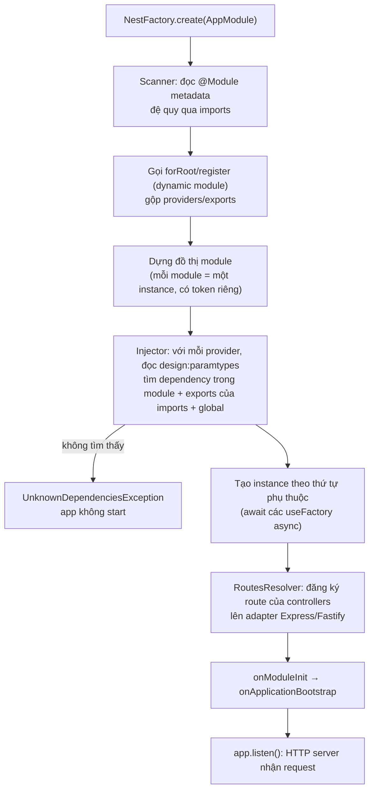
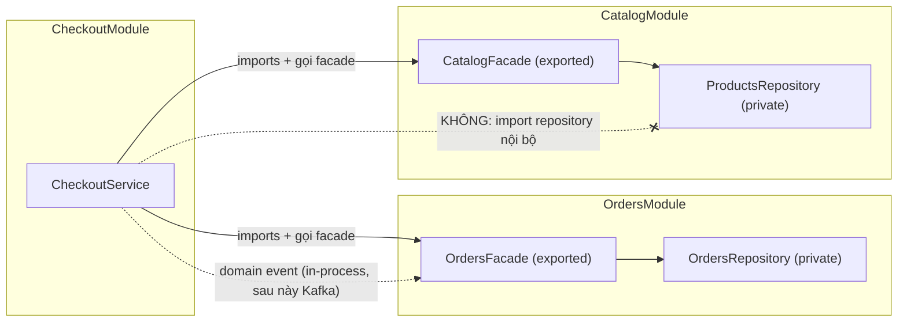

## Bối cảnh & vấn đề

Một team 12 người duy trì một API Express 3 năm tuổi. Mỗi người tổ chức code theo một kiểu: có router tự `require` model, có router gọi service, có service tự `new` một Redis client ngay trong file. Muốn viết unit test cho `OrdersService` thì phải mock cả module `redis` bằng `jest.mock`, vì không có chỗ nào để "truyền vào" một client giả. Người mới vào mất hai tuần chỉ để hiểu request đi qua những middleware nào. Và khi team muốn tách phần thanh toán ra thành service riêng, họ phát hiện 40 file ở khắp nơi import thẳng bảng `payments`.

Express không sai: nó là một thư viện routing tối giản và cố ý **không có ý kiến** về cấu trúc. Vấn đề là ở quy mô team lớn, "không có ý kiến" nghĩa là mỗi người tự đưa ra ý kiến của mình. **NestJS** giải quyết đúng khoảng trống đó: nó đưa vào một bộ quy ước bắt buộc (module, provider, controller), một **DI container** tạo và nối các object cho bạn, và một pipeline xử lý request có các tầng rõ ràng (guard, pipe, interceptor, filter). Bên dưới, HTTP vẫn chạy bằng Express hoặc Fastify.

Bài này đặt nền móng cho cả track: Nest đứng ở đâu so với Express, module thực sự đóng gói cái gì, dynamic module hoạt động ra sao, và làm sao dùng module để giữ ranh giới trong một modular monolith. DI chi tiết ở bài [Dependency injection](/tracks/nestjs/learn/dependency-injection), pipeline request ở bài [Request lifecycle](/tracks/nestjs/learn/request-lifecycle). Nền tảng về Express ở track [Express](/tracks/express), về TypeScript decorator ở track [TypeScript](/tracks/typescript).

**Interview angle:** câu mở đầu "NestJS là gì" nghe dễ, nhưng interviewer chờ bạn nói được "Nest chạy **trên** Express/Fastify" và "module là ranh giới của provider, không chỉ là cách chia thư mục".

## Khái niệm

### Nest là framework, Express/Fastify là platform

**NestJS** là framework Node.js viết bằng TypeScript, lấy cảm hứng từ Angular: code được tổ chức thành **module**, các class được đánh dấu bằng **decorator** (`@Controller`, `@Injectable`, `@Module`), và một **IoC container** (Inversion of Control, container tự tạo object thay vì bạn gọi `new`) quản lý vòng đời của chúng. Nest không tự viết HTTP server. Nó dùng một **platform adapter**: `@nestjs/platform-express` (mặc định) hoặc `@nestjs/platform-fastify`. Adapter dịch khái niệm của Nest (route, param, response) sang API của thư viện bên dưới.

Vì thế bạn vẫn lấy được `req`/`res` gốc (`@Req()`, `@Res()`), vẫn `app.use(helmet())` với Express, và vẫn gắn được một router Express cũ vào app Nest. Nest thêm cấu trúc, không thay thế nền tảng. Đổi adapter sang Fastify cho throughput HTTP tốt hơn, nhưng mọi middleware viết cho Express phải thay bằng plugin `@fastify/*` tương ứng (chi tiết ở bài [Performance & upgrade](/tracks/nestjs/learn/performance-upgrades)).

Cái giá của Nest: thêm một tầng abstraction, phụ thuộc vào **legacy decorator** và `reflect-metadata` của TypeScript, và một số "phép màu" (DI tự resolve, enhancer tự áp dụng) khó debug khi chưa hiểu cơ chế.

**Interview angle:** red flag kinh điển là "Nest thay thế Express và không dùng nó". Câu đúng: Nest là tầng kiến trúc chạy trên Express (mặc định) hoặc Fastify.

### Module: đơn vị đóng gói provider

**Module** là một class có decorator `@Module()` với bốn trường. `providers` là các class (hoặc giá trị) mà container sẽ tạo trong module này. `controllers` là các class đăng ký route. `imports` là các module khác mà module này cần dùng provider của chúng. `exports` là tập con các provider (hoặc module được re-export) mà module khác được phép dùng khi import module này.

Điểm quan trọng nhất: provider **mặc định là private** trong module khai báo nó. `imports: [PaymentsModule]` không tự động cho bạn thấy mọi provider của `PaymentsModule`; bạn chỉ thấy những gì nó `exports`. Đây chính là cơ chế **encapsulation** (đóng gói) của Nest, và là nguyên nhân số một của lỗi "Nest can't resolve dependencies" (bài [DI](/tracks/nestjs/learn/dependency-injection) phân tích lỗi này).

```ts
@Module({
  imports: [DatabaseModule],
  controllers: [OrdersController],
  providers: [OrdersService, OrdersRepository],
  exports: [OrdersService], // repository stays private to this module
})
export class OrdersModule {}
```

Module mặc định là **singleton**: dù `OrdersModule` được import ở mười chỗ, chỉ có một instance module và một instance `OrdersService` (với scope mặc định). Cái sai phổ biến là liệt kê cùng một service trong `providers` của hai module: Nest sẽ tạo **hai instance**, mỗi module một cái, và state nội bộ (cache in-memory, connection pool) bị nhân đôi.

### @Global(): tiện nhưng che dependency

`@Global()` đặt trên một module làm cho các provider nó `exports` có mặt ở mọi module mà không cần `imports`. Nó hợp với vài thứ thật sự là hạ tầng chung: config, logger, kết nối DB. `ConfigModule.forRoot({ isGlobal: true })` là ví dụ quen thuộc.

Vấn đề là global làm **mất thông tin dependency**. Nhìn vào `@Module` của `OrdersModule` bạn không còn biết nó phụ thuộc vào gì, công cụ phân tích đồ thị module không thấy cạnh đó, và ngày bạn muốn tách `OrdersModule` ra service riêng, bạn phải grep để tìm hết những gì nó ngầm dùng. Docs Nest cũng khuyên không nên làm mọi thứ global chỉ để bớt gõ `imports`.

### Dynamic module: module nhận cấu hình

Module thường (**static module**) có cấu hình cố định trong decorator. **Dynamic module** là module có một static method trả về object `DynamicModule` (`{ module, imports, providers, exports, global? }`), cho phép bên import truyền tham số vào. Nest gộp các trường trả về này với metadata của `@Module()` gốc.

Cộng đồng Nest dùng quy ước đặt tên:

- `forRoot(options)`: cấu hình **một lần** cho cả app, thường ở `AppModule`, thường global. Ví dụ `TypeOrmModule.forRoot()`, `ConfigModule.forRoot()`.
- `register(options)`: cấu hình **mỗi lần import**, mỗi bên import có thể có cấu hình riêng. Ví dụ `HttpModule.register({ timeout })`, `ClientsModule.register([...])`.
- `forFeature(...)`: bổ sung provider theo feature dựa trên cấu hình `forRoot` đã có. Ví dụ `TypeOrmModule.forFeature([Order])` tạo repository cho entity `Order` trong module hiện tại.
- Hậu tố `Async` (`forRootAsync`, `registerAsync`): nhận `useFactory` + `inject` (hoặc `useClass`/`useExisting`) khi cấu hình phụ thuộc vào provider khác, thường là `ConfigService`.

Viết tay `forRoot` + `forRootAsync` + token cho options khá dài. **`ConfigurableModuleBuilder`** (từ `@nestjs/common`) sinh sẵn class cơ sở với `register`/`registerAsync` (hoặc tên tuỳ chọn qua `setClassMethodName('forRoot')`) và một injection token cho options, nên module của bạn chỉ cần `extends ConfigurableModuleClass`.

**Interview angle:** follow-up hay gặp: "hai module cùng gọi `HttpClientModule.register()` với base URL khác nhau, có dùng chung instance không?". Không: mỗi lần `register` trả về một dynamic module với provider riêng, nên mỗi bên có một `HttpClient` riêng, cấu hình riêng.

### Nested route và RouterModule

Nest không có "nested controller" theo kiểu Express `router.use('/courses/:id/sections', sectionsRouter)`. Cách đơn giản nhất là đặt đường dẫn đầy đủ vào `@Controller('courses/:courseId/sections')` và đọc `courseId` bằng `@Param`. Khi muốn prefix theo module, `RouterModule.register([{ path: 'courses', module: CoursesModule, children: [{ path: ':courseId/sections', module: SectionsModule }] }])` gắn prefix cho mọi controller của từng module, nhờ đó controller không phải lặp lại tiền tố.

## Cơ chế hoạt động

Khi bạn gọi `NestFactory.create(AppModule)`, Nest đi qua các bước sau trước khi nhận request đầu tiên:



Diễn giải từng bước. **Scanner** bắt đầu từ `AppModule`, đọc metadata `@Module`, đi đệ quy vào từng module trong `imports`. Với dynamic module, giá trị trả về của `forRoot()`/`register()` đã được tính ngay lúc file được import (vì nó là một biểu thức trong decorator), và scanner gộp nó vào metadata. Kết quả là một **đồ thị module**: mỗi node là một module với tập provider của riêng nó, cạnh là quan hệ import.

**Injector** duyệt từng provider. Với mỗi tham số constructor, nó tìm provider tương ứng theo thứ tự: trong chính module đó, rồi trong các provider được **export** bởi module mà nó import, rồi trong các module global. Không tìm thấy là lỗi ngay lúc startup: app **không start**, điều này tốt hơn nhiều so với crash lúc request đầu tiên đến. Instance được tạo theo thứ tự phụ thuộc (dependency trước), và các `useFactory` async được `await` hết trước khi bước tiếp theo bắt đầu.

Sau khi mọi provider tồn tại, **RoutesResolver** đọc metadata của controller (`@Controller('orders')`, `@Get(':id')`) và đăng ký route vào adapter. Tới đây Nest mới gọi lifecycle hooks (bài [Config, lifecycle & shutdown](/tracks/nestjs/learn/config-lifecycle-shutdown)) và `listen()`.

Ranh giới module trong modular monolith dựa đúng vào cơ chế "chỉ thấy được những gì được export":



`CheckoutModule` chỉ có thể inject `OrdersFacade` và `CatalogFacade`, vì đó là thứ duy nhất được export. Nest chặn được việc **inject** repository nội bộ, nhưng không chặn được việc **import file** TypeScript: một dev vẫn có thể `import { ProductsRepository } from '../catalog/internal/products.repository'` và tự `new` nó. Vì vậy ranh giới cần thêm một lớp lint (eslint-plugin-boundaries, dependency-cruiser) kiểm tra đường dẫn import.

## Ví dụ thực tế

### Hai module cùng khai báo một provider

Đoạn code sau chạy thật trên Nest 12.1.1 (Node 24, biên dịch bằng `tsc` với `emitDecoratorMetadata`). `Counter` được liệt kê trong `providers` của cả `AModule` lẫn `BModule`:

```ts
let created = 0;
@Injectable() class Counter { id = ++created; }
@Injectable() class A { constructor(public c: Counter) {} }
@Injectable() class B { constructor(public c: Counter) {} }
@Module({ providers: [Counter, A], exports: [A] }) class AModule {}
@Module({ providers: [Counter, B], exports: [B] }) class BModule {}
@Module({ imports: [AModule, BModule] }) class DupRoot {}

const app = await NestFactory.createApplicationContext(DupRoot, { logger: false });
console.log('A.counter.id =', app.get(A).c.id, '| B.counter.id =', app.get(B).c.id, '| Counter instances =', created);
```

```text
A.counter.id = 1 | B.counter.id = 2 | Counter instances = 2
```

App khởi động bình thường, không có cảnh báo nào, nhưng có **hai** `Counter`. Nếu `Counter` là một cache in-memory, `A` ghi vào một cache còn `B` đọc từ cache kia. Cách đúng: một module sở hữu provider (`CounterModule` với `providers` + `exports`), các module khác `imports` nó.

### Dynamic module với register và ConfigurableModuleBuilder

```ts
// http-client.module-definition.ts
export interface HttpClientOptions { baseUrl: string; timeoutMs: number }
export const { ConfigurableModuleClass, MODULE_OPTIONS_TOKEN } =
  new ConfigurableModuleBuilder<HttpClientOptions>().build(); // gives register() + registerAsync()

// http-client.ts
@Injectable()
export class HttpClient {
  constructor(@Inject(MODULE_OPTIONS_TOKEN) private readonly opts: HttpClientOptions) {}
  get(path: string) {
    return fetch(new URL(path, this.opts.baseUrl), { signal: AbortSignal.timeout(this.opts.timeoutMs) });
  }
}

// http-client.module.ts
@Module({ providers: [HttpClient], exports: [HttpClient] })
export class HttpClientModule extends ConfigurableModuleClass {}

// usage in two feature modules
@Module({ imports: [HttpClientModule.register({ baseUrl: 'https://pay.example', timeoutMs: 2000 })] })
export class PaymentsModule {}
@Module({
  imports: [HttpClientModule.registerAsync({
    inject: [ConfigService],
    useFactory: (cfg: ConfigService) => ({ baseUrl: cfg.getOrThrow('SHIPPING_URL'), timeoutMs: 5000 }),
  })],
})
export class ShippingModule {}
```

Chạy thật trên Nest 12.1.1, với `Pay` và `Ship` là hai service inject `HttpClient` trong hai module đó, cùng app Express cũ ở ví dụ bên dưới:

```text
Pay baseUrl: https://pay.example | Ship baseUrl: https://ship.example | same HttpClient? false
GET /legacy/orders -> ["legacy express route"]
GET /api/orders -> ["nest route"]
```

Mỗi lần `register`/`registerAsync` trả về một dynamic module riêng, nên `PaymentsModule` và `ShippingModule` mỗi bên có một `HttpClient` với base URL riêng. Đó là hành vi mong muốn của `register`. Nếu bạn muốn một instance dùng chung toàn app, đặt tên method là `forRoot` (`setClassMethodName('forRoot')`), import một lần ở `AppModule` và đánh dấu global (`setExtras({ isGlobal: true }, ...)`).

### Chuyển dần một app Express sang Nest

Vì Nest chạy trên Express, bạn có thể đưa app Express hiện có vào làm "nền" cho Nest và chuyển từng route một (strangler fig pattern ngay trong một process):

```ts
import express from 'express';
import { ExpressAdapter } from '@nestjs/platform-express';
import { legacyRouter } from './legacy/routes'; // the old Express routers

const server = express();
server.use('/legacy', legacyRouter); // old routes keep working unchanged (the run above used one GET /legacy/orders)

const app = await NestFactory.create(AppModule, new ExpressAdapter(server));
app.setGlobalPrefix('api');           // new Nest routes live under /api
await app.listen(3000);
```

Lộ trình thường dùng:

1. **Characterization test** trước: viết test supertest ghi lại hành vi hiện tại (status, body, header) của các route sẽ chuyển.
2. Bọc các service cũ thành provider (`{ provide: LegacyBilling, useValue: legacyBillingInstance }`) để controller Nest inject được, thay vì viết lại ngay.
3. Chuyển từng feature, ưu tiên module ít phụ thuộc. Mỗi route chuyển xong thì chạy lại characterization test trên đường dẫn mới, sau đó cho gateway hoặc router trỏ sang.
4. Giữ chung các thứ xuyên suốt: định dạng token, định dạng lỗi, request id (AsyncLocalStorage), config.
5. Tiêu chí kết thúc: không còn traffic vào `/legacy` trong N ngày (đo bằng access log), rồi mới xoá router cũ.

Lưu ý phiên bản (verify): Nest 11 trở lên dùng **Express 5**. Nếu app cũ còn ở Express 4, route pattern kiểu `/files/*` và một số middleware có thể đổi hành vi khi chạy chung. Trên Nest 12.1.1, route `'/legacy/*'` khai báo trong controller Nest được tự convert sang `/legacy/{*path}` kèm một cảnh báo `LegacyRouteConverter`, nhưng router Express cũ bạn tự mount thì không được convert.

## Trade-offs & lựa chọn thay thế

| Tiêu chí | NestJS | Express (hoặc Fastify) thuần |
|---|---|---|
| Cấu trúc | Bắt buộc: module, provider, controller | Tự quyết; mỗi team một kiểu |
| Testability | DI sẵn: thay provider bằng mock khi test | Tự làm DI thủ công hoặc mock module |
| Onboarding team lớn | Nhanh nếu người mới đã biết Nest | Nhanh với service nhỏ, chậm với codebase lớn |
| Learning curve | Phải hiểu DI, scope, lifecycle, decorator | Thấp |
| Startup / cold start | Chậm hơn (scan module, resolve DI) | Nhanh |
| Hệ sinh thái | Module chính thức: config, microservices, GraphQL, schedule, TypeORM/Mongoose | Thư viện rời, tự ghép |
| Rủi ro dài hạn | Legacy decorator, upgrade major (Express 5, ESM-only ở v12) | Ít thay đổi breaking |
| `@Global()` | Tiện cho config/logger | Không áp dụng |

**Khi nào chọn gì.** Chọn Nest khi nhiều dev hoặc nhiều team cùng làm một codebase, domain phức tạp và sống lâu, bạn cần convention chung, DI cho test, và các tích hợp như microservices, queue, GraphQL. Chọn Express/Fastify thuần cho service nhỏ, function serverless nhạy cold start, edge worker, hoặc khi team nhỏ và kỷ luật muốn kiểm soát tối đa và tránh decorator. Đừng quyết định bằng cảm tính: làm một spike ngắn (một feature mẫu trên cả hai), đo thời gian làm, độ dễ test, overhead latency, rồi ghi lại bằng ADR (Architecture Decision Record).

Với modular monolith, lựa chọn thay thế là tách microservice ngay từ đầu. Monolith có module rõ ràng giữ được deploy đơn giản và transaction cục bộ, trong khi vẫn cho phép tách sau này. Tách sớm khi ranh giới domain chưa ổn định thường tạo ra "distributed monolith": nhiều service nhưng phải deploy cùng nhau.

## Edge cases & failure modes

- **Provider trùng ở nhiều module**: như ví dụ trên, không có lỗi, chỉ có hai instance. Triệu chứng thường là "cache lúc có lúc không" hoặc số connection DB gấp đôi dự kiến.
- **Re-export module**: `exports: [DatabaseModule]` cho phép module import bạn dùng luôn các export của `DatabaseModule`. Tiện, nhưng cũng làm ranh giới mờ đi nếu lạm dụng.
- **Dynamic module tính cấu hình lúc import file**: `ConfigModule.forRoot()` chạy ngay khi file `app.module.ts` được đánh giá, trước cả `NestFactory.create`. Code đọc `process.env` ở đó phải chắc chắn env đã được nạp.
- **Global module vẫn phải được import một lần**: `@Global()` chỉ bỏ nhu cầu import ở các module con; module global phải có mặt trong đồ thị (thường là trong `AppModule`).
- **Circular import giữa module** (Orders import Payments, Payments import Orders): Nest báo lỗi lúc scan hoặc resolve; `forwardRef(() => OtherModule)` giải quyết được, nhưng đó là dấu hiệu ranh giới sai (bài [DI](/tracks/nestjs/learn/dependency-injection)).
- **Ranh giới chỉ ở mức DI**: Nest không chặn import file trực tiếp hay query thẳng vào bảng của module khác. Thiếu lint và tách schema DB thì ranh giới chỉ tồn tại trên giấy.

## Pitfalls

- ❌ Nói "Nest thay thế Express" → ✅ Nest chạy trên adapter Express (mặc định) hoặc Fastify; `req/res` và middleware nền tảng vẫn dùng được.
- ❌ Thêm `PaymentsService` vào `providers` của `OrdersModule` để "sửa" lỗi resolve → ✅ `exports: [PaymentsService]` trong `PaymentsModule` và `imports: [PaymentsModule]`; thêm vào providers tạo instance thứ hai.
- ❌ Đánh dấu `@Global()` cho mọi module "cho tiện" → ✅ chỉ global cho hạ tầng thật sự chung (config, logger); module domain luôn import tường minh.
- ❌ Export repository ra ngoài module → ✅ export một facade/service hẹp; repository và entity là chi tiết nội bộ.
- ❌ Viết `forRoot` nhưng gọi nó ở nhiều feature module → ✅ `forRoot` một lần ở root, `register` cho cấu hình theo từng bên import, `forFeature` cho phần bổ sung theo feature.
- ❌ Big-bang rewrite từ Express sang Nest → ✅ mount app Express cũ vào `ExpressAdapter`, chuyển từng feature, có characterization test và tiêu chí xoá code cũ.
- ❌ Chọn Nest (hoặc Express) vì "trend" → ✅ spike nhỏ + tiêu chí đo + ADR; nêu rõ chi phí (learning curve, upgrade major).

## Tóm tắt

- Nest là framework kiến trúc (module, DI, decorator, enhancer) chạy trên Express hoặc Fastify qua platform adapter; nó thêm cấu trúc chứ không thay nền tảng HTTP.
- Module đóng gói provider: `providers` mặc định private, chỉ `exports` mới nhìn thấy được từ module import nó. Liệt kê một provider ở hai module tạo hai instance.
- `@Global()` bỏ bước import nhưng che dependency; chỉ dùng cho config, logger, DB.
- Dynamic module trả `DynamicModule`: `forRoot` (một lần, toàn app), `register` (mỗi lần import), `forFeature` (theo feature), `*Async` khi cần provider khác; `ConfigurableModuleBuilder` sinh sẵn phần boilerplate.
- Startup: scan module → dựng đồ thị → resolve DI (lỗi thì app không start) → đăng ký route → lifecycle hooks → listen.
- Modular monolith: module theo bounded context, export facade hẹp, giao tiếp qua facade hoặc domain event, thêm lint chặn import nội bộ và tách schema DB.
- Chọn Nest cho codebase lớn, nhiều team, domain sống lâu; Express/Fastify thuần cho service nhỏ, serverless nhạy cold start. Quyết định bằng spike và ADR.
- Chuyển từ Express sang Nest theo kiểu strangler: `ExpressAdapter(existingApp)`, characterization test, chuyển từng feature.
