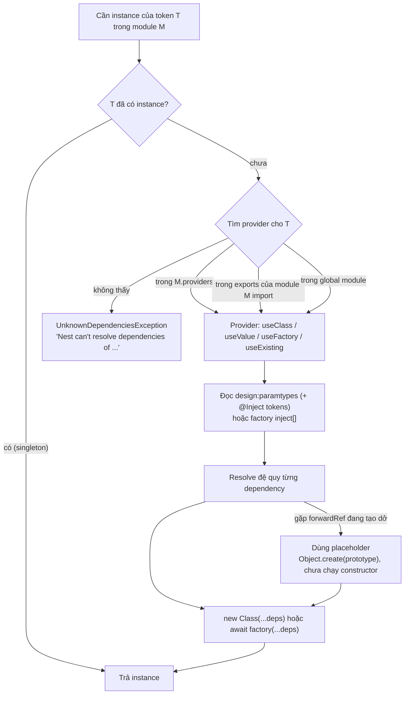

## Bối cảnh & vấn đề

Không có DI, một service thường tự tạo dependency của nó:

```ts
class CheckoutService {
  private gateway = new StripeGateway(process.env.STRIPE_KEY!); // tightly coupled
  private orders = new OrdersRepository(new Pool({ connectionString: process.env.DATABASE_URL }));
}
```

Ba hậu quả xuất hiện ngay. Muốn test `CheckoutService` thì phải có Stripe key và Postgres thật, hoặc hack `jest.mock` ở mức module. Muốn đổi Stripe sang Adyen cho một thị trường thì phải sửa chính `CheckoutService`. Và mỗi service tự tạo `Pool` riêng, nên app có năm pool với tổng 50 connection trong khi bạn tưởng là 10.

**Dependency injection** (DI) đảo ngược việc này: class chỉ **khai báo** nó cần gì (qua constructor), còn việc tạo và nối object là trách nhiệm của một **container**. Nest có container riêng và mọi thứ quan trọng trong Nest (service, guard, interceptor, repository) đều đi qua nó. Hiểu container chạy thế nào là chìa khoá để đọc được các lỗi startup khó hiểu nhất của Nest, và để trả lời các câu hỏi về circular dependency. Bài trước giới thiệu module như ranh giới của provider ([Kiến trúc & module](/tracks/nestjs/learn/architecture-modules)); bài này đi vào bên trong container.

**Interview angle:** interviewer hay hỏi "Nest biết inject gì vào constructor bằng cách nào?". Câu trả lời mạnh nhắc được `emitDecoratorMetadata` và `design:paramtypes`, không dừng ở "nhờ decorator @Injectable".

## Khái niệm

### Provider và container

**Provider** là bất cứ thứ gì container có thể tạo ra và inject: thường là một class có `@Injectable()`, nhưng cũng có thể là một giá trị, một object trả về từ factory, hay một alias. Mỗi provider được đăng ký dưới một **injection token** trong `providers` của một module. Container giữ một bảng token → instance cho từng module; với scope mặc định, instance là **singleton**: tạo một lần lúc startup, dùng chung cho cả app.

Khi `OrdersService` cần `OrdersRepository`, bạn chỉ viết `constructor(private repo: OrdersRepository) {}`. Container tìm provider có token `OrdersRepository` trong phạm vi module (xem bài trước về `exports`), tạo nó trước nếu chưa có (đệ quy xuống các dependency của nó), rồi truyền vào constructor.

### Container biết cần inject gì nhờ design:paramtypes

Kiểu TypeScript bị xoá khi compile, vậy làm sao Nest biết tham số đầu tiên là `OrdersRepository`? Câu trả lời là tuỳ chọn compiler **`emitDecoratorMetadata`**. Khi một class có decorator (bất kỳ decorator nào, `@Injectable()` chỉ là cái hay dùng), `tsc` emit thêm một dòng `__metadata("design:paramtypes", [OrdersRepository])` gắn **tham chiếu runtime** của kiểu từng tham số vào class, qua polyfill `reflect-metadata`. Nest đọc metadata này bằng `Reflect.getMetadata('design:paramtypes', OrdersService)`.

Hệ quả thực tế của cơ chế này:

- Cần `experimentalDecorators: true` và `emitDecoratorMetadata: true` trong `tsconfig`. Công cụ build không emit metadata (esbuild, và vì thế `tsx`; Node type stripping) làm DI hỏng. SWC có hỗ trợ khi bật `decoratorMetadata`.
- Kiểu tham số phải là **giá trị tồn tại lúc runtime** (class). `import type { X }` hoặc một `interface` không có giá trị runtime, nên metadata ghi `Object` (hoặc `Function`, tuỳ compiler), và Nest báo không tìm thấy dependency.
- `@Injectable()` không "đọc" constructor. Nó đánh dấu class là provider và (quan trọng hơn) là một decorator, nhờ đó `tsc` emit metadata cho class.

### Injection token: class, string, symbol

**Token** là khoá tra cứu trong container. Phổ biến nhất là chính class (`providers: [OrdersService]` là cách viết tắt của `{ provide: OrdersService, useClass: OrdersService }`). Khi thứ bạn inject không phải là class, hoặc bạn muốn inject theo một **interface**, dùng string hay symbol làm token và `@Inject(TOKEN)` ở tham số.

Vì interface bị xoá khi compile, `constructor(private gateway: PaymentGateway)` với `PaymentGateway` là interface sẽ không chạy: metadata ghi `Object`. Hai cách đúng: một **symbol** token + `@Inject(PAYMENT_GATEWAY)`, hoặc dùng **abstract class** làm "interface" (abstract class có giá trị runtime nên làm token được). Symbol an toàn hơn string vì không thể trùng tên vô tình giữa hai thư viện.

```ts
export const PAYMENT_GATEWAY = Symbol('PAYMENT_GATEWAY');
export interface PaymentGateway { charge(amountMinor: number, token: string): Promise<string> }

@Module({ providers: [{ provide: PAYMENT_GATEWAY, useClass: StripeGateway }], exports: [PAYMENT_GATEWAY] })
export class PaymentsModule {}

@Injectable()
export class CheckoutService {
  constructor(@Inject(PAYMENT_GATEWAY) private readonly gateway: PaymentGateway) {}
}
```

**Interview angle:** câu follow-up "sao không viết `private gateway: PaymentGateway`?" kiểm tra bạn có biết type erasure và metadata không. Trả lời: interface không tồn tại lúc runtime nên không làm token được.

### Bốn kiểu custom provider

- **`useClass`**: token trỏ tới một class, container tự `new` nó (và inject dependency của nó). Dùng để chọn implementation theo môi trường: `{ provide: MailService, useClass: isProd ? SesMailService : ConsoleMailService }`.
- **`useValue`**: token trỏ tới một giá trị có sẵn: hằng số, object cấu hình, instance tạo bên ngoài (một client của thư viện cũ), hoặc mock trong test.
- **`useFactory`** + `inject`: token trỏ tới **kết quả** của một hàm. `inject: [ConfigService]` liệt kê các token được truyền vào factory theo thứ tự. Factory có thể `async`: Nest **await** nó trước khi tạo bất kỳ provider nào phụ thuộc vào token này, nghĩa là app không nhận request cho tới khi, ví dụ, Redis đã connect xong.
- **`useExisting`**: token là **alias** cho một token khác, cả hai trỏ về cùng một instance. Dùng khi đổi tên token mà vẫn giữ tương thích, hoặc khi một class implement hai "interface" được inject bằng hai token.

Factory async là con dao hai lưỡi. Nó cho **fail fast**: Redis không kết nối được thì app không start, và orchestrator (Kubernetes) thấy ngay pod lỗi. Nhưng nó cũng làm chậm startup theo độ trễ kết nối, và nếu không có timeout, app treo ở bước khởi tạo mà không log gì.

### Circular dependency và forwardRef

**Circular dependency** là khi A cần B và B cần A. Container không có thứ tự nào để tạo: tạo A cần B có trước, tạo B cần A có trước. Có hai tầng vòng:

- **Vòng giữa provider**: `UsersService` ↔ `AuthService`. Nest báo lỗi lúc startup. `forwardRef(() => AuthService)` ở cả hai phía (`@Inject(forwardRef(() => X))`) cho phép container tạo một bên trước với một **placeholder** cho bên kia.
- **Vòng giữa module**: `UsersModule` import `AuthModule` và ngược lại. Cần `imports: [forwardRef(() => AuthModule)]` ở cả hai module.
- **Vòng ở mức file** (import vòng giữa hai file `.ts`, thường qua barrel `index.ts`): lúc decorator chạy, class bên kia chưa được định nghĩa. Với CommonJS, giá trị là `undefined` (lỗi Nest in ra `undefined` hoặc `?` ở index đó); với ESM, truy cập class trong TDZ ném `ReferenceError: Cannot access 'X' before initialization` ngay khi load file.

`forwardRef` là **băng keo**, không phải thiết kế. Docs Nest nói rõ thứ tự khởi tạo trong vòng là không xác định, nên code không được phụ thuộc vào việc bên kia đã được khởi tạo xong khi constructor chạy.

## Cơ chế hoạt động

Container resolve một provider theo sơ đồ sau:



Diễn giải: mỗi lần cần một token, container kiểm tra đã có instance chưa (singleton thì chỉ tạo một lần). Chưa có thì tìm **provider definition** theo đúng ba phạm vi: module hiện tại, export của module được import, và module global. Không thấy ở đâu cả là lỗi `UnknownDependenciesException`. Thấy thì đọc danh sách dependency: từ `design:paramtypes` (có thể bị ghi đè bởi `@Inject(TOKEN)` ở từng tham số) với `useClass`, hoặc từ mảng `inject` với `useFactory`. Resolve đệ quy từng cái rồi mới gọi `new` hoặc factory.

Nhánh `forwardRef` là chỗ tinh tế. Khi đang tạo `UsersService` và cần `AuthService` (cũng đang trong vòng), Nest không đợi được, nên nó đưa vào một object tạo bằng `Object.create(AuthService.prototype)`: một object **có method** (vì prototype), nhưng **constructor chưa chạy**, nên mọi field khởi tạo trong constructor hoặc class field (`hooks = []`) đều chưa tồn tại. Sau đó Nest chạy constructor thật trên chính object đó. Vì vậy trong constructor của `UsersService`, gọi `this.auth.registerHook()` có thể nổ, nhưng tới `onModuleInit` thì mọi thứ đã đầy đủ.

## Ví dụ thực tế

### Đọc lỗi "Nest can't resolve dependencies"

Code thật, Nest 12.1.1 (Node 24, `tsc` với `emitDecoratorMetadata`):

```ts
@Injectable() class ConfigService {}
@Injectable() class PaymentsService {}
@Module({ providers: [PaymentsService] }) class PaymentsModule {}          // forgot exports
@Injectable() class OrdersService { constructor(private p: PaymentsService, private c: ConfigService) {} }
@Module({ imports: [PaymentsModule], providers: [OrdersService, ConfigService] }) class OrdersModule {}

await NestFactory.createApplicationContext(OrdersModule, { abortOnError: false });
```

```text
Nest can't resolve dependencies of the OrdersService (?, ConfigService). Please make sure that the argument PaymentsService at index [0] is available in the OrdersModule module.

Potential solutions:
- Is OrdersModule a valid NestJS module?
- If PaymentsService is a provider, is it part of the current OrdersModule?
- If PaymentsService is exported from a separate @Module, is that module imported within OrdersModule?
```

Cách đọc: `(?, ConfigService)` là danh sách tham số constructor, `?` đánh dấu cái không resolve được. `index [0]` và tên `PaymentsService` cho biết đó là tham số nào. "in the OrdersModule module" (các bản cũ viết "in the OrdersModule context") cho biết phạm vi tìm kiếm. Ở đây `PaymentsModule` có provider nhưng không `exports`, nên fix là `exports: [PaymentsService]`. Thêm `PaymentsService` vào `providers` của `OrdersModule` cũng "hết lỗi", nhưng tạo instance thứ hai và kéo theo mọi dependency của nó vào `OrdersModule`.

Khi thay vì tên class, lỗi hiện `Object`, `Function` hay `undefined` ở index đó, nguyên nhân gần như luôn nằm ở metadata chứ không ở module. Chạy thật với `import type`:

```ts
import type { PaymentsService } from './payments.service.js'; // type-only: no runtime value
@Injectable() class OrdersService { constructor(private p: PaymentsService) {} }
console.log('design:paramtypes =', Reflect.getMetadata('design:paramtypes', OrdersService));
```

```text
design:paramtypes = [ [Function: Function] ]
Nest can't resolve dependencies of the OrdersService (?). Please make sure that the argument Function at index [0] is available in the M module.
```

Bảng chẩn đoán nhanh:

| Lỗi hiện | Nguyên nhân thường gặp |
|---|---|
| Tên class, module đúng | Quên `exports` ở module nguồn, hoặc quên `imports` |
| `Object` / `Function` | `import type`, interface làm kiểu tham số, build tool không emit metadata |
| `undefined` / `?` không tên | Circular import ở mức file (barrel `index.ts`), CommonJS |
| `ReferenceError ... before initialization` lúc load | Circular import ở mức file với ESM output |
| Token string/symbol | Chuỗi hoặc symbol không khớp giữa `provide` và `@Inject` |

### forwardRef: dependency có mặt nhưng chưa được khởi tạo

`UsersService` và `AuthService` ở hai file, phụ thuộc lẫn nhau qua `forwardRef`, và `UsersService` gọi `auth.registerHook()` ngay trong constructor. Chạy thật:

```ts
@Injectable()
export class AuthService {
  hooks: unknown[] = [];
  constructor(@Inject(forwardRef(() => UsersService)) public users: Ref<UsersService>) {
    console.log('AuthService ctor: users is', this.users?.constructor?.name);
  }
  registerHook(x: unknown) { this.hooks.push(x); console.log('hook registered'); }
}
@Injectable()
export class UsersService {
  constructor(@Inject(forwardRef(() => AuthService)) public auth: Ref<AuthService>) {
    console.log('UsersService ctor: auth.hooks =', this.auth.hooks, '| own keys:', Object.keys(this.auth));
    try { this.auth.registerHook(this); } catch (e) { console.log('UsersService ctor: registerHook threw', e.message); }
  }
  onModuleInit() { console.log('onModuleInit: auth.hooks =', this.auth.hooks); this.auth.registerHook(this); }
}
```

```text
UsersService ctor: auth.hooks = undefined | own keys: []
UsersService ctor: registerHook threw Cannot read properties of undefined (reading 'push')
AuthService ctor: users is UsersService
onModuleInit: auth.hooks = []
hook registered
```

`this.auth` **không** `undefined`: nó là placeholder có prototype `AuthService` (nên `registerHook` là function), nhưng constructor của `AuthService` chưa chạy nên `hooks` chưa tồn tại. Đổi thứ tự khai báo provider hay đổi thứ tự import có thể đảo ai được tạo trước, nên triệu chứng thấy "lúc có lúc không" như trong câu hỏi. Chuyển logic sang `onModuleInit` là fix tối thiểu.

`Ref<T>` ở đây là `type Ref<T> = T`. Nó cần thiết vì output là **ESM**: nếu viết thẳng `public auth: AuthService`, `tsc` emit `__metadata("design:paramtypes", [AuthService])`, và khi hai file import vòng nhau, dòng đó chạm vào class đang ở TDZ:

```text
ReferenceError: Cannot access 'UsersService' before initialization
    at file:///.../dist/e2b-auth.js:27:38
```

Generic alias làm `tsc` ghi `Object` vào metadata thay vì tham chiếu class (kỹ thuật giống `Relation<T>` của TypeORM), còn `forwardRef` cung cấp token thật. Đây là một điểm khác biệt quan trọng khi dự án chuyển sang ESM (Nest 12 ship ESM-only).

**Fix đúng về thiết kế** thường không phải `forwardRef`: tách phần dùng chung ra service thứ ba (ví dụ `PasswordHasher`, `TokenService`), đảo một chiều phụ thuộc bằng event (`UserRegistered` → Auth lắng nghe), hoặc gộp hai service nếu thực ra chúng là một concept. Vòng Users ↔ Auth thường chỉ ra Auth đang làm cả việc "quản lý user" (tạo user khi đăng ký), hoặc Users đang làm việc của Auth (kiểm tra mật khẩu).

### Factory provider cho client cần kết nối

```ts
export const REDIS = Symbol('REDIS');

@Module({
  providers: [{
    provide: REDIS,
    inject: [ConfigService],
    useFactory: async (cfg: ConfigService) => {
      const client = createClient({ url: cfg.getOrThrow('REDIS_URL'), socket: { connectTimeout: 5_000 } });
      await client.connect();            // app does not start until this resolves
      return client;
    },
  }],
  exports: [REDIS],
})
export class RedisModule implements OnApplicationShutdown {
  constructor(@Inject(REDIS) private readonly redis: RedisClientType) {}
  async onApplicationShutdown() { await this.redis.quit(); } // factory-made clients need explicit cleanup
}
```

Container không biết cách "đóng" một object do factory trả về, nên việc đóng kết nối là trách nhiệm của bạn, thường đặt ở `onApplicationShutdown` của module sở hữu provider (chi tiết ở bài [Config, lifecycle & shutdown](/tracks/nestjs/learn/config-lifecycle-shutdown)). `connectTimeout` tránh cho app treo vô hạn ở bước khởi tạo khi Redis không trả lời.

## Trade-offs & lựa chọn thay thế

| Lựa chọn | Ưu | Nhược | Dùng khi |
|---|---|---|---|
| Class token | Ngắn, type-safe, tự suy ra | Consumer gắn với class cụ thể | Service nội bộ bình thường |
| Symbol + interface | Consumer chỉ biết interface; thay implementation dễ | Phải `@Inject(TOKEN)` mỗi chỗ | Cổng ra ngoài (payment, mail, storage) |
| Abstract class làm token | Không cần `@Inject`, vẫn tách interface | Abstract class có mặt ở runtime | Muốn gọn mà vẫn tách implementation |
| `useFactory` async | Fail fast, cấu hình từ provider khác | Chậm startup; phải tự đóng tài nguyên | Client cần connect: Redis, Kafka producer |
| `useValue` | Đơn giản nhất | Không có DI cho chính giá trị đó | Hằng số, config, mock, instance có sẵn |
| `forwardRef` | Sửa nhanh vòng phụ thuộc | Thứ tự khởi tạo không xác định; che thiết kế sai | Tạm thời, kèm ticket refactor |
| Tách service thứ ba / event | Hết vòng, ranh giới rõ | Tốn công refactor | Cách sửa vòng lâu dài |
| Không dùng DI container (Express + composition root) | Không decorator, không metadata | Tự nối object thủ công | Service nhỏ, không dùng Nest |

**Về legacy decorator (câu hỏi dài hạn).** Nest dựa trên `experimentalDecorators` (decorator kiểu cũ của TypeScript) và `emitDecoratorMetadata`. TC39 **standard decorators** (TypeScript 5.0+) khác về API, **không có parameter decorator** (thứ `@Inject()`, `@Body()`, `@Param()` cần) và **không emit metadata kiểu**. Node type stripping (`node file.ts`) chỉ xoá kiểu, không biến đổi decorator, nên không chạy được code Nest trực tiếp. Rủi ro là phụ thuộc vào một tính năng "experimental" lâu dài. Thực tế, TypeScript vẫn hỗ trợ cờ này (kể cả `tsc` 7.0.2 dùng trong các thí nghiệm của track này) và hệ sinh thái (Angular cũ, TypeORM, class-validator) quá lớn để bị bỏ đột ngột (verify theo roadmap của TypeScript). Cách giảm rủi ro: giữ **domain logic là TypeScript thuần** không decorator, Nest chỉ ở lớp ngoài (controller, module, adapter), và dùng validation bằng schema (zod) nếu muốn bớt decorator.

## Edge cases & failure modes

- **Build tool không emit metadata**: chạy dev bằng `tsx`/esbuild, `vite-node` hay Node type stripping làm mọi constructor injection không có `@Inject` explicit nhận `undefined` hoặc lỗi resolve. Dùng `tsc`, `nest start` (tsc hoặc SWC với `decoratorMetadata`).
- **`isolatedModules` + `import type` tự động**: một số lint rule hoặc IDE tự đổi `import { X }` thành `import type { X }` vì `X` "chỉ dùng làm kiểu". Với class dùng ở constructor, đó là bug. Tắt autofix đó (ví dụ `consistent-type-imports` với `fixStyle` phù hợp) hoặc để `emitDecoratorMetadata` giữ import.
- **Async factory treo**: không có timeout kết nối, app đứng ở bước tạo provider, không listen, health check timeout, pod bị restart liên tục mà log chỉ có dòng khởi động.
- **Hai token string trùng tên** từ hai thư viện: provider sau ghi đè provider trước trong cùng module. Dùng symbol.
- **Circular + request scope**: docs cảnh báo vòng phụ thuộc kết hợp request-scoped provider dễ dẫn tới dependency `undefined`. Tránh kết hợp này.
- **ESM và import vòng**: code chạy ổn ở CJS có thể ném `ReferenceError` khi chuyển sang ESM, vì metadata chạm vào class trong TDZ thay vì nhận `undefined`.

## Pitfalls

- ❌ `constructor(private gateway: PaymentGateway)` với interface → ✅ symbol token + `@Inject(PAYMENT_GATEWAY)`, hoặc abstract class làm token.
- ❌ `import type { OrdersRepository }` cho class inject qua constructor → ✅ import giá trị; `import type` xoá tham chiếu runtime mà metadata cần.
- ❌ Chạy app Nest bằng `tsx` hoặc Node type stripping → ✅ `tsc`/SWC với decorator metadata; kiểm tra `experimentalDecorators` và `emitDecoratorMetadata`.
- ❌ Sửa lỗi resolve bằng cách copy provider vào `providers` của module khác → ✅ `exports` ở module sở hữu và `imports` ở module dùng.
- ❌ `forwardRef` rồi gọi dependency trong constructor → ✅ chỉ gán, dùng trong `onModuleInit` hoặc lúc xử lý request; tốt hơn là bỏ vòng.
- ❌ Barrel `index.ts` re-export mọi thứ trong một feature → ✅ import trực tiếp file cần dùng; barrel dễ tạo vòng import ở mức file.
- ❌ Factory tạo client mà không đóng khi shutdown → ✅ đóng trong `onApplicationShutdown` của module sở hữu.

## Tóm tắt

- DI: class khai báo dependency qua constructor, container tạo và nối object; mặc định singleton, tạo một lần lúc startup.
- Nest biết cần inject gì nhờ `emitDecoratorMetadata` emit `design:paramtypes`; interface, `import type` và build tool không emit metadata làm DI hỏng.
- Token là khoá tra cứu: class, string hoặc symbol (`@Inject(TOKEN)`); interface không làm token được.
- `useClass` (chọn implementation) · `useValue` (hằng số, mock) · `useFactory` + `inject` (có thể async, được await trước khi app start) · `useExisting` (alias).
- Đọc lỗi resolve: `?` ở vị trí nào, tên kiểu là gì, trong module nào. Tên class thì thường là thiếu `exports`/`imports`; `Object`/`Function`/`undefined` thì là metadata hoặc import vòng.
- `forwardRef` cho vòng provider/module; bên kia là placeholder chưa chạy constructor, nên không dùng nó trong constructor. Sửa lâu dài bằng tách service, event, hoặc gộp.
- Legacy decorator và `reflect-metadata` là rủi ro dài hạn; giữ domain thuần TypeScript để giảm phụ thuộc vào Nest.
