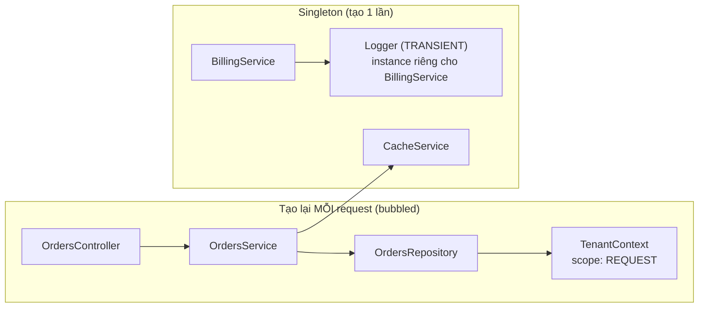
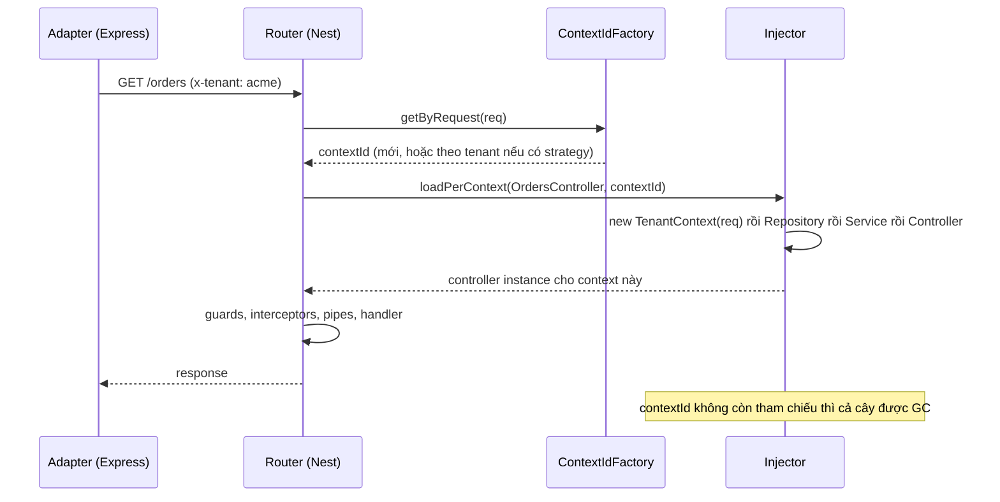

## Bối cảnh & vấn đề

Một API multi-tenant cần biết "request này của tenant nào" ở tầng repository để thêm `WHERE tenant_id = $1`. Một dev làm cách nhanh nhất: tạo `TenantContext` với `scope: Scope.REQUEST`, inject `REQUEST` để đọc header, rồi inject `TenantContext` vào `OrdersRepository`. Code chạy đúng, review pass. Một tuần sau, dashboard cho thấy p99 latency của **toàn bộ** API tăng, thời gian GC tăng, dù chỉ có repository của orders bị sửa. Rồi job `@Cron` chạy lúc 2 giờ sáng bắt đầu fail với lỗi `Cannot read properties of undefined (reading 'headers')`.

Cả hai triệu chứng có cùng một gốc: **request scope lan ngược** lên mọi thứ phụ thuộc vào nó, và provider request-scoped chỉ tồn tại khi có một HTTP request. Bài này giải thích ba scope của Nest, cơ chế lan ngược, đo chi phí thật, và các lựa chọn thay thế (tham số explicit, AsyncLocalStorage, durable providers) cho bài toán "context theo request" mà hầu như app nào cũng gặp. Nền tảng DI ở bài [Dependency injection](/tracks/nestjs/learn/dependency-injection).

**Interview angle:** red flag là "cần request scope để truy cập request ở bất cứ đâu". Câu trả lời senior bắt đầu bằng "mặc định singleton, và request context nên đi qua AsyncLocalStorage hoặc tham số".

## Khái niệm

### DEFAULT: singleton cho cả app

Scope mặc định (`Scope.DEFAULT`) nghĩa là **một instance duy nhất** cho toàn app, tạo lúc startup và giữ tới khi app tắt. Đây là lựa chọn nhanh nhất: không có chi phí tạo object theo request, và các instance được cache sẵn. Docs Nest khuyến nghị dùng singleton cho hầu hết trường hợp.

Điều kiện bắt buộc: singleton phải **stateless theo request**. Node xử lý nhiều request đồng thời trên một process (các request xen kẽ nhau ở mỗi `await`), nên `this.currentTenant = req.tenantId` trong một singleton nghĩa là request B ghi đè giá trị của request A trong lúc A đang `await` query. A tiếp tục chạy và đọc tenant của B: đây là **data leak giữa tenant**, không phải bug hiệu năng. Field của singleton chỉ nên chứa thứ dùng chung thật sự: client, config, cache có khoá rõ ràng.

### REQUEST: một instance mỗi request

`@Injectable({ scope: Scope.REQUEST })` làm Nest tạo **instance mới cho mỗi request** đến, và bỏ nó (để GC thu hồi) khi request xong. Provider request-scoped có thể inject token `REQUEST` (object request gốc của Express/Fastify), hoặc `CONTEXT` với GraphQL.

Điểm quan trọng là **scope bubbling** (lan ngược): một provider phụ thuộc vào provider request-scoped thì chính nó cũng phải request-scoped, vì nó không thể giữ một tham chiếu cố định tới thứ thay đổi theo từng request. Docs nói rõ: "A controller that depends on a request-scoped provider is itself request-scoped." Chuỗi `OrdersController → OrdersService → OrdersRepository → TenantContext` trở thành bốn object được tạo lại mỗi request, kèm mọi thứ khác trong chuỗi. Những provider không phụ thuộc (trực tiếp hay gián tiếp) vào `TenantContext` vẫn là singleton.

Ngoài chi phí, request scope còn có giới hạn chức năng: **lifecycle hooks không được gọi** cho class request-scoped (docs Lifecycle events), và provider request-scoped không thể dùng ở nơi không có HTTP request. Docs Injection scopes liệt kê WebSocket gateway, Passport strategy và cron controller phải là singleton; migration guide của Nest 12 ghi rằng WebSocket gateway bắt đầu hỗ trợ request-scoped provider (verify khi bạn dùng gateway).

### TRANSIENT: mỗi consumer một instance

`Scope.TRANSIENT` nghĩa là **mỗi class inject nó nhận một instance riêng**, không chia sẻ. Khác với REQUEST, transient **không lan ngược**: `BillingService` (singleton) inject một `Logger` transient vẫn là singleton, nó chỉ có `Logger` của riêng mình, tạo một lần lúc startup. Use case kinh điển là logger có context theo class dùng nó: kết hợp với token `INQUIRER` để biết "ai đang inject mình".

### Request context không cần request scope

Có ba cách mang thông tin theo request (tenant, user, correlation id) mà không làm cả đồ thị thành request-scoped:

- **Tham số explicit**: `ordersService.list(tenantId, filters)`. Rõ ràng nhất, test dễ nhất, không có phép màu. Nhược điểm là phải truyền qua nhiều tầng ("prop drilling").
- **AsyncLocalStorage** (ALS, module `node:async_hooks`): lưu một "store" gắn với chuỗi async hiện tại. Middleware gọi `als.run(store, next)`, và mọi code chạy trong chuỗi async đó (kể cả sau nhiều `await`) đọc được `als.getStore()`. Service vẫn là singleton, chỉ đọc context hiện tại khi cần. Thư viện `nestjs-cls` đóng gói pattern này cho Nest (middleware, guard hoặc interceptor để set context; hỗ trợ cả HTTP, microservice, cron).
- **Durable providers**: vẫn là request scope, nhưng Nest **gom các request có chung thuộc tính** (thường là tenant) về một DI sub-tree dùng lại, thay vì tạo cây mới mỗi request.

### Durable providers và ContextIdStrategy

**Context id** là khoá Nest dùng để quyết định "cây DI nào" phục vụ một request: mặc định mỗi request một context id mới, nên mỗi request một cây mới. Một **`ContextIdStrategy`** (đăng ký bằng `ContextIdFactory.apply(strategy)`) cho phép bạn trả về context id **theo tenant**: request của `acme` luôn dùng cùng một context id, nên các provider đánh dấu `durable: true` chỉ được tạo **một lần mỗi tenant**. Strategy cũng trả về một `payload` (ví dụ `{ tenant }`) được inject thay cho `REQUEST` trong cây durable.

Đánh đổi: bộ nhớ tăng theo số tenant (mỗi tenant giữ một cây instance, có khi kèm một connection pool), và không có cơ chế tự dọn tenant không còn hoạt động. Với 5.000 tenant, mỗi tenant một pool 5 connection là 25.000 connection: không database nào chịu nổi.

## Cơ chế hoạt động



Sơ đồ đọc từ phải sang trái để thấy lan ngược: `TenantContext` là REQUEST, nên `OrdersRepository` (phụ thuộc nó) phải REQUEST, nên `OrdersService`, rồi `OrdersController`. `CacheService` được `OrdersService` dùng nhưng không phụ thuộc vào `TenantContext`, nên vẫn là singleton: instance singleton được inject vào mỗi instance `OrdersService` mới. `Logger` transient không kéo `BillingService` thành transient.

Với mỗi request đến một route của `OrdersController`, Nest làm như sau:



Mỗi request: một context id, một lượt resolve cả chuỗi (constructor chạy lại, dependency được tra cứu lại), rồi mới vào pipeline guard/pipe/handler. Khi request kết thúc, cây instance không còn ai giữ và thành rác cho GC. Với durable strategy, bước `getByRequest` trả về context id **đã có** của tenant, nên nhánh durable không bị tạo lại.

Các nơi không có HTTP request (cron, Kafka consumer, script) không đi qua router, nên không ai tạo context id hay đăng ký `REQUEST`. Muốn dùng provider request-scoped ở đó, bạn phải tự tạo: `const contextId = ContextIdFactory.create()`, `moduleRef.registerRequestByContextId(fakeReq, contextId)`, rồi `await moduleRef.resolve(X, contextId)`.

## Ví dụ thực tế

### Đếm instance: lan ngược, transient, và lỗi ngoài request

Chạy thật trên Nest 12.1.1. `TenantContext` là REQUEST, đọc header `x-tenant`; `OrdersRepository → TenantContext`, `OrdersService → OrdersRepository + CacheService`, controller → service. Thêm `Logger` transient (inject `INQUIRER`) cho hai service khác. Mỗi constructor tăng một bộ đếm:

```ts
@Injectable({ scope: Scope.REQUEST })
class TenantContext { tenant: string; constructor(@Inject(REQUEST) req: any) { count('TenantContext'); this.tenant = req.headers['x-tenant'] ?? 'none'; } }
@Injectable() class CacheService { constructor() { count('CacheService'); } }
@Injectable() class OrdersRepository { constructor(private t: TenantContext) { count('OrdersRepository'); } find() { return `orders of ${this.t.tenant}`; } }
@Injectable() class OrdersService { constructor(private repo: OrdersRepository, private cache: CacheService) { count('OrdersService'); } list() { return this.repo.find(); } }
@Injectable({ scope: Scope.TRANSIENT })
class Logger { ctx = '?'; constructor(@Inject(INQUIRER) parent: object) { count('Logger'); this.ctx = parent?.constructor?.name; } }
@Injectable() class BillingService { constructor(public log: Logger) {} }
@Injectable() class ShippingService { constructor(public log: Logger) {} }
// ... 3 requests, then:
ref.get(OrdersService);                              // static lookup
await ref.resolve(OrdersService);                    // no request registered, like a cron job
const ctxId = ContextIdFactory.create();
ref.registerRequestByContextId({ headers: { 'x-tenant': 'from-test' } }, ctxId);
await ref.resolve(OrdersService, ctxId);             // twice
```

```text
after bootstrap: {"CacheService":1,"Logger":2}
GET /orders (x-tenant: acme) -> orders of acme
GET /orders (x-tenant: globex) -> orders of globex
GET /orders (x-tenant: acme) -> orders of acme
after 3 requests: {"CacheService":1,"Logger":2,"TenantContext":3,"OrdersRepository":3,"OrdersService":3,"OrdersController":3}
transient: BillingService / ShippingService | same instance? false
moduleRef.get(OrdersService) -> InvalidClassScopeException: OrdersService is marked as a scoped provider. Request and transient-scoped providers can't be used in combination with "get()" method. Please, use "resolve()" instead.
resolve() outside a request (like a cron job) -> TypeError: Cannot read properties of undefined (reading 'headers')
resolve(ctxId) twice, same? true | orders of from-test
```

Đọc từng dòng. Lúc bootstrap, controller, service và repository **chưa được tạo** (không có trong bộ đếm) vì chúng đã bị lan ngược thành request-scoped. Sau ba request, mỗi class trong chuỗi được tạo ba lần, còn `CacheService` vẫn là một. `Logger` transient có hai instance cho hai consumer, mỗi cái biết consumer của mình qua `INQUIRER`. `moduleRef.get()` từ chối provider scoped (đây là lý do test phải dùng `resolve()`, xem bài [Testing](/tracks/nestjs/learn/testing)). Và dòng quan trọng nhất: `resolve()` ở ngoài request làm `REQUEST` là `undefined`, đúng lỗi mà job cron ở phần Bối cảnh gặp phải.

### Chi phí đo được

Chuỗi 8 provider phụ thuộc một `Ctx`, handler không có I/O, đo bằng `autocannon` (50 connection, 8 giây, cùng một máy macOS, Node 24, chạy hai lần; số tuyệt đối phụ thuộc máy):

```text
singleton chain     : 13970 req/s, p50 3 ms, p99 7 ms
REQUEST-scoped chain: 8661 req/s, p50 5 ms, p99 15 ms
singleton chain     : 13887 req/s, p50 3 ms, p99 9 ms
REQUEST-scoped chain: 7289 req/s, p50 5 ms, p99 21 ms
```

Throughput giảm khoảng 40–48% và p99 tăng gấp đôi. Con số này là **trường hợp xấu nhất** (handler không làm gì ngoài tạo object); docs Nest nói một app thiết kế tốt dùng request-scoped provider không nên tăng latency quá khoảng 5%, vì thời gian thật thường nằm ở DB và network. Nhưng điểm mấu chốt là chi phí nhân theo **độ dài chuỗi bị lan ngược**: inject `TenantContext` vào một repository nền tảng dùng khắp nơi có thể kéo hàng trăm provider vào vòng tạo lại mỗi request, kèm allocation và áp lực GC.

### Hai lựa chọn thay thế: durable providers và AsyncLocalStorage

Chạy thật: `/reports` dùng durable provider với `ContextIdStrategy` gom theo header `x-tenant`; `/invoices` dùng một singleton đọc tenant từ `AsyncLocalStorage` được set bởi middleware.

```ts
const tenants = new Map<string, ContextId>();
class AggregateByTenant implements ContextIdStrategy {
  attach(contextId: ContextId, request: any) {
    const tenant = request.headers['x-tenant'] as string;
    let tenantSubTreeId = tenants.get(tenant);
    if (!tenantSubTreeId) { tenantSubTreeId = ContextIdFactory.create(); tenants.set(tenant, tenantSubTreeId); }
    return { resolve: (info: HostComponentInfo) => (info.isTreeDurable ? tenantSubTreeId! : contextId), payload: { tenant } };
  }
}
ContextIdFactory.apply(new AggregateByTenant());

@Injectable({ scope: Scope.REQUEST, durable: true })
class TenantDb { constructor(@Inject(REQUEST) public payload: { tenant: string }) { count('TenantDb(durable)'); } }

const als = new AsyncLocalStorage<{ tenant: string }>();
class AlsMiddleware implements NestMiddleware { use(req: any, _res: any, next: () => void) { als.run({ tenant: req.headers['x-tenant'] }, next); } }
@Injectable() class TenantCtx { get tenant() { return als.getStore()?.tenant; } }
```

Bốn request mỗi route (acme, globex, acme, acme):

```text
GET /reports x-tenant=acme -> acme
GET /reports x-tenant=globex -> globex
...
GET /invoices x-tenant=acme -> acme
{"InvoicesService":1,"InvoicesController":1,"TenantDb(durable)":2,"ReportsService":2,"ReportsController":2}
```

Durable: tám request nhưng chỉ **hai** cây (một cho `acme`, một cho `globex`), vì chuỗi phụ thuộc cũng thành durable theo. ALS: controller và service là singleton, **một** instance, và vẫn đọc đúng tenant của từng request. Đây là lý do ALS thường là mặc định tốt cho logger, correlation id và tenant id: nó chạy được cả ở cron và consumer, chỉ cần set store ở đầu mỗi job hoặc mỗi message (`als.run({ tenant, correlationId: msg.headers.id }, () => handle(msg))`).

### Sửa job cron và Kafka consumer

Logger request-scoped kéo mọi service dùng nó thành request-scoped, và service đó được dùng trong `@Cron` và `@EventPattern`. Các bước sửa:

1. Logger trở lại singleton, đọc `requestId`/`tenantId` từ ALS (hoặc `ClsService` của `nestjs-cls`). Muốn context theo class thì dùng TRANSIENT + `INQUIRER`, không dùng REQUEST.
2. HTTP: middleware (hoặc `ClsModule` mount middleware) set store từ header.
3. Cron: bọc thân job bằng `als.run({ requestId: randomUUID(), job: 'nightly-report' }, ...)`.
4. Kafka: interceptor hoặc đầu handler set store từ header của message, để mỗi message có correlation id riêng trong log.
5. Nếu buộc phải dùng provider request-scoped trong job: tạo scope thủ công bằng `ContextIdFactory.create()` + `registerRequestByContextId` + `moduleRef.resolve(X, contextId)`, như dòng cuối của ví dụ đếm instance.

### Thiết kế multi-tenancy trong Nest

Ba câu hỏi phải trả lời riêng:

- **Resolution** (tenant là ai): lấy từ **claim trong JWT** đã verify, trong một guard (sau authentication). Nếu URL hoặc subdomain cũng chứa tenant, đối chiếu và trả 403 khi không khớp; không bao giờ tin header `x-tenant` từ client một mình.
- **Propagation** (mang tenant đi đâu): tham số explicit cho domain service, ALS cho các tầng hạ tầng (logger, repository base, cache key). Request-scoped `TenantContext` là lựa chọn đắt nhất; durable provider hợp khi mỗi tenant có tài nguyên riêng (connection, config).
- **Data isolation**: shared schema + cột `tenant_id` + **Row Level Security** trong PostgreSQL (`SET LOCAL app.tenant_id = $1` ở đầu mỗi transaction, policy `USING (tenant_id = current_setting('app.tenant_id')::uuid)`); schema-per-tenant; hoặc DB-per-tenant (durable provider giữ pool theo tenant, cần giới hạn số pool đang mở và đóng pool nhàn rỗi). Chi tiết hơn ở track [Multi-tenancy](/tracks/multi-tenancy).

Phần dễ quên là cross-cutting: cache key phải có tenant (`t:{tenant}:product:{id}`), message trên queue phải mang tenant trong header, job chạy theo từng tenant phải tự set context. Và phải có **test tự động chống truy cập chéo tenant**: tạo dữ liệu cho hai tenant, gọi mọi endpoint list/get bằng token của tenant A, khẳng định không có id nào của tenant B xuất hiện.

## Trade-offs & lựa chọn thay thế

| Cách mang context | Chi phí runtime | Hoạt động ngoài HTTP | Độ rõ ràng | Rủi ro |
|---|---|---|---|---|
| Tham số explicit | Không | Có | Cao nhất | Truyền qua nhiều tầng |
| AsyncLocalStorage / `nestjs-cls` | Rất thấp | Có, nếu set store ở đầu job/message | Trung bình ("ngầm") | Quên set store → `undefined`; mất context nếu code thoát khỏi chuỗi async |
| REQUEST-scoped provider | Tạo lại cả chuỗi mỗi request | Không (phải tạo scope thủ công) | Cao | Lan ngược, không có lifecycle hook, latency + GC |
| Durable provider theo tenant | Một cây mỗi tenant | Không trực tiếp | Trung bình | Bộ nhớ và connection tăng theo số tenant |
| TRANSIENT | Một instance mỗi consumer, lúc startup | Có | Cao | Không phải context theo request |

Chọn thế nào: mặc định **singleton + tham số explicit** cho domain logic, **ALS** cho thông tin xuyên suốt (logger, correlation id, tenant ở tầng hạ tầng). Dùng **durable provider** khi mỗi tenant cần tài nguyên riêng và số tenant có giới hạn. Chỉ dùng **REQUEST scope thường** khi provider thật sự cần object request gốc và chuỗi phụ thuộc của nó ngắn, và luôn đo trước/sau (p99, heap, số instance).

## Edge cases & failure modes

- **Singleton giữ state theo request**: dưới tải đồng thời, request này đọc tenant hoặc user của request khác. Không có lỗi nào được ném ra; chỉ có dữ liệu sai.
- **Lan ngược âm thầm**: một PR thêm `@Inject(REQUEST)` vào một provider nền tảng làm hàng trăm class khác thành request-scoped, không có cảnh báo nào lúc build hay startup.
- **Lifecycle hooks không chạy** cho class request-scoped: `onModuleInit` để warm cache trong một service vừa bị lan ngược sẽ không bao giờ được gọi nữa.
- **Cron, consumer, script** gọi service bị lan ngược: `REQUEST` là `undefined`, lỗi chỉ xuất hiện khi job chạy (thường là giữa đêm).
- **ALS bị mất context**: callback được đăng ký từ trước khi `als.run` (event emitter tạo lúc startup, pool connection tái sử dụng với callback cũ) chạy ngoài store. Đọc `getStore()` trả `undefined`; logger nên có giá trị mặc định rõ ràng thay vì crash.
- **Durable với nhiều tenant**: không có eviction; memory và connection tăng tuyến tính theo tenant từng truy cập kể từ lần deploy gần nhất.
- **Passport strategy request-scoped**: docs cấm; strategy phải là singleton.

## Pitfalls

- ❌ `this.currentTenant = req.tenantId` trong service singleton → ✅ truyền tenant qua tham số hoặc đọc từ ALS trong lúc xử lý.
- ❌ Inject `REQUEST` vào repository dùng chung để lấy tenant → ✅ ALS hoặc tham số; nếu mỗi tenant cần tài nguyên riêng thì durable provider.
- ❌ Logger request-scoped để có request id → ✅ logger singleton đọc request id từ ALS; TRANSIENT + `INQUIRER` nếu cần context theo class.
- ❌ `moduleRef.get()` cho provider scoped trong test → ✅ `await moduleRef.resolve(X, contextId)`.
- ❌ Tin header `x-tenant` từ client → ✅ lấy tenant từ JWT đã verify, đối chiếu với URL/subdomain.
- ❌ Pool connection cho mỗi tenant không giới hạn → ✅ giới hạn số pool, đóng pool nhàn rỗi, hoặc shared schema + RLS với một pool chung.
- ❌ Nghĩ "request scope chỉ tốn vài %" mà không đo → ✅ benchmark trước/sau; chi phí nhân theo độ dài chuỗi bị lan ngược.

## Tóm tắt

- Ba scope: DEFAULT (singleton, mặc định, nhanh nhất, phải stateless), REQUEST (instance mới mỗi request, inject được `REQUEST`), TRANSIENT (mỗi consumer một instance, không lan ngược).
- REQUEST lan ngược: mọi thứ phụ thuộc trực tiếp hay gián tiếp vào nó thành request-scoped và được tạo lại mỗi request.
- Đo thật: chuỗi 9 provider request-scoped với handler rỗng giảm ~40% throughput; app thật thường chỉ vài % vì I/O chiếm phần lớn, nhưng chi phí nhân theo độ dài chuỗi.
- Provider request-scoped không có lifecycle hook và không dùng được trong cron/consumer nếu không tạo scope thủ công (`ContextIdFactory.create` + `resolve`).
- Thay thế: tham số explicit, AsyncLocalStorage (`nestjs-cls`), durable provider + `ContextIdStrategy` gom theo tenant (đánh đổi bộ nhớ theo số tenant).
- Multi-tenancy: tenant từ JWT, propagate bằng tham số/ALS, cô lập dữ liệu bằng RLS/schema/DB-per-tenant, và test chống truy cập chéo tenant.
