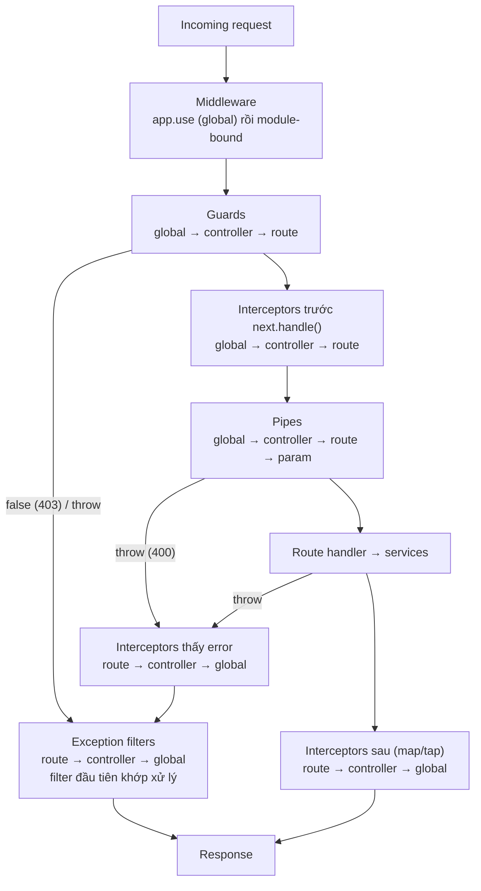

## Bối cảnh & vấn đề

Một team thêm `LoggingInterceptor` đo thời gian xử lý của mọi request. Dashboard cho thấy một endpoint trả 400 chỉ mất 2 ms, và một dev kết luận "validation lỗi nên handler không chạy, interceptor không đo được gì". Một dev khác đặt kiểm tra role vào middleware vì "middleware chạy trước", rồi phải tự parse lại đường dẫn để biết route nào cần role nào. Một người thứ ba viết `app.useGlobalGuards(new RolesGuard(undefined as any))` để "sửa" lỗi compile, và production trả 500 cho mọi request.

Cả ba đều xuất phát từ việc không nắm chắc **request lifecycle**: Nest xử lý một request qua nhiều tầng, mỗi tầng biết một lượng thông tin khác nhau và chạy ở một thời điểm khác nhau. Nhiều ghi chú trên mạng (kể cả ghi chú Notion của tác giả) đặt **pipe trước interceptor**, và điều đó **sai** theo docs chính thức và theo lần chạy thật bên dưới. Bài này xác lập thứ tự chính xác, giải thích vì sao nó được thiết kế như vậy, và cách chọn đúng tầng cho từng yêu cầu. Chi tiết từng tầng: pipe ở bài [Validation & serialization](/tracks/nestjs/learn/validation-serialization), guard ở bài [Guards & auth](/tracks/nestjs/learn/guards-auth), interceptor và filter ở bài [Interceptors & exception filters](/tracks/nestjs/learn/interceptors-filters).

**Interview angle:** "Kể thứ tự lifecycle" là câu gần như chắc chắn gặp. Điểm cộng là nói được cả thứ tự **bên trong** mỗi tầng (global → controller → route) và chiều ngược lại của interceptor "after" và filter.

## Khái niệm

### Middleware

**Middleware** trong Nest giống hệt middleware Express: hàm `(req, res, next)` chạy **trước** khi Nest chọn handler. Nó được đăng ký theo đường dẫn (`consumer.apply(X).forRoutes('orders')` trong `configure()` của module, hoặc `app.use()` toàn cục), và **không biết** handler nào sẽ chạy, nên không đọc được metadata như `@Roles()`. Middleware có thể kết thúc request (`res.status(429).end()`) hoặc ném lỗi, tức là **có** thể chặn request, trái với một số bảng so sánh ghi "middleware không dừng request".

Dùng cho những gì thuộc về HTTP thuần: request id, access log, CORS, `helmet`, body parser, rate limit thô theo IP.

### Guard

**Guard** là class implement `CanActivate`, nhận `ExecutionContext`: một wrapper biết class controller (`getClass()`), method handler (`getHandler()`) và loại context (`http`, `rpc`, `ws`). Nhờ đó guard đọc được metadata gắn trên handler bằng `Reflector`. Trả `true` là cho đi tiếp, `false` là Nest ném `ForbiddenException` (403). Guard chạy **sau mọi middleware** và **trước** interceptor và pipe. Đây là tầng cho authentication và authorization.

### Interceptor

**Interceptor** implement `NestInterceptor` với `intercept(context, next)`. Code trước `next.handle()` chạy **trước** pipe và handler; `next.handle()` trả về một RxJS `Observable` của kết quả handler, và các operator bạn gắn vào (`map`, `tap`, `timeout`, `catchError`) chạy **sau**. Vì interceptor bọc cả pipe lẫn handler, nó thấy được cả lỗi validation (dạng error trong Observable) lẫn kết quả thành công.

### Pipe

**Pipe** implement `PipeTransform` với `transform(value, metadata)`, chạy **cho từng argument** của handler (`@Body()`, `@Param('id')`, `@Query()`), ngay trước khi handler được gọi. Pipe validate (ném `BadRequestException` khi sai) hoặc biến đổi giá trị (`"42"` thành `42`). Nó là tầng cuối cùng trước handler, nên là tầng duy nhất thấy dữ liệu đã biến đổi.

### Exception filter

**Exception filter** implement `ExceptionFilter` với `@Catch(Type)`. Khi bất kỳ tầng nào từ guard trở đi (và cả handler) ném lỗi, Nest tìm filter phù hợp từ mức **thấp nhất** (route) lên (controller rồi global); filter đầu tiên khớp xử lý và **không có filter nào khác chạy nữa**. Không có filter nào của bạn khớp thì built-in exception layer tạo response (`HttpException` giữ status, lỗi lạ thành 500).

### Phạm vi đăng ký (binding scope)

Guard, interceptor, pipe và filter (gọi chung là **enhancer**) đều có ba mức: **global** (`app.useGlobalX()` hoặc provider `APP_X`), **controller** (`@UseX()` trên class), và **route** (`@UseX()` trên method). Pipe có thêm mức **param** (`@Param('id', ParseIntPipe)`). Trong cùng một tầng, thứ tự luôn đi từ rộng tới hẹp: global → controller → route (→ param).

## Cơ chế hoạt động



Diễn giải theo thời gian. **Middleware** chạy trước tiên, ở tầng adapter (Express), theo thứ tự đăng ký: `app.use` toàn cục rồi tới middleware gắn theo module. Sau đó router của Nest đã biết handler, nên **guards** chạy, từ global tới route. Guard nào trả `false` hoặc ném lỗi thì request dừng và đi thẳng sang filter.

Qua guard, **interceptors** chạy phần "trước" theo thứ tự global → controller → route, mỗi cái gọi `next.handle()` để chuyển tiếp vào trong, giống búp bê Nga lồng nhau. Ở lớp trong cùng, **pipes** chạy cho từng argument, rồi **handler**. Kết quả (hoặc lỗi) đi ra theo chiều ngược lại: interceptor trong cùng (route) thấy trước, global thấy sau cùng. Nếu có lỗi, sau khi đi qua các interceptor (mỗi cái có thể `catchError` để đổi lỗi), nó tới **exception filter**, cũng chọn từ route lên global.

Vì sao thiết kế như vậy? Guard đứng trước để request không được phép không tốn công validate body hay chạy interceptor đắt tiền (cache lookup). Interceptor bọc ngoài pipe để phép đo thời gian, logging, timeout và cache áp dụng cho **toàn bộ** phần xử lý, kể cả validation. Pipe đứng sát handler vì nó phụ thuộc vào kiểu của từng argument (`metatype` lấy từ `design:paramtypes`). Filter đứng cuối vì nó là tầng "biến lỗi thành response".

## Ví dụ thực tế

### Chạy thật: log thứ tự của mọi tầng

Mỗi tầng được đăng ký ở ba mức (global qua `APP_*`, controller, route) và ghi log; pipe có thêm mức param. Handler ném lỗi khi `id === 'boom'`, pipe ném 400 khi giá trị là `'bad'`. Nest 12.1.1, Express 5.2.1, Node 24:

```ts
@Controller('orders')
@UseGuards(guard('controller')) @UseInterceptors(interceptor('controller'))
@UsePipes(pipe('controller')) @UseFilters(filter('controller'))
class OrdersController {
  @Get(':id')
  @UseGuards(guard('route')) @UseInterceptors(interceptor('route'))
  @UsePipes(pipe('route')) @UseFilters(filter('route'))
  find(@Param('id', pipe('param')) id: string) {
    log(`HANDLER id=${id}`);
    if (id === 'boom') throw new Error('db exploded');
    return { id };
  }
}
@Module({
  controllers: [OrdersController],
  providers: [
    { provide: APP_GUARD, useClass: guard('global') },
    { provide: APP_INTERCEPTOR, useClass: interceptor('global') },
    { provide: APP_PIPE, useClass: pipe('global') },
    { provide: APP_FILTER, useClass: filter('global') },
  ],
})
class AppModule implements NestModule { configure(c: MiddlewareConsumer) { c.apply(LogMw).forRoutes('*path'); } }
// main: app.use(globalLogMiddleware) then listen; interceptors log "before", then tap({ next, error })
```

```text
GET /orders/42
  middleware (global, app.use)
  middleware (module-bound)
  guard global
  guard controller
  guard route
  interceptor global before
  interceptor controller before
  interceptor route before
  pipe global (param:id) value="42"
  pipe controller (param:id) value="42"
  pipe route (param:id) value="42"
  pipe param (param:id) value="42"
  HANDLER id=42
  interceptor route after
  interceptor controller after
  interceptor global after
  -> 200 {"id":"42"}
GET /orders/bad
  ...guards and interceptors "before" as above...
  pipe global (param:id) value="bad"
  interceptor route saw error: id is bad
  interceptor controller saw error: id is bad
  interceptor global saw error: id is bad
  filter route caught: id is bad
  -> 400 {"by":"route","message":"id is bad"}
GET /orders/boom
  ...
  HANDLER id=boom
  interceptor route saw error: db exploded
  interceptor controller saw error: db exploded
  interceptor global saw error: db exploded
  filter route caught: db exploded
  -> 500 {"by":"route","message":"db exploded"}
```

Ba điều log này chứng minh. Một: interceptor "before" chạy **trước** mọi pipe, nên câu trong ghi chú Notion ("Guard → Pipe → Interceptor (before)") sai. Hai: khi pipe ném lỗi, các pipe sau và handler không chạy, nhưng lỗi **vẫn đi qua** cả ba interceptor. Đây là lời giải cho dashboard "2 ms với 400": interceptor đo đúng, validation lỗi thì request thật sự chỉ tốn 2 ms, và interceptor ghi nhận được lỗi đó nếu nó xử lý nhánh `error`. Ba: chỉ **filter route** chạy; filter controller và global không bao giờ thấy lỗi vì filter đầu tiên khớp đã xử lý.

### Chọn tầng cho từng yêu cầu

| Yêu cầu | Tầng | Lý do |
|---|---|---|
| Raw body để verify chữ ký webhook | Cấu hình body parser: `NestFactory.create(AppModule, { rawBody: true })`, đọc `req.rawBody` | Phải có byte gốc **trước** khi JSON được parse |
| Kiểm tra role | Guard + metadata `@Roles()` | Cần biết handler; chạy trước khi tốn công validate |
| Response envelope `{ data, meta }` | Interceptor (`map`) | Biến đổi kết quả sau handler |
| `:id` thành number | Pipe (`ParseIntPipe`) | Biến đổi từng argument |
| Domain error thành HTTP status | Exception filter | Tầng biến lỗi thành response |
| Đo thời gian request | Interceptor (đo pipe + handler); middleware + `res.on('finish')` nếu muốn tính cả guard và middleware | Interceptor không thấy phần trước nó |
| Request id / correlation id | Middleware (set header + AsyncLocalStorage) | Cần có sớm nhất, cho cả log của guard |

Raw body chạy thật (Nest 12.1.1): provider gửi `'{ "id": "evt_1",  "amount": 1000 }'` (có khoảng trắng thừa) kèm HMAC-SHA256 của đúng chuỗi byte đó:

```ts
const app = await NestFactory.create(AppModule, { rawBody: true });

@Post('stripe')
hook(@Req() req: RawBodyRequest<Request>, @Headers('x-signature') sig: string, @Body() body: unknown) {
  const expected = createHmac('sha256', SECRET).update(req.rawBody!).digest('hex');
  const ok = !!sig && sig.length === expected.length && timingSafeEqual(Buffer.from(sig), Buffer.from(expected));
  const reserialized = createHmac('sha256', SECRET).update(JSON.stringify(body)).digest('hex') === sig;
  if (!ok) throw new UnauthorizedException('bad signature');
  return { ok, rawBytes: req.rawBody!.length, reserializedMatches: reserialized };
}
```

```text
201 {"ok":true,"rawBytes":34,"reserializedMatches":false}
401 {"message":"bad signature","error":"Unauthorized","statusCode":401}
```

`reserializedMatches: false` là lý do bạn không thể verify chữ ký từ `@Body()`: `JSON.stringify` của object đã parse không trả lại đúng byte gốc (khoảng trắng, thứ tự key, escape unicode). Guard có thể làm phần verify (nó đọc được `req.rawBody`), nhưng việc **giữ** raw body phải xảy ra ở tầng body parser.

**Guard không đọc được DTO đã validate** vì lý do tương tự: guard chạy trước pipe, nên `req.body` là object JSON thô (chưa whitelist, chưa transform, `quantity` có thể vẫn là string). Policy cần dữ liệu đã validate hoặc dữ liệu resource (ví dụ "chỉ sửa đơn của cửa hàng mình") nên kiểm tra trong service sau khi load resource.

### useGlobalGuards(new X()) vs APP_GUARD

Chạy thật: `RolesGuard` inject `Reflector`. Cách một đăng ký bằng provider, cách hai tạo bằng `new` trong `main.ts` như trong câu hỏi debug:

```ts
// A: inside a module, the guard is a provider with full DI
@Module({ providers: [{ provide: APP_GUARD, useClass: AuthGuard }, { provide: APP_GUARD, useClass: RolesGuard }] })
export class AppModule {}

// B: main.ts, created outside the container
app.useGlobalGuards(new RolesGuard(undefined as any)); // colleague "fixed" a compile error
```

```text
=== useGlobalGuards(new RolesGuard(undefined as any))
GET /orders
  [server log] TypeError: Cannot read properties of undefined (reading 'getAllAndOverride')
  -> 500 {"statusCode":500,"message":"Internal server error"}
```

`new RolesGuard(...)` là một object bình thường tạo **ngoài DI container**: container không biết nó tồn tại nên không inject `Reflector` (hay `ConfigService`, repository). TypeScript đã báo lỗi thiếu argument, và `undefined as any` tắt đi cảnh báo đúng đắn đó. Hai cách sửa: đăng ký `{ provide: APP_GUARD, useClass: RolesGuard }` trong một module (khuyến nghị), hoặc truyền tay `new RolesGuard(app.get(Reflector))`.

Khác biệt thứ hai quan trọng không kém: enhancer đăng ký bằng `useGlobal*` trong `main.ts` **không tồn tại** khi test e2e tạo app từ `AppModule` (vì test không chạy `main.ts`), còn `APP_*` là một phần của module nên luôn có. Thứ ba: với hybrid app (HTTP + microservice), enhancer `useGlobal*` không tự áp dụng cho microservice (cần option `inheritAppConfig`, verify), còn `APP_*` áp dụng cho mọi context.

Nhiều `APP_GUARD` chạy **theo thứ tự đăng ký**. Trong lần chạy ở bài [Guards & auth](/tracks/nestjs/learn/guards-auth), log luôn là `AuthGuard` rồi `RolesGuard`: auth phải đứng trước để `request.user` có mặt khi kiểm tra role. Đảo thứ tự thì `RolesGuard` thấy `user` là `undefined` và từ chối mọi thứ (403 thay vì 401), hoặc tệ hơn, cho qua nếu viết thiếu cẩn thận.

## Trade-offs & lựa chọn thay thế

| Cách đăng ký global | DI | Có trong e2e từ `AppModule` | Hybrid / microservice | Ghi chú |
|---|---|---|---|---|
| `app.useGlobalGuards(new X())` | Không | Không | Không tự áp dụng | Nhanh, nhưng dễ quên ở test |
| `app.useGlobalGuards(new X(app.get(Dep)))` | Truyền tay | Không | Không tự áp dụng | Vá tạm |
| `{ provide: APP_GUARD, useClass: X }` | Đầy đủ | Có | Áp dụng | Khuyến nghị |
| `@UseGuards(X)` trên controller | Đầy đủ | Có | Theo controller | Dễ quên ở controller mới |

| Tầng | Biết handler/metadata | Thấy dữ liệu đã transform | Chặn được request | Chạy lại khi có lỗi |
|---|---|---|---|---|
| Middleware | Không | Không | Có (không gọi `next`, hoặc throw) | Không |
| Guard | Có | Không | Có (`false` → 403, hoặc throw) | Không |
| Interceptor | Có | Kết quả handler thì có | Có (throw, hoặc trả cache không gọi `next.handle()`) | Thấy lỗi qua `catchError` |
| Pipe | Có (`ArgumentMetadata`) | Là tầng biến đổi | Có (throw 400) | Không |
| Filter | Có (`ArgumentsHost`) | Không liên quan | Không, chỉ tạo response lỗi | Là tầng xử lý lỗi |

Khi nào chọn gì: nếu logic cần biết "handler nào" hoặc metadata, loại middleware. Nếu nó quyết định cho qua hay không, đó là guard. Nếu nó cần bọc cả xử lý (đo, cache, timeout, map kết quả), đó là interceptor. Nếu nó thao tác một argument, đó là pipe. Nếu nó biến lỗi thành response, đó là filter. Global thì dùng `APP_*`, trừ khi enhancer không có dependency nào và bạn chắc chắn đã áp dụng cùng cấu hình trong test.

## Edge cases & failure modes

- **Lỗi trong middleware** không đi qua guard hay interceptor (chúng chưa chạy), nhưng vẫn tới exception filter global. Chạy thật trên Nest 12.1.1 + Express 5: middleware module-bound ném lỗi đồng bộ, middleware `async` reject, và một `app.use()` ném lỗi đều được một `APP_FILTER` `@Catch()` xử lý (`599 {"filter":"APP_FILTER",...}` cho cả ba). Filter mức controller/route thì không thấy các lỗi này.
- **Interceptor trả cache mà không gọi `next.handle()`**: pipe và handler không chạy. Đúng cho cache, nhưng nếu validation là bắt buộc cho side effect thì đặt nó ở guard hoặc tách logic.
- **Filter ném lỗi** bên trong chính nó: không có filter thứ hai nào bắt; response thường là 500 mặc định hoặc kết nối bị treo nếu filter đã ghi một phần header.
- **Guard chạy cho mọi context**: guard dùng `context.switchToHttp().getRequest()` sẽ nhận object khác khi chạy cho microservice (`rpc`) hay WebSocket. Kiểm tra `context.getType()` trước.
- **Middleware `forRoutes('*')`**: trên Nest 11+ (Express 5) wildcard phải có tên, ví dụ `'*path'` hoặc `'{*path}'`. Nest 12 tự convert kèm cảnh báo `LegacyRouteConverter` (verify với phiên bản của bạn).
- **Hai filter cùng `@Catch()`** ở route và global: chỉ filter route chạy, global không log được lỗi. Muốn log tập trung thì log trong filter global và để route filter kế thừa hoặc gọi lại logic chung.

## Pitfalls

- ❌ "Pipes chạy trước interceptors" → ✅ middleware → guards → interceptors (before) → pipes → handler → interceptors (after) → filters.
- ❌ Kiểm tra role trong middleware bằng cách parse URL → ✅ guard đọc metadata `@Roles()` qua `Reflector`.
- ❌ Verify chữ ký webhook từ `@Body()` → ✅ `rawBody: true` khi tạo app và HMAC trên `req.rawBody`, so sánh bằng `timingSafeEqual`.
- ❌ `app.useGlobalGuards(new RolesGuard(undefined as any))` → ✅ `{ provide: APP_GUARD, useClass: RolesGuard }`.
- ❌ Đăng ký `APP_GUARD` của roles trước auth → ✅ auth trước, roles sau; nhiều `APP_GUARD` chạy theo thứ tự đăng ký.
- ❌ Đo latency bằng interceptor rồi nói đó là thời gian toàn request → ✅ interceptor không đo middleware và guard; dùng middleware + `res.on('finish')` hoặc metric của load balancer.
- ❌ Guard đọc `req.body.quantity` và tin nó là number → ✅ guard thấy body thô; policy theo dữ liệu đã validate đặt ở service.

## Tóm tắt

- Thứ tự: middleware → guards → interceptors (before) → pipes → handler → interceptors (after) → exception filters (khi có lỗi).
- Trong mỗi tầng: global → controller → route (→ param với pipe); chiều ra của interceptor và việc chọn filter đi ngược lại: route → controller → global.
- Lỗi của pipe hoặc handler đi qua mọi interceptor rồi tới filter; chỉ filter đầu tiên khớp (thấp nhất) xử lý.
- Middleware không biết handler; guard biết handler nhưng không thấy dữ liệu đã transform; pipe là tầng duy nhất biến đổi argument.
- Raw body phải được giữ ở tầng body parser (`rawBody: true`), không thể dựng lại từ `@Body()`.
- `useGlobal*(new X())` tạo enhancer ngoài DI, không có trong e2e từ `AppModule`, không tự áp dụng cho microservice; dùng `APP_GUARD`/`APP_PIPE`/`APP_INTERCEPTOR`/`APP_FILTER`.
- Nhiều `APP_GUARD` chạy theo thứ tự đăng ký: auth trước, roles sau.
