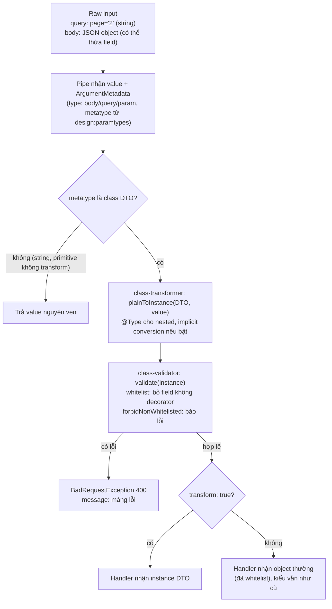

## Bối cảnh & vấn đề

Ba ticket trong cùng một sprint. Ticket một: `GET /orders?page=2` trả 400 "page must be an integer number" dù 2 rõ ràng là số nguyên. Ticket hai: security review phát hiện `POST /orders` chấp nhận field `tenantId` từ client và ghi thẳng vào DB, cho phép tạo đơn cho tenant khác (**mass assignment**). Ticket ba: `GET /users/me` trả về `passwordHash` và `mfaSecret` dù class `User` đã gắn `@Exclude()`.

Cả ba đều nằm ở ranh giới giữa HTTP và code của bạn: dữ liệu **vào** (query string luôn là chuỗi, body có thể chứa bất cứ field nào) và dữ liệu **ra** (object từ DB có nhiều cột hơn những gì client nên thấy). Nest xử lý chiều vào bằng **pipe** (thường là `ValidationPipe` với class-validator) và chiều ra bằng **interceptor** (`ClassSerializerInterceptor` với class-transformer). Cả hai đều dựa vào **class instance** và **metadata**, và hầu hết bug đến từ chỗ dữ liệu thực tế không phải là instance như bạn nghĩ. Vị trí của pipe trong pipeline ở bài [Request lifecycle](/tracks/nestjs/learn/request-lifecycle).

**Interview angle:** câu "`whitelist` làm gì" là easy; câu "vì sao `@Exclude` vẫn leak" là medium-hard. Interviewer muốn nghe bạn nói "decorator chỉ có tác dụng trên class instance".

## Khái niệm

### Controller: route và input

**Controller** là class có `@Controller('orders')`, mỗi method có decorator HTTP (`@Get(':id')`, `@Post()`) trở thành một route. Input được lấy bằng **param decorator**: `@Param('id')`, `@Query()`, `@Body()`, `@Headers('x-request-id')`, `@Ip()`, hoặc `@Req()` để lấy nguyên object request. Giá trị trả về được Nest **serialize thành JSON**, với status mặc định 200 (POST là 201); `@HttpCode(200)` đổi status, `@Header()` thêm header tĩnh.

Handler có thể trả giá trị thường, `Promise`, hoặc `Observable`. Nest xử lý cả ba đồng nhất, và chính cơ chế "Nest tự gửi response" là thứ cho phép interceptor biến đổi kết quả trước khi gửi.

### @Res(): tự quản response và cái giá phải trả

Inject `@Res()` chuyển Nest sang **library-specific mode**: bạn tự gọi `res.json()`/`res.send()`, và Nest **không** gửi giá trị trả về của handler nữa. Hậu quả: interceptor `map` không còn tác dụng (bạn gửi trước khi nó chạy), `@HttpCode` bị bỏ qua, code gắn chặt vào Express (đổi sang Fastify phải sửa), và nếu một nhánh code quên gọi `res.json()`, request **treo** cho tới khi client timeout. `@Res({ passthrough: true })` là thoả hiệp: bạn dùng `res` để set header hay cookie, còn giá trị trả về vẫn do Nest gửi.

### DTO

**DTO** (Data Transfer Object) là class mô tả shape của input, thường kèm decorator của class-validator: `@IsString()`, `@IsInt()`, `@Min(1)`, `@IsEmail()`. DTO là **class** chứ không phải interface vì hai lý do: pipe cần **metatype** runtime (lấy từ `design:paramtypes`) để biết validate theo class nào, và decorator chỉ gắn được lên class.

### ValidationPipe

`ValidationPipe` làm hai bước cho mỗi argument có metatype là class: **class-transformer** (`plainToInstance`) biến object JSON thường thành instance của DTO, rồi **class-validator** (`validate`) chạy các decorator. Có lỗi thì ném `BadRequestException` với mảng message. Các option quan trọng:

- **`whitelist: true`**: loại bỏ mọi property **không có decorator validation nào**. Chống mass assignment: client gửi `tenantId`, DTO không khai báo, field đó biến mất trước khi tới handler.
- **`forbidNonWhitelisted: true`**: thay vì im lặng loại bỏ, trả 400 "property tenantId should not exist". Hữu ích để client phát hiện sớm lỗi gửi sai field.
- **`transform: true`**: handler nhận **instance DTO** (thay vì object thường), và argument primitive được convert theo kiểu khai báo (`@Param('id') id: number` nhận `42`). Nhưng property **bên trong** DTO không tự đổi kiểu (xem ví dụ đo thật bên dưới).
- **`transformOptions: { enableImplicitConversion: true }`**: class-transformer convert property theo kiểu TypeScript khai báo (`page?: number` nhận `Number("2")`). Tiện nhưng nguy hiểm với boolean.

### Nested DTO

class-validator không tự đi vào object con. Property kiểu object cần **`@ValidateNested()`** (bảo validator đi vào trong) và **`@Type(() => AddressDto)`** (bảo transformer biến object con thành instance `AddressDto`, nếu không nó vẫn là object thường và decorator của `AddressDto` không tồn tại trên đó). Mảng object: `@ValidateNested({ each: true })` + `@Type(() => ItemDto)`.

### Serialization: ClassSerializerInterceptor

`ClassSerializerInterceptor` gọi `instanceToPlain()` trên giá trị trả về của handler, áp dụng `@Exclude()` (bỏ field), `@Expose()` (giữ hoặc đổi tên field), `@Transform()` (tính lại giá trị). Nó chạy ở bước "after" của interceptor. Điều kiện để decorator có tác dụng: giá trị phải là **instance của class** có decorator, vì metadata gắn với class (prototype), không gắn với dữ liệu.

## Cơ chế hoạt động



Diễn giải: pipe biết kiểu mong muốn nhờ **metatype**, chính là tham chiếu class trong `design:paramtypes` (vì thế DTO phải là class, và `import type` cho DTO làm validation im lặng không chạy). Bước transform chạy trước validate, nên việc validate "đúng kiểu" phụ thuộc hoàn toàn vào việc transform có đổi kiểu hay không. Query string `page=2` là chuỗi `"2"`; nếu không có `@Type(() => Number)` hoặc implicit conversion, `@IsInt()` thấy một chuỗi và báo lỗi. Đó là ticket một.

Option `transform` chỉ quyết định **handler nhận gì**: instance đã transform hay object gốc. Nó không bật chuyển đổi kiểu cho property, đó là việc của `@Type()` hoặc `enableImplicitConversion`.

Chiều ra đối xứng: handler trả giá trị → `ClassSerializerInterceptor` kiểm tra đó có phải instance không → `instanceToPlain` áp dụng decorator của **class của instance đó** → JSON. Một object thường (từ `repo.find({ raw })`, query builder `getRawMany()`, hay `{ ...user }`) không có class, nên không có decorator nào được áp dụng.

## Ví dụ thực tế

### Đo thật: bốn cấu hình ValidationPipe

DTO của ticket một và hai, chạy trên Nest 12.1.1, class-validator 0.15.1, class-transformer 0.5.1:

```ts
class ListOrdersQuery {
  @IsOptional() @IsInt() @Min(1) page?: number;
  @IsOptional() @IsBoolean() active?: boolean;
}
class AddressDto { @IsString() line1!: string; @IsPostalCode('US') zip!: string; }
class CreateOrderBad { @IsString() sku!: string; @IsInt() @Min(1) quantity!: number; address!: AddressDto; }
class CreateOrderGood { @IsString() sku!: string; @IsInt() @Min(1) quantity!: number;
  @ValidateNested() @Type(() => AddressDto) address!: AddressDto; }

@Get('orders') list(@Query() q: ListOrdersQuery) { return { page: q.page, typeofPage: typeof q.page, active: q.active, typeofActive: typeof q.active, next: (q.page as any) + 1 }; }
@Post('bad') bad(@Body() b: CreateOrderBad) { return { body: b, isInstance: b instanceof CreateOrderBad }; }
@Post('good') good(@Body() b: CreateOrderGood) { return { body: b, isInstance: b instanceof CreateOrderGood }; }
@Get('items/:id') item(@Param('id', ParseIntPipe) id: number) { return { id, type: typeof id }; }
```

```text
## new ValidationPipe()
  GET /orders?page=2&active=false -> 400 {"message":["page must not be less than 1","page must be an integer number","active must be a boolean value"],...}
  POST /bad  (zip invalid, extra tenantId) -> 201 {"body":{"sku":"A","quantity":1,"tenantId":"other","address":{"line1":1,"zip":"nope"}},"isInstance":false}
  POST /good (zip invalid, extra tenantId) -> 400 {"message":["address.zip must be a postal code"],...}
  GET /items/abc -> 400 {"message":"Validation failed (numeric string is expected)",...}
## { transform: true }
  GET /orders?page=2&active=false -> 400 {"message":["page must not be less than 1","page must be an integer number","active must be a boolean value"],...}
## { transform, enableImplicitConversion }
  GET /orders?page=2&active=false -> 200 {"page":2,"typeofPage":"number","active":true,"typeofActive":"boolean","next":3}
## { whitelist, forbidNonWhitelisted, transform }
  GET /orders?page=2&active=false -> 400 {"message":["page must not be less than 1","page must be an integer number","active must be a boolean value"],...}
  POST /bad  (zip invalid, extra tenantId) -> 400 {"message":["property address should not exist","property tenantId should not exist"],...}
  POST /good (zip invalid, extra tenantId) -> 400 {"message":["property tenantId should not exist","address.zip must be a postal code"],...}
```

Năm bài học từ output này:

1. **`transform: true` một mình không sửa được ticket một**: `page` vẫn là `"2"`. Cần `@Type(() => Number)` trên property hoặc `enableImplicitConversion`.
2. **`enableImplicitConversion` biến `active=false` thành `true`**, vì nó gọi `Boolean("false")` và mọi chuỗi không rỗng là truthy. Đây là câu follow-up của câu hỏi debug: implicit conversion nguy hiểm với boolean.
3. Không có `whitelist`, `tenantId` và `address.line1: 1` (sai kiểu) đi thẳng vào handler của `/bad`: `address` không có `@ValidateNested` nên không ai kiểm tra nó. Đó là mass assignment của ticket hai, cộng thêm dữ liệu rác.
4. Với `whitelist`, property **không có decorator** (`address` trong `CreateOrderBad`) cũng bị coi là "không được phép". Đây là gotcha ít người biết: một field thật sự cần mà quên gắn decorator sẽ biến mất âm thầm (hoặc bị từ chối với `forbidNonWhitelisted`).
5. `@ValidateNested()` + `@Type()` làm lỗi trong object con hiện ra với đường dẫn đầy đủ (`address.zip`).

### Query DTO đúng: @Type explicit và boolean an toàn

```ts
class ListOrdersQuery {
  @IsOptional() @Type(() => Number) @IsInt() @Min(1) page?: number;
  @IsOptional() @Type(() => Number) @IsInt() @Min(1) @Max(100) pageSize?: number;
  @IsOptional()
  @Transform(({ value }) => (value === 'true' ? true : value === 'false' ? false : value))
  @IsBoolean() active?: boolean;
}
class CreateOrderDto { @IsString() sku!: string; @IsInt() @Min(1) quantity!: number; }
app.useGlobalPipes(new ValidationPipe({ whitelist: true, transform: true }));
```

```text
GET /orders?page=2&active=false -> 200 {"page":2,"active":false}
GET /orders?page=2&pageSize=5000 -> 400 {"message":["pageSize must not be greater than 100"],"error":"Bad Request","statusCode":400}
GET /orders?page=abc -> 400 {"message":["page must not be less than 1","page must be an integer number"],"error":"Bad Request","statusCode":400}
POST whitelist only -> 201 {"sku":"A","quantity":1}
```

`@Type(() => Number)` đổi kiểu **từng property có chủ đích**, và `@Transform` cho boolean chỉ chấp nhận đúng `'true'`/`'false'` (chuỗi khác vẫn giữ nguyên để `@IsBoolean` báo lỗi). `@Max(100)` cho `pageSize` chặn một client gửi `pageSize=5000` và bắt DB đọc 5.000 dòng mỗi trang. Dòng cuối trả lời câu follow-up của câu hỏi `whitelist`: chỉ `whitelist` (không `forbidNonWhitelisted`) thì `tenantId` bị **loại bỏ im lặng** và request vẫn thành công.

### @Res() và passthrough, chạy thật

Controller có một `EnvelopeInterceptor` bọc kết quả thành `{ data }`:

```ts
@Get('normal') a() { return { id: 1 }; }
@Post('created') b() { return { id: 2 }; }
@Post('search') @HttpCode(200) c() { return { hits: [] }; }
@Get('res') d(@Res() res: Response) { res.status(200).json({ id: 3 }); }
@Get('passthrough') e(@Res({ passthrough: true }) res: Response) { res.setHeader('x-cache', 'miss'); return { id: 4 }; }
@Get('forgot') f(@Res() _res: Response) { return { id: 5 }; } // never responds
```

```text
GET /r/normal -> 200  {"data":{"id":1}}
POST /r/created -> 201  {"data":{"id":2}}
POST /r/search -> 200  {"data":{"hits":[]}}
GET /r/res -> 200  {"id":3}
GET /r/passthrough -> 200 miss {"data":{"id":4}}
GET /r/forgot -> no response after 1s (request hangs)
```

`/r/res` mất envelope vì response đã được gửi trước khi interceptor chạy. `/r/forgot` là bug production thật: handler trả giá trị nhưng đã inject `@Res()`, nên Nest không gửi gì, request treo, và (trong lần chạy này) `app.close()` cũng treo theo vì còn một kết nối đang mở.

### Serialization: bốn cách trả user, một cách an toàn

```ts
class UserEntity {
  id!: number; email!: string;
  @Exclude() passwordHash!: string;
  constructor(p: Partial<UserEntity>) { Object.assign(this, p); }
}
class UserResponse { @Expose() id!: number; @Expose() email!: string; }
const row = { id: 1, email: 'a@x.io', passwordHash: '$argon2id$v=19$...', mfaSecret: 'JBSWY3DP' };

@Controller('users') @UseInterceptors(ClassSerializerInterceptor)
class UsersController {
  @Get('instance') a() { return new UserEntity(row); }
  @Get('plain') b() { return row; }                                              // raw query result
  @Get('spread') c() { return { ...new UserEntity(row), role: 'admin' }; }       // spread loses the prototype
  @Get('dto') d() { return plainToInstance(UserResponse, row, { excludeExtraneousValues: true }); }
  @Get('typed') @SerializeOptions({ type: UserEntity }) e() { return row; }
}
```

```text
GET /users/instance -> {"id":1,"email":"a@x.io","mfaSecret":"JBSWY3DP"}
GET /users/plain    -> {"id":1,"email":"a@x.io","passwordHash":"$argon2id$v=19$...","mfaSecret":"JBSWY3DP"}
GET /users/spread   -> {"id":1,"email":"a@x.io","passwordHash":"$argon2id$v=19$...","mfaSecret":"JBSWY3DP","role":"admin"}
GET /users/dto      -> {"id":1,"email":"a@x.io"}
GET /users/typed    -> {"id":1,"email":"a@x.io","mfaSecret":"JBSWY3DP"}
```

`/plain` và `/spread` lộ `passwordHash`: object thường và object spread không có prototype `UserEntity`, nên `@Exclude` không tồn tại với chúng. Nhưng điều đáng sợ hơn là **`mfaSecret` lộ ở mọi biến thể dùng `@Exclude`**, kể cả `/instance`. `@Exclude` là **blacklist**: cột mới thêm vào bảng (`mfaSecret` được thêm tháng trước) mặc định bị lộ cho tới khi ai đó nhớ thêm decorator. Chỉ `/dto` (response DTO + `@Expose` + `excludeExtraneousValues: true`, tức là **whitelist**) an toàn trước cả hai kiểu lỗi.

Một test bảo vệ đơn giản: trong e2e, gọi mọi endpoint GET với dữ liệu seed và đệ quy qua JSON response, fail nếu gặp key thuộc danh sách cấm (`passwordHash`, `mfaSecret`, `refreshToken`). Rẻ, và bắt được cả regression do người khác gây ra.

## Trade-offs & lựa chọn thay thế

| Lựa chọn | Ưu | Nhược | Dùng khi |
|---|---|---|---|
| class-validator + `ValidationPipe` | Chuẩn của Nest, tích hợp Swagger, decorator dễ đọc | Phụ thuộc metadata, nhiều gotcha (nested, kiểu query), tốn CPU với payload lớn | Mặc định trong đa số project Nest |
| Schema pipe (zod, valibot; Standard Schema) | Một schema dùng chung FE/BE, suy ra kiểu, ít decorator | Tự viết pipe hoặc dùng thư viện, ít tích hợp Swagger sẵn | Monorepo TS, muốn bớt decorator |
| `enableImplicitConversion` | Ít code | Boolean sai, chuyển đổi ngầm | Chỉ khi DTO không có boolean và team hiểu rõ |
| `@Type(() => Number)` explicit | Chính xác từng field | Dài hơn | Query DTO |
| `@Exclude` (blacklist) | Nhanh để thêm | Cột mới mặc định lộ; chỉ có tác dụng trên instance | Tránh cho dữ liệu nhạy cảm |
| Response DTO + `@Expose` (whitelist) | Chỉ trả đúng field khai báo | Phải map mỗi endpoint | Mặc định an toàn cho output |
| Map tay `toUserResponse(user)` | Rõ ràng, không phụ thuộc thư viện, nhanh | Code lặp | Endpoint nóng, response lớn |

Chọn thế nào: input thì luôn bật `whitelist` (và thường là `forbidNonWhitelisted`), dùng `@Type` explicit cho query, giới hạn kích thước (`@Max`, `@ArrayMaxSize`, `@MaxLength`). Output thì whitelist: response DTO hoặc hàm map tay; không dựa vào `@Exclude` trên entity như lớp bảo vệ duy nhất.

## Edge cases & failure modes

- **Payload lớn**: class-transformer và class-validator duyệt từng property; mảng 10.000 phần tử với nested DTO có thể tốn hàng chục ms CPU và chặn event loop. Giới hạn body size ở body parser và `@ArrayMaxSize`.
- **`import type` cho DTO**: metatype không còn là class DTO, và validation **không chạy**. Chạy thật (Nest 12.1.1, `tsc` 7.0.2, `whitelist: true`): `POST` body `{"quantity":-5,"admin":true}` vào handler `@Body() b: QtyDto` với `import type` trả `201` kèm body là `function anonymous() {}` (compiler ghi metatype `Function`, pipe biến body thành một hàm), trong khi bản import giá trị trả `400 quantity must not be less than 1`. Với compiler ghi `Object`, pipe bỏ qua validation và trả body nguyên vẹn. Cả hai đều là lỗ hổng im lặng.
- **Query array**: `?tags=a` là chuỗi, `?tags=a&tags=b` là mảng. DTO nên chuẩn hoá bằng `@Transform(({ value }) => [].concat(value))`.
- **Query nested kiểu `filter[status]=paid`**: Express 5 (Nest 11+) dùng query parser `simple`, nên chạy thật trên Nest 12 cho ra `{"filter[status]":"paid"}` chứ không phải `{ filter: { status: 'paid' } }` như Express 4 (verify cấu hình của bạn; có thể bật lại parser `extended`).
- **Custom param decorator** (`@CurrentUser()`): `ValidationPipe` mặc định không validate giá trị của nó; cần `validateCustomDecorators: true`.
- **Response là stream/file** (`StreamableFile`): `ClassSerializerInterceptor` bỏ qua, đúng như mong đợi, nhưng interceptor tự viết dùng `map` có thể làm hỏng stream.

## Pitfalls

- ❌ `new ValidationPipe()` không option → ✅ `{ whitelist: true, forbidNonWhitelisted: true, transform: true }` làm mặc định global (qua `APP_PIPE` để có trong e2e).
- ❌ Tin rằng `transform: true` đổi `?page=2` thành number → ✅ `@Type(() => Number)` trên property.
- ❌ `enableImplicitConversion` với `?active=false` → ✅ `@Transform` explicit cho boolean.
- ❌ Nested DTO chỉ có kiểu TypeScript → ✅ `@ValidateNested()` + `@Type(() => AddressDto)`.
- ❌ Quên decorator trên field cần thiết khi đã bật `whitelist` → ✅ mọi field nhận từ client phải có ít nhất một decorator (`@IsOptional()` cũng được tính).
- ❌ `@Res()` để set một header → ✅ `@Res({ passthrough: true })` hoặc `@Header()`; `@Res()` thường làm mất interceptor và dễ treo request.
- ❌ `@Exclude()` trên entity là lớp bảo vệ duy nhất → ✅ response DTO whitelist (`@Expose` + `excludeExtraneousValues`) hoặc map tay, cộng test chặn field cấm.

## Tóm tắt

- Controller: `@Controller` + `@Get/@Post`, input qua `@Param/@Query/@Body/@Headers`; giá trị trả về được serialize (200, POST 201, đổi bằng `@HttpCode`).
- `@Res()` chuyển sang tự gửi response: mất interceptor map và `@HttpCode`, gắn chặt Express, dễ treo request; `passthrough: true` là thoả hiệp.
- `ValidationPipe` = `plainToInstance` rồi `validate`, dựa vào metatype của argument (DTO phải là class, không `import type`).
- `whitelist` bỏ field không có decorator (kể cả field bạn quên gắn decorator), `forbidNonWhitelisted` trả 400, `transform` cho handler nhận instance nhưng không tự đổi kiểu property.
- Query luôn là chuỗi: `@Type(() => Number)`; `enableImplicitConversion` biến `"false"` thành `true`.
- Nested: `@ValidateNested()` + `@Type(() => X)`.
- `ClassSerializerInterceptor` chỉ áp dụng decorator trên class instance; object thường, spread, raw query đều lộ field. `@Exclude` là blacklist; output an toàn là whitelist (response DTO hoặc map tay) cộng test chặn field nhạy cảm.
