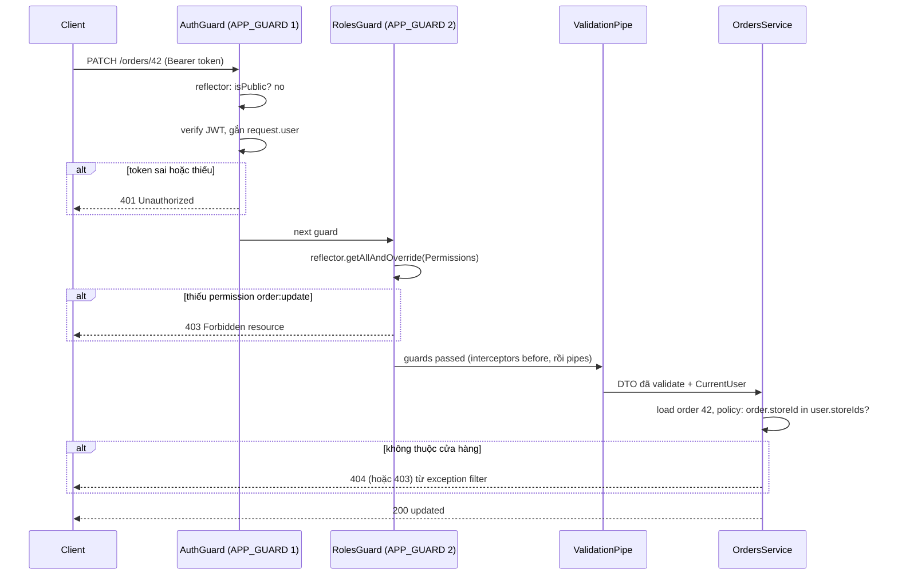

## Bối cảnh & vấn đề

Một nền tảng B2B có ba loại người dùng: `admin` của tenant, `manager` của từng cửa hàng, và `staff`. Yêu cầu nghe đơn giản: "staff chỉ sửa được đơn của cửa hàng mình". Phiên bản đầu tiên kiểm tra `if (user.role !== 'admin' && user.role !== 'staff') throw` ở đầu từng handler. Sáu tháng sau có 140 endpoint, ba cách viết kiểm tra khác nhau, và một endpoint mới `PATCH /orders/:id/notes` được merge mà **không có kiểm tra nào**: bất kỳ user đã đăng nhập nào cũng sửa được ghi chú đơn của mọi cửa hàng, mọi tenant. Đây là **BOLA** (Broken Object Level Authorization), lỗi số một trong OWASP API Security Top 10.

Nest có sẵn các mảnh để làm việc này đúng: **guard** chạy trước handler và biết handler nào sắp chạy, **metadata decorator** để khai báo quyền ngay trên route, **Reflector** để đọc metadata, và **global guard** để mặc định là "phải đăng nhập". Nhưng guard không giải quyết được mọi thứ: "đơn này có thuộc cửa hàng của bạn không" cần dữ liệu của resource, thứ mà guard chưa có. Bài này đi từ guard cơ bản, qua custom decorator, tới thiết kế authorization hai tầng. Vị trí của guard trong pipeline ở bài [Request lifecycle](/tracks/nestjs/learn/request-lifecycle); lý thuyết JWT, OAuth, RBAC/ABAC ở track [Auth & identity](/tracks/auth-identity).

**Interview angle:** câu hỏi design "RBAC + resource-level" kiểm tra bạn có phân biệt được **coarse-grained** (role/permission, guard làm được) với **fine-grained** (theo từng resource, cần load dữ liệu) không, và "làm sao để endpoint mới không thể quên kiểm tra".

## Khái niệm

### Guard và ExecutionContext

**Guard** implement `CanActivate` với `canActivate(context): boolean | Promise<boolean> | Observable<boolean>`. **`ExecutionContext`** mở rộng `ArgumentsHost` (wrapper quanh các argument của handler) với hai method quan trọng: `getHandler()` (method sắp chạy) và `getClass()` (controller). `switchToHttp().getRequest()` lấy request HTTP; `switchToRpc()` và `switchToWs()` cho microservice và WebSocket, nên cùng một guard có thể bảo vệ cả ba loại transport, miễn là nó kiểm tra `context.getType()`.

Trả `false` làm Nest ném `ForbiddenException`, response là `403 {"message":"Forbidden resource"}`. Muốn 401 (chưa đăng nhập hoặc token sai) hoặc message khác, guard tự `throw new UnauthorizedException(...)`. Phân biệt đúng 401 và 403 quan trọng cho client: 401 nghĩa là "đăng nhập lại", 403 nghĩa là "đăng nhập rồi nhưng không có quyền".

### Metadata decorator và Reflector

Guard cần biết route yêu cầu gì. Cách của Nest là gắn **metadata** lên handler hoặc class bằng decorator, rồi đọc lại trong guard bằng **`Reflector`** (một provider có sẵn). Có hai cách tạo decorator:

- `Reflector.createDecorator<string[]>()` (Nest 10+): trả về một decorator có kiểu, dùng luôn làm khoá đọc: `reflector.get(Roles, handler)`.
- `SetMetadata('roles', roles)` (cách cũ, vẫn dùng rộng rãi): khoá là chuỗi.

Metadata có thể nằm ở route, ở controller, hoặc cả hai. `reflector.getAllAndOverride(key, [handler, class])` lấy giá trị đầu tiên tìm thấy (route **ghi đè** controller); `getAllAndMerge` gộp cả hai thành mảng. Chọn sai là bug: với `@Roles(['staff'])` ở class và `@Roles(['admin'])` ở một route, override nghĩa là route đó chỉ cho admin, merge nghĩa là cả staff lẫn admin.

### Param decorator

**`createParamDecorator((data, ctx) => ...)`** tạo decorator cho tham số handler, ví dụ `@CurrentUser()` trả về `request.user` mà guard đã gắn vào. `data` là đối số truyền vào decorator (`@CurrentUser('id')`). Giá trị trả về đi qua pipe như mọi argument khác; `ValidationPipe` chỉ validate nó khi bật `validateCustomDecorators: true`.

### applyDecorators: gộp decorator

`applyDecorators(UseGuards(JwtAuthGuard, RolesGuard), Roles(['admin']), ApiBearerAuth())` gộp nhiều decorator thành một, ví dụ `@Auth('admin')`. Tiện để thống nhất, nhưng nếu guard đã là global thì không cần `UseGuards` trong đó nữa.

### Global auth + @Public()

Để "endpoint mới không thể quên kiểm tra", đảo ngược mặc định: đăng ký auth guard **global** bằng `APP_GUARD` (mọi route đều phải đăng nhập), và tạo `@Public()` để **opt out** có chủ đích. Guard đọc metadata `isPublic` và cho qua nếu có. Quên gắn gì thì endpoint vẫn an toàn (yêu cầu đăng nhập); lỗi duy nhất có thể là "quên `@Public()`", và lỗi đó lộ ra ngay khi test.

### JWT: Passport strategy hay guard tự viết

- **`@nestjs/passport` + `passport-jwt`**: viết một `JwtStrategy extends PassportStrategy(Strategy)` với `validate(payload)`, dùng `AuthGuard('jwt')`. Lợi thế là hệ sinh thái Passport: Google, GitHub, SAML, local strategy có sẵn. Chi phí là một tầng abstraction nữa (Passport có vòng đời và quy ước riêng), và strategy phải là singleton (docs cấm request scope).
- **Guard tự viết với `@nestjs/jwt` hoặc `jose`**: đọc header, `jwtVerify(token, JWKS, { issuer, audience, algorithms: ['RS256'] })`, gắn `request.user`. Ít code, không phép màu, kiểm soát rõ: cache JWKS, cố định thuật toán (chặn `alg: none` và nhầm lẫn HS/RS), kiểm tra claim tenant, clock skew.

Dù chọn cách nào, phần còn lại giống nhau: guard global + `@Public()`, gắn `request.user`, sau đó `RolesGuard`/`PermissionsGuard`, rồi kiểm tra theo resource ở service. JWT không thu hồi được trước khi hết hạn, nên với quyền thay đổi thường xuyên (user bị khoá, bị đổi role), cần access token ngắn hạn hoặc tra danh sách thu hồi/phiên bản quyền trong cache.

### Hai tầng authorization

- **Coarse-grained** (tầng 1): "role này có permission `order:update` không". Chỉ cần user và metadata của route, nên guard làm được. Permission (`order:update`) tốt hơn role (`staff`) ở metadata, vì role là tập hợp permission có thể thay đổi theo tenant.
- **Fine-grained** (tầng 2, ABAC/resource-level): "đơn **này** có thuộc cửa hàng của user không". Cần **dữ liệu của resource**, nên đặt trong service sau khi load resource (hoặc một policy function nhận `user` và `resource`, kiểu CASL). Guard load resource cũng được, nhưng tốn thêm một query và trùng với query của service.
- **Query-level** (cho list): `GET /orders` phải lọc theo phạm vi ngay trong query (`WHERE store_id = ANY($1)`), không lấy hết rồi lọc trong bộ nhớ (vừa chậm, vừa làm sai phân trang).

## Cơ chế hoạt động



Diễn giải: hai `APP_GUARD` chạy **theo thứ tự đăng ký**, nên `AuthGuard` luôn chạy trước và `request.user` có mặt khi `RolesGuard` chạy. `RolesGuard` chỉ kiểm tra permission theo metadata, không đụng tới DB. Sau pipe, service load resource rồi mới áp dụng policy theo resource. Trả **404** thay vì 403 khi resource không thuộc phạm vi của user là lựa chọn phổ biến để không tiết lộ rằng id đó tồn tại.

Vì sao guard không đọc được DTO đã validate: guard chạy **trước** pipe, `req.body` còn là JSON thô. Đây là một lý do nữa để policy theo dữ liệu đặt ở service.

## Ví dụ thực tế

### Chạy thật: AuthGuard + RolesGuard + @Public + @CurrentUser

```ts
export const Roles = Reflector.createDecorator<string[]>();
export const IS_PUBLIC = 'isPublic';
export const Public = () => SetMetadata(IS_PUBLIC, true);
export const CurrentUser = createParamDecorator((field: string | undefined, ctx: ExecutionContext) => {
  const user = ctx.switchToHttp().getRequest().user; return field ? user?.[field] : user;
});
const USERS = { 'token-alice': { id: 'alice', roles: ['admin'] }, 'token-bob': { id: 'bob', roles: ['staff'] } };

@Injectable() class AuthGuard implements CanActivate {
  constructor(private reflector: Reflector) {}
  canActivate(ctx: ExecutionContext) {
    const isPublic = this.reflector.getAllAndOverride<boolean>(IS_PUBLIC, [ctx.getHandler(), ctx.getClass()]);
    if (isPublic) return true;
    const req = ctx.switchToHttp().getRequest();
    const user = USERS[(req.headers.authorization ?? '').replace('Bearer ', '')];
    if (!user) throw new UnauthorizedException('missing or invalid token');
    req.user = user; return true;
  }
}
@Injectable() class RolesGuard implements CanActivate {
  constructor(private reflector: Reflector) {}
  canActivate(ctx: ExecutionContext) {
    const roles = this.reflector.getAllAndOverride(Roles, [ctx.getHandler(), ctx.getClass()]);
    const req = ctx.switchToHttp().getRequest();
    if (!roles?.length) return true;
    return roles.some((r) => req.user?.roles.includes(r));
  }
}
class AdjustDto { @IsInt() qty!: number; }

@Controller('orders') @Roles(['staff', 'admin'])
class OrdersController {
  @Get('health') @Public() health() { return 'ok'; }
  @Get() list(@CurrentUser('id') userId: string) { return { userId }; }
  @Post('adjust') @Roles(['admin']) adjust(@Body() b: AdjustDto, @CurrentUser('id') by: string) { return { qty: b.qty, by }; }
}
@Module({ controllers: [OrdersController], providers: [{ provide: APP_GUARD, useClass: AuthGuard }, { provide: APP_GUARD, useClass: RolesGuard }] })
class AppModule {}
// guards log their name, the roles they need, and what they see in req.body
```

```text
GET /orders/health
  AuthGuard  (public=true)
  RolesGuard (need=["staff","admin"], body.qty=undefined typeof undefined)
  -> 403 {"message":"Forbidden resource","error":"Forbidden","statusCode":403}
GET /orders
  AuthGuard  (public=false)
  -> 401 {"message":"missing or invalid token","error":"Unauthorized","statusCode":401}
GET /orders as token-bob
  AuthGuard  (public=false)
  RolesGuard (need=["staff","admin"], body.qty=undefined typeof undefined)
  -> 200 {"userId":"bob"}
POST /orders/adjust as token-bob
  AuthGuard  (public=false)
  RolesGuard (need=["admin"], body.qty=5 typeof number)
  -> 403 {"message":"Forbidden resource","error":"Forbidden","statusCode":403}
POST /orders/adjust as token-alice
  AuthGuard  (public=false)
  RolesGuard (need=["admin"], body.qty="5" typeof string)
  -> 400 {"message":["qty must be an integer number"],"error":"Bad Request","statusCode":400}
```

Output có một bug thật, đáng để nhớ: `/orders/health` có `@Public()` nhưng vẫn **403**. `AuthGuard` cho qua, nhưng `RolesGuard` đọc `@Roles(['staff','admin'])` ở **cấp class** và từ chối vì không có `user`. Fix: `RolesGuard` cũng tôn trọng `@Public()` (hoặc route public không nằm trong controller có `@Roles` cấp class). Sau khi thêm dòng kiểm tra `isPublic` vào `RolesGuard`:

```text
GET /orders/health
  AuthGuard  (public=true)
  RolesGuard (need=["staff","admin"], body.qty=undefined typeof undefined)
  -> 200 ok
```

Các dòng còn lại xác nhận lý thuyết: không token là 401 (guard tự ném), đủ đăng nhập nhưng thiếu role là 403 (guard trả `false`), route override controller (`adjust` chỉ cho admin dù class cho cả staff), và guard thấy `qty` là chuỗi `"5"` vì nó chạy **trước** `ValidationPipe`; chỉ pipe mới từ chối nó với 400. Thứ tự log `AuthGuard` rồi `RolesGuard` ở mọi request là thứ tự đăng ký `APP_GUARD`.

### Guard JWT tự viết với jose

```ts
@Injectable()
export class JwtAuthGuard implements CanActivate {
  private readonly jwks = createRemoteJWKSet(new URL('https://idp.example.com/.well-known/jwks.json')); // cached, auto-refreshed
  constructor(private readonly reflector: Reflector, private readonly cfg: ConfigService) {}

  async canActivate(ctx: ExecutionContext): Promise<boolean> {
    if (this.reflector.getAllAndOverride<boolean>(IS_PUBLIC, [ctx.getHandler(), ctx.getClass()])) return true;
    const req = ctx.switchToHttp().getRequest();
    const token = /^Bearer (.+)$/.exec(req.headers.authorization ?? '')?.[1];
    if (!token) throw new UnauthorizedException();
    try {
      const { payload } = await jwtVerify(token, this.jwks, {
        issuer: this.cfg.getOrThrow('JWT_ISSUER'),
        audience: 'orders-api',
        algorithms: ['RS256'],          // never accept what the token header says
        clockTolerance: 5,
      });
      req.user = { id: payload.sub, tenantId: payload.tid, permissions: payload.perms ?? [] };
      return true;
    } catch { throw new UnauthorizedException(); }
  }
}
```

Đoạn này minh hoạ (không có output): các điểm cần nói trong phỏng vấn là cố định `algorithms`, kiểm tra `issuer` và `audience`, cache JWKS, và lấy tenant từ **claim đã verify**. Khi URL cũng chứa tenant (`/tenants/:tenantId/orders`), đối chiếu `params.tenantId === user.tenantId` trong guard (hoặc một `TenantGuard` riêng) và trả 403 khi không khớp.

### Thiết kế authorization cho B2B

```ts
export const RequirePermissions = Reflector.createDecorator<string[]>();

@Controller('orders')
export class OrdersController {
  constructor(private readonly orders: OrdersService) {}

  @Get()
  @RequirePermissions(['order:read'])
  list(@CurrentUser() user: AuthUser, @Query() q: ListOrdersQuery) {
    return this.orders.list(user.scope, q);             // scope filter goes into the SQL WHERE
  }

  @Patch(':id')
  @RequirePermissions(['order:update'])
  update(@CurrentUser() user: AuthUser, @Param('id', ParseUUIDPipe) id: string, @Body() dto: UpdateOrderDto) {
    return this.orders.update(user, id, dto);
  }
}

@Injectable()
export class OrdersService {
  async update(user: AuthUser, id: string, dto: UpdateOrderDto) {
    const order = await this.repo.findByIdInTenant(user.tenantId, id);   // tenant filter always in the query
    if (!order || !canEditOrder(user, order)) throw new OrderNotFoundError(id); // 404: do not leak existence
    return this.repo.save({ ...order, ...dto });
  }
}

export const canEditOrder = (u: AuthUser, o: Order) =>
  u.permissions.includes('order:update:any') || (u.permissions.includes('order:update') && u.storeIds.includes(o.storeId));
```

Những quyết định cần giải thích được. Permission (không phải role) ở metadata. `PermissionsGuard` global: route **thiếu** `@RequirePermissions` và không `@Public()` bị từ chối mặc định, và một test duyệt mọi route (qua `DiscoveryService` hoặc danh sách route của adapter) fail nếu có route không khai báo gì. Policy theo resource là **hàm thuần** (`canEditOrder`), test được bằng ma trận role × action × ownership mà không cần Nest. Nguồn permission: định nghĩa trong code (tĩnh, type-safe) hay trong DB (tenant tự định nghĩa role), nếu trong DB thì cache theo user với TTL ngắn và invalidate khi đổi role. Thêm audit log cho mọi thay đổi quyền và mọi lần bị từ chối.

### Mang thiết kế từ Express sang Nest

Với ứng viên đã làm RBAC ở Express nhưng chưa chạy Nest ở production, câu trả lời mạnh là **trung thực** về kinh nghiệm (mô tả cơ chế thật đã làm) rồi mapping:

| Express | Nest |
|---|---|
| Middleware verify JWT gắn `req.user` | `JwtAuthGuard` global qua `APP_GUARD` + `@Public()` |
| `router.patch('/orders/:id', requirePermission('order:update'), handler)` | `@RequirePermissions(['order:update'])` + `PermissionsGuard` đọc bằng `Reflector` |
| Permission tra từ Redis trong middleware | Một `PermissionsService` singleton inject Redis client (factory provider), guard gọi nó |
| Kiểm tra ownership trong handler | Policy function trong service, sau khi load resource |
| Test bằng supertest với token giả | `overrideGuard` cho unit/e2e hẹp, nhưng giữ ít nhất một bộ e2e chạy guard thật |

Lợi ích thực sự của Nest ở đây: guard biết handler nên không phải map URL sang quyền, cùng một guard áp dụng cho HTTP, RPC và WebSocket, và quyền được khai báo ngay cạnh route nên review dễ. Điểm phải cẩn thận: guard chạy trước pipe (body chưa validate), guard cần DI nên đăng ký bằng `APP_GUARD`, và không dùng request scope cho guard.

## Trade-offs & lựa chọn thay thế

| Lựa chọn | Ưu | Nhược | Dùng khi |
|---|---|---|---|
| Passport (`@nestjs/passport`) | Nhiều strategy có sẵn (OAuth, SAML, local) | Thêm abstraction, quy ước riêng | Nhiều kiểu đăng nhập, social login |
| Guard tự viết + `jose` | Ít code, kiểm soát JWKS/alg/claim | Tự viết phần OAuth flow nếu cần | API chỉ nhận JWT từ một IdP |
| Role trong metadata | Đơn giản | Role thay đổi theo tenant thì phải sửa code | App nhỏ, role cố định |
| Permission trong metadata | Tách role khỏi code | Cần bảng role → permission | B2B, role tuỳ biến theo tenant |
| Policy trong guard (load resource) | Tập trung một chỗ | Query thêm, trùng với service | Resource đơn giản, load rẻ |
| Policy trong service | Dùng chính resource đã load | Phải nhớ gọi | Mặc định cho resource-level |
| CASL / policy engine | Biểu đạt quy tắc phức tạp, dùng chung FE | Thêm dependency, learning curve | Quy tắc nhiều điều kiện |

Chọn thế nào: mặc định **deny-by-default** (global auth + global permission guard + `@Public()` opt-out), **permission** ở metadata, **policy theo resource** trong service bằng hàm thuần, và **filter trong query** cho list. Passport khi cần nhiều strategy; guard tự viết khi chỉ verify JWT.

## Edge cases & failure modes

- **`@Public()` nhưng vẫn 403**: guard thứ hai (roles/permissions) không biết route là public, đúng như lần chạy ở trên.
- **Guard dùng cho RPC/WS**: `switchToHttp().getRequest()` trả object khác; header `authorization` không tồn tại. Kiểm tra `ctx.getType()` và đọc credential theo transport (Kafka header, WS handshake).
- **`getAllAndOverride` vs `getAllAndMerge`**: chọn sai làm route "hạn chế hơn" hóa ra rộng hơn, hoặc ngược lại.
- **Token hợp lệ nhưng quyền đã bị thu hồi**: JWT sống tới khi hết hạn. Access token ngắn (5–15 phút) cộng refresh token, hoặc tra `permissionsVersion` trong cache.
- **BOLA qua endpoint list**: lọc theo tenant nhưng quên lọc theo store; hoặc lọc sau khi phân trang, trang 1 trả 3 dòng thay vì 20.
- **`overrideGuard` trong mọi e2e test**: test không bao giờ chạy guard thật, bug auth đi thẳng lên production. Giữ một bộ e2e với token thật (ký bằng key test).

## Pitfalls

- ❌ Kiểm tra role bằng `if` đầu mỗi handler → ✅ metadata decorator + guard global; endpoint mới mặc định bị chặn.
- ❌ Auth guard gắn theo từng controller → ✅ `APP_GUARD` + `@Public()` opt-out (deny-by-default).
- ❌ `RolesGuard` không biết `@Public()` → ✅ mọi guard global đều tôn trọng cùng metadata public, hoặc gộp vào một guard.
- ❌ Guard trả `false` khi token sai → ✅ ném `UnauthorizedException` (401); `false` là 403.
- ❌ Chỉ kiểm tra role cho "sửa đơn" → ✅ thêm policy theo resource (store/tenant) sau khi load, trả 404 để không lộ sự tồn tại.
- ❌ Lọc list trong bộ nhớ sau khi query → ✅ đưa phạm vi vào `WHERE` và phân trang ở DB.
- ❌ Tin `alg` trong header JWT → ✅ cố định `algorithms`, kiểm tra `iss`/`aud`, cache JWKS.
- ❌ Nói đã chạy Nest ở production khi chưa → ✅ mô tả thật phần đã làm ở Express và mapping sang Nest, kèm POC nếu có.

## Tóm tắt

- Guard (`CanActivate`) chạy sau middleware, trước interceptor và pipe; `false` → 403, tự ném `UnauthorizedException` cho 401.
- `ExecutionContext` cho `getHandler()`/`getClass()` để đọc metadata, và `switchToHttp/Rpc/Ws` để dùng chung guard cho mọi transport.
- Metadata: `Reflector.createDecorator()` hoặc `SetMetadata`; `getAllAndOverride` (route ghi đè class) vs `getAllAndMerge`.
- `createParamDecorator` cho `@CurrentUser()`; `applyDecorators` gộp decorator.
- Deny-by-default: auth guard global (`APP_GUARD`) + `@Public()`; mọi guard global phải tôn trọng `@Public()` (bug thật trong lần chạy).
- JWT: Passport khi cần nhiều strategy, guard tự viết + `jose` khi chỉ verify JWT; cố định alg, kiểm tra iss/aud, tenant từ claim.
- Authorization hai tầng: permission ở guard, policy theo resource ở service (hàm thuần, test bằng ma trận), phạm vi trong query cho list.
