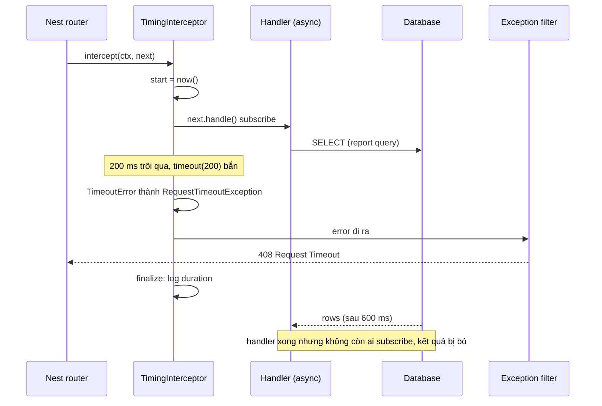

## Bối cảnh & vấn đề

Ba sự cố, cùng một tháng. Một: endpoint báo cáo được thêm `timeout(5000)` trong interceptor; client nhận 408 đúng hẹn, nhưng DB CPU vẫn 100% vì hàng trăm query báo cáo đã "timeout" vẫn tiếp tục chạy. Hai: để giảm tải, một dev gắn `@UseInterceptors(CacheInterceptor)` cho `GET /prices`; ngay hôm sau khách hàng của tenant `globex` thấy bảng giá của tenant `acme`. Ba: domain layer ném `OrderNotFoundError`, và client nhận `500 Internal server error` thay vì 404, kèm một đội on-call bị gọi dậy vì tỉ lệ 5xx tăng.

Hai công cụ liên quan là **interceptor** (bọc quanh handler, làm việc trước và sau) và **exception filter** (biến lỗi thành response). Cả hai mạnh và dễ dùng sai theo cùng một kiểu: chúng làm việc ở **ranh giới HTTP**, còn hậu quả (query DB, cache key, phân loại lỗi) nằm ở tầng dưới. Bài này giải thích cơ chế RxJS của interceptor, giới hạn của timeout và cache ở tầng này, và cách xây một filter global cho response lỗi nhất quán. Vị trí của cả hai trong pipeline ở bài [Request lifecycle](/tracks/nestjs/learn/request-lifecycle).

**Interview angle:** follow-up "sau khi timeout bắn, DB đang làm gì?" phân biệt người hiểu **ngừng chờ** với **huỷ công việc**. Và "cache key của `CacheInterceptor` là gì?" phân biệt người đã dùng nó ở hệ multi-tenant.

## Khái niệm

### Interceptor và Observable

`intercept(context, next)` nhận **`CallHandler`**: `next.handle()` trả về một RxJS **Observable** đại diện cho kết quả của phần bên trong (các interceptor sâu hơn, pipe, handler). Observable là một luồng giá trị lazy: không có gì chạy cho tới khi có người subscribe, và Nest subscribe vào Observable mà interceptor trả về. Handler trả giá trị thường hoặc `Promise` đều được Nest bọc thành Observable.

Vì vậy interceptor có hai "khoảnh khắc". Code viết **trước** `return next.handle()` chạy trước pipe và handler. Các **operator** gắn vào bằng `.pipe(...)` chạy khi kết quả (hoặc lỗi) đi ra: `map` biến đổi giá trị (response envelope), `tap` quan sát (logging), `catchError` đổi lỗi, `timeout` ném lỗi nếu không có giá trị trong N ms, `finalize` chạy khi luồng kết thúc dù thành công hay lỗi (đo thời gian). Interceptor cũng có thể **không** gọi `next.handle()` mà trả thẳng `of(cachedValue)`: handler không chạy, đó là cách cache interceptor làm việc.

### timeout chỉ ngừng chờ

`timeout(5000)` của RxJS unsubscribe khỏi nguồn và phát lỗi `TimeoutError` khi hết giờ. Với handler trả `Promise`, "unsubscribe" không huỷ được promise: promise không có cơ chế huỷ (xem bài [Promise, async/await](/tracks/javascript/learn/promises-async-await)). Query DB, HTTP call ra ngoài, vòng lặp tính toán vẫn chạy tới hết, và kết quả bị bỏ đi. Timeout ở interceptor bảo vệ **client** (trả 408 hoặc 504 đúng hẹn), không bảo vệ **tài nguyên**.

Muốn huỷ thật, tín hiệu phải đi xuống tới nguồn: `AbortSignal` truyền vào `fetch`/client HTTP, `statement_timeout` của PostgreSQL (`SET LOCAL statement_timeout = '5s'` trong transaction), hoặc timeout của driver. Interceptor có thể tạo `AbortController`, gắn signal vào request (hoặc AsyncLocalStorage), và gọi `abort()` trong `finalize`/`catchError`, nhưng chỉ có tác dụng nếu code bên dưới thực sự dùng signal đó.

### Built-in exception layer

Nest có sẵn một **exception layer** bắt mọi lỗi không được xử lý. Nếu lỗi là **`HttpException`** (hoặc subclass: `BadRequestException`, `NotFoundException`, `ConflictException`, ...), response là `{ statusCode, message, error }` với đúng status. Mọi lỗi khác, kể cả `Error` thường và lỗi domain tự định nghĩa, thành **`500 {"statusCode":500,"message":"Internal server error"}`**. Đây là mặc định an toàn (không lộ stack trace), và cũng là lý do `OrderNotFoundError` thành 500 ở sự cố ba.

### Exception filter

**Exception filter** là class implement `ExceptionFilter` với `@Catch(Type1, Type2)` (không tham số là bắt tất cả). `catch(exception, host)` nhận **`ArgumentsHost`**: wrapper quanh argument của handler gốc, với `host.getType()` trả `'http' | 'rpc' | 'ws'` (hoặc `'graphql'`), và `switchToHttp()`/`switchToRpc()`/`switchToWs()` để lấy đúng object. Một filter viết cho HTTP (gọi `response.status().json()`) sẽ hỏng khi lỗi đến từ một Kafka handler, vì ở đó không có response HTTP; phải kiểm tra `getType()`.

Filter đăng ký ở route/controller (`@UseFilters`) hoặc global (`APP_FILTER` để có DI cho logger, hoặc `useGlobalFilters`). Kế thừa **`BaseExceptionFilter`** và gọi `super.catch()` để giữ hành vi mặc định cho những lỗi bạn không xử lý.

### Domain error không phụ thuộc Nest

Domain layer không nên import `NotFoundException` từ `@nestjs/common`: nó gắn logic nghiệp vụ vào HTTP, và cùng lỗi đó ở Kafka consumer không có nghĩa gì. Thay vào đó, domain định nghĩa lỗi của riêng nó (`OrderNotFoundError` với `code: 'NOT_FOUND'`), và filter ở tầng ngoài **map** code sang status HTTP (hoặc sang `RpcException` cho microservice).

## Cơ chế hoạt động



Diễn giải: `next.handle()` được subscribe, handler bắt đầu query. Khi `timeout` bắn, operator unsubscribe khỏi nguồn và phát lỗi; `catchError` đổi nó thành `RequestTimeoutException`; lỗi đi tới exception filter và client nhận 408. `finalize` ghi log thời gian. Nhưng promise của handler vẫn sống: query vẫn chạy trên DB và giữ một connection của pool cho tới khi xong. Dưới tải, 100 request timeout nghĩa là 100 query "mồ côi" vẫn chiếm pool, request mới phải chờ connection, và càng nhiều request timeout hơn: một vòng xoáy.

Luồng lỗi tới filter: lỗi từ handler (hoặc pipe) đi qua `catchError` của từng interceptor (route → controller → global), rồi Nest chọn filter có `@Catch` khớp ở mức thấp nhất. Filter tạo response; nếu không có filter nào của bạn khớp, exception layer mặc định làm việc đó.

## Ví dụ thực tế

### Timing, envelope, timeout và filter global, chạy thật

```ts
@Injectable() class TimingInterceptor implements NestInterceptor {
  intercept(ctx: ExecutionContext, next: CallHandler): Observable<unknown> {
    const start = performance.now();
    return next.handle().pipe(
      timeout(200),
      catchError((e) => throwError(() => (e instanceof TimeoutError ? new RequestTimeoutException() : e))),
      finalize(() => log(`timing ${ctx.getClass().name}.${ctx.getHandler().name} ${Math.round(performance.now() - start)}ms`)),
    );
  }
}
@Injectable() class EnvelopeInterceptor implements NestInterceptor {
  intercept(_: ExecutionContext, next: CallHandler) { return next.handle().pipe(map((data) => ({ data, meta: { at: 'illustrative' } }))); }
}
// domain layer: no Nest imports
export class DomainError extends Error { constructor(public code: 'NOT_FOUND' | 'CONFLICT' | 'INVALID', msg: string) { super(msg); } }
export class OrderNotFoundError extends DomainError { constructor(id: string) { super('NOT_FOUND', `order ${id} not found`); } }
const STATUS: Record<DomainError['code'], number> = { NOT_FOUND: 404, CONFLICT: 409, INVALID: 422 };

@Catch()
class AllExceptionsFilter extends BaseExceptionFilter {
  catch(e: unknown, host: ArgumentsHost) {
    if (host.getType() !== 'http') return super.catch(e, host);
    const res = host.switchToHttp().getResponse(); const req = host.switchToHttp().getRequest();
    const requestId = req.headers['x-request-id'] ?? 'gen-123';
    if (e instanceof HttpException) return res.status(e.getStatus()).json({ status: e.getStatus(), code: 'HTTP', detail: e.message, requestId });
    if (e instanceof DomainError) return res.status(STATUS[e.code]).json({ status: STATUS[e.code], code: e.code, detail: e.message, requestId });
    if ((e as any)?.code === '23505') return res.status(409).json({ status: 409, code: 'CONFLICT', detail: 'duplicate', requestId });
    log(`unexpected: ${(e as Error).stack?.split('\n')[0]}`);
    return res.status(500).json({ status: 500, code: 'INTERNAL', detail: 'Internal error', requestId });
  }
}

@Controller('orders') @UseInterceptors(TimingInterceptor, EnvelopeInterceptor)
class OrdersController {
  @Get('slow') async slow() { log('handler: query started'); await sleep(600); log('handler: query FINISHED (nobody is waiting)'); return 'late'; }
  @Get('missing/:id') missing(@Param('id') id: string) { throw new OrderNotFoundError(id); }
  @Get('dup') dup() { throw Object.assign(new Error('duplicate key value violates unique constraint "orders_pkey"'), { code: '23505' }); }
  @Get('bug') bug() { return (undefined as any).total; }
  @Get(':id') one(@Param('id') id: string) { return { id }; }
}
// run 1: no filter of our own. run 2: AllExceptionsFilter registered as APP_FILTER
```

```text
=== default exception layer
[ 220ms] timing OrdersController.one 1ms
[ 226ms] GET /orders/7 -> 200 {"data":{"id":"7"},"meta":{"at":"illustrative"}}
[ 227ms] handler: query started
[ 432ms] timing OrdersController.slow 205ms
[ 440ms] GET /orders/slow -> 408 {"message":"Request Timeout","statusCode":408}
[ 442ms] timing OrdersController.missing 1ms
[ 444ms] GET /orders/missing/9 -> 500 {"statusCode":500,"message":"Internal server error"}
[ 446ms] timing OrdersController.bug 0ms
[ 447ms] GET /orders/bug -> 500 {"statusCode":500,"message":"Internal server error"}
[ 828ms] handler: query FINISHED (nobody is waiting)
=== AllExceptionsFilter (APP_FILTER)
[ 972ms] GET /orders/missing/9 -> 404 {"status":404,"code":"NOT_FOUND","detail":"order 9 not found","requestId":"gen-123"}
[ 975ms] GET /orders/dup -> 409 {"status":409,"code":"CONFLICT","detail":"duplicate","requestId":"gen-123"}
[ 976ms] unexpected: TypeError: Cannot read properties of undefined (reading 'total')
[ 977ms] GET /orders/bug -> 500 {"status":500,"code":"INTERNAL","detail":"Internal error","requestId":"gen-123"}
```

(Trong log gốc, tên controller là `C`; ở đây đổi thành `OrdersController` cho dễ đọc, và các dòng `timing` của lượt chạy thứ hai được lược bớt.) Dòng `[ 828ms] handler: query FINISHED (nobody is waiting)` xuất hiện **400 ms sau khi client đã nhận 408**: đó là sự cố một, tái hiện. Với exception layer mặc định, `OrderNotFoundError` thành 500, giống sự cố ba. Với filter global: domain error thành 404 với `code` ổn định, lỗi unique violation của Postgres (`23505`) thành 409, bug thật thành 500 **có log stack** nhưng response không lộ gì ngoài `requestId` để tra log. Envelope `{ data, meta }` chỉ áp dụng cho response thành công, vì lỗi không đi qua `map`.

### CacheInterceptor làm lộ dữ liệu giữa tenant

`@nestjs/cache-manager` 12.0.0, cache in-memory. Handler trả giá theo header `x-tenant`:

```ts
@Injectable() class TenantCacheInterceptor extends CacheInterceptor {
  trackBy(ctx: ExecutionContext): string | undefined {
    const req = ctx.switchToHttp().getRequest();
    const base = super.trackBy(ctx) ?? undefined;                  // undefined for non-GET: not cached
    return base && `t:${req.headers['x-tenant']}:${base}`;
  }
}
@Get('prices')  @UseInterceptors(CacheInterceptor)       @CacheTTL(60_000) prices(@Headers('x-tenant') t: string) { dbHits++; return { tenant: t, price: t === 'acme' ? 90 : 120 }; }
@Get('prices2') @UseInterceptors(TenantCacheInterceptor) @CacheTTL(60_000) prices2(@Headers('x-tenant') t: string) { dbHits++; return { tenant: t, price: t === 'acme' ? 90 : 120 }; }
```

```text
GET /prices x-tenant=acme -> {"tenant":"acme","price":90} | handler calls so far: 1
GET /prices x-tenant=globex -> {"tenant":"acme","price":90} | handler calls so far: 1
GET /prices2 x-tenant=acme -> {"tenant":"acme","price":90} | handler calls so far: 2
GET /prices2 x-tenant=globex -> {"tenant":"globex","price":120} | handler calls so far: 3
```

Key mặc định của `CacheInterceptor` là **URL** của request. Header, user, tenant, permission không có trong key, nên `globex` nhận bảng giá của `acme` từ cache: sự cố hai, tái hiện chính xác. `trackBy()` tuỳ biến thêm tenant vào key sửa được trường hợp "response công khai theo tenant", nhưng không giải quyết được hai vấn đề còn lại: invalidate theo entity (giá sản phẩm X đổi thì key nào phải xoá?) và response phụ thuộc quyền của từng user.

Với dữ liệu có ghi (giá, tồn kho), cache-aside tường minh trong service thường đúng hơn:

```ts
@Injectable()
export class ProductsService {
  constructor(@Inject(REDIS) private readonly redis: RedisClientType, private readonly repo: ProductsRepository) {}

  async listPrices(tenantId: string, categoryId: string) {
    const ver = (await this.redis.get(`t:${tenantId}:catalog:ver`)) ?? '0';        // version key per tenant
    const key = `t:${tenantId}:prices:${categoryId}:v${ver}`;
    const hit = await this.redis.get(key);
    if (hit) return JSON.parse(hit);
    const rows = await this.repo.listPrices(tenantId, categoryId);
    await this.redis.set(key, JSON.stringify(rows), { EX: 300 + Math.floor(Math.random() * 60) }); // jittered TTL
    return rows;
  }

  async updatePrice(tenantId: string, productId: string, price: number) {
    await this.repo.updatePrice(tenantId, productId, price);
    await this.redis.incr(`t:${tenantId}:catalog:ver`); // every list key of this tenant is now stale
  }
}
```

Đoạn này minh hoạ (không có output). Ý chính: key có tenant và "version", ghi xong thì tăng version để mọi danh sách của tenant đó hết hạn một cách logic (key cũ tự hết TTL), TTL có jitter để tránh nhiều key cùng hết hạn một lúc. Đó cũng là câu trả lời cho câu follow-up "invalidate danh sách sản phẩm khi một giá đổi". Chống stampede (nhiều request cùng miss) và đo hit ratio thuộc track [Caching](/tracks/caching).

## Trade-offs & lựa chọn thay thế

| Nhu cầu | Interceptor | Nơi khác | Ghi chú |
|---|---|---|---|
| Đo thời gian | Đo pipe + handler | Middleware + `res.on('finish')` đo cả guard | Interceptor không thấy phần trước nó |
| Response envelope | `map` | Map tay trong controller | Interceptor áp dụng đồng nhất, nhưng mất với `@Res()` |
| Timeout | `timeout()` bảo vệ client | `statement_timeout`, `AbortSignal` bảo vệ tài nguyên | Nên có cả hai |
| Cache GET công khai | `CacheInterceptor` (+ `trackBy`) | CDN / HTTP cache headers | Chỉ khi response không phụ thuộc user |
| Cache dữ liệu có ghi | Không nên | Cache-aside trong service | Key có tenant + version, invalidate khi ghi |
| Map lỗi | `catchError` cho một route | Exception filter global | Filter là nơi tập trung, nhất quán |

| Cách tạo response lỗi | Ưu | Nhược |
|---|---|---|
| Exception layer mặc định | Không cần code, không lộ stack | Domain error thành 500, format thiếu `code`/`requestId` |
| Ném `HttpException` từ service | Đơn giản | Domain gắn với HTTP, sai với consumer Kafka |
| Domain error + filter global (`APP_FILTER`) | Domain độc lập, format ổn định, có DI cho logger | Phải duy trì bảng mapping |
| Problem Details (RFC 9457) | Chuẩn, client có thể dùng chung parser | Cần thống nhất `type` URI |

Chọn thế nào: interceptor cho mối quan tâm **xuyên suốt và không phụ thuộc dữ liệu** (đo, envelope, timeout phía client). Cache và huỷ công việc thuộc về service và driver. Lỗi: domain error thuần + một filter global duy nhất (qua `APP_FILTER`), có nhánh cho `rpc`/`ws`, log mọi 5xx kèm stack và `requestId`.

## Edge cases & failure modes

- **Timeout không huỷ**: query mồ côi chiếm connection pool; dưới tải tạo vòng xoáy timeout. Luôn có timeout ở tầng DB/HTTP client, ngắn hơn timeout ở interceptor.
- **`timeout` cho streaming/SSE**: Observable phát nhiều giá trị; `timeout` áp dụng cho **mỗi** khoảng cách giữa hai giá trị, không phải tổng thời gian.
- **Filter HTTP gặp lỗi từ Kafka handler**: `switchToHttp().getResponse()` không phải response Express, `res.status` là undefined, filter tự ném lỗi mới. Luôn kiểm tra `host.getType()`.
- **Filter tự ném lỗi**: không có filter thứ hai; lỗi gốc bị che bởi lỗi của filter.
- **Response đã gửi một phần** (stream, `@Res()`): filter không thể đổi status nữa; kiểm tra `res.headersSent` trước khi ghi.
- **`CacheInterceptor` global**: mọi GET được cache theo URL, kể cả `/me`. Nếu dùng global thì endpoint riêng tư phải được loại trừ; an toàn hơn là opt-in từng route.
- **Lộ chi tiết lỗi**: trả `e.message` của lỗi DB cho client làm lộ tên bảng, constraint, đôi khi dữ liệu. Chỉ trả message cho lỗi đã phân loại.

## Pitfalls

- ❌ `timeout(5000)` trong interceptor và nghĩ query đã bị huỷ → ✅ `statement_timeout`/`AbortSignal` ở tầng dưới; interceptor chỉ trả lỗi đúng hẹn cho client.
- ❌ `CacheInterceptor` cho endpoint phụ thuộc tenant/user → ✅ cache-aside trong service với key có tenant, hoặc `trackBy()` cho response công khai theo tenant.
- ❌ Service ném `NotFoundException` của Nest → ✅ domain error thuần + filter map sang HTTP/RPC.
- ❌ Filter chỉ viết cho HTTP → ✅ `host.getType()` và nhánh riêng cho `rpc`/`ws` (hoặc `super.catch`).
- ❌ Trả `exception.message` của mọi lỗi cho client → ✅ message cho lỗi đã phân loại, 500 chung chung + `requestId` cho phần còn lại, log stack ở server.
- ❌ `useGlobalFilters(new AllExceptionsFilter())` rồi inject logger → ✅ `APP_FILTER` để filter có DI.

## Tóm tắt

- Interceptor bọc handler: code trước `next.handle()` chạy trước pipe; operator (`map`, `tap`, `catchError`, `timeout`, `finalize`) chạy khi kết quả hoặc lỗi đi ra; không gọi `next.handle()` là bỏ qua handler (cache).
- `timeout()` chỉ ngừng chờ; query và call ra ngoài vẫn chạy (đo thật: xong 400 ms sau 408). Huỷ thật cần `AbortSignal` hoặc `statement_timeout`.
- `CacheInterceptor` dùng URL làm key: đo thật cho thấy tenant này nhận dữ liệu của tenant kia. `trackBy()` thêm tenant; dữ liệu có ghi thì cache-aside trong service với version key.
- Exception layer mặc định: `HttpException` giữ status, mọi lỗi khác thành 500.
- Filter global (`APP_FILTER`, kế thừa `BaseExceptionFilter`): map domain error theo `code`, lỗi DB (23505 → 409), phần còn lại 500 + log; response ổn định có `requestId`; nhánh riêng cho `rpc`/`ws` qua `ArgumentsHost.getType()`.
