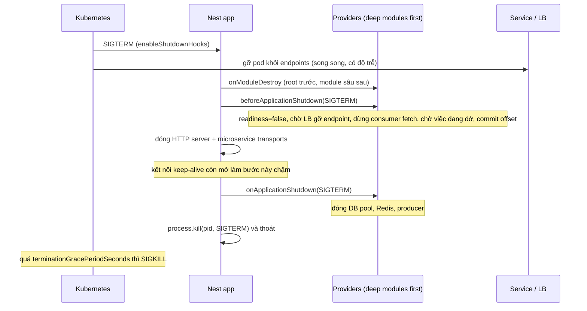

## Bối cảnh & vấn đề

Deploy thứ Sáu. Pod mới khởi động, nhận traffic, và 20 phút sau mới crash ở request đầu tiên cần gửi email, vì `SMTP_HOST` bị đặt sai tên trong manifest. Cùng lần deploy, mỗi lượt rolling update làm client thấy vài chục lỗi `ECONNRESET`, và consumer Kafka xử lý lại vài trăm message vì bị kill giữa chừng trước khi commit offset.

Hai vấn đề này nằm ở hai đầu vòng đời của process. **Đầu vào**: cấu hình sai phải làm app **không start** (fail fast), chứ không phải crash muộn. **Đầu ra**: khi orchestrator gửi SIGTERM, app phải ngừng nhận việc mới, làm xong việc đang dở, đóng kết nối theo đúng thứ tự, rồi mới thoát. Nest có công cụ cho cả hai: `ConfigModule` với validation, và **lifecycle hooks** kèm `enableShutdownHooks()`. Bài này đi qua cả hai với các số đo thật, trong đó có một chi tiết ít ai để ý: `app.close()` có thể chờ **vài giây** vì một kết nối keep-alive. Nền tảng về signal và graceful shutdown ở mức OS nằm ở bài [Signals & graceful shutdown](/tracks/os-concurrency/learn/signals-graceful-shutdown).

**Interview angle:** câu hỏi "rolling deploy làm rớt request" là câu scenario chuẩn. Câu trả lời mạnh có trình tự cụ thể (readiness → drain → close → cleanup), có con số (grace period, timeout), và thừa nhận rằng xử lý lại message là bình thường với at-least-once.

## Khái niệm

### ConfigModule và fail fast

`@nestjs/config` cung cấp `ConfigModule.forRoot()`: đọc `.env` (hoặc bỏ qua bằng `ignoreEnvFile` khi env đến từ orchestrator), gộp với `process.env`, và **validate** trước khi bất kỳ provider nào dùng config. Validate lỗi thì app không start. Có hai cách validate: `validationSchema` (một schema) hoặc `validate(config)` (hàm tự viết, ví dụ dùng class-validator).

Nest 12 đổi `validationSchema` từ Joi-only sang **Standard Schema**: một interface chung mà zod, valibot, ArkType đều implement. Joi vẫn dùng được nếu là Joi 18+ và các option riêng của thư viện chuyển vào `validationOptions.libraryOptions` (theo migration guide v12, verify). Schema có thể **coerce** kiểu: `z.coerce.number()` biến `PORT="8080"` thành số `8080`, nên phần còn lại của app đọc được đúng kiểu.

### Typed config: registerAs và getOrThrow

`registerAs('db', () => ({ url, poolMax }))` tạo một **namespace** cấu hình với token riêng (`dbConfig.KEY`). Inject `@Inject(dbConfig.KEY) db: ConfigType<typeof dbConfig>` cho một object có kiểu đầy đủ, thay vì `configService.get('DB_POOL_MAX')` trả về `any`. `configService.getOrThrow('KEY')` ném lỗi khi thiếu thay vì trả `undefined` âm thầm. Quy tắc: không đọc `process.env` rải rác trong service, vì nó không được validate, không có kiểu, và khó thay khi test.

### Lifecycle hooks

Nest gọi các method có **tên đúng** trên provider, controller và module (không bắt buộc implement interface; interface chỉ giúp TypeScript bắt lỗi chính tả, điều mà ghi chú Notion đã nêu đúng):

- **`onModuleInit()`**: sau khi dependency của module đã resolve. Dùng để warm cache, kiểm tra kết nối.
- **`onApplicationBootstrap()`**: sau khi **mọi** module đã init, trước khi listen. Dùng để bắt đầu consumer, scheduler.
- **`onModuleDestroy()`**: khi bắt đầu shutdown (sau `app.close()` hoặc signal).
- **`beforeApplicationShutdown(signal)`**: sau khi mọi `onModuleDestroy` xong; **kết nối vẫn còn mở**. Dùng để drain: ngừng nhận việc mới, chờ việc đang dở.
- **`onApplicationShutdown(signal)`**: sau khi Nest đã đóng HTTP server và transport. Dùng để đóng DB pool, Redis, producer.

Mọi hook có thể `async`; Nest **await** chúng. Thứ tự giữa các module: module import sâu nhất (và module global) chạy trước, root module chạy sau cùng; shutdown thì ngược lại. Nest 12 ghi trong migration guide rằng hook được gọi **theo cấp trong cây component**, nên thứ tự có thể khác bản cũ khi các provider phụ thuộc nhau (verify khi nâng cấp). Hook **không** được gọi cho provider request-scoped.

### enableShutdownHooks

Mặc định, Nest **không** lắng nghe signal: `onModuleDestroy`/`onApplicationShutdown` chỉ chạy khi bạn gọi `app.close()`. `app.enableShutdownHooks()` đăng ký listener cho SIGTERM, SIGINT (và vài signal khác), gọi `app.close()` khi nhận, rồi tự kill process bằng chính signal đó sau khi hook xong. Docs lưu ý: listener tốn tài nguyên nên không bật mặc định, nhiều app Nest trong một process mỗi cái đăng ký listener riêng, và SIGTERM không hoạt động trên Windows.

### Keep-alive và việc đóng HTTP server

Khi Nest đóng HTTP server, Node ngừng nhận kết nối mới và đóng các kết nối **đang nhàn rỗi tại thời điểm đó**. Một kết nối đang phục vụ request dở dang chưa bị đóng; khi request xong, nó trở thành kết nối keep-alive nhàn rỗi, nhưng không ai đóng nó nữa, nên server chờ cho tới khi client hoặc `keepAliveTimeout` đóng nó. Hệ quả đo được bên dưới: `onApplicationShutdown` bị trễ vài giây. `forceCloseConnections: true` (option của `NestFactory.create`) đóng mọi kết nối ngay, nhưng cắt luôn request đang chạy.

## Cơ chế hoạt động



Diễn giải: Kubernetes gửi SIGTERM và **đồng thời** gỡ pod khỏi danh sách endpoint của Service. Hai việc này không đồng bộ: trong vài giây đầu, load balancer (kube-proxy, ingress) có thể vẫn gửi request mới tới pod. Vì vậy `beforeApplicationShutdown` nên bắt đầu bằng việc báo readiness là false và **chờ** một khoảng ngắn (thường 5–10 giây) trước khi đóng server. Sau đó dừng consumer nhận message mới, chờ message đang xử lý xong và commit offset của chúng.

Chỉ khi `beforeApplicationShutdown` xong, Nest mới đóng HTTP server và transport. `onApplicationShutdown` là nơi đóng tài nguyên dùng chung (DB, Redis, producer), vì tới đây không còn request hay message nào đang dùng chúng. Toàn bộ trình tự phải xong trước `terminationGracePeriodSeconds` (mặc định 30 giây), nếu không kubelet gửi SIGKILL và mọi thứ dừng ngay. Container phải chạy `node dist/main.js` trực tiếp (`CMD ["node", "dist/main.js"]` dạng exec) để Node là process nhận signal, không phải `npm start` hay shell.

## Ví dụ thực tế

### Fail fast với zod trên Nest 12

`@nestjs/config` 12.0.1, zod 4.6.5:

```ts
const EnvSchema = z.object({
  NODE_ENV: z.enum(['development', 'test', 'production']).default('development'),
  PORT: z.coerce.number().int().default(3000),
  DATABASE_URL: z.url(),
  REDIS_URL: z.url(),
});
export const dbConfig = registerAs('db', () => ({ url: process.env.DATABASE_URL!, poolMax: Number(process.env.DB_POOL_MAX ?? 10) }));

@Injectable() class Repo {
  constructor(@Inject(dbConfig.KEY) private db: ConfigType<typeof dbConfig>, private cfg: ConfigService) {}
  describe() { return { db: this.db, port: this.cfg.getOrThrow<number>('PORT'), portType: typeof this.cfg.get('PORT') }; }
}
@Module({ imports: [ConfigModule.forRoot({ isGlobal: true, ignoreEnvFile: true, validationSchema: EnvSchema, load: [dbConfig] })], providers: [Repo] })
class AppModule {}
```

```text
$ DATABASE_URL=not-a-url node dist/main.js
boot failed: Config validation error: DATABASE_URL: Invalid URL
REDIS_URL: Invalid input: expected string, received undefined

$ DATABASE_URL=postgres://u:p@db:5432/app REDIS_URL=redis://cache:6379 PORT=8080 node dist/main.js
booted: {"db":{"url":"postgres://u:p@db:5432/app","poolMax":10},"port":8080,"portType":"number"}
getOrThrow(STRIPE_KEY): Configuration key "STRIPE_KEY" does not exist
```

Lỗi liệt kê **mọi** biến sai cùng lúc, nên một lần sửa manifest là đủ. `PORT` đến dưới dạng chuỗi nhưng `typeof` là `number` nhờ `z.coerce`. Một gotcha từ chính lần chạy này: với `logger: false` và `abortOnError` mặc định (`true`), Nest gọi `process.exit(1)` khi khởi tạo lỗi **mà không in gì**; lần chạy đầu chỉ thấy `exit=1`. Ở production, giữ logger bật (ít nhất mức `error`) để lỗi config hiện ra trong log của pod.

Với cấu hình cần thay đổi lúc chạy (feature flag, giới hạn rate), env không phù hợp vì chỉ đọc lúc start. Dùng một provider đọc từ nguồn động (LaunchDarkly/Unleash, bảng DB, AWS AppConfig) với cache TTL ngắn, và để giá trị mặc định an toàn khi nguồn không trả lời.

### Thứ tự hooks và SIGTERM, đo thật

Ba module lồng nhau: `AppModule` import `ConsumerModule`, `ConsumerModule` import `DbModule`. Mỗi module có một provider log mọi hook; `Consumer.beforeApplicationShutdown` mất 300 ms để "drain". Một request `GET /slow` (500 ms) đang chạy khi process tự gửi SIGTERM cho mình:

```ts
const app = await NestFactory.create(AppModule, { logger: false });
if (process.argv[2] === 'hooks') app.enableShutdownHooks();
await app.listen(0);
const inflight = fetch(`${url}/slow`).then((r) => r.text()).then((b) => log(`client got: ${b}`));
setTimeout(() => { log('--- sending SIGTERM'); process.kill(process.pid, 'SIGTERM'); }, 100);
```

```text
== with enableShutdownHooks
[ 316ms] Db.onModuleInit
[ 316ms] Consumer.onModuleInit
[ 316ms] AppService.onModuleInit
[ 316ms] Db.onApplicationBootstrap
[ 316ms] Consumer.onApplicationBootstrap
[ 316ms] AppService.onApplicationBootstrap
[ 318ms] listening
[ 334ms] GET /slow started
[ 430ms] --- sending SIGTERM
[ 430ms] AppService.onModuleDestroy
[ 431ms] Consumer.onModuleDestroy
[ 431ms] Db.onModuleDestroy
[ 431ms] AppService.beforeApplicationShutdown(SIGTERM)
[ 431ms] Consumer.beforeApplicationShutdown(SIGTERM)
[ 732ms] Consumer drained in-flight messages
[ 733ms] Db.beforeApplicationShutdown(SIGTERM)
[ 835ms] GET /slow finished
[ 853ms] client got: done
[3859ms] AppService.onApplicationShutdown(SIGTERM)
[3859ms] Consumer.onApplicationShutdown(SIGTERM)
[3859ms] Db.onApplicationShutdown(SIGTERM)
exit=143
== without
...(same init lines)...
[2821ms] --- sending SIGTERM
exit=143
```

Đọc output. Init: module sâu nhất (`Db`) trước, root sau; shutdown đảo ngược. Hook `async` được await: `Db.beforeApplicationShutdown` chỉ chạy **sau** khi `Consumer` drain xong 300 ms, nên một module có thể giữ việc tắt của module khác. Request `/slow` đang chạy vẫn hoàn thành và client nhận `done`. Không có `enableShutdownHooks`, process chết ngay khi nhận SIGTERM, **không có hook nào chạy**. Exit code 143 là 128 + 15 (SIGTERM): Nest kill lại process bằng chính signal sau khi hook xong.

Điểm lạ là **3 giây** giữa `client got: done` (853 ms) và `onApplicationShutdown` (3859 ms). Chạy lại với client gửi `Connection: close`:

```text
[ 730ms] Db.beforeApplicationShutdown(SIGTERM)
[ 833ms] GET /slow finished
[ 837ms] AppService.onApplicationShutdown(SIGTERM)
```

Khoảng chờ biến mất: nó đến từ kết nối **keep-alive** của `/slow`. Lúc server đóng, kết nối đó đang bận nên không bị đóng cùng các kết nối nhàn rỗi; khi request xong nó thành nhàn rỗi và chờ tới khi client (undici, keep-alive 4 giây) tự đóng. Với `forceCloseConnections: true`, `onApplicationShutdown` chạy ở 676 ms, nhưng log không bao giờ có `GET /slow finished` hay `client got`: request đang chạy bị **cắt**. Vì vậy cách đúng không phải force close, mà là drain trong `beforeApplicationShutdown` (chờ request đang chạy xong) rồi để thời gian chờ keep-alive nằm gọn trong grace period, hoặc trả header `Connection: close` cho các response trong lúc đang shutdown để client không giữ kết nối.

### Trình tự shutdown cho API + Kafka consumer

```ts
@Injectable()
export class ShutdownCoordinator implements BeforeApplicationShutdown {
  shuttingDown = false;
  constructor(private readonly consumer: OrdersConsumerRunner) {}

  async beforeApplicationShutdown(signal?: string) {
    this.shuttingDown = true;                         // /health/ready now returns 503
    await sleep(Number(process.env.PRESTOP_DRAIN_MS ?? 8_000)); // let the LB remove this pod
    await this.consumer.stopFetching();               // no new messages
    await this.consumer.waitForInFlight(15_000);      // finish current batch, commit offsets
  }
}

// main.ts
const app = await NestFactory.create(AppModule);
app.enableShutdownHooks();
const hardKill = () => setTimeout(() => process.exit(1), 25_000).unref(); // < terminationGracePeriodSeconds (30s)
process.once('SIGTERM', hardKill);
await app.listen(3000);
```

Đoạn này minh hoạ (không có output). Các con số phải khớp nhau: drain 8 s + chờ consumer tối đa 15 s + đóng server và tài nguyên vài giây < hard kill 25 s < grace period 30 s. `onApplicationShutdown` của từng module hạ tầng đóng tài nguyên của nó (DB pool, Redis, producer), như Redis factory ở bài [DI](/tracks/nestjs/learn/dependency-injection).

Ngay cả với trình tự hoàn hảo, message vẫn có thể bị xử lý lại: process có thể bị OOM-kill, node chết, hoặc rebalance xảy ra khi offset chưa commit. Kafka consumer mặc định là **at-least-once**, nên handler phải **idempotent** (dedupe theo event id, upsert theo khoá tự nhiên). Graceful shutdown giảm số lần xử lý lại, không loại bỏ được nó. Chi tiết consumer Kafka trong Nest ở bài [Microservices & Kafka](/tracks/nestjs/learn/microservices-kafka).

## Trade-offs & lựa chọn thay thế

| Chủ đề | Lựa chọn A | Lựa chọn B | Ghi chú |
|---|---|---|---|
| Validate config | Standard Schema (zod) | `validate()` + class-validator | Zod ngắn, coerce kiểu; class-validator đồng bộ với DTO |
| Đọc config | `registerAs` + `ConfigType` | `configService.get('X')` | Namespace có kiểu vs chuỗi rời |
| Config động | Provider + nguồn flag có cache | Env + restart | Flag cho thứ đổi thường xuyên |
| Signal | `enableShutdownHooks()` | Tự `process.on('SIGTERM', () => app.close())` | Giống nhau về bản chất; chỉ bật ở process chính |
| Kết nối còn mở | Drain + `Connection: close` lúc shutdown | `forceCloseConnections: true` | Force close cắt request đang chạy |
| Chờ LB | Sleep trong `beforeApplicationShutdown` | `preStop` hook của Kubernetes | preStop giữ logic ở hạ tầng; cả hai cộng vào grace period |

Chọn thế nào: validate mọi biến bắt buộc lúc start bằng schema có coerce; typed namespace cho từng nhóm cấu hình. Shutdown: luôn `enableShutdownHooks()` ở entrypoint chính, drain ở `beforeApplicationShutdown`, cleanup ở `onApplicationShutdown`, hard timeout nhỏ hơn grace period, và đo thời gian shutdown thật trên staging trước khi tin các con số.

## Edge cases & failure modes

- **Hook treo**: một `beforeApplicationShutdown` chờ vô hạn (consumer không bao giờ báo xong) giữ process tới khi SIGKILL. Mọi chờ đợi trong hook cần timeout.
- **Hook ném lỗi**: shutdown có thể dừng giữa chừng và tài nguyên còn lại không được đóng. Bọc từng bước bằng `try/catch` và log.
- **Nhiều app Nest trong một process** (test, hybrid thủ công): mỗi `enableShutdownHooks` thêm listener; có thể gặp cảnh báo `MaxListenersExceededWarning`.
- **Chạy qua `npm start`**: npm nhận SIGTERM, Node có thể không nhận hoặc nhận muộn; hook không chạy và pod bị SIGKILL sau grace period.
- **Provider request-scoped** không nhận hook nào: đóng tài nguyên trong đó không bao giờ xảy ra.
- **Thứ tự hook đổi khi nâng Nest 12**: code dựa vào "service A shutdown trước B" theo thứ tự đăng ký có thể đổi hành vi; phụ thuộc thứ tự nên được biểu diễn bằng quan hệ module/dependency, không phải bằng may mắn.
- **Config chứa secret bị log**: log toàn bộ config khi start làm lộ `DATABASE_URL` có mật khẩu; chỉ log tên biến và trạng thái.

## Pitfalls

- ❌ `process.env.X` rải rác trong service → ✅ `ConfigModule` + schema + `registerAs`/`getOrThrow`; fail fast lúc start.
- ❌ `logger: false` ở production → ✅ giữ ít nhất mức `error`; lỗi khởi tạo với `abortOnError` sẽ exit(1) mà không in gì.
- ❌ Quên `app.enableShutdownHooks()` → ✅ bật ở entrypoint chính; không có nó hook không chạy khi nhận SIGTERM.
- ❌ Đóng DB pool trong `onModuleDestroy`/`beforeApplicationShutdown` → ✅ đóng ở `onApplicationShutdown`, khi không còn request dùng nó.
- ❌ `forceCloseConnections: true` để shutdown nhanh → ✅ drain request đang chạy; force close cắt chúng.
- ❌ Không chờ LB gỡ pod → ✅ readiness false + chờ vài giây (hoặc `preStop`) trước khi đóng server.
- ❌ Tin rằng shutdown đúng thì không bao giờ xử lý lại message → ✅ consumer idempotent vì at-least-once.

## Tóm tắt

- `ConfigModule.forRoot({ validationSchema })`: Nest 12 nhận Standard Schema (zod, valibot); lỗi config làm app không start và liệt kê mọi biến sai.
- `registerAs` + `ConfigType` cho config có kiểu; `getOrThrow` thay vì `get` trả `undefined`; không đọc `process.env` rải rác.
- Hooks: `onModuleInit` → `onApplicationBootstrap` → (shutdown) `onModuleDestroy` → `beforeApplicationShutdown` (kết nối còn mở, drain) → `onApplicationShutdown` (đóng tài nguyên). Hook async được await; module sâu init trước, shutdown sau.
- `enableShutdownHooks()` là bắt buộc để hook chạy khi nhận SIGTERM; đo thật: không có nó, process chết ngay.
- Đo thật: `app.close()` chờ ~3 s vì kết nối keep-alive của request đang chạy; `forceCloseConnections` cắt request đó.
- Kubernetes: readiness false, chờ LB, dừng consumer và commit, đóng server, đóng tài nguyên, tất cả trước grace period; container chạy `node` trực tiếp; consumer phải idempotent.
