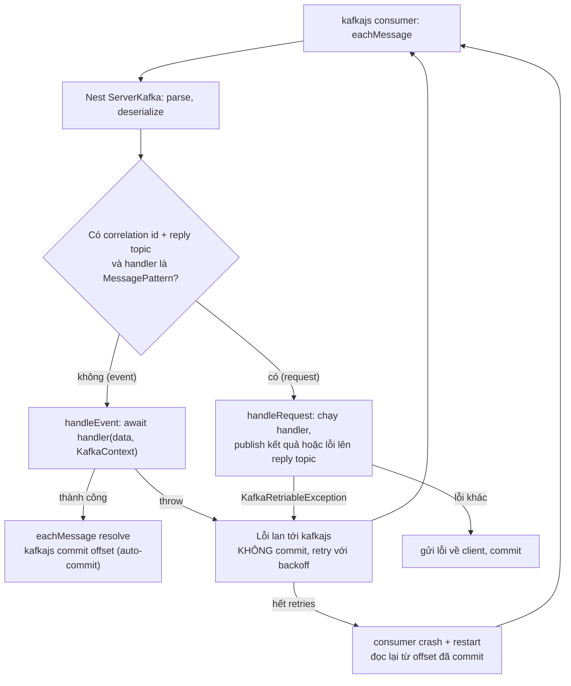

## Bối cảnh & vấn đề

Một team viết lại consumer `orders.created` từ Express + kafkajs sang Nest với `@EventPattern`. Code ngắn hơn một nửa, có DI, có test. Hai tuần sau, một message có payload sai schema làm handler ném lỗi. Nest log lỗi, nhưng consumer lag của partition 3 tăng mãi: không message nào sau nó được xử lý. Cùng tuần đó, một endpoint được thêm lời gọi API đối tác (thỉnh thoảng mất 40 giây) vào handler; consumer group bắt đầu **rebalance liên tục**, lag tăng ở mọi partition, và các message bị xử lý lại nhiều lần.

`@nestjs/microservices` cho bạn một abstraction đẹp: cùng một kiểu handler (`@MessagePattern`, `@EventPattern`) cho TCP, Redis, NATS, RabbitMQ, Kafka, gRPC. Nhưng abstraction đồng nghĩa với việc **giấu** các quyết định quan trọng nhất của một consumer: khi nào commit offset, lỗi thì retry thế nào, heartbeat ra sao. Bài này giải thích mô hình của module microservices, hybrid app, cách lỗi đi trong context `rpc`, và đo thật hành vi của Kafka transport trên Nest 12 để bạn biết phải tự thêm gì. Lý thuyết Kafka (partition, consumer group, rebalance, delivery semantics) ở track [Messaging & Kafka](/tracks/messaging-kafka).

**Interview angle:** "Request-response qua Kafka có phải ý hay không?" và "handler ném lỗi thì message đi đâu?" là hai câu phân loại người đã chạy consumer ở production với người chỉ đọc docs.

## Khái niệm

### Transport và hai kiểu pattern

**Transport** là lớp truyền tin: `Transport.TCP`, `REDIS`, `NATS`, `MQTT`, `RMQ` (RabbitMQ), `KAFKA`, `GRPC`, hoặc custom transport tự viết. Một **microservice** Nest là app lắng nghe trên transport thay vì HTTP; handler được chọn theo **pattern** (một chuỗi hoặc object, với Kafka là tên topic).

- **`@MessagePattern('inventory.reserve')`**: **request-response**. Client gọi `client.send(pattern, data)` và nhận một Observable của kết quả. Transport phải mang được phản hồi về: TCP có sẵn kết nối hai chiều, Kafka cần **reply topic** (client gọi `subscribeToResponseOf(pattern)` và Nest tạo topic `<pattern>.reply`).
- **`@EventPattern('order.created')`**: **event**, fire-and-forget. Client gọi `client.emit(pattern, data)` và không chờ gì. Phù hợp với "đã xảy ra chuyện X", để nhiều consumer độc lập phản ứng.

Độ bền phụ thuộc transport, không phụ thuộc Nest: Kafka và RabbitMQ giữ message cho consumer offline; TCP và Redis pub/sub thì không (consumer không chạy lúc message được gửi là mất).

### Request-response qua broker thường là smell

Request-response qua Kafka thêm latency (hai lần ghi vào log, hai lần poll), thêm coupling về thời gian (bên gọi phải chờ bên kia đang chạy và không bị lag), và thêm độ phức tạp (reply topic, correlation id, timeout, xử lý phản hồi đến muộn). Nếu bạn cần câu trả lời **ngay** để trả cho user, HTTP hoặc gRPC trực tiếp thường tốt hơn. Kafka mạnh ở chỗ **tách rời theo thời gian**: bên gửi không cần biết ai nhận và khi nào.

### Hybrid app

**Hybrid app** là một app Nest vừa phục vụ HTTP vừa lắng nghe một hoặc nhiều transport: `app.connectMicroservice(options)` rồi `await app.startAllMicroservices()` trước `app.listen()`. Controller có thể chứa cả route HTTP lẫn `@EventPattern`. Enhancer đăng ký bằng `useGlobal*` trên app HTTP **không** tự áp dụng cho microservice được connect, trừ khi truyền `{ inheritAppConfig: true }` làm tham số thứ hai của `connectMicroservice`; enhancer đăng ký bằng `APP_*` provider thì áp dụng cho mọi context.

Chi phí của hybrid: HTTP và consumer chia chung **một event loop** và một CPU budget. Consumer xử lý nặng (parse, tính toán) làm tăng latency của API; peak traffic API làm consumer chậm poll, lag tăng, thậm chí rebalance. Và bạn không scale được hai phần độc lập (API cần 10 pod lúc cao điểm, consumer bị giới hạn bởi số partition). Thoả hiệp phổ biến: **một codebase, hai entrypoint** (`main.api.ts` và `main.worker.ts`), deploy thành hai Deployment.

### Lỗi trong context rpc

Trong microservice, `ArgumentsHost.getType()` là `'rpc'`. `HttpException` không có ý nghĩa ở đây: không có status HTTP để trả. Cách của Nest là **`RpcException`**: `throw new RpcException({ code: 'INSUFFICIENT_STOCK' })` và client nhận đúng object đó dưới dạng lỗi của Observable. Filter tuỳ chỉnh cho RPC kế thừa `BaseRpcExceptionFilter` và trả về `throwError(() => ...)`.

Với **event handler**, không có ai để trả lỗi về. Lỗi quyết định hành vi của transport: với Kafka, lỗi lan tới kafkajs, và kafkajs **không commit** offset đó mà retry, tức là partition đứng yên cho tới khi message qua được (đo thật bên dưới). Nest có `KafkaRetriableException` để đánh dấu lỗi nên retry cho request-response; với event handler trên Nest 12.1.1, mọi lỗi đều lan tới kafkajs (mã nguồn ghi `propagatesEventHandlerErrors = true`, verify với phiên bản bạn dùng).

### Heartbeat, session timeout và rebalance

Consumer trong một **consumer group** phải chứng minh mình còn sống: gửi **heartbeat** định kỳ và poll trong giới hạn thời gian. Với kafkajs, heartbeat được gửi giữa các lần xử lý; một handler chạy lâu hơn `sessionTimeout` (mặc định 30 giây) mà không gọi `heartbeat()` làm broker coi consumer là chết, **rebalance** group, và giao partition cho consumer khác. Message đang xử lý chưa commit sẽ được consumer mới xử lý lại, trong khi consumer cũ có thể vẫn đang chạy nó: xử lý trùng. Nest cung cấp `context.getHeartbeat()` trong `KafkaContext` để handler dài gọi heartbeat thủ công.

## Cơ chế hoạt động



Diễn giải: Nest đăng ký một `eachMessage` với kafkajs. Mỗi message được deserialize; nếu là event, Nest `await` handler. Handler resolve thì `eachMessage` resolve, và kafkajs đánh dấu offset để auto-commit. Handler ném lỗi thì `eachMessage` reject; kafkajs retry chính message đó với backoff theo cấu hình `retry`, và khi hết số lần retry, consumer bị restart và đọc lại từ offset đã commit, tức là **chính message đó** lần nữa. Vì offset không bao giờ tiến qua message lỗi, mọi message sau nó trong **cùng partition** bị chặn: đó là **poison message**.

Với request-response, lỗi thường được gửi về client qua reply topic và offset vẫn được commit; chỉ `KafkaRetriableException` làm Nest reject để kafkajs retry.

## Ví dụ thực tế

### TCP: MessagePattern, EventPattern, hybrid, và lỗi

Chạy thật trên Nest 12.1.1, một process hybrid (HTTP + TCP microservice trên port 4001), client là `ClientProxy` từ `ClientsModule`:

```ts
@Controller()
class InventoryHandlers {
  @MessagePattern('inventory.reserve')
  reserve(@Payload() p: { sku: string; qty: number }) {
    if (p.qty > 10) throw new RpcException({ code: 'INSUFFICIENT_STOCK', sku: p.sku });
    if (p.qty < 0) throw new NotFoundException('HttpException thrown in RPC handler');
    return { reserved: p.qty };
  }
  @EventPattern('order.created')
  async onOrderCreated(@Payload() p: { orderId: string }) { log(`event handler got ${p.orderId}`); await sleep(50); log(`event handler finished ${p.orderId}`); }
}
@Controller('api')
class ApiController {
  constructor(@Inject('INVENTORY') private client: ClientProxy) {}
  @Get('checkout') async checkout() {
    const res = await firstValueFrom(this.client.send('inventory.reserve', { sku: 'A', qty: 2 }).pipe(timeout(1000)));
    this.client.emit('order.created', { orderId: 'o-1' }); // fire-and-forget
    return res;
  }
}
const app = await NestFactory.create(AppModule);
app.connectMicroservice<MicroserviceOptions>({ transport: Transport.TCP, options: { port: 4001 } });
await app.startAllMicroservices();
await app.listen(0);
```

```text
[ 135ms] handler reserve {"sku":"A","qty":2}
[ 138ms] event handler got o-1
[ 142ms] GET /api/checkout -> {"reserved":2}
[ 142ms] handler reserve {"sku":"A","qty":50}
[ 143ms] client.send qty=50 rejected with {"code":"INSUFFICIENT_STOCK","sku":"A"}
[ 143ms] handler reserve {"sku":"A","qty":-1}
[ 143ms] client.send qty=-1 rejected with {"status":"error","message":"Internal server error"}
[ 144ms] unknown pattern -> "There is no matching message handler defined in the remote service."
[ 189ms] event handler finished o-1
```

`send` chờ kết quả (`{"reserved":2}`) còn `emit` không: HTTP response trả về ở 142 ms trong khi event handler kết thúc ở 189 ms. `RpcException` truyền nguyên object lỗi về client. `NotFoundException` (một `HttpException`) ném trong handler RPC thành `"Internal server error"`: status 404 bị **mất**, đúng lý do domain layer không nên ném `HttpException`. Đây cũng là lý do filter HTTP "bắt tất cả" hoạt động sai với lỗi từ microservice (bài [Interceptors & filters](/tracks/nestjs/learn/interceptors-filters)).

### Kafka: một poison message chặn cả partition

Kafka 3.9.1 (KRaft, một broker trong Docker), kafkajs, Nest 12.1.1. Ba message vào **một** partition: `o-1`, `o-2-poison` (handler ném lỗi), `o-3`. Consumer retry 2 lần, `initialRetryTime` 300 ms, chạy 15 giây:

```ts
@Controller()
class OrdersConsumer {
  @EventPattern<string>(topic)
  async handle(@Payload() p: any, @Ctx() ctx: KafkaContext) {
    attempts[p.id] = (attempts[p.id] ?? 0) + 1;
    log(`handle ${p.id} (attempt ${attempts[p.id]}, partition ${ctx.getPartition()}, offset ${ctx.getMessage().offset})`);
    if (p.poison) throw new Error(`cannot parse ${p.id}`);
  }
}
const app = await NestFactory.createMicroservice<MicroserviceOptions>(AppModule, {
  transport: Transport.KAFKA,
  options: { client: { brokers: ['localhost:19092'] }, consumer: { groupId, retry: { retries: 2, initialRetryTime: 300 } }, subscribe: { fromBeginning: true } },
});
```

```text
[  219ms] produced o-1, o-2-poison, o-3 to one partition
[  618ms] handle o-1 (attempt 1, partition 0, offset 0)
[  619ms] handle o-2-poison (attempt 1, partition 0, offset 1)
ERROR [RpcExceptionsHandler] Error: cannot parse o-2-poison
[  991ms] handle o-2-poison (attempt 2, partition 0, offset 1)
[ 1683ms] handle o-2-poison (attempt 3, partition 0, offset 1)
[ 2836ms] handle o-2-poison (attempt 4, partition 0, offset 1)
...
[14256ms] handle o-2-poison (attempt 21, partition 0, offset 1)
[15245ms] attempts: {"o-1":1,"o-2-poison":21}
```

Sau 15 giây: `o-2-poison` bị xử lý **21 lần**, và `o-3` **chưa bao giờ** được xử lý. Nhịp retry cho thấy cả hai tầng: kafkajs retry trong một lần chạy consumer, rồi khi hết retries, consumer restart và bắt đầu lại từ offset 1. Log "ERROR" lặp lại mỗi lần là tất cả những gì bạn thấy; không có DLQ, không có cảnh báo lag nếu bạn không tự đo. Đây là hành vi đúng của **at-least-once without skip**: an toàn về dữ liệu, nhưng một message hỏng dừng cả partition.

### Tự thiết kế retry + DLQ

Handler phải **tự** phân loại lỗi thay vì để lỗi lan ra transport:

```ts
@EventPattern('orders.created')
async handle(@Payload() raw: unknown, @Ctx() ctx: KafkaContext) {
  const msg = ctx.getMessage();
  const attempt = Number(msg.headers?.['x-attempt']?.toString() ?? '0');
  const parsed = OrderCreated.safeParse(raw);                      // runtime contract validation (zod)
  if (!parsed.success) return this.dlq.send('orders.created.dlq', msg, 'SCHEMA_INVALID'); // permanent: never retry

  try {
    await this.idempotency.runOnce(parsed.data.eventId, () => this.orders.onCreated(parsed.data));
  } catch (e) {
    if (isTransient(e) && attempt < 5) {
      return this.retry.send('orders.created.retry.1m', msg, attempt + 1); // delayed retry topic, partition unblocked
    }
    return this.dlq.send('orders.created.dlq', msg, classify(e));
  }
}
```

Đoạn này minh hoạ (không có output). Nguyên tắc: lỗi **permanent** (schema sai, dữ liệu không hợp lệ) đi thẳng DLQ; lỗi **transient** (timeout, 503) đi retry topic có độ trễ, để partition chính tiếp tục chạy; handler **idempotent** theo `eventId` vì at-least-once; handler **không ném lỗi** ra transport trừ khi bạn thật sự muốn chặn partition (ví dụ DB chết hoàn toàn và mọi message đều sẽ fail). Đánh đổi: retry topic phá thứ tự theo key (message sau của cùng khách hàng có thể được xử lý trước message đang chờ retry), nên với luồng cần thứ tự nghiêm ngặt, phải chặn theo key hoặc chấp nhận dừng partition.

### Handler chậm và vòng xoáy rebalance

Kịch bản trong phần Bối cảnh (minh hoạ theo cơ chế, không chạy lại ở đây): handler gọi API đối tác mất tới 40 giây, lớn hơn `sessionTimeout` 30 giây. Consumer không heartbeat kịp, broker đá nó khỏi group, rebalance giao partition cho consumer khác, consumer đó đọc lại message chưa commit và cũng gọi API chậm, rồi cũng bị đá. Trong lúc rebalance, **cả group** dừng xử lý (với eager rebalance protocol mặc định của kafkajs), nên lag tăng ở mọi partition chứ không chỉ partition có message chậm.

Cách sửa, theo thứ tự ưu tiên:

1. **Timeout cho call ra ngoài** ngắn hơn nhiều so với session timeout (`AbortSignal.timeout(5000)`); lỗi timeout là transient, đi retry topic.
2. Handler dài bắt buộc: gọi `await ctx.getHeartbeat()()` giữa các bước.
3. Tách phần chậm sang một topic/queue riêng, consumer chính chỉ ghi nhận và chuyển tiếp.
4. Giảm kích thước batch (`maxBytesPerPartition`, `maxBytes`) để mỗi lượt poll ít việc hơn.
5. Tăng partition + instance để song song hoá; **trong** một partition, chỉ song song theo **key khác nhau** để giữ thứ tự per-key (ví dụ hàng đợi per-customer trong bộ nhớ, hoặc thư viện hỗ trợ key-ordered concurrency).
6. Chỉ sau đó mới cân nhắc tăng `sessionTimeout`/`rebalanceTimeout`: tăng quá lớn làm việc phát hiện consumer thật sự chết chậm đi.

Quan sát: log sự kiện rebalance (`consumer.on(consumer.events.GROUP_JOIN, ...)` qua `ctx.getConsumer()` hoặc `unwrap()`), lag theo partition, thời gian xử lý mỗi message (histogram).

### Viết lại một consumer Express bằng Nest

Những gì thay đổi: `consumer.run({ eachMessage })` thành `@EventPattern('topic')` với DI cho handler, `producer.send` thành `ClientKafka.emit()`, và một entrypoint worker riêng (hoặc hybrid). Những gì phải **giữ hoặc tự làm lại**, vì transport không cho sẵn: idempotency (dedupe theo event id), retry/DLQ theo phân loại lỗi, commit sau khi xử lý xong, thứ tự theo key, graceful shutdown (dừng fetch, chờ in-flight, commit), validate contract runtime ở consumer. Việc đầu tiên nên kiểm chứng trong một POC là đúng thí nghiệm poison message ở trên: handler ném lỗi thì chuyện gì xảy ra với partition, và bạn có kiểm soát được commit không. Nếu transport của Nest không cho đủ kiểm soát (ví dụ bạn cần manual commit theo batch, hoặc cooperative rebalancing), bọc kafkajs (hoặc client khác) trực tiếp trong một provider và quản lý vòng đời bằng lifecycle hooks: vẫn có DI và test, chỉ bỏ phần abstraction transport.

## Trade-offs & lựa chọn thay thế

| Lựa chọn | Ưu | Nhược | Dùng khi |
|---|---|---|---|
| `@MessagePattern` qua TCP/NATS | Request-response đơn giản giữa service | Coupling thời gian; TCP không bền | Nội bộ, latency thấp, không cần bền |
| `@MessagePattern` qua Kafka | Dùng chung hạ tầng | Latency cao, reply topic, timeout phức tạp | Hiếm khi đáng; ưu tiên HTTP/gRPC |
| `@EventPattern` qua Kafka/RMQ | Tách rời thời gian, bền | Tự lo retry/DLQ/idempotency | Domain event, integration event |
| Hybrid app | Một deploy, chia sẻ code | Chung event loop, không scale riêng | Consumer nhẹ, traffic thấp |
| Hai entrypoint (api + worker) | Scale và deploy độc lập | Hai Deployment | Mặc định cho production |
| Kafka transport của Nest | DI, decorator, ít boilerplate | Giấu commit/retry; lỗi chặn partition | Luồng đơn giản, đã test hành vi lỗi |
| Bọc client Kafka trong provider | Kiểm soát đầy đủ offset, batch, rebalance | Nhiều code hơn | Throughput cao, yêu cầu đặc biệt |

Chọn thế nào: event cho giao tiếp bất đồng bộ giữa bounded context; HTTP/gRPC cho query cần trả lời ngay. Worker tách khỏi API khi consumer có tải đáng kể. Dùng Kafka transport của Nest khi bạn đã kiểm chứng hành vi lỗi và nó đủ; bọc client trực tiếp khi cần kiểm soát offset.

## Edge cases & failure modes

- **Poison message**: một payload hỏng chặn partition vô thời hạn (đo thật: 21 lần thử trong 15 giây, message sau không bao giờ chạy).
- **Kiểu pattern trên Nest 12**: `@EventPattern(topicVariable)` với biến kiểu `string` báo lỗi TypeScript về kiểu `data` (Nest 12 thêm typed pattern); dùng `@EventPattern<string>(topic)` hoặc khai báo map kiểu event (verify trên phiên bản của bạn).
- **Rebalance storm**: handler chậm hơn session timeout, cả group dừng xử lý lặp đi lặp lại.
- **Xử lý trùng sau rebalance**: consumer cũ vẫn đang xử lý message mà consumer mới cũng nhận; side effect (gửi email, trừ tiền) phải idempotent.
- **Reply đến muộn** với request-response: client đã timeout, kết quả đến sau bị bỏ, nhưng side effect đã xảy ra ở phía server.
- **Hybrid + `useGlobal*`**: validation/guard có ở HTTP nhưng không có ở consumer; message sai vẫn vào handler.
- **TCP/Redis pub/sub**: consumer restart trong lúc có event là mất event; không dùng cho dữ liệu cần bền.

## Pitfalls

- ❌ Để handler Kafka ném lỗi "cho framework lo" → ✅ tự phân loại: permanent vào DLQ, transient vào retry topic, chỉ ném khi muốn chặn partition.
- ❌ Ném `HttpException` trong handler RPC → ✅ `RpcException` hoặc domain error + RPC filter; `HttpException` thành "Internal server error".
- ❌ Request-response qua Kafka cho query của user → ✅ HTTP/gRPC; Kafka cho event.
- ❌ Gọi API chậm trong handler không timeout → ✅ timeout ngắn, heartbeat thủ công cho việc dài, tách phần chậm ra topic khác.
- ❌ Song song hoá message trong partition bất kể key → ✅ chỉ song song theo key khác nhau để giữ thứ tự per-key.
- ❌ Hybrid app cho consumer nặng → ✅ entrypoint worker riêng, deploy riêng.
- ❌ Tin rằng Nest xử lý commit/retry như bạn mong đợi → ✅ POC với poison message và kill process giữa chừng trước khi lên production.

## Tóm tắt

- `@nestjs/microservices`: transport TCP, Redis, NATS, MQTT, RabbitMQ, Kafka, gRPC, custom; handler chọn theo pattern.
- `@MessagePattern` + `send()` là request-response (Kafka cần reply topic); `@EventPattern` + `emit()` là fire-and-forget. Request-response qua broker thường là smell.
- Hybrid app: `connectMicroservice` + `startAllMicroservices`; `useGlobal*` không áp dụng cho microservice (trừ `inheritAppConfig`), `APP_*` thì có; tải nặng thì tách entrypoint worker.
- Context `rpc`: `RpcException` truyền nguyên lỗi về client; `HttpException` thành "Internal server error" (đo thật).
- Kafka event handler ném lỗi: offset không commit, kafkajs retry rồi restart consumer, partition bị chặn (đo thật trên Nest 12.1.1 + Kafka 3.9.1).
- Tự làm: phân loại lỗi, retry topic + DLQ, idempotency theo event id, timeout cho call ngoài, heartbeat cho việc dài, song song theo key.
- Handler chậm hơn session timeout gây rebalance storm; sửa bằng timeout, tách việc chậm, batch nhỏ, thêm partition, cuối cùng mới chỉnh timeout.
