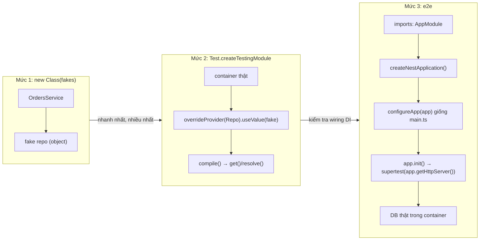

## Bối cảnh & vấn đề

Pipeline CI xanh, 600 test pass, coverage 85%. Deploy lên production, và `POST /orders` với body `{"sku":"A","quantity":"1","admin":true}` trả 400 ở production nhưng 201 trong e2e test. Không ai sửa gì giữa hai lần. Nguyên nhân: `ValidationPipe` global được đăng ký trong `main.ts`, và e2e test tạo app từ `AppModule`, **không chạy** `main.ts`. Test đang kiểm tra một ứng dụng khác với ứng dụng chạy ở production.

DI làm Nest dễ test: mọi dependency đều có thể thay bằng giả. Nhưng chính sự dễ dàng đó tạo ra hai cái bẫy: test lệch cấu hình so với production (như trên), và test override quá nhiều thứ tới mức không còn kiểm tra gì thật (`overrideGuard` trong mọi test, nên chưa bao giờ có test nào chạy guard thật). Bài này đi qua ba mức test trong Nest, đo thật bẫy cấu hình, và cách test provider có scope, thứ mà `get()` không làm được. Lý thuyết chung về chiến lược test ở track [Testing](/tracks/testing).

**Interview angle:** "e2e xanh nhưng production 400" là câu scenario hay; câu trả lời mạnh chỉ ra `main.ts` vs `AppModule` và đề xuất `configureApp(app)` dùng chung hoặc chuyển sang `APP_*` providers.

## Khái niệm

### Mức 1: khởi tạo class trực tiếp

Service Nest là class TypeScript bình thường. Với logic thuần (tính giá, kiểm tra quy tắc, map dữ liệu), cách nhanh nhất là `new OrdersService(fakeRepo)`: không có container, không có metadata, chạy trong vài mili giây. Đây là mức nên có nhiều test nhất. Nếu một service khó `new` vì cần quá nhiều dependency, đó là tín hiệu thiết kế (service làm quá nhiều việc), không phải lý do dùng container.

### Mức 2: testing module

**`Test.createTestingModule({ imports, providers, controllers })`** (từ `@nestjs/testing`) dựng một container thật với các module bạn chỉ định, rồi `.compile()` trả về một `TestingModule`. Trước khi compile, bạn có thể thay thế:

- `.overrideProvider(Token).useValue(mock)` (hoặc `useClass`, `useFactory`): thay một provider ở bất kỳ đâu trong đồ thị.
- `.overrideGuard(Guard)`, `.overrideInterceptor(...)`, `.overridePipe(...)`, `.overrideFilter(...)`: thay enhancer.
- `.overrideModule(Module).useModule(FakeModule)`: thay cả một module.

`moduleRef.get(Token)` lấy instance **singleton**. Mức này kiểm tra những thứ mà `new` không kiểm tra được: wiring DI (module có export đủ không), provider factory, và sự kết hợp của nhiều provider thật.

### Mức 3: e2e với ứng dụng thật

E2E trong Nest nghĩa là `imports: [AppModule]`, `moduleRef.createNestApplication()`, **áp dụng cùng cấu hình như `main.ts`**, `await app.init()`, rồi gửi request bằng **supertest** vào `app.getHttpServer()` (không cần mở port thật). Database nên là thật (PostgreSQL trong container, qua Testcontainers hoặc docker compose), vì mock DB không bắt được lỗi SQL, constraint, transaction.

Điểm then chốt: `main.ts` không chạy trong test. Mọi thứ đăng ký ở đó (`useGlobalPipes`, `useGlobalFilters`, `enableCors`, `setGlobalPrefix`, `enableVersioning`) phải được áp dụng lại. Hai cách: tách một hàm `configureApp(app)` dùng chung cho `main.ts` và test, hoặc chuyển enhancer sang provider `APP_PIPE`/`APP_FILTER`/`APP_GUARD`/`APP_INTERCEPTOR` để chúng là một phần của `AppModule`.

### Provider có scope trong test

`get()` chỉ trả instance tĩnh. Với provider **REQUEST** hoặc **TRANSIENT** (hoặc provider bị lan ngược thành request-scoped), `get()` ném `InvalidClassScopeException`. Dùng **`await moduleRef.resolve(Token)`**: mỗi lần gọi không kèm context id tạo một context mới, nên hai lần `resolve` trả hai instance khác nhau. Muốn cùng instance, tạo `const contextId = ContextIdFactory.create()` và truyền vào mọi lần `resolve`. Muốn giả lập request, `moduleRef.registerRequestByContextId(fakeReq, contextId)` để token `REQUEST` trong cây đó là `fakeReq`.

### Runner: Jest hay Vitest

`@nestjs/testing` không phụ thuộc test runner. Với Nest 12 (package ESM-only), migration guide ghi: project ESM mặc định dùng **Vitest**, project CommonJS vẫn dùng Jest, và Jest cần Node 24.9+ để load được package ESM của Nest 12 (lỗi `ERR_REQUIRE_ASYNC_MODULE` trên Node cũ hơn) (verify). Các ví dụ dưới đây chạy bằng `node:assert` thuần để không phụ thuộc runner.

## Cơ chế hoạt động



Diễn giải: ba mức kiểm tra ba loại lỗi khác nhau. Mức 1 bắt lỗi logic. Mức 2 bắt lỗi wiring (thiếu `exports`, factory sai, provider trùng). Mức 3 bắt lỗi tích hợp: thứ tự lifecycle, enhancer global, serialization, SQL thật. Mũi tên từ `configureApp(app)` là nơi e2e hay lệch production: bỏ bước đó là test một app khác. Tỉ lệ hợp lý thường là nhiều test mức 1, một lượng vừa phải mức 2 cho các module có wiring phức tạp, và một bộ e2e tập trung vào luồng chính và các quy tắc xuyên suốt (auth, validation, định dạng lỗi).

## Ví dụ thực tế

### Ba mức test và bẫy main.ts, chạy thật

Nest 12.1.1, supertest, `node:assert`:

```ts
@Injectable() class OrdersRepository { async insert(_o: object): Promise<string> { throw new Error('real DB not available in tests'); } }
@Injectable() class OrdersService {
  constructor(private repo: OrdersRepository) {}
  async create(sku: string, qty: number) { if (qty > 50) throw new Error('qty limit'); return { id: await this.repo.insert({ sku, qty }), sku, qty }; }
}
@Injectable() class JwtAuthGuard implements CanActivate { canActivate(): boolean { throw new UnauthorizedException(); } }
class CreateOrderDto { @IsString() sku!: string; @IsInt() @Min(1) quantity!: number; }
@Controller('orders') @UseGuards(JwtAuthGuard)
class OrdersController { constructor(private s: OrdersService) {} @Post() create(@Body() b: CreateOrderDto) { return this.s.create(b.sku, b.quantity); } }
@Module({ controllers: [OrdersController], providers: [OrdersService, OrdersRepository] }) class AppModule {}

// 1) unit: plain constructor, no Nest at all
const svc = new OrdersService({ insert: async () => 'ord_1' } as OrdersRepository);
assert.deepEqual(await svc.create('A', 2), { id: 'ord_1', sku: 'A', qty: 2 });
await assert.rejects(svc.create('A', 51), /qty limit/);

// 2) testing module + overrideProvider
const mod = await Test.createTestingModule({ providers: [OrdersService, OrdersRepository] })
  .overrideProvider(OrdersRepository).useValue({ insert: async () => 'ord_2' }).compile();
console.log('testing module:', JSON.stringify(await mod.get(OrdersService).create('B', 1)));

// 3) e2e from AppModule, with and without the main.ts configuration
export const configureApp = (app: INestApplication) =>
  app.useGlobalPipes(new ValidationPipe({ whitelist: true, forbidNonWhitelisted: true }));
async function e2e(label: string, configure: (app: INestApplication) => void) {
  const m = await Test.createTestingModule({ imports: [AppModule] })
    .overrideProvider(OrdersRepository).useValue({ insert: async () => 'ord_3' })
    .overrideGuard(JwtAuthGuard).useValue({ canActivate: () => true })
    .compile();
  const app = m.createNestApplication(); configure(app); await app.init();
  const res = await request(app.getHttpServer()).post('/orders').send({ sku: 'A', quantity: '1', admin: true });
  console.log(`e2e ${label}: ${res.status} ${JSON.stringify(res.body)}`);
  await app.close();
}
await e2e('forgot main.ts config  ', () => {});
await e2e('with configureApp(app) ', configureApp);
```

```text
unit (new OrdersService(fake)): ok
testing module: {"id":"ord_2","sku":"B","qty":1}
e2e forgot main.ts config  : 201 {"id":"ord_3","sku":"A","qty":"1"}
e2e with configureApp(app) : 400 {"message":["property admin should not exist","quantity must not be less than 1","quantity must be an integer number"],"error":"Bad Request","statusCode":400}
```

Dòng thứ ba là incident ở phần Bối cảnh: không có pipe global, request có `quantity: "1"` (chuỗi) và field lạ `admin` được chấp nhận, và `qty` trong response là chuỗi `"1"`. Dòng thứ tư, với cùng cấu hình như `main.ts`, từ chối đúng như production. Đây là lý do `configureApp` phải là **một hàm duy nhất** được gọi ở cả hai nơi, hoặc lý do nên dùng `APP_PIPE`: provider là một phần của `AppModule` nên test không thể quên.

Test này còn cho thấy vấn đề của `overrideGuard`: guard thật (luôn ném 401) chưa bao giờ chạy. Nếu mọi e2e đều override guard, một bug làm guard cho qua mọi request sẽ không bị test nào bắt. Giữ ít nhất một bộ e2e chạy guard **thật** với token ký bằng key test (hoặc một IdP giả), kiểm tra 401 khi thiếu token, 403 khi thiếu quyền, và tenant isolation.

### Provider request-scoped trong test

```ts
@Injectable({ scope: Scope.REQUEST })
class TenantContext { constructor(@Inject(REQUEST) public req: any) {} get tenant() { return this.req.headers['x-tenant']; } }

const mod = await Test.createTestingModule({ providers: [TenantContext] }).compile();
try { mod.get(TenantContext); } catch (e: any) { console.log('get():', e.constructor.name); }
const ctxId = ContextIdFactory.create();
mod.registerRequestByContextId({ headers: { 'x-tenant': 'acme' } }, ctxId);
const a = await mod.resolve(TenantContext, ctxId), b = await mod.resolve(TenantContext, ctxId);
const c = await mod.resolve(TenantContext, ContextIdFactory.create());
console.log('resolve(ctxId) x2 same:', a === b, '| tenant:', a.tenant, '| other ctxId same:', a === c);
```

```text
get(): InvalidClassScopeException
resolve(ctxId) x2 same: true | tenant: acme | other ctxId same: false
```

`get()` từ chối, `resolve()` với cùng context id trả cùng instance (mô phỏng "cùng một request"), context id khác trả instance khác, và `registerRequestByContextId` cho phép giả lập request với header tuỳ ý. Đây là kỹ thuật cũng dùng được trong code production để chạy provider request-scoped trong job cron (bài [Injection scopes](/tracks/nestjs/learn/injection-scopes)).

### Phát hiện trong CI khi một controller nóng bị lan ngược thành request-scoped

Lan ngược scope không có cảnh báo nào (bài Injection scopes). Một test rẻ bắt được nó: dựng `AppModule` bằng testing module, rồi với danh sách controller "nóng", khẳng định `moduleRef.get(OrdersController)` **không ném** lỗi. Nếu ai đó thêm một dependency request-scoped vào đâu đó trong chuỗi, `get()` bắt đầu ném `InvalidClassScopeException` và CI đỏ. Bổ sung bằng một benchmark nhỏ (autocannon trên endpoint chính) chạy định kỳ để thấy xu hướng latency.

### POC đánh giá Nest cho team

Câu hỏi behavioral "kể về POC Nest" cần trung thực: nếu đã làm, kể số liệu thật; nếu chưa, trình bày kế hoạch. Một khung POC hợp lý (điền số liệu của bạn):

- **Phạm vi**: 1–2 endpoint thật của hệ thống hiện tại (ví dụ quản lý địa chỉ), auth guard global với JWT thật, validation, một Kafka consumer, test ở cả ba mức.
- **Tiêu chí đo trước khi bắt đầu**: thời gian làm feature mẫu so với Express; số dòng code và độ dễ test (có cần mock module không); overhead latency bằng load test (so sánh p50/p99 cùng endpoint); thời gian onboarding một dev chưa biết Nest; tương thích với thư viện đang dùng (logger, tracing, ORM).
- **Thí nghiệm rủi ro**: chính những thứ trong track này: thứ tự lifecycle, poison message trên Kafka transport, graceful shutdown dưới tải, request scope.
- **Kết luận có điều kiện**: ví dụ "dùng Nest cho service mới có domain phức tạp, giữ Express cho service nhỏ và lambda", ghi thành ADR.
- **Điều khiến bạn không chọn Nest**: overhead đo được lớn ở endpoint nóng, hành vi Kafka transport không kiểm soát được mà phải bọc client riêng (mất phần lớn lợi ích), hoặc team không có thời gian học DI/lifecycle.

## Trade-offs & lựa chọn thay thế

| Mức | Tốc độ | Bắt được | Không bắt được | Lượng nên có |
|---|---|---|---|---|
| `new Class(fakes)` | Nhanh nhất (ms) | Lỗi logic | Wiring DI, enhancer, SQL | Nhiều nhất |
| Testing module + override | Nhanh | Wiring, factory, export | Enhancer global trong `main.ts`, SQL thật | Vừa phải |
| E2E + DB thật | Chậm (giây) | Tích hợp, lifecycle, serialization, SQL | Hành vi dưới tải | Tập trung vào luồng chính |
| E2E với `overrideGuard` | Nhanh hơn e2e thật | Logic sau guard | Bug auth | Có, nhưng không phải tất cả |

| Cách áp dụng cấu hình cho e2e | Ưu | Nhược |
|---|---|---|
| `configureApp(app)` dùng chung | Không đổi kiến trúc, một nguồn sự thật | Phải nhớ gọi ở mọi test |
| `APP_*` providers | Không thể quên, có DI | Một số thứ (CORS, prefix, versioning) vẫn phải ở `configureApp` |

Chọn thế nào: dồn logic vào class thuần để test ở mức 1; dùng testing module khi muốn kiểm tra wiring của một module; e2e với DB thật cho các hành vi xuyên suốt, luôn qua `configureApp` (hoặc `APP_*`). Mock DB chỉ ở mức 1–2; e2e mà mock DB thường cho cảm giác an toàn giả.

## Edge cases & failure modes

- **Test lệch production**: mọi thứ trong `main.ts` không có trong test; e2e xanh vẫn có thể là một app khác.
- **`overrideProvider` không có tác dụng**: provider được tạo bằng `new` trong code (không qua DI) hoặc do một dynamic module tạo với token khác (ví dụ repository của TypeORM dùng `getRepositoryToken(Entity)`, không phải class repository).
- **Rò rỉ tài nguyên giữa test**: quên `await app.close()` giữ kết nối DB, Redis, timer; runner treo ở cuối hoặc báo "open handles".
- **Provider có scope**: `get()` ném; hai lần `resolve()` không context id trả hai instance khác nhau, test so sánh identity sẽ fail khó hiểu.
- **Jest + Nest 12 ESM**: trên Node cũ hơn 24.9, Jest không load được package ESM-only (`ERR_REQUIRE_ASYNC_MODULE`); chuyển sang Vitest hoặc nâng Node (verify).
- **Test phụ thuộc thứ tự**: dữ liệu DB dùng chung giữa test; chạy song song thì flaky. Mỗi test tự tạo dữ liệu (hoặc transaction rollback), schema riêng mỗi worker.

## Pitfalls

- ❌ Mọi unit test đều dựng testing module → ✅ `new Class(fakes)` cho logic thuần; container chỉ khi cần kiểm tra wiring.
- ❌ E2E không áp dụng cấu hình của `main.ts` → ✅ `configureApp(app)` dùng chung, hoặc `APP_PIPE`/`APP_FILTER`/`APP_GUARD`.
- ❌ `overrideGuard` trong mọi e2e → ✅ một bộ e2e chạy guard thật với token test (401, 403, tenant isolation).
- ❌ `moduleRef.get()` cho provider request/transient → ✅ `await moduleRef.resolve(X, contextId)` + `registerRequestByContextId`.
- ❌ Mock DB trong e2e → ✅ PostgreSQL thật trong container; mock chỉ ở mức thấp hơn.
- ❌ Quên `app.close()` → ✅ `afterAll(() => app.close())` để lifecycle shutdown chạy và tài nguyên được giải phóng.
- ❌ Bịa số liệu POC trong phỏng vấn → ✅ kể thật, hoặc trình bày kế hoạch POC với tiêu chí đo.

## Tóm tắt

- Ba mức: `new Class(fakes)` (nhanh, nhiều nhất), `Test.createTestingModule` + `overrideProvider`/`overrideGuard` (wiring DI), e2e với `createNestApplication` + supertest + DB thật.
- `main.ts` không chạy trong test: đo thật, e2e thiếu `ValidationPipe` trả 201 cho request mà production trả 400. Dùng `configureApp(app)` chung hoặc `APP_*` providers.
- `overrideGuard` ở mọi test nghĩa là guard thật chưa bao giờ được test; giữ một bộ e2e với auth thật.
- Provider REQUEST/TRANSIENT: `get()` ném `InvalidClassScopeException`; dùng `resolve(X, contextId)`, cùng context id thì cùng instance, `registerRequestByContextId` để giả lập request.
- Phát hiện lan ngược scope trong CI bằng cách khẳng định `get()` controller nóng không ném.
- Nest 12: Vitest mặc định cho project ESM, Jest cần Node 24.9+ (verify).
- POC: phạm vi thật, tiêu chí đo trước, thí nghiệm rủi ro, kết luận có điều kiện ghi thành ADR; trung thực về kinh nghiệm.
