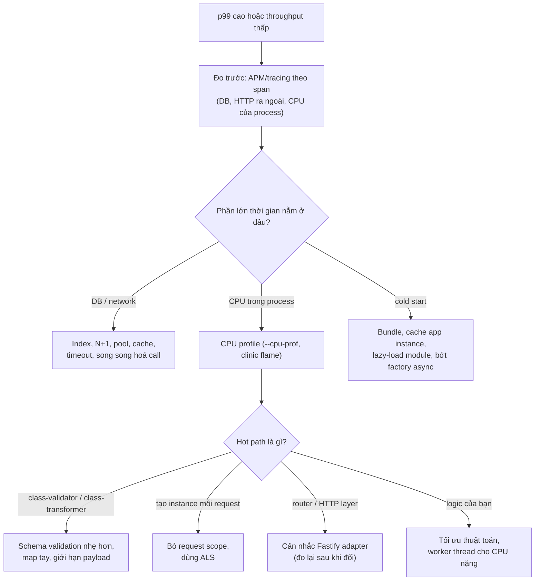

## Bối cảnh & vấn đề

Một team thấy p99 của API là 180 ms và đề xuất "chuyển từ Express sang Fastify vì Fastify nhanh gấp đôi". Hai sprint sau, sau khi viết lại toàn bộ middleware thành plugin Fastify và sửa mọi chỗ dùng `@Req()` kiểu Express, p99 vẫn là 175 ms. Profile cho thấy 160 ms trong số đó là ba query PostgreSQL và một call sang dịch vụ tính thuế. Framework chưa bao giờ là bottleneck.

Một team khác chạy Nest trên AWS Lambda và thấy cold start 2,5 giây. Và một team thứ ba nâng Nest 10 lên 12, rồi phát hiện route `/files/*` trả 404, query `?filter[status]=paid` không còn là object, và Jest không load được package.

Bài này trả lời ba câu: Nest thực sự tốn gì (đo, không đoán), khi nào Fastify đáng để đổi, và các major gần đây thay đổi những gì cần kiểm tra trước khi nâng cấp. Thông tin phiên bản ở đây là ảnh chụp tại thời điểm viết (Nest 12.1.1, Express 5.2.1, Fastify 5.12.5, Node 24) và được đánh dấu verify.

**Interview angle:** "Nest chậm hơn Express bao nhiêu?" là câu bẫy: câu trả lời tốt là "đo được overhead ở tầng framework, nhưng thường không đáng kể so với I/O; đây là số đo của tôi, và đây là cách tôi xác định bottleneck trước khi đổi gì".

## Khái niệm

### Nest tốn ở đâu

Ở runtime, mỗi request đi qua router của Nest và **mọi enhancer** áp dụng cho route (guard, interceptor, pipe; mỗi cái là một lời gọi hàm, interceptor thêm một lớp Observable). `ValidationPipe` với class-transformer và class-validator là phần tốn CPU nhất với payload lớn: nó duyệt từng property, tạo instance, chạy từng decorator. `ClassSerializerInterceptor` tương tự ở chiều ra. Provider **request-scoped** tạo lại cả chuỗi dependency mỗi request (đo ở bài [Injection scopes](/tracks/nestjs/learn/injection-scopes): giảm ~40% throughput với handler rỗng).

Ở startup, Nest phải import nhiều package, scan mọi module, đọc metadata, resolve toàn bộ đồ thị DI, await các factory async, và đăng ký route. Với app lớn (hàng trăm provider) và nhiều module bên thứ ba (TypeORM, GraphQL), phần này mất hàng trăm ms tới vài giây. Trên server chạy lâu, không ai để ý; trên serverless, đó là **cold start**.

### Express adapter vs Fastify adapter

`@nestjs/platform-fastify` thay Express bằng Fastify: router nhanh hơn, serialize JSON nhanh hơn, và overhead mỗi request thấp hơn. Đổi lại:

- Middleware viết cho Express (`helmet`, `multer`, `express-session`, `passport` session, `compression`) không cắm trực tiếp được; dùng plugin `@fastify/helmet`, `@fastify/multipart`, `@fastify/cookie`, `@fastify/compress`.
- Kiểu `req`/`res` khác (`FastifyRequest`/`FastifyReply`); code dùng `@Req()`/`@Res()` kiểu Express phải sửa (`res.status().send()` thay vì `res.status().json()`).
- Fastify mặc định chỉ listen trên `localhost`; trong container phải `app.listen(3000, '0.0.0.0')`, nếu không pod không nhận được traffic từ bên ngoài.
- Upload, raw body, cookie, CORS cấu hình qua plugin; một số thư viện của hệ sinh thái Nest chỉ hỗ trợ Express.

### Cold start trên serverless

Trên Lambda, cold start = thời gian tải code + khởi tạo runtime + chạy code init (import và `NestFactory.create`). Các cách giảm: **bundle** (esbuild, Rspack, webpack) thành một file đã tree-shake để giảm thời gian đọc và parse module; **cache instance** app giữa các invocation (tạo app một lần ở ngoài handler, dùng lại); **lazy-load module** ít dùng bằng `LazyModuleLoader` (chỉ load khi route cần); tránh factory async kết nối nhiều thứ lúc init; và cân nhắc provisioned concurrency hoặc SnapStart nếu nền tảng hỗ trợ (verify). Nếu cold start vẫn là vấn đề cốt lõi, đó là tín hiệu function đó nên là Express/Fastify thuần hoặc một handler nhỏ không framework.

### Nest 11: Express 5

Nest 11 chuyển `@nestjs/platform-express` sang **Express 5**, và Express 5 dùng `path-to-regexp` mới. Những thay đổi đáng kể:

- **Wildcard phải có tên**: `'/files/*'` thành `'/files/*path'` (bắt buộc ít nhất một segment) hoặc `'/files/{*path}'` (tuỳ chọn, tương đương `*` cũ); param là **mảng** segment. `forRoutes('*')` của middleware cũng đổi (`'*path'`/`'{*path}'`).
- **Optional param** dùng dấu ngoặc nhọn: `'/items{/:id}'` thay cho `'/items/:id?'`.
- **Query parser mặc định là `simple`**: `?filter[status]=paid` không còn thành object lồng nhau.
- Promise reject trong middleware/handler Express được chuyển thành lỗi tự động (Express 5), một số API cũ bị bỏ (`req.param()`, `res.send(status)`).

### Nest 12: ESM-only và các thay đổi khác

Theo migration guide v12 (verify toàn bộ khi nâng cấp):

- Mọi package core ship **ESM-only**. App CommonJS vẫn dùng được nhờ `require(esm)` của Node; tooling và script bootstrap tuỳ biến cần kiểm tra lại.
- **Node**: chạy app cần Node 20.19+ (hoặc 22.12+ trên nhánh 22); CLI cần 22.22.3+, 24.15+ hoặc 26+. Các nhánh lẻ (21, 23, 25) không được hỗ trợ.
- **Test**: project ESM mặc định Vitest; Jest cần Node 24.9+ để load package ESM.
- **`@nestjs/config`**: `validationSchema` nhận Standard Schema (zod, valibot, ArkType); Joi cần v18+ và option chuyển vào `validationOptions.libraryOptions`.
- **Lifecycle hooks** được gọi theo cấp trong cây component, có thể đổi thứ tự khi provider phụ thuộc nhau.
- `@Optional()` không còn được kế thừa từ class cha; microservices NATS chuyển sang `@nats-io/transport-node`; Kafka pattern hỗ trợ `RegExp`; `ValidationPipe` có option `errorFormat`; webpack bị deprecate trong CLI (Rspack mặc định cho monorepo); tuỳ chọn opt-in `routeConflictPolicy` phát hiện route bị che (`@Get(':id')` che `@Get('me')`).

## Cơ chế hoạt động



Diễn giải: mọi quyết định tối ưu bắt đầu bằng **đo**. Tracing theo span cho biết thời gian nằm ở DB, network hay trong process. Chỉ khi CPU trong process chiếm phần lớn, CPU profile mới chỉ ra hot path cụ thể. Adapter Fastify là một nhánh ở cuối cây, không phải bước đầu tiên: nó chỉ giúp khi router và HTTP layer thật sự xuất hiện trong profile. Cold start là một nhánh riêng, vì nó đo thời gian init chứ không phải thời gian xử lý request.

## Ví dụ thực tế

### Đo: Express thuần, Nest + Express, Nest + Fastify

Cùng một endpoint `GET /orders/:id` trả `{ id, total }`, không I/O. autocannon 50 connection trong 8 giây, chạy **cùng process** với server (nên CPU bị chia sẻ, số tuyệt đối thấp hơn thực tế), Node 24 trên macOS, mỗi biến thể chạy hai lần:

```ts
// express-plain
app.get('/orders/:id', (req, res) => { res.json({ id: req.params.id, total: 42 }); });
// nest-express / nest-fastify: one controller + one service
@Controller('orders') class C { constructor(private s: S) {} @Get(':id') get(@Param('id') id: string) { return this.s.get(id); } }
const app = kind === 'nest-fastify' ? await NestFactory.create(M, new FastifyAdapter()) : await NestFactory.create(M);
```

```text
express-plain  boot 93 ms | 17483 req/s, p99 5 ms
nest-express   boot 237 ms | 16365 req/s, p99 5 ms
nest-fastify   boot 290 ms | 20102 req/s, p99 4 ms
express-plain  boot 56 ms | 16702 req/s, p99 6 ms
nest-express   boot 197 ms | 15515 req/s, p99 10 ms
nest-fastify   boot 393 ms | 20218 req/s, p99 4 ms
```

(Output gốc có thêm cột thời gian import, đã bỏ vì nó đo import chung của cả script chứ không phải từng biến thể.) Đọc số: Nest trên Express mất khoảng **6–7% throughput** so với Express thuần cho một route không có guard/pipe/interceptor nào; Fastify adapter nhanh hơn Express thuần khoảng **15–20%**. Thời gian `NestFactory.create` + listen là 200–400 ms so với 56–93 ms của Express, cho một app chỉ có một module. Với handler có một query DB 5 ms, 1.000 request/giây mỗi pod, chênh lệch framework này gần như biến mất trong nhiễu; đó là lý do team ở phần Bối cảnh không thấy khác biệt.

Cách đo đúng hơn cho quyết định thật: chạy load generator ở **máy khác** (hoặc container khác có CPU riêng), dùng endpoint thật với dữ liệu thật, so p50/p99 và CPU mỗi request, và xem CPU profile có frame của router/adapter trong top không.

### Route và query trên Nest 12 (Express 5)

```ts
@Controller()
class C {
  @Get('legacy/*') legacy() { return 'legacy wildcard'; }
  @Get('files/*path') files(@Param('path') p: string[]) { return { path: p }; }
  @Get('opt{/:id}') opt(@Param('id') id?: string) { return { id: id ?? null }; }
  @Get('q') q(@Query() q: unknown) { return q; }
}
```

```text
WARN [LegacyRouteConverter] Unsupported route path: "/legacy/*". In previous versions, the symbols ?, *, and + were used to denote optional or repeating path parameters. The latest version of "path-to-regexp" now requires the use of named parameters. For example, instead of using a route like /users/* to capture all routes starting with "/users", you should use /users/{*path}. ... Attempting to auto-convert to "/legacy/{*path}"...
GET /legacy/a/b -> 200 legacy wildcard
GET /files/a/b/c.txt -> 200 {"path":["a","b","c.txt"]}
GET /opt -> 200 {"id":null}
GET /opt/5 -> 200 {"id":"5"}
GET /q?filter[status]=paid&tags=a&tags=b -> 200 {"filter[status]":"paid","tags":["a","b"]}
```

Nest 12 tự convert route cũ kèm cảnh báo, nên code cũ không vỡ ngay, nhưng cảnh báo là tín hiệu để sửa (và router Express bạn tự mount thì không được convert). Wildcard có tên trả về **mảng** segment, không phải chuỗi. Dòng cuối là thay đổi dễ gây bug âm thầm nhất: `filter[status]` giờ là một key phẳng, nên code đọc `q.filter.status` nhận `undefined` và bộ lọc bị bỏ qua, trả về **mọi** đơn thay vì chỉ đơn đã thanh toán. Nếu API cần cú pháp lồng nhau, bật lại query parser `extended` (qua `app.set('query parser', 'extended')` trên instance Express, verify) và viết test cho nó.

### Checklist trước khi nâng major

1. Đọc migration guide của **từng** major, nâng từng bước (10 → 11 → 12), không nhảy cóc.
2. Grep những chỗ dễ vỡ: route có `*`, `?`, `+` trong `@Get/@Controller/forRoutes`; code đọc query lồng nhau (`req.query.filter.`); `@Res()`/`@Req()` kiểu Express; `require()` của package Nest trong script; cấu hình Jest; `validationSchema` với Joi; code dựa vào thứ tự lifecycle hook; subclass dùng `@Optional()` từ class cha.
3. Kiểm tra thư viện bên thứ ba (TypeORM/Prisma integration, Passport, Swagger, cache-manager, nestjs-cls) có bản tương thích.
4. Chạy e2e đầy đủ (với `configureApp` như production), cộng một load test ngắn để bắt regression hiệu năng.
5. Rollout dần (canary), theo dõi tỉ lệ 4xx (route vỡ thường hiện thành 404) và 5xx.

### Legacy decorator và rủi ro dài hạn

Nest dựa vào `experimentalDecorators` + `emitDecoratorMetadata`. TC39 standard decorators (TypeScript 5.0+) không có **parameter decorator** (thứ `@Body()`, `@Inject()` cần) và không emit metadata kiểu. Node type stripping chỉ xoá kiểu, không biến đổi decorator, nên không chạy Nest trực tiếp từ `.ts`. Các thí nghiệm của track này chạy trên `tsc` 7.0.2 với hai cờ đó bật, và DI hoạt động bình thường, nên rủi ro không phải là "sắp không chạy được", mà là phụ thuộc lâu dài vào một nhánh tính năng không nằm trong chuẩn. Giảm rủi ro bằng cách giữ domain logic (tính toán, quy tắc nghiệp vụ, policy) là TypeScript thuần không decorator, để phần phụ thuộc Nest chỉ là controller, module và adapter: nếu một ngày phải rời Nest, đó là phần duy nhất phải viết lại. Phần khó chuyển nhất thường là những gì dựa vào pipeline của Nest: guard/interceptor/filter tuỳ biến, DTO class-validator, và các dynamic module tự viết.

## Trade-offs & lựa chọn thay thế

| Tối ưu | Lợi ích điển hình | Chi phí | Khi nào |
|---|---|---|---|
| Fastify adapter | +15–20% throughput HTTP (đo ở trên), p99 thấp hơn | Viết lại middleware, `@Req/@Res`, listen `0.0.0.0` | Profile cho thấy HTTP layer là hot path |
| Schema validation (zod) thay class-validator | Ít CPU với payload lớn | Viết pipe riêng, mất tích hợp Swagger sẵn | Endpoint nhận payload lớn, nóng |
| Map tay thay `ClassSerializerInterceptor` | Ít CPU, whitelist rõ | Code lặp | Response lớn, endpoint nóng |
| Bỏ request scope | Hết chi phí tạo chuỗi mỗi request | Chuyển sang ALS hoặc tham số | Luôn, trừ khi thật sự cần |
| Bundle + cache app instance | Giảm cold start đáng kể | Build phức tạp hơn | Serverless |
| `LazyModuleLoader` | Giảm init cho module ít dùng | Code gọi load thủ công | Serverless, CLI |
| Express/Fastify thuần | Không overhead framework | Mất DI, convention | Function nhỏ, nhạy cold start |

Chọn thế nào: đo trước, sửa I/O trước (thường là nơi có 80% thời gian), bỏ request scope, rồi mới tới validation/serialization, cuối cùng mới đổi adapter. Với serverless, bundle và cache instance là bước bắt buộc; nếu vẫn không đủ, framework nhẹ hơn cho function đó.

Và câu hỏi rộng hơn, "service mới nên là Nest hay Express": Nest cho codebase lớn, nhiều team, domain sống lâu, cần DI và convention; Express/Fastify cho service nhỏ, function serverless, hoặc khi team muốn kiểm soát tối đa. Điều khiến người ta hối hận khi chọn Nest thường không phải hiệu năng, mà là chi phí nâng cấp major (Express 5, ESM-only), phép màu khó debug (scope lan ngược, lifecycle), và các abstraction giấu quyết định quan trọng (Kafka transport). Quyết định bằng spike có tiêu chí đo và ghi ADR.

## Edge cases & failure modes

- **Benchmark cùng máy**: load generator và server tranh CPU, số liệu méo; đặc biệt với single-thread Node.
- **Fastify trong container** listen `localhost`: pod healthy trong chính nó nhưng không nhận traffic (readiness probe fail, hoặc tệ hơn là probe chạy qua localhost và pass).
- **Middleware Express trên Fastify**: một số chạy được qua `@fastify/middie` nhưng mất hiệu năng và có hành vi khác (ví dụ `req.body` chưa có).
- **Route bị che** (`@Get(':id')` khai báo trước `@Get('me')`): `/me` rơi vào handler `:id`; Nest 12 có `routeConflictPolicy` opt-in để phát hiện.
- **Query parser đổi**: bộ lọc lồng nhau bị bỏ âm thầm, trả về quá nhiều dữ liệu; có thể thành lỗi bảo mật nếu bộ lọc đó là phạm vi tenant.
- **ESM-only và script cũ**: script migration hay seed dùng `require('@nestjs/core')` trên Node cũ lỗi `ERR_REQUIRE_ESM`; trên Node hỗ trợ `require(esm)` nhưng module có top-level await thì lỗi `ERR_REQUIRE_ASYNC_MODULE`.
- **Cold start với factory async**: mỗi cold start mở kết nối DB mới; nhiều invocation đồng thời làm cạn connection của DB (cần RDS Proxy/PgBouncer).

## Pitfalls

- ❌ Đổi sang Fastify vì "nhanh gấp đôi" → ✅ tracing + CPU profile trước; đổi adapter chỉ khi HTTP layer là hot path, và đo lại sau khi đổi.
- ❌ Benchmark hello-world rồi kết luận cho app thật → ✅ đo endpoint thật với I/O thật, load generator trên máy khác.
- ❌ `app.listen(3000)` với Fastify trong Docker → ✅ `app.listen(3000, '0.0.0.0')`.
- ❌ Nâng thẳng 10 → 12 → ✅ từng major, đọc migration guide, grep route/query/`@Res`, e2e đầy đủ, canary.
- ❌ Bỏ qua cảnh báo `LegacyRouteConverter` → ✅ sửa sang `{*path}`/`*path` và cập nhật code đọc param (giờ là mảng).
- ❌ Tạo app Nest mới trong mỗi Lambda invocation → ✅ tạo một lần ngoài handler và cache.
- ❌ Đặt logic nghiệp vụ trong decorator, guard, interceptor → ✅ domain thuần TypeScript; Nest chỉ ở lớp ngoài.

## Tóm tắt

- Overhead của Nest: router + enhancer mỗi request, class-validator/transformer với payload lớn, request scope; startup: scan module, resolve DI, factory async.
- Đo thật (một route, không I/O): Nest + Express ~6–7% throughput thấp hơn Express thuần, Nest + Fastify cao hơn Express thuần ~15–20%; boot 200–400 ms so với <100 ms. Với I/O thật, chênh lệch này thường chìm trong nhiễu.
- Fastify: plugin `@fastify/*` thay middleware Express, `req/res` khác, listen `0.0.0.0` trong container; chỉ đổi khi profile chỉ ra HTTP layer.
- Cold start: bundle, cache app instance, `LazyModuleLoader`, bớt factory async; nếu vẫn không đủ, dùng framework nhẹ hơn cho function đó.
- Nest 11: Express 5, wildcard có tên (`{*path}`, `*path` trả mảng), optional `{/:id}`, query parser `simple` (đo thật: `filter[status]` thành key phẳng).
- Nest 12: ESM-only, Node 20.19+/22.12+, Vitest cho ESM, Standard Schema cho config, thứ tự hook theo cấp, `@Optional` không kế thừa.
- Legacy decorator là rủi ro dài hạn; giữ domain thuần TypeScript để phần phụ thuộc Nest mỏng nhất có thể.
