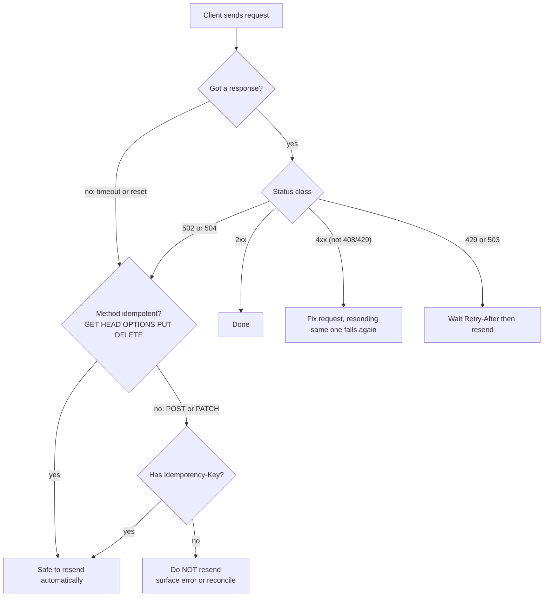

## Bối cảnh & vấn đề

Một team làm API nội bộ cho kho hàng. Để "đơn giản", mọi thứ đều là `POST`: `POST /getStock`, `POST /updateStock`, `POST /deleteItem`, và mọi response đều là `200 OK` với body `{ "success": true | false }`. Sáu tháng sau, ba sự cố xảy ra trong cùng một tuần:

1. Load balancer trả `502` khi một pod bị restart giữa chừng. Client HTTP của mobile app có cấu hình "retry 2 lần khi lỗi mạng", và vì mọi thứ đều là `POST`, nó **không dám** retry cả những lệnh chỉ đọc, nên màn hình tồn kho trắng trơn. Trong khi đó một service khác đi qua service mesh lại có cấu hình "retry mọi request khi `503`", và `POST /updateStock` (vốn là "trừ 5 cái") bị áp dụng hai lần.
2. Dashboard monitoring báo tỷ lệ lỗi 0%, vì mọi response đều là `200`. Lỗi thật chỉ nằm trong body, và không ai alert trên body.
3. Một partner cache response ở CDN của họ, và CDN không cache được gì vì CDN chỉ cache `GET`.

Không có sự cố nào ở trên là bug logic. Chúng là hậu quả của việc **bỏ qua ngữ nghĩa HTTP**. HTTP không chỉ là "đường ống chở JSON": nó là một hợp đồng mà client, proxy, CDN, load balancer, browser và thư viện retry đều đọc và dựa vào. Khi bạn nói `GET`, mọi thành phần trên đường đi hiểu rằng request này không đổi gì và có thể gọi lại, cache, prefetch. Khi bạn trả `503`, chúng hiểu rằng thử lại sau có thể thành công.

Bài này là nền móng cho cả track: method nào **safe**, method nào **idempotent**, `PUT` khác `PATCH` ra sao, status code nào nói gì, và khi nào phá quy tắc "URL là danh từ" là quyết định đúng. Các bài sau xây trên đây: [idempotency key](/tracks/api-design/learn/idempotency) giải quyết việc `POST` không idempotent, [HTTP caching](/tracks/api-design/learn/http-caching-concurrency) dựa trên safe method, và [error format](/tracks/api-design/learn/errors-data-contracts) chuẩn hoá body của status lỗi.

**Interview angle:** câu hỏi "safe vs idempotent" nghe dễ, nhưng interviewer luôn hỏi tiếp "vậy **ai** retry request của bạn mà bạn không biết?". Câu trả lời mạnh kể ra được proxy, mesh, thư viện client và browser.

## Khái niệm

### REST, resource và representation

**REST** (Representational State Transfer) là một **architectural style** do Roy Fielding mô tả năm 2000, không phải protocol hay framework. Ý tưởng trung tâm: hệ thống được mô hình hoá thành **resource** (tài nguyên có định danh bằng URI, ví dụ `/orders/123`), client thao tác với resource thông qua **representation** (một bản biểu diễn của state, thường là JSON), bằng một tập method **thống nhất** (uniform interface) mà mọi thành phần trung gian đều hiểu.

Fielding liệt kê các ràng buộc: client-server, stateless (mỗi request mang đủ thông tin, server không giữ context hội thoại giữa các request), cacheable, layered system, code-on-demand (tuỳ chọn), và **uniform interface**. Uniform interface cụ thể gồm bốn phần: định danh resource bằng URI, thao tác qua representation, **self-descriptive message** (message tự mô tả: method, media type, status code đủ để trung gian hiểu), và hypermedia (HATEOAS: response chứa link tới hành động tiếp theo). Hầu hết API gọi là "RESTful" trong thực tế chỉ làm ba phần đầu và bỏ HATEOAS, và điều đó chấp nhận được, nhưng nên biết để không nói sai rằng uniform interface là "dùng JSON nhất quán".

Ví dụ: `GET /orders/123` với `Accept: application/json` trả representation JSON của order 123. Cùng resource đó có thể có representation CSV hay PDF; URI không đổi, chỉ representation đổi.

**Interview angle:** "REST là architectural style, RESTful API là API tuân theo nó" là câu mở đầu đủ; điểm cộng là biết HATEOAS là phần hay bị bỏ và giải thích vì sao (client thực tế hard-code URL, codegen từ OpenAPI thay thế cho discovery).

### Safe method

Một method là **safe** khi ngữ nghĩa của nó là **chỉ đọc**: client không yêu cầu và không mong đợi thay đổi state trên server. RFC 9110 định nghĩa bốn safe method: `GET`, `HEAD`, `OPTIONS`, `TRACE`.

"Safe" là **lời hứa về ngữ nghĩa**, không phải về hiện thực. Server vẫn có thể ghi access log, tăng view counter hay cập nhật cache khi nhận `GET`; điều quan trọng là client không chịu trách nhiệm về những tác dụng phụ đó, và gọi `GET` một lần hay mười lần không gây hại cho người dùng. Chính vì lời hứa đó mà browser prefetch link, crawler của search engine đi theo mọi `<a href>`, link preview của Slack gọi `GET` vào URL bạn dán, và CDN cache `GET`.

Ví dụ phản diện kinh điển: `GET /orders/export` mà **gửi email** file export cho khách. Slack unfurl link, crawler nội bộ, hay browser prefetch sẽ làm khách nhận vài email không ai yêu cầu. Nếu endpoint có tác dụng phụ mà người dùng quan tâm, nó phải là `POST`.

### Idempotent method

Một method là **idempotent** khi gửi cùng request N lần có **tác dụng lên state server** giống như gửi một lần. Theo RFC 9110, mọi safe method đều idempotent, cộng thêm `PUT` và `DELETE`. `POST` **không** idempotent. `PATCH` **không được đảm bảo** idempotent: tuỳ vào nội dung patch (RFC 5789 nói rõ PATCH "is neither safe nor idempotent" nói chung).

Có hai hiểu lầm hay gặp. Thứ nhất, idempotent **không** có nghĩa là "trả cùng response": `DELETE /users/2` lần đầu trả `204`, lần hai trả `404`, nhưng state sau cả hai lần đều là "user 2 không tồn tại". Thứ hai, idempotent là tính chất của **request cụ thể**, không chỉ của method: `PATCH` với body `{ "name": "An" }` là idempotent trong thực tế, còn `PATCH` với JSON Patch `[{"op":"add","path":"/items/-","value":…}]` (append vào mảng) thì không.

Vì sao idempotency quan trọng: khi mạng lỗi (timeout, connection reset), client **không biết** request đã tới server hay chưa. Với request idempotent, cách xử lý an toàn là gửi lại. RFC 9110 §9.2.2 cho phép client tự động retry request idempotent, và nhiều thành phần làm đúng như vậy: nginx `proxy_next_upstream` mặc định không chuyển `POST`/`PATCH`/`LOCK` sang upstream khác trừ khi bật `non_idempotent` (từ 1.9.13, verify), còn service mesh thường có retry policy riêng do bạn cấu hình.

**Interview angle:** interviewer muốn nghe "idempotent là về state, không phải về response" và một ví dụ PATCH không idempotent.

### PUT: thay thế toàn bộ

**`PUT`** yêu cầu server **thay state của resource tại URI đó bằng representation được gửi lên**. Nếu resource chưa có, `PUT` có thể tạo nó (trả `201`); nếu có rồi, thay thế (trả `200` hoặc `204`). Vì kết quả chỉ phụ thuộc vào body chứ không phụ thuộc state cũ, `PUT` idempotent một cách tự nhiên.

Hệ quả hay bị quên: field nào **thiếu** trong body `PUT` nghĩa là field đó bị xoá hoặc về mặc định. Nếu user có `{ name, email, tier }` và client gửi `PUT /users/1 { "name": "An Nguyen" }`, kết quả đúng ngữ nghĩa là user chỉ còn `name`. Nhiều API "PUT" thực chất làm partial update; đó là sai ngữ nghĩa và gây bug khi client khác nhau hiểu khác nhau.

`PUT` cũng yêu cầu client **biết URI** của resource. Vì vậy `PUT` hợp với resource có định danh tự nhiên do client chọn (`PUT /users/1/preferences`, `PUT /buckets/photos/objects/cat.png`), còn khi server sinh ID thì dùng `POST` vào collection.

### PATCH: cập nhật một phần, ngữ nghĩa theo media type

**`PATCH`** (RFC 5789) gửi một **tập chỉ thị thay đổi** thay vì representation đầy đủ. RFC không định nghĩa format của chỉ thị: ngữ nghĩa nằm trong media type của body. Hai format chuẩn:

- **JSON Merge Patch** (RFC 7396, `application/merge-patch+json`): gửi một object "giống" resource chỉ với các field muốn đổi. Field có giá trị `null` nghĩa là **xoá field**. Object lồng được merge đệ quy, còn mảng bị **thay nguyên**. Đơn giản, dễ đọc, nhưng có hai giới hạn: không thể đặt một field thành giá trị `null` thật, và không thể thêm hay xoá một phần tử trong mảng.
- **JSON Patch** (RFC 6902, `application/json-patch+json`): một mảng operation `add`, `remove`, `replace`, `move`, `copy`, `test`, mỗi operation có `path` dạng JSON Pointer (`/items/0/qty`). Mạnh hơn, xử lý được mảng, và `test` cho phép kiểm tra điều kiện trước ("chỉ replace nếu `/status` đang là `pending`"). Cả patch được áp dụng **nguyên tử**: một operation lỗi thì không operation nào có hiệu lực.

```json
[
  { "op": "test",    "path": "/status", "value": "pending" },
  { "op": "replace", "path": "/items/0/qty", "value": 3 },
  { "op": "remove",  "path": "/couponCode" }
]
```

Server nên từ chối media type không hỗ trợ bằng `415 Unsupported Media Type` và quảng bá format chấp nhận qua header `Accept-Patch`.

**Interview angle:** câu follow-up hay gặp là "hai client PATCH cùng lúc thì sao?"; câu trả lời là lost update, giải bằng `ETag` + `If-Match` (bài [HTTP caching & concurrency](/tracks/api-design/learn/http-caching-concurrency)) hoặc `test` op.

### Status code: năm nhóm và vì sao chúng quan trọng

**Status code** là con số ba chữ số mà mọi trung gian hiểu mà không cần đọc body. Nhóm quyết định hành vi: `2xx` thành công, `3xx` chuyển hướng hoặc dùng cache (`304`), `4xx` lỗi do client (gửi lại y hệt sẽ lại lỗi), `5xx` lỗi server (có thể thử lại sau). Retry policy, alert, SLO và circuit breaker đều đọc nhóm này.

Những code nên dùng thành thạo cho API:

- `200 OK` (có body), `201 Created` + `Location` trỏ tới resource mới, `202 Accepted` (đã nhận, xử lý sau, xem [long-running operation](/tracks/api-design/learn/async-bulk-uploads)), `204 No Content` (thành công, không body).
- `400 Bad Request` (request hỏng: JSON sai cú pháp, thiếu header bắt buộc), `422 Unprocessable Content` (cú pháp đúng nhưng nội dung không hợp lệ; RFC 9110 đổi tên từ "Unprocessable Entity"), `409 Conflict` (xung đột với state hiện tại: email đã tồn tại, order đã ship), `412 Precondition Failed` (`If-Match` không khớp), `415`, `429 Too Many Requests`.
- `401`, `403`, `404` (phần tiếp theo), `405 Method Not Allowed` (bắt buộc kèm header `Allow`).
- `500` (bug), `502`/`504` (gateway nhận lỗi hoặc timeout từ upstream), `503 Service Unavailable` (quá tải hoặc bảo trì, nên kèm `Retry-After`).

`400` hay `422` cho validation là chủ đề tranh cãi. Nhiều API lớn dùng `400` cho mọi lỗi input; một số dùng `422` cho lỗi nghiệp vụ. Cả hai đều hợp lệ, điều quan trọng là **nhất quán** trong toàn API và body lỗi có cấu trúc.

### 401 vs 403 vs 404

**`401 Unauthorized`** (tên lịch sử gây nhầm, thực chất là "unauthenticated"): request thiếu credential hợp lệ, hoặc token hết hạn hay sai chữ ký. RFC 9110 yêu cầu server gửi kèm header `WWW-Authenticate` mô tả cách xác thực (`Bearer realm="api"`, có thể thêm `error="invalid_token"` theo RFC 6750). Ý nghĩa với client: đăng nhập lại hoặc refresh token.

**`403 Forbidden`**: server biết bạn là ai nhưng **từ chối**. Đăng nhập lại không giúp gì. Ví dụ: `staff` gọi endpoint chỉ dành cho `admin` trong cùng tenant.

**`404 Not Found`**: resource không tồn tại, **hoặc** server không muốn tiết lộ nó có tồn tại hay không. RFC 9110 cho phép rõ ràng việc dùng `404` thay cho `403` khi muốn ẩn sự tồn tại. Đây là lựa chọn đúng cho resource của **tenant khác**: nếu `GET /orders/9001` trả `403` cho order của tenant khác và `404` cho ID không tồn tại, attacker chỉ cần quét ID để biết order nào tồn tại và đếm được số đơn của đối thủ (**enumeration**).

Quy tắc thực dụng: resource ngoài phạm vi của caller (tenant khác, user khác trong quan hệ riêng tư) trả `404`; resource trong phạm vi mà caller thấy được nhưng thiếu quyền hành động (xem được order nhưng không được huỷ) trả `403`.

**Interview angle:** red flag là trả `401` cho "đã đăng nhập nhưng không có quyền". Follow-up là "làm sao đảm bảo mọi endpoint đều kiểm tra tenant?", dẫn sang [authorization multi-tenant](/tracks/api-design/learn/authz-multitenant-api).

### Action endpoint (custom method)

REST khuyến khích URL là **danh từ** và hành động là method. Nhưng nhiều thao tác nghiệp vụ không phải CRUD: huỷ đơn, hoàn tiền, duyệt, gửi lại email xác nhận. **Action endpoint** (Google gọi là custom method, ví dụ `POST /orders/123:cancel` trong AIP-136) mô hình hoá một **state transition có tên**, có validation, side effect và audit riêng.

So với `PATCH /orders/123 { "status": "cancelled" }`, action endpoint có ba lợi thế: server kiểm soát transition (không cho client tự đặt `status` thành bất kỳ giá trị nào, ví dụ `shipped → pending`), request mang được tham số riêng (`reason`, `refundTo`), và quyền có thể gán riêng (`orders:cancel`). Smell thật sự là dùng verb **thay cho** CRUD thông thường (`POST /getUsers`, `POST /updateUser`), hoặc dùng `GET` cho mutation.

## Cơ chế hoạt động

Khi một request thất bại ở tầng mạng, chuỗi quyết định "có gửi lại không" diễn ra ở nhiều nơi, và mỗi nơi đều đọc method và status code.



Diễn giải. Nhánh quan trọng nhất là **không có response**: client không biết request đã được xử lý hay chưa (có thể server đã commit rồi response mất trên đường về). Với method idempotent, gửi lại luôn an toàn vì làm lại không đổi kết quả. Với `POST`/`PATCH`, gửi lại chỉ an toàn khi có cơ chế dedupe như [idempotency key](/tracks/api-design/learn/idempotency). `502`/`504` cũng rơi vào vùng mơ hồ: gateway không nhận được response từ upstream, nhưng upstream có thể đã xử lý xong.

Khi có response, nhóm status code quyết định. `4xx` nói "request của bạn sai", gửi lại y hệt vô ích, ngoại trừ `408 Request Timeout` và `429` (đợi rồi thử lại). `5xx` nói "server có vấn đề", `503` kèm `Retry-After` là tín hiệu rõ nhất để lùi lại. Nếu API trả `200 { success: false }` cho lỗi tạm thời, toàn bộ nhánh này bị vô hiệu: retry library thấy `2xx` và dừng, circuit breaker không bao giờ mở, alert trên tỷ lệ `5xx` im lặng.

Chuỗi thứ hai là **tạo resource**. `POST /orders` trả `201 Created` cùng header `Location: /orders/101`. Client (hoặc SDK) dùng `Location` để biết URI của resource vừa tạo, thay vì tự ghép URL. Với job dài, `POST /exports` trả `202 Accepted` và `Location: /exports/abc`, client poll resource đó.

## Ví dụ thực tế

### Chạy thử safe, idempotent và các status code

Server Node thuần (`node:http`, không framework) với các route `PUT`/`PATCH`/`DELETE /users/:id`, `POST /orders` và `GET /me`. Client dùng `fetch` gửi từng request hai lần để quan sát. Code server rút gọn:

```ts
// PUT = full replacement; 201 when it created the resource
if (req.method === "PUT") {
  const created = !users.has(id);
  users.set(id, { id, ...JSON.parse(body) });
  return send(created ? 201 : 200, users.get(id));
}
// PATCH only accepts JSON Merge Patch; null deletes a field
if (req.method === "PATCH") {
  if (req.headers["content-type"] !== "application/merge-patch+json")
    return send(415, { title: "Unsupported Media Type" }, { "accept-patch": "application/merge-patch+json" });
  const cur = users.get(id);
  if (!cur) return send(404, { title: "Not Found" });
  for (const [k, v] of Object.entries(JSON.parse(body))) v === null ? delete cur[k] : (cur[k] = v);
  return send(200, cur);
}
if (req.method === "DELETE") {
  if (!users.delete(id)) return send(404, { title: "Not Found" });
  res.writeHead(204); return res.end();
}
return send(405, { title: "Method Not Allowed" }, { allow: "GET, PUT, PATCH, DELETE" });
```

Output thật (Node 24.21), user 1 ban đầu là `{ id: "1", name: "An", email: "an@x.io", tier: "gold" }`:

```text
PUT #1                     PUT /users/1 -> 200 {"id":"1","name":"An Nguyen"}
PUT #2 (retry)             PUT /users/1 -> 200 {"id":"1","name":"An Nguyen"}
merge-patch tier=null      PATCH /users/2 -> 404 {"title":"Not Found"}
PUT new id                 PUT /users/2 -> 201 {"id":"2","name":"Binh","tier":"silver"}
merge-patch tier=null      PATCH /users/2 -> 200 {"id":"2","name":"Binh"}
PATCH wrong media type     PATCH /users/2 -> 415 [accept-patch: application/merge-patch+json] {"title":"Unsupported Media Type"}
DELETE #1                  DELETE /users/2 -> 204
DELETE #2 (retry)          DELETE /users/2 -> 404 {"title":"Not Found"}
POST #1                    POST /orders -> 201 [location: /orders/101] {"id":"101","sku":"A1","qty":1}
POST #2 (retry)            POST /orders -> 201 [location: /orders/102] {"id":"102","sku":"A1","qty":1}
POST on /users/1           POST /users/1 -> 405 [allow: GET, PUT, PATCH, DELETE] {"title":"Method Not Allowed"}
no token                   GET /me -> 401 [www-authenticate: Bearer realm="api"] {"title":"Unauthorized"}
orders stored: 2
```

Đọc output từng dòng:

- Hai lần `PUT /users/1` cho cùng state: idempotent. Nhưng hãy nhìn kỹ: `email` và `tier` đã **biến mất** sau lần `PUT` đầu tiên. Đó là ngữ nghĩa đúng của `PUT` (replace), và là lý do client chỉ muốn đổi tên phải dùng `PATCH`.
- `PUT` vào ID chưa tồn tại trả `201`: `PUT` có thể tạo resource khi client biết URI.
- Merge patch `{ "tier": null }` **xoá** field `tier`. Muốn lưu giá trị `null` thật thì Merge Patch không làm được.
- `DELETE` lần hai trả `404` nhưng state vẫn như nhau: idempotent về state, khác về response.
- Hai lần `POST /orders` y hệt tạo **hai** order (`101`, `102`). Đây chính là bug "đơn trùng" khi client retry `POST`, sẽ được giải ở bài [Idempotency](/tracks/api-design/learn/idempotency).
- `405` kèm `Allow`, `401` kèm `WWW-Authenticate`: header bắt buộc giúp client tự biết phải làm gì.

### Action endpoint cho state machine của order

Order có state machine: `pending → paid → shipped → delivered`, và `pending | paid → cancelled`. Thiết kế:

```text
POST /orders/101/cancel        { "reason": "customer_request" }
  200 OK                       { "id": "101", "status": "cancelled", "cancelledAt": "2026-09-30T02:10:00Z" }
POST /orders/101/cancel        (retry, same body)
  200 OK                       { "id": "101", "status": "cancelled", ... }        <- idempotent-friendly
POST /orders/102/cancel        (order 102 already shipped)
  409 Conflict                 { "type": ".../order-not-cancellable", "currentStatus": "shipped" }
```

Output ở trên là **illustrative** (minh hoạ thiết kế, không phải log chạy thật). Điểm chính: huỷ lần hai trả state hiện tại thay vì lỗi, nên client retry an toàn; transition không hợp lệ trả `409` với lý do máy đọc được; `PATCH /orders/101` không cho phép sửa `status` (field read-only), nên mọi transition đều phải đi qua action có kiểm soát.

## Trade-offs & lựa chọn thay thế

| Nhu cầu | Lựa chọn | Ưu | Nhược |
| --- | --- | --- | --- |
| Cập nhật toàn bộ, client biết URI | `PUT` | Idempotent tự nhiên, dễ retry | Thiếu field là xoá field; payload lớn |
| Cập nhật vài field đơn giản | `PATCH` + Merge Patch | Dễ đọc, dễ viết client | Không set được `null` thật, không sửa phần tử mảng |
| Cập nhật có điều kiện, sửa mảng | `PATCH` + JSON Patch | Nguyên tử, có `test`, sửa mảng | Khó đọc, client phải biết JSON Pointer |
| State transition nghiệp vụ | `POST /orders/{id}/cancel` | Kiểm soát transition, tham số riêng, quyền riêng | Nhiều endpoint hơn, "ít REST" hơn |
| Đổi status bằng field | `PATCH { status }` | Ít endpoint | Client đặt được transition sai, logic dồn vào một handler |
| Validation error | `400` cho mọi thứ | Đơn giản, client chỉ check một code | Không phân biệt JSON hỏng với nghiệp vụ sai |
| Validation error | `400` + `422` | Phân biệt rõ | Phải thống nhất định nghĩa giữa các team |

Khi nào chọn cái nào. Mặc định cho resource CRUD: `POST` vào collection để tạo (server sinh ID), `GET` để đọc, `PATCH` Merge Patch để sửa từng phần, `DELETE` để xoá. Dùng `PUT` khi resource là "một cục" mà client luôn gửi đầy đủ (settings, preferences, file). Dùng JSON Patch khi client cần sửa mảng lồng hoặc cần điều kiện `test`. Dùng action endpoint cho mọi transition có quy tắc nghiệp vụ hoặc side effect ra ngoài (gửi email, gọi payment); đó là lúc "REST thuần" làm API **khó** dùng đúng hơn.

Một lựa chọn thay thế ở tầng cao hơn là RPC thuần (gRPC, JSON-RPC), nơi mọi thứ đều là method có tên. RPC không có vấn đề "danh từ hay động từ", nhưng mất cache HTTP, mất ngữ nghĩa idempotent mà trung gian hiểu được. So sánh chi tiết ở bài [GraphQL & gRPC](/tracks/api-design/learn/graphql-grpc).

## Edge cases & failure modes

- **Retry ẩn ở hạ tầng**: service mesh (Istio, Linkerd) hay API gateway có retry policy cấu hình chung "retry khi `503` hoặc connect-failure" áp cho cả `POST`. Kết quả: side effect gấp đôi mà code app không hề retry. Kiểm tra cấu hình retry theo method, và coi mọi `POST` quan trọng là cần idempotency key.
- **`GET` có side effect**: link "unsubscribe" hay "confirm email" dạng `GET` bị security scanner của email (Outlook Safe Links, Gmail) gọi trước khi người dùng bấm. Đáp án: trang `GET` hiển thị form, nút bấm gửi `POST`.
- **`DELETE` trả `404` lần hai làm client báo lỗi**: nếu client coi `404` sau `DELETE` là thất bại, retry sau timeout sẽ hiện lỗi dù thao tác đã thành công. Có API chọn trả `204` cho cả lần hai; dù chọn gì, hãy document.
- **Body trong `GET`**: RFC 9110 nói body của `GET` không có ngữ nghĩa định nghĩa, và nhiều proxy/CDN bỏ nó đi. Search phức tạp cần body thì dùng `POST /orders/search` (và chấp nhận mất cache) hoặc method `QUERY` đang được IETF chuẩn hoá (draft, verify).
- **`PATCH` không idempotent bị retry**: `PATCH { "op": "increment", "field": "stock", "by": -5 }` retry hai lần trừ 10. Thiết kế patch theo **giá trị đích** (`stock: 45`) kết hợp `If-Match`, hoặc bắt buộc idempotency key.
- **`HEAD` không đồng bộ với `GET`**: framework tự sinh `HEAD` từ `GET` handler (Express làm vậy), nên handler `GET` có side effect cũng chạy khi `HEAD`.
- **Status code bị proxy đổi**: một số WAF/CDN thay `5xx` của origin bằng trang lỗi HTML của họ với `Content-Type: text/html`; client parse JSON lỗi. Client phải kiểm tra `Content-Type` trước khi parse body lỗi.

## Pitfalls

- ❌ `200 OK { "success": false }` cho lỗi → ✅ status code đúng nhóm + body Problem Details, vì retry, alert, SLO và circuit breaker đều đọc status code, không đọc body.
- ❌ Nghĩ `PATCH` luôn idempotent → ✅ idempotent phụ thuộc nội dung patch; append mảng hay tăng counter thì không.
- ❌ `PUT` làm partial update → ✅ `PUT` là replace; partial update là `PATCH`, để client khác nhau không hiểu khác nhau.
- ❌ `401` cho "đã đăng nhập nhưng thiếu quyền" → ✅ `403`; `401` làm client logout hoặc refresh token vô ích.
- ❌ `403` cho resource của tenant khác → ✅ `404`, để không lộ resource tồn tại.
- ❌ `GET /orders/export` gửi email → ✅ `POST /exports`, vì crawler, prefetch và link preview gọi `GET` tuỳ ý.
- ❌ `POST /updateUser`, `POST /getUsers` → ✅ `PATCH /users/{id}`, `GET /users`; giữ action endpoint cho transition nghiệp vụ thật.
- ❌ Tạo resource mà không trả `Location` → ✅ `201` + `Location`, để client và SDK không phải ghép URL.

## Tóm tắt

- **Safe** (`GET HEAD OPTIONS TRACE`) = chỉ đọc về ngữ nghĩa; **idempotent** = safe + `PUT` + `DELETE`; `POST` không, `PATCH` không được đảm bảo.
- Idempotent nói về **state**, không phải response: `DELETE` lần hai trả `404` vẫn idempotent.
- Proxy, mesh, SDK, browser, crawler đều dựa vào ngữ nghĩa method để retry, cache và prefetch; phá ngữ nghĩa là tạo bug mà code app không thấy.
- `PUT` thay toàn bộ (thiếu field = xoá); `PATCH` theo media type: Merge Patch (`null` = xoá) hoặc JSON Patch (operation, nguyên tử, có `test`).
- `201 + Location`, `202` cho job, `204` không body; `400`/`422` cho input (nhất quán), `409` cho xung đột state, `412` cho precondition.
- `401` = chưa xác thực (kèm `WWW-Authenticate`), `403` = không có quyền, `404` = không tồn tại hoặc không được biết; tenant khác trả `404`.
- Action endpoint (`POST /orders/{id}/cancel`) là đúng cho state transition nghiệp vụ; verb thay cho CRUD mới là smell.
