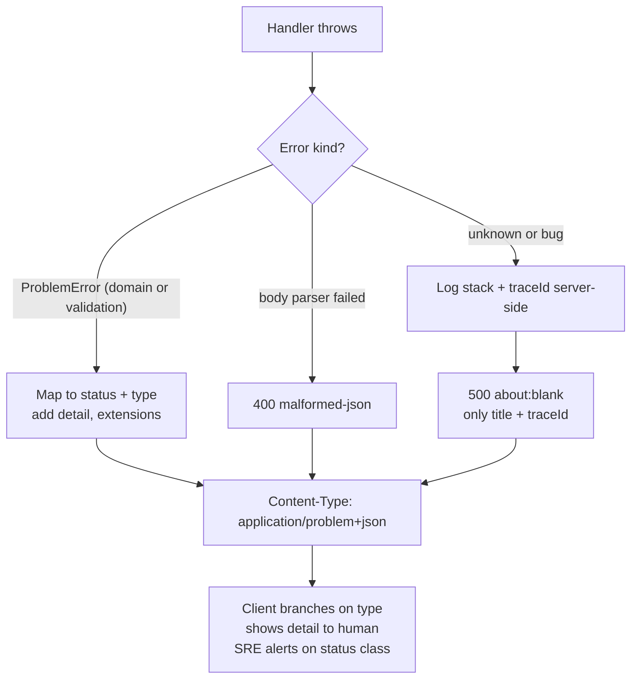

## Bối cảnh & vấn đề

Frontend của một trang checkout có đoạn code như sau, và đoạn code này sống trong production hai năm:

```ts
const res = await api.post("/checkout/place-order", body);
if (res.data.success === false) {
  if (res.data.message.includes("out of stock")) showOutOfStock();
  else if (res.data.message.includes("Giá đã thay đổi")) showPriceChanged();
  else toast(res.data.message);
}
```

Một ngày backend đổi câu thông báo từ "Item is out of stock" thành "Sản phẩm đã hết hàng" để hỗ trợ tiếng Việt. Không ai sửa API contract, không có test nào fail, nhưng UI không còn hiển thị popup "hết hàng" nữa: khách thấy một toast khó hiểu rồi bấm lại nhiều lần. Cùng lúc đó, đội SRE không thấy gì bất thường vì response vẫn là `200 OK`, tỷ lệ lỗi trên dashboard vẫn là 0%.

Hai vấn đề chồng lên nhau. Thứ nhất, **lỗi được giấu trong `200`**, nên mọi công cụ đọc status code (monitoring, retry library, circuit breaker, CDN) đều bị mù. Thứ hai, **client phân nhánh theo chuỗi message** vốn là văn bản cho con người, thứ thay đổi theo ngôn ngữ và theo ý thích của người viết. Contract lỗi cần một thứ ổn định cho máy đọc, tách khỏi thứ để người đọc.

Bài này chuẩn hoá phần "khi mọi thứ hỏng" của API bằng **Problem Details** (RFC 9457), và phần "dữ liệu trông đúng nhưng sai" bằng các quy ước JSON cho tiền, thời gian, ID và enum. Cả hai đều là contract: một khi client đã dựa vào, đổi chúng là [breaking change](/tracks/api-design/learn/versioning-evolution).

**Interview angle:** interviewer hỏi "vì sao `200 { success: false }` có hại?" để xem bạn nghĩ tới vận hành (alert, retry, cache) chứ không chỉ tới "đẹp hay xấu".

## Khái niệm

### Lỗi là một phần của contract

Lỗi của API có ba người đọc: **máy của client** (quyết định rẽ nhánh: hiện popup nào, có retry không), **developer tích hợp** (hiểu vì sao sai và sửa request), và **hạ tầng** (proxy, monitoring, retry). Mỗi người đọc cần một phần khác nhau: máy cần mã ổn định, developer cần mô tả cụ thể, hạ tầng cần status code đúng. Một error format tốt phục vụ cả ba mà không bắt ai phải parse văn bản.

Ví dụ: `422` (cho hạ tầng biết đây là lỗi client, không retry), `type: ".../out-of-stock"` (cho máy rẽ nhánh), `detail: "SKU A1 chỉ còn 2 cái"` (cho người đọc).

### Problem Details (RFC 9457)

**Problem Details** là format chuẩn của IETF cho body lỗi HTTP, media type `application/problem+json`. RFC 9457 (2023) **thay thế** RFC 7807 (2016), giữ nguyên các field cốt lõi và làm rõ thêm cách dùng. Các member chuẩn:

- `type`: một URI định danh **loại** lỗi, ví dụ `https://api.example.com/problems/out-of-stock`. Đây là khoá chính để máy rẽ nhánh. Nên trỏ tới trang tài liệu giải thích lỗi. Nếu vắng, mặc định là `about:blank`, nghĩa là "không có ngữ nghĩa gì thêm ngoài status code".
- `title`: mô tả ngắn cho người đọc, **không đổi** giữa các lần xảy ra cùng `type` (có thể được bản địa hoá).
- `status`: status code, lặp lại để tiện khi body bị tách khỏi response (log, queue). Nó mang tính tham khảo: status thật vẫn là status của HTTP response, và hai giá trị phải khớp.
- `detail`: giải thích cụ thể **lần này** ("SKU A1 chỉ còn 2 cái, bạn đặt 5"). Client không nên parse field này.
- `instance`: URI định danh **lần xảy ra** cụ thể (có thể là ID của request, dùng để tra log).

Ngoài ra RFC cho phép **extension member** tuỳ ý (`traceId`, `errors`, `balance`, `retryAfter`), và client phải bỏ qua extension mà nó không hiểu. RFC 9457 còn gợi ý cách biểu diễn nhiều lỗi validation trong một response: một mảng extension với `detail` và `pointer` (JSON Pointer tới field sai) cho từng lỗi.

**Interview angle:** nói được "`type` là khoá cho máy, `title`/`detail` cho người, `status` phải khớp HTTP status" là đủ ý chính; biết RFC 9457 thay RFC 7807 là điểm cộng.

### Mã lỗi ổn định cho UI nghiệp vụ

Với các flow như checkout, UI cần rẽ nhánh theo **lý do nghiệp vụ**: hết hàng, giá thay đổi, coupon hết hạn, địa chỉ không giao được, thanh toán bị từ chối. Mỗi lý do là một `type` (hoặc một extension `code` ngắn như `out_of_stock` nếu team thích chuỗi ngắn hơn URI), được liệt kê trong OpenAPI như một enum có tài liệu. Kèm theo là **dữ liệu máy đọc được** để UI hành động mà không phải đoán: `availableQuantity`, `newPrice`, `expiredAt`.

Ví dụ khi giá thay đổi giữa "xem giỏ" và "đặt hàng": trả `409 Conflict` với `type: ".../price-changed"` và `items: [{ sku, oldPrice, newPrice }]`, để UI hiện "Giá đã thay đổi, xác nhận lại?" rồi gửi lại với giá mới. Server **không bao giờ** tin giá từ client; client chỉ gửi `expectedTotal` để server phát hiện chênh lệch.

### Lỗi 5xx và thông tin nội bộ

Stack trace, câu SQL, tên bảng, đường dẫn file hay phiên bản thư viện **không bao giờ** được xuất hiện trong response production. Chúng giúp attacker hiểu hệ thống (OWASP gọi là security misconfiguration), và chẳng giúp gì client. Thay vào đó, response chỉ chứa `traceId`/`instance` để người hỗ trợ tra ngược, còn chi tiết đi vào log có cấu trúc và tracing (OpenTelemetry) phía server.

Với lỗi 500, `type` thường là `about:blank` và `title` là "Internal Server Error": client không cần biết gì thêm, chỉ cần biết đây là lỗi server (có thể thử lại sau nếu request idempotent).

### Tiền trong JSON

JSON number trong JavaScript là **IEEE 754 double**, không biểu diễn chính xác được hầu hết số thập phân: `1.1 + 2.2` ra `3.3000000000000003`. Vì vậy tiền không bao giờ nên là float. Hai quy ước an toàn:

- **Integer minor units**: `{ "amountMinor": 1999, "currency": "USD" }` nghĩa là 19,99 USD. Stripe dùng cách này. Chú ý số chữ số thập phân khác nhau theo tiền tệ (ISO 4217): USD và EUR có 2, JPY và VND có 0, BHD và KWD có 3. Client phải lấy số chữ số theo `currency`, không mặc định chia 100.
- **String decimal**: `{ "amount": "19.99", "currency": "USD" }`. Không mất chính xác khi truyền, client parse bằng thư viện decimal. Phù hợp khi cần nhiều chữ số hơn minor unit (tỷ giá, đơn giá theo gram).

Currency luôn là field riêng, không suy ra từ tenant hay locale.

### Thời gian, ngày và ID

**Timestamp** (một thời điểm) dùng RFC 3339, một profile của ISO 8601, có offset: `2026-09-30T02:10:00Z`. Lưu và trả UTC; hiển thị theo timezone của người dùng là việc của client. **Ngày thuần** (sinh nhật, ngày giao hàng dự kiến theo lịch) là `YYYY-MM-DD` **không có** giờ và timezone, vì "ngày 30/9" không phải một thời điểm. Nhầm hai loại này là bug kinh điển: sinh nhật bị lùi một ngày với người dùng ở múi giờ âm.

**ID 64-bit** (Snowflake, `bigint` của Postgres) phải trả dạng **string**. `Number.MAX_SAFE_INTEGER` là 2^53 − 1 = 9.007.199.254.740.991; số lớn hơn bị làm tròn khi `JSON.parse` trong JavaScript, và client sẽ gọi API với **ID khác** mà không có lỗi nào. RFC 8259 cũng cảnh báo rằng số ngoài phạm vi double không tương tác tốt giữa các implementation.

**Enum** là string có nghĩa (`"status": "shipped"`), không phải số ma thuật (`"status": 3`). Client phải có nhánh `unknown` vì server sẽ thêm giá trị mới (chi tiết ở bài [versioning](/tracks/api-design/learn/versioning-evolution)).

## Cơ chế hoạt động

Một request lỗi đi qua middleware chuẩn hoá lỗi như sau:



Luồng có ba nhánh. Lỗi đã biết (validation, nghiệp vụ) được biểu diễn bằng một class lỗi riêng mang sẵn `status`, `type` và extension; middleware chỉ việc serialize. Lỗi từ tầng parse (JSON hỏng) được nhận diện và map sang `400`. Mọi lỗi còn lại là **bug**: middleware log đầy đủ stack trace kèm `traceId` phía server, còn response chỉ có `500`, `title` chung chung và `traceId`. Nguyên tắc: chỉ những lỗi được **thiết kế** mới được mang chi tiết ra ngoài; lỗi không lường trước luôn bị che.

Điểm quan trọng là middleware lỗi phải là **lớp duy nhất** tạo body lỗi. Nếu mỗi handler tự `res.status(400).json({...})` theo cách riêng, format sẽ trôi dần; nếu middleware đăng ký sai vị trí, framework dùng error handler mặc định của nó (phần ví dụ dưới đây cho thấy chuyện gì xảy ra).

## Ví dụ thực tế

### Middleware Problem Details trong Express 5

```ts
class ProblemError extends Error {
  constructor(
    public status: number, public type: string, public title: string,
    detail: string, public ext: Record<string, unknown> = {},
  ) { super(detail); }
}

app.use(express.json());
app.get("/boom", () => { throw new Error('relation "ordres" does not exist'); });
app.post("/orders", (req, res) => {
  const errors = [];
  const qty = req.body?.items?.[0]?.quantity;
  if (!Number.isInteger(qty) || qty <= 0) errors.push({ pointer: "/items/0/quantity", code: "must_be_positive" });
  if (!/^\d{5}$/.test(req.body?.shippingAddress?.postalCode ?? ""))
    errors.push({ pointer: "/shippingAddress/postalCode", code: "invalid_format" });
  if (errors.length)
    throw new ProblemError(422, "https://api.example.com/problems/validation-error",
      "Request validation failed", `${errors.length} fields are invalid`, { errors });
  res.status(201).json({ id: "101" });
});

// registered LAST: after every route
app.use((err, req, res, _next) => {
  const traceId = req.header("traceparent")?.split("-")[1] ?? crypto.randomUUID();
  if (err instanceof ProblemError)
    return res.status(err.status).type("application/problem+json").json({
      type: err.type, title: err.title, status: err.status, detail: err.message,
      instance: req.originalUrl, traceId, ...err.ext,
    });
  if (err.type === "entity.parse.failed")
    return res.status(400).type("application/problem+json").json({
      type: "https://api.example.com/problems/malformed-json", title: "Malformed JSON body", status: 400, traceId,
    });
  logger.error({ traceId, err }, "unhandled");   // full stack stays server-side
  res.status(500).type("application/problem+json").json({ type: "about:blank", title: "Internal Server Error", status: 500, traceId });
});
```

Output thật (Node 24.21, Express 5.2.1; `traceId` cố định để dễ đọc):

```text
POST /orders -> 422 application/problem+json; charset=utf-8
{"type":"https://api.example.com/problems/validation-error","title":"Request validation failed","status":422,"detail":"2 fields are invalid","instance":"/orders","traceId":"trace-4bf92f35","errors":[{"pointer":"/items/0/quantity","code":"must_be_positive"},{"pointer":"/shippingAddress/postalCode","code":"invalid_format"}]}
POST /orders -> 400 application/problem+json; charset=utf-8
{"type":"https://api.example.com/problems/malformed-json","title":"Malformed JSON body","status":400,"traceId":"trace-4bf92f35"}
[server log] trace-4bf92f35 Error: relation "ordres" does not exist
GET /boom -> 500 application/problem+json; charset=utf-8
{"type":"about:blank","title":"Internal Server Error","status":500,"traceId":"trace-4bf92f35"}
```

Lỗi SQL nằm trong **log server**, response chỉ có `traceId`. Trong lần chạy đầu tiên của thí nghiệm này, route `/boom` được khai báo **sau** error middleware, và `NODE_ENV` chưa đặt. Kết quả thật: Express bỏ qua middleware của ta và dùng handler mặc định, trả `500 text/html` chứa nguyên stack trace:

```text
GET /boom -> 500 text/html; charset=utf-8
<!DOCTYPE html>
<html lang="en">
...
<pre>Error: relation &quot;ordres&quot; does not exist<br> &nbsp; &nbsp;at file:///private/tmp/.../e02.mjs:31:32<br> &nbsp; &nbsp;at Layer.handleRequest (.../node_modules/router/lib/layer.js:152:17)...
```

Hai bài học: error middleware phải đăng ký **sau cùng**, và production phải chạy với `NODE_ENV=production` (handler mặc định của Express chỉ ẩn stack khi ở production). Một test tự động nên gọi một route cố ý throw và assert response không chứa `node_modules` hay dòng stack dạng `at file:`.

### Tiền, ID và ngày: những con số trông đúng mà sai

```ts
console.log("1.1 + 2.2 =", 1.1 + 2.2);
console.log("(1.005).toFixed(2) =", (1.005).toFixed(2));
console.log("cents: 1999 * 3 =", 1999 * 3);

const p = JSON.parse('{"id": 9007199254740993, "idStr": "9007199254740993"}');
console.log("id =", p.id, "| idStr =", p.idStr, "| safe?", Number.isSafeInteger(p.id));

// TZ=Asia/Ho_Chi_Minh
console.log(new Date("2026-09-30").toISOString());
console.log(new Date("2026-09-30T00:00:00").toISOString());
try { JSON.stringify({ n: 10n }); } catch (e) { console.log(e.constructor.name, e.message); }
```

Output thật (Node 24.21, `TZ=Asia/Ho_Chi_Minh`):

```text
1.1 + 2.2 = 3.3000000000000003
(1.005).toFixed(2) = 1.00
cents: 1999 * 3 = 5997
id = 9007199254740992 | idStr = 9007199254740993 | safe? false
2026-09-30T00:00:00.000Z
2026-09-29T17:00:00.000Z
TypeError Do not know how to serialize a BigInt
```

Đọc kết quả: phép cộng float lệch ngay ở ví dụ đơn giản, và làm tròn `1.005` ra `1.00` (vì 1.005 thực chất được lưu là 1.00499999…); integer minor unit thì chính xác. ID `…993` bị `JSON.parse` âm thầm biến thành `…992`, không lỗi, không cảnh báo, chỉ bản string giữ đúng giá trị. Chuỗi ngày thuần `"2026-09-30"` được JS hiểu là UTC nửa đêm, còn `"2026-09-30T00:00:00"` không offset lại được hiểu là **giờ địa phương**, ra `2026-09-29T17:00Z`: cùng một "ngày" nhưng hai thời điểm khác nhau. Và `BigInt` không serialize được bằng `JSON.stringify` mặc định, nên backend dùng `bigint` phải chủ động chuyển sang string ở tầng DTO.

### Response lỗi của checkout

```json
HTTP/1.1 409 Conflict
Content-Type: application/problem+json

{
  "type": "https://api.example.com/problems/price-changed",
  "title": "Prices changed since the cart was viewed",
  "status": 409,
  "detail": "1 item has a new price",
  "instance": "/checkout/sessions/cs_81f2",
  "traceId": "4bf92f3577b34da6",
  "items": [{ "sku": "A1", "oldPriceMinor": 19900, "newPriceMinor": 21900, "currency": "VND" }],
  "newTotalMinor": 421900
}
```

Response trên là illustrative (thiết kế mẫu). UI rẽ nhánh theo `type`, hiển thị giá mới từ `items`, và gửi lại `expectedTotalMinor: 421900` khi người dùng xác nhận.

## Trade-offs & lựa chọn thay thế

| Tiêu chí | `200` + `success:false` | Status code + body tự chế | Problem Details (RFC 9457) | GraphQL `errors[]` |
| --- | --- | --- | --- | --- |
| Monitoring, retry, cache hiểu được | Không | Có | Có | Không (thường vẫn `200`) |
| Khoá ổn định cho máy | Tuỳ, thường là message | Tuỳ team | `type` URI (+ extension `code`) | `extensions.code` |
| Nhiều lỗi validation | Tuỳ | Tuỳ | Extension (`errors` + `pointer`) | Mảng `errors` với `path` |
| Công cụ, thư viện hỗ trợ | Không | Không | Có (Spring, ASP.NET Core có sẵn, verify) | Có trong mọi server GraphQL |
| Chi phí áp dụng | Thấp ban đầu, đắt về sau | Trung bình | Thấp nếu có middleware chung | Có sẵn với GraphQL |

| Biểu diễn tiền | Ưu | Nhược |
| --- | --- | --- |
| Float `19.99` | Dễ đọc | Sai số làm tròn, không dùng được |
| Integer minor units `1999` | Chính xác, tính toán nhanh | Phải biết số chữ số theo currency; khó đọc bằng mắt |
| String decimal `"19.99"` | Chính xác, dễ đọc, nhiều chữ số | Client phải parse bằng thư viện decimal |

Khi nào chọn cái nào. Với REST API mới, Problem Details là mặc định hợp lý: chi phí thấp, có chuẩn để chỉ vào khi tranh luận, và nhiều framework hỗ trợ sẵn. Nếu API cũ đã có format lỗi riêng được client dùng rộng rãi, đừng đổi đột ngột: đổi format lỗi là breaking change; hãy thêm field theo RFC song song, hoặc chỉ áp dụng ở version mới. Với tiền, chọn integer minor units khi hệ thống chủ yếu thanh toán (Stripe, payment gateway đều dùng), string decimal khi có đơn giá lẻ hoặc tỷ giá cần nhiều chữ số.

## Edge cases & failure modes

- **Lỗi trả bởi tầng khác**: gateway, WAF hay CDN trả lỗi bằng HTML hoặc JSON riêng của họ (`502 Bad Gateway` trang HTML). Client phải kiểm tra `Content-Type` trước khi parse và có nhánh chung cho lỗi không phải problem+json.
- **`status` trong body không khớp status HTTP**: code gán `status: 400` trong body nhưng framework trả `500` vì một lỗi khác xảy ra khi serialize. Luôn lấy status HTTP làm nguồn sự thật, và test cả hai khớp nhau.
- **Lỗi validation tiết lộ quá nhiều**: "email đã tồn tại" trên endpoint đăng ký cho phép dò tài khoản. Với luồng nhạy cảm (đăng ký, quên mật khẩu), trả thông điệp trung tính và xử lý qua email.
- **Bản địa hoá `detail`**: nếu `detail` theo `Accept-Language`, log và support thấy nhiều ngôn ngữ; giữ `type` và extension không đổi để tìm kiếm.
- **Lỗi trong lúc stream**: response đã gửi `200` và một phần body (CSV, NDJSON) thì không đổi status được nữa. Cần sentinel lỗi trong stream hoặc chuyển sang job async ([bài 8](/tracks/api-design/learn/async-bulk-uploads)).
- **ID vượt 2^53 lọt qua test**: dữ liệu test có ID nhỏ, production vượt ngưỡng sau vài năm (Snowflake ID vượt ngay từ đầu). Kiểm tra bằng fixture ID lớn.
- **Tổng tiền làm tròn khác nhau giữa client và server**: client tính thuế trên từng dòng rồi cộng, server tính trên tổng. Contract phải nói rõ cách làm tròn và server luôn trả con số cuối cùng để client hiển thị, không tự tính.

## Pitfalls

- ❌ `200 { "success": false }` → ✅ status code đúng + `application/problem+json`, để alert, retry và circuit breaker nhìn thấy lỗi.
- ❌ Client rẽ nhánh theo `message` → ✅ rẽ nhánh theo `type`/`code` có trong contract; `detail` chỉ để hiển thị.
- ❌ Trả stack trace, SQL, tên bảng khi 500 → ✅ chỉ `traceId`; chi tiết vào log và tracing.
- ❌ Error middleware đăng ký trước route, hoặc chạy prod không có `NODE_ENV=production` → ✅ đăng ký sau cùng và có test assert không lộ stack.
- ❌ `"total": 19.99` → ✅ `totalMinor: 1999` + `currency`, hoặc `"19.99"` dạng string.
- ❌ ID `bigint` dạng number → ✅ string, vì JS làm tròn trên 2^53 mà không báo lỗi.
- ❌ Ngày sinh dạng `2026-09-30T00:00:00Z` → ✅ `2026-09-30` không timezone; timestamp mới dùng RFC 3339 với `Z`/offset.
- ❌ Enum số (`status: 3`) → ✅ string có nghĩa và client có nhánh `unknown`.

## Tóm tắt

- Lỗi là contract với ba người đọc: máy (mã ổn định), người (mô tả), hạ tầng (status code).
- Problem Details (RFC 9457, thay RFC 7807): `type` URI là khoá cho máy, `title` cố định, `status` khớp HTTP, `detail` cho lần này, `instance`; thêm extension như `errors`, `traceId`.
- Một error middleware duy nhất tạo body lỗi; lỗi chưa thiết kế luôn thành `500` chung chung, stack trace chỉ nằm trong log.
- Luồng nghiệp vụ như checkout cần `type` riêng cho từng lý do (hết hàng, giá đổi, coupon hết hạn) kèm dữ liệu để UI hành động.
- Tiền: integer minor units hoặc string decimal, luôn có `currency`; số chữ số theo ISO 4217.
- Timestamp RFC 3339 UTC; ngày thuần `YYYY-MM-DD`; ID 64-bit là string; enum là string và client chịu được giá trị mới.
