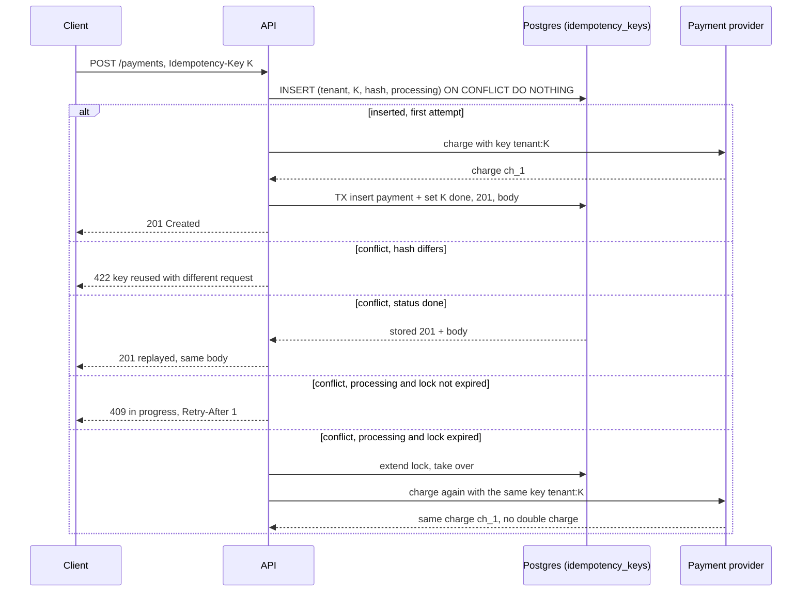

## Bối cảnh & vấn đề

App mobile của một nền tảng thương mại có tỷ lệ **đơn trùng** khoảng 0,3%: cùng một giỏ hàng, cùng tổng tiền, hai order được tạo cách nhau 5 đến 12 giây. Khách bị trừ tiền hai lần, gọi tổng đài, đội vận hành phải huỷ và hoàn tiền thủ công. Tracing cho thấy một mẫu lặp lại:

```text
02:14:07.112  POST /orders  tenant=7  cart=c_91  -> 201 (server 2.8 s)   client: timeout after 3 s? no response
02:14:10.140  POST /orders  tenant=7  cart=c_91  -> 201 (server 0.9 s)   client: OK
```

Request đầu **đã thành công ở server**, nhưng response mất trên đường về: người dùng đang trong thang máy, 4G chuyển sang 3G, và HTTP client của app (OkHttp có interceptor retry) gửi lại. Server không có cách nào biết request thứ hai là "lần thử lại" của request thứ nhất chứ không phải một đơn hàng mới, nên nó tạo đơn mới.

Đây là vấn đề cơ bản của mạng: khi không nhận được response, client **không phân biệt được** ba trường hợp: request chưa tới server, request tới nhưng lỗi, hoặc request đã xử lý xong nhưng response bị mất. Với method idempotent (xem [HTTP semantics](/tracks/api-design/learn/http-semantics)), gửi lại luôn an toàn. `POST /orders` và `POST /payments` thì không idempotent theo bản chất, và đó chính là những endpoint mà trùng lặp gây thiệt hại tiền thật.

Giải pháp chuẩn là **idempotency key**: client gắn cho mỗi **ý định** một định danh duy nhất, và server dùng nó để nhận ra retry. Nghe đơn giản, nhưng thiết kế đúng phải trả lời được: key lưu ở đâu, sống bao lâu, scope theo ai, hai retry tới cùng lúc thì sao, và server crash giữa chừng thì retry làm gì.

**Interview angle:** câu hỏi scenario "đơn trùng 0,3%" kiểm tra bạn có đi từ triệu chứng tới nguyên nhân (response mất, ai retry) trước khi đưa giải pháp, và giải pháp có chịu được race condition hay không.

## Khái niệm

### Idempotency key

**Idempotency key** là một chuỗi duy nhất (thường là UUID v4 hoặc v7) do **client sinh ra** cho một thao tác logic, gửi trong header `Idempotency-Key`. Mọi lần retry của cùng thao tác gửi lại **đúng key đó**. Server lưu kết quả lần xử lý đầu tiên gắn với key, và khi thấy key lặp lại thì **trả lại (replay)** kết quả cũ thay vì xử lý lần nữa.

Header `Idempotency-Key` đang được IETF chuẩn hoá (draft của nhóm httpapi, chưa là RFC, verify), còn hình mẫu thực tế phổ biến nhất là Stripe: key tối đa 255 ký tự, được lưu và có thể bị xoá sau ít nhất 24 giờ, và nếu cùng key nhưng tham số khác thì Stripe trả lỗi (verify chi tiết trên docs hiện hành).

Điểm mấu chốt: key phải được sinh **một lần cho một ý định**, không phải một lần cho mỗi HTTP request. Khi người dùng bấm "Đặt hàng", app sinh key, **lưu local** (để sống qua cả việc app bị kill), và dùng lại cho mọi lần retry. Nếu app sinh key mới trong mỗi lần retry, cơ chế vô dụng.

```text
POST /payments
Idempotency-Key: 0192f3a4-6c1e-7b2a-9d41-5e8f10c2aa01
Content-Type: application/json

{ "orderId": "o_77", "amountMinor": 250000, "currency": "VND" }
```

### Scope, request hash và TTL

**Scope** là không gian mà key phải duy nhất trong đó. Key nên duy nhất theo `(tenant_id, key)` hoặc `(api_key, key)`, không phải toàn cục: nếu hai tenant tình cờ (hoặc cố ý) dùng cùng key, tenant B không được nhận replay response của tenant A. Đó vừa là lỗi đúng sai vừa là lỗi **lộ dữ liệu**.

**Request hash** là hash của phần request có ý nghĩa (method, path, body đã chuẩn hoá). Server lưu nó cùng key. Nếu cùng key tới với body khác (client có bug, dùng lại key cho đơn khác), server không được replay cũng không được xử lý, mà trả lỗi (`422` theo draft IETF, hoặc `400`/`409` theo quy ước của bạn) để lộ bug phía client.

**TTL** là thời gian giữ record, thường 24 giờ tới vài ngày. Nó phải dài hơn **cửa sổ retry** dài nhất của client (kể cả retry sau khi app mở lại hôm sau). Hết TTL, cùng key sẽ được coi là mới.

### Trạng thái processing và done

Một record idempotency có vòng đời: `processing` (đang xử lý lần đầu) → `done` (đã có response để replay). Trạng thái `processing` là thứ giải quyết **retry đồng thời**: hai request cùng key tới gần như cùng lúc (client timeout rất ngắn, hoặc hai tab), chỉ một request được "claim" key, request còn lại thấy `processing` và nhận `409 Conflict` (kèm `Retry-After`) hoặc chờ một chút rồi đọc kết quả.

Việc claim phải **nguyên tử**. "SELECT xem key có chưa, chưa thì INSERT" là race condition kinh điển: hai request cùng SELECT thấy "chưa có", cùng INSERT, cùng xử lý. Cách đúng là dựa vào **unique constraint** của database: `INSERT ... ON CONFLICT DO NOTHING RETURNING` trong PostgreSQL, hoặc `SET key value NX` trong Redis. Người thắng là người INSERT thành công.

### Khôi phục sau crash và idempotency ở downstream

Trường hợp khó nhất: server đã gọi payment provider và provider đã trừ tiền, rồi process bị kill **trước khi** lưu response. Record vẫn ở `processing`. Retry sau đó phải làm gì?

Có hai công cụ. Thứ nhất, **lock có thời hạn** (`locked_until`): record `processing` quá hạn được coi là attempt trước đã chết, và retry được phép tiếp quản. Thứ hai, và quan trọng hơn, **truyền idempotency xuống downstream**: gọi provider với idempotency key suy ra từ key của bạn (`tenant:key`), để lần gọi lại provider trả về **cùng** charge thay vì tạo charge mới. Chuỗi "mọi bước có side effect đều idempotent" là cách duy nhất để retry an toàn từ đầu tới cuối. Stripe mô tả ý tưởng này là **recovery point**: chia xử lý thành các bước, lưu tiến độ sau mỗi bước, retry tiếp tục từ bước cuối đã lưu.

### Phòng thủ nhiều lớp

Idempotency key không phải lớp duy nhất. **Unique constraint nghiệp vụ** là lưới an toàn thứ hai: một `checkout_session_id` hay `cart_id` chỉ được tạo tối đa một order (`UNIQUE (tenant_id, cart_id)`). Nó bắt được cả trường hợp client quên gửi key. Ở UI, disable nút khi đang gửi giảm double-click, nhưng không bao giờ là giải pháp chính: nó không chống được retry ở tầng HTTP client, gateway hay mesh.

**Interview angle:** red flag là "disable nút là đủ" hoặc "so payload trong vài giây để dedupe". Payload giống nhau không có nghĩa là cùng ý định: khách có thể thật sự muốn mua hai lần cùng một món.

## Cơ chế hoạt động



Diễn giải. Bước đầu tiên luôn là **claim** bằng INSERT có unique constraint `(tenant_id, key)`; không có SELECT trước. Nếu INSERT thành công, request này là attempt đầu tiên: nó gọi provider **với key suy ra**, rồi trong **một transaction** vừa ghi payment vừa chuyển record sang `done` kèm response. Ghi hai thứ trong cùng transaction quan trọng: nếu tách ra, có thể có payment mà record vẫn `processing`, hoặc ngược lại.

Nếu INSERT xung đột, server đọc record và rẽ bốn nhánh. Hash khác thì báo lỗi dùng lại key. `done` thì replay response đã lưu, byte-for-byte về mặt nội dung. `processing` còn hạn lock thì đang có attempt khác chạy, trả `409` để client thử lại sau. `processing` quá hạn thì attempt trước đã chết: tiếp quản và chạy lại, và nhờ provider cũng idempotent theo key, lần chạy lại nhận đúng charge cũ.

Khi idempotency store và bảng order nằm ở **hai database khác nhau** (ví dụ key ở Redis, order ở Postgres), không còn transaction chung. Khi đó hoặc chuyển store về cùng database với dữ liệu nghiệp vụ (đơn giản nhất), hoặc chấp nhận record ở Redis chỉ là "khoá chống chạy đồng thời" còn nguồn sự thật là unique constraint nghiệp vụ trong Postgres (`UNIQUE (tenant_id, idempotency_key)` ngay trên bảng `orders`).

## Ví dụ thực tế

### Idempotency cho POST /payments trên Postgres

Chạy thật trên PGlite 0.5.8 (PostgreSQL 18.3 biên dịch sang WASM, chạy trong Node 24.21). Schema:

```sql
CREATE TABLE idempotency_keys (
  tenant_id     bigint      NOT NULL,
  key           text        NOT NULL,
  request_hash  text        NOT NULL,
  status        text        NOT NULL CHECK (status IN ('processing', 'done')),
  response_code int,
  response_body jsonb,
  locked_until  timestamptz,
  created_at    timestamptz NOT NULL DEFAULT now(),
  PRIMARY KEY (tenant_id, key)
);
CREATE TABLE payments (
  id bigserial PRIMARY KEY, tenant_id bigint, amount_minor bigint,
  provider_charge_id text UNIQUE
);
```

Handler (rút gọn):

```ts
async function postPayment(tenantId: number, key: string, body: PaymentReq) {
  const h = sha256(JSON.stringify(body));
  const claim = await db.query(
    `INSERT INTO idempotency_keys (tenant_id, key, request_hash, status, locked_until)
     VALUES ($1, $2, $3, 'processing', now() + interval '30 seconds')
     ON CONFLICT (tenant_id, key) DO NOTHING
     RETURNING key`, [tenantId, key, h]);

  if (claim.rows.length === 0) {
    const row = await getKey(tenantId, key); // request_hash, status, response_*, expired
    if (row.request_hash !== h) return problem(422, "idempotency-key-reused");
    if (row.status === "done") return { status: row.response_code, body: row.response_body, replayed: true };
    if (!row.expired) return problem(409, "request-in-progress", { "retry-after": "1" });
    await extendLock(tenantId, key); // previous attempt died: take over
  }

  const { chargeId } = await provider.charge(`${tenantId}:${key}`, body.amountMinor); // provider is idempotent too
  return db.transaction(async (tx) => {
    const ins = await tx.query(
      `INSERT INTO payments (tenant_id, amount_minor, provider_charge_id) VALUES ($1, $2, $3)
       ON CONFLICT (provider_charge_id) DO UPDATE SET provider_charge_id = EXCLUDED.provider_charge_id
       RETURNING id`, [tenantId, body.amountMinor, chargeId]);
    const resp = { id: String(ins.rows[0].id), chargeId, amountMinor: body.amountMinor, status: "succeeded" };
    await tx.query(
      `UPDATE idempotency_keys SET status = 'done', response_code = 201, response_body = $3, locked_until = NULL
       WHERE tenant_id = $1 AND key = $2`, [tenantId, key, resp]);
    return { status: 201, body: resp };
  });
}
```

Kịch bản: (1) lần đầu; (2) retry cùng key; (3) cùng key nhưng đổi số tiền; (4) tenant khác dùng cùng chuỗi key; (5) hai request cùng key gửi đồng thời bằng `Promise.all`; (6) attempt bị "kill" ngay sau khi provider charge; (7) retry ngay; (8) retry sau khi lock hết hạn. Output thật:

```text
1. first attempt                   201  {"id":"1","chargeId":"ch_1369ba75","amountMinor":250000,"status":"succeeded"}
2. retry, same key                 201 (replayed) {"id":"1","status":"succeeded","chargeId":"ch_1369ba75","amountMinor":250000}
3. same key, different amount      422  {"type":".../idempotency-key-reused","title":"Key reused with a different request"}
4. other tenant, same key          201  {"id":"2","chargeId":"ch_a796154b","amountMinor":250000,"status":"succeeded"}
5a. concurrent #1                  201  {"id":"3","chargeId":"ch_d90c148b","amountMinor":250000,"status":"succeeded"}
5b. concurrent #2                  409  {"type":".../request-in-progress","title":"A request with this key is in progress"}
6. attempt crashed:                process killed after charge
7. retry immediately               409  {"type":".../request-in-progress","title":"A request with this key is in progress"}
8. retry after lock expired        201  {"id":"4","chargeId":"ch_42e17378","amountMinor":250000,"status":"succeeded"}
provider.charge calls = 5
[
  { tenant_id: 7, key: 'k-1', status: 'done', response_code: 201 },
  { tenant_id: 7, key: 'k-2', status: 'done', response_code: 201 },
  { tenant_id: 7, key: 'k-3', status: 'done', response_code: 201 },
  { tenant_id: 8, key: 'k-1', status: 'done', response_code: 201 }
]
payments rows = 4
```

Đọc kết quả:

- Dòng 2 replay đúng payment `id: 1`, không tạo payment mới. Để ý thứ tự key trong JSON replay khác lần đầu (`status` nhảy lên trước): `jsonb` của Postgres chuẩn hoá thứ tự key khi lưu. Nội dung giống hệt nhưng **byte không giống**; nếu client so sánh chuỗi hay bạn ký response, hãy lưu body dạng `text`/`bytea` thay vì `jsonb`.
- Dòng 3: dùng lại key với số tiền khác bị chặn, không replay payment 250.000 cho một request 1 đồng.
- Dòng 4: cùng chuỗi `k-1` nhưng tenant 8 là một thao tác độc lập, nhờ primary key `(tenant_id, key)`.
- Dòng 5a/5b: hai request đồng thời, chỉ một request claim được, request còn lại nhận `409`. Không có SELECT-then-INSERT nên không có race.
- Dòng 6 tới 8: attempt crash sau khi charge. Retry ngay nhận `409` (lock 30 giây còn hạn). Sau khi lock hết hạn, retry tiếp quản và gọi provider **lần nữa** (tổng 5 lần gọi cho 4 thao tác), nhưng với cùng key `7:k-3`, nên provider trả lại cùng charge `ch_42e17378`; chỉ có **một** payment cho `k-3`. Nếu provider không hỗ trợ idempotency, bước này phải thay bằng "hỏi provider xem charge với reference này đã tồn tại chưa" (reconciliation).

### Điều tra sự cố đơn trùng 0,3% trên mobile

1. **Xác nhận mẫu**: truy vấn các cặp order cùng `tenant_id`, `customer_id`, `cart_id`, tổng tiền, cách nhau dưới 60 giây. Tỷ lệ tập trung ở mobile, mạng di động, khung giờ cao điểm là dấu hiệu response bị mất.
2. **Tìm ai retry**: trace ID của hai request khác nhau hay giống? Có header `X-Retry-Attempt` không? Kiểm tra interceptor của OkHttp/axios-retry, cấu hình retry của gateway và mesh (retry `POST` khi `503` là cấu hình sai phổ biến). Kiểm tra cả timeout của client so với p99 của `POST /orders`: timeout 3 giây với p99 server 2,8 giây nghĩa là client **tự** tạo ra vùng mơ hồ.
3. **Sửa gốc**: app sinh `Idempotency-Key` một lần khi người dùng bấm "Đặt hàng", lưu vào storage local cùng nội dung giỏ, gửi lại cho mọi retry; server làm như ví dụ trên. Thêm `UNIQUE (tenant_id, checkout_session_id)` trên `orders` làm lớp thứ hai.
4. **Dọn dữ liệu**: script liệt kê cặp trùng, huỷ bản sau, hoàn tiền, và thông báo khách; ghi audit.
5. **Theo dõi**: metric tỷ lệ replay (`idempotency_replayed_total / orders_total`) và tỷ lệ `409 in progress`. Replay tăng đột ngột là dấu hiệu mạng hoặc timeout có vấn đề, dù không còn đơn trùng.

## Trade-offs & lựa chọn thay thế

| Cách | Chống trùng khi retry | Chống race | Chi phí | Ghi chú |
| --- | --- | --- | --- | --- |
| Disable nút ở UI | Không (chỉ double-click) | Không | Rất thấp | Luôn làm, nhưng không đủ |
| Dedupe theo payload trong N giây | Một phần | Thường không | Thấp | Chặn nhầm mua hai lần thật; bỏ sót khi retry chậm |
| Unique constraint nghiệp vụ (`cart_id`) | Có, nếu có định danh tự nhiên | Có | Thấp | Không replay được response; không phải thao tác nào cũng có khoá tự nhiên |
| Idempotency key, store cùng DB | Có | Có (unique) | Trung bình | Transaction chung với dữ liệu nghiệp vụ, đơn giản nhất để đúng |
| Idempotency key, store ở Redis | Có | Có (`SET NX`) | Trung bình | Nhanh; mất dữ liệu khi Redis failover; không transaction với DB |
| Client-generated ID + `PUT /orders/{id}` | Có | Có | Thấp | Biến tạo mới thành idempotent; client phải sinh ID (UUID v7) |

Khi nào chọn cái nào. Với thao tác tiền bạc, dùng idempotency key lưu **cùng database** với dữ liệu nghiệp vụ, cộng unique constraint nghiệp vụ làm lưới thứ hai. Nếu domain cho phép client sinh ID (tạo tài liệu, upload), `PUT /resources/{client-generated-id}` là cách thanh lịch nhất, không cần bảng phụ. Redis làm store hợp với thao tác ít quan trọng hơn hoặc throughput rất cao, với điều kiện chấp nhận rằng sau failover có thể mất vài record và dựa vào lớp thứ hai. Dedupe theo payload chỉ nên là heuristic cảnh báo, không bao giờ là cơ chế chính.

## Edge cases & failure modes

- **Replay response lỗi**: attempt đầu trả `500` vì bug tạm thời; có nên lưu và replay `500` không? Stripe lưu cả response lỗi của lần đầu (verify). Cách thực dụng: chỉ lưu kết quả **xác định** (`2xx`, `4xx` nghiệp vụ); với `5xx` hoặc lỗi trước khi có side effect, xoá record để retry chạy lại.
- **Validation fail trước khi claim**: request sai định dạng không nên tạo record, nếu không client sửa body rồi gửi lại với cùng key sẽ bị `422 key reused`. Validate trước, claim sau.
- **Record `processing` treo vĩnh viễn**: không có `locked_until` thì một crash khoá key tới hết TTL. Luôn có thời hạn lock, và job dọn dẹp các record `processing` quá hạn để cảnh báo.
- **Provider không hỗ trợ idempotency**: phải có bước reconciliation: gửi kèm reference của bạn (`merchant_reference = tenant:key`), trước khi charge lại thì hỏi provider theo reference.
- **Hash body quá nhạy**: client gửi JSON khác thứ tự key hay khác whitespace cho cùng ý định thì hash khác. Hash trên object đã parse và chuẩn hoá (sắp key), hoặc chỉ trên các field có ý nghĩa.
- **Key cực dài hoặc bị spam**: giới hạn độ dài (ví dụ 255), rate limit theo client; bảng key cần index và job xoá theo `created_at` (hoặc partition theo ngày) để không phình vô hạn.
- **Hai database khác nhau**: nếu record ở Redis và order ở Postgres, crash giữa hai lần ghi tạo trạng thái lệch; dùng unique constraint trên chính bảng `orders` làm nguồn sự thật.

## Pitfalls

- ❌ SELECT xem key tồn tại chưa rồi mới INSERT → ✅ INSERT với unique constraint (`ON CONFLICT DO NOTHING`, `SET NX`), vì check-then-insert có race.
- ❌ Dùng hash của body làm key → ✅ key do client sinh cho mỗi ý định; hash body chỉ để phát hiện dùng lại key sai.
- ❌ Sinh key mới mỗi lần retry → ✅ sinh một lần khi người dùng bấm, lưu local, dùng lại.
- ❌ Key unique toàn cục → ✅ scope theo `(tenant_id, key)` hoặc API key, để không replay response của tenant khác.
- ❌ Gọi provider không kèm idempotency key → ✅ truyền key suy ra xuống mọi downstream có side effect.
- ❌ Ghi payment và cập nhật record `done` ở hai transaction → ✅ cùng một transaction.
- ❌ Chỉ disable nút ở client → ✅ nút + idempotency key + unique constraint nghiệp vụ.
- ❌ TTL 5 phút → ✅ dài hơn cửa sổ retry dài nhất của client (thường 24 giờ trở lên).

## Tóm tắt

- Không có response thì client không biết request đã chạy chưa; `POST` retry mà không dedupe là tạo đơn trùng.
- Idempotency key do client sinh **một lần cho một ý định**, gửi lại cho mọi retry; server lưu và replay kết quả.
- Store `(tenant_id, key)` unique, `request_hash`, `status` processing/done, response, `locked_until`, TTL ≥ 24 giờ.
- Claim bằng INSERT nguyên tử; `done` → replay; `processing` → `409`; hash khác → `422`; lock quá hạn → tiếp quản.
- Truyền idempotency xuống provider để retry sau crash không charge hai lần; ghi kết quả và trạng thái trong cùng transaction.
- Phòng thủ nhiều lớp: unique constraint nghiệp vụ, disable nút, kiểm tra retry ở gateway/mesh, metric tỷ lệ replay.
