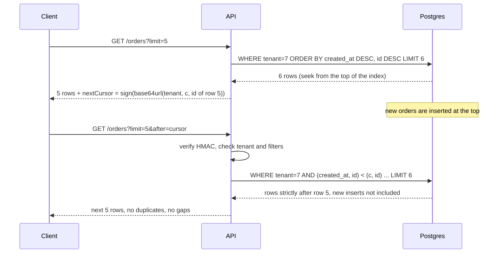

## Bối cảnh & vấn đề

Màn hình "Đơn hàng gần đây" của một tenant lớn gọi API sau:

```ts
// GET /orders?page=3&size=20
const rows = await db.query(
  `SELECT * FROM orders WHERE tenant_id = $1
   ORDER BY created_at DESC
   LIMIT $2 OFFSET $3`,
  [tenantId, size, (page - 1) * size],
);
```

Người dùng báo hai hiện tượng: lướt từ trang 2 sang trang 3 thỉnh thoảng thấy **lại** một đơn vừa xem, và có đơn **không bao giờ** xuất hiện ở trang nào. Đội backend thêm một bug thứ ba: export theo trang của tenant có 3 triệu đơn chạy mỗi lúc một chậm, trang 100.000 mất vài giây.

Cả ba đều từ cùng một thiết kế. `OFFSET` nói "bỏ qua N row đầu tiên **tại thời điểm query**", nhưng giữa hai lần gọi, row mới được insert vào đầu danh sách làm mọi thứ dịch xuống. `ORDER BY created_at` không unique (import hàng loạt tạo nhiều đơn cùng giây), nên thứ tự giữa các đơn trùng timestamp không được đảm bảo giữa các lần query. Và để bỏ qua N row, database vẫn phải **đọc** N row đó.

Bài này đi qua offset và keyset pagination với số liệu chạy thật, cách thiết kế cursor, cách mở rộng sang filter và sort mà không tạo lỗ hổng bảo mật hay hiệu năng, và cách phân trang sâu khi dữ liệu nằm ở Elasticsearch.

**Interview angle:** câu debug này kiểm tra bạn tìm được **hai** bug (offset drift và sort không unique), không chỉ một. Follow-up gần như chắc chắn là "product vẫn muốn số trang thì sao?".

## Khái niệm

### Offset pagination

**Offset pagination** dùng `LIMIT size OFFSET (page - 1) * size`. Client gửi số trang; server có thể trả kèm tổng số (`COUNT(*)`) để UI hiển thị "trang 3/150" và cho phép nhảy thẳng tới trang bất kỳ.

Nó có hai điểm yếu nền tảng. Thứ nhất, **chi phí tỷ lệ với offset**: PostgreSQL không có cách "nhảy" tới row thứ N; nó phải sinh ra và bỏ đi N row đầu, nên trang càng sâu càng chậm (docs PostgreSQL nói rõ các row bị bỏ qua bởi `OFFSET` vẫn phải được tính toán bên trong server). Thứ hai, **không ổn định khi dữ liệu thay đổi**: vị trí là tương đối với snapshot của từng query riêng lẻ. Insert ở đầu danh sách làm trang sau lặp lại item; delete làm trang sau bỏ sót item.

Offset vẫn hợp lý cho bảng nhỏ, ít ghi, và UI thật sự cần nhảy trang (bảng admin vài nghìn row).

### Keyset (cursor) pagination

**Keyset pagination** (còn gọi là seek method; "seek" và "keyset" là cùng một kỹ thuật) không nói "bỏ qua N row" mà nói "cho tôi các row **đứng sau** row cuối cùng tôi đã thấy". Với sort `created_at DESC, id DESC`:

```sql
SELECT id, created_at, total_minor
FROM orders
WHERE tenant_id = $1
  AND (created_at, id) < ($2, $3)        -- values of the last row of the previous page
ORDER BY created_at DESC, id DESC
LIMIT 51;                                -- limit + 1 to know whether there is a next page
```

Biểu thức `(created_at, id) < ($2, $3)` là **row value comparison** của PostgreSQL: so sánh theo thứ tự từ điển, trước theo `created_at`, bằng nhau thì theo `id`. Với index `(tenant_id, created_at DESC, id DESC)`, database **seek** thẳng tới vị trí đó trong B-tree và đọc đúng 51 row, bất kể đó là trang 1 hay trang 100.000. Insert mới ở đầu danh sách không ảnh hưởng vì điểm neo là giá trị, không phải vị trí.

SQL Server không hỗ trợ row value comparison, nên phải viết dạng mở rộng: `created_at < @c OR (created_at = @c AND id < @id)`. Hai dạng tương đương về kết quả, nhưng dạng mở rộng khó hơn cho optimizer dùng index hiệu quả.

### Sort key phải unique

Keyset chỉ đúng khi bộ sort key **unique**. Nếu chỉ sort theo `created_at` và 3 đơn cùng timestamp, điều kiện `created_at < X` sẽ bỏ qua các đơn còn lại cùng timestamp X ở trang sau. Vì vậy luôn thêm **tie-breaker** unique (thường là primary key) vào cuối `ORDER BY` và vào cursor.

Điều này cũng đúng với offset: SQL không đảm bảo thứ tự giữa các row bằng nhau về sort key. Hai lần chạy cùng query có thể trả chúng theo thứ tự khác nhau (tuỳ plan, tuỳ parallel scan), và một row "nhảy" từ trang 2 sang trang 3. Tie-breaker `id` sửa được bug này ngay cả khi vẫn giữ offset.

### Cursor opaque

**Cursor** là chuỗi mà server trả về (`nextCursor`) và client gửi lại nguyên văn (`?after=...`). Nó nên **opaque** (không trong suốt): client không được hiểu hay tự tạo cursor. Thường cursor là base64url của JSON chứa giá trị sort key của row cuối, cộng thêm những gì cần để kiểm tra: tenant, filter, hướng sort.

Opaque cho phép server đổi cách encode (thêm field vào sort, đổi sang ID khác) mà không breaking. Ký cursor bằng HMAC chặn client sửa tay (ví dụ chèn `tenant_id` khác), còn nhúng filter vào cursor chặn việc client đổi filter giữa chừng nhưng vẫn dùng cursor cũ (kết quả vô nghĩa).

Quy ước response phổ biến:

```json
{ "data": [ ... ], "nextCursor": "eyJ0Ijo3LCJjIjoi...x_27Q6S20y82wuMO", "hasMore": true }
```

`nextCursor: null` khi hết dữ liệu. Không cần `COUNT(*)`: lấy `limit + 1` row, nếu nhận đủ `limit + 1` thì còn trang sau.

### Filter, sort và field selection an toàn

List endpoint thường cần filter (`status=paid`), khoảng (`createdFrom=2026-09-01`), sort (`sort=-createdAt,id`), chọn field (`fields=id,total`). Mỗi thứ là một bề mặt tấn công và một nguồn query chậm. Nguyên tắc:

- **Allow-list**: chỉ các field được khai báo mới filter/sort được, và mỗi field sort được phải có index phù hợp. Sort theo cột không index trên bảng lớn là full scan + sort, một request có thể chiếm CPU database.
- **Map tên API → cột DB** qua bảng cố định; không bao giờ nối chuỗi từ query param vào SQL (SQL injection qua `ORDER BY` là lỗi kinh điển, vì `ORDER BY` không tham số hoá được bằng `$1`).
- **Giới hạn**: `limit` tối đa (ví dụ 100), độ dài danh sách `IN`, khoảng ngày tối đa.
- **Tenant filter luôn do server thêm**, lấy từ token, không bao giờ từ query param.
- Với sort do người dùng chọn (theo giá, theo tên), cursor phải chứa **giá trị của cột sort đó** cộng tie-breaker, và index phải có đúng thứ tự `(tenant_id, price, id)`.

Filter tuỳ ý kiểu "bất kỳ field, bất kỳ toán tử" hay full-text (`LIKE '%áo%'`) nên chuyển sang search engine, không ép vào SQL.

### Phân trang trên Elasticsearch

Elasticsearch có `from + size` giống offset, và bị giới hạn bởi **`index.max_result_window`** (mặc định 10.000): `from + size` vượt quá sẽ lỗi. Lý do: mỗi shard phải trả về top `from + size` kết quả để node điều phối gộp lại, chi phí bộ nhớ tăng tuyến tính theo độ sâu và số shard.

Cách phân trang sâu được khuyến nghị là **`search_after`**: truyền giá trị sort của hit cuối (giống keyset), kết hợp **PIT (point in time)** để giữ một góc nhìn nhất quán của index trong suốt quá trình phân trang, và sort có tie-breaker (`_shard_doc` khi dùng PIT). Scroll API cũ không còn được khuyến nghị cho deep pagination (verify theo phiên bản).

Ngoài ra, index search là **eventually consistent** với database nguồn: dữ liệu đi qua pipeline (CDC, outbox, Kafka) tới indexer, có độ trễ từ vài trăm ms tới vài giây. API phải nói rõ điều này, và màn hình vừa sửa xong (read-after-write) nên đọc từ database.

**Interview angle:** interviewer muốn nghe `max_result_window` mặc định 10.000, `search_after` + PIT, và "search không phải nguồn sự thật".

## Cơ chế hoạt động



Diễn giải. Trang đầu không có cursor, nên query đọc từ đỉnh index. Server lấy `limit + 1` row, trả `limit` row và tạo cursor từ giá trị sort của row cuối cùng được trả. Cursor được ký để client không sửa được. Giữa hai lần gọi, đơn mới được insert ở đỉnh danh sách. Lần gọi thứ hai kiểm tra chữ ký, kiểm tra cursor thuộc đúng tenant và đúng bộ filter, rồi seek vào index ở đúng điểm neo. Vì điều kiện là "nhỏ hơn điểm neo" chứ không phải "bỏ qua N row", các insert mới nằm ở phía "lớn hơn" và không làm trang dịch chuyển.

Với offset, lần gọi thứ hai là `OFFSET 5`; 2 đơn mới ở đỉnh đẩy 2 đơn cuối trang 1 xuống vị trí 6 và 7, nên chúng xuất hiện lại ở trang 2. Ví dụ dưới đây cho thấy đúng điều đó.

## Ví dụ thực tế

### Offset drift, keyset và EXPLAIN trên 200.000 đơn

Chạy thật trên PGlite 0.5.8 (PostgreSQL 18.3), Node 24.21. Bảng `orders` với 200.000 row của tenant 7, cứ 3 đơn chung một `created_at` (mô phỏng import hàng loạt), index `(tenant_id, created_at DESC, id DESC)`.

```sql
CREATE TABLE orders (
  id bigserial PRIMARY KEY, tenant_id bigint NOT NULL,
  created_at timestamptz NOT NULL, total_minor bigint NOT NULL
);
INSERT INTO orders (tenant_id, created_at, total_minor)
SELECT 7, timestamptz '2026-09-01 00:00:00+00' + (g / 3) * interval '1 second', g * 1000
FROM generate_series(1, 200000) g;
CREATE INDEX orders_tenant_created_id ON orders (tenant_id, created_at DESC, id DESC);
ANALYZE orders;
```

Cursor ký HMAC:

```ts
const enc = (o: object) => {
  const p = Buffer.from(JSON.stringify(o)).toString("base64url");
  return p + "." + createHmac("sha256", SECRET).update(p).digest("base64url").slice(0, 16);
};
const dec = (c: string) => {
  const [p, s] = c.split(".");
  const e = createHmac("sha256", SECRET).update(p).digest("base64url").slice(0, 16);
  if (!s || s.length !== e.length || !timingSafeEqual(Buffer.from(s), Buffer.from(e))) throw new Error("invalid cursor");
  return JSON.parse(Buffer.from(p, "base64url").toString());
};

async function list(tenantId: number, limit: number, cursor?: string) {
  const c = cursor ? dec(cursor) : null;
  if (c && c.t !== tenantId) throw new Error("cursor belongs to another query");
  const r = await db.query(
    `SELECT id, created_at, total_minor FROM orders WHERE tenant_id = $1
       AND ($2::timestamptz IS NULL OR (created_at, id) < ($2::timestamptz, $3::bigint))
     ORDER BY created_at DESC, id DESC LIMIT $4`,
    [tenantId, c?.c ?? null, c?.id ?? null, limit + 1]);
  const rows = r.rows.slice(0, limit), last = rows.at(-1);
  return {
    data: rows.map((x) => x.id),
    nextCursor: r.rows.length > limit ? enc({ t: tenantId, c: last.created_at.toISOString(), id: String(last.id) }) : null,
  };
}
```

Output thật:

```text
offset page 1: 200000,199999,199998,199997,199996
2 new orders inserted, offset page 2: 199997,199996,199995,199994,199993
keyset page 1: 200002,200001,200000,199999,199998 next = eyJ0Ijo3LCJjIjoiMjAyNi0wOS0wMVQxODozMTowNi4wMDBaIiwiaWQiOiIxOTk5OTgifQ.x_27Q6S20y82wuMO
1 more insert, keyset page 2: 199997,199996,199995,199994,199993
tampered cursor -> invalid cursor
```

Với offset, sau khi 2 đơn mới được insert, trang 2 bắt đầu bằng `199997, 199996`, hai đơn **đã thấy** ở trang 1. Với keyset, dù có thêm đơn mới giữa hai lần gọi, trang 2 bắt đầu đúng ở `199997`, ngay sau `199998` là row cuối trang 1: không trùng, không mất. Cursor bị sửa một ký tự bị từ chối.

So sánh plan của trang sâu (output thật, `EXPLAIN (ANALYZE, COSTS OFF, TIMING OFF, SUMMARY ON)`):

```text
--- OFFSET 150000
Limit (actual rows=20.00 loops=1)
  Buffers: shared hit=1107 read=738
  ->  Index Only Scan using orders_tenant_created_id on orders (actual rows=150020.00 loops=1)
        Index Cond: (tenant_id = 7)
        Heap Fetches: 150020
Execution Time: 32.903 ms
--- keyset
Limit (actual rows=20.00 loops=1)
  Buffers: shared hit=3 read=1
  ->  Index Only Scan using orders_tenant_created_id on orders (actual rows=20.00 loops=1)
        Index Cond: ((tenant_id = 7) AND (ROW(created_at, id) < ROW('2026-09-01 20:53:20+07'::timestamp with time zone, 50001)))
        Heap Fetches: 20
Execution Time: 0.043 ms
```

Cùng một index, cùng 20 row trả về. Offset phải đọc **150.020** row (1.845 buffer) để bỏ đi 150.000; keyset đọc đúng 20 row (4 buffer), nhanh hơn khoảng 750 lần. Ở bảng thật hàng chục triệu row, không nằm hết trong cache, khoảng cách còn lớn hơn. Để ý `Index Cond` chứa `ROW(created_at, id) < ROW(...)`: row comparison được đẩy thẳng vào điều kiện seek của index.

### Sửa bug "đơn lặp và đơn mất"

```ts
// GET /orders?limit=20&after=<cursor>
const SORTS = {
  "-createdAt": { cols: ["created_at", "id"], dir: "DESC" },
  "-total":     { cols: ["total_minor", "id"], dir: "DESC" },   // needs index (tenant_id, total_minor DESC, id DESC)
} as const;

const sort = SORTS[req.query.sort ?? "-createdAt"];
if (!sort) throw problem(400, "unsupported-sort", { allowed: Object.keys(SORTS) });
const limit = Math.min(Number(req.query.limit ?? 20), 100);
// tenant comes from the token, never from the query string
const tenantId = req.auth.tenantId;
```

Ba thay đổi: tie-breaker `id` trong mọi sort, keyset thay offset, sort và limit qua allow-list. `SELECT *` cũng bị thay bằng danh sách cột qua DTO, để cột nội bộ không lọt ra API.

### Khi product vẫn muốn số trang

Thoả hiệp thường dùng cho admin UI: giữ offset nhưng **giới hạn độ sâu** (tối đa 100 trang, sau đó yêu cầu thu hẹp filter), luôn có tie-breaker, trả `total` dạng ước lượng (`pg_class.reltuples` hay `EXPLAIN` estimate) cho bảng lớn thay vì `COUNT(*)` chính xác. Hoặc kết hợp: "trang 1, 2, 3 … tiếp" với cursor cho nút "tiếp" và offset cho vài trang đầu.

## Trade-offs & lựa chọn thay thế

| Tiêu chí | Offset/limit | Keyset/cursor | Elasticsearch `search_after` + PIT |
| --- | --- | --- | --- |
| Nhảy tới trang N | Có | Không | Không |
| Tổng số trang | Có (`COUNT(*)`, đắt ở bảng lớn) | Không (có thể ước lượng) | `track_total_hits` (giới hạn mặc định, verify) |
| Chi phí trang sâu | Tăng tuyến tính theo offset | Hằng số (O(limit)) | Hằng số theo trang |
| Ổn định khi có ghi | Trùng/mất item | Ổn định | Ổn định trong PIT |
| Sort tuỳ ý | Dễ (nhưng cần index) | Mỗi sort cần index và cursor riêng | Linh hoạt, sort field phải có doc values |
| Độ phức tạp | Thấp | Trung bình | Trung bình, thêm pipeline index |

Khi nào chọn cái nào. Feed, infinite scroll, sync, export và mọi public API: keyset. Admin table nhỏ, cần nhảy trang: offset có tie-breaker và giới hạn độ sâu. Full-text, facet, filter linh hoạt, dữ liệu rất lớn: search engine với `search_after` + PIT, và chấp nhận eventual consistency. Với export toàn bộ, cân nhắc bỏ hẳn phân trang đồng bộ và chuyển sang job async ([bài 8](/tracks/api-design/learn/async-bulk-uploads)).

Một lựa chọn trung gian là **range pagination theo thời gian** (`createdFrom`/`createdTo`) cho log và time-series; nó chỉ đúng nếu vẫn có `ORDER BY` và tie-breaker bên trong mỗi khoảng.

## Edge cases & failure modes

- **Cột sort nullable**: `NULL` đứng đầu hoặc cuối tuỳ `NULLS FIRST/LAST`, và `(price, id) < (NULL, 5)` trả `NULL` (không phải true), làm mất row. Hoặc cấm sort theo cột nullable, hoặc `COALESCE` vào giá trị sentinel và index cùng biểu thức.
- **Row của cursor bị xoá**: keyset vẫn đúng vì chỉ so sánh giá trị, không cần row neo còn tồn tại. Đây là lợi thế so với cursor dạng "ID của row cuối" rồi query lại row đó.
- **Row bị update đổi giá trị sort** (sort theo `updated_at`): row có thể nhảy về trước con trỏ và bị bỏ qua, hoặc xuất hiện hai lần. Chấp nhận (feed), hoặc sync bằng `updated_at, id` kèm tombstone cho item bị xoá.
- **Cursor dùng với filter khác**: client đổi `status=paid` sang `status=refunded` nhưng giữ cursor; kết quả thiếu dữ liệu. Nhúng hash của filter vào cursor và trả `400` khi lệch.
- **Precision của timestamp**: Postgres lưu microsecond, còn driver Node (PGlite, node-postgres) parse `timestamptz` thành `Date` chỉ có millisecond. Cursor encode bằng `toISOString()` làm mất phần micro, và điều kiện `<` bỏ sót các row cùng millisecond. Chạy thật trên PGlite với ba row `…00.1234`, `…00.1239`, `…00.1231` (id 1, 2, 3): trang 1 trả id 2 với cursor `"2026-09-30T10:00:00.123Z"`, và trang 2 trả `[]` thay vì `[1, 3]`; dùng `created_at::text` (`2026-09-30 17:00:00.1239+07`) làm giá trị cursor thì trang 2 trả đúng `[1, 3]`. Ví dụ ở trên dùng `toISOString()` và chỉ đúng vì dữ liệu mẫu có timestamp tròn giây; code thật nên lấy timestamp dạng text từ DB (hoặc epoch microsecond) cho cursor.
- **`limit` không giới hạn**: `?limit=100000` biến list endpoint thành export đồng bộ. Luôn có max.
- **Elasticsearch `from` quá sâu**: vượt `max_result_window` trả lỗi; tăng giới hạn này là chữa triệu chứng, tốn heap. Dùng `search_after`.
- **Search trả item đã xoá**: pipeline index trễ hoặc event delete bị mất. Kiểm tra lag của consumer, dead letter của indexer, và cân nhắc lọc lại theo DB cho màn hình quan trọng.

## Pitfalls

- ❌ `ORDER BY created_at` không tie-breaker → ✅ `ORDER BY created_at DESC, id DESC`, vì row bằng nhau không có thứ tự đảm bảo.
- ❌ Offset cho feed/export trên bảng đang ghi → ✅ keyset, vì offset trùng/mất item và chậm dần theo trang.
- ❌ Cursor là `id` thô client tự tăng giảm → ✅ cursor opaque, ký HMAC, chứa tenant và filter.
- ❌ Nối `req.query.sort` vào `ORDER BY` → ✅ allow-list map sang cột cố định.
- ❌ Tenant lấy từ `?tenantId=` → ✅ từ token, server tự thêm vào mọi query.
- ❌ `COUNT(*)` trên mỗi trang của bảng 50 triệu row → ✅ `hasMore` từ `limit + 1`, hoặc total ước lượng.
- ❌ Index không khớp thứ tự sort → ✅ index `(tenant_id, created_at DESC, id DESC)` đúng thứ tự `ORDER BY`.
- ❌ Tăng `index.max_result_window` lên 1 triệu → ✅ `search_after` + PIT.

## Tóm tắt

- Offset bỏ qua N row theo vị trí: chi phí tăng theo trang, và insert/delete giữa hai lần gọi gây trùng/mất item.
- Keyset seek theo giá trị: `(created_at, id) < ($c, $id)` với index cùng thứ tự; chi phí hằng số, ổn định khi có ghi (thực đo: 150.020 row so với 20 row đọc).
- Sort key phải unique: luôn có tie-breaker `id`, cho cả offset lẫn keyset.
- Cursor opaque (base64url + HMAC), chứa sort key, tenant, filter; `limit + 1` để biết còn trang.
- Filter/sort theo allow-list, mỗi sort có index, `limit` có max, tenant từ token.
- Elasticsearch: `from + size` ≤ `max_result_window` (mặc định 10.000); deep paging dùng `search_after` + PIT; index là eventually consistent.
