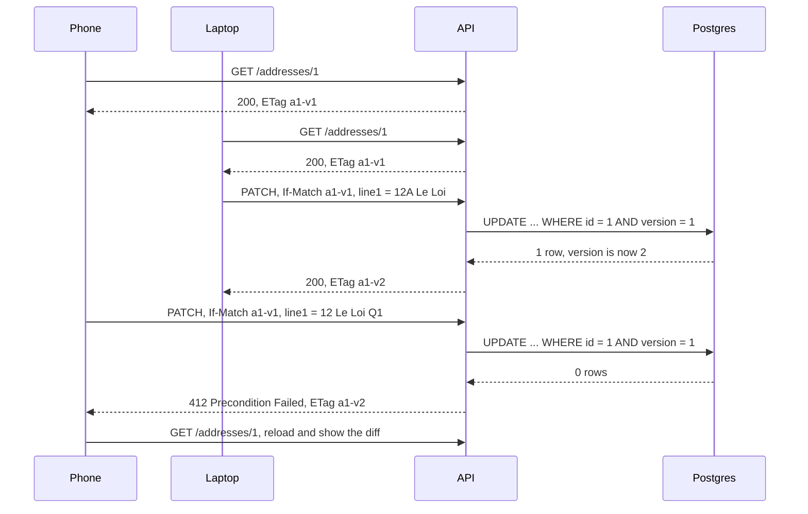

## Bối cảnh & vấn đề

Hai sự cố thật, cùng một nguyên nhân gốc: không hiểu HTTP nói gì về "phiên bản" của một resource.

Sự cố thứ nhất: sau khi đội hạ tầng bật CDN cho toàn bộ `api.shop.example`, một khách hàng gọi tổng đài vì giỏ hàng của cô chứa đồ của một người khác, kèm địa chỉ giao hàng lạ. Nguyên nhân: `GET /cart` trả `Cache-Control: max-age=60` (dev thêm vào để "giảm tải"), CDN coi response là cache được cho **mọi người**, và trong 60 giây mọi request `/cart` qua cùng edge nhận giỏ của người đầu tiên.

Sự cố thứ hai: khách hàng sửa địa chỉ trên laptop ("12A Le Loi"), trong khi app điện thoại đang mở màn hình sửa từ nửa tiếng trước. Cô bấm lưu trên điện thoại một thay đổi khác, và bản sửa trên laptop **biến mất** mà không ai báo. Đây là **lost update**: hai bên cùng đọc phiên bản 1, cùng ghi, người ghi sau đè lên người ghi trước.

HTTP có sẵn công cụ cho cả hai: `Cache-Control` nói rõ **ai** được lưu response và bao lâu, còn `ETag` cùng các header điều kiện (`If-None-Match`, `If-Match`) cho phép client nói "chỉ gửi nếu đã đổi" và "chỉ ghi nếu chưa ai đổi". Bài này đi qua cả hai, với ví dụ chạy thật trên API địa chỉ.

**Interview angle:** câu "CDN trả cart của A cho B" kiểm tra bạn biết `private`/`no-store`, `Vary` và quy tắc của shared cache với `Authorization`; câu ETag kiểm tra bạn nối được một khái niệm vào hai công dụng: cache và concurrency.

## Khái niệm

### Private cache và shared cache

HTTP phân biệt hai loại cache. **Private cache** là cache của một người dùng, thường là browser: nó chỉ phục vụ lại response cho chính người đó. **Shared cache** là cache phục vụ nhiều người: CDN, reverse proxy (Varnish, nginx), proxy của công ty. Mọi quyết định cache API đều bắt đầu bằng câu hỏi: response này có **giống nhau cho mọi người** không?

Catalog sản phẩm công khai thì giống nhau, cache ở CDN được. Giỏ hàng, profile, giá riêng theo tenant thì không, chỉ browser của chính người đó được giữ, hoặc không ai được giữ. RFC 9111 có một lớp bảo vệ mặc định: shared cache **không được** lưu response cho request có header `Authorization`, trừ khi response ghi rõ `public`, `s-maxage` hoặc `must-revalidate`. Nhưng API dùng cookie session thì không có lớp bảo vệ này, và nhiều CDN có cấu hình "cache everything" ghi đè hành vi chuẩn.

### Cache-Control

**`Cache-Control`** là header chính điều khiển cache. Các directive quan trọng trên response:

- `max-age=N`: response còn "tươi" trong N giây, với mọi cache.
- `s-maxage=N`: như `max-age` nhưng chỉ cho **shared** cache, ghi đè `max-age` ở đó. Cho phép "browser giữ 0 giây, CDN giữ 60 giây".
- `public`: shared cache được lưu, kể cả khi request có `Authorization`.
- `private`: chỉ private cache được lưu; CDN không được lưu.
- `no-cache`: **được lưu**, nhưng phải hỏi lại server (revalidate) trước mỗi lần dùng. Tên gây hiểu nhầm nhất HTTP.
- `no-store`: **không được lưu** ở bất kỳ đâu. Dùng cho dữ liệu nhạy cảm (thông tin thanh toán, token).
- `stale-while-revalidate=N` (RFC 5861): hết hạn rồi vẫn được trả bản cũ trong N giây trong khi cache tải bản mới ở nền.

Ví dụ: catalog `public, max-age=0, s-maxage=60, stale-while-revalidate=300`; giỏ hàng `private, no-cache` (browser giữ để dùng với ETag) hoặc `no-store`.

### Vary

**`Vary`** liệt kê các request header mà response phụ thuộc vào. Cache dùng URL cộng giá trị các header đó làm khoá. Nếu `/products/1` trả tiếng Việt hay tiếng Anh theo `Accept-Language` mà không có `Vary: Accept-Language`, CDN lưu bản đầu tiên và trả nó cho mọi người. Cùng lý do, API dùng header version (`Accept: application/vnd.acme.v2+json`) phải có `Vary: Accept`.

`Vary: Authorization` hay `Vary: Cookie` về lý thuyết tách cache theo người dùng, nhưng làm hit ratio về gần 0 và nhiều CDN xử lý `Vary` hạn chế (verify theo CDN). Với dữ liệu theo người dùng, `private` rõ ràng hơn.

### ETag, 304 và revalidation

**`ETag`** là một định danh phiên bản của representation, do server chọn: hash nội dung, hoặc số version từ database (`"a1-v7"`). Có hai loại. **Strong ETag** (`"a1-v7"`) cam kết hai representation giống nhau từng byte. **Weak ETag** (`W/"a1-v7"`) chỉ cam kết tương đương về ngữ nghĩa (ví dụ cùng dữ liệu nhưng nén khác).

Công dụng thứ nhất là **revalidation**: client gửi `If-None-Match: "a1-v7"`, nếu phiên bản chưa đổi thì server trả `304 Not Modified` không có body. Tiết kiệm băng thông và thời gian serialize, nhưng vẫn tốn một round-trip. So sánh ở `If-None-Match` là so sánh **weak** (bỏ qua tiền tố `W/`). `Last-Modified` + `If-Modified-Since` là cơ chế tương tự theo thời gian, độ phân giải một giây, nên kém chính xác hơn.

### If-Match và optimistic concurrency

Công dụng thứ hai của ETag là **optimistic concurrency control**: client gửi `PATCH` hoặc `PUT` kèm `If-Match: "a1-v1"`, nghĩa là "chỉ áp dụng nếu resource vẫn đang ở phiên bản tôi đã đọc". Nếu ai đó đã sửa trước, server trả **`412 Precondition Failed`**, client tải lại, cho người dùng xem thay đổi và quyết định. Không ai bị ghi đè âm thầm.

"Optimistic" nghĩa là không khoá gì trước: giả định xung đột hiếm, và phát hiện khi ghi. Phía server, ETag thường ánh xạ tới một cột `version` (hoặc `xmin`, `rowversion` của SQL Server), và câu `UPDATE ... WHERE id = $1 AND version = $2` là nơi kiểm tra thật sự: 0 row bị ảnh hưởng nghĩa là version đã đổi. Kiểm tra version bằng một `SELECT` riêng rồi mới `UPDATE` là race condition.

`If-Match` dùng so sánh **strong**, nên weak ETag không được dùng ở đây. Để bắt buộc client dùng precondition, server trả **`428 Precondition Required`** (RFC 6585) khi thiếu `If-Match`.

**Interview angle:** follow-up thường là "khác gì pessimistic lock?". Lock (`SELECT ... FOR UPDATE`) giữ trong một transaction ngắn phía server; nó không thể kéo dài qua thời gian người dùng đang gõ trên form. Optimistic hợp với chỉnh sửa qua HTTP; pessimistic hợp với thao tác ngắn, tranh chấp cao, trong một request (trừ tồn kho).

## Cơ chế hoạt động



Diễn giải. Cả hai thiết bị đọc phiên bản 1. Laptop ghi trước; câu `UPDATE` có điều kiện `version = 1` khớp, tăng version lên 2 và trả ETag mới. Điện thoại ghi sau, vẫn mang `If-Match` của phiên bản 1; điều kiện `version = 1` không còn khớp, `UPDATE` ảnh hưởng 0 row, và server trả `412` cùng ETag hiện tại. App điện thoại tải lại, hiển thị "địa chỉ đã được sửa trên thiết bị khác", và người dùng quyết định. Điểm cốt lõi là phép kiểm tra và phép ghi là **một câu lệnh nguyên tử** trong database, không phải hai bước.

Với caching, luồng tương tự nhưng dùng `If-None-Match`: client gửi ETag đang giữ, server so với phiên bản hiện tại, bằng nhau thì `304`, khác thì `200` với body và ETag mới.

## Ví dụ thực tế

### Address API với ETag, 304, 412 và 428

Chạy thật: Node 24.21, `node:http`, PGlite 0.5.8 (PostgreSQL 18.3). Schema có cột `version` và **partial unique index** đảm bảo mỗi khách hàng có tối đa một địa chỉ mặc định:

```sql
CREATE TABLE addresses (
  id bigserial PRIMARY KEY, customer_id bigint NOT NULL,
  line1 text NOT NULL, postal_code text NOT NULL,
  is_default boolean NOT NULL DEFAULT false,
  version int NOT NULL DEFAULT 1
);
CREATE UNIQUE INDEX one_default_per_customer ON addresses (customer_id) WHERE is_default;
```

Handler `PATCH` (rút gọn):

```ts
const im = req.headers["if-match"];
if (!im) return send(428, { title: "If-Match required" });
if (im.startsWith("W/")) return send(412, { title: "weak ETag not allowed for If-Match" });
const version = Number(im.match(/-v(\d+)"/)?.[1]);

const r = await db.transaction(async (tx) => {
  if (patch.isDefault === true)   // unset the old default first, same transaction
    await tx.query(`UPDATE addresses SET is_default = false, version = version + 1
                    WHERE customer_id = $1 AND is_default AND id <> $2`, [row.customer_id, id]);
  return tx.query(`UPDATE addresses
                   SET line1 = COALESCE($3, line1), is_default = COALESCE($4, is_default), version = version + 1
                   WHERE id = $1 AND version = $2 RETURNING *`,
                  [id, version, patch.line1 ?? null, patch.isDefault ?? null]);
});
if (r.rows.length === 0) return send(412, { title: "Precondition Failed" }, { etag: currentEtag });
return send(200, r.rows[0], { etag: `"a${id}-v${r.rows[0].version}"` });
```

Output thật:

```text
GET (phone)                          200 etag="a1-v1" {"id":1,"customer_id":42,"line1":"12 Le Loi","postal_code":"700000","is_default":true,"ver…
GET If-None-Match (revalidate)       304 etag="a1-v1"
PATCH without If-Match               428 etag=null {"title":"If-Match required"}
PATCH laptop If-Match v1             200 etag="a1-v2" {"id":1,"customer_id":42,"line1":"12A Le Loi","postal_code":"700000","is_default":true,"ve…
PATCH phone If-Match v1 (stale)      412 etag="a1-v2" {"title":"Precondition Failed"}
GET If-None-Match old tag            200 etag="a1-v2" {"id":1,"customer_id":42,"line1":"12A Le Loi","postal_code":"700000","is_default":true,"ve…
PATCH weak tag                       412 etag=null {"title":"weak ETag not allowed for If-Match"}
PATCH addr 2 isDefault=true          200 etag="a2-v2" {"id":2,"customer_id":42,"line1":"9 Tran Hung Dao","postal_code":"700000","is_default":tru…
[
  { id: 1, is_default: false, version: 3 },
  { id: 2, is_default: true, version: 2 }
]
direct second default -> duplicate key value violates unique constraint "one_default_per_customer"
```

Đọc kết quả: revalidation với ETag còn đúng trả `304` rỗng; ETag cũ nhận `200` với dữ liệu mới. `PATCH` thiếu `If-Match` bị từ chối bằng `428`, nên không client nào có thể "quên" kiểm tra. Bản sửa của điện thoại dựa trên phiên bản 1 bị chặn bằng `412`, bản sửa của laptop được giữ nguyên. Đặt địa chỉ 2 làm mặc định tự động bỏ mặc định của địa chỉ 1 trong cùng transaction (version của địa chỉ 1 tăng lên 3, nên mọi client đang giữ ETag cũ của nó cũng sẽ nhận `412`). Và nếu có code nào cố tạo mặc định thứ hai trực tiếp, partial unique index chặn ở tầng database.

Hai quyết định thiết kế khác của Address API: `POST /customers/{id}/addresses/{addrId}/default` là action endpoint rõ ràng hơn `PATCH isDefault` nếu team muốn (xem [HTTP semantics](/tracks/api-design/learn/http-semantics)); và order phải lưu **bản sao** địa chỉ giao hàng tại thời điểm đặt, không phải foreign key tới address book, vì khách sửa hay xoá địa chỉ sau đó không được làm thay đổi lịch sử đơn đã giao.

### Header cache cho từng loại endpoint

```text
GET /products/123            Cache-Control: public, max-age=0, s-maxage=60, stale-while-revalidate=300
                             ETag: "p123-v88"    Vary: Accept-Language
GET /tenants/7/price-list    Cache-Control: private, no-cache          (per tenant: never in a shared cache)
GET /cart                    Cache-Control: no-store
GET /me/payment-methods      Cache-Control: no-store
POST /orders                 (not cacheable by default)
```

Bảng trên là illustrative. Với endpoint nóng dùng chung cho mọi người (catalog, product detail của storefront), `s-maxage` ngắn cộng `stale-while-revalidate` cho CDN hấp thụ phần lớn traffic trong đợt khuyến mãi, còn purge theo tag/URL khi retailer cập nhật sản phẩm. Đo hiệu quả bằng cache hit ratio ở CDN, số request tới origin, và p95/p99 trước và sau.

## Trade-offs & lựa chọn thay thế

| Cơ chế | Ưu | Nhược | Khi nào dùng |
| --- | --- | --- | --- |
| `max-age` / `s-maxage` (freshness) | Không tốn round-trip khi còn tươi | Dữ liệu cũ tới khi hết hạn hoặc purge | Dữ liệu công khai, chấp nhận trễ vài giây |
| `no-cache` + ETag (revalidate) | Luôn đúng, tiết kiệm băng thông với `304` | Vẫn một round-trip mỗi lần | Dữ liệu theo user, đọc thường xuyên |
| `no-store` | An toàn nhất | Không có lợi ích cache | Dữ liệu nhạy cảm, giỏ hàng |
| Cache ở app (Redis) | Kiểm soát invalidation, theo tenant | Phải tự lo invalidation, stampede | Tính toán đắt, dữ liệu theo tenant |
| Optimistic (`If-Match` + version) | Không khoá, hợp HTTP, phát hiện xung đột | Người dùng phải xử lý `412` | Chỉnh sửa qua form, nhiều thiết bị |
| Pessimistic (`SELECT ... FOR UPDATE`) | Không có retry ở client | Khoá chỉ sống trong transaction, giảm concurrency | Thao tác ngắn, tranh chấp cao trong một request |
| Last-write-wins | Đơn giản | Mất dữ liệu âm thầm | Dữ liệu không quan trọng (preference UI) |

Khi nào chọn cái nào. Với cache: bắt đầu bằng câu hỏi "response có giống nhau cho mọi người không". Có thì `public` + `s-maxage` ngắn + purge; không thì `private, no-cache` với ETag, hoặc `no-store` nếu nhạy cảm. Với concurrency: resource mà nhiều người hoặc nhiều thiết bị sửa (địa chỉ, cấu hình, tài liệu) nên bắt buộc `If-Match` và trả `428` khi thiếu. Thao tác tranh chấp cao nhưng ngắn và do server tự quyết (trừ tồn kho) thì dùng câu `UPDATE ... SET stock = stock - $n WHERE stock >= $n` nguyên tử, không cần ETag.

## Edge cases & failure modes

- **Response có `Set-Cookie` bị cache**: shared cache lưu response kèm cookie session của người đầu tiên, rồi phát cookie đó cho người khác (chiếm phiên). RFC 9111 không cấm cache response có `Set-Cookie`; nhiều CDN mặc định không cache chúng, nhưng đừng dựa vào mặc định (verify theo CDN). Response có `Set-Cookie` nên có `private` hoặc `no-store`.
- **Thiếu `Vary`**: response khác nhau theo `Accept-Language`, `Accept` (version) hay `Accept-Encoding` mà thiếu `Vary`, CDN trả nhầm biến thể.
- **ETag khác nhau giữa các instance**: ETag tính từ hash có chứa timestamp serialize hay thứ tự key không ổn định, mỗi pod trả ETag khác cho cùng dữ liệu, `304` không bao giờ xảy ra và `If-Match` fail ngẫu nhiên. Tính ETag từ version trong database.
- **Middleware nén đổi body**: một số proxy chuyển strong ETag thành weak khi nén (`W/"..."`), làm `If-Match` fail. Server phải nhận diện hoặc dùng ETag từ version thay vì hash body.
- **`412` không có đường phục hồi**: client nhận `412` rồi không làm gì. Trả kèm ETag hiện tại (hoặc body hiện tại) để client merge.
- **Purge CDN chậm**: cập nhật giá nhưng CDN vẫn trả giá cũ tới hết `s-maxage`. Với dữ liệu nhạy về tiền, dùng `s-maxage` ngắn và purge theo surrogate key; checkout luôn tính giá từ nguồn.
- **Xoá địa chỉ đang được dùng**: nếu order tham chiếu tới address, xoá address làm hỏng lịch sử hoặc bị chặn bởi foreign key. Snapshot địa chỉ vào order ngay khi đặt.

## Pitfalls

- ❌ `Cache-Control: max-age=60` trên `/cart` → ✅ `no-store` hoặc `private, no-cache`, vì CDN coi `max-age` là cho phép mọi cache.
- ❌ Nghĩ `no-cache` là "không cache" → ✅ `no-cache` = lưu nhưng revalidate; `no-store` mới là không lưu.
- ❌ Response theo ngôn ngữ/version mà thiếu `Vary` → ✅ `Vary: Accept-Language`, `Vary: Accept`.
- ❌ Kiểm tra version bằng `SELECT` rồi `UPDATE` → ✅ `UPDATE ... WHERE version = $v` và kiểm tra số row bị ảnh hưởng.
- ❌ Cho phép `PATCH` không có precondition trên resource nhiều người sửa → ✅ trả `428` khi thiếu `If-Match`.
- ❌ Dùng weak ETag cho `If-Match` → ✅ strong ETag từ version.
- ❌ Đảm bảo "một mặc định" bằng code ứng dụng → ✅ partial unique index cộng cập nhật trong một transaction.
- ❌ Order tham chiếu address book bằng foreign key → ✅ snapshot địa chỉ vào order.

## Tóm tắt

- Câu hỏi đầu tiên: response có giống nhau cho mọi người không? Không thì không bao giờ vào shared cache.
- `max-age` cho mọi cache, `s-maxage` cho shared cache, `private` chỉ browser, `no-cache` = revalidate, `no-store` = không lưu.
- `Vary` liệt kê header mà response phụ thuộc; thiếu nó là CDN trả nhầm biến thể.
- ETag là phiên bản của representation: `If-None-Match` → `304` (cache), `If-Match` → `412` (concurrency), thiếu precondition → `428`.
- Phía server, ETag ánh xạ tới cột `version`; kiểm tra bằng `UPDATE ... WHERE version = $v` nguyên tử.
- Optimistic concurrency hợp với chỉnh sửa qua HTTP; pessimistic lock chỉ sống trong một transaction ngắn.
- Ràng buộc nghiệp vụ như "một địa chỉ mặc định" nên đặt ở database (partial unique index); order lưu snapshot địa chỉ.
