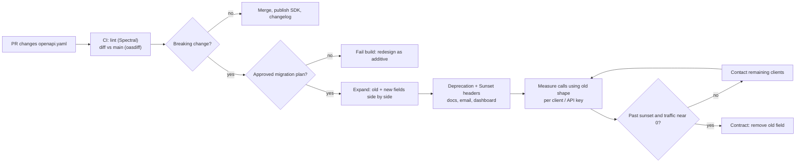

## Bối cảnh & vấn đề

Một nền tảng B2B có Admin API dùng bởi 40 hệ thống của khách hàng: ERP, phần mềm kế toán, script tự viết. Đội backend muốn gom thông tin khách hàng vào một object: `customer_name` thành `customer.fullName`. Pull request trông vô hại, test của chính đội đều xanh, deploy lúc 10 giờ sáng. Tới trưa, 11 khách hàng báo đồng bộ đơn hàng bị hỏng: script của họ đọc `order.customer_name`, nhận `undefined`, và ghi hàng nghìn hoá đơn không có tên khách.

Tuần sau, một thay đổi "chỉ thêm" khác: thêm trạng thái `on_hold` cho order. Không xoá gì, không đổi tên gì. Nhưng app mobile phiên bản cũ có `switch` exhaustive trên `status` và ném exception với giá trị lạ, màn hình danh sách đơn crash với mọi khách có đơn `on_hold`.

API là **contract**: một khi có client phụ thuộc, bạn không còn tự do thay đổi nó như code nội bộ. Client của API public không deploy cùng bạn, không đọc changelog của bạn, và nhiều khi không còn ai maintain. Bài này trả lời: thay đổi nào là breaking (kể cả loại trông an toàn), có những chiến lược versioning nào, làm sao đổi một field cho 40 client mà không ai hỏng, và làm sao biến tất cả thành quy trình tự động thay vì trông vào sự cẩn thận.

**Interview angle:** senior interview hỏi về **evolution** nhiều hơn là "REST là gì". Câu trả lời mạnh luôn có ba phần: kỹ thuật (expand-contract), giao tiếp (deprecation policy, header) và đo lường (ai còn dùng).

## Khái niệm

### Breaking change

**Breaking change** là thay đổi làm một client **đang đúng** trở thành sai mà client đó không đổi gì. Loại hiển nhiên: xoá hoặc đổi tên field, đổi kiểu (`id` từ number sang string), thêm field **bắt buộc** vào request, đổi URL hoặc method, đổi cách xác thực.

Loại trông an toàn nhưng vẫn breaking:

- **Thêm giá trị enum** trong response: client có `switch` exhaustive hoặc validate bằng schema chặt sẽ lỗi.
- **Đổi default**: page size mặc định 50 xuống 20, sort mặc định đổi chiều. Client không truyền tham số sẽ nhận dữ liệu khác.
- **Đổi `null` thành vắng field** (hoặc ngược lại): `if (order.note === null)` không còn đúng.
- **Validation chặt hơn**: `name` tối đa 255 ký tự xuống 100, request trước đây hợp lệ giờ bị `422`.
- **Đổi status code** (`200` thành `201`) hoặc format lỗi: client kiểm tra `status === 200` hỏng.
- **Đổi ngữ nghĩa mà giữ nguyên tên**: `total` trước là chưa thuế, giờ là đã có thuế. Nguy hiểm nhất vì không có lỗi nào xảy ra, chỉ có số sai.

Những thay đổi thường **không** breaking: thêm endpoint mới, thêm field **optional** vào request, thêm field vào response, nới validation. "Thường" vì chúng chỉ an toàn khi client là tolerant reader.

### Robustness principle và tolerant reader

Nguyên tắc cổ điển (Postel): server **bảo thủ** trong những gì nó gửi (không đổi ngữ nghĩa, không bỏ field), client **khoan dung** trong những gì nó nhận. **Tolerant reader** (Martin Fowler) là client chỉ đọc những field nó cần, bỏ qua field lạ, và có nhánh mặc định cho enum lạ (`unknown`). Nếu mọi client là tolerant reader, "thêm" luôn an toàn; nếu có client dùng schema `strict`, ngay cả thêm field cũng breaking.

Server không kiểm soát được client, nhưng có thể **tuyên bố** trong contract: "client phải bỏ qua field không biết và chịu được giá trị enum mới" (Zalando guidelines và Google AIP-180 đều nói ý này), và cung cấp SDK tuân thủ điều đó.

### Chiến lược versioning

**URL path** (`/v1/orders`, `/v2/orders`): dễ thấy, dễ route ở gateway, dễ test bằng browser và curl, cache không cần `Vary`. Nhược: version cả API cùng lúc, dễ thành "v2 big bang" viết lại mọi thứ, và client phải đổi toàn bộ base URL để lấy một thay đổi nhỏ.

**Header hoặc media type** (`Accept: application/vnd.acme.v2+json`, `Api-Version: 2`): URL sạch, có thể version theo từng resource. Nhược: khó thấy khi debug, dễ quên ở proxy và cache (bắt buộc `Vary: Accept`), test bằng browser khó hơn.

**Date-based version** (kiểu Stripe: header `Stripe-Version: 2024-06-20`): mỗi thay đổi breaking tạo một version theo ngày; account được **pin** vào version tại thời điểm tích hợp, và nâng cấp khi sẵn sàng. Server giữ một chuỗi **version transform** chuyển response mới về shape cũ. Rất thân thiện với client, nhưng đòi hỏi kỷ luật và hạ tầng lớn phía server (Stripe gần đây còn gắn tên release vào version, verify).

**Evolve without versions**: chỉ thay đổi additive, mọi thay đổi breaking đi qua expand-contract và deprecation. Ít overhead nhất, nhưng cần contract test và client tolerant.

**Interview angle:** không có đáp án "đúng"; câu trả lời mạnh cho public API thường là "major version trong URL, thay đổi additive trong major, deprecation policy công khai", rồi giải thích khi nào date-based đáng giá.

### Deprecation và Sunset header

Hai header chuẩn giúp báo trước cho client một cách máy đọc được. **`Deprecation`** (RFC 9745, 2025) cho biết resource **đã** hoặc **sẽ** bị deprecate từ thời điểm nào, giá trị là một Structured Field Date: `Deprecation: @1790812799` (Unix timestamp, tức 2026-09-30T23:59:59Z). **`Sunset`** (RFC 8594) cho biết thời điểm resource dự kiến **ngừng hoạt động**, dạng HTTP-date: `Sunset: Wed, 31 Mar 2027 23:59:59 GMT`. Kèm theo, `Link: <https://api.example.com/docs/migrations/customer-name>; rel="deprecation"` trỏ tới tài liệu hướng dẫn.

Header chỉ hiệu quả khi có người đọc: SDK có thể log cảnh báo, gateway có thể đếm. Chúng không thay được email, changelog và dashboard.

### Expand-contract

**Expand-contract** (hay parallel change) là cách đổi một phần contract mà không có thời điểm nào client bị hỏng:

1. **Expand**: thêm dạng mới song song dạng cũ. Response trả cả `customer_name` và `customer.fullName`; request chấp nhận cả hai (dạng mới thắng nếu có cả hai).
2. **Migrate**: document dạng mới, đánh dấu dạng cũ `deprecated: true` trong OpenAPI, gửi `Deprecation` + `Sunset`, thông báo, và **đo** ai còn dùng dạng cũ.
3. **Contract**: khi qua sunset và traffic dạng cũ về gần 0, xoá dạng cũ (hoặc chỉ xoá ở major version mới).

Suốt giai đoạn chuyển tiếp, **không đổi ngữ nghĩa** của field cũ.

Đo "ai còn **gửi** field cũ" thì dễ (log request). Đo "ai còn **đọc** field cũ" thì khó vì response luôn chứa nó. Cách làm: sparse fieldsets (`?fields=`) cho biết client yêu cầu gì; version pin theo client; hoặc liên hệ trực tiếp các client có traffic tới endpoint đó.

### Contract-first với OpenAPI

**Contract-first** nghĩa là viết và review spec **OpenAPI** trước khi code. Spec trở thành nguồn sự thật cho: codegen (TypeScript types, client SDK), mock server để frontend làm song song, validate request/response ở runtime, docs tự sinh, và quan trọng nhất là **breaking-change diff trong CI**: so spec của PR với spec trên nhánh chính, fail build khi có breaking change chưa được duyệt. Công cụ: oasdiff, openapi-diff; và **Spectral** để lint convention (naming, Problem Details, pagination).

**Code-first** (sinh spec từ decorator của NestJS, tsoa, zod-to-openapi) cũng ổn, miễn spec được sinh ra, commit, và diff trong CI như code. Rủi ro chung của cả hai cách là spec và implementation lệch nhau; cách giải là một chiều sinh duy nhất cộng test assert response khớp schema.

**Interview angle:** câu "FE và BE cãi nhau field có thể null không" được giải bằng spec: `nullable`/`type: [string, "null"]` hay `required`, cộng response validation trong test.

### Governance: chuẩn hoá convention giữa nhiều team

Với 30 service, mỗi cái một format lỗi, một kiểu phân trang, một header auth, **chuẩn hoá** là bài toán tổ chức hơn là kỹ thuật. Cách hiệu quả: guideline ngắn (tham khảo Google AIP, Zalando, Microsoft), ADR cho quyết định lớn; **enforce bằng tooling** thay vì review thủ công (Spectral ruleset dùng chung, diff trong CI, shared middleware cho error và pagination); áp dụng cho API **mới** trước, API cũ chuyển dần khi có lý do chạm vào; ngoại lệ được phép nhưng phải ghi lý do. Đo adoption bằng lint score theo service.

## Cơ chế hoạt động



Diễn giải. Mỗi thay đổi contract bắt đầu bằng một PR sửa spec. CI chạy hai kiểm tra: lint (convention) và diff (tương thích). Thay đổi additive được merge bình thường. Thay đổi breaking không bị cấm tuyệt đối, nhưng phải đi kèm kế hoạch migration được duyệt; nếu không, build fail và người viết phải thiết kế lại theo hướng additive (thêm field mới thay vì đổi field cũ). Khi có kế hoạch, thay đổi đi qua expand-contract: phát hành dạng mới song song, báo deprecation bằng header và kênh giao tiếp, đo lượng client còn dùng dạng cũ theo từng API key, liên hệ trực tiếp những client còn lại, và chỉ xoá khi đã qua ngày sunset và traffic về gần 0. Vòng lặp "đo, liên hệ" thường là phần tốn thời gian nhất, có thể kéo dài nhiều tháng.

## Ví dụ thực tế

### Strict client vs tolerant reader

Response mới sau giai đoạn expand: có cả `customer_name` và `customer.fullName`, và trạng thái mới `on_hold`. Chạy thật với zod 4.6.5 trên Node 24.21:

```ts
import { z } from "zod";
const v2Response = { id: "o_1", customer_name: "An", customer: { fullName: "An Nguyen" }, status: "on_hold" };

// client written against v1, strict
const StrictOrder = z.object({
  id: z.string(), customer_name: z.string(), status: z.enum(["pending", "paid", "shipped"]),
}).strict();
const r1 = StrictOrder.safeParse(v2Response);
console.log("strict client:", r1.success ? "ok" : r1.error.issues.map((i) => `${i.code} at ${i.path.join(".") || "(root)"}`).join("; "));

// tolerant reader: ignore unknown keys, map unknown enum values
const Status = z.enum(["pending", "paid", "shipped"]).or(z.string().transform(() => "unknown" as const));
const TolerantOrder = z.object({
  id: z.string(),
  customer_name: z.string().optional(),
  customer: z.object({ fullName: z.string() }).optional(),
  status: Status,
});
const r2 = TolerantOrder.parse(v2Response);
console.log("tolerant client:", JSON.stringify(r2), "| name =", r2.customer?.fullName ?? r2.customer_name);

function label(s: "pending" | "paid" | "shipped") {
  switch (s) {
    case "pending": return "Chờ thanh toán";
    case "paid": return "Đã thanh toán";
    case "shipped": return "Đang giao";
    default: { const _never: never = s; throw new Error(`unhandled status: ${s}`); }
  }
}
try { label(v2Response.status as never); } catch (e) { console.log("exhaustive switch:", (e as Error).message); }
```

Output thật:

```text
strict client: invalid_value at status; unrecognized_keys at (root)
tolerant client: {"id":"o_1","customer_name":"An","customer":{"fullName":"An Nguyen"},"status":"unknown"} | name = An Nguyen
exhaustive switch: unhandled status: on_hold
```

Client strict hỏng vì **hai** thay đổi "chỉ thêm": field mới `customer` (`unrecognized_keys`) và enum mới (`invalid_value`). Tolerant reader vẫn chạy, đọc tên từ dạng mới nếu có, fallback về dạng cũ, và map trạng thái lạ thành `unknown` để UI hiển thị nhãn chung. Pattern `never` trong `switch` là công cụ tốt **lúc compile** (TypeScript báo khi bạn thêm case vào union), nhưng ném exception **lúc runtime** với dữ liệu từ bên ngoài là bug: nhánh `default` với dữ liệu API nên trả nhãn "Không xác định".

### Breaking-change diff trong CI

Spec v1 có `Order { id, customer_name (required), status: pending|paid|shipped }` và `NewOrder { sku (required), note }`. Spec v2 xoá `customer_name`, thêm `customer.fullName`, thêm enum `on_hold`, và thêm field **bắt buộc** `channel` vào `NewOrder`. Chạy thật `npx openapi-diff v1.json v2.json` (openapi-diff 0.24.1), tóm tắt output:

```text
Breaking changes found between the two specifications:
breaking    | response.body.scope.add    | paths./orders/{id}.get.responses.200.content.application/json.schema
breaking    | request.body.scope.remove  | paths./orders.post.requestBody.content.application/json.schema
nonBreaking | response.body.scope.remove | paths./orders/{id}.get.responses.200.content.application/json.schema
exit code: 1
```

Công cụ bắt được cả hai loại: response giờ có thể chứa những giá trị client cũ chưa từng thấy (enum mới, thiếu `customer_name`), và request giờ từ chối những body trước đây hợp lệ (thiếu `channel`). Exit code khác 0 nên CI fail. Công cụ này báo ở mức schema (khá thô); oasdiff cho thông báo chi tiết theo từng field, nên dùng nó nếu cài được binary Go.

### Kế hoạch đổi tên field cho 40 client

```text
Week 0   Expand: response has customer_name AND customer.fullName; request accepts both (new wins).
         OpenAPI: customer_name { deprecated: true, description: "Use customer.fullName" }.
Week 0   Responses that include customer_name carry:
           Deprecation: @1790812799
           Sunset: Wed, 31 Mar 2027 23:59:59 GMT
           Link: <https://api.example.com/docs/migrations/customer-name>; rel="deprecation"
Week 1   Changelog + email to every API key owner; dashboard "who still sends customer_name".
Week 1+  Metric: requests sending customer_name, per API key; calls with ?fields=customer_name.
Month 5  Direct contact with the remaining keys; offer help or a sandbox.
Sunset   Traffic near 0 → remove from v1 (or keep in v1 forever and remove only in v2).
```

Kế hoạch trên là illustrative. Nếu một khách lớn từ chối migrate trước sunset: gia hạn riêng cho API key đó (feature flag theo client), giữ field cũ lâu hơn ở v1 và chỉ bỏ ở v2, hoặc trong trường hợp hợp đồng cho phép, tính phí hỗ trợ version cũ. Không bao giờ "tắt đột ngột" với khách trả tiền.

### Giữ contract khi tách monolith

Khi tách back-office monolith thành microservice, client cũ không đổi được. Pattern **strangler fig**: gateway giữ URL cũ, route dần từng endpoint sang service mới; một **anti-corruption layer** map response của service mới về shape cũ; **consumer-driven contract test** (ví dụ Pact) và **shadow traffic** (gửi song song tới cả hai, so sánh response, chỉ trả response của monolith) phát hiện khác biệt trước khi chuyển thật. Event trên Kafka cũng là contract: chỉ thêm field optional, có schema registry với compatibility mode. Field có ngữ nghĩa khác nhau giữa hệ thống cũ và mới (ví dụ `total` có/không có thuế) phải được đặt tên mới, không tái sử dụng tên cũ.

## Trade-offs & lựa chọn thay thế

| Chiến lược | Ưu | Nhược | Hợp với |
| --- | --- | --- | --- |
| URL major version `/v1` | Rõ ràng, dễ route, dễ cache, dễ debug | Version cả API, dễ big bang, nhân đôi route | Public API phổ biến, nhiều client đa dạng |
| Header/media type | URL sạch, version theo resource | Cần `Vary`, khó debug, dễ quên ở proxy | API nội bộ có SDK kiểm soát header |
| Date-based + pin theo account | Client nâng cấp khi sẵn sàng, thay đổi nhỏ thường xuyên | Server phải duy trì transform nhiều version | Nền tảng lớn, nhiều thay đổi, đầu tư platform mạnh |
| Không version, chỉ additive | Ít overhead, một codebase | Cần kỷ luật, contract test, client tolerant | API nội bộ, số client nhỏ, cùng tổ chức |

| Governance | Ưu | Nhược |
| --- | --- | --- |
| Review thủ công mọi API | Linh hoạt | Nghẽn ở reviewer, không nhất quán |
| Lint + diff trong CI | Nhanh, khách quan, scale | Chỉ bắt được luật viết được |
| Shared middleware/SDK | Làm đúng dễ hơn làm sai | Phải maintain, gắn với một stack |

Khi nào chọn cái nào. Với public API mới: URL major version, additive trong major, deprecation policy công khai (ví dụ tối thiểu 6 tháng báo trước), header `Deprecation`/`Sunset`. Date-based chỉ đáng khi bạn có nhiều thay đổi nhỏ liên tục và đủ nguồn lực làm lớp transform. API nội bộ giữa các team cùng tổ chức: không version, additive, contract test, CI diff. Governance: luôn ưu tiên tooling và shared middleware; review thủ công chỉ cho endpoint public quan trọng.

## Edge cases & failure modes

- **Client không đọc header**: `Deprecation` và `Sunset` bị bỏ qua bởi script tự viết. Header là tín hiệu phụ; kênh chính là email, dashboard và liên hệ trực tiếp theo API key.
- **Field cũ và mới lệch nhau** trong giai đoạn expand: cập nhật qua `customer_name` nhưng `customer.fullName` không đổi. Cả hai phải map về cùng một nguồn dữ liệu, và test phải kiểm tra cả hai chiều.
- **Cache thiếu `Vary`** khi version bằng header: CDN trả response v2 cho client v1.
- **SDK cũ còn chạy lâu** trong app mobile: người dùng không cập nhật app hàng năm. Dữ liệu analytics theo version app quyết định khi nào sunset, không phải lịch của backend.
- **Enum mới trong request**: server chấp nhận giá trị mới là an toàn; nhưng nếu server **gửi** giá trị mới trong response cho client cũ, đó là breaking tuỳ client. Cân nhắc chỉ trả giá trị mới cho client đã khai báo hỗ trợ (theo version).
- **Webhook và event cũng là contract**: đổi payload webhook là breaking với receiver; version payload riêng hoặc cho khách chọn version theo endpoint.
- **"Chúng tôi sẽ không bao giờ đổi"**: không có API nào đúng mãi. Không có deprecation policy từ đầu nghĩa là lần đầu cần breaking change sẽ rất đau.

## Pitfalls

- ❌ Đổi tên field trực tiếp → ✅ expand (trả cả hai), deprecate, đo, rồi contract.
- ❌ Coi thêm enum là luôn an toàn → ✅ tuyên bố trong contract rằng client phải chịu được giá trị lạ, và kiểm tra SDK của chính bạn.
- ❌ Đổi ngữ nghĩa field giữ nguyên tên → ✅ field mới với tên mới.
- ❌ "v2 big bang" viết lại toàn bộ API → ✅ additive trong major; major mới chỉ khi thật cần và có lộ trình cho v1.
- ❌ Version bằng header mà quên `Vary` → ✅ `Vary: Accept` hoặc header tương ứng.
- ❌ Spec OpenAPI viết tay lệch implementation → ✅ một chiều sinh, commit spec, diff trong CI, response validation trong test.
- ❌ Chuẩn hoá 30 service bằng một cuộc họp → ✅ guideline ngắn + Spectral + shared middleware, áp dụng cho API mới trước.
- ❌ Xoá field cũ đúng ngày sunset mà không đo traffic → ✅ chỉ xoá khi traffic theo API key về gần 0.

## Tóm tắt

- API là contract; breaking change là thay đổi làm client đang đúng thành sai mà client không đổi gì.
- Breaking ẩn: enum mới, đổi default, `null` vs vắng field, validation chặt hơn, đổi status code, đổi ngữ nghĩa.
- Server bảo thủ khi gửi, client là tolerant reader (bỏ qua field lạ, enum `unknown`); demo thật: strict schema hỏng với hai thay đổi "chỉ thêm".
- Versioning: URL major cho public API; header/date-based khi có lý do; additive-only cho nội bộ; luôn có deprecation policy.
- `Deprecation` (RFC 9745) + `Sunset` (RFC 8594) + `Link rel="deprecation"`, cộng email và dashboard theo API key.
- Expand-contract: song song, deprecate, đo ai còn dùng, contract khi traffic về 0.
- Contract-first OpenAPI: codegen, mock, response validation, breaking-change diff trong CI; governance bằng tooling và shared middleware.
