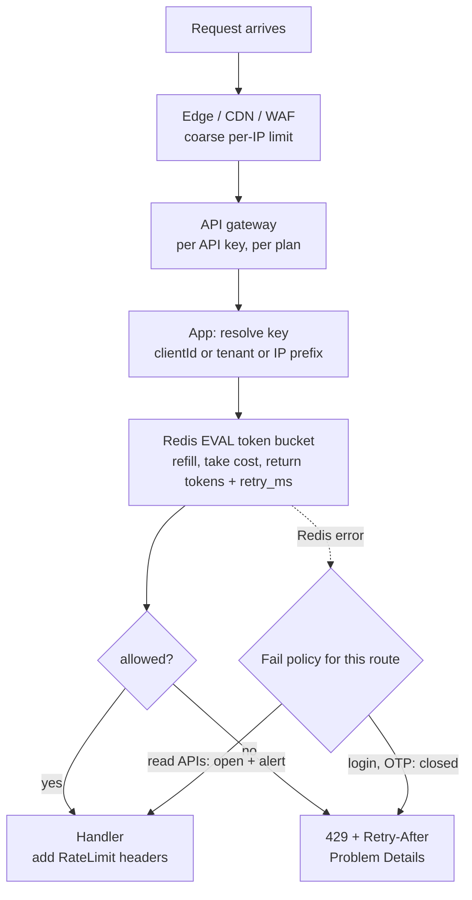

## Bối cảnh & vấn đề

Một API public có limiter tự viết, test ở máy dev rất ổn: gửi 101 request trong một phút thì request thứ 101 nhận `429`.

```ts
const hits = new Map<string, { count: number; resetAt: number }>();

export function rateLimit(limit = 100, windowMs = 60_000) {
  return (req: Request, res: Response, next: NextFunction) => {
    const key = req.ip;
    const now = Date.now();
    const entry = hits.get(key) ?? { count: 0, resetAt: now + windowMs };
    if (now > entry.resetAt) { entry.count = 0; entry.resetAt = now + windowMs; }
    entry.count++;
    hits.set(key, entry);
    if (entry.count > limit) return res.status(429).end();
    next();
  };
}
```

Lên production, dashboard cho thấy một client cào dữ liệu được khoảng **300** request mỗi phút mà không bị chặn. Tuần sau, sau khi đội hạ tầng đổi cấu hình load balancer, điều ngược lại xảy ra: **toàn bộ** người dùng bị `429` cùng lúc vào giờ cao điểm. Và một partner lớn gửi email: "Chúng tôi chỉ gọi 20 request mỗi giây, dưới limit của các anh, sao vẫn bị 429?".

Ba sự cố, một đoạn code. Production chạy 3 pod, mỗi pod có `Map` riêng, nên limit thật là 3 × 100. `req.ip` phụ thuộc hoàn toàn vào cấu hình `trust proxy`: sai một kiểu thì mọi người chung một IP (IP của load balancer), sai kiểu khác thì client tự khai IP qua `X-Forwarded-For`. Fixed window cho phép burst gấp đôi ở ranh giới phút. Không có `Retry-After` nên client retry ngay lập tức. Bài này đi qua từng mảnh: key, thuật toán, trạng thái phân tán, header, và quy trình điều tra.

**Interview angle:** câu debug này có ít nhất bốn bug; interviewer chấm theo số bug bạn tìm được và việc bạn có nhắc tới `trust proxy` hay không.

## Khái niệm

### Rate limiting và mục đích

**Rate limiting** giới hạn số request (hoặc tổng "chi phí") mà một **key** được thực hiện trong một khoảng thời gian. Nó phục vụ ba mục đích khác nhau, và mỗi mục đích dẫn tới thiết kế khác nhau: **bảo vệ hệ thống** khỏi quá tải (một client không được chiếm hết tài nguyên), **công bằng giữa các tenant** (noisy neighbour), và **thương mại** (quota theo gói free/pro/enterprise). Rate limiting cũng làm chậm tấn công brute-force vào login hay OTP, nhưng nó không phải là công cụ chống DDoS lớn: việc đó thuộc về tầng edge (CDN, WAF).

Rate limit khác **quota**: quota là tổng lượng dùng trong kỳ dài (100.000 request mỗi tháng), rate limit là tốc độ ngắn hạn (50 request mỗi giây). Một gói dịch vụ thường có cả hai.

### Key: giới hạn theo ai

**Key** quyết định "ai" bị đếm. Các lựa chọn:

- **IP**: cho request chưa xác thực (trang login, đăng ký). Yếu với NAT: cả một công ty hoặc một nhà mạng di động (CGNAT) có thể chung một IP, và IPv6 cho mỗi người dùng cả một dải địa chỉ (nên key theo prefix `/64` thay vì từng địa chỉ).
- **User ID / API key / client ID**: sau khi xác thực, đây là key công bằng và chính xác nhất.
- **Tenant**: bảo vệ công bằng giữa các khách hàng B2B, thường kết hợp với limit theo user bên trong tenant.
- **Route**: login, OTP, reset password có limit chặt hơn nhiều so với đọc catalog; endpoint đắt (export, search) có limit riêng.
- **Kết hợp**: `(tenant, route)`, `(IP, username)` cho login (chống thử mật khẩu trên nhiều tài khoản và nhiều mật khẩu trên một tài khoản).

Ví dụ: `key = req.auth?.clientId ?? "ip:" + ipPrefix(req.ip)`.

### Fixed window

**Fixed window** chia thời gian thành các cửa sổ cố định (mỗi phút tròn) và đếm request trong cửa sổ hiện tại: Redis `INCR rl:{key}:{minute}` rồi `EXPIRE`. Rẻ, đơn giản, một counter mỗi key. Nhược điểm lớn: **burst gấp đôi** ở ranh giới. Client gửi 100 request lúc 00:59,9 và 100 request lúc 01:00,1 đều được phép, vì chúng nằm ở hai cửa sổ khác nhau: 200 request trong 200 ms với limit "100 mỗi phút".

### Sliding window log và sliding window counter

**Sliding window log** lưu timestamp của từng request (Redis sorted set), mỗi lần kiểm tra thì xoá timestamp cũ hơn một cửa sổ và đếm phần còn lại. Chính xác tuyệt đối, nhưng tốn bộ nhớ tỷ lệ với số request (limit 10.000 mỗi giờ nghĩa là tới 10.000 phần tử mỗi key).

**Sliding window counter** là xấp xỉ rẻ: giữ counter của cửa sổ hiện tại và cửa sổ trước, và ước lượng số request trong một cửa sổ trượt bằng nội suy: `estimate = prev × (1 − elapsed/window) + current`. Chỉ hai counter mỗi key, sai số nhỏ khi traffic đều. Cloudflare mô tả dùng cách này ở quy mô rất lớn.

### Token bucket và leaky bucket

**Token bucket**: mỗi key có một "xô" dung lượng `B` token, được nạp thêm `r` token mỗi giây (không vượt quá `B`). Mỗi request lấy một token (hoặc nhiều token nếu đắt); hết token thì bị từ chối. Kết quả: tốc độ trung bình dài hạn là `r`, nhưng cho phép **burst có kiểm soát** tới `B`. Đây là mô hình phổ biến nhất cho API vì nó khớp với hành vi thật của client (đồng bộ một lô rồi nghỉ), và "retry sau bao lâu" tính được chính xác: `(cost − tokens) / r`. Chỉ cần lưu hai giá trị mỗi key: số token và thời điểm cập nhật cuối.

**Leaky bucket**: request vào một hàng đợi có dung lượng giới hạn, và được "xả" ra với tốc độ cố định. Kết quả là output **đều**, nhưng request phải chờ trong hàng (thêm latency). nginx `limit_req` hoạt động theo mô hình này: `rate=10r/s burst=20` cho phép 20 request xếp hàng, `nodelay` cho chúng đi ngay thay vì bị làm chậm.

### Trạng thái phân tán và tính nguyên tử

Khi có nhiều instance, counter phải ở **một nơi chung**: Redis, hoặc API gateway. Nhưng chỉ chuyển sang Redis chưa đủ: logic "đọc số token, tính, ghi lại" bằng `GET` rồi `SET` là race condition, vì hai instance có thể cùng đọc "còn 1 token" và cùng cho qua. Redis chạy một **Lua script** như một đơn vị nguyên tử (không lệnh nào khác xen vào giữa), nên toàn bộ phép tính token bucket nằm trong một `EVAL`. Fixed window thì không cần Lua vì `INCR` vốn nguyên tử.

### 429, Retry-After và RateLimit header

Khi bị giới hạn, server trả **`429 Too Many Requests`** (RFC 6585) kèm **`Retry-After`** (RFC 9110): số giây, hoặc một HTTP-date. Header này biến client "retry ngay lập tức" thành "retry đúng lúc", và là tín hiệu duy nhất đa số thư viện HTTP hiểu.

Để client **chủ động** giảm tốc trước khi bị chặn, API có thể trả quota còn lại trên mọi response. Nhiều API dùng `X-RateLimit-Limit`, `X-RateLimit-Remaining`, `X-RateLimit-Reset` (không chuẩn). IETF đang chuẩn hoá `RateLimit-Policy` và `RateLimit` (draft; format đã thay đổi qua các bản draft, verify trước khi dựa vào). Ví dụ theo draft-8 mà express-rate-limit 8 tạo ra: `RateLimit: "5-in-1min"; r=0; t=60`, nghĩa là policy "5 mỗi phút", còn 0, reset sau 60 giây.

**Interview angle:** interviewer thường hỏi "Redis sập thì limiter fail open hay fail closed?". Câu trả lời tốt: tuỳ mục đích. Limiter bảo vệ login/OTP nên fail closed (hoặc chuyển sang limit in-memory chặt), limiter công bằng cho API đọc thường fail open kèm alert, vì chặn toàn bộ khách hàng vì Redis lỗi là tự gây sự cố.

## Cơ chế hoạt động



Diễn giải. Rate limiting tốt được đặt ở **nhiều tầng**. Tầng edge rẻ nhất, chặn traffic rác theo IP trước khi nó tới hạ tầng của bạn. Gateway giới hạn theo API key và theo gói dịch vụ, không cần code. Tầng app hiểu nghiệp vụ nhất: tenant, route đắt, chi phí theo loại request, nên nó là nơi áp logic chi tiết. Ở tầng app, bước đầu tiên là **xác định key** đúng (sau khi đã xác thực thì dùng client ID, chưa thì dùng IP đã được xác định đúng qua `trust proxy`). Bước thứ hai là một lệnh `EVAL` duy nhất tới Redis: script nạp token theo thời gian đã trôi qua, trừ chi phí nếu đủ, và trả về số token còn lại cùng thời gian cần chờ. Kết quả quyết định request đi tiếp (kèm header quota) hay nhận `429` với `Retry-After` chính xác. Nhánh lỗi Redis không bị bỏ quên: mỗi route có chính sách fail riêng.

## Ví dụ thực tế

### Fixed window vs sliding window counter ở ranh giới

Chạy thật (Node 24.21): limit 100 mỗi phút, client gửi 100 request tại giây 59,9 và 100 request tại giây 60,1.

```ts
function fixedWindow(limit: number, windowMs: number) {
  const m = new Map<string, number>();
  return (key: string, now: number) => {
    const k = `${key}:${Math.floor(now / windowMs)}`;
    const c = (m.get(k) ?? 0) + 1; m.set(k, c);
    return c <= limit;
  };
}
function slidingCounter(limit: number, windowMs: number) {
  const m = new Map<string, number>();
  return (key: string, now: number) => {
    const w = Math.floor(now / windowMs);
    const cur = m.get(`${key}:${w}`) ?? 0, prev = m.get(`${key}:${w - 1}`) ?? 0;
    const est = prev * (1 - (now % windowMs) / windowMs) + cur;
    if (est + 1 > limit) return false;
    m.set(`${key}:${w}`, cur + 1);
    return true;
  };
}
```

```text
fixed window, 200 requests within 200 ms across the boundary -> allowed 200
sliding window counter, same traffic -> allowed 100
```

Fixed window cho qua cả 200 request trong 200 ms. Sliding window counter nhận ra rằng 100 request của cửa sổ trước vẫn gần như "còn tính" (mới trôi qua 0,1 giây của cửa sổ mới) và chặn toàn bộ loạt thứ hai.

### Token bucket nguyên tử bằng Redis Lua

Chạy thật với ioredis-mock 8.13 (chạy Lua bằng một Lua VM viết bằng JS; với Redis thật, script y hệt chạy qua `EVALSHA`):

```lua
local key = KEYS[1]
local capacity = tonumber(ARGV[1])
local rate = tonumber(ARGV[2])      -- tokens per second
local now = tonumber(ARGV[3])       -- ms
local cost = tonumber(ARGV[4])
local b = redis.call('HMGET', key, 'tokens', 'ts')
local tokens = tonumber(b[1]) or capacity
local ts = tonumber(b[2]) or now
tokens = math.min(capacity, tokens + (now - ts) / 1000 * rate)
local allowed = 0
local retry_ms = 0
if tokens >= cost then tokens = tokens - cost allowed = 1
else retry_ms = math.ceil((cost - tokens) / rate * 1000) end
redis.call('HSET', key, 'tokens', tokens, 'ts', now)
redis.call('PEXPIRE', key, math.ceil(capacity / rate * 1000) + 1000)
return { allowed, math.floor(tokens), retry_ms }
```

```ts
redis.defineCommand("takeToken", { numberOfKeys: 1, lua: LUA });
// capacity 10, 5 tokens/s, 12 requests 10 ms apart, then one more 1 s later
const [allowed, left, retryMs] = await redis.takeToken("rl:tenant:7", 10, 5, now, 1);
```

Output thật:

```text
token bucket cap=10 rate=5/s, 12 req in 110 ms: ok(9) ok(8) ok(7) ok(6) ok(5) ok(4) ok(3) ok(2) ok(1) ok(0) 429 retry=100ms 429 retry=90ms
1 s later: ok(4)
GET-then-SET with 1 token left, 3 concurrent callers -> 3 allowed
```

Burst 10 request đầu được phép (dung lượng xô), request thứ 11 và 12 bị từ chối với thời gian chờ chính xác để gửi thẳng vào `Retry-After` (làm tròn lên thành giây). Một giây sau, xô đã nạp thêm khoảng 5 token. Dòng cuối là mô phỏng phiên bản **không nguyên tử** (đọc, `await`, ghi): với chỉ 1 token còn lại, cả 3 caller đồng thời đều được cho qua. Đó là lý do phải dùng Lua (hoặc `INCR` nguyên tử cho fixed window). `now` nên lấy từ `redis.call('TIME')` bên trong script nếu đồng hồ các instance có thể lệch nhau; ở đây truyền từ ngoài để ví dụ có tính xác định.

### Tái hiện ba bug của limiter với express-rate-limit

Chạy thật với Express 5.2.1 và express-rate-limit 8.7.0, limit 5 mỗi phút, store mặc định (in-memory), 12 request round-robin qua N instance:

```ts
app.set("trust proxy", trustProxy);          // varies per scenario
app.use(rateLimit({ windowMs: 60_000, limit: 5, standardHeaders: "draft-8", legacyHeaders: false }));
```

```text
1 instance, limit 5                          200 200 200 200 200 429 429 429 429 429 429 429 | req.ip=::1 | RateLimit: "5-in-1min"; r=0; t=60
3 instances (in-memory store), limit 5       200 200 200 200 200 200 200 200 200 200 200 200 | req.ip=::1 | RateLimit: "5-in-1min"; r=1; t=60
ValidationError: The Express 'trust proxy' setting is true, which allows anyone to trivially bypass IP-based rate limiting. ...
  code: 'ERR_ERL_PERMISSIVE_TRUST_PROXY',
trust proxy=true, client spoofs XFF          200 200 200 200 200 200 200 200 200 200 200 200 | req.ip=203.0.113.11 | RateLimit: "5-in-1min"; r=4; t=60
trust proxy=1, LB appends real IP            200 200 200 200 200 429 429 429 429 429 429 429 | req.ip=198.51.100.7 | RateLimit: "5-in-1min"; r=0; t=60
```

Đọc kết quả:

- **3 instance, store in-memory**: 12 request đều qua (mỗi instance chỉ thấy 4). Limit thật là 3 × 5. Đây chính là bug "3 lần limit" ở production.
- **`trust proxy = true`**: Express lấy IP **trái nhất** trong `X-Forwarded-For`, là giá trị client tự đặt. Client đổi header mỗi request và không bao giờ bị chặn. express-rate-limit 8 phát hiện cấu hình này và in `ERR_ERL_PERMISSIVE_TRUST_PROXY`.
- **`trust proxy = 1`** (tin đúng một hop là load balancer của bạn): Express lấy địa chỉ mà LB gắn vào cuối header (`198.51.100.7`), bỏ qua phần client giả mạo, và limit hoạt động đúng.
- Trường hợp ngược lại (không đặt `trust proxy` khi đứng sau LB): `req.ip` là IP của LB cho **mọi** người dùng, tất cả chung một key, và cả hệ thống bị `429` cùng lúc. Đó là sự cố thứ hai trong phần bối cảnh.

Bản sửa hoàn chỉnh của limiter ban đầu: store chung (Redis, dùng `rate-limit-redis` hoặc script Lua ở trên), key theo client ID khi đã xác thực, `trust proxy` đúng số hop, sliding window hoặc token bucket, `Retry-After` trên `429`, và TTL cho key để không rò bộ nhớ (`Map` gốc không bao giờ xoá IP cũ).

### Điều tra: partner "dưới limit" vẫn bị 429

1. **Tầng nào trả 429?** Xem header và body: `429` từ CDN/WAF có format khác `429` từ app. Kiểm tra cả trường hợp app đang **chuyển tiếp** `429` của một dịch vụ bên thứ ba.
2. **Key là gì?** Nếu limit theo IP và partner đi ra internet qua một NAT dùng chung cho nhiều hệ thống của họ, tất cả chung một key. Nếu partner dùng một API key cho năm service nội bộ, "20 request mỗi giây" của một service không phải là tổng.
3. **Thuật toán và đơn vị**: partner đo trung bình theo phút (20/giây = 1.200/phút), limiter là token bucket dung lượng nhỏ hoặc fixed window theo giây; burst đầu mỗi phút vượt limit dù trung bình thấp.
4. **Retry storm**: log cho thấy sau `429` đầu tiên, partner retry ngay lập tức không backoff, tự đẩy mình vượt limit liên tục.
5. **Nhiều region**: counter riêng theo region, hoặc lệch đồng hồ giữa các node làm cửa sổ lệch nhau.
6. **Hành động**: trả header quota trên mọi response, dashboard theo API key, limit theo client/plan thay vì IP, document rõ thuật toán và burst, gợi ý partner dùng exponential backoff theo `Retry-After`.

## Trade-offs & lựa chọn thay thế

| Thuật toán | Bộ nhớ mỗi key | Burst | Độ chính xác | Ghi chú |
| --- | --- | --- | --- | --- |
| Fixed window | 1 counter | Gấp đôi ở ranh giới | Thấp ở ranh giới | `INCR` + `EXPIRE`, đơn giản nhất |
| Sliding window log | N timestamp | Không | Chính xác | Tốn bộ nhớ với limit lớn |
| Sliding window counter | 2 counter | Nhỏ | Xấp xỉ tốt | Phổ biến ở quy mô lớn |
| Token bucket | 2 giá trị | Có kiểm soát (≤ B) | Chính xác theo mô hình | Hợp API; hỗ trợ cost khác nhau; cần Lua |
| Leaky bucket (queue) | Hàng đợi | Được làm mượt | Chính xác | Thêm latency; hợp bảo vệ downstream nhạy cảm |

| Tầng đặt limiter | Ưu | Nhược |
| --- | --- | --- |
| Edge/CDN/WAF | Rẻ, chặn sớm, chịu được flood | Chỉ biết IP, header; khó theo nghiệp vụ |
| API gateway (Kong, AWS API Gateway) | Theo API key/plan, không cần code | Logic phức tạp khó; thêm chi phí |
| Reverse proxy (nginx `limit_req`) | Rất nhanh | Mỗi instance nginx đếm riêng nếu không có shared zone giữa máy |
| App + Redis | Theo tenant, route, cost; linh hoạt | Thêm một round-trip Redis mỗi request; phụ thuộc Redis |

Khi nào chọn cái nào. Mặc định cho API: token bucket ở tầng app (hoặc gateway) theo client/tenant, cộng limit theo IP thô ở edge. Fixed window đủ tốt cho quota dài (theo ngày, theo tháng) nơi burst ở ranh giới không đáng kể. Leaky bucket (xếp hàng) hợp khi bảo vệ một downstream không chịu được burst (API của đối tác có limit cứng). Cho endpoint đắt, dùng **cost-based** limit: search tốn 5 token, export tốn 50.

## Edge cases & failure modes

- **Redis chậm hoặc sập**: mỗi request thêm một round-trip; Redis chậm là API chậm. Đặt timeout ngắn (vài ms) cho lệnh limiter và chính sách fail theo route; cân nhắc limiter in-memory làm lớp dự phòng với limit chia theo số instance.
- **Hot key**: một tenant rất lớn dồn mọi request vào một key trên một shard Redis. Chia key theo route hoặc dùng local token bucket trước, đồng bộ về Redis theo lô.
- **Lệch đồng hồ**: dùng thời gian của Redis (`TIME` trong script) thay vì của từng instance.
- **Retry storm sau 429**: client retry ngay, không backoff, làm tổng traffic tăng. `Retry-After` + jitter phía client; server có thể tăng thời gian chờ cho key vi phạm liên tục.
- **NAT và CGNAT**: limit theo IP chặn cả văn phòng hoặc người dùng di động chung IP. Sau khi xác thực, luôn key theo client/user.
- **IPv6**: mỗi request có thể đến từ một địa chỉ khác trong cùng dải; key theo prefix (`/64` hoặc `/56`).
- **Header quota lộ thông tin**: trên endpoint login, `Remaining: 2` cho attacker biết cần đổi IP sau bao nhiêu lần. Chỉ trả header quota cho API đã xác thực.
- **Cost thay đổi sau khi xử lý**: một query search chỉ biết chi phí thật sau khi chạy; trừ trước theo ước lượng và điều chỉnh sau.

## Pitfalls

- ❌ Counter in-memory khi chạy nhiều instance → ✅ store chung (Redis) hoặc gateway, vì limit thật bằng N × limit.
- ❌ `app.set('trust proxy', true)` → ✅ đúng số hop (`1`) hoặc danh sách IP của proxy, vì `true` cho client tự khai IP.
- ❌ Không đặt `trust proxy` sau load balancer → ✅ đặt đúng, nếu không mọi người chung IP của LB.
- ❌ `GET` rồi `SET` trong Redis → ✅ Lua script hoặc lệnh nguyên tử (`INCR`).
- ❌ `429` không có `Retry-After` → ✅ luôn có, tính từ thời gian chờ thật của token bucket.
- ❌ Limit theo IP sau khi đã xác thực → ✅ theo client ID, user hoặc tenant.
- ❌ `catch` mọi lỗi của limiter thành `429` → ✅ phân biệt "bị giới hạn" với "Redis lỗi" và áp chính sách fail theo route.
- ❌ Một limit cho mọi route → ✅ login/OTP chặt, đọc nới hơn, endpoint đắt theo cost.

## Tóm tắt

- Rate limit theo **key** (IP, client, user, tenant, route, kết hợp); sau xác thực thì không key theo IP.
- Fixed window rẻ nhưng burst gấp đôi ở ranh giới (đo thật: 200/200 request qua); sliding window counter chặn đúng (100/200).
- Token bucket: dung lượng B, nạp r/giây, burst có kiểm soát, tính được `Retry-After` chính xác; leaky bucket làm mượt output.
- Nhiều instance cần store chung và thao tác nguyên tử (Lua); `GET`-then-`SET` cho qua tất cả caller đồng thời.
- `req.ip` phụ thuộc `trust proxy`: `true` cho phép giả mạo, thiếu thì mọi người chung IP của LB; đặt đúng số hop.
- `429` + `Retry-After`; header quota (`X-RateLimit-*` hoặc draft IETF `RateLimit`) cho client đã xác thực.
- Điều tra 429: tầng nào, key nào, thuật toán và đơn vị, retry storm, region; sửa bằng limit theo client và header minh bạch.
