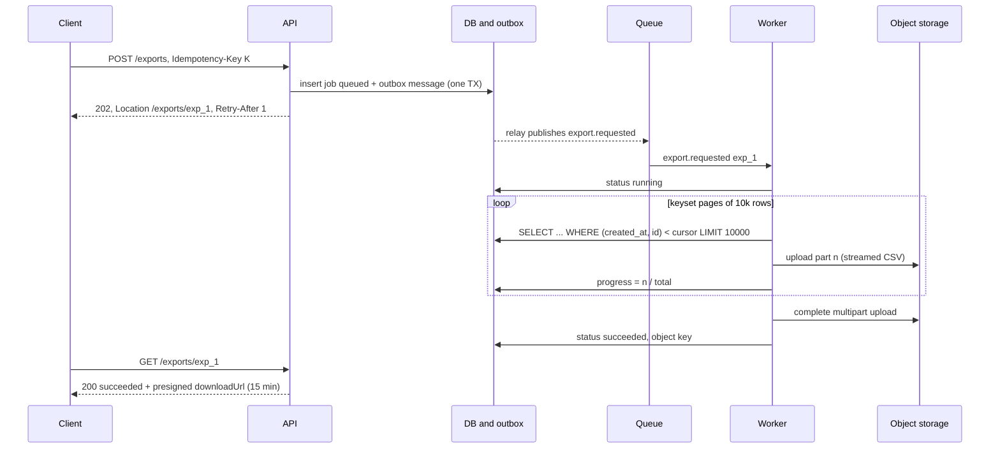

## Bối cảnh & vấn đề

Ba tính năng, ba lần API "treo" theo ba cách khác nhau.

Retailer bấm "Xuất 2 triệu đơn ra CSV". Endpoint `GET /orders/export.csv` chạy query, dựng file trong RAM rồi trả về. Sau 60 giây, load balancer cắt kết nối (`504`), nhưng query vẫn chạy ở server; người dùng bấm lại, rồi lại bấm, và năm export giống hệt nhau cùng đọc hàng triệu row, pod hết bộ nhớ và bị kill.

Tích hợp ERP gọi `PUT /products/prices` với 10.000 sản phẩm. Sản phẩm thứ 7.312 có giá âm, transaction rollback toàn bộ, API trả `500` chung chung. ERP không biết item nào hỏng, không biết có item nào đã được áp dụng không, nên gửi lại cả 10.000, và lại hỏng.

Ứng dụng cho khách upload hoá đơn PDF qua `POST /invoices` dạng multipart. Một người upload file 2 GB qua mạng chậm, giữ một worker và vài trăm MB RAM trong 20 phút; vài người như vậy cùng lúc là API ngừng phục vụ các request khác.

Điểm chung: HTTP request-response đồng bộ hợp với việc **ngắn và nhỏ**. Việc dài, việc lớn và dữ liệu lớn cần mô hình khác: tách "nhận yêu cầu" khỏi "thực hiện", báo kết quả từng phần, và để dữ liệu lớn đi thẳng tới nơi lưu trữ mà không qua API. Bài này đi qua ba mô hình đó: **long-running operation**, **bulk operation** và **direct-to-storage upload**.

**Interview angle:** interviewer muốn nghe bạn đổi câu hỏi "làm sao request chạy nhanh hơn" thành "request này có nên đồng bộ không", rồi thiết kế đủ vòng đời: tạo, theo dõi, huỷ, thất bại, dọn dẹp.

## Khái niệm

### 202 Accepted và job resource

**`202 Accepted`** nghĩa là "server đã nhận yêu cầu, nhưng chưa xử lý xong, và có thể sẽ không bao giờ thành công". RFC 9110 không quy định cách client biết kết quả; quy ước phổ biến (Google AIP-151, Microsoft guidelines) là tạo một **job resource** (còn gọi là operation) đại diện cho công việc, trả URL của nó trong `Location`, và client theo dõi resource đó.

```text
POST /exports                         { "type": "orders", "filter": { "createdFrom": "2026-01-01" } }
202 Accepted
Location: /exports/exp_1
Retry-After: 1
{ "id": "exp_1", "status": "queued", "progress": 0 }
```

Job resource có vòng đời rõ ràng: `queued → running → succeeded | failed | cancelled`, kèm `progress`, `createdAt`, `completedAt`, và khi xong thì `result` (ví dụ `downloadUrl`) hoặc `error` (Problem Details). Vì tạo job là `POST`, nó nên nhận `Idempotency-Key` ([bài 3](/tracks/api-design/learn/idempotency)) để người dùng bấm lại không tạo job trùng.

### Thông báo kết quả: polling, webhook, SSE

**Polling**: client `GET /exports/exp_1` định kỳ; server trả `Retry-After` để gợi ý khoảng chờ. Đơn giản nhất, qua mọi proxy, và client kiểm soát được. **Webhook**: server gọi URL của client khi job xong; hợp với tích hợp server-to-server ([bài 10](/tracks/api-design/learn/webhooks-realtime)). **SSE/WebSocket**: đẩy tiến độ realtime cho UI. **Email**: cho export mà người dùng không ngồi chờ. Các cách này bổ sung cho nhau: job resource luôn là nguồn sự thật, thông báo chỉ là "hãy đi xem".

### Worker, streaming và kết quả trên object storage

Phía server, `POST /exports` chỉ ghi job vào database (hoặc outbox) và đẩy message vào queue; **worker** riêng xử lý. Worker đọc dữ liệu theo **keyset pagination** hoặc cursor của database ([bài 4](/tracks/api-design/learn/pagination-filtering)), ghi CSV theo **stream** lên object storage (S3 multipart upload), không bao giờ giữ toàn bộ file trong RAM. Kết quả trả về dạng **presigned URL** có hạn (ví dụ 15 phút), để file đi thẳng từ S3 tới người dùng.

Cần **quota và concurrency theo tenant**: mỗi tenant tối đa 2 export đang chạy, để một khách không chiếm hết worker của mọi khách khác.

### Bulk operation: all-or-nothing hay best-effort

**Bulk operation** áp dụng một thao tác lên nhiều item trong một request. Quyết định quan trọng nhất là **ngữ nghĩa khi một phần thất bại**, và phải được chọn rõ ràng trong contract:

- **All-or-nothing** (atomic): mọi item trong một transaction; một item lỗi thì không item nào được áp dụng. Response lỗi (`422`) liệt kê **mọi** item sai để client sửa hết trong một lần. Đơn giản cho client suy luận, nhưng giới hạn kích thước (transaction dài giữ lock lâu).
- **Best-effort** (partial): mỗi item độc lập; response `200` (hoặc body theo phong cách `207 Multi-Status`) chứa kết quả **từng item**: `index`, `id`, `status`, `error`, cùng tổng `succeeded`/`failed`. Client retry đúng những item lỗi.

Cách sai là trộn hai ngữ nghĩa: vài item được áp dụng rồi dừng ở lỗi đầu tiên, và trả một `500` không nói gì. Client không có cách nào biết state hiện tại.

Kích thước quyết định đồng bộ hay không: vài chục tới vài trăm item có thể đồng bộ; hàng nghìn tới hàng chục nghìn item nên là **bulk job** (`202` + job resource có `results` phân trang). Bulk cũng cần idempotency ở hai mức: key cho cả batch, và ID tự nhiên cho từng item (`PUT` giá theo `productId` là idempotent), để retry phần lỗi an toàn.

### Upload qua server vs presigned URL

**Multipart qua API server**: client gửi file trong `multipart/form-data` tới API, API xử lý rồi ghi vào storage. Đơn giản và validate được ngay, nhưng file đi qua API: tốn băng thông, CPU, RAM, giữ connection lâu, và là bề mặt DoS (file lớn, upload chậm). Giới hạn kích thước ở mọi tầng (proxy `client_max_body_size`, body parser, `multer` limits) là bắt buộc.

**Presigned URL**: API không nhận file. Luồng là: client xin phép upload (`POST /uploads` với tên, kích thước, loại), API kiểm tra quyền và quota, tạo **object key do server chọn** (có tenant prefix), trả một URL đã ký có hạn (vài phút); client upload thẳng lên S3; rồi client báo hoàn tất (`POST /uploads/{id}/complete`) hoặc server nhận event từ S3; lúc đó API mới kiểm tra object và gắn nó vào entity.

Với S3 có hai dạng. **Presigned PUT URL** chỉ ký những header được chỉ định; mặc định chỉ `host`, nên nó **không** giới hạn kích thước hay `Content-Type` trừ khi bạn ký thêm. **Presigned POST** (browser-based upload) có **policy** với điều kiện như `content-length-range` và `Content-Type` cố định, nên S3 tự từ chối file vượt kích thước. File lớn (hàng trăm MB trở lên) dùng **multipart upload** của S3: chia thành part, upload song song, resume được.

**Interview angle:** follow-up là "dọn object upload rồi nhưng không confirm thế nào?": upload vào prefix tạm (`incoming/`), lifecycle rule xoá sau 1 ngày, và lifecycle rule abort incomplete multipart upload.

## Cơ chế hoạt động



Diễn giải. API chỉ làm hai việc nhanh: ghi job cùng một message outbox trong **một transaction** (để không bao giờ có job mà không có message, hay ngược lại), và trả `202` với `Location`. Một relay đẩy message vào queue. Worker nhận message, đánh dấu `running`, rồi lặp: đọc một trang dữ liệu bằng keyset, chuyển sang CSV, upload thành một part của S3 multipart upload, cập nhật tiến độ. Bộ nhớ của worker chỉ chứa một trang tại một thời điểm, bất kể export có 2 triệu hay 200 triệu row. Khi xong, worker hoàn tất multipart upload và ghi object key. Client poll job resource; khi `succeeded`, API tạo presigned download URL mới (không lưu URL đã ký lâu dài, vì nó hết hạn).

Huỷ là một transition: `POST /exports/exp_1/cancel` đặt cờ `cancel_requested`; worker kiểm tra cờ giữa các trang, dừng, `AbortMultipartUpload` để xoá các part đã upload, và chuyển job sang `cancelled`.

## Ví dụ thực tế

### Job resource với 202 và polling

Chạy thật (Node 24.21, `node:http`; "worker" mô phỏng bằng timer tăng tiến độ 40% mỗi 30 ms):

```ts
if (req.method === "POST" && req.url === "/exports") {
  const job = { id: `exp_${++seq}`, status: "queued", progress: 0 };
  jobs.set(job.id, job);
  enqueue(job);                           // worker updates status/progress/downloadUrl
  return send(202, job, { location: `/exports/${job.id}`, "retry-after": "1" });
}
const job = jobs.get(id);
return send(200, job, job.status === "succeeded" ? {} : { "retry-after": "1" });
```

Output thật:

```text
POST /exports -> 202 Location: /exports/exp_1 Retry-After: 1 {"id":"exp_1","status":"queued","progress":0}
GET /exports/exp_1 -> 200 {"id":"exp_1","status":"running","progress":40}
GET /exports/exp_1 -> 200 {"id":"exp_1","status":"running","progress":80}
GET /exports/exp_1 -> 200 {"id":"exp_1","status":"succeeded","progress":100,"downloadUrl":"https://files.example.com/exp_1.csv?X-Amz-Expires=900&..."}
```

Để ý: `GET` trên job resource trả `200` kể cả khi job **thất bại**; request "xem job" đã thành công, còn kết quả của job nằm trong `status` và `error`. Trả `500` cho một job failed sẽ làm client retry việc xem job mãi.

### Bulk update giá: atomic và best-effort bằng SAVEPOINT

Chạy thật trên PGlite 0.5.8 (PostgreSQL 18.3). Bảng `products` có `CHECK (price_minor > 0)`; tenant 7 sở hữu `p1..p3`, `p4` thuộc tenant 8, `p9` không tồn tại. Request cập nhật 5 item, trong đó `p2` có giá âm.

```ts
async function bulk(tenant: number, items: Item[], mode: "atomic" | "best") {
  const results = [];
  try {
    await db.transaction(async (tx) => {
      for (const [index, it] of items.entries()) {
        await tx.query("SAVEPOINT item");
        try {
          const u = await tx.query(
            "UPDATE products SET price_minor = $3 WHERE id = $1 AND tenant_id = $2", [it.id, tenant, it.priceMinor]);
          if (u.affectedRows === 0) throw Object.assign(new Error("not found"), { code: "not_found" });
          await tx.query("RELEASE SAVEPOINT item");
          results.push({ index, id: it.id, status: "updated" });
        } catch (e) {
          await tx.query("ROLLBACK TO SAVEPOINT item");
          results.push({ index, id: it.id, status: "failed",
            error: e.code === "23514" ? "price_must_be_positive" : e.code ?? e.message });
          if (mode === "atomic") throw new Error("abort");   // roll back the whole transaction
        }
      }
    });
  } catch (e) { if (e.message !== "abort") throw e; return { status: 422, results }; }
  return { status: 200, succeeded: results.filter((x) => x.status === "updated").length,
           failed: results.filter((x) => x.status === "failed").length, results };
}
```

Output thật:

```text
atomic: {"status":422,"results":[{"index":0,"id":"p1","status":"updated"},{"index":1,"id":"p2","status":"failed","error":"price_must_be_positive"}]}
prices after atomic: p1=1000 p2=2000 p3=3000 p4=4000
best-effort: {"status":200,"succeeded":2,"failed":3,"results":[{"index":0,"id":"p1","status":"updated"},{"index":1,"id":"p2","status":"failed","error":"price_must_be_positive"},{"index":2,"id":"p3","status":"updated"},{"index":3,"id":"p4","status":"failed","error":"not_found"},{"index":4,"id":"p9","status":"failed","error":"not_found"}]}
prices after best-effort: p1=1100 p2=2000 p3=3300 p4=4000
```

Chế độ atomic rollback toàn bộ: `p1` được báo "updated" trong kết quả nhưng giá thật vẫn là 1000. Đây là một bug trình bày nhỏ mà ví dụ cố ý để lộ: ở chế độ atomic, response nên nói rõ "không item nào được áp dụng" và tốt hơn là **validate toàn bộ trước** rồi trả **mọi** lỗi (ở đây nó dừng ở lỗi đầu tiên và không báo `p4`, `p9`). Chế độ best-effort dùng `SAVEPOINT` để mỗi item thất bại chỉ rollback chính nó: `p1` và `p3` được cập nhật, ba item còn lại có lý do lỗi riêng. Để ý `p4` của tenant 8 được báo `not_found`, không phải `forbidden`, theo quy tắc không lộ resource của tenant khác. Với 10.000 item, cùng logic chạy trong worker, commit theo chunk (ví dụ 500 item mỗi transaction) để không giữ lock lâu, và kết quả từng item được lưu để client đọc qua `GET /bulk-jobs/{id}/results?after=...`.

### Presigned PUT và presigned POST với AWS SDK v3

Chạy thật với `@aws-sdk/client-s3` 3.1143.0; ký offline bằng credential giả (không gọi mạng, chữ ký rút gọn):

```ts
const key = `tenants/${tenantId}/uploads/2026/09/30/${uuid}-invoice.pdf`;   // server chooses the key
const put = await getSignedUrl(s3, new PutObjectCommand({ Bucket: "acme-uploads", Key: key, ContentType: "application/pdf" }), { expiresIn: 300 });

const post = await createPresignedPost(s3, {
  Bucket: "acme-uploads", Key: key, Expires: 300,
  Conditions: [["content-length-range", 1, 10 * 1024 * 1024], ["eq", "$Content-Type", "application/pdf"]],
  Fields: { "Content-Type": "application/pdf" },
});
```

```text
presigned PUT: https://acme-uploads.s3.ap-southeast-1.amazonaws.com/tenants/7/uploads/2026/09/30/0192f3a4-invoice.pdf?X-Amz-Algorithm=AWS4-HMAC-SHA256&X-Amz-Content-Sha256=UNSIGNED-PAYLOAD&X-Amz-Credential=<...>&X-Amz-Date=20260930T022201Z&X-Amz-Expires=300&X-Amz-Signature=<64 hex>&X-Amz-SignedHeaders=host&x-amz-checksum-crc32=AAAAAA%3D%3D&x-amz-sdk-checksum-algorithm=CRC32&x-id=PutObject
presigned POST url: https://acme-uploads.s3.ap-southeast-1.amazonaws.com/ | fields: Content-Type, bucket, X-Amz-Algorithm, X-Amz-Credential, X-Amz-Date, key, Policy, X-Amz-Signature
policy: {"expiration":"2026-09-30T02:27:01Z","conditions":[["content-length-range",1,10485760],["eq","$Content-Type","application/pdf"],{"Content-Type":"application/pdf"},{"bucket":"acme-uploads"},...,{"key":"tenants/7/uploads/2026/09/30/0192f3a4-invoice.pdf"}]}
```

Hai phát hiện từ output thật:

- `X-Amz-SignedHeaders=host`: presigned PUT **không** ký `Content-Type` dù ta truyền `ContentType`, nên client có thể upload bất kỳ loại file nào, kích thước bất kỳ (tới giới hạn của S3). Muốn ép `Content-Type` phải truyền `signableHeaders: new Set(["content-type"])`; muốn giới hạn kích thước thì dùng presigned POST với `content-length-range`, như policy ở trên cho thấy.
- `x-amz-checksum-crc32=AAAAAA%3D%3D`: SDK v3 bản mới mặc định tính checksum (ở đây là CRC32 của body **rỗng**) và nhúng vào URL, nên upload file thật lên URL này có thể bị S3 từ chối vì checksum không khớp. Cấu hình `requestChecksumCalculation: "WHEN_REQUIRED"` trên client làm tham số này biến mất (đã kiểm tra: URL khi đó chỉ còn `X-Amz-SignedHeaders=content-type%3Bhost` khi ký thêm `content-type`). Hành vi này phụ thuộc phiên bản SDK (verify khi nâng cấp).

Sau khi client báo hoàn tất, server `HeadObject` để kiểm tra kích thước thật, đọc vài byte đầu để kiểm tra **magic bytes** (`%PDF-`), không tin `Content-Type` do client khai; quét virus bất đồng bộ; rồi mới chuyển object từ prefix tạm sang prefix chính thức và gắn vào hoá đơn.

## Trade-offs & lựa chọn thay thế

| Tình huống | Đồng bộ | Async job (`202`) | Ghi chú |
| --- | --- | --- | --- |
| Việc < 1–2 giây, kết quả nhỏ | Nên | Thừa | Timeout của LB thường 30–60 giây |
| Export, import, báo cáo lớn | Không | Nên | Stream ra object storage |
| Bulk ≤ ~100 item | Được (atomic hoặc per-item) | Tuỳ | Validate toàn bộ trước |
| Bulk hàng nghìn item | Không | Nên | Kết quả từng item, commit theo chunk |

| Upload | Ưu | Nhược | Khi nào |
| --- | --- | --- | --- |
| Multipart qua API | Đơn giản, validate ngay | Tốn tài nguyên API, DoS, connection dài | File nhỏ (vài MB), số lượng ít |
| Presigned PUT | Đơn giản cho client, không qua API | Không giới hạn size mặc định, chỉ ký `host` | File vừa, client tin cậy (app của bạn) |
| Presigned POST (policy) | Giới hạn size, type ở S3 | Chỉ multipart form, cú pháp phức tạp hơn | Upload từ browser, cần giới hạn cứng |
| S3 multipart upload | File rất lớn, song song, resume | Nhiều bước, phải dọn part dở | Video, backup, file > vài trăm MB |

Khi nào chọn cái nào. Nếu một request có thể vượt vài giây ở p99, hoặc kết quả có thể lớn hơn vài MB, hãy thiết kế nó là job ngay từ đầu; chuyển từ đồng bộ sang async sau này là breaking change. Với bulk, chọn atomic khi các item phụ thuộc nhau (cập nhật một bảng giá phải nhất quán), best-effort khi chúng độc lập (import danh bạ). Với upload, mặc định là presigned POST cho browser và presigned PUT cho client do bạn kiểm soát, chỉ dùng multipart qua API cho file nhỏ cần xử lý ngay.

## Edge cases & failure modes

- **Worker crash giữa export**: message được giao lại (at-least-once), worker mới chạy lại từ đầu hoặc từ checkpoint (cursor cuối cùng đã upload). Multipart upload dở phải được abort; lifecycle rule "abort incomplete multipart upload after N days" là lưới an toàn.
- **Job treo ở `running` mãi**: worker chết mà không cập nhật. Heartbeat (`updated_at`) và job dọn dẹp đánh dấu `failed` khi quá hạn.
- **Polling quá dày**: client poll mỗi 100 ms, tạo tải lớn hơn chính job. `Retry-After` tăng dần, và rate limit riêng cho endpoint job.
- **Presigned URL bị chia sẻ**: ai có URL cũng upload/download được tới khi hết hạn. Giữ thời hạn ngắn, key không đoán được, và download URL tạo lại mỗi lần xem.
- **Object không bao giờ được confirm**: client upload xong rồi đóng app. Upload vào `incoming/`, lifecycle xoá sau 24 giờ; chỉ object đã qua kiểm tra mới được chuyển sang prefix chính.
- **File giả dạng**: `invoice.pdf` thực chất là HTML chứa script; nếu được phục vụ lại từ cùng domain với `Content-Type` sai là XSS. Kiểm tra magic bytes, phục vụ file người dùng từ domain riêng, đặt `Content-Disposition: attachment`.
- **Bulk vượt giới hạn**: 100.000 item trong một request. Giới hạn cứng (ví dụ 10.000), trả `413` hoặc `422` với giới hạn trong body.
- **Huỷ khi job gần xong**: race giữa `cancel` và `succeeded`. Transition phải có điều kiện (`UPDATE jobs SET status = 'cancelled' WHERE id = $1 AND status IN ('queued', 'running')`), và API trả state thật sau đó.

## Pitfalls

- ❌ Giữ HTTP request mở cho export 2 triệu row → ✅ `202` + job resource + worker, vì LB timeout và retry tạo job trùng.
- ❌ Dựng cả file trong RAM → ✅ đọc theo keyset, stream lên S3 bằng multipart upload.
- ❌ `POST /exports` không có idempotency → ✅ nhận `Idempotency-Key`, người dùng bấm lại không tạo job mới.
- ❌ Bulk dừng ở lỗi đầu tiên và trả `500` → ✅ chọn rõ atomic (trả mọi lỗi, không áp dụng gì) hoặc best-effort (kết quả từng item).
- ❌ Client tự chọn object key → ✅ server tạo key có tenant prefix và UUID.
- ❌ Tin presigned PUT giới hạn `Content-Type`/size → ✅ ký thêm header hoặc dùng presigned POST với `content-length-range`.
- ❌ Tin `Content-Type` của file → ✅ kiểm tra magic bytes, scan, phục vụ từ domain riêng.
- ❌ `GET /jobs/{id}` trả `500` khi job thất bại → ✅ `200` với `status: failed` và `error`.

## Tóm tắt

- Việc dài hoặc lớn: `202 Accepted` + `Location` tới job resource (`queued → running → succeeded/failed/cancelled`), client poll với `Retry-After` hoặc nhận webhook/SSE.
- API chỉ ghi job + outbox trong một transaction; worker đọc keyset và stream kết quả ra object storage; kết quả là presigned URL ngắn hạn.
- Quota và concurrency theo tenant cho worker; huỷ là một transition có điều kiện.
- Bulk phải chọn rõ ngữ nghĩa: atomic (`422` với mọi lỗi) hoặc best-effort (`SAVEPOINT`, kết quả từng item, tổng succeeded/failed); bulk lớn là job.
- Upload lớn đi thẳng tới S3: presigned PUT (chỉ ký `host` mặc định) hoặc presigned POST (policy giới hạn size/type); multipart upload cho file rất lớn.
- Sau upload: kiểm tra size, magic bytes, scan virus, chuyển từ prefix tạm; lifecycle rule dọn object không confirm và multipart dở.
