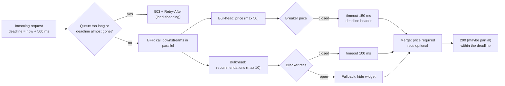

## Bối cảnh & vấn đề

API trang sản phẩm gọi năm downstream: catalog, giá, tồn kho, review, và gợi ý sản phẩm. Một buổi tối, service **gợi ý** (thứ ít quan trọng nhất trên trang) bị chậm: p99 từ 200 ms lên 8 giây vì một cluster Elasticsearch đang reindex. Trong vòng 3 phút, **toàn bộ** API trang sản phẩm trả `504`, rồi tới API giỏ hàng (dùng chung pod), rồi checkout. Đội on-call thấy CPU của API chỉ 15%, nhưng event loop chứa hàng nghìn request đang chờ, connection pool tới các service khác cạn, và health check cũng timeout nên Kubernetes restart pod liên tục.

Không có dòng code nào "sai". HTTP client dùng timeout mặc định (`fetch` của Node không có timeout cho toàn bộ request; undici chỉ có `headersTimeout` và `bodyTimeout` mặc định 300 giây, verify), không có giới hạn số request đồng thời tới từng downstream, và thư viện retry thử lại 3 lần mỗi lỗi. Một dependency chậm đã biến thành sự cố toàn hệ thống: **cascading failure**.

Bài này là bộ công cụ để một dependency chậm chỉ làm hỏng **phần của nó**: timeout, deadline, retry có kiểm soát, circuit breaker, bulkhead, load shedding và fallback. Rồi đi lên một tầng: gateway và BFF đặt những thứ này ở đâu, và làm sao chọn SLO và limit để hứa với client những gì bạn giữ được.

**Interview angle:** câu scenario này có một danh sách "phải có" (timeout, retry có giới hạn, breaker, bulkhead, fallback, shedding); câu trả lời senior giải thích **vì sao** từng cái, và biết timeout phía caller không làm downstream bớt việc.

## Khái niệm

### Timeout và deadline

**Timeout** là thời gian tối đa caller chờ một thao tác. Không có timeout, một downstream treo sẽ giữ tài nguyên của caller (socket, memory, slot trong pool) vô hạn. Timeout phải **ngắn hơn** SLA của chính bạn: nếu API của bạn hứa p99 500 ms, không có call nào bên trong được phép chờ 30 giây.

**Deadline** là một mốc thời gian tuyệt đối cho **toàn bộ** chuỗi xử lý ("request này phải xong trước 10:00:00.500"). Khác với timeout cục bộ ở từng call, deadline được **truyền xuống** (deadline propagation): service A còn 300 ms thì gọi B với deadline còn lại, B gọi C với phần còn lại nữa. gRPC hỗ trợ sẵn (`grpc-timeout` header, deadline tự lan truyền qua context); HTTP phải tự làm bằng header riêng (ví dụ `X-Request-Deadline`) và `AbortSignal`. Không có propagation, downstream tiếp tục làm việc cho một request mà caller đã bỏ từ lâu.

Chọn giá trị timeout: bắt đầu từ latency budget của endpoint (SLO trừ đi phần việc của chính bạn), rồi đối chiếu với p99/p99.9 của downstream khi **khoẻ**. "Đặt bằng p99 của downstream" không phải lúc nào cũng đúng: nếu p99 đó đã lớn hơn budget của bạn thì bạn cần fallback, không phải timeout dài hơn.

### Retry, backoff, jitter và retry budget

**Retry** chữa lỗi thoáng qua (packet loss, một pod restart). Nhưng retry cũng là **khuếch đại tải**: nếu mỗi tầng trong chuỗi ba tầng retry 3 lần, một request của người dùng có thể thành 4 × 4 × 4 = 64 request ở tầng cuối, đúng lúc tầng cuối đang quá tải. Quy tắc:

- Chỉ retry lỗi **retryable** (timeout, connection reset, `502/503/504`, `429` theo `Retry-After`), không retry `4xx` khác.
- Chỉ retry request **idempotent** hoặc có idempotency key ([bài 3](/tracks/api-design/learn/idempotency)).
- **Exponential backoff + jitter**: chờ `random(0, base × 2^attempt)` (full jitter theo AWS) để các client không retry đồng loạt.
- **Retry ở một tầng** (thường là tầng gần người dùng nhất hoặc gần lỗi nhất), không phải mọi tầng.
- **Retry budget**: retry tối đa ví dụ 10% số request thành công gần đây; khi lỗi lan rộng, retry tự tắt.

### Circuit breaker

**Circuit breaker** theo dõi tỷ lệ lỗi của một dependency. Ở trạng thái **closed**, request đi qua bình thường. Khi lỗi vượt ngưỡng (5 lỗi liên tiếp, hoặc 50% trong 10 giây), breaker chuyển sang **open**: mọi request **fail ngay** mà không gọi downstream, trong một khoảng cool-down. Sau cool-down, **half-open**: cho vài request thử; thành công thì về closed, thất bại thì open lại.

Breaker có hai tác dụng: caller không lãng phí thời gian và tài nguyên chờ một dependency đang hỏng (fail fast), và downstream có "khoảng thở" để hồi phục thay vì bị đè thêm tải.

### Bulkhead

**Bulkhead** (vách ngăn tàu thuỷ) giới hạn **tài nguyên dành riêng** cho mỗi dependency: tối đa 10 request đồng thời tới service gợi ý, connection pool riêng cho từng downstream, worker pool riêng cho việc nặng. Khi service gợi ý chậm, nó chỉ chiếm được 10 slot của nó; request tới giá và tồn kho vẫn có tài nguyên. Không có bulkhead, dependency chậm nhất quyết định sức chứa của cả service.

### Load shedding và fallback

**Load shedding** là chủ động từ chối việc khi quá tải, **sớm và rẻ**: nếu hàng đợi nội bộ đã dài quá ngưỡng hoặc request đã chờ quá lâu (deadline sắp hết), trả `503` + `Retry-After` ngay thay vì xử lý một request mà client đã bỏ. Nguyên tắc: phục vụ tốt một phần traffic tốt hơn phục vụ tệ toàn bộ. Có thể shed theo mức ưu tiên: health check và checkout được ưu tiên hơn crawler.

**Fallback** (graceful degradation) là trả kết quả kém hơn nhưng vẫn dùng được khi dependency lỗi: ẩn widget gợi ý, dùng giá từ cache vài phút trước (với cờ `stale`), trả partial response. Mỗi dependency cần được phân loại: **critical** (giá, tồn kho: không có thì không bán được) và **optional** (review, gợi ý: có thể bỏ).

### API gateway và BFF

**API gateway** là hạ tầng chung đứng trước các service: routing, TLS, xác thực token, rate limit, logging, đôi khi retry và timeout. Nó không chứa logic theo màn hình. **BFF** (Backend-for-Frontend, Sam Newman) là một backend **riêng cho từng loại client** (web, mobile, partner): gom nhiều service thành đúng shape màn hình cần, giữ token phía server (session cookie cho SPA), giảm số round-trip qua mạng di động. Next.js Route Handlers hay Server Components thường đóng vai BFF cho web.

BFF là nơi tự nhiên để đặt các pattern resilience theo **màn hình**: gọi song song các downstream, timeout riêng từng cái, fallback cho phần optional. Rủi ro của BFF là logic nghiệp vụ bị nhân bản vào nhiều BFF, và BFF gọi tuần tự nhiều service làm latency cộng dồn.

### SLI, SLO, SLA và limit công khai

**SLI** (indicator) là một con số đo được: tỷ lệ request không lỗi `5xx`, p99 latency của nhóm endpoint. **SLO** (objective) là mục tiêu nội bộ cho SLI: 99,9% request thành công trong 30 ngày, p99 dưới 300 ms. **SLA** (agreement) là cam kết với khách hàng, có hệ quả (hoàn tiền), và luôn **lỏng hơn** SLO để có biên an toàn. **Error budget** là phần còn lại (0,1% của 30 ngày ≈ 43 phút): còn budget thì ship nhanh, hết budget thì ưu tiên ổn định.

Với public API, ngoài SLO cần công bố **limit**: payload tối đa, page size tối đa, rate limit theo gói, timeout phía server, thời gian giữ idempotency key, chính sách retry webhook. Limit phải xuất phát từ **use case của client** (checkout cần p99 thấp, export chấp nhận async) và từ **đo đạc** (load test, dữ liệu beta), không từ khả năng hiện tại của hệ thống.

## Cơ chế hoạt động



Diễn giải. Request vào mang một deadline tính từ SLO của endpoint. Bước đầu tiên là **shedding**: nếu hàng đợi nội bộ quá dài hoặc deadline gần hết, từ chối ngay với `503`, vì xử lý tiếp chỉ tốn tài nguyên cho một response không ai chờ. Nếu tiếp nhận, BFF gọi các downstream **song song** (latency là max, không phải tổng). Mỗi call đi qua ba lớp theo thứ tự: bulkhead (còn slot không, nếu không thì fail ngay), circuit breaker (downstream có đang hỏng không, nếu có thì fail ngay hoặc fallback), rồi timeout cục bộ không vượt quá phần deadline còn lại. Cuối cùng, bước merge biết phần nào **bắt buộc** (thiếu giá thì trả lỗi) và phần nào **tuỳ chọn** (thiếu gợi ý thì trả response thiếu widget). Một dependency chậm chỉ làm mất phần của nó, và response vẫn về trước deadline.

## Ví dụ thực tế

### Đo từng pattern với một downstream bị chậm

Chạy thật (Node 24.21, `fetch` tới một server `node:http` cục bộ). Downstream bình thường trả sau 20 ms, "degraded" trả sau **800 ms**. 200 request tới đều trong 1 giây (mỗi 5 ms một request). Đo latency mà caller thấy, số request đang xử lý đồng thời ở downstream, và tổng số call downstream nhận.

```ts
class Bulkhead {
  active = 0;
  constructor(private max: number) {}
  async run<T>(fn: () => Promise<T>) {
    if (this.active >= this.max) throw new Error("bulkhead_full");
    this.active++;
    try { return await fn(); } finally { this.active--; }
  }
}
class Breaker {
  fails = 0; state: "closed" | "open" | "half-open" = "closed"; openedAt = 0;
  constructor(private threshold: number, private coolMs: number) {}
  async call<T>(fn: () => Promise<T>) {
    if (this.state === "open") {
      if (Date.now() - this.openedAt < this.coolMs) throw new Error("breaker_open");
      this.state = "half-open";
    }
    try { const r = await fn(); this.fails = 0; this.state = "closed"; return r; }
    catch (e) {
      if (this.state !== "open" && (++this.fails >= this.threshold || this.state === "half-open")) {
        this.state = "open"; this.openedAt = Date.now();
      }
      throw e;
    }
  }
}
const callWithTimeout = () => fetch(url, { signal: AbortSignal.timeout(150) }).then((r) => r.text());
```

Output thật:

```text
no timeout                     p50=803ms p99=831ms maxInflightAtDownstream=163 downstreamCalls=200 total=1798ms {"ok":200}
timeout 150ms                  p50=151ms p99=154ms maxInflightAtDownstream=163 downstreamCalls=200 total=1146ms {"timeout":200}
timeout + bulkhead(10)         p50=0ms p99=153ms maxInflightAtDownstream=56 downstreamCalls=70 total=1126ms {"bulkhead_full":130,"timeout":70}
timeout + breaker(5, 300ms)    p50=0ms p99=159ms maxInflightAtDownstream=66 downstreamCalls=78 total=1147ms {"timeout":78,"breaker_open":122}
breaker transitions: open -> half-open -> open -> half-open -> open
timeout + 3 retries, no backoff p50=602ms p99=608ms maxInflightAtDownstream=593 downstreamCalls=800 total=1597ms {"timeout":200}
```

Đọc kết quả, từng dòng một:

- **Không timeout**: mọi request "thành công" nhưng mất 800 ms; caller giữ tới 163 request đang chờ cùng lúc. Với downstream 8 giây thay vì 800 ms, con số đó nhân 10, và đó là event loop đầy request treo trong sự cố.
- **Timeout 150 ms**: caller được bảo vệ (p99 154 ms), nhưng hãy nhìn `maxInflightAtDownstream=163`: downstream **vẫn** xử lý đủ 200 request. Hủy phía caller đóng socket, nhưng server không biết để dừng việc. Timeout bảo vệ **caller**, không bảo vệ **callee**; muốn callee bớt việc cần deadline propagation (callee kiểm tra deadline trước khi làm việc đắt) hoặc giảm số call.
- **Bulkhead 10**: chỉ 70 call tới downstream (so với 200); 130 request fail ngay (`p50=0ms`) thay vì chờ. Trong service thật, những slot còn lại được dành cho dependency khác.
- **Breaker (5 lỗi, cool-down 300 ms)**: sau 5 timeout, breaker mở và 122 request fail ngay. Cứ 300 ms nó half-open thử một lần, thất bại, lại mở. Downstream nhận 78 call thay vì 200.
- **Retry 3 lần không backoff**: tệ nhất. Downstream nhận **800** call (gấp 4), tới 593 request đồng thời, và mọi request vẫn thất bại, chỉ chậm hơn (p50 602 ms). Đây là retry storm: retry biến "downstream chậm" thành "downstream sập".

### Bản sửa cho trang sản phẩm

```ts
const deadline = Date.now() + 450;                 // endpoint SLO 500 ms minus own work
const left = () => Math.max(0, deadline - Date.now());

const [price, stock, recs] = await Promise.allSettled([
  priceBulkhead.run(() => priceBreaker.call(() => get(`${PRICE}/p/${id}`, { timeoutMs: Math.min(150, left()), deadline }))),
  stockBulkhead.run(() => stockBreaker.call(() => get(`${STOCK}/p/${id}`, { timeoutMs: Math.min(150, left()), deadline }))),
  recsBulkhead.run(() => recsBreaker.call(() => get(`${RECS}/p/${id}`, { timeoutMs: Math.min(100, left()), deadline }))),
]);
if (price.status === "rejected" || stock.status === "rejected")
  return problem(503, "dependency-unavailable", { "retry-after": "2" });        // critical
return { product, price: price.value, stock: stock.value,
         recommendations: recs.status === "fulfilled" ? recs.value : [], degraded: recs.status === "rejected" };
```

Đoạn code trên là illustrative (không chạy riêng). Ba điểm: deadline chung cho cả request, mỗi call chỉ được dùng phần còn lại; dependency được phân loại critical/optional; response báo `degraded` để client và monitoring biết. Cuối cùng, retry chỉ ở tầng client của BFF (có jitter, có budget), không ở từng tầng service.

### Chọn SLO và limit cho một public API mới

Chạy qua một ví dụ (số liệu illustrative):

```text
Endpoint class        SLI                              SLO (internal)     SLA (public)
reads (GET catalog)   non-5xx ratio, p99 latency       99.95%, p99<300ms  99.9%
writes (POST orders)  non-5xx ratio, p99 latency       99.9%,  p99<800ms  99.9%
exports (async)       job success ratio, time-to-done  99%, 95% < 10 min  best effort

Public limits: payload ≤ 1 MB · page size ≤ 100 · 50 req/s per API key (burst 100) on Pro
               idempotency keys kept 24 h · webhooks retried for 3 days with backoff
```

Cách đi tới các con số: bắt đầu từ use case (checkout mobile chịu được bao lâu), đo baseline bằng load test với dữ liệu thật (tenant có catalog lớn nhất), đặt SLO nội bộ chặt hơn SLA, và chỉ hứa những gì đã đo. Nếu SLO p99 chỉ bị vi phạm với **một** tenant có catalog khổng lồ, đó vẫn là một vi phạm cần nhìn thấy: đo SLI theo tenant (hoặc theo nhóm tenant) để không bị trung bình che mất.

## Trade-offs & lựa chọn thay thế

| Pattern | Bảo vệ ai | Chi phí | Rủi ro khi cấu hình sai |
| --- | --- | --- | --- |
| Timeout | Caller | Gần như 0 | Quá ngắn: lỗi giả khi downstream khoẻ; quá dài: vô dụng |
| Deadline propagation | Cả chuỗi | Phải truyền qua mọi call | Service giữa chừng quên truyền |
| Retry + backoff + jitter | Tỷ lệ thành công khi lỗi thoáng qua | Thêm tải | Retry storm, side effect trùng |
| Circuit breaker | Caller và callee | Trạng thái per dependency | Ngưỡng quá nhạy: mở khi không cần |
| Bulkhead | Các dependency khác | Tài nguyên dành riêng, kém tận dụng | Quá nhỏ: tự chặn traffic bình thường |
| Load shedding | Chính service | Từ chối một phần traffic | Shed nhầm traffic quan trọng |
| Fallback | Trải nghiệm người dùng | Code và dữ liệu dự phòng | Fallback lâu ngày không ai test, sai khi cần |

| | API gateway | BFF |
| --- | --- | --- |
| Sở hữu | Team platform | Team frontend (theo client) |
| Chứa | Routing, TLS, auth, rate limit, logging | Aggregation theo màn hình, session, fallback |
| Số lượng | Một (hoặc vài) | Một mỗi loại client |
| Rủi ro | Thành nút cổ chai cấu hình | Nhân bản logic, gọi tuần tự |

Khi nào chọn cái nào. Timeout là bắt buộc cho mọi outbound call, không có ngoại lệ. Bulkhead và breaker đáng giá cho mỗi dependency có thể chậm hoặc không thuộc quyền bạn (dịch vụ bên thứ ba, service của team khác). Retry chỉ ở một tầng, với budget. Load shedding cho service nhận traffic biến động mạnh. Gateway cho mọi API public; BFF khi có nhiều loại client với nhu cầu shape dữ liệu rất khác nhau, hoặc khi cần giữ token phía server cho SPA.

## Edge cases & failure modes

- **Health check phụ thuộc downstream**: readiness probe gọi database và mọi downstream; một dependency chậm làm mọi pod "not ready", Kubernetes rút hết khỏi load balancer. Liveness chỉ kiểm tra process; readiness chỉ kiểm tra dependency thật sự critical.
- **Timeout lồng nhau sai thứ tự**: gateway timeout 30 giây, BFF 60 giây, service 90 giây. Tầng ngoài bỏ trước, tầng trong vẫn làm. Timeout phải **giảm dần** từ ngoài vào trong.
- **Breaker dùng chung cho mọi endpoint** của một downstream: một endpoint chậm làm mở breaker cho cả endpoint khoẻ. Chia breaker theo endpoint hoặc nhóm.
- **Fallback trả dữ liệu sai nghĩa**: giá từ cache 2 giờ trước được dùng để charge. Fallback chỉ cho hiển thị, không bao giờ cho thao tác tiền; đánh dấu `stale`.
- **Retry không idempotent qua mesh**: mesh retry `POST` khi timeout, tạo đơn trùng.
- **Thundering herd khi breaker đóng lại**: mọi instance half-open cùng lúc và dồn tải. Jitter cool-down, và cho số request thử giới hạn.
- **Hàng đợi vô hạn**: queue nội bộ không giới hạn làm latency tăng không ngừng trước khi lỗi; giới hạn độ dài và shed theo tuổi request.
- **SLO trung bình che tenant**: 99,95% tổng nhưng một tenant lớn chỉ 97%. Đo theo tenant hoặc theo nhóm.

## Pitfalls

- ❌ Dùng timeout mặc định của HTTP client → ✅ timeout tường minh cho mọi outbound call, ngắn hơn SLO của bạn.
- ❌ Nghĩ timeout giảm tải cho downstream → ✅ timeout bảo vệ caller; giảm tải cho callee cần deadline propagation, breaker, bulkhead.
- ❌ Retry ở mọi tầng, không backoff → ✅ retry ở một tầng, exponential backoff + jitter, retry budget, chỉ lỗi retryable và idempotent.
- ❌ Một connection pool chung cho mọi downstream → ✅ bulkhead riêng cho từng dependency.
- ❌ Gọi downstream tuần tự trong BFF → ✅ song song với `Promise.allSettled`, phân loại critical/optional.
- ❌ Xếp hàng mọi request khi quá tải → ✅ shed sớm với `503` + `Retry-After`.
- ❌ SLA bằng SLO → ✅ SLO chặt hơn SLA, có error budget.
- ❌ Hứa limit trước khi đo → ✅ load test với tenant lớn nhất, rồi mới công bố.

## Tóm tắt

- Một dependency chậm không có timeout, bulkhead và breaker sẽ lan thành cascading failure toàn hệ thống.
- Timeout ngắn hơn SLO; deadline chung truyền xuống mọi call; timeout giảm dần từ ngoài vào trong.
- Đo thật: timeout bảo vệ caller nhưng downstream vẫn nhận đủ việc (163 in-flight); bulkhead và breaker cắt số call từ 200 xuống 70–78; retry không backoff tăng lên 800 call.
- Retry chỉ ở một tầng, chỉ lỗi retryable và request idempotent, backoff + jitter + budget.
- Load shedding trả `503` sớm; fallback cho phần optional; response báo `degraded`.
- Gateway: hạ tầng chung (routing, auth, rate limit); BFF: aggregation theo client, nơi đặt fallback theo màn hình.
- SLI → SLO nội bộ → SLA công khai lỏng hơn; error budget; limit công khai xuất phát từ use case và đo đạc.
