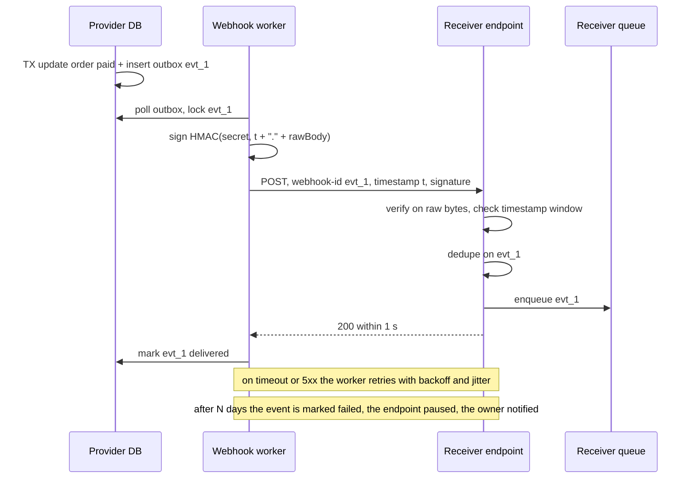

## Bối cảnh & vấn đề

Nền tảng thương mại gửi webhook `order.paid` tới hệ thống ERP của retailer. Ba sự cố trong một quý:

1. Sau khi nâng cấp framework, endpoint nhận webhook của một retailer bắt đầu từ chối **mọi** event với "invalid signature", dù secret không đổi. ERP ngừng nhận đơn trong 6 tiếng.
2. Một retailer bảo trì server 3 ngày cuối tuần. Hệ thống gửi webhook retry mỗi phút cho hàng nghìn event, hàng đợi phình to, làm chậm webhook của **mọi** retailer khác.
3. Một retailer nhận `order.cancelled` **trước** `order.paid` của cùng đơn (event paid bị retry, tới sau), ERP ghi nhận đơn đã thanh toán dù thực tế đã huỷ.

**Webhook** là cách server của bạn gọi ngược tới server của khách khi có sự kiện, thay vì khách phải liên tục hỏi (polling). Nó đơn giản về giao thức (một HTTP `POST`), nhưng là một **hệ thống phân tán** giữa hai tổ chức không tin nhau: mạng lỗi, receiver chậm hoặc chết, message trùng, sai thứ tự, và ai cũng có thể gửi `POST` giả tới URL công khai của receiver. Bài này thiết kế cả hai phía: gửi (delivery) và nhận (verification), rồi so sánh webhook với các cách đẩy dữ liệu realtime tới browser.

**Interview angle:** red flag kinh điển là verify chữ ký trên `JSON.stringify(req.body)` và giả định webhook tới đúng một lần, đúng thứ tự. Interviewer muốn nghe: raw body, timestamp, constant-time compare, at-least-once, dedupe, ordering.

## Khái niệm

### Webhook và delivery semantics

Một **webhook** là HTTP `POST` từ provider tới URL do subscriber đăng ký, mang một **event**: `id` duy nhất, `type` (`order.paid`), thời điểm xảy ra, và payload. Vì mạng có thể mất response (subscriber đã xử lý nhưng provider không nhận được `2xx`), provider phải retry, nên webhook gần như luôn là **at-least-once**: mỗi event tới **ít nhất** một lần, có thể nhiều lần. "Exactly-once" giữa hai hệ thống qua HTTP là không thể nếu không có dedupe ở receiver.

Hệ quả cho contract: mỗi event có `id` ổn định qua mọi lần retry, receiver **dedupe** theo `id`, và receiver trả `2xx` **nhanh** (xác nhận đã nhận, đẩy vào queue nội bộ, xử lý sau). Xử lý đồng bộ lâu trước khi trả `200` làm provider timeout và retry, tạo đúng những bản trùng mà ta muốn tránh.

### Ký HMAC trên raw body

Receiver cần biết request thật sự từ provider và không bị sửa. Cách chuẩn là **HMAC**: provider và receiver chia sẻ một secret; provider tính `HMAC-SHA256(secret, timestamp + "." + rawBody)` và gửi trong header (Stripe dùng `Stripe-Signature: t=...,v1=...`; Standard Webhooks dùng `webhook-id`, `webhook-timestamp`, `webhook-signature`). Receiver tính lại và so sánh.

Chữ ký phải tính trên **đúng các byte đã gửi** (raw body), không phải trên object đã parse rồi serialize lại. JSON có nhiều cách viết cho cùng một giá trị: thứ tự key, whitespace, escape unicode (`é` hay `é`), số (`1.0` hay `1`). Parse rồi `JSON.stringify` cho ra byte khác, nên hash khác. Framework nâng cấp và đổi cách parse là đủ làm vỡ một receiver từng "chạy được" (thường là nhờ may mắn payload không có ký tự đặc biệt).

### Timestamp, replay và constant-time compare

Chữ ký chỉ chứng minh message từng do provider tạo ra, không chứng minh nó **mới**. Attacker bắt được một request hợp lệ có thể gửi lại (**replay attack**). Vì vậy timestamp được đưa vào chuỗi ký, và receiver từ chối message có timestamp lệch quá một cửa sổ (Stripe mặc định 5 phút, verify). Dedupe theo event `id` là lớp thứ hai.

So sánh chữ ký bằng `===` rò rỉ thời gian: so sánh chuỗi dừng ở ký tự khác đầu tiên, về lý thuyết cho phép đoán dần chữ ký. Dùng **`crypto.timingSafeEqual`**, lưu ý nó **ném lỗi** nếu hai buffer khác độ dài, nên kiểm tra độ dài trước.

### Delivery: outbox, retry, dead letter

Phía provider, một hệ thống gửi webhook tin cậy có các thành phần:

- **Transactional outbox**: khi đơn chuyển sang `paid`, ghi event vào bảng `outbox` **trong cùng transaction** với thay đổi nghiệp vụ. Không có cách nào có đơn `paid` mà thiếu event, hay event mà đơn không đổi.
- **Dispatcher/worker** đọc outbox, gửi với **timeout ngắn** (5–10 giây), ghi lại từng lần thử (status, latency, response rút gọn) để khách tự xem.
- **Retry với exponential backoff + jitter**, trải dài nhiều giờ tới vài ngày (Stripe retry tới 3 ngày ở live mode, verify), rồi đánh dấu **failed** và đưa vào dead letter, có UI/API cho khách **replay**.
- **Cô lập theo endpoint**: mỗi subscriber có hàng đợi hoặc giới hạn concurrency riêng; endpoint lỗi liên tục bị **tạm dừng** (circuit breaker) và chủ tài khoản được báo. Một khách bảo trì 3 ngày không được làm chậm mọi khách khác.

### Ordering: thin event và version

Webhook **không đảm bảo thứ tự**: retry, song song, và mạng làm event tới lệch. Có hai cách thiết kế cho điều đó. **Payload có version**: gửi `occurredAt` và `sequence`/`version` của resource; receiver bỏ qua event có version cũ hơn state đang lưu. **Thin event** (sự kiện mỏng): payload chỉ nói "order o_77 đã thay đổi", receiver gọi `GET /orders/o_77` để lấy state **hiện tại**. Thin event loại bỏ vấn đề thứ tự và dữ liệu cũ, đổi lại mỗi event tốn thêm một API call.

### Xoay secret

Secret có thể lộ, và nên được xoay định kỳ. Để không mất event trong lúc xoay: provider cho phép **hai secret hoạt động song song** trong một khoảng thời gian, ký bằng secret mới (hoặc gửi cả hai chữ ký), receiver thử lần lượt các secret đang hoạt động. Hết giai đoạn chuyển tiếp thì huỷ secret cũ.

### Realtime tới browser: long polling, SSE, WebSocket

Webhook là **server-to-server**: browser không có URL công khai để nhận `POST`. Để đẩy trạng thái đơn hàng tới giao diện, có ba lựa chọn:

- **Long polling**: client gửi request, server giữ tới khi có dữ liệu hoặc hết thời gian, client gửi lại ngay. Đi qua mọi proxy, nhưng mỗi update tốn một request và có độ trễ.
- **Server-Sent Events (SSE)**: một response HTTP dài (`Content-Type: text/event-stream`), server ghi các event dạng text. **Một chiều** server → client, `EventSource` của browser **tự reconnect** và gửi header **`Last-Event-ID`** để server tiếp tục từ event cuối. Chạy trên HTTP thường, hợp với notification, trạng thái, tiến độ. Cần proxy không buffer (`X-Accel-Buffering: no` với nginx).
- **WebSocket** (RFC 6455): kênh **hai chiều**, full-duplex, sau một HTTP upgrade. Latency thấp nhất, hợp với chat, collaborative editing, trading. Đổi lại phải tự làm reconnect, heartbeat, xác thực lúc upgrade, và khi scale ngang cần pub/sub (Redis, NATS) để event từ pod này tới người dùng đang kết nối ở pod khác.

**Interview angle:** với "đẩy trạng thái đơn hàng", câu trả lời tốt là SSE (hoặc polling có ETag) vì dữ liệu một chiều, tần suất thấp; WebSocket chỉ khi cần hai chiều.

## Cơ chế hoạt động



Diễn giải. Event ra đời trong **cùng transaction** với thay đổi nghiệp vụ, nhờ bảng outbox. Worker lấy event (khoá để hai worker không gửi cùng lúc), ký trên đúng chuỗi byte sẽ gửi, và gửi với timeout ngắn. Phía receiver, thứ tự kiểm tra quan trọng: verify chữ ký trên **raw bytes** trước khi parse, kiểm tra timestamp trong cửa sổ, dedupe theo `id`, đẩy vào queue nội bộ, rồi trả `200` ngay. Việc xử lý nghiệp vụ (cập nhật ERP) diễn ra sau, từ queue của receiver. Nếu worker không nhận được `2xx` (timeout, `5xx`, lỗi mạng), nó lên lịch retry với backoff; sau số ngày tối đa, event thành failed, endpoint bị tạm dừng, và chủ tài khoản được báo để sửa rồi replay từ dashboard.

## Ví dụ thực tế

### Bug `JSON.stringify` và bản sửa bằng raw body

Chạy thật với Express 5.2.1 trên Node 24.21. Provider gửi đúng chuỗi byte sau (có `1.0`, `é`, hai dấu cách thừa):

```ts
const raw = '{"id":"evt_1","type":"payment.succeeded","amount":1.0,"note":"Caf\\u00e9",  "data":{"b":2,"a":1}}';
const sign = (secret: string, t: string, body: string) =>
  createHmac("sha256", secret).update(`${t}.${body}`).digest("hex");

// BUGGY receiver: body already parsed by express.json()
app.post("/webhooks/buggy", express.json(), (req, res) => {
  const expected = createHmac("sha256", SECRET).update(`${req.header("x-timestamp")}.${JSON.stringify(req.body)}`).digest("hex");
  res.status(req.header("x-signature") === expected ? 200 : 401).end();
});

// FIXED receiver: raw bytes, timestamp window, constant-time compare, two secrets, dedupe
function verify(rawBody: string, t: string, header: string, secrets: string[]) {
  if (!/^\d+$/.test(t) || Math.abs(Date.now() / 1000 - Number(t)) > 300) return "stale_timestamp";
  const got = Buffer.from(header, "hex");
  for (const s of secrets) {
    const exp = Buffer.from(sign(s, t, rawBody), "hex");
    if (exp.length === got.length && timingSafeEqual(exp, got)) return "ok";
  }
  return "bad_signature";
}
app.post("/webhooks/fixed", express.raw({ type: "application/json", limit: "1mb" }), (req, res) => {
  const r = verify(req.body.toString("utf8"), req.header("x-timestamp")!, req.header("x-signature") ?? "", [SECRET, "whsec_old"]);
  if (r !== "ok") return res.status(400).json({ error: r });
  const evt = JSON.parse(req.body);
  if (seen.has(evt.id)) return res.status(200).json({ duplicate: true });  // production: unique insert in DB
  seen.add(evt.id);
  enqueue(evt);                                                             // process async
  res.status(200).json({ received: true });
});
```

Output thật:

```text
raw body sent     : {"id":"evt_1","type":"payment.succeeded","amount":1.0,"note":"Café",  "data":{"b":2,"a":1}}
JSON.stringify(parsed): {"id":"evt_1","type":"payment.succeeded","amount":1,"note":"Café","data":{"b":2,"a":1}}
buggy (JSON.stringify): 401
fixed (raw body)      : 200 {"received":true}
fixed, redelivery     : 200 {"duplicate":true}
fixed, replay 1h old  : 400 {"error":"stale_timestamp"}
fixed, old secret     : 200 {"received":true}
fixed, tampered amount: 400 {"error":"bad_signature"}
timingSafeEqual different lengths -> ERR_CRYPTO_TIMING_SAFE_EQUAL_LENGTH
```

Hai dòng đầu cho thấy vì sao receiver lỗi hỏng: sau parse và serialize lại, `1.0` thành `1`, `é` thành `é`, khoảng trắng biến mất. Cùng dữ liệu, khác byte, khác HMAC, nên `401` với mọi event có những đặc điểm đó. Bản sửa chấp nhận event, nhận ra lần giao lại (vẫn trả `200` để provider dừng retry), từ chối replay một giờ trước, chấp nhận event ký bằng secret cũ trong giai đoạn xoay, và từ chối payload bị sửa số tiền. Dòng cuối là lý do phải kiểm tra độ dài trước `timingSafeEqual`: header chữ ký sai độ dài sẽ làm handler ném exception (và trả `500`) thay vì `400`.

Trong Express, lưu ý `express.raw()` phải gắn **cho riêng route webhook** và đứng trước (hoặc thay cho) `express.json()` toàn cục; nếu `express.json()` đã đọc stream thì không còn raw body. Cách khác là `express.json({ verify: (req, _res, buf) => { req.rawBody = buf } })`.

### SSE với Last-Event-ID

Chạy thật: server SSE cố ý đóng kết nối sau mỗi 2 event để mô phỏng mạng rớt; client kết nối lại với `Last-Event-ID` như `EventSource` làm tự động.

```ts
const sse = http.createServer((req, res) => {
  const last = Number(req.headers["last-event-id"] ?? 0);
  res.writeHead(200, { "content-type": "text/event-stream", "cache-control": "no-cache", "x-accel-buffering": "no" });
  res.write("retry: 2000\n\n");                       // client reconnect delay
  for (const e of events.filter((e) => e.id > last).slice(0, 2))
    res.write(`id: ${e.id}\nevent: order.status\ndata: ${JSON.stringify(e)}\n\n`);
  res.end();                                          // simulate a dropped connection
});
```

```text
SSE connection 1 (Last-Event-ID: -): retry: 2000\n\nid: 1\nevent: order.status\ndata: {"id":1,"status":"placed"}\n\nid: 2\nevent: order.status\ndata: {"id":2,"status":"paid"}\n\n
SSE connection 2 (Last-Event-ID: 2): retry: 2000\n\nid: 3\nevent: order.status\ndata: {"id":3,"status":"packed"}\n\nid: 4\nevent: order.status\ndata: {"id":4,"status":"shipped"}\n\n
SSE connection 3 (Last-Event-ID: 4): retry: 2000\n\nid: 5\nevent: order.status\ndata: {"id":5,"status":"delivered"}\n\n
```

Mỗi lần kết nối lại, server chỉ gửi những event sau `Last-Event-ID`, nên client không mất và không nhận trùng. Điều kiện: server phải **giữ được** event gần đây (theo resource, trong Redis stream hoặc bảng event) để phát lại.

### Khi endpoint của khách chết 3 ngày

Event của khách đó tiếp tục được ghi vào outbox (không mất), nhưng worker không thử mỗi phút: backoff tăng dần (1 phút, 5, 30, 2 giờ, 6 giờ...), hàng đợi của endpoint đó bị giới hạn concurrency và tách khỏi khách khác. Sau vài chục lần thất bại liên tiếp, endpoint bị đánh dấu **disabled**, email báo cho chủ tài khoản. Khi họ sửa xong, họ bật lại và bấm "replay events since ..." (hoặc gọi `GET /events?after=...` để tự đồng bộ). Lưu trữ event có thời hạn (ví dụ 30 ngày) và được document.

## Trade-offs & lựa chọn thay thế

| Tiêu chí | Webhook | Long polling | SSE | WebSocket |
| --- | --- | --- | --- | --- |
| Hướng | Server → server của khách | Client kéo | Server → browser, một chiều | Hai chiều |
| Giao thức | HTTP `POST` | HTTP | HTTP (`text/event-stream`) | Upgrade sang WebSocket |
| Reconnect / resume | Retry của provider | Client tự gửi lại | Tự động, `Last-Event-ID` | Tự làm |
| Qua proxy/CDN | Tốt | Tốt | Cần tắt buffering | Cần hỗ trợ upgrade, timeout idle |
| Scale ngang | Worker + queue | Stateless | Cần pub/sub để fan-out | Cần pub/sub, sticky hoặc registry |
| Hợp với | Tích hợp B2B, ERP | Mọi môi trường, tần suất thấp | Notification, trạng thái, tiến độ | Chat, collaborative, trading |

| Payload | Ưu | Nhược |
| --- | --- | --- |
| Fat event (đầy đủ state) | Receiver không cần gọi lại | Dữ liệu có thể cũ khi tới, lộ nhiều dữ liệu, ordering khó |
| Thin event (chỉ ID + type) | Luôn lấy state mới nhất, ordering không còn quan trọng | Thêm một API call mỗi event, cần API đủ nhanh |

Khi nào chọn cái nào. Tích hợp với hệ thống của đối tác: webhook có ký, retry, dashboard và API `events` để tự đồng bộ khi webhook thất bại. Đẩy trạng thái đơn hàng lên web/mobile: SSE hoặc polling có ETag ([bài 5](/tracks/api-design/learn/http-caching-concurrency)); mobile khi app ở nền thì dùng push notification của nền tảng. WebSocket khi thật sự cần hai chiều với latency thấp. Với payload, thin event là mặc định an toàn cho dữ liệu thay đổi nhanh (order, inventory); fat event hợp với sự kiện bất biến (một payment đã xảy ra).

## Edge cases & failure modes

- **Receiver xử lý đồng bộ lâu**: trả `200` sau 40 giây, provider timeout ở 10 giây và retry, tạo xử lý trùng. Trả `2xx` ngay sau khi enqueue.
- **Dedupe bằng bộ nhớ**: `Set` trong process mất khi restart và không chia sẻ giữa pod. Dùng unique constraint trên `event_id` trong database.
- **Event tới sai thứ tự**: `cancelled` trước `paid`. So version/`occurredAt` với state hiện tại, hoặc thin event.
- **Endpoint của khách trỏ vào mạng nội bộ của bạn** (SSRF): khách đăng ký URL `http://169.254.169.254/...` hoặc `http://10.0.0.5/admin`. Validate URL khi đăng ký và khi gửi (resolve DNS, chặn dải IP private), gửi từ một egress riêng.
- **Secret bị lộ**: cần API xoay secret với giai đoạn hai secret song song, không yêu cầu downtime.
- **Clock skew ở receiver**: đồng hồ receiver lệch 10 phút làm mọi event bị `stale_timestamp`. Cửa sổ vài phút và khuyến nghị NTP; log rõ lý do từ chối.
- **SSE qua proxy buffer**: nginx buffer response, event tới theo cục hoặc không tới. `X-Accel-Buffering: no`, tắt nén cho stream, heartbeat comment (`: ping`) để giữ kết nối qua idle timeout.
- **WebSocket scale ngang**: event sinh ở pod 3, người dùng kết nối ở pod 7. Pub/sub (Redis) để mọi pod nhận event và gửi cho kết nối của mình.

## Pitfalls

- ❌ HMAC trên `JSON.stringify(req.body)` → ✅ HMAC trên raw bytes (`express.raw()` cho route webhook).
- ❌ So sánh chữ ký bằng `===` → ✅ `timingSafeEqual` sau khi kiểm tra độ dài.
- ❌ Không kiểm tra timestamp → ✅ timestamp trong chuỗi ký, cửa sổ vài phút, cộng dedupe theo event id.
- ❌ Giả định exactly-once, đúng thứ tự → ✅ at-least-once: dedupe, version hoặc thin event.
- ❌ Xử lý nghiệp vụ trước khi trả `200` → ✅ enqueue rồi trả `2xx` ngay.
- ❌ Gửi webhook trực tiếp trong request handler sau khi commit → ✅ outbox trong cùng transaction, worker gửi.
- ❌ Retry mỗi phút mãi mãi, hàng đợi chung → ✅ backoff + jitter nhiều ngày, cô lập theo endpoint, dead letter, replay.
- ❌ Dùng WebSocket cho mọi realtime → ✅ SSE cho một chiều, WebSocket khi cần hai chiều.

## Tóm tắt

- Webhook là HTTP `POST` server-to-server; luôn at-least-once, không đảm bảo thứ tự.
- Receiver: verify HMAC trên **raw body** + timestamp, `timingSafeEqual` sau khi kiểm tra độ dài, cửa sổ vài phút, dedupe theo event id, enqueue rồi trả `2xx`.
- Demo thật: parse rồi `JSON.stringify` đổi `1.0`, `é`, whitespace, nên chữ ký luôn sai.
- Provider: outbox trong cùng transaction, worker với timeout ngắn, backoff + jitter nhiều ngày, cô lập theo endpoint, dead letter, replay, log từng lần thử.
- Ordering: version/`occurredAt` hoặc thin event; xoay secret bằng hai secret song song.
- Browser: SSE (một chiều, `Last-Event-ID`) cho trạng thái; WebSocket cho hai chiều; long polling khi cần tương thích tối đa; webhook không dùng cho browser.
