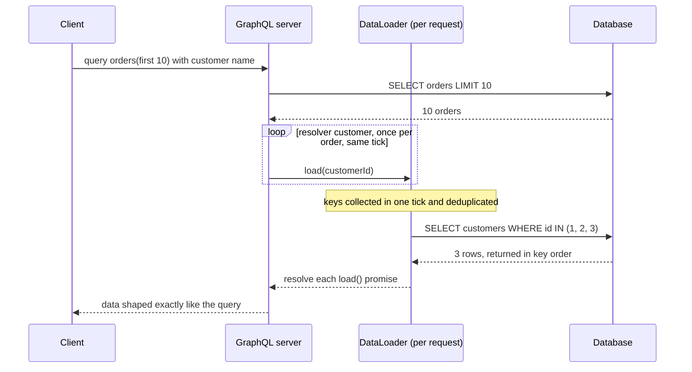

## Bối cảnh & vấn đề

Một nền tảng thương mại có ba frontend (web storefront, app mobile, admin dashboard) và tám domain service. Mỗi màn hình của mobile cần gọi 5–7 REST endpoint, nhận về nhiều field thừa trên mạng 4G, rồi tự ghép dữ liệu. Team frontend đề xuất "chuyển hết sang GraphQL cho linh hoạt". Team backend lo ngại: cache CDN sẽ ra sao, một query lồng sâu có hạ database không, và ai sở hữu schema chung của tám team. Cùng lúc, các service nội bộ gọi nhau bằng REST JSON, và một service trung tâm tốn 30% CPU chỉ để serialize/parse JSON; có người đề xuất gRPC.

Cả hai đề xuất đều có lý, và cả hai đều có thể thành thảm hoạ nếu áp dụng sai chỗ. GraphQL, REST và gRPC không phải "cái mới thay cái cũ" mà là ba công cụ tối ưu cho ba loại client khác nhau. Bài này đi qua cơ chế của GraphQL và gRPC đủ sâu để hiểu cái giá của chúng (N+1, cost, schema evolution, deadline), với ví dụ chạy thật, rồi đưa ra khung quyết định cho câu hỏi "federation, BFF hay REST aggregation".

**Interview angle:** câu mở đầu "REST vs GraphQL vs gRPC" chấm điểm theo việc bạn nói về **client** và **vận hành** (cache, bảo vệ, contract) thay vì cú pháp. Câu follow-up "team muốn thay hết REST bằng GraphQL" kiểm tra bạn hỏi đúng câu hỏi trước khi trả lời.

## Khái niệm

### GraphQL: schema, query, resolver

**GraphQL** là một query language cho API cộng một runtime. Server công bố một **schema** có kiểu (type `Order`, field `customer`, query `orders(first: Int)`), client gửi một **query** mô tả chính xác các field nó cần, và server trả JSON đúng shape đó. Mỗi field được tính bởi một **resolver**: hàm nhận object cha và trả giá trị của field. Thường chỉ có một endpoint (`POST /graphql`).

Lợi ích chính: client chọn field (không over-fetching), một request lấy dữ liệu từ nhiều entity liên quan (không under-fetching, ít round-trip), schema có kiểu và **introspection** cho tooling tốt. Cái giá: mỗi query là một chương trình nhỏ do client viết, nên server phải bảo vệ mình khỏi query đắt; HTTP caching khó hơn vì phần lớn request là `POST` tới cùng một URL; và lỗi thường trả `200` với mảng `errors`.

```graphql
query { orders(first: 10) { id total customer { name } } }
```

### N+1 và DataLoader

**N+1 problem**: query trên lấy 10 order (1 query), rồi resolver `customer` chạy **một lần cho mỗi order**, mỗi lần một query tới database: tổng 1 + N query. Với danh sách lồng nhau, con số nhân lên nhanh.

**DataLoader** giải quyết bằng hai cơ chế. **Batching**: mọi lời gọi `loader.load(id)` xảy ra trong cùng một tick của event loop được gom lại thành một lần gọi `batchFn([id1, id2, ...])`, thường là `WHERE id IN (...)`. **Caching theo request**: cùng một key được load nhiều lần chỉ gọi batch một lần. Hai ràng buộc của batch function: trả về mảng **cùng độ dài** và **cùng thứ tự** với mảng key (key không tìm thấy thì trả `null` hoặc `Error` tại vị trí đó).

DataLoader phải được tạo **mỗi request** (đặt trong context), không phải một instance toàn cục. Instance toàn cục giữ cache vĩnh viễn: dữ liệu cũ, rò bộ nhớ, và nghiêm trọng nhất là **rò dữ liệu giữa user và tenant** (user B nhận object mà user A đã load, bỏ qua kiểm tra quyền).

DataLoader **không** giải quyết: query quá sâu hoặc quá rộng (vẫn là nhiều batch), pagination lồng nhau (`customers { orders(first: 100) { items(first: 100) } }`), và N+1 ở tầng downstream không có batch endpoint (nếu service customer chỉ có `GET /customers/{id}`, batch cũng chỉ là N HTTP call song song).

### Bảo vệ GraphQL public

Một endpoint GraphQL public là một bề mặt tấn công mà REST không có: client tự viết query. Các vector: **độ sâu** (`orders { customer { orders { customer ... } } }`), **độ rộng qua alias** (`a1: orders(first: 1000) a2: orders(first: 1000) ...`), **batching** nhiều operation trong một request, và **introspection** giúp attacker biết toàn bộ schema.

Các lớp bảo vệ:

- **Depth limit** (chặn lồng sâu) và **cost/complexity analysis**: gán chi phí cho field (list nhân với `first`), từ chối query vượt ngân sách, và **rate limit theo cost** thay vì theo số request.
- **Bắt buộc `first`/`limit`** có giá trị tối đa cho mọi list.
- **Persisted queries / trusted documents**: client chỉ gửi ID (hash) của query đã được duyệt lúc build; server từ chối query tuỳ ý. Với app của chính bạn, đây là lớp bảo vệ mạnh nhất, và cho phép dùng `GET /graphql?id=<hash>` để cache ở CDN.
- Tắt introspection ở production cho API không public, timeout theo request, error không lộ stack trace.
- **Authorization ở resolver/field level**, không chỉ ở endpoint: một user có quyền xem order không có nghĩa là xem được mọi field của customer lồng bên trong.

### gRPC và Protobuf

**gRPC** là framework RPC trên HTTP/2, dùng **Protocol Buffers** (Protobuf) làm IDL và format nhị phân. Bạn định nghĩa service và message trong file `.proto`, sinh code client/server cho nhiều ngôn ngữ. Bốn kiểu RPC: unary, server streaming, client streaming, bidirectional streaming. Lợi thế: payload nhỏ và parse nhanh hơn JSON, contract chặt với codegen, streaming native, **deadline** là khái niệm hạng nhất. Nhược: browser không gọi gRPC trực tiếp được (cần gRPC-Web hoặc proxy), debug bằng curl khó hơn (dùng `grpcurl`), không có HTTP cache.

### Tiến hoá Protobuf

Trên wire, Protobuf định danh field bằng **field number** và **wire type**, không bằng tên. Từ đó suy ra các quy tắc:

- **Được**: thêm field mới với number mới (client cũ bỏ qua field lạ, giữ lại dưới dạng unknown field); xoá field **kèm `reserved`** number và tên để không ai dùng lại; đổi tên field (an toàn trên wire, nhưng phá JSON mapping và code sinh ra).
- **Không được**: đổi number của field; đổi sang kiểu không tương thích; **tái sử dụng number** đã xoá (dữ liệu cũ sẽ bị đọc thành field mới với nghĩa khác).
- **proto3 và presence**: field scalar không có `optional` không phân biệt "không gửi" với "giá trị mặc định" (0, `""`, `false`); giá trị mặc định thậm chí không được ghi lên wire. Cần phân biệt thì dùng `optional` (có lại từ protobuf 3.15, verify) hoặc wrapper type.
- **Enum**: giá trị đầu tiên phải là 0 và nên là `*_UNSPECIFIED`; client phải chịu được giá trị enum chưa biết.

### Deadline trong gRPC

Mỗi call gRPC nên có **deadline**: thời điểm mà sau đó client không còn quan tâm kết quả. Deadline được truyền trong metadata (`grpc-timeout`) và server có thể kiểm tra context để dừng việc; khi service A gọi B trong lúc xử lý một call, deadline còn lại **lan truyền** xuống B. Không đặt deadline, một call có thể treo vô hạn, giữ tài nguyên ở mọi tầng. Đây là phiên bản gRPC của nguyên tắc trong [bài Resilience](/tracks/api-design/learn/resilience-slo).

### Federation, BFF và REST aggregation

Khi có nhiều domain service và nhiều frontend, có ba cách tổng hợp. **REST + BFF cho mỗi frontend**: team frontend sở hữu BFF, gọi các service REST và ghép response theo màn hình. **GraphQL gateway một schema**: một team platform sở hữu schema chung, resolver gọi các service. **GraphQL federation**: mỗi domain team sở hữu một **subgraph** (phần schema của domain mình), một **router** compose các subgraph thành supergraph và lập kế hoạch thực thi (query planning), entity được nối qua key (`@key(fields: "id")`).

## Cơ chế hoạt động



Diễn giải. Engine GraphQL thực thi query theo từng tầng field. Resolver `orders` chạy một lần và trả 10 order. Engine gọi resolver `customer` cho từng order; mỗi resolver gọi `loader.load(customerId)` và nhận một promise. Vì tất cả những lời gọi này xảy ra đồng bộ trong cùng một tick, DataLoader chưa gọi database ngay mà chờ tới cuối tick (nó lên lịch batch bằng microtask/`process.nextTick` tuỳ phiên bản), gom các key, loại trùng, rồi gọi batch function một lần. Kết quả được trả về theo đúng thứ tự key, và từng promise được resolve. Mười lần `load` thành **một** query. Nếu resolver `customer` lại có field con cần load thêm, tầng đó được batch ở tick kế tiếp.

## Ví dụ thực tế

### N+1 và DataLoader, đo số query

Chạy thật với graphql-js 17.0.2 và dataloader 2.2.3 trên Node 24.21. Database giả lập ghi lại từng câu SQL; 6 order thuộc 3 customer.

```ts
const schema = buildSchema(`
  type Customer { id: ID!, name: String!, orders: [Order!]! }
  type Order { id: ID!, total: Int!, customer: Customer! }
  type Query { orders(first: Int = 10): [Order!]! }`);

const rootValue = {
  orders: ({ first }) => orders.slice(0, first).map((o) => ({
    ...o,
    customer: (_args, ctx) => ctx.loader ? ctx.loader.load(o.customerId) : db.customerById(o.customerId),
  })),
};
const q = "{ orders { id total customer { name } } }";
await graphql({ schema, source: q, rootValue, contextValue: {} });                                   // naive
await graphql({ schema, source: q, rootValue,
  contextValue: { loader: new DataLoader((ids) => db.customersByIds(ids)) } });                      // per request
```

Output thật:

```text
without DataLoader: 7 queries
  SELECT * FROM orders LIMIT 10
  SELECT * FROM customers WHERE id = 1
  SELECT * FROM customers WHERE id = 2
  SELECT * FROM customers WHERE id = 3
  SELECT * FROM customers WHERE id = 1
  SELECT * FROM customers WHERE id = 2
  SELECT * FROM customers WHERE id = 3
with per-request DataLoader: 2 queries
  SELECT * FROM orders LIMIT 10
  SELECT * FROM customers WHERE id IN (1,2,3)
result sample: [{"id":"100","total":1000,"customer":{"name":"An"}},{"id":"101","total":2000,"customer":{"name":"Binh"}}]
bad batch fn -> DataLoader must be constructed with a function which accepts Array<key> and returns Promise<Array<value>>, but the function did not return a Promise of an Array of the same length as the Array of keys.
```

Không có DataLoader: 1 + 6 query, và customer 1, 2, 3 bị load **hai lần**. Có DataLoader: 2 query, key được loại trùng. Dòng cuối là batch function trả mảng sai độ dài (1 phần tử cho 2 key): DataLoader từ chối ngay với lỗi rõ ràng, thay vì gán nhầm customer cho order.

### Depth limit không chặn được alias

```ts
import depthLimit from "graphql-depth-limit";
const deep = "{ orders { customer { orders { customer { orders { customer { name } } } } } } }";
validate(schema, parse(deep), [...specifiedRules, depthLimit(4)]);
const aliases = "{ a0: orders(first: 1000) { id } a1: orders(first: 1000) { id } ... a4: ... }";
validate(schema, parse(aliases), [depthLimit(4)]);
```

Output thật (graphql-depth-limit 1.1.0):

```text
depth-limit(4): '' exceeds maximum operation depth of 4
alias query: { a0: orders(first: 1000) { id } a1: orders(first: 1000) { id } a2: orders(first... | depth errors: 0 (depth limit does not catch width)
```

Query lồng 7 tầng bị chặn, nhưng query **nông** với 5 alias, mỗi alias đòi 1.000 order, lọt qua hoàn toàn (5.000 row cho một request, và attacker có thể viết 500 alias). Đó là lý do depth limit phải đi cùng **cost analysis** (field list tốn `first × cost của phần tử`) và giới hạn `first`, hoặc tốt hơn là persisted queries cho client của chính bạn.

### Tiến hoá Protobuf: field mới, field xoá, field bị tái sử dụng

Chạy thật với protobufjs 8.8.0. Ba phiên bản schema:

```proto
// v1
message Order { string id = 1; int64 total_cents = 2; string coupon = 3; }
// v2: coupon removed and reserved, two new fields
message Order { reserved 3; reserved "coupon"; string id = 1; int64 total_cents = 2; optional string note = 4; int32 discount = 5; }
// WRONG: number 3 reused with a new meaning
message Order { string id = 1; int64 total_cents = 2; string referral_code = 3; }
```

Output thật:

```text
v1 bytes: 0a036f5f3110cf0f1a0653414c453130
v1 -> decoded by v2 : {"id":"o_1","totalCents":1999}
v2 bytes: 0a036f5f3210f403220d6c6561766520617420646f6f72 (discount=0 is not on the wire)
v2 -> decoded by v1 : {"id":"o_2","totalCents":500,"coupon":""}
presence: note="" -> hasNote = true | discount unset vs 0 indistinguishable: 0
v1 bytes decoded by schema that REUSED 3 as string referral_code: {"id":"o_1","totalCents":1999,"referralCode":"SALE10"}
JSON mapping field names: {"id":"o_1","totalCents":"1999","coupon":"SALE10"}
```

Đọc kết quả:

- Message v1 (có `coupon`) được v2 đọc bình thường; field 3 đã `reserved` nên bị bỏ qua. Message v2 được v1 đọc bình thường; field 4 và 5 lạ bị bỏ qua, `coupon` về mặc định `""`. Đây là tương thích hai chiều nhờ field number.
- `discount = 0` **không xuất hiện** trên wire (byte cuối là field 4 `note`, tag `22`). Người nhận không thể biết client gửi 0 hay không gửi. `note` khai báo `optional` nên có presence: gửi chuỗi rỗng vẫn phân biệt được với không gửi.
- Schema tái sử dụng number 3 cho `referral_code` đọc dữ liệu cũ thành `referralCode: "SALE10"`: không lỗi, không cảnh báo, dữ liệu **sai nghĩa**. `reserved` ở v2 là thứ ngăn lỗi này (protoc báo lỗi khi ai đó dùng lại number đã reserved).
- JSON mapping dùng **tên** field (và `int64` thành string để không mất chính xác, như bài [quy ước JSON](/tracks/api-design/learn/errors-data-contracts)); vì vậy đổi tên field an toàn trên wire nhưng breaking với client dùng JSON transcoding.

### Chọn cho nền tảng 8 service, 3 frontend

Câu hỏi nên hỏi trước khi chọn: các frontend khác nhau về shape dữ liệu tới mức nào? Có bao nhiêu team và ai sở hữu gì? Có cần CDN cache cho storefront không? Team đã có kinh nghiệm vận hành GraphQL chưa? Latency budget của màn hình là bao nhiêu?

Một lời giải thực dụng (illustrative): service-to-service bằng gRPC cho các đường nóng nội bộ (tính giá, tồn kho), REST + OpenAPI cho Admin API công khai cho đối tác; storefront web dùng BFF (Next.js) với REST có cache CDN; mobile và admin dùng một GraphQL gateway với persisted queries. Federation chỉ được cân nhắc khi số team sở hữu schema đủ lớn để một team platform trở thành nút cổ chai, vì nó thêm query planning, entity resolution và tracing xuyên subgraph.

## Trade-offs & lựa chọn thay thế

| Tiêu chí | REST (JSON/HTTP) | GraphQL | gRPC |
| --- | --- | --- | --- |
| Client phù hợp | Public, partner, browser, mobile | Nhiều UI cần shape khác nhau | Service-to-service nội bộ |
| HTTP caching / CDN | Tốt (GET, ETag) | Khó; cần persisted queries + GET | Không |
| Over/under-fetching | Có (giải bằng `fields`, BFF) | Client chọn field | Theo RPC cố định |
| Contract | OpenAPI | SDL, introspection | `.proto`, codegen mạnh |
| Streaming | SSE/WebSocket riêng | Subscriptions | Native (4 kiểu) |
| Rủi ro chính | Endpoint sprawl, versioning | N+1, query đắt, auth theo field | Browser cần proxy, debug khó hơn |
| Evolution | Additive + version | Thêm field, `@deprecated` trên field | Field number, `reserved` |

| Tổng hợp nhiều service | Ưu | Nhược | Khi nào |
| --- | --- | --- | --- |
| REST + BFF mỗi frontend | Đơn giản, FE sở hữu, cache dễ | Logic gom trùng lặp giữa BFF | Ít frontend, shape khác nhau vừa phải |
| GraphQL gateway một schema | Một graph, FE tự chọn field | Team platform sở hữu schema, nút cổ chai | Vài team, nhiều UI |
| GraphQL federation | Mỗi domain sở hữu subgraph, scale tổ chức | Vận hành phức tạp, query planning, tracing | Nhiều team, schema lớn, đã quen GraphQL |

Khi nào chọn cái nào. Public/partner API: REST + OpenAPI, vì mọi ngôn ngữ và công cụ đều hiểu, cache và rate limit đơn giản. Nhiều UI với nhu cầu dữ liệu đa dạng trên cùng một domain graph: GraphQL, **luôn** kèm DataLoader, cost limit và persisted queries. Nội bộ với latency thấp, throughput cao, streaming, đa ngôn ngữ: gRPC với deadline và `reserved`. Kết hợp là bình thường: gRPC bên trong, REST/GraphQL ở rìa.

## Edge cases & failure modes

- **DataLoader toàn cục**: cache vĩnh viễn, dữ liệu cũ, và rò dữ liệu giữa user/tenant. Luôn tạo trong context của request.
- **Batch function sai thứ tự**: `WHERE id IN (...)` không trả theo thứ tự key; phải map lại theo key, nếu không order của khách A hiển thị tên khách B.
- **Subgraph chậm**: một subgraph chậm làm chậm mọi query chạm tới nó. Timeout theo subgraph, field nullable để trả partial data, và cache ở router.
- **Lỗi GraphQL trả `200`**: monitoring theo status code không thấy lỗi. Đếm `errors` trong response như một metric riêng.
- **Field auth thiếu**: resolver `Customer.email` không kiểm tra quyền vì "chỉ truy cập được qua order". Qua một đường query khác nó lại truy cập được.
- **gRPC không có deadline**: call treo giữ stream HTTP/2 và goroutine/promise ở mọi tầng; luôn đặt deadline và truyền tiếp.
- **Load balancing gRPC**: HTTP/2 giữ một connection lâu dài, L4 load balancer dồn mọi request vào một pod. Dùng L7 (Envoy) hoặc client-side load balancing.
- **Proto3 default**: client gửi `discount = 0` để "xoá giảm giá", server hiểu là "không gửi" và giữ giá trị cũ. Dùng `optional` hoặc field mask cho update.

## Pitfalls

- ❌ Một DataLoader cho cả server → ✅ tạo mỗi request trong context.
- ❌ Chỉ depth limit cho GraphQL public → ✅ depth + cost analysis + `first` bắt buộc + rate limit theo cost; persisted queries cho client của bạn.
- ❌ Authorization chỉ ở endpoint `/graphql` → ✅ ở resolver/field level.
- ❌ "Chuyển hết sang GraphQL cho linh hoạt" → ✅ hỏi về client, caching, ownership, kỹ năng vận hành trước.
- ❌ Tái sử dụng field number Protobuf → ✅ xoá field thì `reserved` cả number và tên.
- ❌ Phân biệt "không gửi" với 0 bằng proto3 scalar → ✅ `optional` hoặc wrapper, field mask cho update.
- ❌ gRPC call không deadline → ✅ deadline cho mọi call, truyền xuống downstream.
- ❌ Federation cho 3 team → ✅ bắt đầu bằng BFF hoặc một gateway; federation khi ownership thật sự cần tách.

## Tóm tắt

- REST cho public/partner và cache; GraphQL cho nhiều UI cần shape khác nhau; gRPC cho nội bộ latency thấp, streaming; thường kết hợp.
- N+1: resolver chạy một lần mỗi phần tử; DataLoader batch trong một tick và cache theo request (đo thật: 7 query còn 2), batch fn trả đúng độ dài và thứ tự.
- DataLoader không giải quyết query đắt; cần depth + cost limit, `first` bắt buộc, persisted queries, auth theo field (demo thật: alias lọt qua depth limit).
- Protobuf định danh bằng field number: thêm field mới an toàn, xoá phải `reserved`, tái sử dụng number làm dữ liệu sai nghĩa (demo thật: coupon thành referral code).
- proto3 scalar không có presence, giá trị mặc định không lên wire; dùng `optional` khi cần phân biệt.
- gRPC cần deadline cho mọi call; browser cần gRPC-Web; load balancing ở L7.
- Federation giải quyết bài toán tổ chức (nhiều team sở hữu schema), đổi lại độ phức tạp vận hành; BFF và gateway đơn giản hơn cho ít team.
