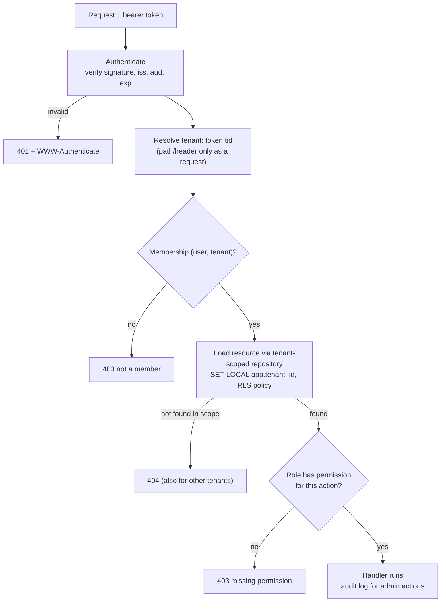

## Bối cảnh & vấn đề

Nền tảng B2B2C: nhiều **retailer** (tenant), mỗi retailer có nhân viên với vai trò khác nhau, và khách hàng của retailer mua hàng qua storefront. Một người có thể là `admin` ở retailer A và `staff` ở retailer B (một agency quản lý nhiều cửa hàng). Một ngày, đội bảo mật nhận báo cáo từ một retailer: nhân viên của họ, bằng cách đổi số trong URL `GET /orders/1002`, xem được đơn hàng của một retailer khác. Cuộc điều tra phát hiện thêm: endpoint `POST /orders/{id}/cancel` kiểm tra đúng "người dùng có quyền `orders:cancel` không", nhưng **không** kiểm tra order đó có thuộc tenant của người dùng không.

Đây là **BOLA** (Broken Object Level Authorization), mục số một của OWASP API Security Top 10 (bản 2023). Nó không đến từ thuật toán mã hoá yếu hay token bị lộ, mà từ việc API chỉ kiểm tra **"bạn là ai và có vai trò gì"** mà quên kiểm tra **"resource này có phải của bạn không"**. Trong hệ thống multi-tenant, lỗi này đồng nghĩa với rò dữ liệu giữa khách hàng, thứ có thể chấm dứt hợp đồng.

Bài này đi qua: tenant được xác định từ đâu, authorization hai lớp và nơi đặt từng lớp, cách trả status code để không lộ dữ liệu, cách test để chứng minh không endpoint nào rò, và cách thiết kế hai bề mặt API khác nhau cho hai loại người dùng (tích hợp của retailer và app của khách hàng). Lý thuyết JWT, OAuth và OIDC sâu hơn nằm ở track [Auth & identity](/tracks/auth-identity); phần guard trong Nest ở bài [Guards & auth](/tracks/nestjs/learn/guards-auth).

**Interview angle:** interviewer hỏi "làm sao chắc chắn mọi endpoint đều kiểm tra tenant, thay vì dựa vào trí nhớ của từng developer?". Câu trả lời phải là **cơ chế** (mặc định an toàn, data layer, RLS, test ma trận), không phải "code review kỹ".

## Khái niệm

### Authentication, authorization và tenant context

**Authentication** trả lời "bạn là ai" (token hợp lệ, chữ ký đúng, chưa hết hạn). **Authorization** trả lời "bạn được làm gì với cái này". Trong multi-tenant có thêm **tenant context**: request này đang hành động **trong tenant nào**. Ba thứ này phải được xác định ở server cho mỗi request, trước khi chạm tới dữ liệu.

Tenant có thể đến từ nhiều nguồn: subdomain (`acme.shop.example`), claim trong token, path (`/tenants/7/orders`), hay header (`X-Tenant-Id`). Nguyên tắc quan trọng nhất: nguồn nào do **client** kiểm soát (path, header, subdomain) chỉ là **yêu cầu** "tôi muốn hành động trong tenant 7"; server phải **verify membership** (user có thuộc tenant 7 không, với vai trò gì) trước khi chấp nhận. Token do server phát có thể mang tenant đang hoạt động (`tid`), nhưng membership vẫn nên được kiểm tra, vì user có thể đã bị gỡ khỏi tenant sau khi token được phát.

### Role theo tenant và permission

**RBAC** (role-based access control) gán quyền theo vai trò. Trong multi-tenant, role gắn với **membership**, không gắn với user: bảng `memberships(user_id, tenant_id, role)`. Một user có thể là `admin` ở tenant 9 và `staff` ở tenant 7. Role ánh xạ tới **permission** (`orders:read`, `orders:cancel`), và code kiểm tra permission chứ không kiểm tra tên role, để thêm role mới không phải sửa mọi endpoint.

Có nên nhồi permission vào JWT? Token chứa `tid` và có thể chứa role, nhưng nhồi toàn bộ permission làm token to và **cũ**: đổi quyền phải chờ token hết hạn. Cân nhắc token ngắn hạn (5–15 phút) cộng tra membership (có cache ngắn) ở server.

### Hai lớp kiểm tra: function level và object level

**Lớp 1, coarse-grained (function level)**: "user có permission `orders:cancel` trong tenant hiện tại không". Đặt ở middleware/guard, dựa trên metadata khai báo trên route. OWASP gọi lỗi ở lớp này là BFLA (Broken Function Level Authorization).

**Lớp 2, fine-grained (object level)**: "order 1002 có thuộc tenant hiện tại (và cửa hàng mà staff này quản lý) không". Lớp này cần **dữ liệu của resource**, nên middleware không làm được một mình. Cách bền vững nhất là đặt nó ở **data layer**: mọi truy vấn đi qua repository đã được scope theo tenant (`WHERE tenant_id = :currentTenant` được thêm tự động), để developer không thể "quên". Lớp phòng thủ cuối là **Row Level Security** của Postgres: policy `USING (tenant_id = current_setting('app.tenant_id')::int)` làm database tự lọc, kể cả khi code quên điều kiện.

Hai lớp này không thay thế nhau: lớp 1 không biết resource, lớp 2 không biết hành động được phép. Lỗi trong phần bối cảnh là có lớp 1 nhưng thiếu lớp 2 ở endpoint cancel.

### 404 hay 403

Như bài [HTTP semantics](/tracks/api-design/learn/http-semantics) đã nói: resource ngoài phạm vi của caller (tenant khác) trả **`404`**, để không lộ nó có tồn tại; RFC 9110 cho phép rõ việc này. Resource trong phạm vi mà caller thấy được nhưng không được hành động (staff xem được order nhưng không được huỷ) trả **`403`**. Hệ quả cho implementation: kiểm tra object level (load resource theo scope tenant) nên chạy **trước** khi trả lời câu hỏi permission cho hành động, nếu không thứ tự kiểm tra sẽ để lộ "order này tồn tại nhưng bạn không có quyền".

### Resource chia sẻ giữa tenant

Không phải mọi thứ đều thuộc đúng một tenant: catalog chung của nhà sản xuất mà nhiều retailer bán, marketplace nơi một đơn có hàng của nhiều seller, tài liệu được chia sẻ cho đối tác. Mẹo `tenant_id IS NULL` nghĩa là "của mọi người" nhanh chóng thành lỗ hổng. Cách rõ ràng hơn: bảng **grant/ACL** (`resource_grants(resource_id, grantee_tenant_id, permission)`), hoặc **ReBAC** (relationship-based access control, như Google Zanzibar, OpenFGA) mô hình hoá quyền bằng quan hệ ("tenant 9 là reseller của catalog 3"). Khi rule nhiều và thay đổi thường xuyên, **policy engine** (OPA, Cedar, OpenFGA) tách logic quyền ra khỏi code endpoint và test được độc lập.

### Đăng nhập Google OAuth và token nội bộ

Với "Đăng nhập bằng Google", luồng đúng là: app nhận **ID token** của Google (OIDC), backend **verify** nó (chữ ký qua JWKS của Google, `aud` là client ID của bạn, `iss`, `exp`), tìm hoặc tạo user nội bộ theo `sub` của Google (không theo email, vì email có thể thay đổi hoặc chưa xác minh), rồi **phát token của chính hệ thống** chứa user nội bộ và tenant đang chọn. API nội bộ không bao giờ nhận thẳng access token của Google làm credential: token đó được phát cho Google APIs, không mang tenant hay role của bạn, và bạn không kiểm soát vòng đời của nó.

### Hai bề mặt API: Admin và Storefront

Hai audience có nhu cầu gần như đối lập. **Admin API** phục vụ tích hợp server-to-server của retailer (ERP, kế toán): xác thực bằng **OAuth client credentials** hoặc API key theo tenant, **scope chi tiết** (`orders:read`, `products:write`), rate limit theo gói, webhooks, bulk và export async, không cache ở CDN. **Storefront API** phục vụ app và web của khách hàng cuối: token công khai theo storefront (chỉ đọc catalog) cộng token của khách (giỏ hàng, checkout), cache CDN mạnh cho catalog, rate limit theo IP/khách, bề mặt nhỏ và được làm cứng kỹ.

Tách hai bề mặt (khác base URL hoặc khác gateway) giúp mỗi cái có chính sách bảo mật, versioning, rate limit và SLO riêng, và giảm rủi ro một endpoint admin vô tình lộ ra storefront.

## Cơ chế hoạt động



Diễn giải. Request đi qua các cổng theo thứ tự. Xác thực trước: token không hợp lệ là `401`. Rồi xác định tenant: lấy từ token (hoặc từ path nhưng coi là yêu cầu cần verify), và kiểm tra membership; không phải thành viên là `403`. Tiếp theo là điểm then chốt: **load resource qua repository đã scope theo tenant**, với RLS ở database làm lưới an toàn; resource của tenant khác đơn giản là "không tìm thấy", nên trả `404`, không phân biệt với ID không tồn tại. Chỉ khi resource nằm trong phạm vi, server mới hỏi "vai trò này có được làm hành động này không", trả `403` nếu không. Thứ tự "scope trước, permission sau" vừa chặn BOLA vừa không lộ sự tồn tại của resource. Hành động admin được ghi audit log (ai, tenant nào, resource nào, lúc nào).

## Ví dụ thực tế

### Hai lớp kiểm tra, RLS và ma trận role × endpoint

Chạy thật trên PGlite 0.5.8 (PostgreSQL 18.3). An là `staff` ở tenant 7 và `admin` ở tenant 9; Bình là `staff` ở tenant 9. Order 1001 thuộc tenant 7, order 1002 thuộc tenant 9. RLS bật trên bảng `orders`, app chạy với role `app` (không phải owner, nên chịu policy):

```sql
CREATE TABLE memberships (user_id text, tenant_id int, role text, PRIMARY KEY (user_id, tenant_id));
CREATE TABLE orders (id int PRIMARY KEY, tenant_id int NOT NULL, store_id int NOT NULL, total_minor bigint);
CREATE ROLE app NOLOGIN;
GRANT SELECT, UPDATE ON orders TO app;
ALTER TABLE orders ENABLE ROW LEVEL SECURITY;
CREATE POLICY tenant_isolation ON orders USING (tenant_id = current_setting('app.tenant_id')::int);
```

```ts
const PERMS = { staff: ["orders:read"], admin: ["orders:read", "orders:cancel"] };

async function authorize(token: Token, permission: string) {
  const { rows: [m] } = await db.query(
    "SELECT role FROM memberships WHERE user_id = $1 AND tenant_id = $2", [token.sub, token.tid]);
  if (!m) return { status: 403, title: "Not a member of this tenant" };
  if (!PERMS[m.role].includes(permission)) return { status: 403, title: `Missing permission ${permission}` };
  return { ok: true, role: m.role };
}

async function getOrder(token: Token, id: number) {
  const a = await authorize(token, "orders:read"); if (!a.ok) return a;
  return db.transaction(async (tx) => {
    await tx.query("SET LOCAL ROLE app");
    await tx.query("SELECT set_config('app.tenant_id', $1, true)", [String(token.tid)]);   // local to this TX
    const { rows: [o] } = await tx.query("SELECT * FROM orders WHERE id = $1", [id]);    // RLS adds the tenant filter
    return o ? { status: 200, body: o } : { status: 404, title: "Not Found" };
  });
}

// FIRST VERSION of cancel: checks the permission only
async function cancelOrder(token: Token, id: number) {
  const a = await authorize(token, "orders:cancel");
  if (!a.ok) { const seen = await getOrder(token, id); return seen.status === 404 ? seen : a; }
  return { status: 200, body: { id, status: "cancelled" } };
}
```

Output thật:

```text
An @tenant7 (staff) GET 1001                   200 {"id":1001,"tenant_id":7,"store_id":1,"total_minor":5000}
An @tenant7 (staff) GET 1002 (tenant 9 order)  404 Not Found
An @tenant7 (staff) GET 9999 (missing)         404 Not Found
An @tenant7 (staff) cancel 1001                403 Missing permission orders:cancel
An @tenant7 (staff) cancel 1002                404 Not Found
An @tenant9 (admin) cancel 1002                200 {"id":1002,"status":"cancelled"}
Binh forges tid=7 in token                     403 Not a member of this tenant
matrix: u_an@7 GET 1001=200 | u_an@7 CANCEL 1001=403 | u_an@7 GET 1002=404 | u_an@7 CANCEL 1002=404 | u_an@9 GET 1001=404 | u_an@9 CANCEL 1001=200 | u_an@9 GET 1002=200 | u_an@9 CANCEL 1002=200 | u_binh@9 GET 1001=404 | u_binh@9 CANCEL 1001=404 | u_binh@9 GET 1002=200 | u_binh@9 CANCEL 1002=403
```

Bảy dòng đầu trông đúng: order của tenant khác và ID không tồn tại đều `404` (không phân biệt được), staff huỷ đơn bị `403`, Bình giả tenant trong token bị chặn ở membership. Câu `SELECT` trong `getOrder` **không có** `WHERE tenant_id`, và RLS vẫn lọc đúng: đó là lưới an toàn cho những chỗ code quên.

Nhưng **ma trận** (mọi user × mọi tenant × mọi order × mọi hành động) bắt được lỗi mà các test thủ công bỏ sót: `u_an@9 CANCEL 1001=200`. An, với tư cách admin của tenant 9, **huỷ được đơn của tenant 7**. Phiên bản đầu của `cancelOrder` chỉ load resource khi thiếu permission; khi có permission, nó không kiểm tra resource thuộc về ai, và RLS không giúp được vì hàm này không truy vấn database (trong code thật, câu `UPDATE orders SET status = 'cancelled' WHERE id = $1` chạy với kết nối không bật RLS sẽ ghi thẳng). Đây chính là lỗi BOLA trong phần bối cảnh, tái hiện bằng 20 dòng code.

Bản sửa theo đúng thứ tự trong sơ đồ: load theo scope trước, permission sau.

```ts
async function cancelOrderFixed(token: Token, id: number) {
  const seen = await getOrder(token, id);          // tenant-scoped load first (RLS)
  if (seen.status !== 200) return seen;            // 404 other tenant, 403 not a member
  const a = await authorize(token, "orders:cancel"); if (!a.ok) return a;
  return { status: 200, body: { id, status: "cancelled" } };
}
```

```text
fixed: u_an@7 CANCEL 1001=403 | u_an@7 CANCEL 1002=404 | u_an@9 CANCEL 1001=404 | u_an@9 CANCEL 1002=200 | u_binh@9 CANCEL 1001=404 | u_binh@9 CANCEL 1002=403
```

Bài học rút ra: test authorization bằng **ma trận** sinh tự động (role × tenant × resource × endpoint, với kết quả mong đợi khai báo một lần) tìm được lỗi mà test theo từng tính năng không tìm được. Chạy nó trong CI cho mọi endpoint mới; endpoint nào không có dòng trong ma trận thì build fail.

### Thiết kế bề mặt API cho nền tảng commerce

```text
Admin API      https://admin-api.shop.example/v1
  auth         OAuth 2.0 client credentials per retailer app, scopes orders:read, products:write
  tenant       from the token (the app is installed in exactly one tenant)
  limits       per app + per plan, cost-based for exports; 429 + Retry-After
  features     webhooks (signed), bulk jobs, cursor pagination, Problem Details, idempotency keys
  caching      none at the CDN; ETag for conditional GET

Storefront API https://{store}.shop.example/api/storefront/v1
  auth         public storefront token (read catalog) + customer session token (cart, checkout)
  tenant       resolved from the host, verified against the storefront token
  limits       per IP + per customer; strict on login/OTP
  features     catalog, cart, checkout (idempotent), no admin fields in any DTO
  caching      CDN: public, s-maxage=60, stale-while-revalidate for catalog; no-store for cart
```

Bảng trên là illustrative. Nó gom lại các bài trước vào một thiết kế: [idempotency](/tracks/api-design/learn/idempotency) cho checkout, [pagination](/tracks/api-design/learn/pagination-filtering) cursor, [error format](/tracks/api-design/learn/errors-data-contracts), [rate limit](/tracks/api-design/learn/rate-limiting) theo gói và tenant, [caching](/tracks/api-design/learn/http-caching-concurrency) khác nhau theo audience, và [versioning](/tracks/api-design/learn/versioning-evolution) có deprecation policy công khai. Retailer lớn cần field riêng trên order: thêm **metafields/custom attributes** có namespace theo tenant (`metafields: [{ namespace, key, type, value }]`) thay vì fork schema.

## Trade-offs & lựa chọn thay thế

| Nơi đặt kiểm tra tenant | Ưu | Nhược |
| --- | --- | --- |
| Trong từng handler (`if (order.tenantId !== user.tenantId)`) | Rõ ràng, dễ đọc | Phụ thuộc trí nhớ developer; một chỗ quên là rò |
| Repository/ORM scope tự động | Mặc định an toàn, một chỗ | Truy vấn raw SQL có thể đi vòng; cần convention |
| Postgres RLS | Database tự chặn, kể cả khi code quên | Phải set context đúng mỗi transaction; cẩn thận với pooler (dùng `SET LOCAL`); debug khó hơn |
| Database/schema riêng mỗi tenant | Cô lập mạnh nhất | Vận hành, migration và chi phí tăng theo số tenant |

| Mô hình quyền | Hợp với | Giới hạn |
| --- | --- | --- |
| RBAC theo tenant | Đa số B2B | Khó diễn tả "chỉ cửa hàng của tôi", chia sẻ chéo |
| ABAC (thuộc tính: store, region) | Rule theo thuộc tính resource | Rule nằm rải rác nếu không có engine |
| ReBAC (OpenFGA, Zanzibar) | Chia sẻ, phân cấp, quan hệ | Thêm một hệ thống để vận hành |
| Policy engine (OPA, Cedar) | Rule phức tạp, cần audit và test riêng | Độ trễ thêm; phải đồng bộ dữ liệu cho engine |

Khi nào chọn cái nào. Mặc định: RBAC theo membership cho lớp 1, repository scope theo tenant cho lớp 2, và RLS làm lưới an toàn cho các bảng nhạy cảm. Chuyển sang ReBAC hoặc policy engine khi có chia sẻ chéo tenant, phân cấp tổ chức, hoặc số rule tăng tới mức không ai còn nắm hết. Database riêng mỗi tenant chỉ cho khách hàng có yêu cầu cô lập theo hợp đồng hoặc quy định (thường là một vài enterprise tenant), còn lại dùng chung với `tenant_id`.

## Edge cases & failure modes

- **Quyền bị thu hồi khi token còn hạn**: token 30 phút vẫn mang role cũ. Token ngắn hạn, tra membership ở server (cache vài chục giây), hoặc danh sách revoke cho hành động nhạy cảm.
- **Impersonation của admin nội bộ**: nhân viên hỗ trợ "đăng nhập như khách". Token impersonation phải ghi rõ `act` (ai đang hành động thay ai), bị giới hạn quyền, có thời hạn ngắn và audit log đầy đủ.
- **Background job mất tenant context**: worker xử lý message không có request context, truy vấn không scope. Mọi message mang `tenant_id`, worker set context trước khi chạm database, và RLS bắt nếu quên.
- **Cache key thiếu tenant**: Redis key `product:123` dùng chung cho mọi tenant có giá riêng. Luôn có tenant trong key cho dữ liệu theo tenant.
- **Search index chung**: Elasticsearch không có RLS; tenant filter phải được query builder thêm bắt buộc, hoặc tách index/alias theo tenant.
- **ID tuần tự**: `orders/1001`, `1002` dễ đoán; không phải lỗi bảo mật nếu authorization đúng, nhưng làm BOLA dễ khai thác và lộ số lượng đơn. ID không đoán được (UUID v7) là lớp giảm thiểu, không phải thay thế cho kiểm tra.
- **RLS sau PgBouncer transaction mode**: `SET app.tenant_id` ở mức session rò sang client khác; bắt buộc `SET LOCAL`/`set_config(..., true)` trong transaction (chi tiết ở bài [Connections & PgBouncer](/tracks/sql-postgres/learn/connection-pooling)).
- **Endpoint bulk/export bỏ qua scope**: export đi qua đường code khác (raw SQL cho nhanh) và quên tenant. Ma trận test phải bao gồm cả job async.

## Pitfalls

- ❌ Tin `X-Tenant-Id` hay path do client gửi → ✅ coi là yêu cầu, verify membership ở server.
- ❌ Chỉ kiểm tra permission ở middleware → ✅ thêm object-level check ở data layer, RLS làm lưới an toàn.
- ❌ Kiểm tra permission trước khi load resource theo scope → ✅ scope trước (404 cho tenant khác), permission sau (403).
- ❌ `403` cho order của tenant khác → ✅ `404`, không phân biệt với ID không tồn tại.
- ❌ Dùng thẳng access token của Google cho API nội bộ → ✅ verify ID token, map theo `sub`, phát token nội bộ có tenant.
- ❌ Nhồi mọi permission vào JWT sống lâu → ✅ token ngắn hạn + tra membership có cache.
- ❌ `tenant_id IS NULL` cho resource chia sẻ → ✅ bảng grant hoặc ReBAC.
- ❌ Test quyền bằng vài case thủ công → ✅ ma trận role × tenant × resource × endpoint trong CI.

## Tóm tắt

- BOLA (OWASP API1) là lỗi số một: API kiểm tra "bạn có vai trò gì" nhưng quên "resource này có phải của bạn không".
- Tenant từ token; path/header/subdomain chỉ là yêu cầu, server luôn verify membership; role gắn với membership, code kiểm tra permission.
- Hai lớp: function level ở middleware, object level ở data layer (repository scope), RLS với `SET LOCAL` làm lưới an toàn.
- Thứ tự: xác thực → tenant + membership → load theo scope (404) → permission cho hành động (403) → audit.
- Demo thật: ma trận role × endpoint bắt được admin tenant 9 huỷ được đơn của tenant 7; sửa bằng "scope trước, permission sau".
- Resource chia sẻ dùng grant/ReBAC; rule phức tạp dùng policy engine.
- Google OAuth: verify ID token, map theo `sub`, phát token nội bộ; Admin API (client credentials, scope, webhooks, bulk) tách khỏi Storefront API (token công khai + session khách, cache CDN).
