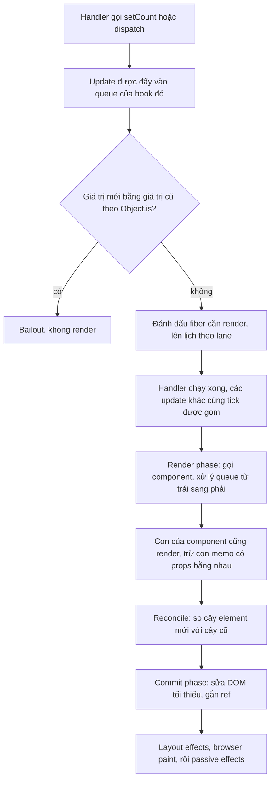

## Bối cảnh & vấn đề

Một dev mới vào team viết nút "Thêm vào giỏ" như sau, và báo bug "bấm không ăn":

```tsx
function Cart() {
  const [items, setItems] = useState<string[]>([]);
  function add(sku: string) {
    items.push(sku);
    setItems(items);
    console.log("items:", items.length); // tăng dần: 1, 2, 3...
  }
  return <p onClick={() => add("sku-1")}>{items.length} món</p>;
}
```

Console in `1`, `2`, `3` nhưng màn hình vẫn hiện `0 món`. Cùng tuần đó, một dev khác viết `setCount(count + 1)` ba lần liên tiếp và ngạc nhiên vì count chỉ tăng 1. Người thứ ba thì thêm `React.memo` khắp nơi vì tin rằng "component chỉ render lại khi props đổi", nhưng Profiler vẫn cho thấy cả cây render mỗi lần gõ phím.

Ba bug này cùng một gốc: không nắm **mô hình render** của React. React không "theo dõi biến" như Vue hay Svelte. Nó chỉ biết một điều: khi bạn gọi hàm set state, component đó cần được **gọi lại** để tính ra UI mới từ state mới. Giá trị state trong một lần render là một **snapshot** cố định, và React quyết định có render hay không bằng cách so sánh **reference** (`Object.is`), không so sánh nội dung.

Bài này xây mô hình đó từ đầu: cái gì trigger render, render khác commit ở đâu, vì sao state là snapshot, batching và updater function hoạt động ra sao, vì sao phải cập nhật state immutable, và khi nào `useReducer` làm code tốt hơn `useState`. Các bài sau (reconciliation, effects, memoization, concurrent) đều đứng trên nền này.

**Interview angle:** câu mở màn kinh điển `react-001` ("cái gì làm component render lại?") dùng để lọc ứng viên chỉ học thuộc "props đổi thì render".

## Khái niệm

### Component là một hàm thuần từ props và state ra UI

Một **function component** là hàm JavaScript nhận props và trả về **JSX**. JSX chỉ là cú pháp cho `jsx(type, props)`, tạo ra một **React element**: một object nhỏ mô tả "ở đây nên có một `<button>` với text 2". Element không phải DOM node, cũng không phải "bản sao DOM"; nó là bản mô tả mà React dùng để quyết định DOM nên trông thế nào.

React yêu cầu component **thuần** (pure) trong lúc render: cùng props, state và context thì trả cùng JSX, và không đụng vào thứ gì bên ngoài (không gọi API, không sửa biến toàn cục, không mutate props). Lý do là React tự quyết định **khi nào** và **bao nhiêu lần** gọi component: nó có thể gọi hai lần trong StrictMode, gọi rồi bỏ kết quả trong concurrent rendering. Nếu render có side effect, mỗi lần gọi thừa là một lần side effect thừa.

```tsx
// Thuần: chỉ tính JSX từ input
function Price({ amount }: { amount: number }) {
  return <span>{amount.toLocaleString("vi-VN")} ₫</span>;
}
```

### Trigger, render, commit

Mỗi lần UI đổi đi qua ba bước mà react.dev gọi là **trigger → render → commit**:

- **Trigger**: có một lý do để render. Lần đầu là `root.render(<App />)`; sau đó là một lần gọi `setState`/`dispatch` ở đâu đó.
- **Render**: React **gọi component** (và đệ quy xuống các component con) để lấy cây element mới, rồi so với cây cũ (reconciliation, xem [bài reconciliation](/tracks/react/learn/reconciliation-keys)).
- **Commit**: React áp các thay đổi tối thiểu vào DOM thật, gắn ref, rồi chạy effect.

Điểm then chốt: **render không có nghĩa là DOM bị ghi lại**. Nếu component trả JSX y hệt lần trước, React render xong và commit không làm gì cả. "Re-render" chỉ là "React gọi lại hàm của bạn".

### Ba nguyên nhân gốc khiến một component render

Một component render lại chỉ vì một trong ba lý do:

1. **State của chính nó đổi**: nó gọi `setState` hoặc `dispatch` với giá trị khác.
2. **Context mà nó đọc đổi**: `useContext(Ctx)` hoặc `use(Ctx)` và provider đổi `value`.
3. **Component cha render lại**: mặc định, khi cha render, **mọi con của nó render theo**, bất kể props có đổi hay không.

"Props đổi" không nằm trong danh sách này, vì props chỉ đổi **khi cha render**. Chạy thử: cha có state `n`, con `Plain label="same"` không memo; bấm nút đổi `n`, con vẫn render dù prop `label` y hệt (log thật bên dưới, mục E). Muốn con bỏ qua render khi props không đổi, phải bọc `memo`, và `memo` so sánh **mọi prop** bằng `Object.is`, kể cả prop con không dùng tới.

**Interview angle:** trả lời đúng `react-001` phải nói "parent render thì con render theo, trừ khi con được memo và props shallow-equal". Red flag: "con chỉ render khi props đổi", hoặc "re-render là viết lại DOM".

### State là snapshot

Khi React gọi component, `useState` trả về giá trị state **của lần render này**. Biến `count` trong hàm là một hằng số bình thường của JavaScript: gọi `setCount(5)` không đổi biến `count` đang có, nó chỉ **xếp một yêu cầu** để lần render **sau** có `count = 5`. Mọi event handler, closure, timeout được tạo trong lần render đó đều "nhìn thấy" snapshot đó mãi mãi.

```tsx
function Delayed() {
  const [n, setN] = useState(0);
  return (
    <button onClick={() => {
      setN(n + 5);
      setTimeout(() => alert(n), 3000); // alert 0, không phải 5
    }}>{n}</button>
  );
}
```

Nhiều tài liệu (và ghi chú cá nhân) mô tả việc này là "`setState` bất đồng bộ". Cách nói đó dễ gây hiểu lầm: `setState` không trả Promise, không có gì để `await`. Chính xác hơn: **state là snapshot theo từng render**, và update được **xếp hàng** để xử lý ở lần render kế tiếp.

### Update queue, batching và updater function

Trong một event, mọi lần gọi set state được đẩy vào một **hàng đợi** gắn với state đó. React đợi code trong handler chạy xong rồi mới xử lý cả hàng đợi trong **một** lần render. Việc gom nhiều update vào một render gọi là **batching**.

Có hai loại phần tử trong hàng đợi. `setCount(1)` là "thay bằng 1". `setCount(c => c + 1)` là một **updater function**: "lấy giá trị đang có trong hàng đợi, cộng 1". Khi xử lý hàng đợi, React đi từ trái sang phải; updater nhận kết quả của bước trước. Vì vậy khi state mới phụ thuộc state cũ, hãy dùng updater. Updater phải **thuần**: React có thể gọi nó hai lần trong StrictMode để kiểm tra.

### Automatic batching (React 18+)

Ở React 17, batching chỉ xảy ra trong **React event handler**. Update trong `setTimeout`, promise hay native event listener được xử lý **từng cái một**, mỗi `setState` một lần render. React 18 với `createRoot` bật **automatic batching**: gom update ở mọi nơi, miễn là chúng xảy ra trong cùng một tick. React 19 đã **xoá** `ReactDOM.render` (API legacy giữ hành vi cũ) (verify), nên mọi app React 19 đều có automatic batching.

Khi thật sự cần DOM được cập nhật ngay giữa chừng (ví dụ đo kích thước hoặc scroll tới item vừa thêm), dùng `flushSync` của `react-dom`: nó ép React render và commit đồng bộ update bên trong callback. Cái giá là mất batching và chặn main thread, nên chỉ dùng như lối thoát hiếm hoi.

```tsx
import { flushSync } from "react-dom";
function addAndScroll(todo: Todo) {
  flushSync(() => setTodos((t) => [...t, todo])); // DOM đã có item mới
  listRef.current!.lastElementChild!.scrollIntoView();
}
```

### Bailout: khi React bỏ qua render

Khi bạn set state bằng một giá trị mà `Object.is(old, new)` là `true`, React **bỏ qua** việc render lại component đó (bailout). Tài liệu React nói rõ React "có thể vẫn cần gọi component một lần trước khi bỏ qua con của nó" trong vài trường hợp, nhưng không commit gì. Trong thí nghiệm bên dưới (mục B), `setV(5)` khi `v` đang là 5 không gây lần render nào.

Bailout dựa vào **reference**, không dựa vào nội dung. Hai hệ quả trái ngược: (1) set một object **mới** có nội dung y hệt vẫn render lại; (2) **mutate** object cũ rồi set lại chính nó thì React thấy "không đổi" và bỏ qua, dù nội dung đã khác.

### Immutability

Vì React so sánh reference, state phải được đối xử như **bất biến** (immutable): muốn đổi thì tạo object/array **mới**. `push`, `splice`, `sort` tại chỗ, gán `obj.x = 1` đều là mutation. Thay bằng spread (`[...arr, x]`), `map`, `filter`, `toSorted()` hoặc Immer. Với object lồng nhau, phải copy **từng tầng** trên đường đi tới chỗ đổi:

```ts
setOrder((o) => ({
  ...o,
  items: o.items.map((it, i) => (i === 3 ? { ...it, qty: it.qty + 1 } : it)),
}));
```

Mutation không chỉ làm UI không cập nhật. Nó phá `memo` (con thấy cùng reference nên không render), phá React Compiler (compiler giả định giá trị đã render không bị sửa), và phá devtools/time-travel.

### useState và useReducer

`useReducer(reducer, initial)` trả về `[state, dispatch]`. Thay vì gọi nhiều setter, component **dispatch** một action mô tả "chuyện gì đã xảy ra" (`{ type: "added", sku }`), và một hàm **reducer** thuần `(state, action) => newState` quyết định state mới. Reducer không chạy nhanh hơn hay "mạnh" hơn `useState`; nó **gom logic chuyển trạng thái** vào một chỗ có thể đọc và test như hàm thuần. `dispatch` có reference ổn định giữa các render, nên truyền xuống sâu không cần `useCallback`.

**Interview angle:** `react-025` không hỏi cú pháp; nó hỏi dấu hiệu nào khiến bạn chuyển sang reducer (nhiều setter liên tiếp, state không hợp lệ có thể xảy ra như `isLoading && error`).

## Cơ chế hoạt động

### Từ setState tới pixel



Đọc sơ đồ từ trên xuống. Lời gọi `setCount` không render ngay; nó chỉ đẩy update vào **queue** gắn với hook `useState` đó trong **fiber** (object nội bộ React giữ state, props và vị trí của mỗi component instance). Nếu React có thể biết ngay giá trị mới bằng giá trị cũ, nó bỏ qua luôn. Nếu không, nó đánh dấu fiber là "cần render" và lên lịch công việc với một mức ưu tiên (**lane**, chi tiết ở [bài concurrent rendering](/tracks/react/learn/concurrent-rendering)).

Chỉ sau khi handler chạy xong, React mới bắt đầu **render phase**: nó gọi lại component, và mỗi `useState` trong đó tính giá trị mới bằng cách áp lần lượt các update trong queue. Sau đó React render các con, so sánh cây, và vào **commit phase** đồng bộ để sửa DOM. Effect chạy sau commit (chi tiết thứ tự ở [bài effects](/tracks/react/learn/effects)).

### Xử lý queue: ví dụ ba lời gọi

Với handler `setCount(count + 1); setCount(count + 1); setCount(c => c + 1)` khi `count = 0`:

| Update trong queue | Giá trị đầu vào | Kết quả |
|---|---|---|
| `setCount(0 + 1)`: "thay bằng 1" | 0 | 1 |
| `setCount(0 + 1)`: "thay bằng 1" | 1 | 1 |
| `setCount(c => c + 1)` | 1 | 2 |

Hai lời gọi đầu đều đã được **tính sẵn** thành số 1 lúc gọi, vì `count` trong snapshot là 0. Chỉ updater mới đọc giá trị "đang chạy" trong queue. Kết quả là 2, trong một lần render.

**Interview angle:** follow-up của `react-002` là "nếu bọc trong `setTimeout` thì sao?". Ở React 18+, vẫn là 2 và vẫn một render (automatic batching); ở React 17, vẫn là 2 nhưng ba lần render.

### Vì sao mutation bị bỏ qua

`todos.push(x)` sửa **chính** mảng đang nằm trong state. `setTodos(todos)` truyền lại cùng reference đó. Bước "Object.is?" trong sơ đồ trả `true`, React bailout. Mảng đã đổi nội dung nhưng không ai render lại để hiển thị nó. Nếu sau đó component render vì lý do khác (cha render, state khác đổi), UI "tự nhiên" nhảy đúng. Đó là lý do bug mutation khó tái hiện: nó phụ thuộc vào việc có render nào khác tình cờ xảy ra.

## Ví dụ thực tế

Các output dưới đây là **output thật**, chạy bằng React 19.2.8 + react-dom/client trong jsdom, bọc thao tác bằng `act` của React.

### Snapshot và queue (react-002)

```tsx
let renders = 0;
function Counter() {
  const [count, setCount] = useState(0);
  renders++;
  function handleClick() {
    setCount(count + 1);
    setCount(count + 1);
    setCount((c) => c + 1);
    console.log("log in handler:", count);
  }
  return <button onClick={handleClick}>{count}</button>;
}
// mount, reset renders = 0, rồi click một lần
```

```text
log in handler: 0
button text: 2 | renders after click: 1
```

### Batching, bailout, mutation và memo

```tsx
// A: hai setState trong setTimeout
function T() {
  const [a, setA] = useState(0);
  const [b, setB] = useState(0);
  renders++;
  return <button onClick={() => setTimeout(() => { setA(1); setB(1); }, 0)}>{a}{b}</button>;
}

// B: set state bằng đúng giá trị hiện tại
function S() {
  const [v, setV] = useState(5);
  rb++;
  return <button onClick={() => setV(5)}>{v}</button>;
}

// C: mutate rồi set cùng reference
function Todos() {
  const [todos, setTodos] = useState<string[]>([]);
  return (
    <>
      <button onClick={() => { todos.push("x"); setTodos(todos); console.log("C) todos.length in handler:", todos.length); }}>add</button>
      <p>{todos.length}</p>
    </>
  );
}

// D: con memo, cha truyền thêm prop C mà con không dùng
const Child = memo(function Child({ A, B }: { A: number; B: number }) { childRenders++; return <i>{A}-{B}</i>; });
function P() {
  const [c, setC] = useState(0);
  return <><button onClick={() => setC(c + 1)}>c</button><Child A={1} B={2} C={c} /></>;
}

// E: con không memo, props y hệt
function Plain({ label }: { label: string }) { e++; return <b>{label}</b>; }
function P2() {
  const [n, setN] = useState(0);
  return <><button onClick={() => setN(n + 1)}>n</button><Plain label="same" /></>;
}
```

```text
A) renders after 2 setState in setTimeout: 1
B) setState(same) renders: click1 = 0  total after click2 = 0
C) todos.length in handler: 1
C) rendered count on screen: 0
D) memo Child renders after unused prop C changed: 1
E) non-memo child renders with identical props: 1
```

Đọc từng dòng: (A) automatic batching gom hai update trong timeout thành **một** render. (B) bailout: không lần render nào. (C) đúng bug ở đầu bài: mảng dài 1 nhưng màn hình vẫn 0. (D) `memo` so sánh **mọi** prop; prop `C` đổi thì con render dù không destructure nó. (E) không có `memo`, con render mỗi khi cha render.

### Sửa bug giỏ hàng và chuyển sang reducer

Sửa tối thiểu là tạo mảng mới bằng updater: `setItems(prev => [...prev, sku])`. Nhưng giả sử giỏ hàng còn có `status` (idle/submitting/error), `error` và `coupon`. Với `useState`, handler checkout trông thế này:

```tsx
async function checkout() {
  setIsSubmitting(true);
  setError(null);
  try { await api.checkout(items); setItems([]); setCoupon(null); }
  catch (e) { setError(String(e)); }
  finally { setIsSubmitting(false); }
}
```

Năm setter, và không gì ngăn trạng thái vô lý như `isSubmitting = true` cùng `error = "..."`. Với reducer và discriminated union, trạng thái không hợp lệ **không thể biểu diễn được**:

```ts
type Cart =
  | { status: "editing"; items: string[]; error?: string }
  | { status: "submitting"; items: string[] }
  | { status: "done" };

type Action =
  | { type: "added"; sku: string }
  | { type: "submitted" }
  | { type: "failed"; error: string }
  | { type: "succeeded" };

export function cartReducer(s: Cart, a: Action): Cart {
  switch (a.type) {
    case "added":
      return s.status === "editing" ? { ...s, items: [...s.items, a.sku], error: undefined } : s;
    case "submitted":
      return s.status === "editing" ? { status: "submitting", items: s.items } : s;
    case "failed":
      return s.status === "submitting" ? { status: "editing", items: s.items, error: a.error } : s;
    case "succeeded":
      return { status: "done" };
  }
}

let s: Cart = { status: "editing", items: [] };
for (const a of [
  { type: "added", sku: "A" },
  { type: "submitted" },
  { type: "added", sku: "B" }, // bị bỏ qua khi đang submit
  { type: "failed", error: "card declined" },
] as Action[]) {
  s = cartReducer(s, a);
  console.log(a.type.padEnd(9), JSON.stringify(s));
}
```

```text
added     {"status":"editing","items":["A"]}
submitted {"status":"submitting","items":["A"]}
added     {"status":"submitting","items":["A"]}
failed    {"status":"editing","items":["A"],"error":"card declined"}
```

(Output thật, chạy reducer bằng `tsx`; nó không phụ thuộc React.) Reducer test được mà không cần render gì, và quy tắc "không thêm hàng khi đang submit" nằm ở một chỗ duy nhất thay vì rải trong các handler. Trong component: `const [cart, dispatch] = useReducer(cartReducer, { status: "editing", items: [] })`.

## Trade-offs & lựa chọn thay thế

| Lựa chọn | Hợp khi | Giá phải trả |
|---|---|---|
| `setX(value)` | Giá trị mới không phụ thuộc giá trị cũ (`setOpen(false)`) | Sai nếu gọi nhiều lần dựa trên snapshot |
| `setX(prev => next)` | Giá trị mới tính từ giá trị cũ, nhất là trong timeout/async | Updater phải thuần, không side effect |
| Nhiều `useState` riêng | Các giá trị độc lập, đơn giản | Dễ sinh trạng thái vô lý khi chúng thực ra liên quan |
| Một `useState` object | Vài field luôn đổi cùng nhau (toạ độ `{x, y}`) | Phải spread khi cập nhật từng field |
| `useReducer` | State machine, nhiều event cùng sửa một state, cần test logic | Nhiều code hơn, thêm một lớp gián tiếp |
| Immer (`produce`, `useImmer`) | State lồng sâu, cập nhật phức tạp | Thêm dependency, cú pháp "mutate" dễ gây nhầm ngoài produce |
| `flushSync` | Cần DOM mới ngay để đo hoặc scroll | Mất batching, chặn main thread |

Khi nào chọn gì: mặc định dùng `useState` cho từng giá trị độc lập. Khi thấy một handler gọi ba setter trở lên, hoặc bạn phải viết comment "nhớ reset error khi submit", đó là lúc chuyển sang reducer. Immer đáng dùng khi state có ba tầng lồng trở lên; nếu state phẳng, spread là đủ. Một lưu ý hay bị hiểu nhầm: **tách một object state thành nhiều `useState` trong cùng component không giảm số lần render**; component vẫn render khi bất kỳ state nào của nó đổi. Muốn phần UI khác không render, phải tách **component** (xem [bài memoization](/tracks/react/learn/memoization-compiler)).

## Edge cases & failure modes

- **Update đến sau `await`.** Trong handler async, code sau `await` chạy ở một tick khác. Các setter trước `await` được batch với nhau; các setter sau `await` được batch thành một render khác. Không sai, nhưng đừng giả định "một handler = một render".
- **Snapshot cũ sau `await`.** `const [q] = useState(...)`; sau `await fetch()`, biến `q` vẫn là giá trị lúc handler bắt đầu, dù user đã gõ tiếp. Đọc giá trị mới nhất qua updater hoặc ref.
- **Updater có side effect.** Gọi `setShowCongrats(true)` hay `track()` bên trong updater: StrictMode gọi updater hai lần ở dev, nên side effect chạy hai lần. Tính giá trị mới trong handler, rồi gọi các setter riêng.
- **Bailout không tuyệt đối.** React có thể gọi component thêm một lần trước khi bailout, nên đừng dùng "số lần render" làm logic nghiệp vụ.
- **Mutation kèm memo.** Mutate `item` rồi truyền xuống `memo(Row)`: Row không render lại vì reference cũ, dù cha đã render. Bug chỉ xuất hiện ở những component có memo, rất khó đoán.
- **Initial state tính nặng.** `useState(parseHugeJson(raw))` gọi `parseHugeJson` ở **mọi** render (kết quả bị bỏ qua sau lần đầu). Dùng lazy init `useState(() => parseHugeJson(raw))`.
- **setState trong render.** Gọi setter vô điều kiện ngay trong thân component tạo vòng lặp; React ném lỗi "Too many re-renders" (xem [bài effects](/tracks/react/learn/effects)).

## Pitfalls

- ❌ Nói "component render lại khi props đổi" → ✅ nó render khi cha render (props chỉ đổi vì cha render), khi state của nó đổi, hoặc khi context nó đọc đổi.
- ❌ `setCount(count + 1)` ba lần để tăng 3 → ✅ `setCount(c => c + 1)` ba lần; `count` là hằng số của snapshot.
- ❌ `arr.push(x); setArr(arr)` → ✅ `setArr(prev => [...prev, x])`; React so sánh reference.
- ❌ `console.log(state)` ngay sau `setState` để "kiểm tra" → ✅ log giá trị mới bạn tính ra, hoặc log trong lần render sau.
- ❌ Tách `useState({count, theme})` thành hai `useState` để "giảm re-render" → ✅ component vẫn render như cũ; tách **component** nếu muốn cô lập phần UI.
- ❌ Rải `flushSync` để "state cập nhật ngay" → ✅ chấp nhận snapshot; chỉ dùng `flushSync` khi cần DOM mới để đo hoặc scroll.
- ❌ Dùng `useReducer` cho mọi thứ vì "chuyên nghiệp" → ✅ dùng khi có state machine hoặc nhiều update liên quan; một boolean `open` không cần reducer.
- ❌ Đặt side effect vào updater hoặc reducer → ✅ reducer và updater phải thuần; side effect thuộc về event handler.

## Tóm tắt

- Một lần cập nhật UI gồm **trigger → render → commit**. Render = React gọi component để tính JSX; commit = sửa DOM tối thiểu. Render không đồng nghĩa với việc DOM đổi.
- Component render lại vì: **state của nó đổi**, **context nó đọc đổi**, hoặc **cha render lại**. Con không `memo` luôn render theo cha; `memo` so sánh **mọi** prop bằng `Object.is`.
- **State là snapshot** của từng render; setter chỉ xếp update vào queue cho lần render sau.
- Queue xử lý từ trái sang phải; **updater** `c => c + 1` đọc giá trị mới nhất trong queue, còn `setX(value)` thì thay thẳng.
- **Automatic batching** (React 18+, `createRoot`) gom update ở mọi nơi, kể cả timeout và promise; `flushSync` là lối thoát hiếm hoi.
- Set giá trị `Object.is` bằng giá trị cũ → **bailout**. Vì vậy **mutation** làm UI không cập nhật; luôn tạo object/array mới.
- `useReducer` gom logic chuyển trạng thái thành hàm thuần test được, loại bỏ trạng thái không hợp lệ; `dispatch` có reference ổn định.
