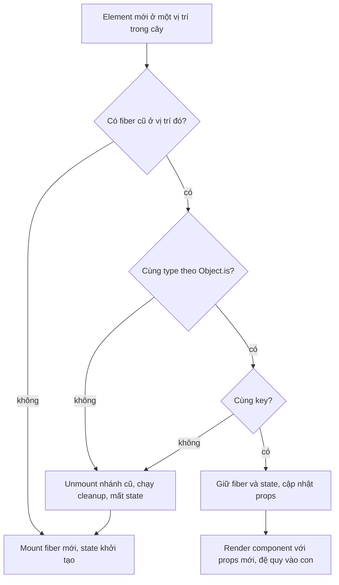
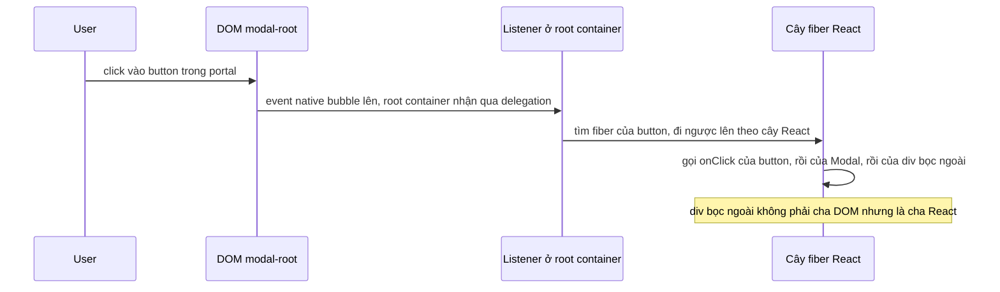

## Bối cảnh & vấn đề

Một màn hình CRM có danh sách khách hàng bên trái và form "ghi chú" bên phải. Support agent chọn khách A, gõ dở một ghi chú, rồi bấm sang khách B để tra cứu. Form bên phải vẫn hiện ghi chú đang gõ cho A, giờ nằm dưới tên B. Agent bấm "Lưu", và ghi chú về A được lưu vào hồ sơ B. Ở màn hình khác, một bảng todo cho phép "thêm lên đầu"; sau khi thêm, checkbox đã tick của dòng 1 chuyển sang dòng mới. Và một dropdown render menu qua portal thì tự đóng mỗi khi user bấm vào item trong menu.

Không bug nào trong ba bug này có dòng code "sai" hiển nhiên. Chúng đến từ việc React quyết định **giữ hay huỷ state** của component dựa trên những quy tắc mà dev không nghĩ tới: **vị trí** trong cây, **type** của element, và **key**. Quá trình so cây mới với cây cũ để ra quyết định đó gọi là **reconciliation**.

Bài này giải thích thuật toán reconciliation ở mức đủ để dự đoán hành vi, vai trò của `key` trong list và ngoài list, bẫy khai báo component bên trong component, và cách event đi qua portal. Nền tảng render/commit nằm ở [bài render & snapshot](/tracks/react/learn/render-commit-snapshot).

**Interview angle:** `react-016` và `react-050` là câu hỏi phân loại senior: người hiểu reconciliation giải thích được "vì sao form giữ dữ liệu của user khác" mà không cần đoán.

## Khái niệm

### Cây element, cây fiber và "vị trí"

Mỗi lần render, component trả về một **cây element** (object mô tả UI). React giữ song song một **cây fiber**: mỗi fiber là một instance sống lâu của một component hoặc thẻ DOM, chứa state (`useState`), effect, ref và DOM node tương ứng. **State không nằm trong component function**; nó nằm trong fiber ở một **vị trí** trong cây. Component function chỉ đọc state từ fiber mà React gán cho nó.

"Vị trí" nghĩa là đường đi từ root xuống: con thứ mấy của cha nào. Khi render lại, React ghép element mới vào fiber cũ ở cùng vị trí, nếu được phép. Ghép được thì state được giữ; không ghép được thì fiber cũ bị huỷ (unmount, chạy cleanup, mất state) và fiber mới được tạo (mount).

```tsx
// Hai <Counter /> ở hai vị trí khác nhau: hai state độc lập
<div>
  <Counter />   {/* vị trí 0 */}
  <Counter />   {/* vị trí 1 */}
</div>
```

### Reconciliation và hai heuristic

So sánh hai cây tổng quát tốn O(n³). React dùng hai **heuristic** để đạt O(n):

1. Hai element khác **type** (`div` vs `span`, `Form` vs `Wizard`) sinh ra cây khác nhau hoàn toàn: React không cố so sánh sâu, nó huỷ cả nhánh cũ và dựng nhánh mới.
2. Trong một danh sách con, dev chỉ ra con nào "là cùng một thứ" giữa hai lần render bằng **key**.

Hệ quả: cùng type, cùng key (hoặc cùng không có key), cùng vị trí thì **giữ** fiber và state, chỉ cập nhật props. Khác một trong ba thì **reset**.

Ghi chú về thuật ngữ: nhiều tài liệu gọi cây element là "Virtual DOM", và mô tả nó như "bản sao của DOM thật". Cách nói đó hơi lệch. Element là bản mô tả UI mong muốn, có cả component chưa được "mở" ra thẻ DOM; React team hiện ít dùng từ "Virtual DOM". Còn **Fiber** là tên kiến trúc reconciler từ React 16, cho phép chia render thành từng đơn vị nhỏ có thể tạm dừng (chi tiết ở [bài concurrent](/tracks/react/learn/concurrent-rendering)).

### Key trong list

Khi render một mảng, React dùng **key** để ghép phần tử mới với fiber cũ. Key chỉ cần **duy nhất giữa các sibling**, không cần duy nhất toàn app. Key nên là ID ổn định từ dữ liệu (`order.id`), vì nó phải mô tả "đây là cùng một item" qua mọi lần render.

`key={index}` gắn danh tính với **vị trí**, không với item. Nếu list chỉ append ở cuối và item không có state riêng, index vẫn đúng. Nhưng khi thêm ở đầu, xoá ở giữa hay sắp xếp lại, item "Bob" chuyển từ index 0 sang 1, còn fiber ở index 0 (mang state của Bob) được ghép với "Alice". State (input đang gõ, checkbox, animation, focus) **đi theo vị trí**, nên hiển thị lệch. Ngoài ra React phải cập nhật props cho mọi dòng thay vì chỉ chèn một dòng.

`key={Math.random()}` hoặc `key={crypto.randomUUID()}` trong render còn tệ hơn: key đổi mỗi render nên **mọi** dòng bị unmount và mount lại, mất focus và state, tốn DOM.

**Interview angle:** `react-003` muốn nghe "key là danh tính, state đi theo key; index hỏng khi thêm đầu/sắp xếp". Follow-up là dùng key có chủ đích để reset.

### Key ngoài list: reset state có chủ đích

Key không chỉ dành cho mảng. Đặt `key` trên một component bất kỳ nghĩa là "khi key đổi, đây là một component **khác**". Đây là cách chuẩn để **reset toàn bộ state** khi một prop đổi, thay vì viết effect "khi `userId` đổi thì `setDraft('')`".

```tsx
<NoteForm key={customer.id} customer={customer} />
```

Khi `customer.id` đổi, fiber cũ bị unmount (effect cleanup chạy), fiber mới mount với state khởi tạo sạch.

### Cùng type ở cùng vị trí: state được giữ

Hai nhánh của toán tử ba ngôi render cùng một type ở cùng vị trí được React coi là **một** component:

```tsx
{isAdmin ? <ProfileForm user={admin} /> : <ProfileForm user={guest} />}
```

Đổi `isAdmin` không reset state của `ProfileForm`; chỉ props đổi. Đây là bug "ghi chú của A hiện dưới B". Muốn tách, thêm `key` khác nhau cho hai nhánh, hoặc render chúng ở hai vị trí khác nhau (`{isAdmin && <A/>}{!isAdmin && <B/>}` tạo hai slot riêng).

Ngược lại, `{show && <Banner />}` không làm các sibling phía sau bị remount: khi `show` là `false`, biểu thức trả `false`, và `false` vẫn **chiếm một slot** trong mảng children. Sibling phía sau giữ nguyên vị trí.

### Component khai báo bên trong component

```tsx
function Parent() {
  const [n, setN] = useState(0);
  function Row() { return <input />; } // type mới mỗi lần Parent render
  return <Row />;
}
```

Mỗi lần `Parent` render, `Row` là một **function mới**, tức một **type mới** theo `Object.is`. Heuristic 1 áp dụng: khác type, huỷ nhánh cũ. Input bị unmount/mount mỗi phím gõ, mất focus và state. Luôn khai báo component ở **top-level module**; nếu cần dữ liệu từ cha, truyền qua props.

### Portal và event bubbling

`createPortal(children, domNode)` render `children` vào một DOM node khác (thường là `document.body` hoặc `#modal-root`) để thoát khỏi `overflow: hidden` và `z-index` của cha. Nhưng về mặt **cây React**, portal vẫn là con của component đã tạo nó: nó nhận context, và **synthetic event bubble theo cây React, không theo cây DOM**. Click trong modal portal vẫn tới `onClick` của `div` bọc bên ngoài trong JSX, dù trong DOM hai node không lồng nhau.

### Event delegation từ React 17

React không gắn listener lên từng button. Nó dùng **event delegation**: một listener cho mỗi loại event ở cấp cao, rồi tự dispatch theo cây fiber. Trước React 17, listener nằm ở `document`; từ React 17 nó nằm ở **root container** (node bạn truyền vào `createRoot`). Thay đổi này giúp nhúng nhiều bản React trên một trang, và làm `e.stopPropagation()` tương tác hợp lý hơn với listener native trên `document`. React 17 cũng bỏ **event pooling** (trước đó object event bị tái sử dụng nên đọc `e.target` trong callback async trả `null`), và `onScroll` không còn bubble.

**Interview angle:** `react-029`: "portal bubble theo cây React" là ý bắt buộc; ý cộng điểm là delegation chuyển từ `document` sang root container ở React 17.

## Cơ chế hoạt động

### Quyết định giữ hay reset một fiber



Sơ đồ đọc theo từng element. Với mỗi element mới, React tìm fiber cũ tương ứng: trong một list có key thì tìm theo key, không có key thì theo index. Nếu không có, mount mới. Nếu có nhưng khác type (bao gồm trường hợp component được khai báo lại mỗi render) hoặc khác key, React huỷ toàn bộ nhánh cũ, kể cả mọi con cháu và state của chúng, rồi mount mới. Chỉ khi cả type lẫn key khớp, fiber được tái sử dụng: state giữ nguyên, props mới được truyền vào, và React tiếp tục so sánh xuống các con.

Điểm cần nhớ: quyết định diễn ra **theo vị trí trong cây element trả về từ render**, không theo tên biến hay điều kiện `if` trong code. Hai dòng JSX khác nhau trong code có thể là "cùng vị trí" (ternary), và cùng một dòng JSX có thể thành "khác type" (component khai báo lồng).

### Ghép list bằng key

Với danh sách `[Bob, Carol]` → `[Alice, Bob, Carol]`:

- **key = id**: React thấy key `Alice` mới (mount), `Bob` và `Carol` đã có (giữ fiber, có thể phải di chuyển DOM node). State của Bob đi theo Bob.
- **key = index**: key 0, 1 đã có, key 2 mới. Fiber 0 (state của Bob) giờ nhận props `Alice`; fiber 1 (state của Carol) nhận `Bob`; fiber 2 mới cho `Carol`. State lệch một dòng.

### Event từ portal



Portal được render vào `#modal-root`, là anh em của app root trong DOM. Tuy vậy React `createRoot` (và cả portal) đăng ký listener, và khi event tới, React tìm fiber ứng với target rồi đi ngược lên **theo cây fiber**. Vì fiber của portal là con của component đã gọi `createPortal`, mọi handler `onClick` của tổ tiên React đều được gọi. Đó là vì sao "click outside to close" viết bằng `onClick` trên wrapper cha lại nhận cả click bên trong menu portal.

## Ví dụ thực tế

Output dưới đây là **output thật** (React 19.2.8, react-dom/client trong jsdom, thao tác bọc trong `act`).

### Index key làm state lệch dòng (react-003)

```tsx
function Row({ name }: { name: string }) {
  const [note, setNote] = useState("");
  return <li>{name}:<input value={note} onChange={(e) => setNote(e.target.value)} /></li>;
}
function List({ useIndex }: { useIndex: boolean }) {
  const [items, setItems] = useState(["Bob", "Carol"]);
  return (
    <>
      <button onClick={() => setItems(["Alice", ...items])}>add</button>
      <ul>{items.map((n, i) => <Row key={useIndex ? i : n} name={n} />)}</ul>
    </>
  );
}
// Gõ "note for Bob" vào input của dòng Bob, rồi bấm add
```

```text
A) key=index: Alice:[note for Bob] | Bob:[] | Carol:[]
A) key=name: Alice:[] | Bob:[note for Bob] | Carol:[]
```

Với key là index, ghi chú của Bob nhảy sang Alice: state đi theo vị trí 0.

### Ternary giữ state, key reset state (react-016)

```tsx
function Form({ user }: { user: string }) {
  const [draft, setDraft] = useState("");
  useEffect(() => {
    console.log(`  mount Form(${user})`);
    return () => console.log(`  unmount Form(${user})`);
  }, []);
  return <input value={draft} onChange={(e) => setDraft(e.target.value)} />;
}
function Switcher({ withKey }: { withKey: boolean }) {
  const [u, setU] = useState("A");
  return (
    <>
      <button onClick={() => setU(u === "A" ? "B" : "A")}>switch</button>
      {u === "A"
        ? <Form user="A" key={withKey ? "A" : undefined} />
        : <Form user="B" key={withKey ? "B" : undefined} />}
    </>
  );
}
// mount, rồi bấm switch một lần
```

```text
B) ternary, withKey=false
  mount Form(A)
B) ternary, withKey=true
  mount Form(A)
  unmount Form(A)
  mount Form(B)
```

Không có key, đổi từ A sang B **không** unmount gì: draft của A được giữ cho B. Có key, React unmount form A và mount form B mới.

### Component khai báo lồng bị remount

```tsx
function Parent() {
  const [n, setN] = useState(0);
  function Inner() {
    useEffect(() => { console.log("  Inner mounted"); return () => console.log("  Inner unmounted"); }, []);
    return <span>{n}</span>;
  }
  return <><button onClick={() => setN(n + 1)}>+</button><Inner /></>;
}
// mount, bấm + một lần
```

```text
C) inner component, click once
  Inner mounted
  Inner unmounted
  Inner mounted
```

### Portal bubble theo cây React (react-029)

```tsx
const modalRoot = document.createElement("div");
document.body.appendChild(modalRoot);
function App() {
  return (
    <div onClick={() => console.log("D) wrapper onClick fired (React tree)")}>
      {createPortal(<button id="inportal">ok</button>, modalRoot)}
    </div>
  );
}
// kiểm tra DOM, rồi click vào button trong portal
```

```text
D) DOM: is button inside wrapper div? false
D) wrapper onClick fired (React tree)
```

Trong DOM, button không nằm trong wrapper; trong cây React thì có, và handler của wrapper chạy. Cách sửa "click outside" đúng: listener native trên `document` kiểm tra `menuRef.current.contains(e.target)` và `triggerRef.current.contains(e.target)`, hoặc `e.stopPropagation()` có chủ đích ở gốc menu.

### Modal mất dữ liệu khi poll (react-050)

Kịch bản: trang chi tiết đơn hàng poll `/api/orders/42` mỗi 10 giây, và modal "sửa địa chỉ" mất những gì user đang gõ mỗi lần poll trả về. Ba nguyên nhân thường gặp, kiểm tra theo thứ tự:

```tsx
// 1. Key theo version: mỗi lần poll updatedAt đổi → remount form
<AddressForm key={order.updatedAt} order={order} />        // ❌
<AddressForm key={order.id} order={order} />               // ✅ key theo entity

// 2. Thay cả cây bằng spinner khi refetch → form unmount
if (isFetching) return <Spinner />;                        // ❌
if (isLoading) return <Spinner />;                         // ✅ chỉ lần tải đầu

// 3. "Đồng bộ" draft từ props bằng effect → mỗi lần poll ghi đè draft
useEffect(() => setDraft(order.address), [order.address]); // ❌ (object mới mỗi poll)
const [draft, setDraft] = useState(() => order.address);   // ✅ khởi tạo một lần
```

Nguyên nhân 1 và 2 là **remount** (fiber bị huỷ), nguyên nhân 3 là **ghi đè** state. Để phân biệt, đặt một `useEffect(() => { console.log("mount"); return () => console.log("unmount") }, [])` trong form: thấy "unmount" nghĩa là remount. Bước tiếp theo về UX: nếu dữ liệu server đổi trong lúc user đang sửa, so `order.updatedAt` với version lúc mở form và hiện cảnh báo "bản ghi đã thay đổi" thay vì âm thầm ghi đè.

## Trade-offs & lựa chọn thay thế

| Cách chọn key / cấu trúc | Hợp khi | Rủi ro |
|---|---|---|
| ID ổn định từ dữ liệu | Hầu hết list | Cần dữ liệu có ID; item tạo ở client cần ID tạm (`crypto.randomUUID()` lúc tạo, không lúc render) |
| Index | List tĩnh, không sắp xếp, không thêm/xoá giữa, item không có state | State lệch dòng, update thừa khi list đổi |
| Key sinh trong render | Không bao giờ | Remount mọi dòng mỗi render |
| `key` để reset component | Đổi entity (user, order) cần state sạch | Mất cả state muốn giữ (scroll, tab đang mở); remount tốn hơn cập nhật props |
| Tính lại state trong render từ prop trước | Chỉ điều chỉnh một phần state khi prop đổi | Code khó đọc; hiếm khi cần |
| Hai slot riêng (`{a && <X/>}{!a && <X/>}`) | Muốn hai nhánh có state riêng | Dễ bị người khác "gộp" lại thành ternary |

Khi nào chọn gì: dùng ID thật cho list, gần như luôn luôn. Khi prop "danh tính" đổi (khách hàng, đơn hàng, phòng chat) và bạn muốn mọi state con reset, `key` là giải pháp đơn giản và đúng nhất, tốt hơn một effect reset từng state. Chỉ khi cần **giữ** một phần state (ví dụ giữ tab đang mở nhưng reset form), hãy tách phần đó ra khỏi component được key, hoặc nâng nó lên cha.

## Edge cases & failure modes

- **Key trùng giữa sibling.** React cảnh báo "Encountered two children with the same key" và hành vi không xác định: item có thể bị nhân đôi hoặc bị bỏ. Thường do ID trùng từ API hoặc ghép hai nguồn dữ liệu.
- **Key thay đổi khi dữ liệu refetch.** Backend trả ID mới mỗi lần (ví dụ ID sinh cho view model), mọi dòng remount sau mỗi lần refetch; focus và scroll trong dòng mất.
- **Fragment trong list.** `<>...</>` không nhận key; dùng `<Fragment key={id}>`.
- **Remount đắt.** Đặt key trên một cây lớn (editor, chart) làm mất toàn bộ state và DOM; với cây nặng, cân nhắc reset có chọn lọc.
- **Portal và focus.** Event bubble theo cây React, nhưng **focus, CSS và `contains` trên DOM** theo cây DOM. Focus trap, `:focus-within` và kiểm tra "click outside" phải tính portal riêng.
- **Portal và SSR.** `document` không tồn tại trên server; portal chỉ tạo sau khi mount (trạng thái `mounted` hoặc `useSyncExternalStore`) để tránh hydration mismatch.
- **Nhiều root React trên cùng trang.** Mỗi root có listener riêng ở container của nó; `stopPropagation` trong root này không chặn listener native của root kia nếu container lồng nhau.

## Pitfalls

- ❌ `key={index}` cho list có thể sắp xếp hoặc thêm đầu → ✅ `key={item.id}`; state đi theo key.
- ❌ `key={Math.random()}` để "ép render lại" → ✅ nếu cần render lại, đổi state; nếu cần reset, dùng key ổn định theo entity.
- ❌ `useEffect(() => { setDraft(""); }, [userId])` để reset form → ✅ `<Form key={userId} />`, không render thừa một nhịp với dữ liệu sai.
- ❌ Khai báo `const Row = () => ...` bên trong component cha → ✅ khai báo ở top-level, truyền dữ liệu qua props.
- ❌ `key={data.updatedAt}` trên form đang sửa → ✅ key theo ID của entity; version dùng để phát hiện xung đột, không để remount.
- ❌ `if (isFetching) return <Spinner/>` bọc cả form → ✅ spinner chỉ cho lần tải đầu; refetch nền hiển thị chỉ báo nhẹ và giữ UI.
- ❌ "Click outside" bằng `onClick` trên wrapper React trong khi menu nằm trong portal → ✅ listener trên `document` kiểm tra `contains` của cả trigger lẫn menu.
- ❌ Nghĩ `memo` ngăn được remount → ✅ memo chỉ bỏ qua render khi fiber được giữ; khác type hoặc key thì vẫn unmount.

## Tóm tắt

- State sống trong **fiber** ở một **vị trí** của cây, không nằm trong function component.
- Reconciliation giữ fiber khi **cùng vị trí, cùng type, cùng key**; khác một trong ba thì unmount nhánh cũ (mất state) và mount mới.
- **Key** là danh tính của phần tử giữa các render; state đi theo key. Index chỉ an toàn cho list tĩnh; key ngẫu nhiên gây remount mỗi render.
- Đổi `key` là cách chuẩn để **reset state** khi entity đổi; ternary cùng type ở cùng vị trí thì **giữ** state (bug "form của người khác").
- Component khai báo bên trong component là **type mới mỗi render**, gây remount và mất focus.
- **Portal** render vào DOM node khác nhưng vẫn là con trong cây React: nhận context, và synthetic event bubble theo cây React.
- React 17 chuyển delegation từ `document` sang **root container** và bỏ event pooling.
- Form mất dữ liệu khi poll: kiểm tra remount (key theo version, spinner thay cây) trước, rồi kiểm tra effect ghi đè draft.
