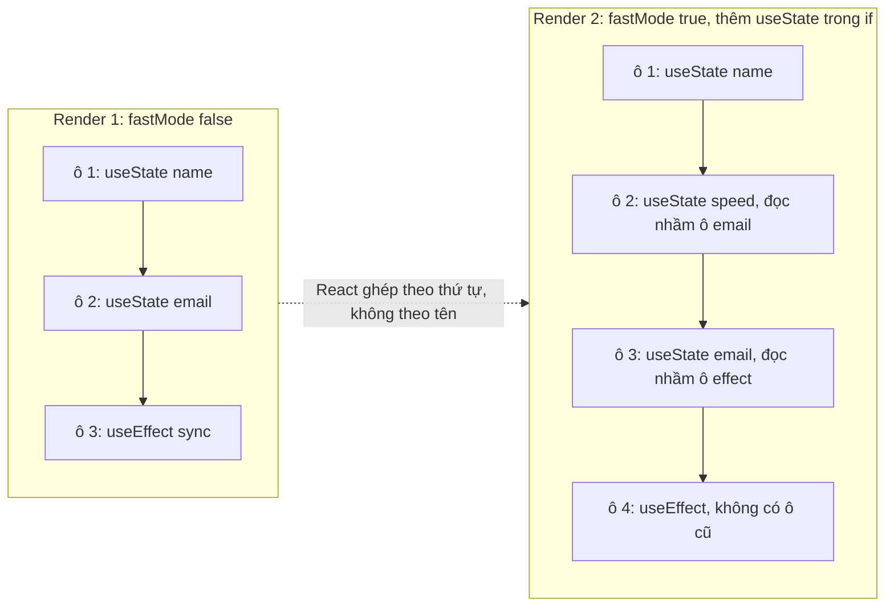
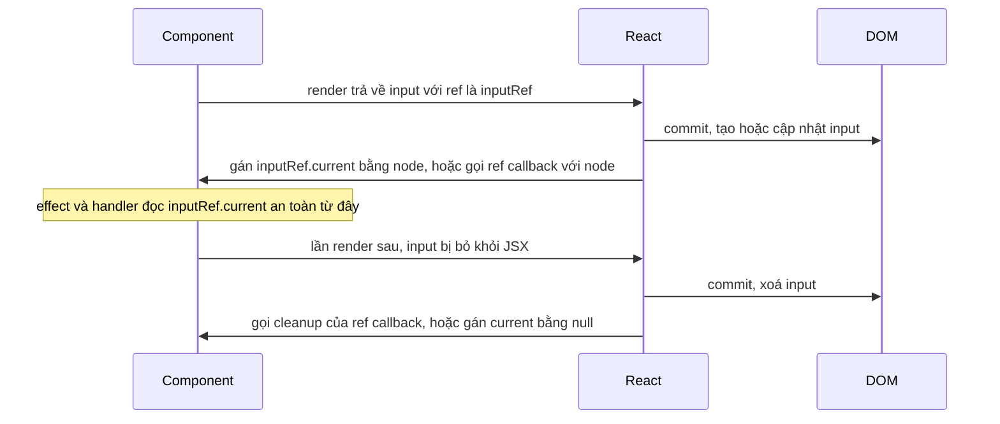

## Bối cảnh & vấn đề

Một component `TransferForm` trong app ngân hàng dài 600 dòng: 14 `useState`, 6 `useEffect`, logic tính phí chuyển khoản, validate hạn mức, gọi API, format tiền, và JSX. Một dev thêm tính năng "chế độ nhanh" bằng cách bọc hai `useState` trong `if (fastMode)`. App chạy được lần đầu, rồi khi user bật chế độ nhanh thì crash với "Rendered more hooks than during the previous render". Dev khác đếm số lần render bằng `useRef` (`renders.current++` ngay trong thân component) và thấy con số nhảy gấp đôi ở môi trường dev, nên kết luận "React bị lỗi".

Cả hai sự cố đến từ cùng một chỗ: hook không phải "hàm thường". Chúng là cách component **gắn vào bộ nhớ của React** (fiber), và bộ nhớ đó được xác định bằng **thứ tự gọi**. Hiểu cơ chế này giải thích được Rules of Hooks, vì sao custom hook chia sẻ logic nhưng không chia sẻ state, vì sao không đọc/ghi `ref.current` trong render, và vì sao một số lifecycle của class không có hook tương đương.

Bài này đi từ cách React lưu hook, qua custom hook như công cụ tách business logic khỏi UI (đúng thứ mà 600 dòng `TransferForm` cần), tới `useRef`, những thay đổi về ref ở React 19, và bảng chuyển đổi lifecycle class sang hook. Effect được đào sâu riêng ở [bài effects](/tracks/react/learn/effects).

**Interview angle:** `react-007` thường được hỏi dưới dạng "vì sao không được gọi hook trong if?". Câu trả lời phải chạm tới "state lưu theo thứ tự gọi", không dừng ở "vì docs nói vậy".

## Khái niệm

### Hook là gì

**Hook** là function của React (bắt đầu bằng `use`) cho phép function component "móc" vào tính năng mà React quản lý: state (`useState`, `useReducer`), context (`useContext`), effect (`useEffect`), ref (`useRef`), memo (`useMemo`), và các hook mới của React 19 (`useActionState`, `useOptimistic`). Function component tự nó không nhớ gì giữa hai lần gọi; biến local mất khi hàm return. Hook là cách lấy lại "bộ nhớ" từ fiber.

### Rules of Hooks

Hai quy tắc:

1. Chỉ gọi hook ở **top level** của component hoặc custom hook: không trong `if`, vòng lặp, callback, sau `return` sớm, hay trong `try/catch`.
2. Chỉ gọi hook trong **function component hoặc custom hook**, không trong function thường hay class.

Lý do nằm ở cách lưu trữ. Mỗi fiber giữ một **danh sách liên kết** các hook theo đúng thứ tự chúng được gọi trong lần render đầu. Ở mỗi lần render sau, React không biết hook nào là "`useState` của `name`"; nó chỉ biết "đây là hook thứ 3, lấy ô thứ 3". Nếu một `if` làm hook thứ 2 biến mất, mọi hook sau đó lệch một ô: `useState` của `email` đọc nhầm ô của `name`, hoặc `useEffect` đọc nhầm ô của `useState`. React phát hiện một số trường hợp và ném lỗi; các trường hợp khác gây bug âm thầm.

Ngoại lệ duy nhất là `use()` của React 19: nó đọc Promise hoặc Context và **được gọi trong `if`/vòng lặp** (vẫn phải nằm trong component hoặc hook), vì nó không cần một ô cố định trong danh sách (verify). Quy tắc được enforce bằng `eslint-plugin-react-hooks` (`rules-of-hooks`, `exhaustive-deps`).

### Custom hook

**Custom hook** là function tên bắt đầu bằng `use` và **gọi hook khác** bên trong. Nó đóng gói logic có state, effect hoặc ref để tái sử dụng: `useDebouncedValue`, `useOnlineStatus`, `useTransferForm`. Tên `use...` không chỉ là quy ước: lint dựa vào tiền tố này để áp Rules of Hooks cho function đó, và React Compiler cũng vậy.

Điểm hay bị hiểu nhầm: custom hook **chia sẻ logic, không chia sẻ state**. Hai component cùng gọi `useCounter()` là hai lần gọi `useState` ở hai fiber khác nhau, nên có hai state độc lập. Muốn chia sẻ state thì nâng state lên cha chung, dùng context, hoặc một store bên ngoài.

Nếu function **không gọi hook nào** (`formatMoney`, `calcFee`), đừng đặt tên `use...`. Nó là function thường, test thuần không cần React, và gọi được ở bất kỳ đâu, kể cả trong điều kiện.

Trước hooks, logic được chia sẻ bằng **HOC** (`withAuth(Component)`) và **render props** (`<Mouse render={pos => ...} />`). Hai pattern này vẫn gặp trong code cũ và thư viện; nhược điểm là "wrapper hell" trong devtools, xung đột tên prop (HOC), và lồng callback sâu (render props). Custom hook thay thế phần lớn use case của chúng.

**Interview angle:** `react-008`: tiêu chí "gọi hook thì là custom hook, không thì là utility"; ý cộng điểm là tách business logic khỏi presentation và test bằng `renderHook`.

### useRef

`useRef(initial)` trả về một object `{ current }` **ổn định** qua mọi lần render (cùng một object), và việc gán `ref.current = x` **không** làm component render lại. Hai nhóm use case:

- **Tham chiếu DOM node**: `<input ref={inputRef} />`, React gán `inputRef.current` sau commit và gán `null` khi unmount. Dùng để `focus()`, đo kích thước, scroll.
- **Giá trị mutable không thuộc UI**: id của timer, instance của thư viện ngoài (map, chart, WebSocket), giá trị "mới nhất" mà một callback lâu dài cần đọc.

### Không đọc/ghi ref.current trong render

react.dev yêu cầu: không đọc hay ghi `ref.current` **trong lúc render** (trừ lazy init). Render phải thuần và có thể bị gọi nhiều lần hoặc bị bỏ dở (StrictMode, concurrent rendering). Ghi ref trong render là side effect: ở dev StrictMode, mỗi render chạy hai lần nên bộ đếm tăng 2 (thí nghiệm bên dưới). Đọc ref trong render thì UI phụ thuộc vào một giá trị React không theo dõi: đổi ref không render lại, nên UI có thể hiển thị giá trị cũ. React Compiler coi đây là vi phạm và bỏ qua component đó.

Ngoại lệ chấp nhận được là **lazy init** một lần, vì kết quả luôn như nhau:

```tsx
const playerRef = useRef<VideoPlayer | null>(null);
if (playerRef.current === null) playerRef.current = new VideoPlayer();
```

Đọc/ghi ref ở **event handler** và **effect** thì hoàn toàn bình thường.

**Interview angle:** `react-006`, follow-up "lưu previous props trong ref trong lúc render có gì mong manh?": render bị bỏ dở vẫn đã ghi ref, nên "previous" có thể là giá trị của một render chưa từng được commit.

### Ref trong React 19: ref là prop

Trước React 19, `ref` là prop đặc biệt: function component không nhận được nó, phải bọc `forwardRef((props, ref) => ...)`. Từ React 19, **function component nhận `ref` như một prop thường**:

```tsx
function TextInput({ ref, ...props }: React.ComponentProps<"input">) {
  return <input ref={ref} {...props} />;
}
```

`forwardRef` vẫn chạy trong 19.2 (thí nghiệm bên dưới) nhưng React thông báo sẽ deprecate nó trong tương lai và có codemod để gỡ (verify). Class component thì khác: `ref` vẫn trỏ tới **instance** của class, không phải prop.

### Ref callback có cleanup

Ref có thể là một function `(node) => {...}`. React gọi nó với node khi gắn. Trước React 19, khi tháo, React gọi lại cùng function với `null`. Từ React 19, ref callback có thể **trả về một cleanup function**, và React gọi cleanup đó khi tháo thay vì gọi với `null` (verify):

```tsx
<div ref={(node) => {
  const ro = new ResizeObserver(onResize);
  ro.observe(node!);
  return () => ro.disconnect();
}} />
```

Hệ quả khi migrate: TypeScript sẽ báo lỗi nếu ref callback viết tắt kiểu `ref={(n) => (instance = n)}` vì nó "trả về" một giá trị; viết thành block `{ instance = n; }`.

### useImperativeHandle

`useImperativeHandle(ref, () => handle, deps)` cho phép component quyết định **cái gì** được lộ ra qua ref: thay vì cả DOM node, chỉ lộ một API hẹp như `{ focus, reset }`. Với component thư viện (design system), đây thường là lựa chọn tốt hơn lộ DOM node thô: bạn giữ quyền đổi markup bên trong mà không phá code của team dùng, và ngăn họ gọi những thứ như `node.style.display = "none"`.

### Lifecycle class và hook

Class component có các phương thức lifecycle gắn với **thời điểm** (sau mount, sau update, trước unmount). Hook nghĩ theo **đồng bộ hoá**: "khi `roomId` là X, component phải kết nối tới X". Bảng dưới là phép ánh xạ gần đúng, không phải phép dịch một-một.

| Class | Hook tương đương | Ghi chú |
|---|---|---|
| `constructor` | `useState(() => init)`, `useRef` | Lazy init để không tính lại mỗi render |
| `componentDidMount` + `componentWillUnmount` | `useEffect(() => { setup; return cleanup }, [])` | Setup và cleanup đặt cạnh nhau |
| `componentDidUpdate(prevProps)` | `useEffect` với deps | Nghĩ "đồng bộ với X", không phải "sau update" |
| `shouldComponentUpdate`, `PureComponent` | `memo(Component, areEqual?)` | `areEqual` trả `true` nghĩa là **bỏ qua** render |
| `getDerivedStateFromProps` | Tính trong render, hoặc `key` để reset | Hiếm khi thật sự cần |
| `getSnapshotBeforeUpdate` | Gần với `useLayoutEffect`, **không** có hook tương đương chính xác | Đọc DOM **trước** khi DOM đổi (ví dụ giữ vị trí scroll) |
| `getDerivedStateFromError`, `componentDidCatch` | **Không có hook** | Error boundary vẫn phải là class ([bài error boundaries](/tracks/react/learn/suspense-error-boundaries)) |

**Interview angle:** `react-027`: hai chỗ không có hook chính xác (`getSnapshotBeforeUpdate` và error boundary) là ý phân biệt người đã thực sự migrate class.

## Cơ chế hoạt động

### Danh sách hook trong fiber



Lần render đầu, React tạo danh sách ba ô. Ở lần render sau, mỗi lời gọi hook lấy **ô tiếp theo** trong danh sách cũ. Khi `if (fastMode)` chèn thêm một `useState` ở giữa, lời gọi thứ hai (`speed`) lấy ô của `email`, lời gọi thứ ba (`email`) lấy ô vốn là của effect, và effect không còn ô nào. React phát hiện kiểu hook không khớp và ném lỗi ở dev; nếu kiểu hook tình cờ khớp (hai `useState` hoán đổi), bug hoàn toàn âm thầm: `email` hiển thị giá trị của `speed`.

Vì mỗi fiber có danh sách riêng, custom hook gọi trong hai component tạo hai danh sách riêng. Custom hook chỉ là một đoạn code "chèn" các lời gọi hook của nó vào danh sách của component đang gọi.

### Vòng đời của một ref DOM



Ref chỉ có giá trị **sau commit**. Trong render đầu tiên, `inputRef.current` còn là `null`; vì thế đọc nó trong render vừa sai về nguyên tắc vừa sai về dữ liệu. Effect và event handler chạy sau commit nên thấy node thật.

## Ví dụ thực tế

Các output dưới đây là **output thật** (React 19.2.8, react-dom/client trong jsdom).

### Hook trong điều kiện

```tsx
function Bad({ flag }: { flag: boolean }) {
  if (flag) { useState(1); }         // vi phạm Rules of Hooks
  const [n] = useState(0);
  useEffect(() => {});
  return <p>{n}</p>;
}
// render <Bad flag={false} />, rồi render lại với flag={true}
```

```text
[console.error] React has detected a change in the order of Hooks called by Bad. This will lead to bugs and errors if not fixed. For more information, read the Rules of Hooks: https://react.dev/link/rules-of-hooks
A) thrown: Should have a queue. You are likely calling Hooks conditionally, which is not allowed. (https://react.dev/link/invalid-hook-call)
```

### Ghi ref trong render

```tsx
function RenderCounter() {
  const renders = useRef(0);
  renders.current += 1;              // ghi ref trong render: không nên
  const [n, setN] = useState(0);
  return <button onClick={() => setN(n + 1)}>{`renders.current=${renders.current}`}</button>;
}
// mount, rồi click hai lần, có và không có <StrictMode>
```

```text
A) strict=false: after mount "renders.current=1", after 2 clicks "renders.current=3"
A) strict=true: after mount "renders.current=2", after 2 clicks "renders.current=6"
```

Con số phụ thuộc vào việc React gọi component bao nhiêu lần, thứ mà app không kiểm soát. Muốn đếm render, dùng React DevTools Profiler; muốn "đếm commit", ghi trong `useEffect` không deps.

### Ref là prop, useImperativeHandle, ref cleanup

```tsx
function MyInput({ ref, ...p }: React.ComponentProps<"input">) { return <input ref={ref} {...p} />; }

function Fancy({ ref }: { ref?: React.Ref<{ focus(): void; clear(): void }> }) {
  const inner = useRef<HTMLInputElement>(null);
  useImperativeHandle(ref, () => ({
    focus: () => inner.current!.focus(),
    clear: () => { inner.current!.value = ""; },
  }), []);
  return <input ref={inner} defaultValue="hello" />;
}

function App({ show }: { show: boolean }) {
  const r1 = useRef<HTMLInputElement>(null);
  const r2 = useRef<{ focus(): void; clear(): void }>(null);
  useEffect(() => {
    console.log("B) r1.current is", r1.current?.tagName, "| r2.current keys:", Object.keys(r2.current ?? {}));
  }, []);
  return (
    <>
      <MyInput ref={r1} />
      <Fancy ref={r2} />
      {show && <div ref={(node) => {
        console.log("B) ref callback attach", node?.tagName);
        return () => console.log("B) ref cleanup called");
      }} />}
    </>
  );
}
// render show={true}, rồi show={false}
```

```text
B) ref callback attach DIV
B) r1.current is INPUT | r2.current keys: [ 'focus', 'clear' ]
B) ref cleanup called
```

Thứ tự đáng chú ý: ref callback chạy trong commit, **trước** `useEffect`; khi `div` bị bỏ, React gọi cleanup mà ref callback trả về. `forwardRef` cũ vẫn chạy: `forwardRef((p, ref) => <input ref={ref} />)` với `useRef` ở cha in ra `forwardRef still works: INPUT`.

### Custom hook không chia sẻ state

```tsx
function useCounter() {
  const [n, setN] = useState(0);
  return { n, inc: () => setN((x) => x + 1) };
}
function A1() { const c = useCounter(); return <button id="a1" onClick={c.inc}>{c.n}</button>; }
function A2() { const c = useCounter(); return <span id="a2">{c.n}</span>; }
// render <A1 /><A2 />, click A1
```

```text
C) A1 = 1 A2 = 0
```

### Tách business logic: useTransferForm (react-060)

Áp vào `TransferForm` 600 dòng ở đầu bài. Logic thuần (tính phí, validate) tách thành function thuần; logic có state và side effect vào một custom hook; component chỉ render.

```ts
// transfer-rules.ts: không import React, unit test trực tiếp
export function calcFee(amount: number, fast: boolean): number {
  const base = amount >= 10_000_000 ? 0 : 3_300;
  return fast ? base + 5_500 : base;
}
export function validate(amount: number, balance: number, dailyLeft: number): string | null {
  if (!Number.isFinite(amount) || amount <= 0) return "Số tiền phải lớn hơn 0";
  if (amount > balance) return "Số dư không đủ";
  if (amount > dailyLeft) return "Vượt hạn mức ngày";
  return null;
}
```

```tsx
// useTransferForm.ts: dependency (api) được inject để test
export function useTransferForm(api: TransferApi, account: { balance: number; dailyLeft: number }) {
  const [amount, setAmount] = useState(0);
  const [fast, setFast] = useState(false);
  const [status, setStatus] = useState<"idle" | "sending" | "done" | "error">("idle");
  const fee = calcFee(amount, fast);                       // derived, không lưu state
  const error = validate(amount + fee, account.balance, account.dailyLeft);
  async function submit() {
    if (error) return;
    setStatus("sending");
    try { await api.transfer({ amount, fast }); setStatus("done"); }
    catch { setStatus("error"); }
  }
  return { amount, setAmount, fast, setFast, fee, error, status, submit };
}
```

```ts
console.log(calcFee(500_000, false), calcFee(500_000, true), calcFee(20_000_000, true));
console.log(validate(0, 1e6, 1e6), "|", validate(2e6, 1e6, 5e6), "|", validate(5e5, 1e6, 1e6));
```

```text
3300 8800 5500
Số tiền phải lớn hơn 0 | Số dư không đủ | null
```

(Output của hai dòng `console.log` trên là kết quả chạy thật hai function thuần bằng `tsx`.) Test hook bằng `renderHook(() => useTransferForm(fakeApi, account))`, gọi `act(() => result.current.setAmount(2e6))` rồi kiểm tra `result.current.error`; test luồng mạng thật hơn bằng MSW ([bài testing](/tracks/react/learn/testing)). Dấu hiệu hook đã quá to: trả về hơn 10 giá trị, hoặc một phần kết quả chỉ một component dùng; khi đó tách thành hook nhỏ hơn (`useFee`, `useSubmitTransfer`).

## Trade-offs & lựa chọn thay thế

| Cách chia sẻ logic | Ưu | Nhược | Dùng khi |
|---|---|---|---|
| Custom hook | Gọn, typed tốt, không thêm tầng component, compiler hiểu | Không chia sẻ state; hook quá to thành "god hook" | Mặc định cho logic có state/effect |
| Function thuần | Test không cần React, gọi được mọi nơi | Không có state/effect | Tính toán, validate, format |
| HOC | Bọc được cả class component | Wrapper hell, xung đột prop, khó type | Code cũ, thư viện cần hỗ trợ class |
| Render props / children function | Linh hoạt về UI | Lồng sâu, khó đọc | Component headless cần cho caller quyết định markup |
| Context + hook | Chia sẻ **state** cho cây con | Mọi consumer render khi value đổi | Theme, auth, locale ([bài state architecture](/tracks/react/learn/state-architecture)) |

Với ref: lộ **DOM node** (ref là prop truyền thẳng) là đủ cho component primitive như `Input`, `Button`, nơi caller cần `focus()` hay đo kích thước. Lộ **imperative handle** hợp với component phức tạp (date picker, editor) có API riêng; nó giữ đóng gói và cho phép đổi markup. Tránh cả hai khi làm được bằng props: một `Modal` nên nhận `open` thay vì lộ `ref.current.open()`.

## Edge cases & failure modes

- **Early return trước hook.** `if (!user) return null;` đặt **trên** một `useEffect`: lần render có `user` gọi nhiều hook hơn lần không có. Đặt mọi hook trước các `return` sớm.
- **Hook trong callback.** `items.map(item => useFormatted(item))` vi phạm rule nếu độ dài list đổi; tách thành component `<Row item={item} />` gọi hook bên trong.
- **Ref trỏ node đã bị xoá.** Callback async (timeout, promise) đọc `ref.current` sau khi component unmount nhận `null`; luôn kiểm tra `null`.
- **Ref đến component được lazy-load hoặc bị Suspense.** Trong lúc suspend, node chưa tồn tại, `ref.current` là `null` dù code "đã render" component đó.
- **`useImperativeHandle` không có deps.** Handle được tạo lại mỗi render; nếu handle đóng gói một closure, caller có thể gọi phiên bản cũ nếu họ lưu reference của method.
- **Ref callback inline không có cleanup trước React 19.** Callback inline là function mới mỗi render, nên React gọi cũ với `null` rồi gọi mới với node ở mỗi commit; code observe/unobserve trong đó chạy lại liên tục.
- **Custom hook trả object mới mỗi render.** `return { value, setValue }` là object mới mỗi lần; đưa cả object vào deps của effect ở component gọi sẽ chạy effect mỗi render. Destructure và dùng từng field làm deps.

## Pitfalls

- ❌ Gọi hook trong `if`, loop, hoặc sau `return` sớm → ✅ gọi mọi hook ở top level; đẩy điều kiện vào **bên trong** hook hoặc tách component.
- ❌ Tắt `react-hooks/rules-of-hooks` hay `exhaustive-deps` khi thấy phiền → ✅ lint là cách duy nhất bắt các bug thứ tự và deps trước production.
- ❌ Đặt tên `useFormatMoney` cho function không gọi hook → ✅ `formatMoney`; tiền tố `use` khiến lint và compiler áp quy tắc hook.
- ❌ Tin rằng hai component dùng chung `useCart()` sẽ thấy cùng giỏ hàng → ✅ mỗi lần gọi có state riêng; chia sẻ bằng context hoặc store.
- ❌ `renders.current++` hay `prev.current = value` trong thân component → ✅ ghi ref trong effect hoặc handler; dùng Profiler để đếm render.
- ❌ Dùng ref để lưu dữ liệu hiển thị lên UI → ✅ dữ liệu hiển thị phải là state; ref không trigger render.
- ❌ Viết `forwardRef` cho component mới ở React 19 → ✅ nhận `ref` như prop; dùng codemod để gỡ dần `forwardRef` cũ.
- ❌ Lộ DOM node của component design system cho mọi team → ✅ lộ imperative handle hẹp (`focus`, `reset`) hoặc props.

## Tóm tắt

- Hook móc function component vào bộ nhớ của React (fiber). React lưu hook theo **thứ tự gọi** trong một danh sách liên kết, nên hook phải gọi ở **top level**, mỗi render cùng thứ tự.
- `use()` (React 19) là ngoại lệ gọi được có điều kiện. Rules of Hooks được enforce bằng `eslint-plugin-react-hooks`.
- **Custom hook** = function `use...` gọi hook khác; **chia sẻ logic, không chia sẻ state**. Không gọi hook thì là function thường.
- Tách business logic: function thuần cho tính toán, custom hook cho state/effect (dependency inject được), component chỉ render; test hook bằng `renderHook`.
- `useRef` cho object `{ current }` ổn định, đổi không gây render; dùng cho DOM node và giá trị mutable ngoài UI. **Không đọc/ghi `ref.current` trong render**, trừ lazy init.
- React 19: **ref là prop** cho function component (`forwardRef` sẽ bị deprecate), ref callback **trả về cleanup**; `useImperativeHandle` lộ API hẹp thay vì DOM node.
- Lifecycle class ánh xạ sang hook theo tư duy đồng bộ hoá; `getSnapshotBeforeUpdate` và error boundary **không** có hook tương đương chính xác.
