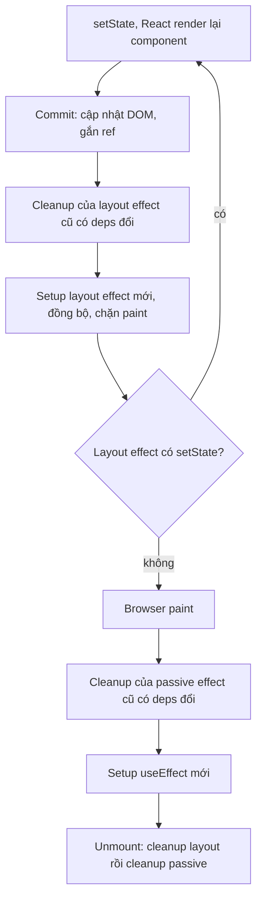
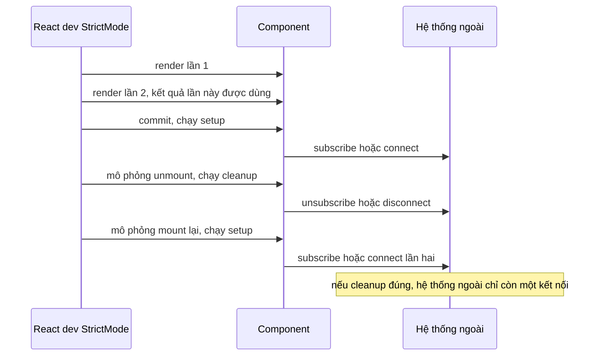

## Bối cảnh & vấn đề

Một dashboard báo cáo gửi hai request `POST /track` mỗi lần mở trang ở môi trường dev; dev "sửa" bằng cách xoá `<StrictMode>`. Tháng sau, production có một leak: mỗi lần user chuyển tab trong app, một WebSocket mới được mở mà cái cũ không đóng. Cùng lúc, một component báo cáo làm backend nhận hàng trăm request mỗi giây vì `useEffect(..., [query])` với `query` là object tạo trong render. Và một đồng hồ đếm giây đứng ở số 1 mãi mãi.

Cả bốn sự cố đều về **effect**, công cụ bị dùng sai nhiều nhất trong React. Effect được thiết kế cho một việc hẹp: **đồng bộ component với một hệ thống bên ngoài React** (DOM API, network, subscription, widget không phải React, timer). Phần lớn bug đến từ việc dùng effect cho việc khác (tính derived state, phản ứng với event của user), hoặc từ việc không hiểu effect là một cặp **setup/cleanup** chạy lại mỗi khi dependency đổi.

Bài này trình bày vòng đời thật của effect (có log chạy thật), vì sao StrictMode chạy effect hai lần, `useEffect` khác `useLayoutEffect` ở đâu, danh sách tình huống **không** cần effect, stale closure, `useEffectEvent` của React 19.2, và cách phân tích một vòng lặp render vô hạn. Data fetching trong effect có bài riêng: [data fetching, SSR & RSC](/tracks/react/learn/data-fetching-ssr-rsc).

**Interview angle:** `react-013` ("khi nào không cần effect?") là câu hỏi yêu thích của interviewer senior vì nó đo việc bạn đã đọc "You Might Not Need an Effect" và áp dụng vào code thật.

## Khái niệm

### Effect là gì

**Effect** là code chạy **sau commit** để đồng bộ component với thứ nằm ngoài React. Nó có hai nửa: **setup** (kết nối, subscribe, gắn listener, bắt đầu timer) và **cleanup** (ngắt kết nối, unsubscribe, gỡ listener, clear timer). Cleanup là function mà setup trả về.

```tsx
useEffect(() => {
  const conn = createConnection(roomId); // setup
  conn.connect();
  return () => conn.disconnect();         // cleanup
}, [roomId]);
```

Cách nghĩ đúng không phải "chạy khi mount / khi update" mà là "**khi `roomId` là X, component phải kết nối tới X**". React tự lo phần "khi nào": nếu `roomId` đổi từ `general` sang `random`, nó chạy cleanup của `general` rồi setup của `random`.

### Dependency array

Tham số thứ hai liệt kê mọi **giá trị reactive** mà effect đọc: props, state, và mọi thứ tính từ chúng trong thân component. React so từng phần tử bằng `Object.is` với lần commit trước; khác thì chạy lại (cleanup cũ, setup mới).

- `[]`: không đọc giá trị reactive nào, chỉ setup khi mount và cleanup khi unmount.
- `[a, b]`: chạy lại khi `a` hoặc `b` đổi.
- Không có mảng: chạy lại sau **mọi** commit.

Dependency không phải thứ bạn "chọn" để điều khiển khi nào effect chạy; nó phải **khớp với code**. Lint `react-hooks/exhaustive-deps` kiểm tra điều đó. Nếu bạn không muốn effect chạy lại khi một giá trị đổi, hãy đổi code (updater function, `useEffectEvent`, đưa hằng số ra ngoài component), không xoá giá trị khỏi mảng.

### Cleanup chạy khi nào

Cleanup chạy trong hai trường hợp: **trước khi effect chạy lại** với giá trị mới, và khi **unmount**. Một chi tiết hay bị mô tả sai: cleanup **không** chạy "trước lần render tiếp theo". Nó chạy **sau** khi render mới đã được commit, ngay trước setup mới. Log thật bên dưới cho thấy thứ tự `render 1 → cleanup 0 → effect 1`. Hệ quả: cleanup thấy giá trị của **render cũ** (closure của effect cũ), không phải giá trị mới.

### useEffect và useLayoutEffect

Cả hai chạy sau khi React đã cập nhật DOM. Khác biệt là thời điểm so với **paint** (lúc browser vẽ pixel):

- **`useLayoutEffect`** chạy **đồng bộ ngay sau commit, trước khi browser paint**. Code trong đó chặn paint. Nếu nó set state, React render lại đồng bộ trước paint, nên user không bao giờ thấy trạng thái trung gian.
- **`useEffect`** (passive effect) thường chạy **sau paint**, không chặn frame.

Dùng layout effect khi cần **đo DOM rồi sửa** trước khi user thấy: vị trí tooltip, khôi phục scroll, tránh nhấp nháy. Mặc định dùng `useEffect`. Một lưu ý từ tài liệu `useEffect`: khi effect được gây ra bởi một **tương tác rời rạc** như click, React có thể chạy effect **trước** paint; chỉ khi không do tương tác, React "thường" để browser paint trước. Vì vậy đừng dựa vào thời điểm chính xác của `useEffect` để đúng logic. Layout effect không chạy trên server (SSR).

**Interview angle:** `react-005`, follow-up tooltip nhấp nháy: đo `getBoundingClientRect()` trong `useLayoutEffect`, set vị trí, React render lại trước paint, tooltip xuất hiện đúng chỗ ngay frame đầu.

### StrictMode chạy effect hai lần

`<StrictMode>` là công cụ **chỉ dành cho development**. Nó (1) gọi render function hai lần để lộ render không thuần, (2) khi mount, chạy **setup → cleanup → setup** cho mọi effect để lộ effect thiếu cleanup, (3) gọi ref callback hai lần, và (4) cảnh báo API cũ. Production không làm gì trong số này.

Lần chạy thứ hai không phải bug của React. Nó mô phỏng việc component bị unmount rồi mount lại, chuyện xảy ra thật khi user rời trang và quay lại, hay với `<Activity>` ở React 19.2 ([bài concurrent](/tracks/react/learn/concurrent-rendering)). Nếu effect chạy hai lần gây hỏng (hai subscription, hai WebSocket), nghĩa là cleanup thiếu. Nếu nó gây hai request `POST /track`, nghĩa là logic đó không thuộc về effect.

**Interview angle:** `react-010`: red flag là "xoá StrictMode" hoặc "thêm `useRef` cờ `didRun`". Cả hai che bug thay vì sửa.

### Khi nào không cần effect

Danh sách từ react.dev, kèm cách thay:

1. **Derived state** (tính từ props/state khác): tính thẳng trong render. `const total = items.reduce(...)`. Nếu nặng, `useMemo`.
2. **Phản ứng với event của user** (submit, click, gửi analytics khi bấm mua): làm trong **event handler**. Effect chỉ nên chạy vì component **được hiển thị**, không vì user làm gì.
3. **Reset toàn bộ state khi prop đổi**: `<Profile key={userId} />` ([bài reconciliation](/tracks/react/learn/reconciliation-keys)).
4. **Điều chỉnh một phần state khi prop đổi**: so với "prop trước" trong render (hiếm), hoặc thiết kế lại để không cần.
5. **Chuỗi effect set state nối nhau** (A đổi → effect set B → effect set C): gom tính toán vào một handler hoặc reducer.
6. **Thông báo cho cha về thay đổi state**: gọi `onChange` trong cùng handler set state, không qua effect.
7. **Fetch data**: dùng data library hoặc framework; nếu tự viết thì phải có cleanup chống race.
8. **Khởi tạo app một lần** (đọc token, cấu hình analytics): code ở top-level module hoặc cờ module-level, không cần effect.

Cái còn lại, và là việc effect sinh ra để làm: đồng bộ với DOM API, subscription, widget non-React, network sync, timer.

### Stale closure

Mỗi render tạo ra các function mới "đóng" (closure) quanh snapshot của render đó. Một callback sống lâu (interval, listener, subscription) được tạo trong một effect chạy một lần sẽ **mãi mãi** thấy props và state của render đã tạo ra nó. Đó là **stale closure**. Ví dụ kinh điển: `setInterval(() => setSeconds(seconds + 1), 1000)` với deps `[]` luôn tính `0 + 1`.

Ba cách chữa, theo thứ tự ưu tiên: (1) không đọc giá trị: dùng updater `setSeconds(s => s + 1)`; (2) đưa giá trị vào deps và chấp nhận effect được tạo lại; (3) khi callback cần đọc giá trị mới nhất mà **không** muốn tạo lại subscription, dùng `useEffectEvent` (React 19.2) hoặc ref "latest value" (cách cũ).

### useEffectEvent (React 19.2)

`useEffectEvent(fn)` tạo một **Effect Event**: một function luôn đọc props và state **mới nhất**, nhưng **không reactive**, tức không cần và không được đưa vào deps. Nó tách phần logic "phản ứng như một event" khỏi phần "đồng bộ" của effect (verify).

Use case chuẩn: effect kết nối theo `roomId` (reactive, đổi phòng thì phải reconnect), nhưng khi có message thì đọc `muted` hay `theme` (đổi `muted` không nên reconnect). Giới hạn: chỉ gọi Effect Event **từ bên trong effect** (hoặc Effect Event khác); không truyền nó xuống component khác, không gọi trong render hay event handler thường. Lint cần `eslint-plugin-react-hooks` bản hỗ trợ 19.2 (verify).

Trước 19.2, pattern tương đương là "latest ref": `const mutedRef = useRef(muted); useEffect(() => { mutedRef.current = muted; });` rồi đọc `mutedRef.current` trong callback. Pattern này mong manh: dễ quên cập nhật ref, và ref được cập nhật trong effect nên có một khoảng ngắn nó còn giá trị cũ.

**Interview angle:** `react-040`: sai lầm lớn nhất là dùng `useEffectEvent` để "né" exhaustive-deps cho một giá trị **thật sự** nên làm effect chạy lại, gây bug đồng bộ âm thầm (ví dụ bọc cả `roomId` vào Effect Event: đổi phòng mà không reconnect).

## Cơ chế hoạt động

### Thứ tự trong một lần update



Sau khi render và commit xong, React xử lý layout effect của những component có deps đổi: chạy **tất cả cleanup cũ trước**, rồi mới setup mới. Nếu layout effect set state, React render và commit lại **trước** paint, đó là lý do layout effect sửa được vị trí tooltip mà không nhấp nháy. Sau paint (hoặc sớm hơn nếu update đến từ tương tác rời rạc), React chạy cleanup rồi setup của passive effect. Khi unmount, cả hai loại cleanup đều chạy.

### StrictMode khi mount



Điểm mấu chốt là bước "mô phỏng unmount": React **không** tạo component mới và state được giữ; nó chỉ chạy cleanup rồi setup lại để kiểm tra rằng cặp setup/cleanup đối xứng. Nếu đúng, trạng thái cuối cùng của hệ thống ngoài giống hệt như chỉ setup một lần.

## Ví dụ thực tế

Mọi output dưới đây là **output thật** (React 19.2.8, react-dom/client trong jsdom, bọc bằng `act`).

### Thứ tự render, layout effect, effect

```tsx
function Order() {
  const [c, setC] = useState(0);
  console.log(`  render ${c}`);
  useLayoutEffect(() => { console.log(`  layout effect ${c}`); return () => console.log(`  cleanup layout ${c}`); }, [c]);
  useEffect(() => { console.log(`  effect ${c}`); return () => console.log(`  cleanup effect ${c}`); }, [c]);
  return <button onClick={() => setC((x) => x + 1)}>{c}</button>;
}
// mount, click, unmount
```

```text
A) mount
  render 0
  layout effect 0
  effect 0
A) click
  render 1
  cleanup layout 0
  layout effect 1
  cleanup effect 0
  effect 1
A) unmount
  cleanup layout 1
  cleanup effect 1
```

Để ý `render 1` in **trước** `cleanup effect 0`: cleanup chạy sau render mới, và nó in `0`, giá trị của closure cũ. (Trong jsdom không có paint thật, nên log không cho thấy vị trí của paint; thứ tự tương đối giữa các bước là thật.)

### StrictMode và effect gửi analytics (react-010)

```tsx
function Track() {
  console.log("  render Track");
  useEffect(() => {
    console.log("  effect: POST /track");
    return () => console.log("  cleanup");
  }, []);
  return null;
}
// render trong <StrictMode>
```

```text
B) StrictMode mount
  render Track
  render Track
  effect: POST /track
  cleanup
  effect: POST /track
```

Sửa đúng tuỳ vào ý nghĩa của sự kiện. Nếu đó là "user đã **xem** trang" thì hai request ở dev là chấp nhận được (react.dev nói rõ production chỉ gửi một), hoặc gửi từ router/analytics ở cấp app. Nếu đó là "user đã **bấm mua**", nó thuộc về event handler, không thuộc về effect.

### Stale closure trong interval (react-015)

```tsx
function Timer({ fixed }: { fixed: boolean }) {
  const [s, setS] = useState(0);
  useEffect(() => {
    const id = setInterval(() => (fixed ? setS((x) => x + 1) : setS(s + 1)), 20);
    return () => clearInterval(id);
  }, []);
  return <p>{s}</p>;
}
// chờ khoảng 5 tick
```

```text
C) fixed=false after ~5 ticks: 1
C) fixed=true after ~5 ticks: 5
```

### useEffectEvent: đổi muted không reconnect (react-040)

```tsx
function Chat({ roomId, muted }: { roomId: string; muted: boolean }) {
  const onMessage = useEffectEvent((msg: string) => console.log(`  message ${msg}, muted=${muted}`));
  useEffect(() => {
    connects++;
    console.log(`  connect ${roomId}`);
    const id = setTimeout(() => onMessage("hi"), 5); // giả lập message đến
    return () => { clearTimeout(id); console.log(`  disconnect ${roomId}`); };
  }, [roomId]);
  return null;
}
// render general/muted=false, rồi general/muted=true, chờ, rồi random/muted=true
```

```text
G) useEffectEvent
  connect general
  message hi, muted=true
  disconnect general
  connect random
  message hi, muted=true
G) connects: 2
```

Kết nối được tạo khi `muted=false`, nhưng message đến sau khi `muted` đã thành `true` đọc được `muted=true`: Effect Event thấy giá trị mới nhất. Đổi `muted` không gây reconnect; đổi `roomId` thì có.

### Derived state qua effect (react-013)

```tsx
function WithEffect({ items }: { items: number[] }) {
  const [total, setTotal] = useState(0);
  useEffect(() => { setTotal(items.reduce((a, b) => a + b, 0)); }, [items]);
  console.log(`  WithEffect render: items=${items.length} total=${total}`);
  return <p>{total}</p>;
}
function Derived({ items }: { items: number[] }) {
  const total = items.reduce((a, b) => a + b, 0);
  console.log(`  Derived render: items=${items.length} total=${total}`);
  return <p>{total}</p>;
}
// render items=[10,20], rồi items=[10,20,30]
```

```text
WithEffect
  WithEffect render: items=2 total=0
  WithEffect render: items=2 total=30
  WithEffect render: items=3 total=30
  WithEffect render: items=3 total=60
Derived
  Derived render: items=2 total=30
  Derived render: items=3 total=60
```

Phiên bản effect render gấp đôi, và có một render (`items=3 total=30`) mà UI **sai**: ba item nhưng tổng của hai. Phiên bản tính trong render luôn đúng.

### Vòng lặp vô hạn (react-035)

```tsx
function Report({ filters }: { filters: Filters }) {
  const [data, setData] = useState<Row[]>([]);
  const query = { ...filters, page: 1 };            // object mới mỗi render
  useEffect(() => { fetchReport(query).then(setData); }, [query]);
  const [total, setTotal] = useState(0);
  setTotal(data.length);                             // setState trong render
  return <Table rows={data} />;
}
```

Hai nguyên nhân độc lập, kiểm chứng riêng từng cái:

```text
D) thrown: Too many re-renders. React limits the number of renders to prevent an infinite loop.
E) fetches in 50ms with object deps: 500
```

Dòng D: `setTotal` trong thân component làm React render lại ngay, lặp tới giới hạn rồi ném lỗi. Dòng E: sau khi bỏ `setTotal`, deps `[query]` đổi **mỗi** render (object mới), effect chạy, `setData` với mảng mới gây render, effect chạy tiếp; thí nghiệm dừng ở 500 lần gọi chỉ vì có giới hạn nhân tạo, không có nó vòng lặp chạy mãi (và bắn request thật tới server). Bản sửa:

```tsx
function Report({ filters }: { filters: Filters }) {
  const [data, setData] = useState<Row[]>([]);
  const { status, from, to } = filters;               // deps là primitive
  useEffect(() => {
    let ignore = false;
    fetchReport({ status, from, to, page: 1 }).then((rows) => { if (!ignore) setData(rows); });
    return () => { ignore = true; };                   // chống race
  }, [status, from, to]);
  const total = data.length;                           // derived, không phải state
  return <Table rows={data} />;
}
```

Tốt hơn nữa: data library với query key `["report", status, from, to]`.

### Effect async

`useEffect(async () => {...})` trả về một Promise thay vì cleanup. React 19.2 in:

```text
useEffect must not return anything besides a function, which is used for clean-up. It looks like you wrote useEffect(async () => ...) or returned a Promise. Instead, write the async function inside your effect and call it immediately:
```

## Trade-offs & lựa chọn thay thế

| Công cụ | Chạy khi | Hợp với | Tránh khi |
|---|---|---|---|
| Tính trong render | Mỗi render | Derived state | Tính toán rất nặng (dùng `useMemo`) |
| Event handler | User tương tác | Submit, analytics theo hành động, thông báo cha | Việc phải xảy ra vì component hiển thị |
| `useEffect` | Sau commit, thường sau paint | Subscription, timer, network sync, widget ngoài | Derived state, chuỗi set state |
| `useLayoutEffect` | Sau commit, trước paint | Đo DOM rồi sửa, tránh nhấp nháy | Việc nặng (chặn frame), SSR |
| `useEffectEvent` | Gọi từ trong effect | Đọc giá trị mới nhất không reactive | Giá trị thật sự cần đồng bộ lại |
| `useSyncExternalStore` | Khi store ngoài đổi | Subscribe store ngoài React | Dữ liệu chỉ nằm trong React |
| `key` | Khi key đổi | Reset mọi state theo entity | Cần giữ một phần state |

Chọn gì: bắt đầu bằng câu hỏi "code này chạy **vì sao**?". Vì user làm gì đó → event handler. Vì component đang hiển thị và phải khớp với hệ thống ngoài → effect. Vì dữ liệu này tính được từ dữ liệu khác → render. Còn giữa `useEffect` và `useLayoutEffect`, chỉ chuyển sang layout khi bạn **thấy** nhấp nháy; mỗi layout effect nặng làm chậm mọi frame.

## Edge cases & failure modes

- **Cleanup thiếu cho subscription.** Mỗi lần deps đổi (hoặc StrictMode mount), một listener mới được thêm mà cái cũ không gỡ; sau 50 lần chuyển tab là 50 WebSocket. Gỡ đúng **cùng reference** handler đã gắn.
- **Cleanup đọc giá trị mới.** Cleanup thấy closure cũ, nên `disconnect(roomId)` đúng phòng cũ. Nhưng nếu cleanup đọc `ref.current` (DOM node), node có thể đã bị thay; copy ra biến local trong setup.
- **Set state sau unmount.** React 18 đã bỏ warning "Can't perform a React state update on an unmounted component", vì nó thường là false positive. Việc thật cần lo là **race** (response cũ ghi đè mới), không phải "memory leak" từ việc set state.
- **Object/function trong deps.** Object tạo trong render đổi mỗi lần; effect chạy mỗi render. Dùng primitive, `useMemo`, hoặc đưa function vào trong effect.
- **Layout effect nặng.** Đo DOM nhiều node trong layout effect gây forced reflow và chặn paint; INP xấu đi.
- **Effect chạy trong `<Activity mode="hidden">`.** Khi bị ẩn, effect bị cleanup; khi hiện lại, setup chạy lại. Effect không đối xứng sẽ lỗi ở đây giống như ở StrictMode.
- **Chuỗi effect trong concurrent rendering.** Mỗi effect set state tạo thêm một render; chuỗi ba effect nghĩa là ba render cho một thay đổi, UI hiện các trạng thái trung gian.

## Pitfalls

- ❌ Xoá `<StrictMode>` hoặc dùng cờ `didRun` ref khi effect chạy hai lần → ✅ viết cleanup đối xứng, hoặc chuyển logic sang event handler.
- ❌ `useEffect(() => setFullName(first + " " + last), [first, last])` → ✅ `const fullName = first + " " + last` trong render.
- ❌ Set cờ `submitted` rồi effect bắt cờ để gửi request → ✅ gửi request ngay trong `onSubmit`.
- ❌ Xoá giá trị khỏi deps để effect "chỉ chạy một lần" → ✅ sửa code để effect không đọc giá trị đó (updater, `useEffectEvent`, hằng số ngoài component).
- ❌ `useEffect(async () => ...)` → ✅ khai báo async function bên trong effect và gọi nó; cleanup dùng cờ `ignore` hoặc `AbortController`.
- ❌ `setState` trong thân component → ✅ derived value tính thẳng; nếu thật sự cần điều chỉnh theo prop, đặt trong điều kiện so với giá trị trước.
- ❌ Bọc `roomId` vào `useEffectEvent` để tránh reconnect → ✅ `roomId` là reactive, phải nằm trong deps; chỉ bọc logic "phản ứng" như đọc `muted`.
- ❌ Dùng `useLayoutEffect` mặc định "cho chắc" → ✅ `useEffect` mặc định; layout chỉ khi cần đo và sửa DOM trước paint.

## Tóm tắt

- Effect **đồng bộ component với hệ thống bên ngoài React**; là một cặp **setup/cleanup** chạy lại khi dependency đổi.
- Deps phải **khớp với code** (lint `exhaustive-deps`); muốn ít chạy lại hơn thì sửa code, không xoá deps.
- Cleanup chạy **sau render mới được commit**, trước setup mới, và khi unmount; nó thấy closure của render cũ.
- `useLayoutEffect` chạy **trước paint**, chặn frame, dùng để đo và sửa DOM; `useEffect` thường sau paint (có thể sớm hơn với tương tác rời rạc).
- StrictMode (dev) chạy **setup → cleanup → setup** để lộ cleanup thiếu; production không làm vậy.
- Không cần effect cho: derived state, phản ứng với event, reset state (dùng `key`), chuỗi set state, thông báo cha.
- **Stale closure**: callback sống lâu thấy snapshot cũ; chữa bằng updater, deps đúng, hoặc `useEffectEvent` (19.2).
- Vòng lặp vô hạn thường do **setState trong render** hoặc **object mới trong deps**.
